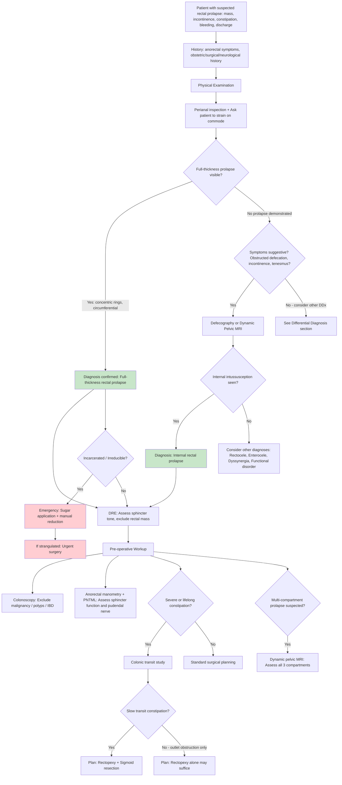

## Diagnosis of Rectal Prolapse: Diagnostic Criteria, Algorithm & Investigations

> Rectal prolapse is fundamentally a **clinical diagnosis** — you see it, you diagnose it. The challenge arises when the prolapse is intermittent or internal. That's when investigations become essential. The purpose of investigations is threefold: (1) confirm the diagnosis when clinical examination is equivocal, (2) characterise associated pelvic floor disorders to plan surgery, and (3) exclude sinister pathology (i.e., malignancy).

---

### 1. Diagnostic Criteria

There is no formal "diagnostic criteria" checklist for rectal prolapse (unlike, say, Rome IV for IBS). Instead, diagnosis rests on **demonstration of the prolapse** — either clinically or radiologically.

**The diagnosis of full-thickness rectal prolapse is made when:**
- A **circumferential, full-thickness protrusion of the rectal wall beyond the anal canal** is directly visualised [1][2]
- The prolapsed tissue shows ***concentric rings*** (not radial folds) [2]
- All layers of the rectal wall are involved (mucosa, submucosa, muscularis propria) — palpably thick when compressed between two fingers

**The diagnosis of internal prolapse (internal intussusception) is made when:**
- ***The rectum intussuscepts but does not pass beyond the anus*** [1]
- Demonstrated on **defecography or dynamic pelvic MRI** — there is no way to diagnose this reliably on clinical examination alone [2]

<Callout title="Key Principle">
If you can see concentric circumferential rings protruding through the anus, the diagnosis is made at the bedside. No further imaging is needed to confirm the prolapse itself. Investigations are then directed at pre-operative planning and excluding associated pathology.
</Callout>

---

### 2. Clinical Assessment — The Bedside Evaluation

The lecture slides [1] outline a systematic approach to anorectal disease assessment:

***Physical examination*** [1]:
1. ***General examination***
2. ***Abdominal examination***
3. ***Perianal examination***
4. ***Digital rectal examination***
5. ***Proctoscopy***

Let's break down each step in the context of rectal prolapse.

#### 2.1 History

***Approach to anorectal diseases — History*** [1]:
- ***Present illness (anorectal symptoms: pain, bleeding, mass, prolapse)*** [1]
- ***Past health (medical diseases, previous surgery)*** [1]
- ***Family history*** [1]
- ***Sexual history*** [1]

Specific points to elicit for rectal prolapse:
- **Mass protrusion**: When does it come out? (straining, standing, coughing?) Does it reduce spontaneously or need manual reduction? Is it now irreducible?
- ***Incontinence*** [1] — passive soiling vs urge incontinence; use validated scoring systems (Wexner/Cleveland Clinic Continence Score)
- ***Constipation*** [1] — lifelong vs acquired; straining, incomplete evacuation, digital manoeuvres (important for surgical planning — may need sigmoid resection)
- ***Bleeding, Discharge*** [1]
- ***Sensation of incomplete emptying, Rectal pressure/tenesmus*** [1]
- **Obstetric history**: parity, vaginal deliveries, perineal tears
- **Neurological history**: stroke, dementia, spinal cord disease
- **In children**: respiratory symptoms (cystic fibrosis?), whooping cough, developmental history

#### 2.2 ***Anorectal Examination*** [2]

**Inspection (Perianal examination):**
- Ask the patient to strain (ideally on a commode/toilet) — this is critical because the prolapse may only appear with Valsalva
- Look for: full-thickness protrusion with concentric rings, mucosal oedema/ulceration, perianal excoriation, patulous anus at rest
- Note: if the prolapse cannot be demonstrated in the left lateral position, have the patient squat or sit on a commode

**Key findings on inspection:**
- ***Full thickness protrusion of rectum — Concentric rings of rectum protruding through anus*** [2]

***Digital rectal examination (DRE)*** [2]:
- ***Anal sphincter weakness*** — reduced resting tone (IAS dysfunction) and reduced voluntary squeeze (EAS dysfunction) [2]
- ***Attenuated sphincter tone*** [2]
- ***Anorectal mass*** — in internal intussusception, the intussuscepted rectum may be palpable as a mass in the rectal lumen [2]
- ***Concomitant pelvic floor pathology — Cystocele / Rectocele / Uterine prolapse*** [2] — always perform a bimanual/vaginal examination in women

***Assessment*** [1]:
- ***Digital rectal examination (to exclude other rectal lesions)*** [1]
- ***Proctoscopy: for diagnosis and assessment of severity*** [1]
- ***Rigid or flexible sigmoidoscopy to exclude proximal bowel lesion*** [1]

<Callout title="Why DRE matters beyond just feeling the prolapse" type="idea">
DRE in rectal prolapse is about **assessing sphincter function** (which determines surgical approach and prognosis for continence recovery) and **excluding other rectal lesions** (especially low rectal carcinoma). Always document resting tone and squeeze pressure.
</Callout>

---

### 3. Investigation Modalities

The investigations can be organised into categories based on their purpose:

| Purpose | Investigation |
|---|---|
| **Confirm prolapse** (when not clinically demonstrable) | Defecography, Dynamic pelvic MRI |
| **Characterise pelvic floor anatomy** (multi-compartment assessment) | Dynamic pelvic MRI, Defecography |
| **Assess sphincter function** (predict continence outcomes) | Anorectal manometry, Endoanal USS, EMG, PNTML |
| **Exclude other pathology** (malignancy) | Colonoscopy, Sigmoidoscopy |
| **Assess colonic transit** (plan need for sigmoid resection) | Colonic transit study |

#### 3.1 ***Defecography*** [2]

> "Defeco-" = defecation; "-graphy" = imaging. You image the patient during simulated defecation.

**What is it?**
- ***Assessed by either traditional fluoroscopy or dynamic MRI*** [2]
- The patient's rectum is filled with barium paste (fluoroscopic) or ultrasound gel (MRI), and images are captured while the patient rests, squeezes, and strains on a commode

**Why is it done?**
- ***Reveals defects associated with rectal prolapse*** [2]
- It is the **gold standard** for demonstrating internal intussusception (occult prolapse) that cannot be seen clinically
- Also identifies enterocele, rectocele, cystocele, abnormal perineal descent, and paradoxical puborectalis contraction

**Key findings and interpretation:**

| Finding | Significance |
|---|---|
| Rectal wall infolding/telescoping during straining | Internal intussusception (Oxford Grade I–III) |
| Full-thickness rectal wall descending past the anal canal | External rectal prolapse confirmed |
| Anterior rectal wall indentation by small bowel | Enterocele (peritoneal sac herniating into rectovaginal space) |
| Posterior vaginal wall bulging into rectal lumen | Rectocele |
| Perineal descent > 3 cm below pubococcygeal line during straining | Abnormal perineal descent |
| Puborectalis impression on the posterior rectum not relaxing during straining | Paradoxical puborectalis contraction (dyssynergic defecation) |
| Incomplete rectal emptying | Obstructed defecation |

#### 3.2 ***Dynamic Pelvic MRI*** [2]

**What is it?**
- MRI sequences acquired dynamically (cine-MRI) while the patient rests and strains, ideally on an open-configuration MRI with a commode
- Provides the same functional information as fluoroscopic defecography but **without radiation** and with superior soft-tissue contrast

***Indicated in patients for whom prolapse cannot be reproduced on physical examination or when symptoms are suggestive of additional pelvic floor disorder*** [2]

**Key advantages over fluoroscopic defecography:**
- Simultaneously visualises all three pelvic floor compartments (anterior = bladder/urethra, middle = uterus/vagina, posterior = rectum) → ideal for multi-compartment prolapse assessment
- No ionising radiation
- Better identification of levator ani diastasis and puborectalis morphology

**Limitation:** Some patients cannot strain effectively in a supine or semi-upright MRI → may miss prolapse. An upright/open MRI is preferable but not universally available.

#### 3.3 ***Pelvic Physiology Studies*** [2]

***Evaluation of faecal incontinence secondary to obstetrical injuries*** [2]. These are pre-operative tests that help predict functional outcomes after surgery and guide the choice of procedure.

##### 3.3.1 ***Anorectal Manometry*** [2]

**What is it?** A catheter with pressure sensors is inserted into the rectum and anal canal to measure pressures.

**Key measurements and interpretation:**

| Parameter | What it measures | Clinical significance in rectal prolapse |
|---|---|---|
| **Resting anal pressure** | IAS function (contributes ~80% of resting tone) | Low in rectal prolapse → chronic sphincter stretch → passive incontinence |
| **Maximum squeeze pressure** | EAS function (voluntary contraction) | Low → pudendal neuropathy or direct EAS injury → urge incontinence |
| **Squeeze duration** | EAS fatiguability | Shortened in neuropathic sphincter |
| **Rectal sensation thresholds** | First sensation, urge, maximum tolerable volume | May be elevated (reduced rectal sensitivity) in prolapse |
| **Rectoanal inhibitory reflex (RAIR)** | IAS relaxation in response to rectal distension | Present in rectal prolapse (absent in Hirschsprung disease — useful distinction in paediatric cases) |
| **Rectal compliance** | Ability of the rectal wall to stretch | May be abnormal |

**Why this matters:** If manometry shows very poor sphincter pressures pre-operatively, the surgeon knows that even a successful rectopexy may not fully restore continence — the patient should be counselled accordingly.

##### 3.3.2 ***Electromyography (EMG)*** [2]

**What is it?** Needle or surface EMG electrodes assess electrical activity of the EAS and puborectalis muscles.

**Key findings:**
- Denervation changes (fibrillation potentials, reduced motor unit recruitment) → pudendal neuropathy
- Paradoxical puborectalis contraction during straining → dyssynergic defecation (outlet obstruction)

##### 3.3.3 ***Pudendal Nerve Terminal Motor Latency (PNTML)*** [2]

**What is it?** The pudendal nerve is electrically stimulated transrectally (St. Mark's pudendal nerve electrode), and the time for the signal to reach the EAS is measured.

**Key findings and interpretation:**
- **Normal PNTML**: ≤ 2.0 ms
- **Prolonged PNTML**: > 2.0 ms → pudendal neuropathy → predicts poorer recovery of continence after surgery
- **Clinical significance**: If PNTML is prolonged bilaterally, the chance of continence improvement after rectopexy is lower — important for patient counselling and surgical decision-making

**Why does pudendal neuropathy occur in rectal prolapse?** The pudendal nerve (S2–S4) courses through Alcock's canal along the lateral pelvic wall and is vulnerable to stretch injury during chronic straining (excessive perineal descent stretches the nerve around the ischial spine). This leads to denervation of the EAS → sphincter weakness → faecal incontinence.

##### 3.3.4 Endoanal Ultrasonography (EAUS)

**What is it?** A 360° rotating ultrasound probe is inserted into the anal canal to image the sphincter complex.

**Key findings:**
- Sphincter defects (tears/gaps in IAS or EAS) — important to identify especially in women with prior obstetric injury
- Sphincter atrophy (thinning)

**Clinical significance:** If a sphincter defect is identified, an overlapping sphincter repair may be considered at the time of prolapse surgery. If sphincter integrity is preserved but tone is low, the problem is likely neuropathic.

#### 3.4 ***Colonoscopy*** [2]

***Detects other pathology such as malignancy*** [2]

**Why is it essential?**
- ***Colorectal neoplasm needs to be excluded*** [1] in any patient with anorectal symptoms — especially with PR bleeding, change in bowel habit, or new-onset symptoms in patients > 45 years
- Also identifies inflammatory bowel disease, diverticular disease, solitary rectal ulcer, and polyps
- In pre-operative assessment, identifies the state of the colon (redundant sigmoid, diverticulosis) which influences surgical planning

**When to perform:**
- All patients with rectal prolapse being considered for surgery should ideally have a colonoscopy as part of pre-operative workup
- Especially if: age > 45–50, PR bleeding, change in bowel habits, family history of CRC [4]

#### 3.5 ***Colonic Transit Study*** [2]

***Performed for operative candidates that have a severe or lifelong history of constipation to determine if sigmoid colectomy is indicated to treat rectal prolapse*** [2]

**What is it?**
- The patient swallows radio-opaque markers (Sitzmarks) on Day 0, and abdominal X-rays are taken on Day 3 and Day 5
- Normal: ≥ 80% of markers passed by Day 5
- Slow transit constipation: markers retained throughout the colon (especially right colon)
- Outlet obstruction: markers accumulate in the rectosigmoid region

**Why this matters for rectal prolapse surgery:**
- If the patient has **slow transit constipation** (markers retained globally), a rectopexy alone may not improve constipation — adding a **sigmoid resection** (or even subtotal colectomy in severe cases) is indicated [2]
- If the patient has **outlet obstruction** only (markers retained in rectosigmoid), rectopexy alone may resolve the constipation by correcting the mechanical obstruction
- This is a critical investigation because **constipation is the most common complaint after rectopexy** if slow transit is not addressed pre-operatively

#### 3.6 Additional/Adjunctive Investigations

| Investigation | Indication | Key findings |
|---|---|---|
| **Sigmoidoscopy (rigid or flexible)** | ***Exclude proximal bowel lesion*** [1] — complement to DRE and proctoscopy | Rectal ulcer, polyp, mass; assess mucosal health |
| **Sweat chloride test** | Children with rectal prolapse — to exclude cystic fibrosis | Cl⁻ > 60 mmol/L = diagnostic of CF |
| **Bloods (FBC, iron studies)** | Any patient with PR bleeding | Iron deficiency anaemia from chronic blood loss |
| **Stool cultures** | If associated diarrhoea | Exclude infectious causes |

---

### 4. Diagnostic Algorithm

---

### 5. Summary of Investigations with Key Findings

| Investigation | Purpose | Key Findings in Rectal Prolapse | When to Order |
|---|---|---|---|
| **Perianal inspection + Straining** | Confirm diagnosis | Concentric circumferential rings protruding through anus | Every patient — first-line |
| ***DRE*** [1][2] | Sphincter assessment, exclude mass | Reduced resting tone, reduced squeeze, palpable intussusception, exclude rectal tumour | Every patient |
| ***Proctoscopy*** [1] | Assess severity, mucosal health | Mucosal oedema, ulceration, exclude haemorrhoids | Every patient |
| ***Sigmoidoscopy*** [1] | Exclude proximal lesion | Solitary rectal ulcer, polyp, mass | Every patient |
| ***Colonoscopy*** [2] | Exclude malignancy and other pathology | Colorectal cancer, polyps, IBD, diverticulosis, redundant sigmoid | All surgical candidates; age > 45–50; PR bleeding |
| ***Defecography*** [2] | Confirm occult prolapse; assess pelvic floor dynamics | Internal intussusception, enterocele, rectocele, perineal descent, paradoxical puborectalis | Prolapse not demonstrable clinically; suspected internal intussusception |
| ***Dynamic pelvic MRI*** [2] | Multi-compartment pelvic floor assessment | As above + levator ani diastasis, cystocele, uterine descent | Cannot reproduce prolapse; suspected multi-compartment prolapse |
| ***Anorectal manometry*** [2] | Quantify sphincter function | Low resting pressure (IAS), low squeeze pressure (EAS), abnormal sensation | Pre-operative assessment |
| ***EMG*** [2] | Assess sphincter denervation | Denervation potentials, paradoxical puborectalis contraction | Pre-operative; suspected dyssynergia |
| ***PNTML*** [2] | Assess pudendal nerve integrity | Prolonged latency > 2.0 ms = neuropathy → poorer continence prognosis | Pre-operative assessment of incontinence |
| **Endoanal USS** | Image sphincter anatomy | Sphincter defects (tears), atrophy | Pre-operative; suspected obstetric sphincter injury |
| ***Colonic transit study*** [2] | Determine need for sigmoid resection | Slow transit (global marker retention) vs outlet obstruction (rectosigmoid retention) | Severe/lifelong constipation in surgical candidates |
| **Sweat chloride test** | Exclude CF in children | Cl⁻ > 60 mmol/L = CF | All children with rectal prolapse |

---

<Callout title="High Yield Summary">

1. **Rectal prolapse is a clinical diagnosis** — demonstrate the prolapse by asking the patient to strain, ideally on a commode. Look for **concentric circumferential rings**.
2. ***Assessment triad from lectures***: DRE (exclude other lesions, assess tone) → Proctoscopy (severity) → Sigmoidoscopy (exclude proximal lesion).
3. **If prolapse cannot be demonstrated clinically** → ***Defecography or Dynamic pelvic MRI*** to identify internal intussusception or multi-compartment prolapse.
4. ***Pelvic physiology studies (manometry, EMG, PNTML)*** are for **pre-operative assessment** — they predict continence outcomes and guide surgical planning, not diagnosis per se.
5. ***Colonoscopy*** is mandatory in surgical candidates to **exclude malignancy** and characterise colonic anatomy.
6. ***Colonic transit study*** is essential in patients with **severe or lifelong constipation** — determines whether sigmoid colectomy should be added to rectopexy.
7. **PNTML > 2.0 ms** = pudendal neuropathy → poorer prognosis for continence recovery after surgery → counsel patient accordingly.
8. In children, **always perform a sweat chloride test** to exclude cystic fibrosis.

</Callout>

---

<ActiveRecallQuiz
  title="Active Recall - Diagnosis of Rectal Prolapse"
  items={[
    {
      question: "What is the gold standard investigation for diagnosing internal rectal prolapse (internal intussusception) and why is it needed?",
      markscheme: "Defecography (fluoroscopic or dynamic MRI). It is needed because internal intussusception does not protrude beyond the anus and therefore cannot be seen on clinical inspection. Defecography images the rectum during simulated straining and can demonstrate the telescoping of the rectal wall.",
    },
    {
      question: "List the three-step assessment outlined in the lecture slides for anorectal disease, and state the purpose of each step.",
      markscheme: "1. DRE - to exclude other rectal lesions and assess sphincter tone. 2. Proctoscopy - for diagnosis and assessment of severity. 3. Rigid or flexible sigmoidoscopy - to exclude proximal bowel lesion.",
    },
    {
      question: "Why is a colonic transit study performed in patients with rectal prolapse who have severe constipation, and how does it change surgical management?",
      markscheme: "It determines whether constipation is due to slow transit (global marker retention) or outlet obstruction (rectosigmoid retention). If slow transit constipation is identified, sigmoid resection should be added to rectopexy to address constipation; if outlet obstruction only, rectopexy alone may suffice.",
    },
    {
      question: "What does a prolonged PNTML indicate, what is the normal value, and why is it clinically important in rectal prolapse?",
      markscheme: "PNTML > 2.0 ms indicates pudendal neuropathy (normal is 2.0 ms or less). It predicts poorer recovery of continence after surgical repair of rectal prolapse because the denervated external anal sphincter is less likely to regain function. Important for patient counselling pre-operatively.",
    },
    {
      question: "A 3-year-old child presents with rectal prolapse. What specific investigation should be performed and why?",
      markscheme: "Sweat chloride test to exclude cystic fibrosis. Rectal prolapse may be the presenting feature in up to 20% of children with CF due to chronic cough (raised intra-abdominal pressure), steatorrhoea (bulky stools), and malnutrition (loss of perirectal fat pad). Chloride > 60 mmol/L is diagnostic.",
    },
    {
      question: "What is the advantage of dynamic pelvic MRI over fluoroscopic defecography in evaluating rectal prolapse?",
      markscheme: "Dynamic pelvic MRI simultaneously visualises all three pelvic floor compartments (anterior - bladder, middle - uterus/vagina, posterior - rectum) without ionising radiation and with superior soft-tissue contrast. It can identify levator ani diastasis and puborectalis morphology. Ideal for multi-compartment pelvic organ prolapse assessment.",
    },
  ]}
/>

---

## References

[1] Lecture slides: GC 179. Anal pain perianal lesions and sepsis.pdf (p3, p4, p7, p28, p65–69, p77)
[2] Senior notes: felixlai.md (Rectal prolapse — Diagnosis section, pp. 762–763)
[3] Senior notes: maxim.md (Acute painful anal mass; Incarcerated rectal prolapse management)
[4] Senior notes: maxim.md (Haemorrhoids — Examination; indications for colonoscopy)
