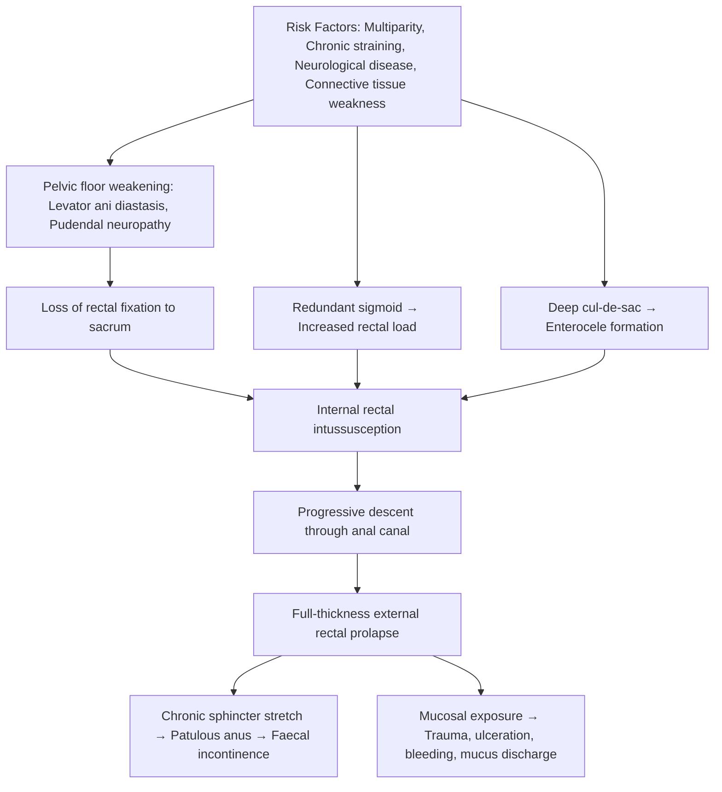

# Rectal Prolapse (Rectal Procidentia)

> "Procidentia" comes from Latin *procidere* = "to fall forward." That's literally what happens — the rectum falls forward and out through the anus.

---

## 1. Definition

***Rectal prolapse*** is a **full thickness protrusion of the rectum through the anal sphincters** [1]. It is fundamentally a **pelvic floor disorder** in which the supporting structures of the rectum fail, allowing the rectal wall to telescope (intussuscept) and eventually protrude beyond the anal verge.

Key conceptual distinction [1][2]:

| Term | What prolapses | Key feature |
|---|---|---|
| **Complete (full-thickness) rectal prolapse** | All layers of the rectal wall (mucosa, submucosa, muscularis propria, serosa/adventitia) | Circumferential concentric mucosal rings visible at anus |
| **Partial (mucosal) prolapse** | Mucosa only | Radial folds (like spokes of a wheel), usually < 4 cm protrusion |
| ***Internal prolapse (internal intussusception)*** | ***Rectum intussuscepts but does not pass beyond the anus*** | Not visible externally; detected on defecography/dynamic MRI |

<Callout title="Exam Pearl — Concentric vs Radial Folds">
Full-thickness rectal prolapse shows **concentric rings** (like a target). Mucosal prolapse and prolapsed haemorrhoids show **radial folds** (like spokes). This is the single most important clinical distinction on inspection.
</Callout>

---

## 2. Epidemiology

- ***Occurs at any age but more commonly at extremes of life*** [1]:
  - **Elderly women** (peak incidence in 7th–8th decade): the vast majority of adult cases
  - **Children** (typically < 3 years): usually self-limiting mucosal prolapse
- **Female predominance** in adults — approximately **80–90%** of adult patients are women, most > 50 years old [2]
- Male-to-female ratio roughly 1:6 in adults
- In children, roughly equal sex distribution; often resolves by age 5 with conservative management
- In Hong Kong, the ageing population and high prevalence of chronic constipation make this a clinically relevant condition in elderly patients presenting to colorectal surgery

**Why predominantly elderly women?**
- Cumulative pelvic floor injury from childbirth (pudendal nerve stretch, levator ani disruption)
- Postmenopausal decline in oestrogen → loss of connective tissue strength in pelvic floor supports
- Age-related sarcopenia of pelvic floor muscles
- Higher prevalence of chronic constipation and straining in this demographic

---

## 3. Anatomy & Function (Understanding the Supports of the Rectum)

To understand *why* the rectum prolapses, you need to understand what keeps it in place.

### 3.1 The Pelvic Floor

The **pelvic floor** (pelvic diaphragm) is a muscular sling that separates the true pelvis from the perineum. It is composed of:

- **Levator ani** — the key muscle group, comprising:
  - **Puborectalis** — U-shaped sling around the anorectal junction; creates the anorectal angle (~80–90° at rest). Maintains continence by creating a "kink" at the anorectal junction.
  - **Pubococcygeus** — runs from pubis to coccyx, supports pelvic viscera
  - **Iliococcygeus** — the most posterior/lateral part; forms a horizontal shelf
- **Coccygeus (ischiococcygeus)** — posterior part of the pelvic floor

### 3.2 Fixation of the Rectum

The rectum is held in place by:

1. **Lateral ligaments of the rectum** (containing the middle rectal vessels and autonomic nerves)
2. **Mesorectal fascia (Waldeyer's fascia)** — anchors the rectum to the presacral fascia of the sacrum
3. **Peritoneal reflection** — the anterior peritoneum reflects off the rectum at the rectovesical pouch (males) or rectouterine pouch (Pouch of Douglas, females). A ***deep cul-de-sac (Pouch of Douglas)*** [1] means the peritoneum extends abnormally low, allowing a peritoneal sac (containing small bowel = enterocele) to herniate anteriorly and push the rectum down
4. **Puborectalis sling** — maintains the anorectal angle
5. **Anal sphincter complex** — internal anal sphincter (IAS, smooth muscle, involuntary) and external anal sphincter (EAS, striated muscle, voluntary)

### 3.3 Relevant Innervation

- **Pudendal nerve (S2–S4)** — motor to EAS and sensory to perineum
  - Chronic straining and stretch injury → ***pudendal neuropathy*** [1] → weakened EAS → faecal incontinence
- **Autonomic (pelvic splanchnic) nerves** — control IAS tone, rectal sensation

<Callout title="Why does the rectum prolapse?" type="idea">
Think of rectal prolapse as a "perfect storm" of anatomical failures: the pelvic floor muscles weaken (levator ani diastasis), the rectal attachments loosen (loss of rectal fixation), the sigmoid becomes redundant and heavy, the anal sphincter becomes patulous, and the pudendal nerves are damaged. No single factor is sufficient — it is multi-factorial.
</Callout>

---

## 4. Aetiology & Risk Factors

### 4.1 Anatomical Abnormalities Associated with Rectal Prolapse

***The following anatomical abnormalities are classically associated*** [1]:

| Abnormality | Explanation |
|---|---|
| ***Rectal intussusception*** | The rectum telescopes into itself — this is the initiating event; internal prolapse precedes external prolapse |
| ***Deep cul-de-sac (Pouch of Douglas)*** | Low peritoneal reflection allows a hernia sac to push the anterior rectal wall downward |
| ***Loss of rectal fixation*** | Weakened lateral ligaments and mesorectal fascia → rectum is no longer anchored to sacrum |
| ***Redundant sigmoid colon*** | Excess sigmoid length and mobility → increased weight bearing on the rectum; the sigmoid "pushes" the rectum down |
| ***Levator ani diastasis*** | Separation/weakening of the levator ani muscles → loss of pelvic floor support |
| ***Patulous anal sphincter*** | Chronically weakened, gaping anal sphincter → no resistance to prolapsing rectum |
| ***Pudendal neuropathy*** | Stretch injury to pudendal nerve → denervation of EAS → sphincter weakness and faecal incontinence |

### 4.2 Risk Factors (Organised by Category)

**Demographics [2]:**
- Female sex
- Age > 40 (especially > 60)

***Neurological disorders*** [1]:
- Stroke, dementia, spinal cord lesions, multiple sclerosis, cauda equina syndrome
- Mechanism: impaired voluntary sphincter control and pelvic floor coordination

***Parity*** [1]:
- Multiparity, especially vaginal delivery [2]
- Mechanism: pudendal nerve stretch injury during labour; direct trauma to levator ani and anal sphincter

***Constipation (25–50% of patients)*** [1]:
- Chronic straining → repetitive pelvic floor descent → pudendal nerve stretch injury → sphincter weakness → further prolapse
- Chronic faecal loading → sigmoid elongation and redundancy

**Chronic diarrhoea [2]:**
- Frequent defecation with straining → repetitive pelvic floor stress

**Pelvic floor dysfunction [2]:**
- Paradoxical puborectalis contraction (dyssynergic defecation) — puborectalis contracts instead of relaxing during defecation → obstruction → straining
- Non-relaxing puborectalis
- Abnormal perineal descent (> 3 cm descent during straining)

**Pelvic floor anatomical defects [2]:**
- Rectocele (posterior vaginal wall herniation)
- Cystocele (bladder prolapse)
- Enterocele (small bowel hernia into rectovaginal space)
- Uterine prolapse
- These often coexist → "multi-compartment pelvic organ prolapse"

**Prior pelvic surgery [2]:**
- Previous hysterectomy disrupts pelvic floor support structures

***Childhood causes*** [1]:
- ***Cystic fibrosis*** — rectal prolapse may be the presenting feature in up to 20% of CF children (chronic cough → raised intra-abdominal pressure; malnutrition → loss of perirectal fat pad)
- ***Whooping cough (pertussis)*** — paroxysmal coughing → raised intra-abdominal pressure
- ***Developmental abnormalities*** (e.g., meningomyelocele → denervated pelvic floor)
- ***Malnutrition*** — loss of ischiorectal fat pad that normally supports the rectum
- Ehlers-Danlos syndrome and other connective tissue disorders

<Callout title="Childhood Rectal Prolapse & Cystic Fibrosis" type="error">
In a child presenting with rectal prolapse, **always consider cystic fibrosis** — it should be excluded with a sweat chloride test. This is a classic exam question. The mechanism is multifactorial: chronic cough (↑ intra-abdominal pressure), steatorrhoea (bulky stools), and malnutrition (loss of perirectal fat).
</Callout>

---

## 5. Pathophysiology

Understanding the pathophysiology requires integrating the anatomical and aetiological factors above into a coherent sequence.

### 5.1 The "Sliding Hernia" Theory (Moschcowitz, 1912)
- Rectal prolapse is essentially a **sliding hernia** through the pelvic floor defect
- A peritoneal sac (hernial sac from the deep Pouch of Douglas) protrudes anteriorly, dragging the anterior rectal wall with it
- This explains why enteroceles (small bowel within the hernial sac) are frequently found within the prolapse

### 5.2 The "Intussusception" Theory (Broden & Snellman, 1968) — Currently Favoured
- Rectal prolapse begins as an **internal intussusception** (the rectum telescopes into itself)
- Over time, with repeated straining, the intussusception progresses distally until the leading edge passes through the anal canal → full external prolapse
- This is supported by defecography findings

### 5.3 Integrated Pathophysiological Sequence

### 5.4 Why Specific Symptoms Occur (linked to pathophysiology)

| Symptom | Pathophysiological basis |
|---|---|
| **Visible mass at anus** | Full-thickness rectal wall protruding through anus |
| **Faecal incontinence (up to 75%)** | Chronic stretch of anal sphincter complex → sphincter weakness; pudendal neuropathy → EAS denervation; loss of anorectal angle due to puborectalis dysfunction |
| **Constipation (15–65%)** | Paradoxical puborectalis contraction; internal intussusception causes outlet obstruction; redundant sigmoid causes slow transit |
| **Mucus discharge** | Exposed rectal mucosa secretes mucus; chronic mucosal congestion and inflammation |
| **Rectal bleeding** | Mechanical trauma to exposed, congested mucosa; solitary rectal ulcer from ischaemic pressure of the leading point of intussusception |
| **Pain** | Mucosal ulceration; sphincter spasm; incarceration or strangulation of prolapse (acute presentation) |
| **Incomplete evacuation / Tenesmus** | Internal intussusception acts as a mechanical plug (outlet obstruction); the patient feels the intussuscepted mass in the rectum and strains more → vicious cycle |
| **Need for digital manoeuvres** | Patients push back the prolapse or digitally splint the rectovaginal septum/perineum to facilitate evacuation |

---

## 6. Classification

### 6.1 By Degree of Prolapse

| Type | Description |
|---|---|
| **Grade I (Internal intussusception / Occult prolapse)** | Rectum intussuscepts but does not protrude beyond the anus. Not visible externally. Detected on defecography. |
| **Grade II (External mucosal prolapse / Partial prolapse)** | Only the mucosa protrudes beyond the anal verge (< 4 cm). Radial folds visible. |
| **Grade III (Complete / Full-thickness prolapse)** | All layers of the rectal wall protrude beyond the anus. Concentric rings visible. This is "true" rectal prolapse / procidentia. |

### 6.2 Oxford Classification of Internal Rectal Prolapse (Defecographic)

Used on defecography/dynamic MRI to grade internal intussusception:

| Grade | Description |
|---|---|
| I | Recto-rectal intussusception (rectum folds onto itself above the anal canal) |
| II | Recto-anal intussusception (intussusception reaches the anal canal) |
| III | Recto-anal intussusception with external protrusion (= overt rectal prolapse) |

### 6.3 Practical Clinical Classification

In clinical practice, rectal prolapse is often simply described as:
- **Reducible** — can be manually replaced
- **Irreducible (incarcerated)** — cannot be pushed back → at risk of strangulation
- **Strangulated** — vascular compromise → ischaemia → necrosis → surgical emergency

---

## 7. Clinical Features

### 7.1 Symptoms

| Symptom | Pathophysiological Basis | Notes |
|---|---|---|
| **Sensation of a mass / "something coming down"** | Full-thickness rectal wall protruding through anus during straining; initially reduces spontaneously, later requires manual reduction, eventually irreducible | Most common presenting complaint |
| **Abdominal discomfort** [2] | Traction on mesentery and sigmoid colon; internal intussusception causing obstructive symptoms | Often vague, poorly localised |
| **Mucus or stool discharge** [2] | Exposed rectal mucosa secretes mucus continuously; patulous sphincter allows passive stool leakage | Causes perianal skin irritation and pruritus ani |
| **Altered bowel habits** [2] | — | — |
| — **Constipation (15–65%)** [2] | Internal intussusception → outlet obstruction; paradoxical puborectalis contraction; redundant sigmoid → slow transit | Constipation is both a cause AND a consequence |
| — ***Faecal incontinence (75%)*** [2] | Chronic sphincter stretch → mechanical sphincter damage; pudendal neuropathy → denervation of EAS; loss of anorectal angle; sampling reflex impaired by exposed mucosa | Very high prevalence; major driver of reduced quality of life |
| **Incomplete bowel evacuation / Tenesmus** [2] | Intussusception acts as a plug; the patient senses the mass as residual stool and strains further | Leads to a vicious cycle of straining |
| **Straining to initiate or complete defecation** [2] | Outlet obstruction from intussusception; dyssynergic defecation | — |
| **Use of digital manoeuvres to aid defecation** [2] | Patients manually reduce the prolapse or digitally splint perineum/posterior vaginal wall to overcome outlet obstruction | Important to ask about specifically in history |
| **Pain** [2] | Usually mild unless incarcerated/strangulated; mucosal ulceration; sphincter spasm | Severe pain = think incarceration or strangulation |
| **Rectal bleeding (fresh blood per rectum)** [2] | Mechanical trauma and friction on exposed, congested mucosa; associated solitary rectal ulcer | Usually minor; massive bleeding is rare |
| **Seepage** [2] | Passive leakage of mucus/stool through the patulous, incompetent sphincter | — |

### 7.2 Signs

| Sign | Pathophysiological Basis | Notes |
|---|---|---|
| **Full-thickness protrusion of rectum with concentric rings** [2] | All layers of rectal wall protruding; concentric ring appearance due to circumferential mucosal folds | Pathognomonic sign. Best demonstrated by asking the patient to strain on a commode/toilet |
| **Patulous (gaping) anus at rest** | Chronic stretch and denervation of sphincter complex | Anus does not "wink" on stroking perianal skin (absent anocutaneous reflex) |
| **Reduced anal sphincter tone on DRE** [2] | Sphincter damage (mechanical + neuropathic) | Important to document baseline tone and squeeze pressure |
| **Attenuated sphincter tone** [2] | As above — both resting tone (IAS) and voluntary squeeze (EAS) may be reduced | — |
| **Palpable anorectal mass on DRE** [2] | The intussuscepted rectum may be felt as a mass within the rectal lumen on digital examination | Especially in internal prolapse |
| **Concomitant pelvic floor pathology** [2] | Multi-compartment pelvic organ prolapse is common | **Cystocele**, **rectocele**, **uterine prolapse** — always examine for these |
| **Mucosal oedema, congestion, ulceration** | Venous and lymphatic congestion of the exposed, prolapsed mucosa; mechanical trauma | May progress to solitary rectal ulcer |
| **Solitary rectal ulcer** | The leading point of the intussusception is subjected to ischaemic pressure against the anal canal → mucosal ischaemia → ulceration | Found on the anterior rectal wall 6–10 cm from the anal verge |
| **Perianal excoriation / dermatitis** | Chronic mucus and stool soiling of perianal skin | Causes pruritus ani |
| **Incarcerated prolapse** | Prolapse that cannot be reduced → venous congestion → oedema → further swelling → vicious cycle → strangulation | Surgical emergency if strangulated |
| ***Incarcerated rectal prolapse: sugar application + manual reduction + surgery*** [3] | Granulated sugar (or salt) is applied to the oedematous prolapsed mucosa as an osmotic agent to draw out oedema fluid → reduces swelling → facilitates manual reduction | Classic bedside management technique |

<Callout title="Examining for Rectal Prolapse" type="idea">
If the prolapse is not visible on inspection, **ask the patient to sit on a commode and strain** (simulating defecation). Examining in the left lateral position alone may miss an intermittent prolapse. The prolapse must be seen to make the diagnosis — if it cannot be reproduced, consider defecography.
</Callout>

### 7.3 Distinguishing Rectal Prolapse from Prolapsed Haemorrhoids

This is a **critical clinical distinction** [3]:

| Feature | Full-thickness Rectal Prolapse | Prolapsed Haemorrhoids |
|---|---|---|
| **Mucosal folds** | ***Concentric rings*** (circumferential) | ***Radial folds*** (spoke-like grooves between cushions) |
| **Sulcus between prolapse and anal canal** | Present (a groove exists between the prolapsing rectum and the anal canal) | Absent (haemorrhoids are in continuity with anal canal skin) |
| **Layers involved** | Full thickness (all layers) | Mucosa + submucosal vascular cushions only |
| **Symmetry** | Circumferential, symmetric | Segmental (classically at 3, 7, 11 o'clock in lithotomy) |
| **Associated features** | Faecal incontinence, solitary rectal ulcer | Bleeding, pruritus, rarely incontinence |

---

## 8. Associated Conditions

- **Solitary rectal ulcer syndrome (SRUS)**: Found in 10–25% of patients with rectal prolapse. The intussuscepted anterior rectal wall is compressed against the anal canal → ischaemia → ulceration. Histology shows fibromuscular obliteration of the lamina propria.
- **Multi-compartment pelvic organ prolapse**: Cystocele, rectocele, enterocele, uterine prolapse — always assess all compartments
- **Faecal incontinence**: Present in up to 75% — both a consequence and a contributor to morbidity
- **Obstructed defecation syndrome (ODS)**: Constipation and incomplete evacuation are both causes and consequences
- **Cystic fibrosis in children**: Rectal prolapse may be the first presentation

---

<Callout title="High Yield Summary">

1. **Rectal prolapse = full-thickness protrusion of the rectum through the anal sphincters** — internal prolapse is intussusception that does not pass beyond the anus.
2. **Bimodal age distribution**: elderly women (commonest) and young children.
3. **Key anatomical abnormalities**: rectal intussusception, deep cul-de-sac, loss of rectal fixation, redundant sigmoid, levator ani diastasis, patulous sphincter, pudendal neuropathy.
4. **Aetiological triad (adults)**: pelvic floor weakness + chronic straining + neurological/obstetric injury. **In children**: think cystic fibrosis, whooping cough, malnutrition.
5. **25–50% associated with constipation**; **75% have faecal incontinence**.
6. **Pathophysiology**: starts as internal intussusception → progresses to external prolapse → chronic sphincter stretch → incontinence.
7. **Concentric rings** = full-thickness rectal prolapse; **radial folds** = prolapsed haemorrhoids — this is the key bedside distinction.
8. **Incarcerated rectal prolapse**: sugar/salt osmotic application → manual reduction → surgery.
9. Always assess for multi-compartment pelvic organ prolapse and exclude colorectal malignancy.
10. In children, **always exclude cystic fibrosis** (sweat chloride test).

</Callout>

---

<ActiveRecallQuiz
  title="Active Recall - Rectal Prolapse: Definition, Epidemiology, Aetiology, Pathophysiology & Clinical Features"
  items={[
    {
      question: "Name the key anatomical abnormalities associated with rectal prolapse (at least 5 from the lecture slides).",
      markscheme: "Rectal intussusception, deep cul-de-sac (Pouch of Douglas), loss of rectal fixation, redundant sigmoid colon, levator ani diastasis, patulous anal sphincter, pudendal neuropathy. (Any 5 for full marks)",
    },
    {
      question: "How do you clinically distinguish full-thickness rectal prolapse from prolapsed haemorrhoids on inspection?",
      markscheme: "Full-thickness rectal prolapse shows concentric (circumferential) mucosal rings; prolapsed haemorrhoids show radial folds with grooves between cushions. Full-thickness prolapse also has a sulcus between the prolapse and the anal canal, is circumferentially symmetric, and involves all layers of the rectal wall.",
    },
    {
      question: "Why is cystic fibrosis an important differential in a child presenting with rectal prolapse?",
      markscheme: "Rectal prolapse may be the presenting feature in up to 20% of CF children. Mechanism: chronic cough raises intra-abdominal pressure, steatorrhoea produces bulky stools requiring straining, and malnutrition leads to loss of the perirectal fat pad that normally supports the rectum. A sweat chloride test should be performed.",
    },
    {
      question: "Explain why up to 75% of patients with rectal prolapse have faecal incontinence, linking pathophysiology to anatomy.",
      markscheme: "Three mechanisms: (1) Chronic mechanical stretch of the anal sphincter complex by the prolapsing rectum leads to sphincter weakness. (2) Pudendal nerve stretch injury (neuropathy) causes denervation of the external anal sphincter. (3) Loss of the anorectal angle due to puborectalis dysfunction removes the flap-valve mechanism of continence.",
    },
    {
      question: "What bedside technique is used to reduce an incarcerated rectal prolapse, and what is the mechanism?",
      markscheme: "Application of granulated sugar (or salt) to the oedematous prolapsed mucosa. Mechanism: osmotic effect draws interstitial fluid out of the congested tissue, reducing oedema and swelling, thereby facilitating manual reduction. This is followed by definitive surgical repair.",
    },
    {
      question: "A patient with rectal prolapse complains of incomplete evacuation and tenesmus but has no visible external prolapse. What is the likely diagnosis, and how would you confirm it?",
      markscheme: "Internal rectal prolapse (rectal intussusception) - the rectum telescopes but does not protrude beyond the anus. Confirmed by defecography (either fluoroscopic or dynamic pelvic MRI), which will show the intussusception during straining.",
    },
  ]}
/>

---

## References

[1] Lecture slides: GC 179. Anal pain perianal lesions and sepsis.pdf (p65–67)
[2] Senior notes: felixlai.md (Rectal prolapse section, pp. 761–763)
[3] Senior notes: maxim.md (Rectal prolapse and prolapsed haemorrhoid distinction; incarcerated prolapse management)
