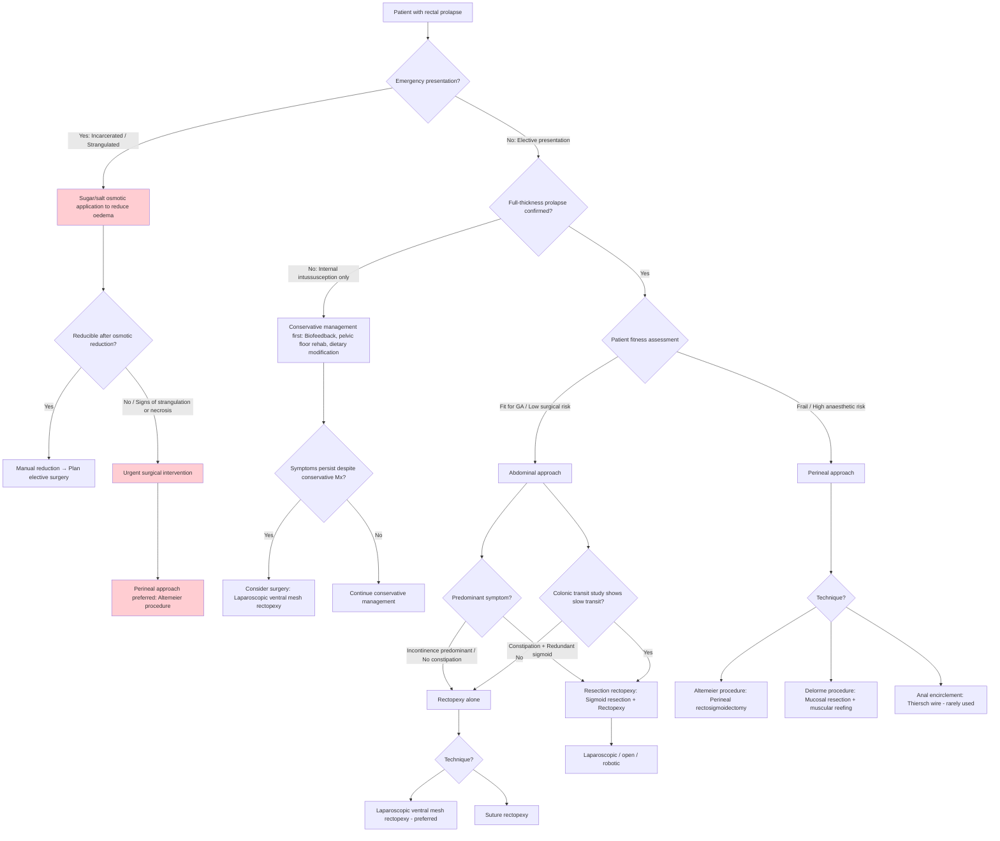

## Management of Rectal Prolapse

> The fundamental principle of rectal prolapse management is straightforward: **surgery is the only definitive treatment for full-thickness rectal prolapse in adults**. Conservative management has a limited role — it can manage symptoms but cannot fix the underlying anatomical defect. The real decision is *which* surgical approach to use, and that depends on the patient's fitness, anatomy, and predominant symptoms (constipation vs incontinence).

---

### 1. General Principles

***Abdominal or perineal approach are both available*** [2]. The choice between them is one of the most important decisions in rectal prolapse surgery.

***Indicated in patients with sensation of mass from prolapsed bowel, fecal incontinence or constipation associated with rectal prolapse*** [2].

The two broad surgical approaches directly mirror the lecture slide categorisation [1]:

| | ***Abdominal Repair*** [1] | ***Perineal Repair*** [1] |
|---|---|---|
| **Approach** | Through the abdomen (open, laparoscopic, or robotic) | Through the perineum (no abdominal incision) |
| **Recurrence rate** | Lower (~3–9%) | Higher (~16–30%) |
| **Functional outcomes** | Better continence and constipation outcomes | Acceptable but inferior long-term function |
| **Operative morbidity** | Higher (general anaesthesia, abdominal access) | Lower (can be done under regional/spinal anaesthesia) |
| **Best for** | Fit patients, younger patients, those with significant constipation | Elderly/frail patients, high anaesthetic risk, recurrent prolapse after abdominal repair |

<Callout title="The Core Decision">
**Fit patient → abdominal approach (better long-term outcomes, lower recurrence).**
**Frail/elderly/high-risk patient → perineal approach (lower operative morbidity, tolerable under regional anaesthesia).**
This is the single most important management principle to remember.
</Callout>

---

### 2. Management Algorithm

---

### 3. Conservative Management

Conservative management does **not** cure full-thickness rectal prolapse. It is reserved for:
- **Children** — most paediatric rectal prolapse resolves spontaneously by age 5
- **Internal intussusception** (without external prolapse) — trial of conservative therapy first
- **Patients unfit for any surgery** — symptom palliation only
- **Perioperative optimisation** — managing constipation and incontinence before and after surgery

#### 3.1 Dietary and Lifestyle Modifications

| Measure | Rationale |
|---|---|
| **High-fibre diet + adequate fluid intake** | Softens stool → reduces straining → reduces repetitive pelvic floor descent |
| **Stool softeners / Bulk-forming laxatives** (e.g., psyllium, lactulose) | Same as above; prevents hard stools that require Valsalva |
| **Avoidance of prolonged straining** | Reduces further pudendal nerve stretch and pelvic floor descent |
| **Toilet posture advice** (feet on stool, slight forward lean) | Straightens the anorectal angle → facilitates evacuation without excessive straining |

#### 3.2 Pelvic Floor Rehabilitation / Biofeedback

- **Biofeedback therapy**: The patient uses manometric or EMG feedback to learn to relax the puborectalis during defecation and strengthen the EAS during holding
- **Why it helps**: In patients with paradoxical puborectalis contraction (dyssynergic defecation), biofeedback retrains the coordination of pelvic floor muscles → reduces outlet obstruction → reduces straining
- **Evidence**: Primarily used for internal intussusception and obstructed defecation; limited evidence for full-thickness external prolapse

#### 3.3 Management of Incarcerated Rectal Prolapse (Emergency)

***Incarcerated rectal prolapse: sugar application + manual reduction + surgery*** [3]

**Step-by-step approach:**
1. **Osmotic reduction**: Apply **granulated sugar** (or table salt) liberally to the oedematous, congested, prolapsed mucosa
   - *Why sugar?* The hyperosmolar crystals draw interstitial fluid out of the oedematous tissue via osmosis → reduces swelling → makes the prolapse smaller and softer
   - Leave in place for 15–20 minutes while gently compressing with gauze
2. **Manual reduction**: Once oedema has reduced, gently push the prolapse back through the anus using steady circumferential pressure (start at the apex and work proximally)
3. **Assess viability**: If mucosa is **dusky/black/necrotic** → suspect strangulation → **do not attempt reduction** → urgent surgery
4. **Definitive surgery**: Plan elective surgery after successful reduction; if reduction fails or tissue is non-viable → urgent perineal procedure (typically Altemeier)

---

### 4. Surgical Treatment — Abdominal Approaches

The lecture slides [1] list the abdominal repair options as:

- ***Rectal fixation (suture/mesh)*** [1]
- ***Sigmoid resection*** [1]
- ***Proctectomy*** [1]
- ***Combination of rectal fixation and sigmoid resection*** [1]
- ***Laparoscopic vs. open vs. robotic*** [1]

#### 4.1 ***Rectopexy*** [2]

> "Recto-" = rectum; "-pexy" = surgical fixation. You're fixing the rectum back to where it belongs.

**Principle**: ***Affix pararectal tissues to the presacral fascia or sacral periosteum in the sacral promontory using non-absorbable sutures or mesh*** [2]

**Why does this work?** The rectum has lost its normal fixation to the sacrum (loss of lateral ligaments, mesorectal fascia). Rectopexy restores this fixation by creating a fibrotic adhesion between the mobilised rectum and the presacral fascia at the level of the sacral promontory → the rectum can no longer slide down.

**Types of rectopexy:**

| Type | Description | Key features |
|---|---|---|
| **Suture rectopexy** | Sutures alone fix the lateral rectal stalks to the presacral fascia | Simple; lower cost; no foreign material; adequate for many patients |
| **Mesh rectopexy (posterior)** | A synthetic or biological mesh is placed posterior to the rectum and sutured to the sacral promontory (like the Ripstein or Wells procedure) | Promotes fibrosis; historically higher rates of constipation (mesh can kink or compress the rectum) |
| ***Laparoscopic ventral mesh rectopexy (LVMR)*** | Mesh placed on the **anterior** aspect of the rectum only, sutured to the sacral promontory; posterior rectal dissection is **avoided** | ***Currently the preferred technique*** [1] — see below |

##### ***Laparoscopic Ventral Mesh Rectopexy (LVMR)*** [1]

This is the modern "gold standard" for abdominal rectopexy and deserves special attention.

**Technique**: A biological or synthetic mesh is placed on the anterior wall of the rectum (in the rectovaginal/rectovesical septum), extending from the level of the Pouch of Douglas down to the perineal body, and fixed superiorly to the sacral promontory. The posterior aspect of the rectum is **not** mobilised.

**Why ventral (anterior) rather than posterior?**
- Avoids posterior rectal mobilisation → preserves the lateral ligaments and autonomic nerves → lower risk of new-onset constipation and sexual dysfunction
- Specifically addresses the deep cul-de-sac (obliterates the Pouch of Douglas) and supports the anterior rectal wall where intussusception typically begins

***Systematic review in 2010 of 12 non-randomised studies — 728 patients*** [1]:
- ***Recurrence of 3.4%*** [1]
- ***Improvement in incontinence of 45%*** [1]
- ***Improvement in constipation of 24%*** [1]

**Indications:**
- Full-thickness rectal prolapse in fit patients
- Internal rectal prolapse (high-grade intussusception) refractory to conservative management
- Multi-compartment pelvic organ prolapse (simultaneously addresses enterocele/rectocele)

**Contraindications (relative):**
- Unfit for general anaesthesia / laparoscopy
- Previous extensive pelvic surgery with dense adhesions (relative)
- Active pelvic sepsis (absolute — mesh infection risk)

<Callout title="Why LVMR is the preferred abdominal approach">
LVMR has emerged as the procedure of choice because it combines low recurrence (~3.4%), functional improvement in both constipation AND incontinence, avoids posterior dissection (preserving autonomic nerves), and can be performed laparoscopically with rapid recovery. It specifically targets the pathological anatomy — the deep cul-de-sac and anterior intussusception.
</Callout>

#### 4.2 ***Sigmoid Resection*** [1][2]

***Resection of sigmoid colon in patients if it is redundant*** [2]
***Use as an adjunct to rectopexy to improve postoperative bowel function in patients with constipation*** [2]

**Technique**: The redundant sigmoid colon is resected and a colorectal anastomosis is performed, combined with rectopexy (= **resection rectopexy**, e.g., Frykman-Goldberg procedure).

**Why add sigmoid resection?**
- A ***redundant sigmoid*** [1] acts as a reservoir for stool → promotes constipation and provides the "weight" that pushes the rectum down
- In patients with **slow transit constipation** (confirmed on colonic transit study), removing the redundant sigmoid reduces the colonic reservoir → improves transit → reduces postoperative constipation
- Without sigmoid resection, constipation often **worsens** after rectopexy because the now-fixed rectum can no longer accommodate the slow-transit stool bolus

**Indications:**
- Rectal prolapse **with significant constipation** and redundant sigmoid
- Colonic transit study showing slow transit constipation
- Rectopexy alone would likely worsen constipation

**Contraindications:**
- Patients with predominant faecal incontinence (resection shortens the colon → looser stools → may worsen incontinence)
- Patients with diarrhoea-predominant symptoms

<Callout title="The Constipation vs Incontinence Decision" type="error">
This is a critical surgical planning decision: **If the main symptom is constipation → consider adding sigmoid resection. If the main symptom is incontinence → do NOT resect sigmoid** (removing colon makes stools looser → worsens incontinence). Get a colonic transit study before deciding.
</Callout>

#### 4.3 ***Proctectomy*** [1]

Listed on the lecture slides as an abdominal option [1]. This is **rarely performed** for rectal prolapse alone and is reserved for:
- Recurrent rectal prolapse after multiple failed repairs
- Concomitant rectal pathology (e.g., rectal cancer, severe radiation proctitis)
- Results in a permanent colostomy — significant quality of life implications

#### 4.4 ***Other Abdominal Approaches*** [1]

***Suture, Mesh, Resection*** [1] — these can be combined in various permutations:

| Combination | When to use |
|---|---|
| Suture rectopexy alone | Prolapse without constipation; mesh not desired |
| Mesh rectopexy alone (posterior or ventral) | Prolapse, especially with multi-compartment involvement |
| Resection + suture rectopexy | Prolapse with constipation and redundant sigmoid |
| Resection + mesh rectopexy | Prolapse with constipation, multi-compartment prolapse, and redundant sigmoid |

***Laparoscopic vs. open vs. robotic*** [1]:
- **Laparoscopic** approach is now standard — shorter hospital stay, less pain, faster recovery, equivalent recurrence rates
- **Robotic** approach increasingly used for LVMR — enhanced visualisation and dexterity in the pelvis; higher cost but similar outcomes
- **Open** approach reserved for patients with contraindications to laparoscopy (e.g., extensive adhesions, inability to tolerate pneumoperitoneum)

---

### 5. Surgical Treatment — Perineal Approaches

The lecture slides [1] list the perineal repair options as:

- ***Full thickness resection*** [1]
- ***Mucosal resection with muscular reefing*** [1]
- ***Anal encirclement*** [1]

#### 5.1 ***Altemeier Procedure (Perineal Rectosigmoidectomy)*** [1][3]

> ***Full thickness resection*** [1] via the perineal route.

**Technique**: The prolapsed rectum is everted, and a full-thickness resection of the redundant rectosigmoid is performed through the perineum. A hand-sewn or stapled coloanal anastomosis is then created. A levatorplasty (plication of the levator ani muscles posterior to the rectum) is usually added to reinforce the pelvic floor.

***Altemeier's operation (perineal rectosigmoidectomy)*** [3]

**Why does it work?**
- Removes the redundant, prolapsing bowel
- The subsequent fibrosis/scarring fixes the neo-rectum in place
- Levatorplasty narrows the levator hiatus → provides additional pelvic floor support

**Indications:**
- **Elderly/frail patients** unfit for abdominal surgery
- **Incarcerated or strangulated prolapse** requiring emergency surgery (can be performed without laparotomy)
- **Recurrent prolapse** after abdominal repair (avoids re-entering the abdomen)
- Can be performed under **regional/spinal anaesthesia** — major advantage in high-risk patients

**Contraindications:**
- Relative: young, fit patients (higher recurrence rate than abdominal approach)

**Advantages**: Low operative morbidity, can be done under regional anaesthesia, no abdominal incision
**Disadvantages**: Higher recurrence rate (~16–30%), potential for anastomotic leak, may not address constipation

#### 5.2 ***Delorme Procedure*** [1][3]

> ***Mucosal resection with muscular reefing*** [1].

***Delorme procedure: plication (folding) of sutures*** [3]

**Technique**: The mucosa of the prolapsed rectum is stripped off circumferentially, and the denuded muscularis propria is then plicated (folded/reefed) with serial sutures like an accordion. The mucosal edges are then re-anastomosed.

**Why does it work?**
- Mucosal stripping + muscular plication shortens and "thickens" the rectal wall
- Creates a bulky muscular cuff at the anorectal junction → acts as a physical barrier to re-prolapse
- The plication narrows the rectal lumen → improves continence by providing a better "plug"

**Indications:**
- **Short prolapse** (< 3–4 cm) — works best for smaller prolapses
- Elderly/frail patients (similar rationale to Altemeier)
- **Mucosal prolapse** (partial prolapse) rather than full-thickness
- Internal intussusception (selected cases)

**Contraindications:**
- Large, full-thickness prolapse (inadequate correction with plication alone)

**Advantages**: No bowel resection → no anastomotic leak risk; very low morbidity; can be done under local/regional anaesthesia
**Disadvantages**: Highest recurrence rate of all procedures (~20–38%); less effective for large prolapses

#### 5.3 ***Anal Encirclement (Thiersch Procedure)*** [1]

> ***Anal encirclement*** [1] — a wire, silastic band, or synthetic mesh strip is placed subcutaneously around the anal canal to narrow the anal orifice.

**Technique**: A circumferential subcutaneous suture or band is placed around the anal canal (outside the sphincter complex) to mechanically narrow the anal opening and prevent the rectum from prolapsing through it.

**Why is it rarely used?**
- It does **not** address the underlying pathology (the rectum is still intussuscepting — you've just narrowed the "exit")
- High complication rates: faecal impaction (too tight), infection, erosion through skin, breakage
- High recurrence rate once the encirclement fails or is removed
- Does not improve continence

**Current indications:**
- Extremely frail/moribund patients unfit for any other surgery — purely palliative
- Occasionally used as a temporary measure to prevent re-prolapse while awaiting definitive surgery

---

### 6. Special Populations

#### 6.1 Children

- **Most childhood rectal prolapse resolves with conservative management** by age 5
- Treatment: stool softeners, dietary fibre, avoidance of straining, treat underlying cause (CF, whooping cough, malnutrition)
- **Manual reduction** taught to parents — gentle, sustained pressure with lubricated gauze
- **Surgery** only if prolapse persists despite conservative management for > 1 year, or if it becomes recurrent and irreducible
- Procedures: submucosal injection sclerotherapy (creates fibrosis to fix mucosa), laparoscopic rectopexy (rare, for persistent cases)

#### 6.2 Internal Intussusception (Without External Prolapse)

- **First-line**: Conservative management — biofeedback, pelvic floor rehabilitation, dietary modifications, laxatives for constipation
- **Surgery** only if refractory to conservative measures and symptoms are significantly impacting quality of life
- Preferred procedure: ***Laparoscopic ventral mesh rectopexy*** [1] — addresses the intussusception and deep cul-de-sac while avoiding posterior dissection

---

### 7. Comparison of Surgical Procedures — Summary Table

| Procedure | Approach | Recurrence | Continence improvement | Constipation outcome | Best for | Anaesthesia |
|---|---|---|---|---|---|---|
| ***LVMR*** [1] | Abdominal (laparoscopic) | ***~3.4%*** [1] | ***~45% improvement*** [1] | ***~24% improvement*** [1] | Fit patients; multi-compartment prolapse | GA |
| **Suture rectopexy** | Abdominal | ~3–9% | Moderate | May worsen (if posterior mobilisation) | Fit patients without constipation | GA |
| **Resection rectopexy** | Abdominal | ~2–5% | Good | Good (removes redundant sigmoid) | Prolapse + constipation + redundant sigmoid | GA |
| ***Altemeier*** [3] | Perineal | ~16–30% | Moderate (improved with levatorplasty) | Variable | Frail/elderly; emergency; recurrent after abdominal repair | Regional/Spinal |
| ***Delorme*** [3] | Perineal | ~20–38% | Moderate | Variable | Short prolapse; mucosal prolapse; frail patients | Regional/Local |
| ***Thiersch*** [1] | Perineal | Very high | None | May worsen (impaction) | Palliative only; extremely frail patients | Local |

---

### 8. Postoperative Considerations

| Issue | Details |
|---|---|
| **Recurrence** | Most common complication overall; higher with perineal approaches; counsel patient pre-operatively |
| **New-onset/worsened constipation** | Especially after posterior rectopexy (denervation of rectum during posterior mobilisation); mitigated by LVMR (no posterior dissection) or by adding sigmoid resection |
| **Faecal incontinence persistence** | May persist despite anatomical correction if pudendal neuropathy is severe (prolonged PNTML); biofeedback and pelvic floor rehab postoperatively |
| **Mesh-related complications** | Infection, erosion (into rectum or vagina), chronic pain, dyspareunia; use biological mesh to reduce erosion risk; avoid mesh in contaminated field |
| **Anastomotic leak** | Risk with Altemeier or resection rectopexy; presents with pelvic sepsis, fever, pain |
| **Pelvic floor rehabilitation** | Important adjunct to all surgical approaches — pelvic floor exercises, biofeedback, dietary advice continue postoperatively |

---

<Callout title="High Yield Summary">

1. **Surgery is the definitive treatment** for full-thickness rectal prolapse — conservative measures alone cannot fix it (except in children).
2. **Two broad approaches**: ***Abdominal repair*** (lower recurrence, better function, needs GA) vs ***Perineal repair*** (higher recurrence, lower morbidity, can be done under regional anaesthesia).
3. ***Abdominal options***: Rectal fixation (suture/mesh), Sigmoid resection, Proctectomy, Combination of fixation + resection. Approach: laparoscopic vs open vs robotic.
4. ***Perineal options***: Full-thickness resection (Altemeier), Mucosal resection with muscular reefing (Delorme), Anal encirclement (Thiersch — rarely used).
5. ***LVMR is the preferred abdominal technique*** — recurrence 3.4%, improvement in incontinence 45%, improvement in constipation 24%.
6. ***Add sigmoid resection*** if patient has constipation with redundant sigmoid / slow transit on colonic transit study. **Do NOT resect** if predominant symptom is incontinence.
7. **Incarcerated rectal prolapse**: sugar application → manual reduction → elective surgery. If strangulated → urgent perineal procedure.
8. ***Rectopexy = affix pararectal tissues to presacral fascia/sacral periosteum at the sacral promontory using non-absorbable sutures or mesh***.
9. **Frail/elderly patients → perineal approach** (Altemeier or Delorme); **fit patients → abdominal approach** (LVMR or resection rectopexy).

</Callout>

---

<ActiveRecallQuiz
  title="Active Recall - Management of Rectal Prolapse"
  items={[
    {
      question: "Name the abdominal and perineal surgical options for rectal prolapse as listed in the lecture slides.",
      markscheme: "Abdominal: Rectal fixation (suture/mesh), Sigmoid resection, Proctectomy, Combination of rectal fixation and sigmoid resection. Perineal: Full-thickness resection (Altemeier), Mucosal resection with muscular reefing (Delorme), Anal encirclement (Thiersch).",
    },
    {
      question: "What is laparoscopic ventral mesh rectopexy, and what outcomes were reported in the 2010 systematic review cited in the lecture slides?",
      markscheme: "LVMR involves placing mesh on the anterior (ventral) aspect of the rectum, extending from the Pouch of Douglas to the perineal body, fixed to the sacral promontory. Posterior dissection is avoided. 2010 systematic review of 12 non-randomised studies, 728 patients: recurrence 3.4%, improvement in incontinence 45%, improvement in constipation 24%.",
    },
    {
      question: "A frail 85-year-old woman presents with an incarcerated, oedematous rectal prolapse. Describe the stepwise emergency management.",
      markscheme: "1. Apply granulated sugar to the prolapsed mucosa (osmotic effect to reduce oedema). 2. Gently attempt manual reduction once swelling decreases. 3. Assess mucosal viability - if necrotic/strangulated, do not reduce, proceed to urgent surgery. 4. If successfully reduced, plan elective surgery (perineal approach preferred given frailty - e.g. Altemeier procedure). If unsuccessful, urgent perineal rectosigmoidectomy.",
    },
    {
      question: "When should sigmoid resection be added to rectopexy, and when should it be avoided? Explain the rationale.",
      markscheme: "Add sigmoid resection when: constipation is the predominant symptom, sigmoid is redundant, and/or colonic transit study shows slow transit constipation. Rationale: redundant sigmoid acts as a stool reservoir promoting constipation; removing it improves transit. Avoid when: predominant symptom is faecal incontinence. Rationale: removing sigmoid shortens the colon, producing looser and more frequent stools, which would worsen incontinence.",
    },
    {
      question: "Compare the Altemeier and Delorme procedures in terms of technique, recurrence rate, and ideal patient.",
      markscheme: "Altemeier (perineal rectosigmoidectomy): full-thickness resection of redundant rectosigmoid via perineum with coloanal anastomosis plus levatorplasty. Recurrence 16-30%. Best for frail patients, emergency (incarcerated/strangulated), larger prolapses. Delorme: mucosal stripping with plication (reefing) of the denuded muscularis. No bowel resection. Recurrence 20-38%. Best for shorter prolapses (less than 3-4 cm), mucosal prolapse, very frail patients. Both can be done under regional anaesthesia.",
    },
    {
      question: "Why is posterior rectal mobilisation avoided in laparoscopic ventral mesh rectopexy, and what is the clinical benefit?",
      markscheme: "Posterior mobilisation risks damaging the lateral ligaments of the rectum and the autonomic (pelvic splanchnic) nerves that run in them. This can cause new-onset or worsened constipation (rectal denervation impairs motility) and sexual dysfunction. By using a ventral (anterior-only) approach, LVMR preserves these structures, resulting in better functional outcomes for both constipation and continence.",
    },
  ]}
/>

---

## References

[1] Lecture slides: GC 179. Anal pain perianal lesions and sepsis.pdf (p65–66, p68–69, p72)
[2] Senior notes: felixlai.md (Rectal prolapse — Treatment section, pp. 762–763)
[3] Senior notes: maxim.md (Incarcerated rectal prolapse management; Altemeier; Delorme)
