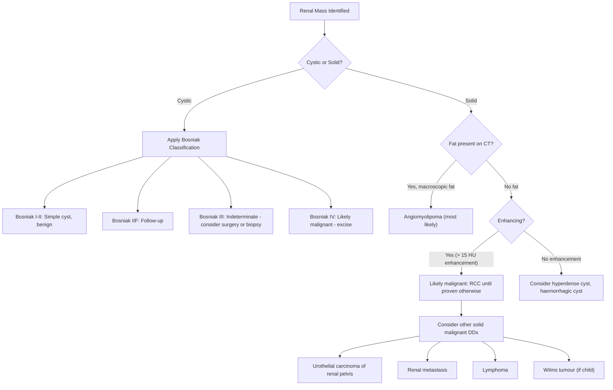
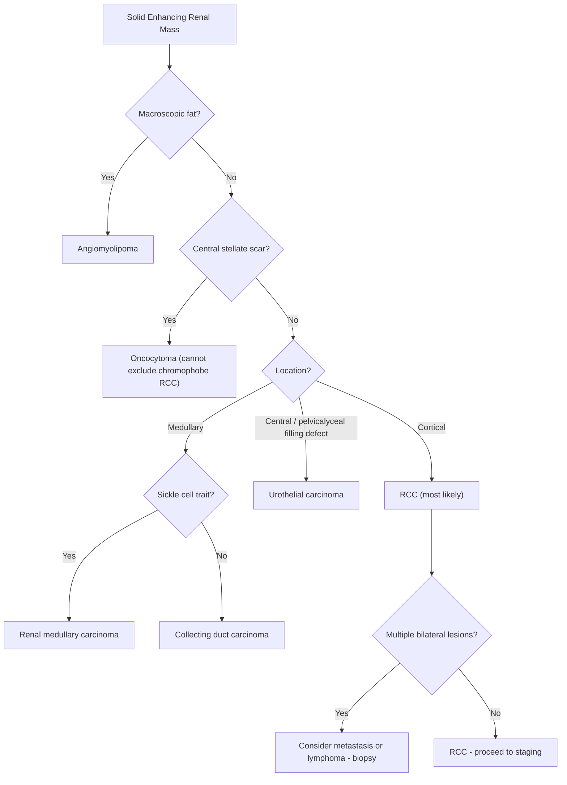

## Differential Diagnosis of a Renal Mass

When you encounter a renal mass — whether discovered incidentally on imaging, found during a haematuria workup, or detected because the patient has flank pain — you must think systematically. Not every renal mass is RCC. The differential is broad, and getting it wrong has major consequences: you don't want to do a radical nephrectomy for a lymphoma (which is treated with chemotherapy) or panic about a simple cyst.

The approach is to ask **three sequential questions**:

1. **Is this mass real?** (Artefact, normal variant, pseudotumour such as a prominent column of Bertin)
2. **Is it cystic or solid?** (Simple cysts are overwhelmingly benign; solid masses are malignant until proven otherwise)
3. **If solid or complex cystic — is it benign or malignant?**

---

### Conceptual Framework

---

### Differential Diagnoses of Renal Masses — Detailed Breakdown

#### A. Benign Renal Masses

***Only ~20% of renal masses are benign*** [4]. Key benign differentials:

| Diagnosis | Key Features | Why It Mimics RCC | How to Distinguish |
|-----------|-------------|-------------------|-------------------|
| ***Simple renal cyst*** | ***Asymptomatic, ovoid anechoic mass with smooth wall on USG*** [3] | Very common; large cysts may cause flank mass or pain | **Bosniak I–II criteria**: thin wall, no septations, no enhancement, no calcification. Requires **no follow-up** |
| ***Angiomyolipoma (AML)*** | ***Fat attenuation, enhancing without calcification on CT; associated with tuberous sclerosis complex*** [3] | Can be large, cause pain, and even rupture/haemorrhage (especially if > 4 cm) | **Macroscopic fat on CT** (Hounsfield units < −20 HU) is virtually diagnostic. Contains fat + smooth muscle + blood vessels ("angio-myo-lipoma" = vessels-muscle-fat). Risk of spontaneous haemorrhage (Wunderlich syndrome) if > 4 cm → embolisation or surgery |
| ***Oncocytoma*** | ***Homogeneous, well-circumscribed solid mass*** [3]; characteristically has a **central stellate scar** on CT | Solid, enhancing mass that looks identical to chromophobe RCC on imaging | **Cannot reliably distinguish from chromophobe RCC on imaging alone** — often requires histological confirmation. Composed of oncocytes (eosinophilic, mitochondria-rich cells). Benign — no metastatic potential |
| ***Infectious mass (renal abscess, focal pyelonephritis, xanthogranulomatous pyelonephritis)*** | ***Often associated with signs/symptoms of UTI and systemic upset*** [3] | Can appear as an enhancing renal mass with irregular walls | **Clinical context**: fever, leucocytosis, pyuria, raised CRP/procalcitonin. XGP classically mimics RCC and is only diagnosed post-nephrectomy |
| **Renal pseudotumour** (hypertrophied column of Bertin, dromedary hump, foetal lobulation) | Normal anatomical variant of renal parenchyma | Can appear as a "mass" on USG | Enhances identically to surrounding normal cortex on CT; no distortion of architecture |
| **Complex renal cyst** | Cystic lesion with septations, calcifications, or wall thickening | Bosniak III–IV cysts have significant malignancy risk (Bosniak IV ≈ 100%) | **Bosniak classification** determines management (see below) |

<Callout title="Bosniak Classification of Renal Cysts — Quick Reference">

| Category | Features | Malignancy Risk | Management |
|----------|----------|----------------|------------|
| I | Simple: thin wall, no septa, no calcification, no enhancement | ~0% | No follow-up |
| II | Few thin septa, fine calcification, hyperdense cysts (< 3 cm), no enhancement | ~0% | No follow-up |
| IIF ("F" = follow-up) | More septa, minimally thickened; minimal enhancement; ≥ 3 cm hyperdense cysts | ~5% | Serial imaging |
| III | Thickened irregular walls/septa, measurable enhancement | ~50% | Surgery or biopsy |
| IV | Clearly enhancing soft tissue component | ~100% | Surgery (treat as RCC) |

</Callout>

<Callout title="Xanthogranulomatous Pyelonephritis — The Great Mimicker" type="error">
XGP is a chronic destructive granulomatous infection (usually from *Proteus mirabilis* or *E. coli* with staghorn calculus) that destroys and replaces the renal parenchyma with lipid-laden macrophages. On CT it can look exactly like a locally advanced RCC (irregular mass, perinephric extension). It is often only diagnosed after nephrectomy when the pathologist finds granulomatous tissue instead of carcinoma. Clinical clue: usually occurs in middle-aged women with a history of recurrent UTIs and a non-functioning kidney on the affected side.
</Callout>

---

#### B. Malignant Renal Masses (Other Than RCC)

| Diagnosis | Key Features | Why It Matters | How to Distinguish from RCC |
|-----------|-------------|----------------|----------------------------|
| ***Urothelial carcinoma of the renal pelvis*** | Arises from transitional epithelium lining the renal pelvis (~8% of renal malignancies) [2][3] | Treated differently: **nephroureterectomy** (not radical nephrectomy alone), because the entire urothelial tract is at risk (field change) | Typically presents as a **central filling defect** in the renal pelvis on CT urogram (not a cortical mass). Often associated with **hydronephrosis**. Urine cytology may be positive. Risk factors: smoking, aristolochic acid (Chinese herbal nephropathy — important in Hong Kong), analgesic nephropathy |
| ***Renal metastasis*** | ***Usually multiple lesions with borderline enhancement + widespread metastatic disease*** [3] | Treatment is systemic (chemotherapy/immunotherapy), not surgical — so tissue diagnosis is critical | Common primaries that metastasise to kidney: **lung, breast, GIT, prostate, melanoma** [2]. Imaging: usually multiple, bilateral, small, minimally enhancing lesions in a patient with known primary cancer. ***Consider obtaining tissue biopsy if may affect management*** [3] |
| ***Lymphoma*** | Primary renal lymphoma is rare; secondary involvement more common (50% of lymphoma at autopsy have renal involvement) | Treatment is **chemotherapy**, NOT surgery — this is the critical distinction. Doing a nephrectomy for lymphoma is a disaster | Imaging: multiple bilateral homogeneous masses, or diffuse infiltration causing renomegaly without distortion of the collecting system. ***Consider obtaining tissue biopsy if may affect management*** [3]. Look for other evidence of lymphoma (lymphadenopathy, splenomegaly, B symptoms) |
| ***Wilms' tumour (nephroblastoma)*** | Most common primary renal malignancy in **children** (< 15 years; peak age 3) [6] | Presents as an asymptomatic abdominal mass in a child; different staging and treatment protocol from RCC | **Age is the key**: if a child has a renal mass, think Wilms' first. If an adult has a renal mass, think RCC first. Wilms' rarely crosses the midline (cf. neuroblastoma which does). Associated with WAGR syndrome, Beckwith-Wiedemann syndrome, Denys-Drash syndrome [6] |
| ***Renal sarcoma*** | Rare (< 1%); includes leiomyosarcoma, liposarcoma, angiosarcoma | Highly aggressive with poor prognosis | Usually large, heterogeneous mass; tissue diagnosis needed |
| ***Collecting duct carcinoma*** | Arises from collecting ducts; ***rare, aggressive subtype with poor prognosis*** [5] | Behaves more like urothelial carcinoma than typical RCC; poor response to anti-VEGF therapy | Central (medullary) location rather than cortical; infiltrative pattern on CT |
| ***Renal medullary carcinoma*** | ***Very aggressive, mostly in young patients with sickle cell trait*** [5] | Nearly universally fatal; presents with metastatic disease | Young patient with sickle cell trait/disease + aggressive renal mass = pathognomonic |

---

#### C. Non-Neoplastic Conditions Mimicking a Renal Mass

| Condition | Key Features | How to Distinguish |
|-----------|-------------|-------------------|
| **Renal abscess/perinephric abscess** | Fever, leucocytosis, pyuria; history of UTI or haematogenous seeding | CT shows rim-enhancing fluid collection ± gas; responds to antibiotics/drainage |
| **Renal infarct** | Wedge-shaped non-enhancing area; clinical context of AF, endocarditis, aortic disease | **Peripheral, wedge-shaped**, does not enhance; cortical rim sign (thin rim of viable subcapsular cortex) |
| **Polycystic kidney disease (ADPKD)** | Bilateral enlarged kidneys with multiple cysts | Family history, bilateral, large kidneys — but note: RCC can occur within ADPKD kidneys too |
| **Haematoma (subcapsular or perirenal)** | History of trauma, anticoagulation, or tumour bleed | CT shows high-density non-enhancing collection; may need follow-up to exclude underlying tumour |
| **Renal tuberculosis** | Chronic destructive granulomatous infection | "Putty kidney" (calcified non-functioning kidney); sterile pyuria; AFB on EMU; history of TB exposure |

---

### Key Differentiating Principles — Why the Distinction Matters

Let's think about **why** we care about the differential:

1. **RCC**: Treatment is primarily **surgical** (partial or radical nephrectomy). Anti-VEGF targeted therapy or immunotherapy for metastatic disease. Chemotherapy and radiotherapy are largely **ineffective**.

2. **Urothelial carcinoma of the renal pelvis**: Requires **nephroureterectomy** (removing kidney + entire ureter + bladder cuff) because the entire urothelium is at risk from field cancerisation.

3. **Lymphoma / metastasis to kidney**: Treatment is **systemic** (chemotherapy/immunotherapy). Surgery would be inappropriate and harmful. This is why ***biopsy is indicated when lymphoma or metastasis is suspected*** [3] — in contrast to typical RCC where biopsy is generally avoided.

4. **Angiomyolipoma**: Benign. If small and asymptomatic, observation only. If > 4 cm or symptomatic, selective arterial embolisation or nephron-sparing surgery.

5. **Oncocytoma**: Benign. But since it cannot be reliably distinguished from chromophobe RCC on imaging, it often ends up being resected (and the diagnosis is made post-operatively by the pathologist).

<Callout title="When to Biopsy a Renal Mass" type="idea">
***CT-guided core biopsy is traditionally NOT done for suspected RCC*** due to risk of tumour seeding [3]. Instead, diagnosis is made from the **nephrectomy specimen** itself (surgery serves as both diagnosis and treatment).

***Indications for renal mass biopsy*** [3]:
- Renal mass of **unknown origin** (suspicious for metastasis, lymphoma, or non-malignant cause)
- **Metastatic disease** where the primary is uncertain and systemic therapy is planned
- Patient preference / unfit for surgery — to guide systemic therapy
- Before **thermal ablation** of a small renal mass

The key principle: you biopsy when the result would **change management** (e.g., if it's lymphoma → chemo, not surgery).
</Callout>

---

### Differential Diagnosis in Special Populations

#### Children (< 15 years)
- **Wilms' tumour** (most common — 95% of paediatric renal cancers) [6]
- Neuroblastoma (arises from adrenal/sympathetic chain, can appear as a suprarenal mass — differentiate with urine catecholamines: elevated VMA/HVA in neuroblastoma) [6]
- Mesoblastic nephroma (neonates — benign)
- Clear cell sarcoma of the kidney
- Rhabdoid tumour of the kidney (very aggressive; associated with hypercalcaemia) [6]

#### Young Adults (15–40 years)
- RCC (uncommon but possible)
- ***Translocation RCC (TFE3/TFEB)*** — ***usually affects children and young adults; distinct molecular pathology*** [5]
- ***Renal medullary carcinoma*** — ***very aggressive, mostly in young patients with sickle cell trait*** [5]
- AML (especially if TSC)

#### Adults with Known Malignancy
- Always consider **renal metastasis** from lung, breast, GIT, prostate, melanoma [2][3]
- Always consider **lymphoma** (especially if bilateral, homogeneous, with lymphadenopathy)

---

### Approach to Differentiating Renal Masses on Imaging — Practical Summary

---

### Summary Table — Differential Diagnosis of a Renal Mass

| Category | Diagnosis | Key Distinguishing Feature |
|----------|-----------|--------------------------|
| **Benign** | Simple cyst | Anechoic, smooth wall, no enhancement (Bosniak I–II) |
| | Angiomyolipoma | **Fat on CT** (HU < −20); a/w TSC |
| | Oncocytoma | Central stellate scar; cannot distinguish from chromophobe RCC on imaging |
| | Infection (abscess, XGP) | Fever, leucocytosis, UTI history |
| | Pseudotumour | Enhances like normal cortex |
| **Malignant — primary** | ***RCC*** | ***Most common; cortical, enhancing, heterogeneous*** |
| | Urothelial CA of renal pelvis | Central filling defect, hydronephrosis, +ve cytology |
| | Wilms' tumour | **Children**; large smooth mass; WAGR/BWS associations |
| | Collecting duct / medullary CA | Central location; aggressive; sickle cell trait (medullary) |
| | Translocation RCC | Young adults; TFE3/TFEB rearrangement |
| | Renal sarcoma | Rare; large heterogeneous mass |
| **Malignant — secondary** | ***Renal metastasis*** | ***Multiple, bilateral, borderline enhancement; known primary*** [3] |
| | ***Lymphoma*** | ***Multiple, bilateral, homogeneous; ± other lymphoma features*** [3] |
| **Non-neoplastic** | Renal infarct | Wedge-shaped; clinical context (AF, endocarditis) |
| | Haematoma | High-density non-enhancing; history of trauma/anticoagulation |
| | Renal TB | Calcified "putty kidney"; sterile pyuria; EMU for AFB |

---

<Callout title="High Yield Summary">

1. **Not all renal masses are RCC** — ~20% of renal masses are benign (angiomyolipoma, oncocytoma, simple cysts).
2. **Key imaging feature for AML**: macroscopic fat on CT (HU < −20). **Key imaging feature for oncocytoma**: central stellate scar — but cannot reliably distinguish from chromophobe RCC without histology.
3. **Bosniak classification** guides management of cystic renal masses: I–II = benign (no follow-up), IIF = follow-up, III = indeterminate (~50% malignant), IV = treat as malignant.
4. **Urothelial carcinoma of the renal pelvis** presents as a central filling defect (not a cortical mass) and requires nephroureterectomy, not nephrectomy alone.
5. **Lymphoma and renal metastasis** are treated with systemic therapy — biopsy is indicated to confirm before committing to chemotherapy.
6. ***CT-guided biopsy is traditionally NOT done for suspected RCC*** (risk of tumour seeding); it is reserved for when the result would change management (suspected lymphoma, metastasis, or non-malignant cause).
7. **In children**: think Wilms' tumour first; differentiate from neuroblastoma with urine catecholamines (VMA/HVA).
8. **In young adults with sickle cell trait**: think renal medullary carcinoma (very aggressive, nearly universally fatal).
9. **XGP** is the great mimicker of RCC — chronic granulomatous infection that often only gets diagnosed after nephrectomy.

</Callout>

---

<ActiveRecallQuiz
  title="Active Recall - Differential Diagnosis of Renal Masses"
  items={[
    {
      question: "A 45-year-old woman has a solid renal mass on CT with macroscopic fat content (HU less than -20). What is the most likely diagnosis, and what associated genetic syndrome should you screen for?",
      markscheme: "Angiomyolipoma (AML). Associated with tuberous sclerosis complex (TSC). AML contains fat, smooth muscle, and blood vessels. Macroscopic fat on CT is virtually diagnostic. If more than 4 cm, risk of spontaneous haemorrhage. TSC also associated with cortical tubers, cardiac rhabdomyomas, LAM, and RCC in under 5% of cases."
    },
    {
      question: "List 3 specific indications for CT-guided core biopsy of a renal mass, and explain why biopsy is traditionally avoided for suspected RCC.",
      markscheme: "Indications: 1) Renal mass of unknown origin suspicious for metastasis or lymphoma. 2) Metastatic disease where primary is uncertain and systemic therapy is planned. 3) Before thermal ablation of a small renal mass. Biopsy is avoided in suspected RCC due to risk of tumour seeding along the needle tract, and because nephrectomy serves as both diagnosis and definitive treatment."
    },
    {
      question: "A 3-year-old child presents with an asymptomatic abdominal mass. What is the most likely diagnosis, and name two associated congenital syndromes?",
      markscheme: "Wilms tumour (nephroblastoma) - most common primary renal malignancy in children under 15 (95% of paediatric renal cancers). Peak age 3. Associated syndromes include: WAGR syndrome (Wilms tumour, Aniridia, Genitourinary anomalies, Retardation - WT1 deletion at 11p13), Beckwith-Wiedemann syndrome (visceromegaly, macroglossia, hyperinsulinaemic hypoglycaemia), and Denys-Drash syndrome."
    },
    {
      question: "A patient with known lung cancer is found to have multiple bilateral small renal lesions with borderline enhancement on CT. What are the two most likely diagnoses, and what is the key investigation to differentiate them?",
      markscheme: "Renal metastases and renal lymphoma. Both present as multiple bilateral lesions. Key investigation is CT-guided renal biopsy (indicated when the result would change management - both are treated with systemic therapy, not surgery). Lymphoma may also show diffuse renomegaly without collecting system distortion and other features such as lymphadenopathy, splenomegaly, and B symptoms."
    },
    {
      question: "Explain why urothelial carcinoma of the renal pelvis requires nephroureterectomy rather than nephrectomy alone, and name a risk factor that is particularly relevant in Hong Kong.",
      markscheme: "Urothelial carcinoma arises from transitional epithelium, which lines the entire urinary tract from renal pelvis to urethra. Due to field cancerisation (the entire urothelium is exposed to the same carcinogens), there is risk of multifocal or metachronous tumours. Therefore the entire ipsilateral urothelial tract (kidney + ureter + bladder cuff) must be removed. A particularly relevant risk factor in Hong Kong is aristolochic acid exposure from Chinese herbal medicines (causes Chinese herbal nephropathy / Balkan-type nephropathy)."
    }
  ]}
/>

---

## References

[2] Senior notes: felixlai.md (Renal cell carcinoma section)
[3] Senior notes: Ryan Ho Urogenital.pdf (pp. 145–147, Section 7.3)
[4] Senior notes: maxim.md (Renal cell carcinoma section)
[5] Lecture slides: GC 183. Common urological malignancies and their presentations - Nov 7.pdf (p. 17 — RCC Subtypes table)
[6] Senior notes: felixlai.md (Wilms' tumour section)
[7] Senior notes: Ryan Ho Fundamentals.pdf (pp. 340–345, Section 3.5.1 — Haematuria)
