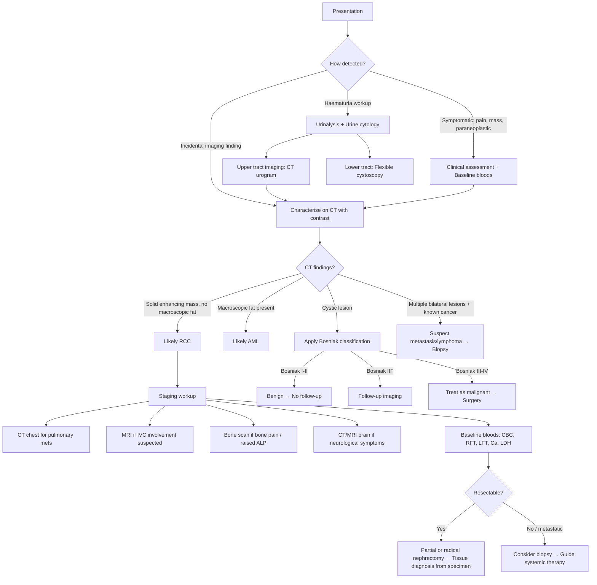

## Diagnostic Criteria, Diagnostic Algorithm & Investigation Modalities for Renal Cell Carcinoma

---

### 1. Diagnostic Principles — "There Is No Screening Test and No Serum Tumour Marker"

Before diving into investigations, let's establish some first principles that make RCC diagnostically unique:

1. **There is no validated serum tumour marker for RCC** — unlike PSA (prostate), AFP/CEA (liver/colon), or CA-125 (ovary). You cannot "screen" with a blood test.
2. **There is no population-level screening programme for RCC** — the only exception is annual USG for patients on **long-term dialysis** with acquired cystic kidney disease (30× risk) [3].
3. **Diagnosis is primarily imaging-based** — a contrast CT abdomen with characteristic features is usually sufficient to make a **clinical diagnosis** and proceed directly to surgery.
4. **The definitive tissue diagnosis comes from the nephrectomy specimen itself** — i.e., surgery is both diagnostic and therapeutic simultaneously [2][4].
5. ***CT-guided core biopsy is traditionally NOT done*** due to risk of tumour seeding [3][4]. Biopsy is reserved for specific situations where the result would change management.

This approach is fundamentally different from, say, breast cancer (where you biopsy first, then operate) or lymphoma (where tissue diagnosis is mandatory before treatment). In RCC, if the imaging is characteristic and the mass is resectable, you skip biopsy and go straight to the operating room.

---

### 2. Diagnostic Algorithm

The pathway differs depending on how the patient presents:

---

### 3. Investigation Modalities — Detailed Breakdown

#### 3.1 Bedside / Physical Examination

Though not strictly an "investigation," the physical examination provides critical information [2][7]:

| Examination | Finding | Significance |
|-------------|---------|-------------|
| **General** | Pallor, cachexia, plethora | Anaemia vs. polycythaemia (paraneoplastic EPO); cachexia = advanced disease |
| **Vitals** | Hypertension | Paraneoplastic renin production or renal artery compression |
| **Abdominal** | ***Palpable abdominal renal mass, ballotable kidneys*** [2] | Large tumour (usually > 10 cm); firm, smooth, non-tender, moves with respiration |
| **Abdominal** | Hepatomegaly | Liver metastasis or Stauffer syndrome |
| **Scrotal** | ***Scrotal swelling suggesting varicocele*** [2] | Left varicocele that fails to empty when recumbent = left renal vein invasion |
| **Lower limbs** | ***Ankle oedema*** [2] | ***IVC thrombosis or venous compression from tumour or lymph node*** |

---

#### 3.2 Laboratory Investigations (Biochemical Tests)

There is no single diagnostic blood test for RCC. Bloods serve three purposes: (1) detect paraneoplastic phenomena, (2) assess baseline organ function before surgery, and (3) provide prognostic information.

| Investigation | What to Look For | Clinical Rationale |
|--------------|-----------------|-------------------|
| ***CBC with differentials*** [2] | ***Anaemia OR erythrocytosis; thrombocytosis*** | Anaemia = chronic disease (hepcidin-mediated) or haematuria-related iron loss. Erythrocytosis = paraneoplastic EPO production. Thrombocytosis = reactive (IL-6 driven), associated with poorer prognosis |
| ***Urinalysis*** [2] | Haematuria (micro or macro) | Tumour invasion into collecting system → RBCs in urine. Non-glomerular pattern (isomorphic RBCs, no casts) |
| ***Urine cytology*** [2] | Malignant cells | Sensitivity is low for RCC (better for urothelial carcinoma). Mainly used to exclude concurrent urothelial carcinoma. Positive cytology in a patient with a cortical mass raises the possibility of a concomitant urothelial lesion |
| ***LFT*** [2] | ***Deranged liver function in liver metastasis or Stauffer syndrome*** | Stauffer syndrome = non-metastatic hepatic dysfunction (raised ALP, GGT, ± bilirubin) without liver mets; reverses post-nephrectomy. If LFTs deranged, you need imaging to differentiate metastatic from paraneoplastic cause |
| ***Albumin*** [2] | Low albumin | ***Nutritional status*** assessment pre-operatively; hypoalbuminaemia = poor prognosis |
| ***RFT*** [2] | Creatinine, eGFR, electrolytes | ***Baseline renal function should be assessed since patients with preoperative renal dysfunction and those with risk of CKD should be offered partial instead of radical nephrectomy in order to preserve renal function*** [2]. Also detects hyperkalaemia if obstructive uropathy |
| **Serum calcium** | Hypercalcaemia | ***Paraneoplastic: PTHrP production or 1α-hydroxylation of vitamin D*** [1]. If elevated → check PTH (should be suppressed) and PTHrP |
| ***Serum LDH*** [2] | Elevated LDH | ***May be prognostic in metastatic disease*** [2] — included in the MSKCC/IMDC prognostic models for metastatic RCC |
| **Coagulation profile** | PT/INR, APTT | Pre-operative baseline; RCC can cause DIC (rare) or hypercoagulable state |
| **ESR/CRP** | Elevated | Non-specific; may be raised in paraneoplastic inflammatory response |

<Callout title="Why Check RFT Before Surgery?" type="idea">
This is a crucial pre-operative decision point. If a patient has **baseline renal impairment** (e.g., solitary kidney, bilateral tumours, CKD), you must preserve as much nephron mass as possible. This is why ***partial nephrectomy (nephron-sparing surgery) is preferred over radical nephrectomy when technically feasible for T1 tumours*** — to avoid pushing the patient into dialysis-dependent renal failure. The preoperative eGFR directly influences the surgical plan.
</Callout>

---

#### 3.3 Tissue Diagnosis

This is where RCC is different from most cancers:

| Method | Details | When Used |
|--------|---------|-----------|
| ***Nephrectomy or partial nephrectomy*** [2] | ***Used in most cases to obtain tissue for diagnosis. For patients with isolated solid renal masses, resection with either a partial or complete nephrectomy is preferred to biopsy since it provides both diagnosis and definitive treatment*** | Standard approach for resectable masses with characteristic imaging |
| ***Renal mass biopsy (CT or USG guided)*** [2][3] | ***Role of percutaneous biopsy is limited; preoperative needle biopsy is usually not used for resectable renal lesions because of low specificity and concern about tumour seeding of the peritoneum*** [2] | ***Indications: renal mass of unknown origin suspicious for metastasis, lymphoma, or non-malignant causes; metastatic disease for thermal ablation; patient preference*** [3] |
| ***Biopsy of metastatic site*** [2] | ***Biopsy of a metastatic lesion is occasionally diagnostic and can be used if there is high index of suspicion for a metastatic lesion to kidney since pathological confirmation is required prior to starting systemic therapy. Biopsy of a metastatic site is often easier and more informative than biopsy of the primary tumour*** | When systemic therapy is planned and tissue is needed for histological subtyping and molecular profiling |

<Callout title="Common Exam Mistake — Biopsy in RCC" type="error">
Students frequently state "biopsy the renal mass" as the first diagnostic step. This is WRONG for suspected RCC. Unlike many other cancers, the standard approach is to proceed directly to surgical resection, which simultaneously provides tissue diagnosis and treatment. Biopsy is only indicated when it would change management — e.g., if you suspect lymphoma (treat with chemo, not surgery), metastasis from another primary, or a non-malignant cause like abscess.
</Callout>

---

#### 3.4 Radiological Investigations

##### A. Ultrasonography (USG) — Initial / Screening Role

***USG is less sensitive than CT in detecting a renal mass but is useful to distinguish a simple benign cyst from a more complex cyst or a solid tumour*** [2][3].

| Finding | Appearance | Interpretation |
|---------|-----------|---------------|
| **Simple cyst** | ***Round, sharply demarcated with smooth walls; no echoes within the cyst (anechoic); strong posterior wall echo indicating good transmission*** [2] | Benign (Bosniak I) — no further workup needed |
| ***Solid mass*** | ***Variable echogenicity; hypoechoic halo of tumour pseudocapsule*** [3] | Suspicious → proceed to contrast CT |
| ***Cystic cancer*** | ***Irregular, thickened walls; complex structure with septa*** [3] | Suspicious → proceed to contrast CT with Bosniak classification |
| **Fat-containing mass** | Hyperechoic (bright) | Angiomyolipoma (confirm with CT for macroscopic fat) |

**Why USG first?**
- Readily available, no radiation, no contrast, cheap, bedside procedure [7]
- Excellent for distinguishing cystic vs. solid — this is its main role
- Can detect hydronephrosis, cortical thinning, renal size
- Limited by operator dependence, body habitus, and inability to assess retroperitoneum well

##### B. CT Abdomen and Pelvis with Contrast — The Gold Standard

***CT abdomen (renal protocol) with and without contrast is the initial first-line imaging modality for characterising renal masses; it is extremely accurate in staging RCC — 90% accurate*** [2][3].

**Why CT is so good for RCC:**
- Provides anatomical detail of the tumour (size, location, relationship to collecting system)
- Shows enhancement pattern (key for distinguishing benign from malignant)
- Evaluates local invasion (perinephric fat, renal vein, IVC)
- Assesses lymph node involvement
- Can image the contralateral kidney (bilateral tumours? solitary kidney?)
- Detects adrenal gland involvement
- One scan stages the tumour (T, N, and partially M)

**CT Protocol — Multiphasic Renal CT:**

| Phase | Timing | What It Shows | Why It Matters |
|-------|--------|---------------|----------------|
| **Non-contrast (plain)** | Before contrast | Baseline density (HU); detects calcification, fat, haemorrhage | Macroscopic fat (HU < −20) → AML. Calcification in renal mass → suspicious for malignancy |
| **Corticomedullary (arterial) phase** | 25–70 sec post-contrast | Cortical enhancement; renal arterial anatomy | Shows tumour vascularity; surgical planning (number of renal arteries, variant anatomy) |
| **Nephrographic phase** | 80–180 sec post-contrast | Homogeneous renal parenchymal enhancement | ***Best phase for detecting renal masses*** — RCC enhances differently from normal parenchyma |
| **Excretory (delayed) phase** | > 3–5 min post-contrast | Contrast in collecting system | Evaluates relationship of tumour to collecting system; detects urothelial filling defects |

**Key CT Findings in RCC:**

| Feature | Finding | Interpretation |
|---------|---------|---------------|
| **Size** | ***54% RCC if < 1 cm, 78% if 1–3 cm, 80% if 3–4 cm, even higher for larger masses*** [3] | Probability of malignancy increases with size |
| ***Enhancement*** | ***20–70 HU on pre-contrast; hyperenhancing ( > 10–15 HU increase) on post-contrast phase*** [3] | Enhancement = vascular tumour with blood supply → strongly suggestive of malignancy. A simple cyst does NOT enhance |
| ***Structure*** | ***Complex cystic, thickened/irregular walls*** [3] | Apply Bosniak classification |
| **Necrosis** | Central low-density (non-enhancing) area | Common in large tumours; reflects outgrowth of blood supply → central ischaemic necrosis |
| **Calcification** | Mottled, central calcification | 90% specific for malignancy when central/irregular [3] |
| ***Venous extension*** | Tumour thrombus in renal vein or IVC (filling defect in contrast-enhanced vein) | T3a (renal vein), T3b (IVC below diaphragm), T3c (IVC above diaphragm) [1] |
| **Perinephric fat stranding** | Irregular soft tissue density in perirenal fat | T3a if perinephric fat invaded but still within Gerota's |
| **Lymphadenopathy** | Retroperitoneal nodes > 1 cm short axis | N1 if regional nodes involved |

> ***The remaining 10% inaccuracy on CT is primarily due to failure to detect oncocytoma, which appears identical to RCC on imaging*** [2].

##### C. Bosniak Classification of Cystic Renal Masses

When CT shows a **cystic** renal lesion, the Bosniak classification is used to stratify malignancy risk and guide management [2]:

| Category | CT Features | Malignancy Risk | Management |
|----------|------------|----------------|------------|
| **I** | ***Hairline thin wall; density < 20 HU (similar to water); NO septation, calcification or solid components; NO enhancement*** [2] | ~0% | No follow-up |
| **II** | Few thin septa (≤ 1 mm); fine calcification; hyperdense cysts < 3 cm; no measurable enhancement | ~0% | No follow-up |
| **IIF** | More septa; minimally thickened walls; minimal perceived (but not measurable) enhancement; ≥ 3 cm hyperdense cysts | ~5–10% | Serial imaging follow-up |
| **III** | Thickened irregular walls/septa; measurable enhancement | ~50% | Surgical excision or active surveillance |
| **IV** | Clearly enhancing soft tissue component adjacent to cystic mass | ~90–100% | Surgical excision (treat as malignant) |

<Callout title="Bosniak Classification — The Key Principle">
The whole system revolves around one question: **does the cyst wall or its contents enhance after contrast?** Enhancement means blood supply. Blood supply means tissue with metabolic activity. Metabolically active tissue in a cyst = likely neoplasm. A perfectly simple cyst has no blood supply (it's just fluid in a balloon), so it should never enhance.
</Callout>

##### D. MRI Abdomen

***MRI is generally indicated if suspicious of IVC involvement*** [3].

| Indication | Rationale |
|-----------|-----------|
| ***Suspected IVC tumour thrombus*** | MRI is superior to CT for delineating the **cephalad extent of tumour thrombus** in the IVC — i.e., is the thrombus below the hepatic veins? At the level of the hepatic veins? Above the diaphragm? In the right atrium? This determines the surgical approach (abdominal alone vs. thoracoabdominal vs. cardiopulmonary bypass) [2] |
| **Contrast allergy or renal impairment** | MRI with gadolinium (or non-contrast MRI) avoids iodinated contrast; however, gadolinium carries risk of nephrogenic systemic fibrosis in severe CKD (eGFR < 30) |
| **Pregnancy** | No ionising radiation |
| **Characterisation of indeterminate lesions** | MRI can better characterise lesions that are equivocal on CT (e.g., haemorrhagic cysts vs. solid tumours) using T1/T2 signal characteristics and diffusion-weighted imaging |

##### E. IVU (Intravenous Urogram) — Largely Historical

***IVU has been increasingly superseded by contrast CT abdomen*** [3][7].

- **Findings in RCC**: ***distortion of renal outline and pelvic calyces ± specks of calcification*** [3][7]
- **Limitation**: ***not sensitive for renal lesions < 3 cm*** [7]
- Still occasionally used in resource-limited settings

##### F. Chest Imaging — For Staging

| Modality | Indication | Findings in Metastatic RCC |
|----------|-----------|---------------------------|
| **CXR** | Baseline; may show cannonball metastases | Multiple well-defined round nodules ("cannonball" mets); solitary pulmonary nodule; pleural effusion; mediastinal lymphadenopathy |
| **CT chest** | Standard staging investigation for RCC (ESMO/EAU guidelines) [3] | More sensitive than CXR; can detect subcentimetre nodules; lymphangitis carcinomatosis pattern |

##### G. Bone Scintigraphy (Bone Scan)

| Indication | Finding | Interpretation |
|-----------|---------|---------------|
| **Bone pain, raised serum ALP, or raised calcium** | Multiple areas of increased uptake | RCC bony metastases are characteristically **lytic** — but the bone scan detects the **osteoblastic reaction** around lytic lesions, so sensitivity is lower than for purely blastic metastases (e.g., prostate). CT or MRI may be more informative |
| Not done routinely if asymptomatic | — | — |

##### H. CT or MRI Brain

| Indication | Finding |
|-----------|---------|
| **Neurological symptoms** (headache, seizures, focal deficits) | Ring-enhancing lesions with surrounding vasogenic oedema; often at the grey-white matter junction (haematogenous spread) [8] |
| Not done routinely if asymptomatic | — |

##### I. PET-CT (FDG-PET)

- **Not routinely used** in the primary workup of RCC
- RCC has variable FDG uptake (clear cell RCC can be FDG-avid or not)
- May be useful for:
  - Detecting occult metastases in ambiguous cases
  - Monitoring treatment response in metastatic disease
  - Differentiating recurrence from post-surgical changes

---

### 4. Staging Investigations — Systematic Summary (Based on ESMO/EAU Guidelines) [3]

| Purpose | Investigation | When |
|---------|--------------|------|
| **Primary tumour characterisation** | ***CT abdomen and pelvis with contrast (renal protocol)*** | All patients |
| **Local staging (T stage)** | CT abdomen ± MRI (for IVC extent) | All patients |
| **Nodal staging (N stage)** | CT abdomen (retroperitoneal nodes) | All patients |
| **Pulmonary metastases (M stage)** | CT chest | All patients |
| **Bone metastases** | Bone scan or CT/MRI | If symptomatic (bone pain, raised ALP, raised Ca) |
| **Brain metastases** | CT or MRI brain | If neurological symptoms |
| **Baseline bloods** | CBC, RFT, LFT, Ca, LDH, coagulation | All patients |
| **Urinalysis and cytology** | Dipstick, microscopy, cytology | If haematuria is the presenting complaint |

---

### 5. Summary of the Diagnostic Pathway

The key concept is a **two-step process**:

**Step 1 — Detect and characterise the mass** (Is it real? Cystic or solid? Benign or malignant?)
- USG → CT with contrast → apply Bosniak if cystic → assess for fat (AML) → assess enhancement (RCC)

**Step 2 — Stage the disease** (How far has it spread? What is the treatment plan?)
- CT chest + CT abdomen/pelvis ± MRI (IVC) ± bone scan ± brain imaging
- Baseline bloods for paraneoplastic markers, organ function, and prognosis

**Tissue diagnosis** comes from the nephrectomy specimen (not pre-operative biopsy) unless biopsy is specifically indicated.

---

### 6. Prognostic Models (Brief — Relevant to Investigations)

Two widely used prognostic models for **metastatic RCC** incorporate laboratory values — this is why the blood tests above are so important:

**IMDC (International Metastatic RCC Database Consortium) Criteria — "Heng criteria":**

| Risk Factor | Threshold | Why |
|------------|-----------|-----|
| Karnofsky performance status | < 80% | Functional status predicts survival |
| Time from diagnosis to treatment | < 1 year | Early need for therapy = aggressive biology |
| **Haemoglobin** | < lower limit of normal | Anaemia = chronic disease / advanced tumour burden |
| **Corrected calcium** | > upper limit of normal | Paraneoplastic PTHrP = aggressive biology |
| **Neutrophil count** | > upper limit of normal | Neutrophilia = inflammatory tumour microenvironment |
| **Platelet count** | > upper limit of normal | Thrombocytosis = IL-6 driven inflammation |

| Risk Group | Number of Factors | Median OS |
|-----------|-------------------|-----------|
| Favourable | 0 | ~43 months |
| Intermediate | 1–2 | ~23 months |
| Poor | 3–6 | ~8 months |

> The IMDC model guides the **choice of first-line systemic therapy** in metastatic RCC (immunotherapy-based combinations for intermediate/poor risk; TKI or immunotherapy for favourable risk).

---

<Callout title="High Yield Summary">

1. **There is no serum tumour marker for RCC** — diagnosis is imaging-based.
2. ***CT abdomen with contrast (renal protocol) is the gold standard*** — 90% accuracy for characterising and staging RCC.
3. ***Enhancement > 10–15 HU on post-contrast CT*** differentiates solid tumour from simple cyst — this is the single most important imaging feature.
4. **Bosniak classification** stratifies cystic renal lesions: I–II = benign, IIF = follow-up, III–IV = surgical excision.
5. ***MRI is indicated when IVC involvement is suspected*** — to determine the cephalad extent of tumour thrombus (determines surgical approach).
6. ***Tissue diagnosis comes from the nephrectomy specimen*** — pre-operative biopsy is NOT standard for resectable masses.
7. ***Biopsy indications***: suspected lymphoma, suspected metastasis from another primary, non-malignant differential, before thermal ablation, patient preference.
8. **Staging workup**: CT chest (all patients), bone scan (if symptomatic), brain imaging (if neurological symptoms).
9. **Baseline bloods serve three functions**: detect paraneoplastic syndromes (Ca, Hb, EPO), assess organ function pre-operatively (RFT for surgical planning), and provide prognostic information (IMDC criteria: Hb, Ca, neutrophils, platelets).
10. ***RFT is critical pre-operatively*** — baseline renal function determines whether partial nephrectomy (nephron-sparing) should be preferred over radical nephrectomy.

</Callout>

---

<ActiveRecallQuiz
  title="Active Recall - Diagnosis and Investigations for RCC"
  items={[
    {
      question: "What is the gold standard imaging modality for characterising a renal mass, and what is the single most important CT feature that distinguishes a malignant solid mass from a benign simple cyst?",
      markscheme: "Contrast CT abdomen (renal protocol) is the gold standard, with over 90% accuracy. The single most important feature is contrast enhancement: an increase of more than 10-15 HU on post-contrast compared to pre-contrast indicates vascularity and strongly suggests malignancy. Simple cysts do NOT enhance."
    },
    {
      question: "A patient has a cystic renal lesion on CT with thickened irregular septa and measurable contrast enhancement. What Bosniak category is this, what is the approximate malignancy risk, and what is the recommended management?",
      markscheme: "Bosniak III. Approximately 50% malignancy risk. Management is surgical excision or active surveillance with close follow-up. The key feature distinguishing III from IV is the presence of clearly enhancing soft tissue nodular component in Bosniak IV (near 100% malignancy)."
    },
    {
      question: "Why is CT-guided percutaneous biopsy traditionally NOT performed for a suspected resectable RCC? List 3 accepted indications for biopsy of a renal mass.",
      markscheme: "Biopsy is avoided due to risk of tumour seeding along the needle tract, low specificity, and because nephrectomy provides both diagnosis and definitive treatment simultaneously. Accepted indications: (1) renal mass of unknown origin suspicious for metastasis or lymphoma, (2) metastatic disease where tissue is needed to guide systemic therapy, (3) before thermal ablation of a small renal mass. Also accept: suspected non-malignant cause (abscess), or patient preference."
    },
    {
      question: "When should MRI be ordered instead of or in addition to CT in the workup of RCC, and what specific question does it answer?",
      markscheme: "MRI is indicated when IVC tumour thrombus involvement is suspected. It determines the cephalad extent of tumour thrombus: below hepatic veins, at hepatic veins, above diaphragm, or into right atrium. This determines the surgical approach (standard, thoracoabdominal, or cardiopulmonary bypass). MRI is also useful for contrast allergy, renal impairment, pregnancy, or characterisation of indeterminate lesions."
    },
    {
      question: "Name the 6 risk factors in the IMDC prognostic model for metastatic RCC and explain why laboratory values are part of this model.",
      markscheme: "The 6 factors are: (1) Karnofsky performance status less than 80%, (2) time from diagnosis to systemic treatment less than 1 year, (3) haemoglobin below lower limit of normal, (4) corrected calcium above upper limit of normal, (5) neutrophil count above upper limit of normal, (6) platelet count above upper limit of normal. Laboratory values reflect tumour biology: anaemia indicates chronic disease or advanced burden, hypercalcaemia indicates PTHrP production (aggressive biology), neutrophilia and thrombocytosis indicate inflammatory tumour microenvironment. The model stratifies patients into favourable (0 factors), intermediate (1-2), and poor (3-6) risk groups, guiding first-line systemic therapy selection."
    }
  ]}
/>

---

## References

[1] Lecture slides: GC 183. Common urological malignancies and their presentations - Nov 7.pdf (pp. 15, 17, 18)
[2] Senior notes: felixlai.md (Renal cell carcinoma section — Diagnosis)
[3] Senior notes: Ryan Ho Urogenital.pdf (pp. 145–147, Section 7.3)
[4] Senior notes: maxim.md (Renal cell carcinoma — Investigations section)
[7] Senior notes: Ryan Ho Fundamentals.pdf (pp. 343–345, Section 3.5.1 — Haematuria)
[8] Senior notes: Ryan Ho Neurology.pdf (pp. 161, 164 — Brain Metastasis)
