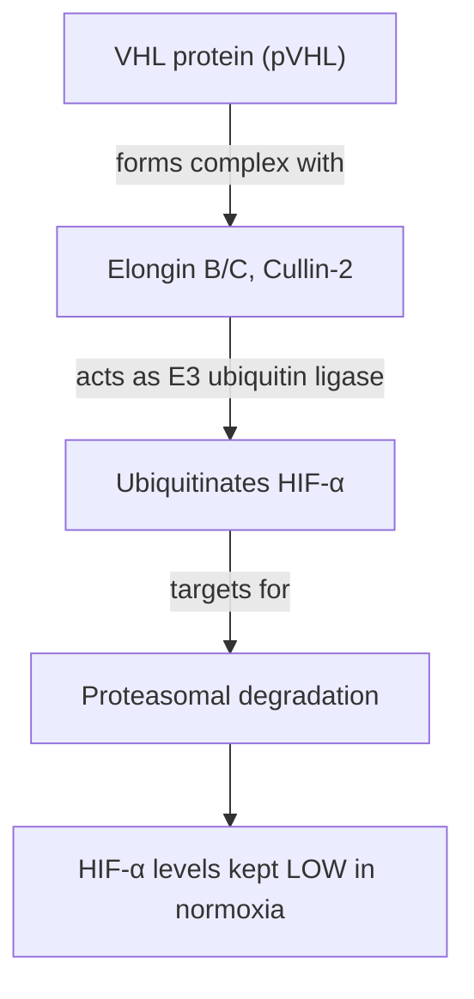
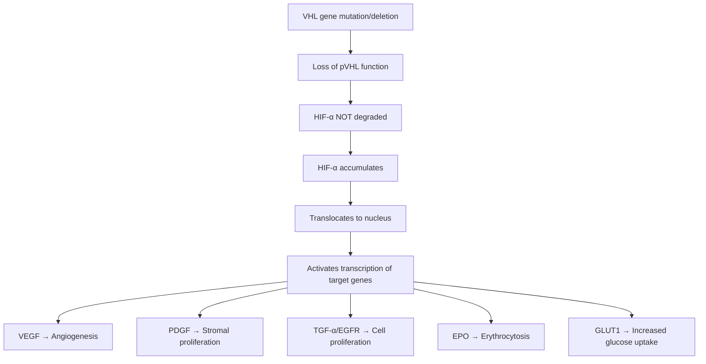
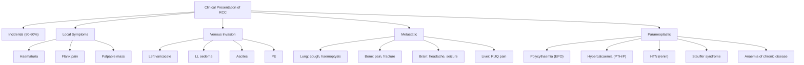

# Renal Cell Carcinoma (RCC) — Definition, Epidemiology, Risk Factors, Anatomy, Etiology, Pathophysiology, Classification & Clinical Features

---

## 1. Definition

Renal cell carcinoma (RCC) is a malignant neoplasm arising from the **renal tubular epithelium** (i.e., the renal cortex/parenchyma). Let's break down the name:

- **Renal** = kidney (Latin: *ren*)
- **Cell** = referring to the epithelial cells lining the renal tubules
- **Carcinoma** = malignant tumour of epithelial origin (Greek: *karkinos* = crab, *-oma* = tumour)

So "renal cell carcinoma" literally tells you: a cancer of the epithelial cells of the kidney. This distinguishes it from urothelial carcinoma of the renal pelvis (which arises from transitional epithelium), nephroblastoma (embryonic tissue), and renal sarcomas (mesenchymal origin).

> ***RCC is the most common primary renal neoplasm, accounting for 80–85% of all primary renal neoplasms*** [1][2][3].

It is notoriously called the "internist's tumour" because of its protean manifestations — it can present with almost anything due to paraneoplastic syndromes, and is also called the "great mimic."

---

## 2. Epidemiology

### 2.1 Global Burden

- ***RCC accounts for approximately 2–4% of all adult cancers, with ~214,000 new cases per year worldwide*** [3].
- ***In Hong Kong: incidence ~4.8/100,000; mortality ~1.6/100,000*** [3].
- Incidence has been rising globally, partly due to increased use of cross-sectional imaging (CT/USG) detecting incidental small renal masses — the so-called "incidentaloma" effect.

### 2.2 Demographics

| Factor | Detail |
|--------|--------|
| **Sex** | ***Male predominance (M:F ≈ 1.5–2:1)*** [2][3] — androgens may promote tumour growth, and males have higher rates of smoking and occupational exposures |
| **Age** | ***6th–8th decade of life (median age of diagnosis = 64 years)*** [2][3] |
| **Ethnicity** | ***Less common in Asians*** compared to Western populations [3]; higher in African Americans in the US |

### 2.3 Prevalence of Kidney Cancers (for context)

| Type | Proportion | Origin |
|------|-----------|--------|
| ***Renal cell carcinoma*** | ***80–85%*** | Renal cortex (tubular epithelium) |
| ***Urothelial (transitional cell) carcinoma*** | ***~8%*** | Renal pelvis |
| ***Nephroblastoma (Wilms' tumour)*** | ***5–6%*** | Embryonic nephrogenic tissue (children) |
| Others | Rare | Oncocytoma, sarcomas, etc. |

<Callout title="High Yield — Incidental Detection">
***50–60% of RCC cases are now discovered incidentally on imaging*** (e.g., abdominal USG or CT done for other reasons) [4]. This means the majority of patients are asymptomatic at presentation. The classic triad of haematuria, flank pain, and palpable mass is seen in only 10–20% — and when present, usually indicates advanced disease.
</Callout>

---

## 3. Relevant Anatomy and Function

Understanding the anatomy is critical because it explains patterns of spread and clinical features.

### 3.1 Gross Anatomy of the Kidney

- The kidney has two functional zones:
  - **Cortex** (outer) — contains glomeruli and proximal/distal convoluted tubules → this is where RCC arises
  - **Medulla** (inner) — contains loops of Henle and collecting ducts
- The **renal pelvis** (funnel-shaped structure collecting urine) is lined by urothelium — this is where urothelial carcinoma arises (distinct from RCC)

### 3.2 Vascular Anatomy (Key for Understanding Spread)

This is where things get interesting and clinically important:

- **Renal arteries** → branch from the aorta at L1–L2 level
- **Renal veins** → drain directly into the **IVC**
  - The **left renal vein** is longer, crosses anterior to the aorta, and receives the **left gonadal (testicular/ovarian) vein** and the **left adrenal vein**
  - The **right renal vein** is shorter, draining directly into the IVC; the right gonadal vein drains directly into the IVC (not via the renal vein)

**Why does this matter?**

RCC has a unique propensity to invade the **renal vein** and extend as a **tumour thrombus** into the **IVC**, and even into the **right atrium**. This is almost pathognomonic for RCC among solid organ cancers.

- ***Left-sided RCC invading the left renal vein*** → obstructs drainage of the **left gonadal vein** → **left-sided varicocele** (this is a classic exam pearl!) [4]
- ***IVC invasion*** → **bilateral lower limb oedema, ascites, hepatomegaly** (Budd-Chiari-like picture), and even **pulmonary embolism** if tumour thrombus dislodges [4]

### 3.3 Lymphatic Drainage

- Para-aortic and paracaval lymph nodes (retroperitoneal lymph nodes)
- ***Most common site of regional metastasis: retroperitoneal lymph nodes*** [2]

### 3.4 Metastatic Pathways

RCC metastasises via:
1. **Haematogenous spread** (most important — via the renal vein → IVC → systemic circulation)
2. **Lymphatic spread** (retroperitoneal nodes)
3. **Direct invasion** (perinephric fat, adrenal gland, adjacent structures)

***Most common sites of distant metastasis: lung (most common, ~50–60%), bone, liver, brain, lymph nodes*** [2][4]

<Callout title="Why does RCC love to metastasise to the lung?" type="idea">
Because the venous drainage of the kidney goes directly into the IVC → right heart → pulmonary arteries → lungs. This is the first capillary bed that tumour emboli encounter. This is exactly the same reason liver cancers also commonly metastasise to the lungs (hepatic veins → IVC → lungs). The lung is the "first filter" for venous drainage from the kidney.
</Callout>

### 3.5 The Gerota's Fascia

- The kidney is enclosed within **Gerota's fascia** (perirenal fascia), which forms a natural anatomical barrier.
- Tumour confined within Gerota's fascia has a better prognosis (T1–T3a) than tumour breaching it (T4).
- This is why radical nephrectomy removes the kidney *along with* Gerota's fascia, the perirenal fat, and ipsilateral adrenal (if involved).

---

## 4. Etiology and Risk Factors

### 4.1 Overview

RCC is a multifactorial disease. Risk factors can be organised by the surgical sieve or, more practically for clinical clerking, by history-taking categories:

### 4.2 Modifiable Risk Factors

#### A. Smoking
- ***Smoking is a major risk factor: RR ≈ 1.31 (all smokers), 1.36 (current smokers), 1.16 (ex-smokers)*** [1][3]
- ***Also associated with more advanced disease at presentation*** [3]
- **Mechanism**: Tobacco smoke contains nitrosamines and polycyclic aromatic hydrocarbons that are filtered by the kidney, causing direct mutagenic damage to tubular epithelial cells. Smoking also causes chronic tissue hypoxia, which upregulates hypoxia-inducible factor (HIF) — the same pathway involved in VHL-related RCC (see pathophysiology below).

#### B. Obesity
- ***Obesity is an independent risk factor*** [1][2]
- **Mechanism**: Multiple pathways:
  - Increased circulating insulin and IGF-1 (mitogenic)
  - Chronic inflammation (adipokines, IL-6, TNF-α)
  - Altered sex hormone metabolism (higher oestrogen levels)
  - Lipid peroxidation causing oxidative DNA damage in renal tubular cells

#### C. Hypertension
- ***Hypertension is a risk factor*** [1][2]
- **Mechanism**: Unclear, but hypotheses include:
  - Chronic renal hypoxia from arteriolar damage → HIF upregulation
  - Increased ROS (reactive oxygen species) damaging tubular DNA
  - Note: antihypertensive medications (especially diuretics) were once implicated, but HTN itself appears to be the independent risk factor

#### D. Occupational/Environmental Exposures
- ***Cadmium, asbestos, petroleum by-products*** [2][3]
- Nitrosamines, aflatoxin B1 [2]
- ***Occupations: leather tanners, shoe workers*** [2]
- **Mechanism**: These are direct or indirect carcinogens that accumulate in the renal cortex during filtration and excretion.

#### E. Analgesic Use
- ***Heavy and prolonged use of aspirin, paracetamol (acetaminophen), and NSAIDs*** [2][3]
- **Mechanism**: Chronic analgesic use → analgesic nephropathy → chronic tubular injury and regenerative proliferation → increased mutation risk. Similar mechanism to why chronic inflammation predisposes to cancer elsewhere.

### 4.3 Medical Risk Factors

#### A. ***Chronic Kidney Disease and Acquired Cystic Kidney Disease***
- ***Acquired polycystic kidney disease (due to chronic dialysis): 30× risk of RCC*** [1][2][3]
- ***Require yearly USG screening*** [3]
- **Key distinction**: These kidneys are **small to normal** in size (unlike ADPKD where kidneys are enlarged) [2]
- **Mechanism**: Chronic uraemia → cyst formation → epithelial dysplasia within cysts → malignant transformation. The cystic environment promotes genomic instability.

<Callout title="Acquired Cystic Kidney Disease vs. ADPKD" type="error">
Students often confuse these. Acquired cystic kidney disease occurs in patients on **long-term dialysis** (haemo- or peritoneal), and kidneys are **small to normal** in size. ADPKD is a genetic condition with **large** kidneys. Both can develop RCC, but the dialysis-associated risk is much more dramatic (30× increase).
</Callout>

#### B. Renal Transplantation
- ***Associated immunosuppression increases RCC risk*** [2]
- **Mechanism**: Immunosuppressive drugs (e.g., CNIs, mycophenolate) reduce immune surveillance against nascent tumour cells. This is a general principle: immunosuppression → reduced immune editing → cancer.

#### C. ***Chronic Hepatitis C*** [3]
- Mechanism likely relates to chronic inflammation and possibly direct viral effects on renal epithelium.

#### D. ***Sickle Cell Disease*** — specifically associated with **renal medullary carcinoma** (a very aggressive subtype) [3][5]

#### E. ***Kidney Stones*** [3]
- Chronic inflammation and irritation of renal epithelium.

#### F. ***Prior Kidney Irradiation*** and ***Cytotoxic Chemotherapy in Childhood*** [3]
- Direct DNA damage from radiation and alkylating agents.

### 4.4 Genetic/Hereditary Risk Factors

***Genetic predisposition: Family history and inherited syndromes such as von Hippel-Lindau, Birt-Hogg-Dubé, hereditary papillary RCC, and tuberous sclerosis*** [1].

Hereditary RCC accounts for ~5% of cases but is disproportionately important because:
1. These patients present **younger** (often < 40 years)
2. Tumours are often **bilateral and multifocal**
3. Understanding the genetics teaches us the **molecular pathogenesis** of sporadic RCC too

| Syndrome | Gene | Chromosome | Inheritance | Associated RCC Subtype | Other Associations |
|----------|------|-----------|-------------|----------------------|-------------------|
| ***Von Hippel-Lindau (VHL)*** | *VHL* | ***3p25*** | ***AD*** | ***Clear cell RCC (~40%)*** | ***Phaeochromocytoma (14%), cerebellar haemangioblastoma, retinal angiomas, renal cysts (75%), pancreatic cysts/NETs, epididymal cystadenoma*** [2][3] |
| ***Hereditary papillary RCC (HPRCC)*** | ***MET*** | ***7q31*** | ***AD*** | ***Bilateral, multifocal papillary RCC*** [3] | — |
| ***Birt-Hogg-Dubé*** | *FLCN* (folliculin) | 17p11 | AD | Chromophobe RCC, oncocytoma, hybrid tumours | Fibrofolliculomas (skin), pulmonary cysts, spontaneous pneumothorax |
| ***Tuberous sclerosis complex (TSC)*** | *TSC1/TSC2* | 9q34/16p13 | AD | ***RCC develops in < 5% of individuals*** [3] | Angiomyolipomas (most common renal lesion in TSC), cortical tubers, cardiac rhabdomyomas, LAM |
| Hereditary leiomyomatosis and RCC (HLRCC) | *FH* (fumarate hydratase) | 1q42 | AD | Aggressive papillary type 2 RCC | Cutaneous and uterine leiomyomas |

---

## 5. Pathophysiology

### 5.1 The VHL Pathway — The Central Molecular Story of Clear Cell RCC

This is the most important pathway to understand because:
- ***VHL gene mutation is found in ~90% of sporadic clear cell RCC*** (not just hereditary cases) [3]
- It explains the biology of the tumour and the rationale for targeted therapy

**Normal VHL function:**

Under **normal oxygen conditions** (normoxia):
1. HIF-α (hypoxia-inducible factor alpha) is hydroxylated by prolyl hydroxylases (oxygen-dependent enzymes)
2. Hydroxylated HIF-α is recognised by the **VHL protein** (pVHL)
3. pVHL is part of an E3 ubiquitin ligase complex → tags HIF-α for proteasomal degradation
4. Result: HIF-α is kept at low levels → downstream targets are NOT activated

**What happens when VHL is lost (mutated/deleted)?**

**Key downstream effects of HIF-α accumulation:**

| Target Gene | Protein | Effect | Clinical Relevance |
|-------------|---------|--------|-------------------|
| *VEGF* | Vascular endothelial growth factor | **Angiogenesis** — new blood vessel formation | Highly vascular tumour on imaging; target of anti-VEGF therapy (sunitinib, pazopanib, bevacizumab) |
| *PDGF* | Platelet-derived growth factor | Stromal support, vessel maturation | Target of multi-kinase inhibitors |
| *EPO* | Erythropoietin | Red cell production | **Paraneoplastic polycythaemia** |
| *TGF-α* | Transforming growth factor alpha | Autocrine growth stimulation via EGFR | Tumour proliferation |
| *GLUT1* | Glucose transporter 1 | Increased glucose uptake | Warburg effect, FDG-PET avidity |
| *CA-IX* | Carbonic anhydrase IX | pH regulation | Immunohistochemistry marker for clear cell RCC |

**Why "clear cell"?**

The clear cytoplasm seen on histology is due to **accumulation of lipid and glycogen** in the cytoplasm. During histological processing (fixation and staining with H&E), these lipids and glycogen are dissolved out, leaving empty-appearing ("clear") cells. The lipid/glycogen accumulation is driven by HIF-mediated metabolic reprogramming (increased glucose uptake via GLUT1 and altered lipid metabolism).

<Callout title="VHL — The Master Switch" type="idea">
Think of VHL as the "brake pedal" on angiogenesis and cell growth. When VHL is lost, the car (tumour) accelerates uncontrollably. This is why clear cell RCC is one of the most **vascular** solid tumours — it's essentially pumping out VEGF all the time. This also explains why it responds to **anti-angiogenic therapies** (TKIs targeting VEGF receptor) and why it's classically **resistant to conventional chemotherapy** (chemotherapy relies on good blood supply to deliver drugs, but paradoxically, the disordered vasculature in RCC is leaky and dysfunctional).
</Callout>

### 5.2 Other Molecular Pathways

| RCC Subtype | Key Genetic Alteration | Pathway |
|-------------|----------------------|---------|
| ***Clear cell*** | ***Del(3p), VHL mutation*** [3] | HIF/VEGF pathway (as above) |
| ***Papillary Type 1*** | ***Trisomy 7, MET gene activation (7q)*** [3] | MET/HGF signalling → cell proliferation and motility |
| ***Papillary Type 2*** | ***Trisomy 16, 17; loss of Y*** [3]; FH mutations in HLRCC | Fumarate accumulation → HIF stabilisation (pseudohypoxia) |
| ***Chromophobe*** | Multiple chromosomal losses (1, 2, 6, 10, 13, 17, 21) | mTOR pathway activation |

### 5.3 Mechanisms of Paraneoplastic Syndromes

RCC is notorious for paraneoplastic phenomena (~6–10% of patients) [4]. The mechanisms are:

| Paraneoplastic Phenomenon | Mechanism | Frequency |
|--------------------------|-----------|-----------|
| **Polycythaemia** | Tumour produces **EPO** (remember: HIF-α drives EPO transcription when VHL is lost) | ~3–5% |
| **Hypercalcaemia** | Tumour produces **PTHrP** (parathyroid hormone-related peptide) mimicking PTH; also 1α-hydroxylation of vitamin D by tumour cells | ~13–20% |
| **Hypertension** (non-renal artery related) | Tumour produces **renin** → RAAS activation | Uncommon |
| **Anaemia of chronic disease** | Chronic inflammation (IL-6, hepcidin upregulation) → functional iron deficiency | Common |
| ***Stauffer syndrome (non-metastatic hepatic dysfunction)*** | Unknown mechanism — likely cytokine-mediated (IL-6); characterised by ***abnormal LFTs, hepatosplenomegaly, fever*** without liver metastases; **resolves after nephrectomy** | ~3–6% |
| Fever/cachexia | Cytokine production (IL-6, TNF-α) | Common |

<Callout title="Stauffer Syndrome" type="error">
This is a frequently tested concept. ***Stauffer syndrome = non-metastatic liver dysfunction in RCC*** [4]. The LFTs are abnormal (raised ALP, GGT, bilirubin), there is hepatosplenomegaly, but there are **no liver metastases** on imaging. It is a paraneoplastic phenomenon that **reverses** after tumour resection. If LFT abnormalities persist post-nephrectomy, think recurrence. Do not mistake it for metastatic disease and deny the patient potentially curative surgery!
</Callout>

---

## 6. Classification

### 6.1 Histological Classification (WHO)

***The main subtypes and their features*** [1][5]:

| ***Subtype*** | ***Approximate Incidence*** | ***Origin/Histology*** | ***Key Features*** |
|---|---|---|---|
| ***Clear Cell RCC (ccRCC)*** | ***~70–80%*** | ***Proximal tubule epithelial cells*** | ***Most common subtype; characterised by clear cytoplasm due to lipid/glycogen; associated with VHL gene mutation; aggressive behaviour*** [5] |
| ***Papillary RCC (pRCC)*** | ***~10–15%*** | ***Distal tubule epithelial cells*** | ***Divided into Type 1 (small basophilic cells, MET gene alterations, better prognosis) and Type 2 (larger eosinophilic cells, worse prognosis); new WHO classifications are evolving*** [5] |
| ***Chromophobe RCC*** | ***~5–10%*** | ***Distal tubule intercalated cells*** | ***Pale eosinophilic cytoplasm with distinct cell membranes; better prognosis than ccRCC*** [5] |
| ***Collecting Duct Carcinoma*** | ***~1%*** | ***Collecting ducts*** | ***Rare, aggressive subtype with poor prognosis*** [5] |
| ***Renal Medullary Carcinoma*** | ***< 1%*** | ***Medullary region; related to sickle cell disease*** | ***Very aggressive, mostly in young patients with sickle cell trait*** [5] |
| ***Translocation RCC*** | ***Rare*** | ***Variable; involving TFE3 or TFEB gene translocations*** | ***Usually affects children and young adults; distinct molecular pathology*** [5] |
| ***Mucinous Tubular and Spindle Cell Carcinoma*** | ***Rare*** | ***Distal tubule*** | ***Indolent behaviour; low metastatic potential*** [5] |

### 6.2 TNM Staging (AJCC/UICC 8th Edition, 2017)

| Stage | T | Description |
|-------|---|-------------|
| T1a | | Tumour ≤ 4 cm, limited to kidney |
| T1b | | Tumour > 4 cm but ≤ 7 cm, limited to kidney |
| T2a | | Tumour > 7 cm but ≤ 10 cm, limited to kidney |
| T2b | | Tumour > 10 cm, limited to kidney |
| T3a | | Tumour extends into renal vein or its segmental branches, or invades perirenal/renal sinus fat, but not beyond Gerota's fascia |
| T3b | | Tumour extends into IVC below diaphragm |
| T3c | | Tumour extends into IVC above diaphragm or invades wall of IVC |
| T4 | | Tumour invades beyond Gerota's fascia (including contiguous extension into ipsilateral adrenal gland) |

| Stage | N | Description |
|-------|---|-------------|
| N0 | | No regional lymph node metastasis |
| N1 | | Metastasis in regional lymph node(s) |

| Stage | M | Description |
|-------|---|-------------|
| M0 | | No distant metastasis |
| M1 | | Distant metastasis |

**Prognostic Stage Grouping:**

| Stage | TNM |
|-------|-----|
| I | T1 N0 M0 |
| II | T2 N0 M0 |
| III | T1–T2 N1 M0 or T3 N0–N1 M0 |
| IV | T4 any N M0 or any T any N M1 |

<Callout title="Key Staging Points for Exams">
- **T1**: ≤ 7 cm, confined to kidney (a ≤ 4 cm, b 4–7 cm) — these are candidates for **partial nephrectomy**
- **T3**: renal vein / IVC involvement or perinephric fat invasion (but still within Gerota's) — this is the "tumour thrombus" stage
- **T4**: beyond Gerota's fascia — locally advanced
- **Any M1** = Stage IV regardless of T or N
</Callout>

### 6.3 Fuhrman Nuclear Grade (Historical) / WHO/ISUP Grade (Current)

The grading system has transitioned from the older Fuhrman system to the **WHO/ISUP grading system** (2013, updated), based on **nucleolar prominence**:

| Grade | Description | Prognosis |
|-------|-------------|-----------|
| 1 | Nucleoli absent or inconspicuous at 400× | Best |
| 2 | Nucleoli conspicuous at 400× but inconspicuous at 100× | |
| 3 | Nucleoli conspicuous at 100× | |
| 4 | Extreme nuclear pleomorphism, sarcomatoid/rhabdoid differentiation | Worst |

---

## 7. Clinical Features

### 7.1 Overview of Presentation

***RCC is usually asymptomatic and presents until disease is advanced*** [2]. The presentation can be categorised as:

1. **Incidental** (most common today)
2. **Local symptoms** (haematuria, flank pain, mass)
3. **Symptoms from venous invasion**
4. **Metastatic symptoms**
5. **Paraneoplastic syndromes**

### 7.2 Symptoms

#### A. ***Incidental Finding on Imaging (50–60%)*** [4]
- This is the **most common presentation** in the modern era
- Found on USG/CT performed for other indications (e.g., abdominal pain workup, health screening)
- **Why?** Widespread availability of cross-sectional imaging. These tumours are often small and asymptomatic.

#### B. ***Classical Triad (10–20% of patients)*** [4]
The classic triad is: ***haematuria + flank pain + palpable renal mass***

However, this triad is now rare and when present, usually indicates **advanced disease**.

| Symptom | Mechanism |
|---------|-----------|
| **Haematuria** (most common symptom when symptomatic, ~40–60%) | Tumour invades into the **collecting system** (renal pelvis/calyces), eroding blood vessels → blood enters the urine. Typically **painless** and **intermittent** (macro or micro). May cause clot colic if large clots pass through the ureter. |
| **Flank pain** (~40%) | Due to **capsular distension** (the renal capsule is innervated by T10–L1 sensory fibres; as tumour grows, it stretches the capsule causing a dull, constant ache). Can also be caused by **haemorrhage within the tumour**, **ureteric obstruction** by clots, or **direct nerve invasion**. |
| **Palpable abdominal/flank mass** (~25%) | The tumour must be large enough to be palpable — usually > 10 cm. The mass is in the **loin**, moves with respiration (attached to diaphragm via kidney), is **ballottable** (bimanually palpable because the kidney is a retroperitoneal organ). |

#### C. Symptoms from Venous Extension

***RCC uniquely invades into the renal vein, IVC, and even the right atrium*** [4].

| Symptom | Mechanism |
|---------|-----------|
| ***Left-sided varicocele*** | ***Left renal vein invasion*** → obstructs the **left gonadal (testicular) vein** which drains into the left renal vein → venous congestion → dilatation of the pampiniform plexus = varicocele [4]. This is classically **non-reducible** on lying down (unlike idiopathic varicoceles). A new left varicocele in an older man that does NOT decompress when supine should raise alarm for RCC. |
| ***Bilateral lower limb oedema*** | ***IVC invasion/obstruction*** → impaired venous return from lower limbs → bilateral (symmetric) pitting oedema [4]. Note: unilateral oedema is more suggestive of DVT; bilateral suggests proximal obstruction (IVC). |
| ***Ascites*** | IVC obstruction → increased hydrostatic pressure in hepatic veins → transudative ascites (similar mechanism to Budd-Chiari syndrome) [4] |
| ***Pulmonary embolism*** | Tumour thrombus in the IVC can **fragment and embolise** to the pulmonary arteries [4]. This can be the presenting event. |
| **Dilated abdominal wall veins (caput medusae-like)** | IVC obstruction → blood seeks collateral pathways → superficial abdominal/thoracic veins become dilated |

<Callout title="Left Varicocele — A Classic Exam Trap" type="error">
A **new-onset left varicocele** in a man > 40 years that **does not decompress on lying flat** should prompt investigation for a **left renal mass**. The reason it's always the LEFT side: the left testicular vein drains into the left renal vein (the right testicular vein drains directly into the IVC, so right-sided RCC less commonly causes varicocele). If you see a right-sided varicocele, think of IVC obstruction or situs inversus.
</Callout>

#### D. Metastatic Symptoms

***25% of patients present with advanced locoregional disease or distant metastasis*** [2].

| Site | Symptoms | Mechanism |
|------|----------|-----------|
| **Lung** (most common, ~50–60%) | Cough, haemoptysis, dyspnoea, chest pain | Haematogenous spread via renal vein → IVC → right heart → pulmonary arteries. Can present as solitary or multiple pulmonary nodules, or lymphangitis carcinomatosa |
| **Bone** (~30%) | Bone pain, pathological fractures, spinal cord compression | Haematogenous spread. RCC bony metastases are characteristically **lytic** (osteoclast-activating) and **highly vascular** — important because biopsy of bone mets can cause significant haemorrhage. Common sites: spine, pelvis, femur, humerus |
| **Brain** (~5–10%) | Headache, seizures, focal neurological deficits | Haematogenous spread |
| **Liver** | RUQ pain, jaundice (late), hepatomegaly | Haematogenous or direct extension (right kidney adjacent to liver) |
| ***Retroperitoneal lymph nodes*** | Usually asymptomatic; may cause back pain or ureteric obstruction | Lymphatic drainage |

> **"Cannonball" lung metastases** — RCC is one of the classic causes of multiple, well-defined, round pulmonary nodules on CXR (the others include choriocarcinoma, melanoma, and sarcoma). These are called "cannonball" metastases.

#### E. Constitutional/Systemic Symptoms

| Symptom | Mechanism |
|---------|-----------|
| **Weight loss, anorexia, malaise** | Cancer cachexia — tumour produces cytokines (TNF-α, IL-6) that increase basal metabolic rate, suppress appetite, and promote muscle catabolism |
| **Fever of unknown origin (FUO)** | Tumour produces pyrogens (IL-1, IL-6, TNF-α). RCC is one of the classic causes of FUO of neoplastic origin |
| **Night sweats** | Same cytokine-mediated mechanism |

### 7.3 Signs

#### A. General Examination

| Sign | Significance |
|------|-------------|
| **Cachexia** | Advanced disease |
| **Pallor** | Anaemia (chronic disease or haematuria-related) |
| **Plethora (ruddy complexion)** | Polycythaemia from EPO production (paraneoplastic) |
| **Hypertension** | Paraneoplastic (renin production) or renal artery compression |

#### B. Abdominal Examination

| Sign | Significance |
|------|-------------|
| **Palpable flank/loin mass** | Large tumour; ballottable; moves with respiration |
| **Hepatomegaly** | Liver metastases or Stauffer syndrome (non-metastatic hepatic dysfunction) |
| **Ascites** | IVC obstruction or peritoneal metastases |

#### C. Scrotal Examination

| Sign | Significance |
|------|-------------|
| ***Left varicocele (non-reducing on lying flat)*** | ***Left renal vein invasion*** [4] |

#### D. Lower Limbs

| Sign | Significance |
|------|-------------|
| **Bilateral non-pitting → pitting oedema** | IVC obstruction |

#### E. Paraneoplastic Signs (see table in Section 5.3)

### 7.4 Summary of Clinical Features by Category

---

## 8. Benign Renal Masses (Important Differential — Brief Overview)

***Only 20% of renal masses are benign*** [4]. Key benign mimics:

| Lesion | Features | Key Distinguishing Point |
|--------|----------|------------------------|
| **Oncocytoma** | Well-circumscribed, central stellate scar on CT; composed of oncocytes (eosinophilic cells) | Cannot reliably distinguish from chromophobe RCC on imaging alone; often requires histology |
| **Angiomyolipoma (AML)** | Contains fat, smooth muscle, and blood vessels; strongly associated with **tuberous sclerosis** | **Macroscopic fat on CT** (Hounsfield units < -20) is virtually diagnostic; risk of haemorrhage if > 4 cm |
| **Simple renal cyst** | Bosniak I or II (thin wall, no enhancement, no septation) | Very common, benign, no follow-up needed |
| **Complex renal cyst** | Bosniak IIF–IV → increasing likelihood of malignancy | Bosniak IV ≈ 100% malignancy rate → requires surgical excision |

---

<Callout title="High Yield Summary">

1. **RCC arises from renal tubular epithelium** (most commonly proximal tubule → clear cell type, 70–80%).
2. **Epidemiology**: Male > Female, 6th–8th decade, median age 64. In HK: incidence 4.8/100,000.
3. **Major risk factors**: ***Smoking, obesity, hypertension, acquired cystic kidney disease (30× risk in dialysis patients), VHL syndrome, Birt-Hogg-Dubé, hereditary papillary RCC, tuberous sclerosis***.
4. **VHL pathway is central**: Loss of VHL → HIF-α accumulation → VEGF (angiogenesis), EPO (polycythaemia), PDGF (proliferation). This explains the tumour's hypervascularity, anti-VEGF therapy responsiveness, and chemo-resistance.
5. **Most patients are asymptomatic** — 50–60% found incidentally on imaging.
6. **Classic triad** (haematuria + flank pain + palpable mass) = late presentation (10–20%).
7. ***RCC uniquely invades the renal vein and IVC*** → left varicocele (non-reducing), bilateral LL oedema, PE, ascites.
8. **Paraneoplastic syndromes** (6–10%): polycythaemia (EPO), hypercalcaemia (PTHrP), HTN (renin), ***Stauffer syndrome*** (non-metastatic hepatic dysfunction → reversible post-nephrectomy), anaemia of chronic disease.
9. **Most common metastatic sites**: Lung (cannonball mets) > bone (lytic, vascular) > liver > brain > lymph nodes.
10. **Histological subtypes**: Clear cell (70–80%) > papillary (10–15%) > chromophobe (5–10%) > collecting duct (~1%) > medullary (< 1%, sickle cell trait).

</Callout>

---

<ActiveRecallQuiz
  title="Active Recall - Renal Cell Carcinoma (Part 1)"
  items={[
    {
      question: "What is the molecular function of the VHL protein, and what happens at the cellular level when it is lost in clear cell RCC?",
      markscheme: "VHL protein is part of an E3 ubiquitin ligase complex that targets hydroxylated HIF-alpha for proteasomal degradation. When VHL is lost, HIF-alpha accumulates and translocates to the nucleus, activating transcription of VEGF (angiogenesis), EPO (erythrocytosis), PDGF (proliferation), TGF-alpha, and GLUT1 (glucose uptake). This explains the tumour hypervascularity and paraneoplastic polycythaemia."
    },
    {
      question: "A 55-year-old man presents with a new left-sided varicocele that does not decompress on lying flat. What is the most likely underlying diagnosis, and what is the anatomical explanation?",
      markscheme: "Most likely left renal cell carcinoma invading the left renal vein. The left testicular vein drains into the left renal vein (unlike the right which drains directly into IVC). Tumour thrombus in the left renal vein obstructs testicular vein outflow, causing varicocele. Non-reducing on lying flat distinguishes it from idiopathic varicocele."
    },
    {
      question: "Name 4 paraneoplastic syndromes associated with RCC and explain the mechanism of each.",
      markscheme: "1) Polycythaemia - tumour produces EPO via HIF pathway. 2) Hypercalcaemia - PTHrP secretion or tumour 1-alpha-hydroxylation of vitamin D. 3) Hypertension - renin secretion by tumour. 4) Stauffer syndrome - non-metastatic hepatic dysfunction (raised ALP, GGT) likely due to IL-6; reverses after nephrectomy. Also accept: anaemia of chronic disease (IL-6/hepcidin), fever (cytokine-mediated)."
    },
    {
      question: "What is the key distinguishing feature between acquired cystic kidney disease and ADPKD, and what is the relative risk of RCC in acquired cystic kidney disease?",
      markscheme: "Acquired cystic kidney disease occurs in patients on long-term dialysis; kidneys are small to normal in size. ADPKD is a genetic condition with large kidneys. Acquired cystic kidney disease confers a 30-fold increased risk of RCC, requiring annual USG screening."
    },
    {
      question: "List the 4 most common hereditary syndromes predisposing to RCC, their associated genes, and the RCC subtypes they cause.",
      markscheme: "1) Von Hippel-Lindau (VHL gene, 3p25) - clear cell RCC. 2) Hereditary papillary RCC (MET gene, 7q31) - bilateral multifocal papillary RCC. 3) Birt-Hogg-Dube (FLCN gene, 17p11) - chromophobe RCC, oncocytoma. 4) Tuberous sclerosis complex (TSC1/TSC2) - RCC in under 5% of patients. Also accept HLRCC (FH gene) - aggressive papillary type 2."
    },
    {
      question: "Why is clear cell RCC called 'clear cell' on histology, and how does this relate to the underlying molecular pathology?",
      markscheme: "The clear cytoplasm is due to accumulation of lipid and glycogen, which are dissolved during histological processing leaving empty-appearing cells. This is driven by HIF-mediated metabolic reprogramming - loss of VHL leads to HIF-alpha accumulation, which upregulates GLUT1 (increased glucose uptake and glycogen storage) and alters lipid metabolism."
    }
  ]}
/>

---

## References

[1] Lecture slides: GC 183. Common urological malignancies and their presentations - Nov 7.pdf (pp. 7, 17)
[2] Senior notes: felixlai.md (Renal cell carcinoma section)
[3] Senior notes: Ryan Ho Urogenital.pdf (p. 145, Section 7.3)
[4] Senior notes: maxim.md (Renal cell carcinoma section)
[5] Lecture slides: GC 183. Common urological malignancies and their presentations - Nov 7.pdf (p. 17 — RCC Subtypes table)
