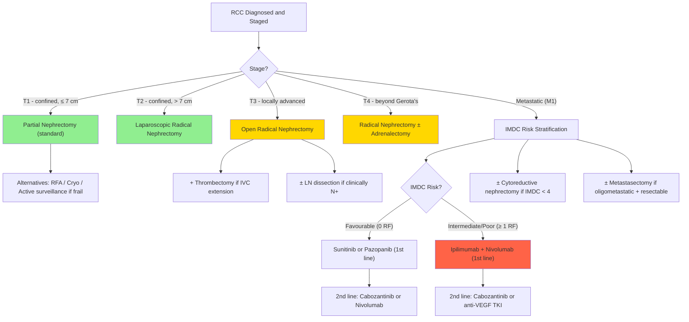

## Management of Renal Cell Carcinoma — Algorithm, Treatment Modalities, Indications & Contraindications

---

### 1. Guiding Principles of RCC Management

Before we walk through the algorithm, let's establish the fundamental principles that make RCC management unique among solid cancers:

1. **Surgery is the only curative treatment for localised RCC** — there is no effective adjuvant chemotherapy, and the role of adjuvant immunotherapy/targeted therapy remains limited [2][3].
2. ***RCC is classically resistant to conventional chemotherapy*** — **NO role of chemotherapy** in treatment of RCC. The reason: the kidney tubular epithelium from which RCC arises is rich in **P-glycoprotein (MDR1)**, a drug efflux pump that actively pumps out chemotherapeutic agents. Additionally, RCC's disordered vasculature (from VEGF overexpression) paradoxically limits effective drug delivery [2].
3. ***Radiotherapy is ONLY indicated for palliation*** — specifically for **brain or bone metastasis** [2]. RCC is considered a "radioresistant" tumour (though stereotactic radiosurgery has shown some efficacy).
4. **The immune system matters in RCC** — RCC is one of the most "immunogenic" solid tumours. Historically it was one of the few cancers that responded to IL-2 and IFN-α. This immune sensitivity is why modern **checkpoint inhibitors** (anti-PD-1, anti-CTLA-4) have revolutionised metastatic RCC management.
5. **The VHL/HIF/VEGF pathway is druggable** — loss of VHL → HIF-α accumulation → VEGF overexpression → angiogenesis. This is the rational basis for **anti-VEGF TKIs** and **mTOR inhibitors**.
6. **Even in metastatic disease, surgery often has a role** — "cytoreductive nephrectomy" (removing the primary tumour even when metastases are present) and "metastasectomy" (removing isolated metastases) can improve survival in selected patients [3].

---

### 2. Master Management Algorithm

---

### 3. Management of Localised Disease (Stage I–III)

#### 3.1 Surgical Treatment — The Curative Modalities

##### A. ***Partial Nephrectomy (Nephron-Sparing Surgery)*** — Standard for T1

"Partial nephrectomy" means removing **only the tumour with a margin of normal parenchyma**, preserving the rest of the kidney.

**Why is this preferred over radical nephrectomy for small tumours?**
- Studies show **non-inferior overall survival** compared to radical nephrectomy for T1 disease [3]
- **Better long-term renal function preservation** → reduces risk of CKD, cardiovascular morbidity, and metabolic complications (patients who undergo radical nephrectomy lose ~30% of their overall GFR overnight) [3]
- Up to **20% of resected renal masses turn out to be benign** (oncocytoma, AML) — so preserving the kidney when possible avoids unnecessary organ loss [3]

***Indications*** [2][3]:

| Category | Indication | Rationale |
|----------|-----------|-----------|
| ***Absolute*** | ***Solitary kidney*** | No contralateral kidney to compensate — radical nephrectomy would mean dialysis |
| ***Absolute*** | ***Bilateral tumours*** | Must preserve function on at least one side |
| ***Absolute*** | ***Multiple small tumours*** | Often hereditary (VHL); will likely develop more tumours → preserve nephron mass |
| **Strong relative** | ***Patients with comorbidities that impair renal function or will affect future renal function (e.g., DM, renovascular disease)*** [2][3] | These patients are already prone to CKD; losing a kidney pushes them toward dialysis |
| **Elective** | ***Primary tumour ≤ 7 cm (T1 stage)*** [1][2] | Standard of care for T1a (≤ 4 cm) and T1b (4–7 cm) when technically feasible |

***Contraindications*** [3]:
- Insufficient volume of remaining parenchyma (tumour too large relative to kidney)
- Renal vein thrombosis (tumour thrombus in the vein makes clamping and partial resection hazardous)
- Unfavourable tumour location (e.g., central tumour adherent to renal vessels or hilum)
- Use of anticoagulants (relative — increases bleeding risk)

***Surgical approaches*** [2][3]:
| Approach | When Preferred |
|----------|---------------|
| ***Open*** | ***Preferred in difficult cases: solitary kidneys, tumour near the renal hilum*** [2] |
| ***Laparoscopic*** | ***Technically difficult unless robotic-assisted; comparable outcomes with open approach*** [2] |
| ***Robotic-assisted*** | Increasingly the standard; combines the precision of open surgery with the minimal invasiveness of laparoscopy |

**Key operative principle**: ***Should examine kidney carefully to exclude synchronous tumour (7%)*** [3] — i.e., during partial nephrectomy, the surgeon must check the rest of the kidney for additional tumour foci (especially in hereditary syndromes like VHL).

##### B. ***Radical Nephrectomy*** — Standard for T2 and Above

"Radical nephrectomy" means removing the **entire kidney + Gerota's fascia** (the fibrous capsule enclosing kidney and perirenal fat) ± related structures.

***What is removed*** [2][3]:
- Entire kidney
- Gerota's fascia with perirenal fat
- ± Ipsilateral adrenal gland (**only if involved** — routine adrenalectomy is no longer recommended as there is little risk of adrenal recurrence if not clinically involved) [3]
- ± Regional lymph nodes (**extended LN dissection is controversial; usually only in clinically N1 disease or high risk of LN spread**) [3]

***Indications*** [1][3]:

| Stage | Recommendation |
|-------|---------------|
| ***T2 (> 7 cm, confined to kidney)*** | ***Laparoscopic radical nephrectomy as standard*** [1][3] — lower morbidity than open, similar oncological outcome |
| ***T3 (locally advanced)*** | ***Open radical nephrectomy as standard*** [1][3] — allows better access for vascular control, thrombectomy |
| ***T4 (beyond Gerota's fascia)*** | ***Radical nephrectomy ± adrenalectomy*** [1] |

***Key surgical principle***: ***Early ligation of vascular pedicle is important to prevent tumour dissemination; once the artery is occluded, the tumour loses most of its profuse blood supply and massive bleeding during mobilisation becomes less likely*** [2][3].

**Why early ligation?** RCC is one of the most **vascular** solid tumours (remember: VHL loss → VEGF overexpression → abundant tumour vasculature). If you start mobilising the kidney before controlling the artery, you risk catastrophic haemorrhage AND tumour cell dissemination via disturbed venous outflow.

##### C. Related Surgical Procedures

| Procedure | Indication | Details |
|-----------|-----------|---------|
| ***Venous thrombectomy*** [1][3] | ***T3 disease with renal vein/IVC extension*** | ***Simple thrombectomy if thrombus extends up to major hepatic veins; cardiopulmonary bypass ± hypothermic circulatory arrest if thrombus extends above hepatic veins*** [2][3] |
| ***Ipsilateral adrenalectomy*** | Only if adrenal involvement on imaging/intraoperatively | Not routinely performed — ***little risk of adrenal recurrence if not clinically involved*** [3] |
| ***Extended LN dissection*** | ***Clinically N1 or high risk of LN spread*** [3] | Controversial; staging rather than therapeutic benefit in most cases |

<Callout title="Thrombectomy Complexity — From the Renal Vein to the Right Atrium">
The surgical approach to tumour thrombus depends entirely on its **cephalad extent**, which is why MRI is so important preoperatively:

| Thrombus Level | Surgical Approach |
|----------------|------------------|
| Renal vein only | Standard radical nephrectomy with venous clamping |
| IVC below hepatic veins | Abdominal approach; IVC clamping above and below thrombus |
| IVC at/above hepatic veins | May need liver mobilisation, Pringle manoeuvre |
| ***Above diaphragm / right atrium*** | ***Cardiopulmonary bypass ± hypothermic circulatory arrest*** [2][3] — a combined cardiothoracic + urological procedure |

This escalating complexity is why accurate preoperative staging with MRI is essential — it determines whether you need a urologist alone, or a urologist + hepatobiliary surgeon + cardiac surgeon in the same operating room.
</Callout>

##### D. ***Complications of Nephrectomy*** [3]

| Timing | Complication | Mechanism |
|--------|-------------|-----------|
| **Operative** | ***Mortality (~2%)*** | Anaesthetic risk, haemorrhage |
| | ***GA complications*** | Standard anaesthetic risks |
| | ***Pneumothorax*** | Pleural injury (especially with flank/posterior approach to upper pole tumours) |
| | ***Injury to neighbouring organs*** (GI tract, major blood vessels, spleen, pancreas) | Anatomical proximity |
| **Post-operative** | ***Temporary or permanent renal failure*** | Loss of functioning nephrons; especially if pre-existing CKD or solitary kidney |
| | ***Ileus*** | Retroperitoneal dissection → sympathetic irritation → paralytic ileus |
| | ***Wound infection*** (superficial and deep) | Standard surgical complication |

---

#### 3.2 Non-Surgical Local Treatments

##### A. ***Local Ablative Therapy (RFA, Cryoablation, Microwave Ablation)*** [1][3]

| Aspect | Details |
|--------|---------|
| **Principle** | Destroy tumour tissue *in situ* using extreme heat (RFA, microwave) or cold (cryoablation), without removing the kidney |
| ***Indications*** | ***Small cortical tumours (≤ 3 cm), especially for frail patients, high surgical risk, solitary kidney, compromised renal function, hereditary or multiple bilateral tumours*** [3] |
| **Approach** | Percutaneous (image-guided) or laparoscopic |
| **Pre-procedure** | ***Percutaneous renal biopsy should be done to confirm diagnosis*** [3] — unlike nephrectomy, you won't have a surgical specimen, so you need tissue proof before ablating |
| ***Outcomes*** | ***Short- and long-term outcomes can be comparable with PN/RN*** for small tumours [3]; however ***oncological outcomes are inferior to surgery and associated with a higher recurrence rate*** overall [2] |
| **Advantage** | ***Maximal preservation of renal parenchyma and function*** [2] |

**Why biopsy before ablation?** Because with surgery, the removed specimen provides tissue diagnosis. With ablation, nothing is removed — you're destroying the tumour in place. You need to confirm it's actually cancer (and not an oncocytoma or AML) before you ablate it.

##### B. ***Active Surveillance*** [3]

| Aspect | Details |
|--------|---------|
| **Rationale** | ***Improved imaging modalities led to increased detection of small renal masses, of which many are slow-growing*** [3] |
| ***Indication*** | ***Elderly patients with significant comorbidities or short life-expectancy + tumour < 4 cm*** [3] |
| **Protocol** | Serial imaging (CT or USG) at regular intervals; intervene if growth > 3–4 mm/year or > 4 cm |
| **Pre-requirement** | ***Percutaneous renal biopsy should be done to confirm diagnosis*** [3] |
| ***Outcome*** | ***Slow growth in most cases (mean 3 mm/year); progression to metastatic disease only in 1–2%*** [3] |

**Why is this safe?** Small renal masses (< 4 cm, T1a) have a very low rate of metastasis. In elderly patients with competing comorbidities (heart failure, COPD, etc.), the risk of dying FROM the kidney cancer is lower than the risk of dying WITH it from something else. Surgery carries operative risks that may outweigh the oncological benefit.

---

#### 3.3 ***Role of Adjuvant Therapy in Localised Disease***

> ***NO role of adjuvant chemotherapy following complete resection of localised RCC*** [2].

> ***Role of adjuvant therapy: NOT proven to show survival benefit*** [3].

This is critical and often tested. After a complete resection (R0) of localised RCC, there is currently **no standard adjuvant systemic therapy**:

- **Adjuvant chemotherapy** — no benefit (RCC is chemo-resistant)
- **Adjuvant targeted therapy** (sunitinib, sorafenib) — trials (S-TRAC, ASSURE, PROTECT) showed either no benefit or marginal DFS improvement without OS benefit, with significant toxicity
- **Adjuvant immunotherapy** — pembrolizumab (KEYNOTE-564 trial) showed improved DFS in high-risk patients post-nephrectomy and received regulatory approval in some settings (2021–2023). However, the overall survival benefit remains debated, and adoption is not yet universal. This is an evolving area.

**The standard after complete resection is surveillance imaging alone.**

---

### 4. Management of Metastatic Disease (Stage IV)

This is where RCC management has been transformed over the past two decades. Let's build up the logic from first principles.

#### 4.1 ***IMDC Risk Stratification*** [3]

Before choosing systemic therapy, you must stratify the patient's prognosis. The **IMDC (International Metastatic RCC Database Consortium) criteria** — also called "Heng criteria" — determine the treatment approach:

| Risk Factor | Threshold |
|------------|-----------|
| Karnofsky performance status | < 80% |
| Time from diagnosis to systemic treatment | < 1 year |
| Haemoglobin | < lower limit of normal |
| Corrected calcium | > upper limit of normal |
| Neutrophil count | > upper limit of normal |
| Platelet count | > upper limit of normal |

| Risk Group | Number of Factors | Implication |
|-----------|-------------------|------------|
| ***Favourable*** | 0 | Indolent biology; consider TKI monotherapy or IO-TKI |
| ***Intermediate*** | 1–2 | Standard biology; combination immunotherapy preferred |
| ***Poor*** | 3–6 | Aggressive biology; combination immunotherapy preferred |

#### 4.2 Local Therapy in Metastatic Disease

Even in metastatic disease, surgery can play a role. This is unusual for most solid cancers.

##### A. ***Cytoreductive Nephrectomy*** [3]

| Aspect | Details |
|--------|---------|
| **Definition** | Removal of the primary kidney tumour in the setting of metastatic disease — not curative on its own |
| ***Indication*** | ***IMDC < 4 risk factors (i.e., favourable or intermediate risk); oligometastasis; symptomatic primary lesion*** [3] |
| **Rationale** | Reduces tumour burden → improves efficacy of subsequent systemic therapy; removes source of immune-modulating cytokines; ***the primary tumour may act as an "immunological sink" for activated immune cells***, so removing it may enhance systemic immunotherapy responses [3] |
| **Contraindication** | Poor-risk patients (IMDC ≥ 4); high tumour burden with rapidly progressive disease; poor performance status |
| **Evidence** | CARMENA trial (2018) showed that in intermediate/poor-risk patients, sunitinib alone was non-inferior to cytoreductive nephrectomy + sunitinib. However, in favourable-risk patients and those with low metastatic burden, cytoreductive nephrectomy still provides benefit |

##### B. ***Metastasectomy*** [3]

| Aspect | Details |
|--------|---------|
| **Definition** | Surgical removal of isolated metastatic deposits |
| ***Indication*** | ***Favourable-risk patients where complete resection is possible; oligometastatic disease*** [3] |
| **Examples** | Pulmonary metastasectomy (lung mets are the most common and most amenable to resection); resection of solitary brain met; bone tumour resection for impending fracture |
| ***Alternatives*** | ***Stereotactic radiotherapy (SRS/SBRT), surgical removal*** [3] |
| ***Adjuvant after metastasectomy*** | ***NOT needed*** [3] |
| ***Outcome*** | ***Increased overall and cancer-specific survival*** in selected patients [3] |

<Callout title="Why Can You Resect Lung Metastases in RCC?" type="idea">
This seems counterintuitive — if cancer has already spread, why does removing metastases help? The answer lies in RCC's biology:
1. RCC metastases can grow **slowly** (especially in favourable-risk patients)
2. RCC is **chemo-resistant**, so you can't rely on systemic therapy to eliminate residual disease
3. In **oligometastatic** disease (few, resectable metastases), complete surgical clearance can result in durable remission
4. ***Metastasectomy may have a role in selected cases (e.g., RCC, CA colon)*** [9] — lung metastasectomy criteria: surgically resectable, adequate cardiopulmonary reserve, primary tumour controllable

This is different from, say, pancreatic cancer with liver metastases — where the biology is so aggressive that removing metastases provides no benefit because new ones appear immediately.
</Callout>

---

#### 4.3 Systemic Therapy for Metastatic RCC

##### A. ***Immunotherapy — The Backbone of Modern RCC Treatment***

**Why is RCC responsive to immunotherapy?**
RCC is one of the most immunogenic solid tumours. Evidence:
- Spontaneous regression of metastases after nephrectomy (rare but well-documented)
- Historical responses to IL-2 and IFN-α
- High tumour mutational burden in many cases → more neoantigens → more immune targets
- Rich immune cell infiltrate in tumour microenvironment

| Agent | Class | Mechanism | Notes |
|-------|-------|-----------|-------|
| ***Nivolumab*** | ***Anti-PD-1*** [1][2][3] | PD-1 is a "brake" on T cells. Tumours express PD-L1 which binds PD-1 on T cells, telling them to "stand down." Nivolumab blocks this interaction → T cells remain activated → attack tumour | Can be used as monotherapy (2nd line) or in combination |
| ***Ipilimumab*** | ***Anti-CTLA-4*** [1][3] | CTLA-4 is another immune checkpoint on T cells that suppresses activation. Blocking it → enhanced T cell priming and proliferation | Used in combination with nivolumab |
| ***Pembrolizumab*** | ***Anti-PD-1*** [1] | Same mechanism as nivolumab | Used in combination with axitinib or lenvatinib |
| ***High-dose IL-2*** [2][3] | Cytokine therapy | Directly stimulates T cell proliferation and activation | ***Effective with long-term remissions without relapse*** in a minority; ***associated with high toxicity often not tolerable*** [2]. Largely superseded |
| ***IFN-α*** [2][3] | Cytokine therapy | Enhances immune recognition of tumour cells; anti-proliferative | ***Combined with cytoreductive nephrectomy can improve survival*** [2]; ***largely superseded by checkpoint inhibitors*** [3] |

**Current first-line regimens (2024–2026 guidelines):**

| IMDC Risk | ***First-Line Regimen*** | Rationale |
|-----------|------------------------|-----------|
| ***Favourable (0 RF)*** | ***Sunitinib or pazopanib*** [1][3] (TKI monotherapy); or pembrolizumab + lenvatinib/axitinib (IO-TKI) | Indolent disease; IO-IO combination (ipilimumab + nivolumab) did not show benefit in favourable-risk subgroup in CheckMate-214 |
| ***Intermediate/Poor (≥ 1 RF)*** | ***Ipilimumab + nivolumab*** [1][3] (IO-IO); or pembrolizumab + lenvatinib/axitinib (IO-TKI) | ***39% response rate in nivolumab + ipilimumab*** [3]; superior OS over sunitinib in intermediate/poor risk |

**Second-line and beyond:**

| Line | ***Options*** |
|------|-------------|
| ***2nd line*** | ***Cabozantinib or nivolumab*** [3] (if TKI first-line); ***cabozantinib or anti-VEGF TKI*** [3] (if IO-IO first-line) |
| ***3rd line*** | ***Cabozantinib or alternative targeted therapy*** [3] |

##### B. ***Targeted Therapy***

These drugs target the VHL/HIF/VEGF axis and the mTOR pathway:

| Class | Examples | Mechanism | Key Points |
|-------|---------|-----------|------------|
| ***Tyrosine kinase inhibitors (TKIs)*** | ***Sunitinib, pazopanib, axitinib, sorafenib, cabozantinib*** [1][2][3] | Block VEGF receptor (and other kinases) → inhibit tumour angiogenesis and proliferation. Since RCC is VEGF-driven (VHL loss → HIF → VEGF), cutting off the blood supply starves the tumour | ***Sunitinib*** and ***pazopanib*** are workhorse first-line TKIs. ***Cabozantinib*** also inhibits MET and AXL (additional oncogenic pathways) → used in second line or beyond |
| ***Anti-VEGF monoclonal antibody*** | ***Bevacizumab*** [1][2] | "Bevacizumab" → "beva" (from "beverage"? No — named by Genentech). It's a humanised monoclonal antibody that binds circulating VEGF → prevents VEGF from binding its receptor → anti-angiogenic | Usually combined with IFN-α; less commonly used now with the advent of IO combinations |
| ***mTOR inhibitors*** | ***Temsirolimus, everolimus*** [2][3] | mTOR (mechanistic target of rapamycin) is a kinase in the PI3K/AKT/mTOR pathway that promotes cell growth and proliferation. In RCC, this pathway is often upregulated. Inhibiting mTOR → reduces cell growth, angiogenesis, and metabolism | ***Temsirolimus*** — shown benefit in poor-risk patients (first-line). ***Everolimus*** — used in later lines after TKI failure |

**Drug name breakdown:**
- "Suni-**tinib**" → "-tinib" = tyrosine kinase inhibitor
- "Pazo-**panib**" → "-panib" = pan (many) kinase inhibitor
- "Bevaci-**zumab**" → "-zumab" = humanised monoclonal antibody
- "Nivo-**lumab**" → "-lumab" = fully human monoclonal antibody
- "Tems-**iro-limus**" → "-limus" = mTOR inhibitor (from rapamycin/sirolimus)

##### C. ***Non-Clear Cell RCC (Non-ccRCC) — Special Consideration***

| Subtype | Recommended Approach |
|---------|---------------------|
| ***Non-ccRCC*** | ***Sunitinib (1st line)*** [3] — this is based on limited evidence; non-ccRCC was excluded from most pivotal trials |
| Collecting duct / medullary carcinoma | May respond better to platinum-based chemotherapy (behaves more like urothelial carcinoma) |
| Sarcomatoid differentiation | Responds well to ipilimumab + nivolumab (IO-IO) |

##### D. ***Chemotherapy and Radiotherapy***

| Modality | Role in RCC |
|----------|------------|
| ***Chemotherapy*** | ***NO role in treatment of RCC due to low response rate and most responses are short-lived. Chemotherapeutic agents administered are easily excreted by kidneys*** [2]. The P-glycoprotein drug efflux pump in renal tubular cells (from which RCC arises) actively pumps out cytotoxic drugs |
| ***Radiotherapy*** | ***ONLY indicated for patients with brain or bone metastasis for palliation*** [2]. Stereotactic radiosurgery (SRS) for brain metastases and SBRT for oligometastatic disease are exceptions with growing evidence |

---

### 5. Summary Table — Management by Stage

| ***Stage*** | ***T Classification*** | ***Standard Treatment*** | ***Alternatives*** |
|---|---|---|---|
| ***T1 (≤ 7 cm)*** | T1a ≤ 4 cm; T1b 4–7 cm | ***Partial nephrectomy*** [1] | ***Cryotherapy/RFA; active surveillance (watchful waiting) for frail patients*** [1] |
| ***T2 (> 7 cm, confined)*** | T2a 7–10 cm; T2b > 10 cm | ***Laparoscopic/open radical nephrectomy*** [1] | — |
| ***T3 (locally advanced)*** | Renal vein/IVC/perinephric invasion | ***Radical nephrectomy + thrombectomy*** [1] | ± LN dissection if N+ |
| ***T4 (beyond Gerota's)*** | Including ipsilateral adrenal | ***Radical nephrectomy ± adrenalectomy*** [1] | — |
| ***Metastatic (M1)*** | Any T, any N | ***Systemic therapy (IO ± TKI based on IMDC risk)*** [1] | ***± Cytoreductive nephrectomy; ± metastasectomy*** |

---

### 6. Post-Nephrectomy Surveillance [3]

After curative-intent surgery, patients need follow-up to detect recurrence:

| Risk Level | Surveillance Protocol |
|-----------|----------------------|
| **High-risk** (T3–T4, N+, high grade) | ***CT every 3–6 months for 2 years***, then annually [3] |
| **Low-risk** (T1–T2, N0, low grade) | ***CT annually*** [3] |

**What are you looking for?**
- Local recurrence in the renal fossa
- Contralateral kidney tumour (metachronous)
- Distant metastases (lung, bone, liver, brain)
- Decline in renal function (especially post-radical nephrectomy)

---

<Callout title="High Yield Summary">

1. **Surgery is the only cure for localised RCC.** ***Partial nephrectomy is standard for T1 (≤ 7 cm); radical nephrectomy for T2 and above*** [1].
2. ***Absolute indications for partial nephrectomy***: solitary kidney, bilateral tumours, multiple small tumours [2].
3. ***Early ligation of the vascular pedicle*** during radical nephrectomy is crucial to prevent haemorrhage and tumour dissemination [2][3].
4. ***IVC tumour thrombus above hepatic veins requires cardiopulmonary bypass ± hypothermic circulatory arrest*** [2][3].
5. ***NO role for adjuvant chemotherapy*** after complete resection of localised RCC [2][3]. Adjuvant pembrolizumab is an emerging option for high-risk disease.
6. ***Chemotherapy has NO role in RCC*** (P-glycoprotein efflux pump; chemo-resistant) [2].
7. ***Radiotherapy is ONLY for palliation*** (brain/bone metastases) [2].
8. ***Metastatic RCC management is guided by IMDC risk stratification*** [3]:
   - Favourable: TKI monotherapy or IO-TKI
   - Intermediate/poor: ***Ipilimumab + nivolumab*** (IO-IO) or IO-TKI
9. ***Cytoreductive nephrectomy*** benefits favourable/intermediate-risk patients with oligometastatic disease [3].
10. ***Metastasectomy*** improves survival in selected patients with oligometastatic, resectable disease [3].
11. Active surveillance is safe for ***elderly/frail patients with tumours < 4 cm*** (mean growth 3 mm/year, 1–2% metastatic progression) [3].
12. ***Biopsy before ablative therapy*** (RFA/cryo) is mandatory since no surgical specimen will be available [3].

</Callout>

---

<ActiveRecallQuiz
  title="Active Recall - Management of RCC"
  items={[
    {
      question: "A 70-year-old man with a solitary kidney has a 3.5 cm enhancing renal mass on CT. What is the standard surgical approach, and what are the absolute indications for this approach?",
      markscheme: "Partial nephrectomy (nephron-sparing surgery). Absolute indications: solitary kidney, bilateral tumours, multiple small tumours. This patient has a solitary kidney making it an absolute indication. Radical nephrectomy would render him anephric and dialysis-dependent. Alternatives if unfit for surgery: RFA, cryoablation, or active surveillance."
    },
    {
      question: "Why is conventional chemotherapy ineffective in RCC? Explain the molecular mechanism.",
      markscheme: "RCC arises from renal tubular epithelium which is rich in P-glycoprotein (MDR1), a drug efflux pump that actively pumps chemotherapeutic agents out of the cell. Additionally, the disordered tumour vasculature from VEGF overexpression limits effective drug delivery. Chemotherapy has no proven role in RCC management."
    },
    {
      question: "A patient with metastatic clear cell RCC has IMDC intermediate risk (2 risk factors). What is the recommended first-line systemic therapy, and what is the mechanism of action of each drug in the combination?",
      markscheme: "Ipilimumab plus nivolumab. Nivolumab is an anti-PD-1 monoclonal antibody that blocks PD-1 on T cells, preventing PD-L1 on tumour cells from suppressing T cell activity. Ipilimumab is an anti-CTLA-4 monoclonal antibody that blocks CTLA-4, another immune checkpoint, enhancing T cell priming and proliferation. Together they provide dual immune checkpoint blockade. Alternative: pembrolizumab plus lenvatinib or axitinib (IO-TKI combination)."
    },
    {
      question: "Explain why cytoreductive nephrectomy may benefit patients with metastatic RCC, and state when it is contraindicated.",
      markscheme: "Benefits: reduces tumour bulk improving efficacy of subsequent systemic therapy, removes source of immunomodulating cytokines, and the primary tumour may act as an immunological sink for activated immune cells (removing it enhances immunotherapy response). Contraindicated in poor-risk patients (IMDC 4 or more risk factors), high tumour burden with rapidly progressive disease, and poor performance status. The CARMENA trial showed that in intermediate/poor-risk patients, upfront cytoreductive nephrectomy did not improve survival over sunitinib alone."
    },
    {
      question: "A patient with RCC has IVC tumour thrombus extending above the diaphragm into the right atrium. What surgical approach is required, and why must MRI be done preoperatively?",
      markscheme: "Requires cardiopulmonary bypass with or without hypothermic circulatory arrest, in addition to radical nephrectomy and IVC thrombectomy. This is a combined cardiothoracic and urological procedure. MRI is essential preoperatively because it is superior to CT in delineating the cephalad extent of tumour thrombus in the IVC (below hepatic veins vs at hepatic veins vs above diaphragm vs right atrium), which directly determines the surgical approach and team required."
    },
    {
      question: "List 3 indications for active surveillance of a small renal mass, and state the expected natural history.",
      markscheme: "Indications: elderly patients with significant comorbidities, patients with short life-expectancy, tumour less than 4 cm. Percutaneous biopsy should be done to confirm diagnosis. Natural history: slow growth in most cases (mean 3 mm per year), progression to metastatic disease in only 1-2%. Intervention is triggered if growth exceeds 3-4 mm per year or tumour reaches 4 cm."
    }
  ]}
/>

---

## References

[1] Lecture slides: GC 183. Common urological malignancies and their presentations - Nov 7.pdf (p. 19 — RCC Treatment)
[2] Senior notes: felixlai.md (Renal cell carcinoma — Treatment section)
[3] Senior notes: Ryan Ho Urogenital.pdf (pp. 148–149, Section 7.3.1 — Management)
[7] Senior notes: Ryan Ho Fundamentals.pdf (p. 345 — Management of urinary tumours)
[8] Senior notes: Ryan Ho Neurology.pdf (pp. 164–165 — Brain metastasis management)
[9] Senior notes: Ryan Ho Respiratory.pdf (p. 150 — Secondary tumours of the lungs)
