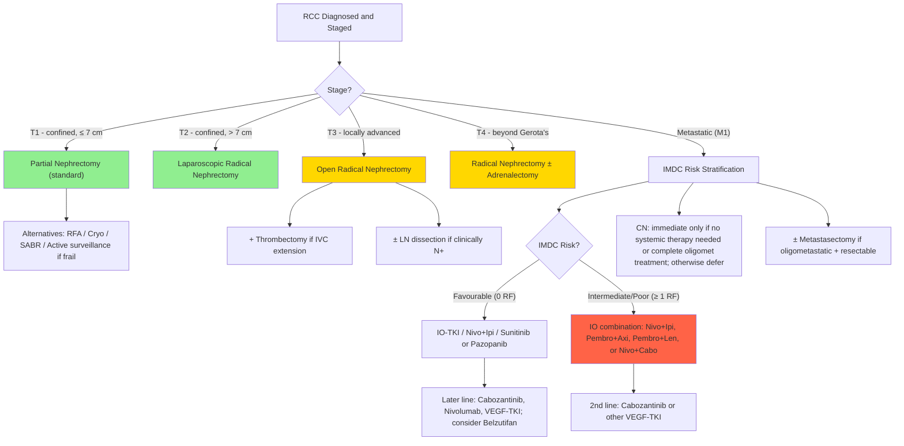

## Management of Renal Cell Carcinoma — Algorithm, Treatment Modalities, Indications & Contraindications

---

### 1. Guiding Principles of RCC Management

Before we walk through the algorithm, let's establish the fundamental principles that make RCC management unique among solid cancers:

1. **Surgery is the main curative treatment for localised RCC** — there is no effective adjuvant chemotherapy, but adjuvant pembrolizumab is now recommended for selected high-risk clear-cell RCC after nephrectomy (KEYNOTE-564 criteria) [10][12].
2. ***RCC is classically resistant to conventional chemotherapy*** — **NO role of chemotherapy** in treatment of RCC. The reason: the kidney tubular epithelium from which RCC arises is rich in **P-glycoprotein (MDR1)**, a drug efflux pump that actively pumps out chemotherapeutic agents. Additionally, RCC's disordered vasculature (from VEGF overexpression) paradoxically limits effective drug delivery [2].
3. ***Radiotherapy is selective, not routine*** — stereotactic radiotherapy is used for clinically relevant brain/bone metastases and may be offered as stereotactic ablative radiotherapy (SABR/SBRT) for selected cT1 lesions in patients unfit for surgery [10].
4. **The immune system matters in RCC** — RCC is one of the most "immunogenic" solid tumours. Historically it was one of the few cancers that responded to IL-2 and IFN-α. This immune sensitivity is why modern **checkpoint inhibitors** (anti-PD-1, anti-CTLA-4) have revolutionised metastatic RCC management.
5. **The VHL/HIF/VEGF pathway is druggable** — loss of VHL → HIF-α accumulation → VEGF overexpression → angiogenesis. This is the rational basis for **anti-VEGF TKIs** and **mTOR inhibitors**.
6. **Even in metastatic disease, surgery often has a role** — "cytoreductive nephrectomy" (removing the primary tumour even when metastases are present) and "metastasectomy" (removing isolated metastases) can improve survival in selected patients [3].

---

### 2. Master Management Algorithm

```mermaid
graph TD
    A["RCC Diagnosed and Staged"] --> B{"Stage?"}
    B -->|"T1 - confined, ≤ 7 cm"| C["Partial Nephrectomy (standard)"]
    C --> C1["Alternatives: RFA / Cryo / SABR / Active surveillance if frail"]
    B -->|"T2 - confined, > 7 cm"| D["Laparoscopic Radical Nephrectomy"]
    B -->|"T3 - locally advanced"| E["Open Radical Nephrectomy"]
    E --> E1["+ Thrombectomy if IVC extension"]
    E --> E2["± LN dissection if clinically N+"]
    B -->|"T4 - beyond Gerota's"| F["Radical Nephrectomy ± Adrenalectomy"]
    B -->|"Metastatic (M1)"| G["IMDC Risk Stratification"]
    G --> H{"IMDC Risk?"}
    H -->|"Favourable (0 RF)"| I["IO-TKI / Nivo+Ipi / Sunitinib or Pazopanib"]
    H -->|"Intermediate/Poor (≥ 1 RF)"| J["IO combination: Nivo+Ipi, Pembro+Axi, Pembro+Len, or Nivo+Cabo"]
    I --> K["Later line: Cabozantinib, Nivolumab, VEGF-TKI; consider Belzutifan"]
    J --> L["2nd line: Cabozantinib or other VEGF-TKI"]
    G --> M["CN: immediate only if no systemic therapy needed or complete oligomet treatment; otherwise defer"]
    G --> N["± Metastasectomy if oligometastatic + resectable"]
    
    style C fill:#90EE90
    style D fill:#90EE90
    style E fill:#FFD700
    style F fill:#FFD700
    style J fill:#FF6347
```

---

### 3. Management of Localised Disease (Stage I–III)

#### 3.1 Surgical Treatment — The Curative Modalities

##### A. ***Partial Nephrectomy (Nephron-Sparing Surgery)*** — Standard for T1

"Partial nephrectomy" means removing **only the tumour with a margin of normal parenchyma**, preserving the rest of the kidney.

**Why is this preferred over radical nephrectomy for small tumours?**
- Studies show **non-inferior overall survival** compared to radical nephrectomy for T1 disease [3]
- **Better long-term renal function preservation** → reduces risk of CKD, cardiovascular morbidity, and metabolic complications (patients who undergo radical nephrectomy lose ~30% of their overall GFR overnight) [3]
- Up to **20% of resected renal masses turn out to be benign** (oncocytoma, AML) — so preserving the kidney when possible avoids unnecessary organ loss [3]

***Indications*** [2][3]:

| Category | Indication | Rationale |
|----------|-----------|-----------|
| ***Absolute*** | ***Solitary kidney*** | No contralateral kidney to compensate — radical nephrectomy would mean dialysis |
| ***Absolute*** | ***Bilateral tumours*** | Must preserve function on at least one side |
| ***Absolute*** | ***Multiple small tumours*** | Often hereditary (VHL); will likely develop more tumours → preserve nephron mass |
| **Strong relative** | ***Patients with comorbidities that impair renal function or will affect future renal function (e.g., DM, renovascular disease)*** [2][3] | These patients are already prone to CKD; losing a kidney pushes them toward dialysis |
| **Elective** | ***Primary tumour ≤ 7 cm (T1 stage)*** [1][2] | Standard of care for T1a (≤ 4 cm) and T1b (4–7 cm) when technically feasible |

***Contraindications*** [3]:
- Insufficient volume of remaining parenchyma (tumour too large relative to kidney)
- Renal vein thrombosis (tumour thrombus in the vein makes clamping and partial resection hazardous)
- Unfavourable tumour location (e.g., central tumour adherent to renal vessels or hilum)
- Use of anticoagulants (relative — increases bleeding risk)

***Surgical approaches*** [2][3]:
| Approach | When Preferred |
|----------|---------------|
| ***Open*** | ***Preferred in difficult cases: solitary kidneys, tumour near the renal hilum*** [2] |
| ***Laparoscopic*** | ***Technically difficult unless robotic-assisted; comparable outcomes with open approach*** [2] |
| ***Robotic-assisted*** | Increasingly the standard; combines the precision of open surgery with the minimal invasiveness of laparoscopy |

**Key operative principle**: ***Should examine kidney carefully to exclude synchronous tumour (7%)*** [3] — i.e., during partial nephrectomy, the surgeon must check the rest of the kidney for additional tumour foci (especially in hereditary syndromes like VHL).

##### B. ***Radical Nephrectomy*** — Standard for T2 and Above

"Radical nephrectomy" means removing the **entire kidney + Gerota's fascia** (the fibrous capsule enclosing kidney and perirenal fat) ± related structures.

***What is removed*** [2][3]:
- Entire kidney
- Gerota's fascia with perirenal fat
- ± Ipsilateral adrenal gland (**only if involved** — routine adrenalectomy is no longer recommended as there is little risk of adrenal recurrence if not clinically involved) [3]
- ± Regional lymph nodes (**extended LN dissection is controversial; usually only in clinically N1 disease or high risk of LN spread**) [3]

***Indications*** [1][3]:

| Stage | Recommendation |
|-------|---------------|
| ***T2 (> 7 cm, confined to kidney)*** | ***Laparoscopic radical nephrectomy as standard*** [1][3] — lower morbidity than open, similar oncological outcome |
| ***T3 (locally advanced)*** | ***Open radical nephrectomy as standard*** [1][3] — allows better access for vascular control, thrombectomy |
| ***T4 (beyond Gerota's fascia)*** | ***Radical nephrectomy ± adrenalectomy*** [1] |

***Key surgical principle***: ***Early ligation of vascular pedicle is important to prevent tumour dissemination; once the artery is occluded, the tumour loses most of its profuse blood supply and massive bleeding during mobilisation becomes less likely*** [2][3].

**Why early ligation?** RCC is one of the most **vascular** solid tumours (remember: VHL loss → VEGF overexpression → abundant tumour vasculature). If you start mobilising the kidney before controlling the artery, you risk catastrophic haemorrhage AND tumour cell dissemination via disturbed venous outflow.

##### C. Related Surgical Procedures

| Procedure | Indication | Details |
|-----------|-----------|---------|
| ***Venous thrombectomy*** [1][3] | ***T3 disease with renal vein/IVC extension*** | ***Simple thrombectomy if thrombus extends up to major hepatic veins; cardiopulmonary bypass ± hypothermic circulatory arrest if thrombus extends above hepatic veins*** [2][3] |
| ***Ipsilateral adrenalectomy*** | Only if adrenal involvement on imaging/intraoperatively | Not routinely performed — ***little risk of adrenal recurrence if not clinically involved*** [3] |
| ***Extended LN dissection*** | ***Clinically N1 or high risk of LN spread*** [3] | Controversial; staging rather than therapeutic benefit in most cases |

<Callout title="Thrombectomy Complexity — From the Renal Vein to the Right Atrium">
The surgical approach to tumour thrombus depends entirely on its **cephalad extent**, which is why MRI is so important preoperatively:

| Thrombus Level | Surgical Approach |
|----------------|------------------|
| Renal vein only | Standard radical nephrectomy with venous clamping |
| IVC below hepatic veins | Abdominal approach; IVC clamping above and below thrombus |
| IVC at/above hepatic veins | May need liver mobilisation, Pringle manoeuvre |
| ***Above diaphragm / right atrium*** | ***Cardiopulmonary bypass ± hypothermic circulatory arrest*** [2][3] — a combined cardiothoracic + urological procedure |

This escalating complexity is why accurate preoperative staging with MRI is essential — it determines whether you need a urologist alone, or a urologist + hepatobiliary surgeon + cardiac surgeon in the same operating room.
</Callout>

##### D. ***Complications of Nephrectomy*** [3]

| Timing | Complication | Mechanism |
|--------|-------------|-----------|
| **Operative** | ***Mortality (~2%)*** | Anaesthetic risk, haemorrhage |
| | ***GA complications*** | Standard anaesthetic risks |
| | ***Pneumothorax*** | Pleural injury (especially with flank/posterior approach to upper pole tumours) |
| | ***Injury to neighbouring organs*** (GI tract, major blood vessels, spleen, pancreas) | Anatomical proximity |
| **Post-operative** | ***Temporary or permanent renal failure*** | Loss of functioning nephrons; especially if pre-existing CKD or solitary kidney |
| | ***Ileus*** | Retroperitoneal dissection → sympathetic irritation → paralytic ileus |
| | ***Wound infection*** (superficial and deep) | Standard surgical complication |

---

#### 3.2 Non-Surgical Local Treatments

##### A. ***Local Ablative Therapy (RFA, Cryoablation, Microwave Ablation)*** [1][3]

| Aspect | Details |
|--------|---------|
| **Principle** | Destroy tumour tissue *in situ* using extreme heat (RFA, microwave) or cold (cryoablation), without removing the kidney |
| ***Indications*** | ***Small cortical tumours (≤ 3 cm), especially for frail patients, high surgical risk, solitary kidney, compromised renal function, hereditary or multiple bilateral tumours*** [3] |
| **Approach** | Percutaneous (image-guided) or laparoscopic |
| **Pre-procedure** | ***Percutaneous renal biopsy should be done to confirm diagnosis*** [3] — unlike nephrectomy, you won't have a surgical specimen, so you need tissue proof before ablating |
| ***Outcomes*** | ***Short- and long-term outcomes can be comparable with PN/RN*** for small tumours [3]; however ***oncological outcomes are inferior to surgery and associated with a higher recurrence rate*** overall [2] |
| **Advantage** | ***Maximal preservation of renal parenchyma and function*** [2] |

**Why biopsy before ablation?** Because with surgery, the removed specimen provides tissue diagnosis. With ablation, nothing is removed — you're destroying the tumour in place. You need to confirm it's actually cancer (and not an oncocytoma or AML) before you ablate it.

##### B. ***Active Surveillance*** [3]

| Aspect | Details |
|--------|---------|
| **Rationale** | ***Improved imaging modalities led to increased detection of small renal masses, of which many are slow-growing*** [3] |
| ***Indication*** | ***Elderly patients with significant comorbidities or short life-expectancy + tumour < 4 cm*** [3] |
| **Protocol** | Serial imaging (CT or USG) at regular intervals; intervene if growth > 3–4 mm/year or > 4 cm |
| **Biopsy** | Consider renal mass biopsy if the result would change counselling or treatment; biopsy is mandatory before thermal ablation because there will be no surgical specimen [10] |
| ***Outcome*** | ***Slow growth in most cases (mean 3 mm/year); progression to metastatic disease only in 1–2%*** [3] |

**Why is this safe?** Small renal masses (< 4 cm, T1a) have a very low rate of metastasis. In elderly patients with competing comorbidities (heart failure, COPD, etc.), the risk of dying FROM the kidney cancer is lower than the risk of dying WITH it from something else. Surgery carries operative risks that may outweigh the oncological benefit.

##### C. ***Stereotactic Ablative Radiotherapy (SABR/SBRT)*** [10]

SABR/SBRT is no longer just "palliation" in RCC. It may be offered to patients with **cT1 renal tumours** who have an indication for treatment but are **unfit for surgery**. Evidence is still less mature than for surgery, so patients should be counselled about uncertainty in long-term oncological outcomes.

---

#### 3.3 ***Role of Adjuvant Therapy in Localised Disease***

> ***NO role of adjuvant chemotherapy following complete resection of localised RCC*** [2].

Current guidelines separate **chemotherapy/targeted therapy** from **adjuvant PD-1 therapy**:

- **Adjuvant chemotherapy** — no benefit (RCC is chemo-resistant)
- **Adjuvant targeted therapy** (sunitinib, sorafenib, pazopanib, everolimus, axitinib) — not recommended after nephrectomy because OS benefit has not been shown and toxicity is significant [10].
- **Adjuvant pembrolizumab** — offer to selected **clear-cell RCC** patients, preferably within 12–16 weeks post-nephrectomy after restaging, if they match KEYNOTE-564 recurrence-risk groups: pT2 grade 4 or sarcomatoid, pT3 any grade, pT4, pN+, or M1 no evidence of disease after complete metastasectomy within one year [10][12].
- **Other adjuvant/perioperative ICI strategies** — atezolizumab, nivolumab, nivolumab + ipilimumab, and perioperative nivolumab have not shown consistent benefit and should not be treated as equivalent to pembrolizumab [10].

For lower-risk resected RCC, the standard remains surveillance. For high-risk clear-cell RCC, use shared decision-making because pembrolizumab reduces recurrence risk but can cause immune-related toxicity and overtreatment [10].

---

### 4. Management of Metastatic Disease (Stage IV)

This is where RCC management has been transformed over the past two decades. Let's build up the logic from first principles.

#### 4.1 ***IMDC Risk Stratification*** [3]

Before choosing systemic therapy, you must stratify the patient's prognosis. The **IMDC (International Metastatic RCC Database Consortium) criteria** — also called "Heng criteria" — determine the treatment approach:

| Risk Factor | Threshold |
|------------|-----------|
| Karnofsky performance status | < 80% |
| Time from diagnosis to systemic treatment | < 1 year |
| Haemoglobin | < lower limit of normal |
| Corrected calcium | > upper limit of normal |
| Neutrophil count | > upper limit of normal |
| Platelet count | > upper limit of normal |

| Risk Group | Number of Factors | Implication |
|-----------|-------------------|------------|
| ***Favourable*** | 0 | Indolent biology; consider TKI monotherapy or IO-TKI |
| ***Intermediate*** | 1–2 | Standard biology; combination immunotherapy preferred |
| ***Poor*** | 3–6 | Aggressive biology; combination immunotherapy preferred |

#### 4.2 Local Therapy in Metastatic Disease

Even in metastatic disease, surgery can play a role. This is unusual for most solid cancers.

##### A. ***Cytoreductive Nephrectomy*** [3]

| Aspect | Details |
|--------|---------|
| **Definition** | Removal of the primary kidney tumour in the setting of metastatic disease — not curative unless all disease can be cleared |
| ***Indication*** | Good performance status with no immediate need for systemic therapy, symptomatic primary tumour, or oligometastatic disease where complete local treatment of metastases is achievable [10] |
| **Rationale** | Can reduce tumour burden and delay systemic therapy in highly selected patients; complete resection of primary + oligometastases may be potentially disease-controlling |
| **Contraindication** | IMDC/MSKCC poor risk, high metastatic volume, rapidly progressive disease, poor performance status, or asymptomatic synchronous primary tumour that requires immediate systemic therapy |
| **Evidence** | CARMENA showed sunitinib alone was non-inferior to immediate cytoreductive nephrectomy + sunitinib in intermediate/poor-risk patients. Current guidance favours upfront IO-based systemic therapy for intermediate/poor-risk patients who need treatment, with delayed CN considered only if they derive clinical benefit [10] |

##### B. ***Metastasectomy*** [3]

| Aspect | Details |
|--------|---------|
| **Definition** | Surgical removal of isolated metastatic deposits |
| ***Indication*** | ***Favourable-risk patients where complete resection is possible; oligometastatic disease*** [3] |
| **Examples** | Pulmonary metastasectomy (lung mets are the most common and most amenable to resection); resection of solitary brain met; bone tumour resection for impending fracture |
| ***Alternatives*** | ***Stereotactic radiotherapy (SRS/SBRT), surgical removal*** [3] |
| ***Adjuvant after metastasectomy*** | ***NOT needed*** [3] |
| ***Outcome*** | ***Increased overall and cancer-specific survival*** in selected patients [3] |

<Callout title="Why Can You Resect Lung Metastases in RCC?" type="idea">
This seems counterintuitive — if cancer has already spread, why does removing metastases help? The answer lies in RCC's biology:
1. RCC metastases can grow **slowly** (especially in favourable-risk patients)
2. RCC is **chemo-resistant**, so you can't rely on systemic therapy to eliminate residual disease
3. In **oligometastatic** disease (few, resectable metastases), complete surgical clearance can result in durable remission
4. ***Metastasectomy may have a role in selected cases (e.g., RCC, CA colon)*** [9] — lung metastasectomy criteria: surgically resectable, adequate cardiopulmonary reserve, primary tumour controllable

This is different from, say, pancreatic cancer with liver metastases — where the biology is so aggressive that removing metastases provides no benefit because new ones appear immediately.
</Callout>

---

#### 4.3 Systemic Therapy for Metastatic RCC

##### A. ***Immunotherapy — The Backbone of Modern RCC Treatment***

**Why is RCC responsive to immunotherapy?**
RCC is one of the most immunogenic solid tumours. Evidence:
- Spontaneous regression of metastases after nephrectomy (rare but well-documented)
- Historical responses to IL-2 and IFN-α
- High tumour mutational burden in many cases → more neoantigens → more immune targets
- Rich immune cell infiltrate in tumour microenvironment

| Agent | Class | Mechanism | Notes |
|-------|-------|-----------|-------|
| ***Nivolumab*** | ***Anti-PD-1*** [1][2][3] | PD-1 is a "brake" on T cells. Tumours express PD-L1 which binds PD-1 on T cells, telling them to "stand down." Nivolumab blocks this interaction → T cells remain activated → attack tumour | Can be used as monotherapy (2nd line) or in combination |
| ***Ipilimumab*** | ***Anti-CTLA-4*** [1][3] | CTLA-4 is another immune checkpoint on T cells that suppresses activation. Blocking it → enhanced T cell priming and proliferation | Used in combination with nivolumab |
| ***Pembrolizumab*** | ***Anti-PD-1*** [1] | Same mechanism as nivolumab | Used in combination with axitinib or lenvatinib |
| ***High-dose IL-2*** [2][3] | Cytokine therapy | Directly stimulates T cell proliferation and activation | ***Effective with long-term remissions without relapse*** in a minority; ***associated with high toxicity often not tolerable*** [2]. Largely superseded |
| ***IFN-α*** [2][3] | Cytokine therapy | Enhances immune recognition of tumour cells; anti-proliferative | ***Combined with cytoreductive nephrectomy can improve survival*** [2]; ***largely superseded by checkpoint inhibitors*** [3] |

**Current first-line regimens (2024–2026 guidelines):**

| IMDC Risk | ***First-Line Regimen*** | Rationale |
|-----------|------------------------|-----------|
| ***Favourable (0 RF)*** | ***Pembrolizumab + axitinib, lenvatinib + pembrolizumab, nivolumab + cabozantinib, nivolumab + ipilimumab, or sunitinib/pazopanib*** [10][11] | IO-TKI combinations improve PFS/response; OS advantage over sunitinib is less clear in favourable-risk disease, so TKI monotherapy remains acceptable when appropriate |
| ***Intermediate/Poor (≥ 1 RF)*** | ***Nivolumab + ipilimumab, pembrolizumab + axitinib, lenvatinib + pembrolizumab, or nivolumab + cabozantinib*** [10][11][12] | IO-based combinations are standard; VEGFR-TKI monotherapy is reserved for patients who cannot receive or tolerate immune checkpoint inhibition |

**Second-line and beyond:**

| Line | ***Options*** |
|------|-------------|
| ***After IO-based first-line*** | ***Cabozantinib or another VEGF-TKI*** [10] |
| ***After VEGF-TKI monotherapy first-line*** | ***Nivolumab or cabozantinib*** [10] |
| ***Later lines*** | Sequence an active agent not previously used; ***belzutifan*** is an alternative to everolimus after second- to fourth-line therapy for clear-cell metastatic RCC [10] |

##### B. ***Targeted Therapy***

These drugs target the VHL/HIF/VEGF axis and the mTOR pathway:

| Class | Examples | Mechanism | Key Points |
|-------|---------|-----------|------------|
| ***Tyrosine kinase inhibitors (TKIs)*** | ***Sunitinib, pazopanib, axitinib, sorafenib, cabozantinib, lenvatinib, tivozanib*** [1][2][3][10] | Block VEGF receptor (and other kinases) → inhibit tumour angiogenesis and proliferation. Since RCC is VEGF-driven (VHL loss → HIF → VEGF), cutting off the blood supply starves the tumour | Single-agent VEGF-TKI first-line therapy has largely been superseded by IO-based combinations, except in favourable-risk disease or when ICI cannot be used. ***Cabozantinib*** has the strongest later-line data after IO-based therapy [10] |
| ***Anti-VEGF monoclonal antibody*** | ***Bevacizumab*** [1][2] | "Bevacizumab" → "beva" (from "beverage"? No — named by Genentech). It's a humanised monoclonal antibody that binds circulating VEGF → prevents VEGF from binding its receptor → anti-angiogenic | Usually combined with IFN-α; less commonly used now with the advent of IO combinations |
| ***mTOR inhibitors*** | ***Temsirolimus, everolimus*** [2][3] | mTOR (mechanistic target of rapamycin) is a kinase in the PI3K/AKT/mTOR pathway that promotes cell growth and proliferation. In RCC, this pathway is often upregulated. Inhibiting mTOR → reduces cell growth, angiogenesis, and metabolism | Their front-line role has been superseded. Everolimus may be used later line, but belzutifan and VEGF-targeted options are often preferred when available [10] |
| ***HIF-2α inhibitor*** | ***Belzutifan*** [10] | Blocks HIF-2α transcriptional signalling downstream of VHL loss | Later-line option for previously treated clear-cell metastatic RCC; also relevant in VHL-associated disease |

**Drug name breakdown:**
- "Suni-**tinib**" → "-tinib" = tyrosine kinase inhibitor
- "Pazo-**panib**" → "-panib" = pan (many) kinase inhibitor
- "Bevaci-**zumab**" → "-zumab" = humanised monoclonal antibody
- "Nivo-**lumab**" → "-lumab" = fully human monoclonal antibody
- "Tems-**iro-limus**" → "-limus" = mTOR inhibitor (from rapamycin/sirolimus)

##### C. ***Non-Clear Cell RCC (Non-ccRCC) — Special Consideration***

| Subtype | Recommended Approach |
|---------|---------------------|
| ***Papillary RCC*** | Cabozantinib has randomised phase II evidence over sunitinib; lenvatinib + pembrolizumab or nivolumab + cabozantinib are options based on smaller studies [10] |
| ***Other non-ccRCC*** | Sunitinib, lenvatinib + pembrolizumab, nivolumab + ipilimumab, or cabozantinib + nivolumab (except chromophobe RCC for the latter) may be offered, recognising weaker evidence [10] |
| Collecting duct / medullary carcinoma | May respond better to platinum-based chemotherapy (behaves more like urothelial carcinoma); renal medullary carcinoma is an exception where cytotoxic combinations remain important [10] |
| Sarcomatoid differentiation | Treat as high-priority for immune checkpoint combination therapy |

##### D. ***Chemotherapy and Radiotherapy***

| Modality | Role in RCC |
|----------|------------|
| ***Chemotherapy*** | ***NO role for typical clear-cell metastatic RCC*** due to low response rate and short-lived responses [2][10]. Exceptions include collecting duct and medullary carcinoma, where platinum-based cytotoxic regimens may be used [10] |
| ***Radiotherapy*** | Not routine adjuvant therapy after nephrectomy, but stereotactic radiotherapy is used for brain/bone metastases for local control and symptom relief. SABR/SBRT can be considered for selected cT1 renal tumours when patients are unfit for surgery [10] |

---

### 5. Summary Table — Management by Stage

| ***Stage*** | ***T Classification*** | ***Standard Treatment*** | ***Alternatives*** |
|---|---|---|---|
| ***T1 (≤ 7 cm)*** | T1a ≤ 4 cm; T1b 4–7 cm | ***Partial nephrectomy*** [1] | ***Cryotherapy/RFA; SABR/SBRT; active surveillance or watchful waiting for selected frail/comorbid patients*** [10] |
| ***T2 (> 7 cm, confined)*** | T2a 7–10 cm; T2b > 10 cm | ***Laparoscopic/open radical nephrectomy*** [1] | — |
| ***T3 (locally advanced)*** | Renal vein/IVC/perinephric invasion | ***Radical nephrectomy + thrombectomy*** [1] | ± LN dissection if N+ |
| ***T4 (beyond Gerota's)*** | Including ipsilateral adrenal | ***Radical nephrectomy ± adrenalectomy*** [1] | — |
| ***Metastatic (M1)*** | Any T, any N | ***IO-based systemic therapy for most clear-cell RCC, based on IMDC risk and patient factors*** [10][11][12] | ***± delayed cytoreductive nephrectomy; ± metastasectomy/SBRT for selected oligometastatic disease*** |

---

### 6. Post-Nephrectomy Surveillance [3]

After curative-intent surgery, patients need follow-up to detect recurrence:

| Risk Level | Surveillance Protocol |
|-----------|----------------------|
| **High-risk** (T3–T4, N+, high grade) | ***CT every 3–6 months for 2 years***, then annually [3] |
| **Low-risk** (T1–T2, N0, low grade) | ***CT annually*** [3] |

**What are you looking for?**
- Local recurrence in the renal fossa
- Contralateral kidney tumour (metachronous)
- Distant metastases (lung, bone, liver, brain)
- Decline in renal function (especially post-radical nephrectomy)

---

<Callout title="High Yield Summary">

1. **Surgery is the only cure for localised RCC.** ***Partial nephrectomy is standard for T1 (≤ 7 cm); radical nephrectomy for T2 and above*** [1].
2. ***Absolute indications for partial nephrectomy***: solitary kidney, bilateral tumours, multiple small tumours [2].
3. ***Early ligation of the vascular pedicle*** during radical nephrectomy is crucial to prevent haemorrhage and tumour dissemination [2][3].
4. ***IVC tumour thrombus above hepatic veins requires cardiopulmonary bypass ± hypothermic circulatory arrest*** [2][3].
5. ***NO role for adjuvant chemotherapy*** after complete resection of localised RCC [2][3]. ***Adjuvant pembrolizumab is now offered to selected high-risk clear-cell RCC patients*** after nephrectomy using KEYNOTE-564 criteria [10][12].
6. ***Chemotherapy has NO role in RCC*** (P-glycoprotein efflux pump; chemo-resistant) [2].
7. ***Radiotherapy is selective***: stereotactic RT for brain/bone metastases and SABR/SBRT for selected cT1 patients unfit for surgery [10].
8. ***Metastatic RCC management is guided by IMDC risk stratification*** [3]:
   - Favourable: IO-TKI, nivolumab + ipilimumab, or TKI monotherapy depending on patient factors
   - Intermediate/poor: ***IO-based combination therapy*** (nivolumab + ipilimumab, pembrolizumab + axitinib, lenvatinib + pembrolizumab, or nivolumab + cabozantinib)
9. ***Cytoreductive nephrectomy*** is not routine upfront therapy for intermediate/poor-risk patients needing systemic treatment; consider immediate CN only in selected patients or delayed CN after response [10].
10. ***Metastasectomy*** improves survival in selected patients with oligometastatic, resectable disease [3].
11. Active surveillance is safe for ***elderly/frail patients with tumours < 4 cm*** (mean growth 3 mm/year, 1–2% metastatic progression) [3].
12. ***Biopsy before thermal ablative therapy*** (RFA/cryo) is mandatory since no surgical specimen will be available [3][10].

</Callout>

---

<ActiveRecallQuiz
  title="Active Recall - Management of RCC"
  items={[
    {
      question: "A 70-year-old man with a solitary kidney has a 3.5 cm enhancing renal mass on CT. What is the standard surgical approach, and what are the absolute indications for this approach?",
      markscheme: "Partial nephrectomy (nephron-sparing surgery). Absolute indications: solitary kidney, bilateral tumours, multiple small tumours. This patient has a solitary kidney making it an absolute indication. Radical nephrectomy would render him anephric and dialysis-dependent. Alternatives if unfit for surgery: RFA, cryoablation, or active surveillance."
    },
    {
      question: "Why is conventional chemotherapy ineffective in RCC? Explain the molecular mechanism.",
      markscheme: "RCC arises from renal tubular epithelium which is rich in P-glycoprotein (MDR1), a drug efflux pump that actively pumps chemotherapeutic agents out of the cell. Additionally, the disordered tumour vasculature from VEGF overexpression limits effective drug delivery. Chemotherapy has no proven role in RCC management."
    },
    {
      question: "A patient with metastatic clear cell RCC has IMDC intermediate risk (2 risk factors). What is the recommended first-line systemic therapy, and what is the mechanism of action of each drug in the combination?",
      markscheme: "Recommended first-line options are IO-based combinations: nivolumab plus ipilimumab, pembrolizumab plus axitinib, lenvatinib plus pembrolizumab, or nivolumab plus cabozantinib. Nivolumab and pembrolizumab block PD-1; ipilimumab blocks CTLA-4; axitinib, lenvatinib, and cabozantinib are VEGF-pathway TKIs. VEGFR-TKI monotherapy is reserved for patients who cannot receive or tolerate immune checkpoint inhibition."
    },
    {
      question: "Explain why cytoreductive nephrectomy may benefit patients with metastatic RCC, and state when it is contraindicated.",
      markscheme: "Benefits: can reduce tumour bulk, control symptoms, and in oligometastatic disease may allow complete local treatment. Contraindicated in poor-risk patients, high-volume or rapidly progressive metastatic disease, and poor performance status. In intermediate-risk patients with an asymptomatic synchronous primary tumour who require systemic therapy, start systemic therapy first and consider delayed cytoreductive nephrectomy only if there is clinical benefit."
    },
    {
      question: "A patient with RCC has IVC tumour thrombus extending above the diaphragm into the right atrium. What surgical approach is required, and why must MRI be done preoperatively?",
      markscheme: "Requires cardiopulmonary bypass with or without hypothermic circulatory arrest, in addition to radical nephrectomy and IVC thrombectomy. This is a combined cardiothoracic and urological procedure. MRI is essential preoperatively because it is superior to CT in delineating the cephalad extent of tumour thrombus in the IVC (below hepatic veins vs at hepatic veins vs above diaphragm vs right atrium), which directly determines the surgical approach and team required."
    },
    {
      question: "List 3 indications for active surveillance of a small renal mass, and state the expected natural history.",
      markscheme: "Indications: elderly patients with significant comorbidities, patients with short life-expectancy, tumour less than 4 cm. Renal mass biopsy can be considered if it would change counselling or management, and is mandatory before thermal ablation. Natural history: slow growth in most cases (mean 3 mm per year), progression to metastatic disease in only 1-2%. Intervention is triggered if growth exceeds 3-4 mm per year or tumour reaches 4 cm."
    }
  ]}
/>

---

## References

[1] Lecture slides: GC 183. Common urological malignancies and their presentations - Nov 7.pdf (p. 19 — RCC Treatment)
[2] Senior notes: felixlai.md (Renal cell carcinoma — Treatment section)
[3] Senior notes: Ryan Ho Urogenital.pdf (pp. 148–149, Section 7.3.1 — Management)
[7] Senior notes: Ryan Ho Fundamentals.pdf (p. 345 — Management of urinary tumours)
[8] Senior notes: Ryan Ho Neurology.pdf (pp. 164–165 — Brain metastasis management)
[9] Senior notes: Ryan Ho Respiratory.pdf (p. 150 — Secondary tumours of the lungs)
[10] European Association of Urology (EAU) Guidelines on Renal Cell Carcinoma, 2026 update.
[11] NCCN Clinical Practice Guidelines in Oncology: Kidney Cancer, Version 1.2026.
[12] ASCO Guideline: Management of Metastatic Clear Cell Renal Cell Carcinoma, published 2023, reviewed/updated 2026.
