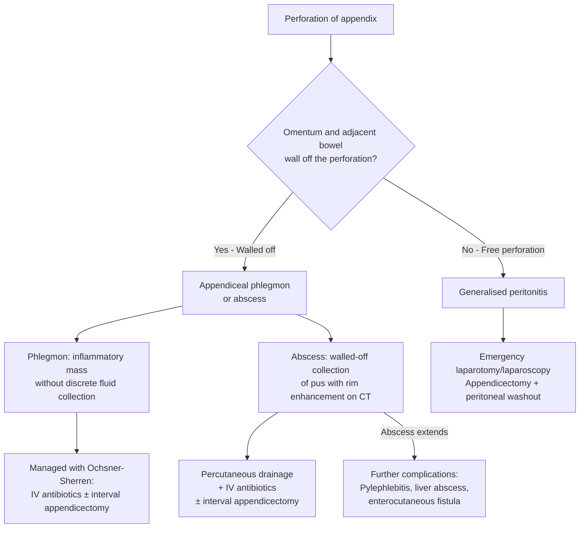

## Complications of RLQ Pain Conditions

Complications are the natural consequence of disease progression — they represent what happens when the pathological process outlined earlier is not interrupted in time, or when the treatment itself introduces new problems. Understanding complications from first principles means tracing the pathophysiology to its logical endpoint: *What happens if the obstruction is not relieved? What happens if the infection is not contained? What happens if the blood supply is not restored?*

We will organise this by the major underlying conditions, since the complications are disease-specific.

---

### A. Complications of Acute Appendicitis

Acute appendicitis follows a predictable pathological cascade: obstruction → inflammation → ischaemia → gangrene → perforation → abscess or peritonitis. Each step in this cascade represents a progressively worse complication.

#### 1. Complications of the Disease Itself

##### a. Gangrenous Appendicitis

- ***The appendicular artery is an end-artery*** — once intraluminal and transmural pressure exceeds arterial perfusion pressure, or once thrombosis occurs from surrounding inflammation, the entire blood supply is lost [2]
- The appendiceal wall undergoes **full-thickness necrosis** → the tissue turns black-green, friable, and non-viable
- This is ***Grade 2*** on the disease severity scale [1]
- **Why it matters:** gangrenous appendicitis is the immediate precursor to perforation — the necrotic wall has no structural integrity and will rupture

##### b. Perforation

***Perforation of the appendix*** occurs in ***13–20% of patients*** [3]

- ***Patients develop inflammation and necrosis of the appendix → increased risk of perforation once significant inflammation and necrosis occurs*** [1]
- ***Should be considered when fever > 39.4°C, WBC > 15 × 10⁹/L, and imaging reveals fluid collection in RLQ*** [1]
- Risk factors for perforation: ***male gender, extremes of age, diabetes mellitus, immunosuppression, pelvic appendix, faecolith obstruction*** [1]

**Why do extremes of age perforate more?**
- **Children ( < 5 years):** cannot verbalise symptoms clearly → delayed presentation → delayed diagnosis
- **Elderly ( > 65 years):** blunted inflammatory response (reduced WBC response, less fever) → atypical presentation → delayed diagnosis
- Both scenarios give the disease more time to progress through the cascade

What happens after perforation depends on whether the body can **contain** the contamination:

##### c. Appendiceal Phlegmon and Abscess

***Signs of complications: high fever, RLQ mass, imaging shows abscess/phlegmon (inflammatory mass)*** [2]

- **Phlegmon** ("phlegmone" in Greek = inflammation): an ill-defined inflammatory mass of oedematous, inflamed tissue around the appendix — there is no discrete fluid collection, just matted-together bowel loops, omentum, and mesentery
- **Abscess**: a **walled-off collection of pus** — on CT it appears as a rim-enhancing fluid collection with internal debris

| Feature | Phlegmon | Abscess |
|---|---|---|
| Nature | Inflammatory mass, no fluid | Walled-off pus collection |
| CT appearance | Ill-defined soft tissue density | Rim-enhancing fluid collection ± gas |
| Management | IV antibiotics → interval appendicectomy | ***Percutaneous drainage + IV antibiotics → interval appendicectomy*** [3] |

***Abscess locations (post-perforation):*** ***may be interloop, paracolic, pelvic, and subphrenic*** [3]

**Why pelvic?** — a pelvic appendix perforates directly into the pelvis; also, pus tracks downward by gravity to the pouch of Douglas (the most dependent part of the peritoneal cavity in the supine position)
**Why subphrenic?** — infected peritoneal fluid tracks upward along the right paracolic gutter to the subphrenic space (the same anatomical channel that allows PPU contents to reach the RLQ)

##### d. Generalised Peritonitis

- ***Not walled off → generalised peritonitis*** [2]
- Free spillage of enteric contents (bacteria, faecal material) into the peritoneal cavity
- Presents with ***board-like rigidity, absent bowel sounds, septic shock*** (tachycardia, hypotension, fever)
- **Mortality** rises significantly — from < 1% in uncomplicated appendicitis to up to 5% in diffuse peritonitis

##### e. Pylephlebitis (Septic Portal Vein Thrombosis)

***Pylephlebitis*** ("pyle" = gate/portal, "phlebitis" = vein inflammation) [1]

- ***Associated with high fever, chills, rigors, and jaundice*** [1]
- ***Thrombosis and infection within the portal venous system*** [1]
- ***Caused by septicaemia in the portal venous system → leads to development of intra-hepatic abscesses*** [1]
- **Mechanism:** bacteria from the inflamed/perforated appendix drain via the appendicular vein → ileocolic vein → superior mesenteric vein → portal vein. The infection propagates along this venous pathway, causing thrombophlebitis. Thrombus provides a nidus for further bacterial growth → septic emboli seed the liver → **pyogenic liver abscesses**
- This is a rare but **life-threatening** complication — mortality is high without aggressive antibiotic therapy and anticoagulation

<Callout title="Pylephlebitis — A Rare but Must-Know Complication" type="error">
Pylephlebitis should be suspected in any patient with appendicitis (or any intra-abdominal sepsis) who develops ***unexplained jaundice, high spiking fevers with rigors, and hepatomegaly***. CT will show thrombosis in the portal vein ± liver abscesses. Treatment: prolonged IV antibiotics + anticoagulation + drainage of liver abscesses if present.
</Callout>

#### 2. Post-Operative Complications of Appendicectomy

These are the complications that arise from the **surgery itself** — important for consent discussions and post-operative monitoring [1][2][3].

| Timing | Complication | Incidence / Detail | Pathophysiological Basis |
|---|---|---|---|
| ***Early (days 1–7)*** | ***Wound infection*** | ***5–10%*** [2][3] | The appendix harbours mixed enteric flora (***usually a mixture of Gram-negative bacilli and anaerobic bacteria, especially Bacteroides spp. and Streptococcus***) [3]. Despite prophylactic antibiotics, wound contamination can occur during extraction of the inflamed/gangrenous appendix |
| | | ***Pain and erythema of the wound on post-op day 4 or 5*** [3] | This timing reflects the 3–5 day incubation period for surgical site infections. The wound becomes red, warm, swollen, and may discharge pus |
| | | ***Treatment: wound drainage and antibiotics*** [3] | Open the wound, drain pus, send for culture; secondary intention healing or delayed primary closure |
| ***Early (days 5–7)*** | ***Intra-abdominal/pelvic abscess*** | ***~8%*** [3] | Residual infected peritoneal fluid or inadequate washout during surgery. Pus collects in dependent areas (pelvis, subphrenic space, interloop). ***Presents with spiking fever, malaise, anorexia post-op day 5–7*** [3] |
| | | ***Location: interloop, paracolic, pelvic, subphrenic*** [3] | Pus tracks along peritoneal recesses by gravity and anatomical channels |
| | | ***Treatment: drainage ± laparotomy*** [3] | Percutaneous CT-guided drainage is first-line; laparotomy if not amenable |
| ***Early*** | ***Post-operative ileus*** | Expected for 24–72 hours | Bowel handling during surgery → temporary loss of peristalsis (autonomic reflex). ***Ileus lasting > 4–5 days indicates continuing intra-abdominal sepsis, especially if associated with fever*** [3] |
| ***Early*** | ***Haemorrhage*** | ***Intra-abdominal, abdominal wall haematoma, scrotal haematoma*** [3] | Inadequate ligation of the appendicular artery (end-artery → bleeds freely if not properly secured) or mesoappendix vessels; trocar-site bleeding in laparoscopic approach |
| ***Early*** | ***Stump complications*** | ***Retained faecolith, stump appendicitis, leak, fistula*** [3] | If the appendiceal stump is not adequately ligated or inverted, a faecolith may be retained → ongoing inflammation. Stump necrosis → leak → localised peritonitis or fistula |
| ***Early*** | ***Enterocutaneous fistula*** | Uncommon | ***Results from an intraperitoneal abscess that fistulises to the skin*** [1]. Can also occur from inadvertent bowel injury during surgery or stump leak |
| ***Late*** | ***Adhesions*** | Most common late complication | ***Any intra-abdominal surgery causes adhesions*** — fibrin bands form between bowel loops and peritoneal surfaces during the healing process → can cause ***intestinal obstruction*** (adhesive IO) and ***chronic pelvic pain in the RIF*** [3] |
| | ***Adhesive intestinal obstruction*** | | Fibrous bands constrict or kink bowel loops → mechanical obstruction. Adhesive IO is the ***most common cause of small bowel obstruction*** worldwide |
| ***Late*** | ***Incisional hernia*** | | Weakness at the incision site → herniation of abdominal contents through the defect. More common with open approach (larger wound) and wound infection (impaired healing) |
| ***Late*** | ***Recurrent/stump appendicitis*** | Rare | ***Incomplete removal of the appendiceal stump*** — residual appendiceal tissue can become inflamed again [2][3]. Avoided by ensuring complete excision to the caecal base |

---

### B. Complications of Acute Diverticulitis

Diverticulitis complicates approximately 25% of patients with diverticulosis. The complications follow logically from the pathophysiology: inflamed diverticulum → contained infection or → uncontained spread.

#### 1. Abscess

- ***Occurs in 17% of patients with acute diverticulitis*** [1]
- ***Should be suspected in patients with no improvement in abdominal pain or a persistent fever despite 3 days of antibiotic treatment*** [1]
- ***May develop a pyogenic liver abscess due to spread of infection through the portal circulation*** [1] — same mechanism as pylephlebitis in appendicitis (bacteria drain via mesenteric veins → portal vein → liver)
- **Clinical presentation:**
  - ***Persistent fever despite antibiotics*** [1]
  - ***NO improvement in abdominal pain despite antibiotics*** [1]
  - Palpable tender mass on examination or on ***digital rectal examination (DRE) if distal sigmoid abscess*** [1]
- **Management:** Percutaneous CT-guided drainage (if > 4–5 cm) + IV antibiotics; small abscesses ( < 4–5 cm) may respond to antibiotics alone

#### 2. Fistula

- ***Inflammation may result in formation of fistula between colon and adjacent organs*** [1]
- A fistula forms when the inflammatory process erodes through the wall of two adjacent hollow structures, creating an abnormal communication

***Types of fistula (by frequency):*** [1]

| Fistula Type | Frequency | Clinical Presentation | Why It Happens |
|---|---|---|---|
| ***Colovesical fistula*** | ***Most common*** | ***Pneumaturia*** (air in urine — gas from colon enters bladder), ***fecaluria*** (faecal matter in urine), ***dysuria/recurrent UTI*** | Sigmoid colon lies directly anterior to the bladder (especially in males and post-hysterectomy females) → inflammation erodes through both walls |
| ***Colovaginal fistula*** | Second most common | ***Vaginal passage of faeces and flatus*** | ***Especially in post-hysterectomy patients*** — the uterus normally separates the sigmoid from the vagina; without it, they are in direct contact [1] |
| ***Colocutaneous fistula*** | ***Uncommon*** | ***Usually easy to identify*** — faeculent discharge from abdominal wall | Abscess tracks from the colon through the abdominal wall to the skin |
| ***Coloenteric fistula*** | ***Uncommon*** | ***May be entirely asymptomatic or result in corrosive diarrhoea*** [1] | Communication between inflamed colon and adjacent small bowel |

***Management of fistula:*** [1]
- ***Control sepsis with antibiotics and drainage***
- ***Resection of the affected segment of colon involved with diverticulitis, usually with primary anastomosis***
- ***Simple repair of the secondarily involved organ (e.g., primary closure of bladder or vagina)***

<Callout title="Pneumaturia Is Pathognomonic">
If a patient describes "air bubbles in the urine" (pneumaturia), think **colovesical fistula** until proven otherwise. The only other cause is a gas-forming UTI (rare, usually in diabetics). In the context of a history of diverticulitis, this is virtually diagnostic.
</Callout>

#### 3. Obstruction

- ***Partial colonic obstruction*** occurs from ***luminal narrowing due to pericolonic inflammation or compression from a diverticular abscess*** [1]
- ***Complete colonic obstruction*** occurs because ***recurrent attacks of acute diverticulitis result in progressive fibrosis and scarring leading to formation of intestinal strictures*** [1]
- ***Localised irritation can lead to development of paralytic ileus*** [1]
- **Clinical presentation:**
  - ***Abdominal pain + abdominal distension + vomiting + constipation*** [1]
  - ***Bowel sounds: hyperactive with mechanical obstruction; absent or sluggish with paralytic ileus*** [1]
- **Key point:** always exclude **colorectal cancer** as the cause of a colonic stricture — diverticular stricture and malignant stricture can look identical on CT. Colonoscopy with biopsy after resolution of acute inflammation is mandatory.

#### 4. Perforation

- ***Rupture of a diverticular abscess into the peritoneal cavity*** [1]
- ***Rupture of an inflamed diverticulum with fecal contamination of the peritoneum*** [1]
- ***Leads to generalised purulent or fecal peritonitis*** [1]
- **Clinical presentation:**
  - ***Haemodynamic instability (hypotension, shock)*** [1]
  - ***Peritoneal signs: guarding, rigidity, rebound tenderness*** [1]
  - ***Absent bowel sounds*** [1]
- This corresponds to **Hinchey stage III** (purulent peritonitis) or **stage IV** (fecal peritonitis) — both require emergency surgery
- **Prognosis:** ***mortality up to 20% if perforated with diffuse peritonitis*** [3]

#### 5. Diverticular Bleeding

- ***Most common cause of massive PR bleeding (30–50% of lower GI bleeds)*** [3]
- Mechanism: the ***vasa recta*** (arterial branches that penetrate the colonic wall at the site of diverticula) are draped over the dome of the diverticulum → chronic pulsation and injury weakens the vessel wall → **rupture into the diverticular lumen** → ***painless massive haematochezia*** [3]
- ***Diverticulitis and diverticular bleeding rarely co-exist*** [3] — this is because the pathophysiology is different: bleeding is from arterial erosion, while diverticulitis is from obstruction and infection
- ***80% are self-limiting; 50% have a history of previous PR bleed*** [3]
- Appearance: ***dark/maroon-coloured in right-sided vs bright red in left-sided*** [3]

#### 6. Chronic Sequelae

***Only 30% remain asymptomatic long-term after the first episode of acute diverticulitis*** [3]

- ***Recurrence: ~1/3 patients (especially females and younger patients)*** — but ***NOT associated with increased risk of complications*** [3]
- ***Chronic abdominal pain*** due to ***persistent low-grade diverticulitis or IBS-related*** [3]
- ***Diverticular colitis:*** ***IBD-like segmental colitis following acute diverticulitis, cause unknown*** [3]
- ***Diverticular stricture*** leading to ***acute/chronic obstruction due to progressive fibrosis/scarring*** [3]

---

### C. Complications of Other Key RLQ Conditions

| Condition | Complication | Mechanism |
|---|---|---|
| **Ureteric colic** | **Obstructive uropathy / hydronephrosis** | Prolonged obstruction → back-pressure → dilatation of renal pelvis and calyces → compression of renal parenchyma → loss of renal function |
| | **Urosepsis** | Infected urine behind an obstruction creates a closed infected system → bacteria enter the bloodstream → septic shock. This is a **urological emergency** — requires urgent decompression (JJ stent or PCN) |
| | **Steinstrasse ("stone street")** | After ESWL, multiple fragments can line up in the ureter creating a secondary obstruction |
| **Ruptured ectopic pregnancy** | **Haemorrhagic shock** | Tubal rupture → haemoperitoneum → hypovolaemia → class III/IV shock if not promptly treated |
| | **Tubal loss / subfertility** | Salpingectomy (removal of the affected tube) → reduced future fertility, especially if the contralateral tube is damaged |
| **Testicular torsion** | **Testicular infarction / loss** | Arterial compromise lasting > 6–12 hours → irreversible ischaemic necrosis → orchidectomy required |
| | **Subfertility** | Loss of a testis → reduced sperm production. Additionally, the ischaemic testis may generate **anti-sperm antibodies** (blood-testis barrier is breached by ischaemia → immune system encounters sperm antigens → autoimmune response) → can affect the contralateral testis |
| **PID** | **Tubo-ovarian abscess** | Ascending infection → pus collection in the fallopian tube and ovary → walled-off abscess |
| | **Fitz-Hugh-Curtis syndrome** | Perihepatitis — inflammation of the liver capsule (Glisson's capsule) from haematogenous or transperitoneal spread of *Chlamydia trachomatis* or *Neisseria gonorrhoeae* → RUQ pain + "violin-string" adhesions between liver and anterior abdominal wall |
| | **Chronic pelvic pain / subfertility** | Repeated episodes of PID → tubal scarring and adhesions → chronic pain, ectopic pregnancy risk, infertility |
| **Strangulated hernia** | **Bowel gangrene and perforation** | Incarceration → venous congestion → arterial compromise → ischaemia → necrosis → perforation → peritonitis |
| | **Septic shock** | Necrotic bowel → bacterial translocation → systemic sepsis |
| **Crohn's ileitis** | **Stricture → obstruction** | Chronic transmural inflammation → fibrosis → luminal narrowing → small bowel obstruction |
| | **Fistula** | Transmural inflammation penetrates through to adjacent structures (enteroenteric, enterovesical, enterocutaneous, perianal fistulae) |
| | **Abscess** | Transmural inflammation → microperforation → contained abscess (interloop, psoas, pelvic) |
| **Intestinal obstruction** | **Strangulation** | Closed-loop obstruction or volvulus → compromised mesenteric blood supply → ischaemia → gangrene → perforation → peritonitis |
| | **Dehydration and electrolyte imbalance** | Vomiting, third-space fluid sequestration, reduced oral intake → hypovolaemia, hypokalaemia, metabolic alkalosis (from vomiting) or metabolic acidosis (from ischaemia) |
| | **Aspiration pneumonia** | Vomiting of faeculent material in distal obstruction → aspiration if airway not protected |
| **Ischaemic colitis** | **Transmural necrosis / gangrene** | Prolonged ischaemia ( > 15% of cases) → full-thickness bowel wall death → perforation → peritonitis. ***Mortality < 5% if non-gangrenous but up to 50–75% if gangrene develops*** [3] |
| | **Stricture** | Healing of ischaemic injury with fibrosis → colonic stricture → chronic or subacute obstruction |

---

### D. Complications of Delayed or Missed Diagnosis

This is worth highlighting separately because "missed diagnosis" is itself a major source of complications:

| Missed Diagnosis | Consequence | Prevention |
|---|---|---|
| **Ectopic pregnancy missed** | Tubal rupture → haemorrhagic shock → death | ***Urine pregnancy test in ALL females of reproductive age*** |
| **Testicular torsion missed** | Testicular loss (if > 6–12 hours) | ***Always examine the scrotum in males with RLQ/lower abdominal pain*** |
| **Strangulated hernia missed** | Bowel gangrene → perforation → peritonitis → septic death | ***Always check both hernial orifices in EVERY patient*** |
| **Mesenteric ischaemia missed** | Bowel infarction → multiorgan failure → death | Check lactate; CT angiography; suspect in elderly with AF and "pain out of proportion" |
| **Caecal carcinoma missed** | Delayed cancer diagnosis → advanced stage | ***Colonoscopy at 6 weeks after resolution of diverticulitis or any RLQ inflammatory episode in patients > 40*** |

---

### Prognosis Summary

| Condition | Prognosis |
|---|---|
| **Uncomplicated appendicitis** | Mortality < 0.1% with timely appendicectomy |
| **Perforated appendicitis** | Mortality ~1–5%; higher at extremes of age |
| **Uncomplicated diverticulitis** | ***70–100% respond to conservative treatment; negligible mortality*** [3] |
| **Complicated diverticulitis** | ***Mortality 0.6–5%*** [3] |
| **Perforated diverticulitis with diffuse peritonitis** | ***Mortality up to 20%*** [3] |
| **Diverticulitis recurrence** | ***~1/3 patients; not associated with increased risk of complications*** [3] |
| **Ischaemic colitis (non-gangrenous)** | ***Mortality < 5%*** [3] |
| **Ischaemic colitis (gangrenous)** | ***Mortality 50–75%*** [3] |
| **Intestinal obstruction (non-strangulated)** | Mortality ~2% |
| **Intestinal obstruction (strangulated)** | Mortality 10–30% |

---

<Callout title="High Yield Summary">

**Complications of acute appendicitis (disease):**
- Gangrenous appendicitis (end-artery thrombosis → full-thickness necrosis)
- Perforation (13–20%): walled-off → phlegmon/abscess; not walled-off → generalised peritonitis
- Appendiceal abscess: persistent fever + no improvement on antibiotics; locations include pelvic, interloop, paracolic, subphrenic
- Pylephlebitis (septic portal vein thrombosis): high fever, rigors, jaundice → liver abscesses; bacteria drain via appendicular vein → portal vein

**Post-operative complications of appendicectomy:**
- Early: wound infection (5–10%, day 4–5), intra-abdominal abscess (~8%, day 5–7, spiking fever), post-op ileus (> 4–5 days = ongoing sepsis), haemorrhage, stump complications, enterocutaneous fistula
- Late: adhesions (→ adhesive IO), incisional hernia, stump appendicitis

**Complications of diverticulitis:**
- Abscess (17%), fistula (colovesical most common → pneumaturia, fecaluria), obstruction (partial from inflammation, complete from fibrotic stricture), perforation → generalised peritonitis (mortality up to 20%), diverticular bleeding (painless massive PR bleed, bleeding and diverticulitis rarely co-exist)
- Chronic: recurrence in 1/3, chronic pain, diverticular colitis, stricture

**Key safety-netting:** Always colonoscopy at 6 weeks after diverticulitis (exclude CRC). Always pregnancy test (exclude ectopic). Always examine scrotum (exclude torsion). Always check hernial orifices (exclude strangulation).
</Callout>

---

<ActiveRecallQuiz
  title="Active Recall - Complications of RLQ Pain Conditions"
  items={[
    {
      question: "Explain the pathogenesis of pylephlebitis as a complication of appendicitis, including its clinical features.",
      markscheme: "Bacteria from inflamed/perforated appendix drain via appendicular vein to ileocolic vein to superior mesenteric vein to portal vein. Infection propagates along the portal venous system causing septic thrombophlebitis. Septic emboli seed the liver causing pyogenic liver abscesses. Clinical features: high fever, chills, rigors, jaundice, hepatomegaly. CT shows portal vein thrombosis plus liver abscesses."
    },
    {
      question: "A patient is day 5 post-appendicectomy with spiking fevers, malaise, and anorexia. What is the most likely complication, and how would you investigate and manage it?",
      markscheme: "Most likely complication: intra-abdominal or pelvic abscess (occurs around day 5-7 post-op). Investigation: contrast CT abdomen/pelvis to identify and localise the abscess. Management: percutaneous CT-guided drainage plus IV antibiotics; laparotomy if drainage is not feasible or if the patient is not responding."
    },
    {
      question: "Name three types of fistula that complicate diverticulitis, identify which is most common, and describe its pathognomonic symptom.",
      markscheme: "1. Colovesical fistula (most common) - pathognomonic symptom is pneumaturia (air bubbles in urine); also fecaluria and recurrent UTI. 2. Colovaginal fistula - especially in post-hysterectomy patients; vaginal passage of faeces and flatus. 3. Colocutaneous fistula - faeculent discharge from abdominal wall. Also acceptable: coloenteric fistula."
    },
    {
      question: "Why do diverticulitis and diverticular bleeding rarely co-exist? Explain the different pathophysiology of each.",
      markscheme: "Diverticulitis results from obstruction of a diverticulum by a faecolith leading to stasis, bacterial overgrowth, and inflammation (an infectious/inflammatory process). Diverticular bleeding results from erosion of the vasa recta draped over the dome of the diverticulum by chronic pulsation/trauma (a vascular/mechanical process). These are fundamentally different mechanisms, so they rarely occur simultaneously."
    },
    {
      question: "What is the significance of post-operative ileus lasting more than 4-5 days after appendicectomy?",
      markscheme: "Post-operative ileus is expected for 24-72 hours due to bowel handling and peritoneal inflammation. Ileus lasting more than 4-5 days indicates continuing intra-abdominal sepsis, especially if associated with fever. It should prompt investigation for complications such as intra-abdominal abscess, stump leak, or enterocutaneous fistula. Contrast CT is the investigation of choice."
    },
    {
      question: "List four complications that can arise from a missed or delayed diagnosis of appendicitis, explaining the pathophysiological progression.",
      markscheme: "1. Gangrenous appendicitis: progressive ischaemia from end-artery thrombosis causes full-thickness necrosis. 2. Perforation: necrotic wall ruptures. 3. Appendiceal abscess or phlegmon: perforation walled off by omentum and adjacent bowel. 4. Generalised peritonitis: free perforation with uncontained faecal and purulent contamination of the peritoneal cavity. 5. Pylephlebitis with liver abscess: septic portal vein thrombosis from portal venous drainage of infection. (Any four acceptable.)"
    }
  ]}
/>

---

## References

[1] Senior notes: felixlai.md (Acute appendicitis — complications: perforation, risk factors for perforation, pylephlebitis, post-operative complications, enterocutaneous fistula; Diverticular disease — complications: abscess, fistula, obstruction, perforation)
[2] Senior notes: maxim.md (Acute appendicitis — complications: gangrenous appendicitis, perforation, phlegmon, abscess, peritonitis; post-operative risks for consent: wound infection, intra-abdominal abscess, ileus, adhesions, incisional hernia, stump appendicitis)
[3] Senior notes: Ryan Ho GI.pdf (p153: Perforated appendix — S/S, post-operative complications: wound infection, intra-abdominal abscess, ileus, stump complications, haemorrhage, adhesions; p158–160: Diverticulitis — prognosis, recurrence, chronic sequelae, diverticular bleeding; p147: Ischaemic colitis — prognosis and mortality)
