## Differential Diagnosis of RLQ Pain

The differential diagnosis of RLQ pain is one of the most clinically tested topics in surgery. The key is to think **systematically by organ system**, then **narrow down using clinical features, demographics, and investigations**. Let's build a structured framework from first principles.

---

### Organising Framework — Think Anatomically

The RLQ contains specific structures. Pain here arises from pathology in those structures **or** from pathology elsewhere that *refers* or *tracks* to this region. The simplest way to generate a differential is to mentally walk through the organs from superficial to deep, system by system.

```mermaid
flowchart TD
    A["RLQ Pain"] --> B["Gastrointestinal"]
    A --> C["Gynaecological"]
    A --> D["Urological"]
    A --> E["Vascular"]
    A --> F["Abdominal Wall / Hernia"]
    A --> G["Referred / Extra-abdominal"]
    
    B --> B1["Appendix: Acute appendicitis"]
    B --> B2["Caecum: Diverticulitis, CA caecum, Ischaemia"]
    B --> B3["Terminal ileum: Crohn's, TB, Yersinia ileitis"]
    B --> B4["Meckel's diverticulitis"]
    B --> B5["Mesenteric adenitis"]
    B --> B6["Intestinal obstruction"]
    
    C --> C1["Ectopic pregnancy"]
    C --> C2["Ovarian cyst rupture / torsion"]
    C --> C3["PID / Tubo-ovarian abscess"]
    C --> C4["Mittelschmerz"]
    C --> C5["Endometriosis"]
    
    D --> D1["Ureteric colic"]
    D --> D2["Right pyelonephritis"]
    D --> D3["Testicular torsion"]
    D --> D4["Epididymo-orchitis"]
    D --> D5["UTI / Cystitis"]
    
    E --> E1["Mesenteric ischaemia"]
    E --> E2["Ruptured iliac artery aneurysm"]
    
    F --> F1["Strangulated inguinal / femoral hernia"]
    F --> F2["Rectus sheath haematoma"]
    
    G --> G1["Perforated peptic ulcer - Valentino's sign"]
    G --> G2["Right basal pneumonia"]
    G --> G3["Acute pancreatitis"]
    G --> G4["Psoas abscess"]
```

---

### Complete Differential Diagnosis Table

#### A. Gastrointestinal Causes

| Diagnosis | Key Distinguishing Features | Why It Causes RLQ Pain |
|---|---|---|
| ***Acute appendicitis*** | ***Classical migratory periumbilical → RLQ pain; anorexia → pain → vomiting sequence; low-grade fever; McBurney's tenderness, Rovsing's/Psoas/Obturator signs*** [1][2][3] | The appendix base lies at McBurney's point in the RLQ. Transmural inflammation irritates the overlying parietal peritoneum → somatic RLQ pain |
| ***Caecal diverticulitis*** | ***RLQ pain + fever + leucocytosis***; older age group (mean 63 years); ***right-sided diverticulosis is common in Asia*** — ***OFTEN confused with acute appendicitis*** [1][6] | Inflamed right-sided diverticulum → pericolic inflammation in the RLQ. No pain migration (unlike appendicitis) because it starts as a localised process from the outset |
| ***Cancer of caecum*** | Insidious onset; may present with iron-deficiency anaemia (chronic occult blood loss from ulcerated tumour surface), palpable RLQ mass, change in bowel habit, or large bowel obstruction [4][6] | Mass effect and local invasion in the RLQ. Can also cause secondary obstruction of the appendiceal orifice → appendicitis |
| ***Ileitis — Crohn's disease*** | Prolonged diarrhoea ± blood, abdominal pain, weight loss, fatigue, fever; extraintestinal manifestations (mouth ulcers, erythema nodosum, uveitis, arthritis); ***diarrhoea rather than pain is the predominant symptom*** [1][3] | The terminal ileum is the most common site of Crohn's disease → inflammation and thickening of the bowel wall in the RLQ |
| ***Ileitis — Yersinia enterocolitica*** | ***Yersiniosis characteristically causes RLQ pain***; often preceded by gastroenteritis symptoms (diarrhoea, fever); ***intra-operatively, inflammation occurs around the appendix/terminal ileum with enlarged lymph nodes but the appendix itself is normal*** [3] | Yersinia has a tropism for lymphoid tissue in the terminal ileum and mesenteric lymph nodes → localised RLQ inflammation mimicking appendicitis |
| ***Ileitis — Tuberculosis*** | ***Ileocaecal TB accounts for ~50% of abdominal TB***; systemic features (fever, night sweats, weight loss); ***RLQ mass (25–50%)***; ***CT shows concentric mural thickening in ileocaecal region ± proximal dilatation, adjacent lymphadenopathy*** [7] | TB has a predilection for the ileocaecal region (abundant lymphoid tissue in Peyer's patches → granulomatous inflammation) → RLQ mass and pain. Important in Hong Kong given intermediate TB prevalence |
| ***Meckel's diverticulitis*** | ***Clinically indistinguishable from appendicitis***; small bowel may migrate into RLQ; may have painless PR bleeding (ectopic gastric mucosa → acid secretion → ileal ulceration) [1][2] | Meckel's diverticulum is located ~2 feet from the ileocaecal valve on the antimesenteric border of the ileum → when inflamed, it lies in or near the RLQ |
| ***Mesenteric adenitis*** | Children and young adults; often preceded by ***viral URTI or gastroenteritis***; fever may be paradoxically higher than appendicitis; ***shifting tenderness*** (unlike fixed tenderness in appendicitis) [2][3] | Reactive enlargement of mesenteric lymph nodes in the ileocaecal region (the terminal ileum mesentery is the richest area of lymphoid tissue in the GI tract) → RLQ pain. Self-limiting |
| ***Caecal ischaemia*** | Elderly patient; risk factors for atherosclerosis or low-flow states; ***sudden onset cramping abdominal pain; mild-to-moderate rectal bleeding within 24 hours*** [3] | The right colon is supplied by branches of SMA (ileocolic, right colic arteries). Hypoperfusion → mucosal ischaemia → RLQ pain + bloody diarrhoea |
| ***Intestinal obstruction*** | Colicky abdominal pain, vomiting, distension, absolute constipation; previous surgery (adhesions), known hernia, or known malignancy [1][5] | Any obstructing process affecting the terminal ileum or caecum (adhesions, tumour, volvulus) can cause RLQ pain from bowel distension |

<Callout title="Valentino's Sign — A Classic Trap" type="error">
***Perforated peptic ulcer (PPU)*** can present with RLQ pain. This is called ***Valentino's sign*** — named after the silent film actor Rudolph Valentino who died of a perforated duodenal ulcer misdiagnosed as appendicitis. The mechanism: ***duodenal contents pass along the right paracolic gutter to the RIF*** → localised peritonism in the RLQ. Clues: ***sudden onset of pain starting in the epigastrium that passes down the right paracolic gutter; rigidity is usually greater in the RUQ than the RLQ; pneumoperitoneum demonstrable on erect CXR in 70%*** [2][3]. Always ask about prior dyspepsia, NSAID use, and do an erect CXR.
</Callout>

#### B. Gynaecological Causes

> ***In all females of reproductive age presenting with RLQ pain, you MUST take a full gynaecological history (menstrual cycle, vaginal discharge, possibility of pregnancy) and perform a urine pregnancy test*** [3]

| Diagnosis | Key Distinguishing Features | Why It Causes RLQ Pain |
|---|---|---|
| ***Ruptured ectopic pregnancy*** | Amenorrhoea (missed period) + vaginal bleeding (scant, dark) + RLQ pain; ***positive pregnancy test strongly suggests ectopic if intrauterine pregnancy cannot be visualised***; haemodynamic instability; ***cervical excitation tenderness*** [1][3] | A right-sided tubal ectopic ruptures → haemoperitoneum → blood irritates parietal peritoneum in the RLQ and pelvis |
| ***Ovarian cyst complications*** | ***Sudden onset lower abdominal pain***; ***rupture often begins with strenuous physical activity***; ***torsion is often associated with waves of nausea and vomiting ± fever/leucocytosis (suggests necrosis)***; ***particularly painful if dermoid cyst rupture***; ***may be associated with light vaginal bleeding*** [3] | A right ovarian cyst that ruptures or torsions causes localised RLQ/pelvic pain. Torsion → venous congestion → arterial compromise → ischaemia (analogous to testicular torsion) |
| ***Pelvic inflammatory disease (PID)*** | ***Lower abdominal pain (lower than appendicitis), usually bilateral, exacerbated by coitus (dyspareunia)***; ***associated with vaginal discharge, dysmenorrhoea and dysuria***; ***P/E: diffuse lower abdominal tenderness, purulent endocervical discharge, cervical excitation and adnexal tenderness*** [3] | Ascending infection from the cervix to the fallopian tubes → salpingitis → pelvic peritonitis. If predominantly right-sided, can mimic appendicitis |
| ***Tubo-ovarian abscess*** | Complication of PID; inflammatory mass involving ovary, fallopian tube and adjacent pelvic organs; reproductive-age woman; fever, pelvic tenderness, adnexal mass on examination [1] | Walled-off pelvic infection forming an abscess → mass effect and inflammation in the RLQ/pelvis |
| ***Mittelschmerz*** | ***Mid-cycle lower abdominal/pelvic pain due to rupture of follicular cyst and bleeding → irritates peritoneum***; self-limiting (hours to 1–2 days); occurs approximately day 14 of the menstrual cycle [3] | Ovulation involves rupture of the Graafian follicle → small amount of follicular fluid and blood released into the peritoneal cavity → localised peritoneal irritation |
| ***Endometriosis*** | Chronic/cyclical pelvic pain; dysmenorrhoea, dyspareunia, dyschezia (painful defecation); may cause acute pain during menstruation [1] | Ectopic endometrial tissue in the pelvis (right uterosacral ligament, right ovary, pouch of Douglas) undergoes cyclic proliferation and shedding → inflammation and fibrosis → RLQ pain |
| ***Acute endometritis*** | ***Occurs after obstetrical delivery or invasive uterine procedure***; fever, uterine tenderness, purulent lochia [1] | Post-procedural infection of the uterus → pelvic inflammation that may lateralise to the RLQ |

#### C. Urological Causes

| Diagnosis | Key Distinguishing Features | Why It Causes RLQ Pain |
|---|---|---|
| ***Ureteric colic*** | ***Colicky pain typically waxes and wanes, each episode lasting 20–60 minutes***; ***loin-to-groin radiation***; patient cannot lie still (writhes); haematuria (micro or macro) [3][6] | Right ureteric stone (especially at the pelvic brim or VUJ) → ureteric spasm against the obstruction → visceral pain referred to the RLQ. VUJ stones also cause urinary frequency/urgency (stone irritates the detrusor muscle) |
| ***Right pyelonephritis*** | ***Preceded by irritative urinary symptoms (frequency, urgency)***; ***associated with loin tenderness, high fever ( > 39°C), rigors, pyuria*** [3] | Infected right kidney → capsular distension and inflammation → loin/flank pain that may radiate or be felt in the RLQ. The high fever and urinary symptoms differentiate it from appendicitis |
| ***Testicular torsion*** | Sudden onset severe scrotal pain ± radiation to groin and lower abdomen; high-riding horizontal testis; absent cremasteric reflex; nausea/vomiting; ***pain may be referred to RIF*** [3][8] | The testis is innervated by T10 sympathetic afferents (same as the periumbilical region and midgut) → pain from testicular torsion can be referred to the lower abdomen/RLQ. Always examine the scrotum in any male with RLQ pain |
| ***Epididymo-orchitis*** | ***Storage LUTS + unilateral testicular pain + high fever/rigors***; gradual onset (unlike sudden onset in torsion); positive Prehn's sign (elevation of testis relieves pain — opposite of torsion) [8] | Infection ascending from the urethra/bladder → epididymal inflammation → scrotal and referred lower abdominal pain |
| ***UTI / Cystitis*** | Dysuria, frequency, urgency, suprapubic pain, turbid urine [8] | Bladder inflammation can cause suprapubic and lower abdominal pain that may be lateralised to the RLQ, especially if there is concomitant right ureteric orifice involvement |

#### D. Abdominal Wall and Hernia

| Diagnosis | Key Distinguishing Features | Why It Causes RLQ Pain |
|---|---|---|
| ***Strangulated inguinal/femoral hernia*** | Tender, irreducible groin lump; overlying erythema; signs of intestinal obstruction (vomiting, distension, absolute constipation); ***can cause pain at left and right side*** [4][6] | Incarcerated bowel loop within the hernia sac → venous congestion → arterial ischaemia → localised pain. A femoral hernia in an elderly woman is a classic mimic of appendicitis (Richter's hernia may not obstruct) |
| ***Rectus sheath haematoma*** | History of anticoagulation or abdominal wall trauma; tender abdominal wall mass; ***Fothergill's sign*** (mass does not cross midline and becomes more prominent on tensing rectus — i.e., the mass is in the abdominal wall, not intra-abdominal) | Rupture of inferior epigastric artery → haematoma within the rectus sheath → localised RLQ pain and tenderness |

#### E. Vascular Causes

| Diagnosis | Key Distinguishing Features | Why It Causes RLQ Pain |
|---|---|---|
| ***Mesenteric ischaemia (SMA occlusion)*** | Elderly; atrial fibrillation; "pain out of proportion to examination"; metabolic acidosis; elevated lactate | SMA occlusion → ischaemia of the entire midgut (jejunum, ileum, caecum, ascending colon) → diffuse abdominal pain that may initially be felt in the RLQ before becoming generalised |
| ***Ruptured right iliac artery aneurysm*** | Elderly; known peripheral vascular disease; sudden severe RLQ/flank pain; hypotension; pulsatile mass | Rupture of an aneurysmal right common or internal iliac artery → retroperitoneal haemorrhage → RLQ pain and shock |

#### F. Referred and Extra-Abdominal Causes

| Diagnosis | Key Distinguishing Features | Why It Causes RLQ Pain |
|---|---|---|
| ***Perforated peptic ulcer (Valentino's sign)*** | ***Sudden onset epigastric pain → passes down the right paracolic gutter to the RIF; rigidity usually greater in RUQ than RLQ; pneumoperitoneum on erect CXR in 70%*** [2][3] | Duodenal/gastric contents track down the right paracolic gutter (anatomically, the right paracolic gutter is a natural channel for peritoneal fluid to flow from the upper to lower abdomen — it is wider and more continuous than the left) |
| ***Right basal pneumonia*** | Cough, sputum, dyspnoea, pleuritic chest pain; crackles on auscultation of right lower zone; fever | Inflammation of the right lower lobe → irritation of the diaphragmatic pleura → pain referred to the right upper abdomen and occasionally RLQ via the intercostal nerves (T7–T12) |
| ***Acute pancreatitis*** | Epigastric pain radiating to the back; raised amylase/lipase; history of gallstones or alcohol [2] | Pancreatic inflammation can be extensive and inflammatory exudate can track along the mesentery to the RLQ. Also, the pain of pancreatitis is sometimes described as shifting from periumbilical to RLQ in early stages [5] |
| ***Psoas abscess*** | Fever; flank/back pain; hip held in flexion (flexion deformity); positive psoas sign | Infection (TB, vertebral osteomyelitis) or haematogenous seeding forms an abscess in the psoas muscle → irritation of the iliopsoas → RLQ and flank pain |

---

### Differential Diagnosis in Specific Populations

#### Children [9]

***Differential diagnosis of acute abdominal pain in children*** (the spectrum is different from adults):

| Diagnosis | Key Features |
|---|---|
| ***Acute appendicitis*** | ***Similar to adults but more likely to be complicated (delayed presentation)***; ***serial examination is important*** for clinical diagnosis [9] |
| ***Mesenteric adenitis*** | Most common mimic of appendicitis in children; often post-viral |
| ***Intussusception*** | Classically < 2 years; colicky pain + "redcurrant jelly" stools + sausage-shaped mass |
| ***Meckel's diverticulitis*** | Painless PR bleeding or appendicitis-like presentation |
| ***Testicular torsion*** (males) | Always examine the scrotum in a boy with abdominal pain |
| ***Henoch-Schönlein purpura (HSP)*** | Palpable purpura on buttocks/legs + joint pain + abdominal pain (from intramural bowel haematoma) + haematuria [9] |
| ***DKA*** | May present with severe abdominal pain mimicking surgical abdomen; check blood glucose |
| ***Gastroenteritis*** | Diarrhoea and vomiting predominate; pain diffuse, not localised |

#### Adult Females [3]

***Key principle: should ALWAYS take a full gynaecological history and consider pelvic causes***

The main additional differentials beyond GI causes are:
- ***PID*** — pain is ***lower than appendicitis*** and ***usually bilateral***
- ***Ovarian cyst complications*** (rupture, torsion)
- ***Ectopic pregnancy*** — pain is characteristically ***non-migrating***
- ***Mittelschmerz*** — mid-cycle pain, self-limiting

#### Elderly

- **Right-sided colon cancer** — insidious, iron-deficiency anaemia, change in bowel habit
- **Caecal volvulus** — presents with large bowel obstruction
- **Ischaemic colitis** — sudden cramping pain + rectal bleeding within 24 hours
- **Strangulated femoral hernia** — classic trap; always check hernial orifices
- **Perforated appendicitis** — elderly patients have blunted inflammatory responses → present late → high perforation rate

---

### Narrowing the Differential — Clinical Discriminators

The following features help you distinguish between the major differentials at the bedside:

| Discriminator | Significance |
|---|---|
| **Pain migration** (periumbilical → RLQ) | Highly suggestive of ***appendicitis*** (visceral → somatic pain transition). ***Ectopic pregnancy pain is characteristically non-migrating*** [3] |
| **Sequence: anorexia → pain → vomiting** | Classic for appendicitis. In ***gastroenteritis***, vomiting typically precedes or accompanies pain [2] |
| **Diarrhoea as predominant symptom** | Suggests ***infectious colitis, Crohn's disease, or IBD*** rather than appendicitis (where diarrhoea, if present, is a secondary feature from pelvic appendix irritating the rectum) [1] |
| **Vaginal discharge + dyspareunia** | ***PID*** [3] |
| **Missed period + vaginal bleeding** | ***Ectopic pregnancy*** until proven otherwise [1][3] |
| **Mid-cycle timing** | ***Mittelschmerz*** [3] |
| **Colicky loin-to-groin pain + haematuria** | ***Ureteric colic*** [3] |
| **High fever ( > 39°C) + rigors + loin tenderness** | ***Pyelonephritis*** [3] |
| **Sudden scrotal pain + high-riding testis** | ***Testicular torsion*** [8] |
| **Tender irreducible groin lump** | ***Strangulated hernia*** |
| **Epigastric pain → RLQ + pneumoperitoneum** | ***PPU (Valentino's sign)*** [2][3] |
| **Chronic symptoms + weight loss + night sweats** | ***TB ileitis*** or ***malignancy*** [7] |
| **Painless PR bleeding + elderly** | ***Caecal ischaemia*** or ***caecal carcinoma*** [3] |

---

### Approach to Prioritising the Differential

When you encounter a patient with RLQ pain, the clinical approach should follow this logic:

1. **Is this an emergency?** — Look for haemodynamic instability (ruptured ectopic, ruptured aneurysm), peritonism (perforated appendicitis, PPU), or testicular torsion ( < 6 hours to save the testis)
2. **What is the patient's sex and age?** — This immediately changes the probability of each diagnosis:
   - Young male → appendicitis > mesenteric adenitis > testicular torsion
   - Young female → appendicitis > ectopic pregnancy > ovarian cyst > PID
   - Elderly female → caecal carcinoma > strangulated femoral hernia > diverticulitis > ischaemic colitis
   - Child → appendicitis > mesenteric adenitis > intussusception > HSP
3. **Is the pain migratory?** — If yes, appendicitis is the most likely diagnosis
4. **Are there associated symptoms?** — Urinary symptoms (ureteric colic, UTI), gynaecological symptoms (ectopic, PID), systemic symptoms (TB, malignancy)
5. **Are there peritoneal signs?** — If yes, suspect a surgical cause requiring intervention

<Callout title="The 'Must-Not-Miss' Diagnoses" type="error">
In any patient with RLQ pain, the following diagnoses must be actively excluded because they are **time-critical surgical emergencies**:

1. **Ruptured ectopic pregnancy** — urine pregnancy test in ALL females of reproductive age
2. **Testicular torsion** — examine the scrotum in ALL males
3. **Strangulated hernia** — check BOTH hernial orifices in EVERY patient
4. **Perforated appendicitis with generalised peritonitis** — look for board-like rigidity and absent bowel sounds
5. **Mesenteric ischaemia** — suspect in elderly patients with AF and "pain out of proportion to examination"
</Callout>

---

### Differentiating Acute Appendicitis from Its Key Mimics

This is the most commonly tested comparison. Here is a side-by-side table:

| Feature | Appendicitis | Caecal Diverticulitis | Mesenteric Adenitis | Crohn's Ileitis | Ectopic Pregnancy | PID |
|---|---|---|---|---|---|---|
| **Age** | 10–30 | > 50 | Children | 20–40 | Reproductive age | Reproductive age |
| **Pain onset** | Gradual, migratory | Gradual, non-migratory | Gradual | Subacute/chronic | Sudden | Gradual |
| **Pain location** | Periumbilical → RLQ | RLQ from the start | RLQ (shifting) | RLQ | RLQ/pelvic | Lower abdomen, ***bilateral*** |
| **Diarrhoea** | Uncommon (unless pelvic appendix) | Possible | Common | ***Predominant symptom*** | No | Possible |
| **Fever** | Low-grade | Yes | Often higher than appendicitis | Variable | Usually no | Yes |
| **Key distinguishing feature** | Anorexia → pain → vomiting | Older age; recurrent episodes; CT differentiates | Post-viral; shifting tenderness; normal appendix on imaging | Chronic diarrhoea; weight loss; extraintestinal features | Missed period; +ve pregnancy test | Vaginal discharge; cervical excitation; dyspareunia |
| **CT/USG clue** | Dilated appendix > 6mm, periappendiceal fat stranding | Colonic diverticula + pericolic fat stranding; > 10cm involved; no enlarged LN [1] | Enlarged mesenteric LN; normal appendix | Mural thickening of terminal ileum; skip lesions | Free pelvic fluid; empty uterus; adnexal mass | Thickened/fluid-filled tubes; free pelvic fluid |

<Callout title="Colorectal Cancer vs Diverticulitis" type="idea">
Both can cause bowel wall thickening on CT. Features ***suggestive of diverticulitis*** over CRC include: ***presence of pericolonic and mesenteric inflammation, involvement of > 10 cm of colon, and absence of enlarged pericolonic lymph nodes*** on CT. However, ***CRC can only be excluded with colonoscopy after resolution of acute inflammation*** [1]. This is a critical follow-up step that must not be forgotten.
</Callout>

---

### Mnemonic for RLQ Differential Diagnosis

> **"ACUTE APPENDIX"**
> - **A** — Appendicitis
> - **C** — Crohn's disease / Caecal diverticulitis / CA caecum
> - **U** — Ureteric colic / UTI
> - **T** — Testicular torsion / Tubo-ovarian abscess
> - **E** — Ectopic pregnancy / Endometriosis
> - **A** — Adenitis (mesenteric)
> - **P** — PID / PPU (Valentino's sign)
> - **P** — Psoas abscess / Pyelonephritis
> - **E** — Epididymitis
> - **N** — Neoplasm (caecal)
> - **D** — Diverticulitis (right-sided)
> - **I** — Ischaemic colitis / Intussusception (children)
> - **X** — eXtra-abdominal (pneumonia, hernia)

---

<Callout title="High Yield Summary">

**Systematic differential of RLQ pain — by system:**

**GI:** Acute appendicitis (most common surgical cause), caecal diverticulitis (common in Asia — mimics appendicitis), Crohn's/TB/Yersinia ileitis, Meckel's diverticulitis, mesenteric adenitis, caecal ischaemia, caecal carcinoma, intestinal obstruction

**Gynaecological:** Ruptured ectopic pregnancy, ovarian cyst rupture/torsion, PID/tubo-ovarian abscess, Mittelschmerz, endometriosis, acute endometritis

**Urological:** Ureteric colic, pyelonephritis, testicular torsion, epididymo-orchitis, UTI

**Abdominal wall:** Strangulated inguinal/femoral hernia, rectus sheath haematoma

**Referred/extra-abdominal:** PPU (Valentino's sign — duodenal contents track down right paracolic gutter), right basal pneumonia, pancreatitis, psoas abscess

**Must-not-miss emergencies:** Ruptured ectopic (urine pregnancy test), testicular torsion (examine scrotum), strangulated hernia (check groin), perforated appendicitis (peritoneal signs), mesenteric ischaemia (pain out of proportion)

**Key discriminators:** Pain migration = appendicitis; non-migrating = ectopic; bilateral lower pain = PID; colicky loin-to-groin = ureteric colic; diarrhoea predominant = Crohn's/infection; mid-cycle = Mittelschmerz; Valentino's sign = PPU tracking down right paracolic gutter

**Hong Kong specifics:** Right-sided diverticulitis is proportionally much more common; TB ileitis (ileocaecal region in 50% of abdominal TB); always distinguish from CRC (colonoscopy after resolution)
</Callout>

---

<ActiveRecallQuiz
  title="Active Recall - Differential Diagnosis of RLQ Pain"
  items={[
    {
      question: "What is Valentino's sign, and what is its pathophysiological explanation?",
      markscheme: "Valentino's sign = RLQ pain caused by a perforated peptic ulcer. Duodenal contents track down the right paracolic gutter (wider and more continuous than the left) to the RIF, causing localised peritonism. Clues include sudden onset epigastric pain migrating to RLQ, rigidity greater in RUQ than RLQ, and pneumoperitoneum on erect CXR (70%)."
    },
    {
      question: "Name three must-not-miss surgical emergencies in a patient presenting with RLQ pain and the immediate bedside action for each.",
      markscheme: "1. Ruptured ectopic pregnancy - urine pregnancy test in all females of reproductive age. 2. Testicular torsion - examine the scrotum in all males. 3. Strangulated hernia - check both hernial orifices in every patient. (Also acceptable: perforated appendicitis with peritonitis - assess for peritoneal signs; mesenteric ischaemia - check lactate and consider CT angiography.)"
    },
    {
      question: "How do you distinguish PID from acute appendicitis clinically?",
      markscheme: "PID: pain is lower than appendicitis and usually bilateral; exacerbated by coitus (dyspareunia); associated with vaginal discharge, dysmenorrhoea, and dysuria; P/E shows purulent endocervical discharge, cervical excitation, and adnexal tenderness. Appendicitis: migratory periumbilical to RLQ pain; anorexia precedes pain; unilateral RLQ tenderness with positive McBurney's, Rovsing's, and Psoas signs."
    },
    {
      question: "Why is right-sided diverticulitis an especially important differential in Hong Kong, and what CT features help distinguish it from colorectal cancer?",
      markscheme: "Right-sided diverticulosis is proportionally much higher in Asian populations than Western (often confused with appendicitis). CT features suggestive of diverticulitis over CRC: pericolonic and mesenteric inflammation, involvement of more than 10 cm of colon, and absence of enlarged pericolonic lymph nodes. CRC can only be definitively excluded by colonoscopy after resolution of acute inflammation."
    },
    {
      question: "What is found intra-operatively in Yersinia ileitis that distinguishes it from appendicitis?",
      markscheme: "In Yersinia ileitis, intra-operatively there is inflammation around the appendix and terminal ileum with enlarged mesenteric lymph nodes, but the appendix itself is normal. The mesenteric lymph node should be excised for culture to confirm Yersinia."
    },
    {
      question: "A 14-year-old boy presents with acute RLQ pain and vomiting. Scrotal examination reveals a high-riding, horizontally oriented right testis with absent cremasteric reflex. What is the diagnosis, why is the testis high-riding, and what is the time window for intervention?",
      markscheme: "Diagnosis: testicular torsion. The testis is high-riding because torsion of the spermatic cord shortens the effective cord length, pulling the testis superiorly. The horizontal lie is due to the underlying bell-clapper deformity (tunica vaginalis attaches high on the cord rather than anchoring the testis posteriorly). Irreversible ischaemic damage occurs after approximately 6 to 12 hours, so urgent surgical exploration (within 6 hours ideally) is required."
    }
  ]}
/>

---

## References

[1] Senior notes: felixlai.md (Acute appendicitis — differential diagnosis; Diverticular disease — differential diagnosis; Ectopic pregnancy and gynaecological differentials; Testicular torsion — differential diagnosis of scrotal pain)
[2] Senior notes: maxim.md (Acute appendicitis — differential diagnosis, clinical features, and signs; Acute abdomen — RLQ differential map)
[3] Senior notes: Ryan Ho GI.pdf (p148–151: Acute Appendicitis — differential diagnoses in adults and females; p146: Ischaemic colitis)
[4] Lecture slides: GC 195. Lower and diffuse abdominal pain RLQ problems; pelvic inflammatory disease; peritonitis and abdominal emergencies.pdf (p5: RLQ causes; p6: LLQ causes; p13: Common causes of lower abdominal pain)
[5] Senior notes: Ryan Ho Fundamentals.pdf (p276: Abdominal pain — shifting pain description)
[6] Senior notes: felixlai.md (Diverticular disease — epidemiology, Asian right-sided predominance; Cancer of caecum; Hernia differential)
[7] Senior notes: Ryan Ho Respiratory.pdf (p78: Abdominal TB — ileocaecal involvement, CT features, RLQ mass)
[8] Senior notes: Ryan Ho Urogenital.pdf (p233: Testicular torsion — clinical features and signs; p121: Dysuria approach; p130: Haematuria approach)
[9] Senior notes: maxim.md (p709: Paediatric surgical abdomen — differential diagnosis)
