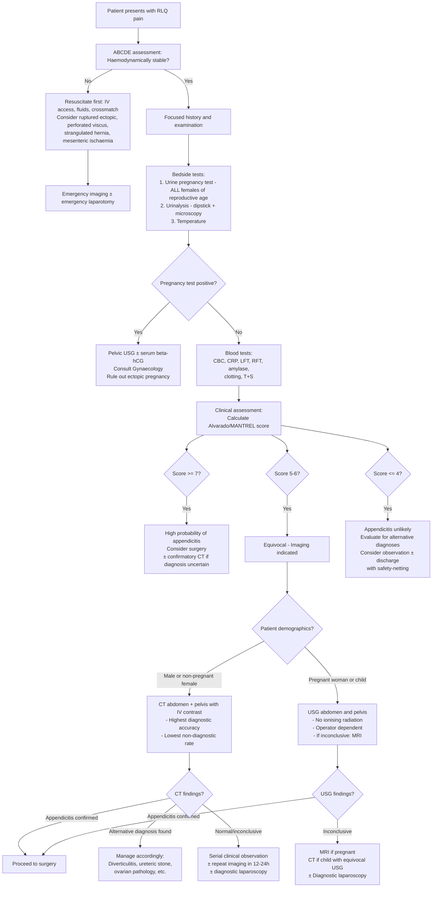

## Diagnostic Criteria, Diagnostic Algorithm, and Investigation Modalities for RLQ Pain

### The Diagnostic Philosophy

Before diving into specific criteria and investigations, understand the fundamental principle: **RLQ pain is initially a clinical diagnosis refined by targeted investigations.** The approach is:

1. **History and examination** → generate a ranked differential
2. **Bedside tests** → rapidly exclude "must-not-miss" diagnoses (urine pregnancy test, urinalysis)
3. **Blood tests** → gauge severity of inflammation, exclude metabolic mimics, prepare for surgery
4. **Imaging** → confirm or refute the leading diagnosis, identify complications

The choice and sequence of investigations depend on the **clinical probability** of the diagnosis, the **patient's demographics** (age, sex, pregnancy status), and the **haemodynamic stability** of the patient. You don't CT-scan everyone — you use clinical scoring systems to decide who needs imaging and who can go straight to theatre.

---

### Diagnostic Criteria for Acute Appendicitis

Acute appendicitis — the most common cause of RLQ pain — is the diagnosis for which formal scoring systems have been developed. The diagnosis remains ***essentially clinical*** [1][3][10], but scoring systems help stratify risk and decide when imaging is needed.

#### A. Alvarado Score (MANTRELS)

***The operative decision should be based on a clinical and laboratory-based scoring system (Alvarado score)*** [1][10]

The original **Alvarado score** uses the mnemonic **MANTRELS**:

| Component | Category | Points |
|---|---|---|
| **M** — ***Migratory RLQ pain*** | Symptom | 1 |
| **A** — ***Anorexia*** | Symptom | 1 |
| **N** — ***Nausea or vomiting*** | Symptom | 1 |
| **T** — ***Tenderness in RLQ*** | Sign | 2 |
| **R** — ***Rebound tenderness in RLQ*** | Sign | 1 |
| **E** — ***Elevated temperature ( > 37.5°C)*** | Lab | 1 |
| **L** — ***Leukocytosis (WBC > 10 × 10⁹/L)*** | Lab | 2 |
| **S** — Shift to the left (> 75% neutrophils) | Lab | 1 |
| **Total** | | **10** |

> Note: The **Modified Alvarado Score (MANTREL)** drops the "Shift" component (total out of 9 instead of 10) because a manual differential count is not always readily available [3][10].

***Interpretation:*** [1][2][3]

| Score | Interpretation | Action |
|---|---|---|
| ***≥ 7*** | ***Strongly predictive of acute appendicitis*** | ***Consider surgery ± confirmatory imaging*** |
| ***5–6*** | ***Equivocal — appendicitis possible but not certain*** | ***Requires imaging: USG or contrast-enhanced CT*** |
| ***≤ 4*** | ***Appendicitis can be ruled out with greater certainty*** | ***Evaluate for other diagnoses; discharge with safety-netting if clinically well*** |

<Callout title="Why Does This Score Work?">
Each component of the Alvarado score captures a specific pathophysiological feature of appendicitis:
- **Migratory pain** = visceral-to-somatic pain transition (T10 → parietal peritoneum)
- **Anorexia, nausea/vomiting** = systemic inflammatory response (cytokine-mediated)
- **RLQ tenderness** = parietal peritoneal irritation (the hallmark)
- **Rebound tenderness** = peritoneal inflammation (peritoneum "rebounds" against inflamed surfaces)
- **Fever** = pyrogen release from the inflammatory cascade
- **Leucocytosis** = bone marrow response to infection/inflammation (demargination + increased production)
- **Left shift** = release of immature neutrophils (bands) indicating acute bacterial infection

The score essentially quantifies "how many features of appendicitis are present" — but it is **not diagnostic** on its own. A patient can have appendicitis with a low score (e.g., early disease, elderly, immunosuppressed).
</Callout>

<Callout title="Critical Exam Point" type="error">
***A normal WBC count should NOT be used to rule out acute appendicitis*** [3]. Up to 10–20% of patients with confirmed appendicitis have a normal WBC. Conversely, ***markedly elevated WBC (e.g., > 16 × 10⁹/L) may be suggestive of gangrenous or perforated appendicitis*** [3]. The WBC is a helpful but imperfect marker.
</Callout>

#### B. Combined WBC and CRP for Screening

***WBC > 10 × 10⁹/L or CRP > 10 mg/L will give a PPV of 61.5% and NPV of 88.1%*** [3]

This means: if both WBC and CRP are normal, you can be reasonably confident (88% negative predictive value) that appendicitis is unlikely — but you cannot exclude it entirely. Serial clinical observation remains essential.

#### C. Appendicitis Inflammatory Response (AIR) Score

A more modern alternative to Alvarado, used in some centres:

| Variable | Points |
|---|---|
| Vomiting | 1 |
| RLQ pain | 1 |
| Rebound tenderness (light/medium/strong) | 1/2/3 |
| Temperature ≥ 38.5°C | 1 |
| WBC 10–14.9 / ≥ 15 | 1 / 2 |
| Neutrophils 70–84% / ≥ 85% | 1 / 2 |
| CRP 10–49 / ≥ 50 | 1 / 2 |

Interpretation: 0–4 = low risk; 5–8 = intermediate (image); 9–12 = high risk (surgery). The AIR score incorporates CRP (which Alvarado does not) and is considered to have better discriminative ability.

---

### Diagnostic Criteria for Other Key RLQ Conditions

#### Acute Pancreatitis (Revised Atlanta Classification, 2013)

If pancreatitis is suspected as a cause of RLQ pain (or as a differential), the diagnosis requires ***≥ 2 out of 3 criteria*** [3]:

1. ***Epigastric pain: acute onset of persistent, severe epigastric pain often radiating to the back***
2. ***Elevated serum lipase/amylase to ≥ 3× ULN***
3. ***Characteristic imaging findings on contrast CT, MRI, or transabdominal USG***

#### Acute Cholecystitis (Tokyo Guidelines 2013)

If the pain is felt to be more RUQ/upper abdominal, the ***TG13 diagnostic criteria*** apply [3]:

- ***Suspected diagnosis = 1× local sign + 1× systemic sign***
- ***Definite diagnosis = 1× local sign + 1× systemic sign + 1× imaging finding***

| Local Signs | Systemic Signs | Imaging Findings |
|---|---|---|
| ***Murphy's sign (Sens 50–65%, Spec 79–96%)*** | ***Fever*** | ***Findings characteristic of acute cholecystitis (USG first-line)*** |
| ***RUQ mass/pain/tenderness*** | ***Elevated CRP ( > 3 mg/dL)*** | |
| | ***Elevated WBC count*** | |

#### Testicular Torsion

There are no formal "diagnostic criteria" — ***the diagnosis is clinical and requires urgent surgical exploration regardless of investigation results*** [8]. However, the following clinical features strongly suggest torsion:
- Sudden onset severe scrotal pain
- High-riding testis with horizontal lie
- Absent cremasteric reflex
- ***Doppler USG (if diagnosis uncertain):*** decreased testicular blood flow, whirlpool sign, increased resistive index [8]

---

### Diagnostic Algorithm for RLQ Pain

The following algorithm integrates clinical assessment, scoring, and targeted investigations:

<Callout title="Key Decision Points in the Algorithm">

1. **Always start with ABCDE** — resuscitate unstable patients before investigating
2. **Urine pregnancy test is mandatory** in ALL females of reproductive age — this is a non-negotiable bedside test [3][4][5]
3. **Alvarado score stratifies** who needs imaging vs who can go to theatre vs who can be observed
4. **CT is the imaging of choice** for RLQ pain in most patients [2][6]
5. **USG is first-line** in pregnant women and children (to avoid radiation) [1][3]
6. **Diagnostic laparoscopy** is both diagnostic and therapeutic — it is the final step when investigations are inconclusive
</Callout>

---

### Investigation Modalities — Detailed Breakdown

***From the lecture slides, investigations for lower abdominal pain include:*** [4]

- ***Bedside tests: urinalysis, pregnancy test***
- ***Blood tests: blood count, renal and liver function, amylase, clotting profile, arterial blood gas, type and screen***
- ***Imaging: erect CXR, erect and supine AXR, USG, CT, contrast studies***
- ***Endoscopy: colonoscopy, upper endoscopy***

Let us now go through each in detail.

---

#### 1. Bedside Tests

| Test | What It Tells You | Why It Matters |
|---|---|---|
| ***Urine pregnancy test*** | Detects beta-hCG in urine | ***Indicated in ALL women of childbearing age*** [1][3][4][5]. A positive result in a woman with RLQ pain = ectopic pregnancy until proven otherwise. False negatives can occur very early (< 2 weeks post-conception) |
| ***Urinalysis (dipstick + microscopy)*** | Haematuria, pyuria, nitrites, leucocyte esterase | Haematuria → ureteric colic (microscopic haematuria in 90% of ureteric stones). Pyuria → UTI or pyelonephritis. ***Sterile pyuria*** can occur in appendicitis (inflamed appendix adjacent to ureter/bladder causes reactive pyuria without true UTI) [1][6] |
| ***Temperature*** | Fever | Low-grade (37.5–38.5°C) → uncomplicated appendicitis. High-grade ( > 39°C) → perforated appendicitis, abscess, pyelonephritis, PID, cholangitis [5] |
| ***ECG*** | Rule out cardiac cause | ***To rule out basal MI*** which can refer pain to the upper or right abdomen [3][5] |
| ***Capillary blood glucose*** | Rule out DKA | DKA can cause severe abdominal pain mimicking an acute abdomen (mechanism: gastroparesis, electrolyte disturbance, mesenteric ischaemia from dehydration) [5] |

#### 2. Blood Tests

| Test | Key Findings | Interpretation |
|---|---|---|
| ***CBC (Complete Blood Count)*** | ***Leucocytosis with left shift (increased bands)*** | Suggests acute infection/inflammation. ***Markedly elevated WBC ( > 16 × 10⁹/L) suggests gangrenous or perforated appendicitis*** [3]. ***Normal WBC does NOT rule out appendicitis*** [3]. RBC indices may show microcytic anaemia from chronic blood loss (caecal carcinoma) — note that ***haemodilution takes 48 hours to set in after bleeding*** [3][5] |
| ***CRP (C-reactive protein)*** | Elevated | Rises 6–12 hours after onset of inflammation. Useful for serial monitoring. ***CRP + WBC together: PPV 61.5%, NPV 88.1%*** for appendicitis [3] |
| ***LFT (Liver Function Tests)*** | Mild bilirubin elevation | ***Mild elevations in serum bilirubin have been noted to be a marker for appendiceal perforation*** [1]. Also helps differentiate hepatobiliary causes (cholecystitis, cholangitis) |
| ***RFT (Renal Function Tests)*** | Urea, creatinine, electrolytes | Assess hydration status (pre-renal AKI from vomiting/third-spacing). ***HypoK/hypoCl → prolonged vomiting; HypoK/hypoCa → can cause ileus*** [3][5]. Creatinine needed to assess ***suitability for contrast CT scans*** [3][5] |
| ***Amylase/Lipase*** | Elevated | ***Amylase peaks at 6–24 hours; > 1000 U/L (or ≥ 3× ULN for lipase) is diagnostic of acute pancreatitis*** [3][5]. May be mildly elevated in appendicitis, intestinal obstruction, or mesenteric ischaemia — but rarely > 3× ULN |
| ***Clotting profile + Type and Screen*** | INR, aPTT; blood group | Prepare for surgery. Identify coagulopathy. Essential in any patient who may need emergency laparotomy |
| ***ABG (Arterial Blood Gas) + Lactate*** | ***Metabolic acidosis + elevated lactate*** | ***Metabolic acidosis with elevated lactate → intestinal ischaemia*** (anaerobic metabolism in ischaemic bowel) [3][5]. Metabolic alkalosis → prolonged vomiting. Always check lactate if you suspect mesenteric ischaemia |
| ***Glucose*** | Elevated | ***Rule out DKA*** as a medical mimic of acute abdomen [5] |

#### 3. Imaging — Plain Radiography

| Modality | Findings | Interpretation |
|---|---|---|
| ***Erect CXR*** | ***Free gas under diaphragm (pneumoperitoneum)*** | Indicates ***perforation*** of a hollow viscus (e.g., PPU, perforated appendicitis — though perforation of the appendix rarely produces visible pneumoperitoneum because the perforation is usually sealed off). ***Demonstrable in 70% of PPU*** [3]. Also identifies right basal pneumonia as a cause of referred abdominal pain [4][5] |
| ***Supine AXR*** | ***Appendicolith (7–15%)*** — if present, ***chance of acute appendicitis is up to 90%*** [3]. ***Radio-opaque stones (90% of urinary stones are radio-opaque; only 15% of gallstones)*** [5]. Proximal dilatation + distal collapse → intestinal obstruction. ***'3-6-9 rule': SB > 3 cm, LB > 6 cm, caecum > 9 cm*** [3]. Coffee bean sign → sigmoid volvulus. Sentinel loop sign → localised ileus from adjacent inflammation (pancreatitis) [3][5] | ***AXR is NOT recommended in the diagnostic workup of suspected appendicitis*** — it does not change the level of suspicion [1]. However, it is indicated to ***evaluate for other causes of acute abdomen*** (obstruction, perforation, stones) [1][4] |
| ***Erect AXR*** | ***Air-fluid levels ( > 5 = diagnostic of intestinal obstruction)*** [3][5] | Useful if obstruction is suspected as the cause of RLQ pain |

***In children, the lecture slides specifically mention:*** ***investigations include leucocytosis, plain XR (rarely), USG, CT (beware of high radiation)*** [11]

#### 4. Imaging — Ultrasound (USG)

***USG is the first-line imaging in pregnant women and children*** [1][2][3]

| Aspect | Details |
|---|---|
| **Advantages** | ***No ionising radiation; no IV contrast needed*** [1]. Safe in pregnancy and children. Can assess gynaecological pathology (ovarian cyst, ectopic pregnancy) simultaneously. Can assess gallbladder (cholecystitis), kidneys (hydronephrosis from ureteric stone) |
| **Disadvantages** | ***Lower diagnostic accuracy than CT; higher non-diagnostic rate; operator-dependent; patient-specific limitations (body habitus, discomfort, overlying bowel gas, appendix location)*** [1] |
| **USG findings of appendicitis** | ***Non-compressible appendix with double-wall thickness diameter > 6 mm*** [1][2][3]. ***Focal pain over appendix with compression (point tenderness under the probe)*** [1]. ***Increased echogenicity of inflamed periappendiceal fat*** [1][3]. ***Fluid in RLQ*** [1][3]. ***Presence of appendicolith (posterior acoustic shadowing)*** [1][3] |
| **USG for other RLQ diagnoses** | ***Pelvic USG (TAS or TVS)***: Ectopic pregnancy (empty uterus + adnexal mass ± free fluid), ovarian cyst rupture/torsion (enlarged ovary with absent Doppler flow in torsion). ***Renal USG***: hydronephrosis from ureteric obstruction. ***Scrotal Doppler USG***: decreased testicular flow + whirlpool sign in torsion [8] |

> ***Imaging of choice by site of pain:*** [6]
>
> | Site of Pain | Imaging of Choice |
> |---|---|
> | ***RUQ*** | ***USG*** |
> | ***LUQ*** | ***CT*** |
> | ***RLQ*** | ***CT with IV contrast*** |
> | ***LLQ*** | ***CT with IV contrast*** |
> | ***Suprapubic*** | ***USG (TAS or TVS)*** |

#### 5. Imaging — Contrast CT Abdomen and Pelvis

***CT abdomen + pelvis with IV contrast is the imaging of choice for RLQ pain*** and has the ***highest diagnostic accuracy and lowest non-diagnostic rate*** for appendicitis [1][2][3][6].

| Aspect | Details |
|---|---|
| **Advantages** | ***Highest diagnostic accuracy*** (Sens ~95%, Spec ~95% for appendicitis) [1][3]. Identifies complications (abscess, perforation, phlegmon). Identifies alternative diagnoses (diverticulitis, ureteric stone, ovarian pathology, mesenteric ischaemia, caecal carcinoma). Less operator-dependent than USG |
| **Disadvantages** | ***Radiation exposure — contraindicated in pregnancy and relatively contraindicated in infants/children*** [1]. ***IV contrast contraindicated in renal insufficiency or contrast hypersensitivity*** [1] |
| **CT findings of appendicitis** | ***Enlarged appendiceal AP diameter > 6 mm with an occluded lumen*** [1][2][3]. ***Appendiceal wall thickening > 2 mm*** [1][3]. ***Appendiceal wall hyperenhancement*** [2][3]. ***Periappendiceal fat stranding*** [1][2][3]. ***Presence of appendicolith*** [1][2][3] |
| **CT findings of complications** | Periappendiceal abscess: rim-enhancing fluid collection. Free fluid in pelvis/abdomen: perforation. Extraluminal gas: perforation. Phlegmon: ill-defined inflammatory mass |
| **CT findings of alternative diagnoses** | ***Diverticulitis***: colonic diverticula + bowel wall thickening > 4 mm + pericolonic fat stranding; involvement of > 10 cm of colon + absence of enlarged pericolonic lymph nodes favours diverticulitis over CRC [1]. ***Ureteric stone***: high-density focus in the ureter + proximal hydroureter/hydronephrosis + perinephric stranding. ***Mesenteric adenitis***: cluster of enlarged mesenteric lymph nodes + normal appendix. ***Ischaemic bowel***: bowel wall thickening, pneumatosis intestinalis, portal venous gas. ***Caecal carcinoma***: irregular circumferential mass with luminal narrowing and enlarged regional lymph nodes |

#### 6. Imaging — MRI Abdomen and Pelvis

| Aspect | Details |
|---|---|
| **Advantages** | ***No ionising radiation*** [1] — the preferred advanced imaging in pregnancy when USG is inconclusive |
| **Disadvantages** | ***Higher non-diagnostic rate*** [1]; longer acquisition time; less available; more expensive; patient may not tolerate (claustrophobia) |
| **When to use** | Pregnant women with equivocal USG; children where CT radiation is a concern and USG is non-diagnostic |

#### 7. Other Imaging Modalities

| Modality | Indication | Key Findings |
|---|---|---|
| ***Doppler USG scrotum*** | Suspected testicular torsion | ***Decreased testicular blood flow (decreased Doppler signal, increased resistive index); whirlpool sign (twisted spermatic cord)*** [8]. ***Sens 69–100%, Spec 77–100%*** |
| ***Cholescintigraphy (HIDA scan)*** | If cholecystitis is suspected and USG is equivocal | IV ⁹⁹ᵐTc-HIDA is taken up by hepatocytes → excreted into bile → ***non-filling of GB indicates obstructed cystic duct*** → acute cholecystitis. ***Sens 90–97%, Spec 71–90%*** [3] |
| ***CT angiography (CTA)*** | Suspected mesenteric ischaemia | Filling defect in SMA or its branches; bowel wall thickening; pneumatosis; portal venous gas [5] |
| ***ERCP/MRCP*** | If obstructive jaundice is suspected alongside RLQ pain | Direct visualisation of CBD stones; biliary dilatation [3] |

#### 8. Endoscopy

***From the lecture slides: endoscopy (colonoscopy, upper endoscopy) is listed as an investigation modality for lower abdominal pain*** [4]

| Modality | Indication | Caution |
|---|---|---|
| ***Colonoscopy*** | ***Colonoscopy should be performed after resolution of acute inflammation in patients > 40 years old to exclude colorectal cancer*** [2] — this is a critical follow-up step after an episode of diverticulitis or if a caecal mass is suspected | ***AVOID endoscopy in the acute setting of an acute abdomen*** — a sealed-off perforation may be opened by gas insufflation during endoscopy [6] |
| Upper endoscopy | Rarely indicated acutely for RLQ pain; may be needed if PPU is suspected and CXR is negative | Same caution regarding insufflation in suspected perforation |

#### 9. Diagnostic Laparoscopy

***Diagnostic laparoscopy*** serves as both the final diagnostic step AND a therapeutic intervention [6]:

- Indicated when clinical assessment and imaging are **inconclusive**
- Allows **direct visualisation** of the appendix, terminal ileum, mesentery, ovaries, and fallopian tubes
- If appendicitis is confirmed → proceed to **laparoscopic appendicectomy** in the same sitting
- If the appendix is normal → look for alternative pathology (Meckel's diverticulum, mesenteric adenitis with enlarged lymph nodes, ovarian pathology, Crohn's ileitis)
- ***Intra-operative finding in Yersiniosis: inflammation around appendix/terminal ileum with enlarged lymph nodes but normal appendix → excise mesenteric lymph node for culture*** [3]

---

### Summary Table — Investigations by Suspected Diagnosis

| Suspected Diagnosis | Key Investigation | Key Finding |
|---|---|---|
| Acute appendicitis | CT abdomen/pelvis with IV contrast | Appendix > 6 mm, wall thickening > 2 mm, fat stranding, appendicolith |
| Ectopic pregnancy | Urine pregnancy test → pelvic USG + serum beta-hCG | Empty uterus + adnexal mass ± free fluid |
| Ureteric colic | CT KUB (non-contrast) | High-density stone in ureter, proximal hydronephrosis |
| Testicular torsion | Clinical diagnosis ± Doppler USG scrotum | Decreased flow, whirlpool sign |
| Caecal diverticulitis | CT abdomen/pelvis with IV contrast | Diverticula + wall thickening + pericolonic fat stranding |
| Crohn's ileitis | CT/MRI enterography; colonoscopy with biopsy | Terminal ileum mural thickening; skip lesions; non-caseating granulomas on biopsy |
| Intestinal TB | CT + colonoscopy with biopsy | Ileocaecal thickening + enlarged LN; caseating granulomas, AFB on biopsy |
| Mesenteric ischaemia | CT angiography + lactate | Filling defect in SMA; elevated lactate; metabolic acidosis |
| Ovarian torsion | Pelvic USG with Doppler | Enlarged ovary with absent arterial/venous Doppler flow |
| PID | Clinical (CDC criteria) + pelvic USG | Thickened/fluid-filled tubes; tubo-ovarian abscess |
| PPU | Erect CXR | Pneumoperitoneum (free gas under diaphragm) — present in 70% |
| Caecal carcinoma | CT + colonoscopy with biopsy | Irregular caecal mass; luminal narrowing; histology confirms adenocarcinoma |

---

### Timing and Perforation Risk

A common concern is: *"If I delay surgery to get a CT, will the appendix perforate?"*

***Delays of hours for investigations do NOT appear to increase the risk of perforation*** [3]. This is important because it justifies obtaining imaging in equivocal cases — the benefit of a correct diagnosis outweighs the minimal risk of a few-hour delay. However, this does NOT apply to patients with **frank peritonitis** or **haemodynamic instability** — these patients need **resuscitation and emergency surgery**, not imaging.

<Callout title="The Negative Appendectomy Rate" type="idea">
***The negative appendectomy rate (NAR) can reach up to 15–30% if solely based on clinical criteria, especially in women where gynaecological mimics are common*** [3]. This is precisely why imaging (CT) is recommended in equivocal cases — it reduces the NAR to < 5% while maintaining high sensitivity for appendicitis. The goal is to **operate on the right patients** while **avoiding unnecessary surgery** in those with alternative diagnoses.
</Callout>

---

<Callout title="High Yield Summary">

**Diagnosis of appendicitis is essentially clinical, refined by the Alvarado/MANTRELS score:**
- ≥ 7 → high probability → surgery ± imaging
- 5–6 → equivocal → imaging (CT or USG)
- ≤ 4 → low probability → consider other diagnoses

**Key bloods:** CBC (leucocytosis, but normal WBC does NOT rule out appendicitis), CRP, amylase/lipase, LFT (bilirubin elevation = marker of perforation), RFT (hydration, contrast suitability), clotting/T+S (surgical preparation), pregnancy test (mandatory in all reproductive-age females)

**Imaging of choice for RLQ pain = CT abdomen/pelvis with IV contrast** (highest accuracy, lowest non-diagnostic rate). USG first-line in pregnant women and children. MRI as alternative in pregnancy when USG inconclusive.

**CT criteria for appendicitis:** Appendix diameter > 6 mm, wall thickening > 2 mm, periappendiceal fat stranding, wall hyperenhancement, appendicolith

**Erect CXR:** Always do to look for pneumoperitoneum (PPU) and right basal pneumonia

**AXR:** Not recommended for appendicitis workup specifically, but useful for ruling out obstruction (air-fluid levels, 3-6-9 rule) and detecting appendicolith (if present → 90% chance of appendicitis)

**Don't forget:** Urine pregnancy test (ectopic), urinalysis (stones/UTI), lactate/ABG (ischaemia), glucose (DKA), ECG (MI). Colonoscopy after resolution if > 40 years old (exclude CRC). Avoid endoscopy in the acute abdomen.
</Callout>

---

<ActiveRecallQuiz
  title="Active Recall - Diagnostic Criteria, Algorithm and Investigations for RLQ Pain"
  items={[
    {
      question: "List the components of the Alvarado (MANTRELS) score and the interpretation of each score range.",
      markscheme: "MANTRELS: Migratory RLQ pain (1), Anorexia (1), Nausea/vomiting (1), Tenderness RLQ (2), Rebound tenderness (1), Elevated temperature (1), Leukocytosis (2), Shift to left (1). Total = 10. Score >= 7: strongly predictive, consider surgery. Score 5-6: equivocal, imaging required (USG or CT). Score <= 4: appendicitis unlikely, evaluate for other diagnoses."
    },
    {
      question: "What are the CT criteria for diagnosing acute appendicitis? List five findings.",
      markscheme: "1. Enlarged appendiceal diameter > 6 mm with occluded lumen. 2. Appendiceal wall thickening > 2 mm. 3. Appendiceal wall hyperenhancement. 4. Periappendiceal fat stranding. 5. Presence of appendicolith. Also acceptable: periappendiceal fluid collection, phlegmon or abscess in complicated cases."
    },
    {
      question: "Why is USG preferred over CT as first-line imaging for RLQ pain in pregnant women and children?",
      markscheme: "USG uses no ionising radiation and requires no IV contrast, making it safe in pregnancy (teratogenic risk of radiation) and children (higher lifetime radiation risk from CT due to young age and radiosensitive tissues). CT has the highest diagnostic accuracy but its radiation exposure makes it contraindicated in pregnancy and relatively contraindicated in children."
    },
    {
      question: "A 25-year-old woman presents with RLQ pain. Her WBC is normal. Can you safely rule out appendicitis based on this? Explain why or why not.",
      markscheme: "No. A normal WBC should NOT be used to rule out acute appendicitis. Up to 10-20% of confirmed appendicitis cases have a normal WBC, especially in early disease. Clinical assessment (history, examination, Alvarado score) and imaging remain essential for diagnosis. Combined WBC > 10 and CRP > 10 has NPV 88.1% but not 100%."
    },
    {
      question: "What is the significance of finding an appendicolith on AXR, and why is AXR still not recommended as the primary investigation for suspected appendicitis?",
      markscheme: "An appendicolith on AXR is present in only 7-15% of appendicitis cases, but if found, the chance of acute appendicitis is up to 90% (high positive predictive value). However, AXR is not recommended as the primary investigation because its overall sensitivity for appendicitis is very low (misses the majority of cases) and findings on plain radiograph do not change the level of clinical suspicion. CT is far superior."
    },
    {
      question: "After treating a 55-year-old patient conservatively for an episode of right-sided diverticulitis, what follow-up investigation must be arranged and why?",
      markscheme: "Colonoscopy should be arranged after resolution of acute inflammation to exclude colorectal cancer (CRC). Both diverticulitis and CRC can cause bowel wall thickening on CT and have overlapping features. CRC can only be definitively excluded by direct visualisation and biopsy via colonoscopy. This is especially important in patients over 40 years old."
    }
  ]}
/>

---

## References

[1] Senior notes: felixlai.md (Acute appendicitis — diagnosis: physical examination, Alvarado score, radiological tests, laboratory tests)
[2] Senior notes: maxim.md (Acute appendicitis — investigations: Alvarado score, imaging, CT findings)
[3] Senior notes: Ryan Ho GI.pdf (p105: Investigations for acute abdomen; p150: Approach to workup of acute appendicitis, Modified Alvarado score, imaging; p247–248: Acute cholecystitis — TG13 criteria and imaging; p340–341: Acute pancreatitis — diagnostic criteria and imaging)
[4] Lecture slides: GC 195. Lower and diffuse abdominal pain RLQ problems; pelvic inflammatory disease; peritonitis and abdominal emergencies.pdf (p12: Investigations list)
[5] Senior notes: Ryan Ho Fundamentals.pdf (p71: Palpation and peritoneal signs; p276: Pain characteristics; p278: Physical examination of acute abdomen; p279: Investigations for acute abdomen)
[6] Senior notes: maxim.md (p85–87: Acute abdomen — imaging of choice by site, investigations, avoid endoscopy rule)
[7] Senior notes: Ryan Ho Respiratory.pdf (p78: Abdominal TB — ileocaecal involvement, CT features)
[8] Senior notes: Ryan Ho Urogenital.pdf (p231: Scrotal examination and USG scrotum; p233: Testicular torsion — Doppler USG findings)
[10] Senior notes: felixlai.md (Alvarado score interpretation; diagnostic approach)
[11] Lecture slides: GC 203. The child needs an operation Common emergencies and surgery in childhood.pdf (p41: Acute appendicitis — investigations in children)
