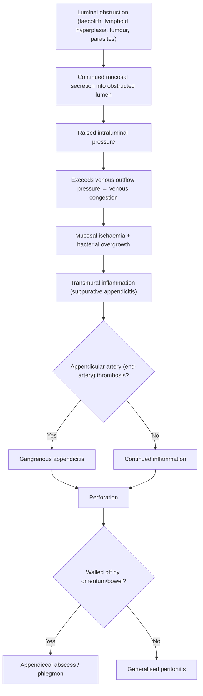

## Definition and Overview

**Right lower quadrant (RLQ) pain** refers to pain localised to the anatomical region of the abdomen that lies inferior to the transumbilical plane and to the right of the midline. This quadrant houses a specific set of structures — the terminal ileum, caecum, appendix, right ureter, right ovary and fallopian tube (in females), right spermatic cord (in males), and portions of the ascending colon and mesentery — meaning that pathology in any of these can present with RLQ pain.

RLQ pain is one of the most common surgical presentations worldwide. The clinical approach matters enormously because the differential spans from benign self-limiting conditions (mesenteric adenitis) to life-threatening emergencies (perforated appendicitis, ruptured ectopic pregnancy, testicular torsion). Your job at the bedside is to risk-stratify rapidly: *Is this patient septic? Is there peritonism? Could this be a vascular catastrophe or a gynaecological emergency?*

> **The single most important cause of RLQ pain you must know is acute appendicitis** — it is the most common surgical emergency worldwide. However, in Hong Kong and Asia, **right-sided diverticulitis** is a close mimic and far more common than in Western populations. [1][2]

---

## Epidemiology

### Acute Appendicitis (the prototypical RLQ emergency)

- ***Incidence ~233/100,000/year*** globally [3]
- ***Peak incidence in the 2nd to 3rd decades of life*** (teens to 30s), rare in infancy and the very elderly [1][3]
- ***Male-to-female ratio = 1.4:1*** overall (lifetime risk ~8.6% males vs 6.7% females) [1][3]
- Perforation risk is highest at **extremes of age** (children < 5, elderly > 65) — because young children cannot articulate symptoms and the elderly have blunted inflammatory responses, leading to delayed presentation [1]

### Right-Sided Diverticulitis

- ***Mean age of diagnosis of acute diverticulitis = 63 years*** [1]
- In Western populations diverticulosis is predominantly **left-sided** (sigmoid)
- ***In Asian populations (including Hong Kong), the proportion of right-sided diverticulosis (involving the caecum) is significantly higher*** — this is **often confused with acute appendicitis** [1][2]

### Other Key Epidemiological Points

| Condition | Key Demographics |
|---|---|
| Ectopic pregnancy | Reproductive-age females, peak 25–34 years |
| Testicular torsion | **Two peaks: neonatal and pubertal** (65% between 12–18 years) [1] |
| Ureteric colic | Male predominance (M:F = 3:1), peak 40–60s [1] |
| Mesenteric adenitis | Children and young adults (often post-viral) |
| Ovarian torsion | Reproductive-age females, especially with ovarian cysts |
| Ischaemic colitis | Elderly females (90% > 60 years) [3] |

---

## Risk Factors

### For Acute Appendicitis (the headline RLQ diagnosis)

| Category | Risk Factor | Mechanism |
|---|---|---|
| Age | Young adults (20s–30s) | Peak lymphoid tissue activity → higher chance of lymphoid hyperplasia obstructing the lumen |
| Sex | ***Male gender*** | Higher lifetime risk; also an independent risk factor for **perforation** [1] |
| Diet | Low-fibre diet | Predisposes to faecolith formation |
| Faecolith | Present in ~30–40% of cases | Composed of inspissated faecal material + calcium phosphate + bacteria + epithelial debris; physically obstructs the lumen [1] |
| Extremes of age | Children < 5, elderly > 65 | Delayed/atypical presentation → higher perforation rate |
| Diabetes mellitus | Immunosuppression | Impaired immune response → delayed containment → perforation [1] |
| Immunosuppression | Steroids, chemotherapy | Same mechanism as above |
| Previous abdominal surgery | Adhesions alter anatomy | May delay diagnosis |
| ***Pelvic appendix*** | ***Absence of rotation of appendix during childhood*** | Atypical location → atypical symptoms → delayed diagnosis → perforation [1] |
| Family history | Genetic predisposition | Unclear mechanism, possibly related to appendiceal anatomy |

### For Right-Sided Diverticulitis

- ***Obesity*** — increases intra-abdominal pressure
- ***Low-fibre diet*** — decreases stool bulk → increased intraluminal pressure
- ***NSAIDs, steroids, opiates*** — impair mucosal defence or increase constipation [1][2]
- Decreased physical activity
- Smoking
- ***High fat and red meat intake*** [1]

### For Other RLQ Pathologies

- **Ectopic pregnancy**: prior PID, previous ectopic, tubal surgery, IUD use, assisted reproduction
- **Testicular torsion**: ***cryptorchidism, bell-clapper deformity*** (occurs in 5–10% of individuals, usually bilateral — testes lack normal attachment to tunica vaginalis → increased mobility) [1]
- **Ureteric colic**: dehydration, high oxalate/protein/sodium diet, low fluid intake, family history, anatomical abnormalities (medullary sponge kidney, horseshoe kidney) [1]

---

## Anatomy and Function

Understanding RLQ pain requires you to know exactly what lives in this quadrant and how it is innervated. The pain you feel from any organ depends on **which nerve fibres are stimulated** — and this is the key to understanding why appendicitis pain *migrates*.

### Contents of the Right Lower Quadrant

| Structure | Key Anatomical Points |
|---|---|
| **Appendix** | True diverticulum of the caecum containing all layers of the bowel wall (mucosa → submucosa → muscularis → serosa). Base is at ***McBurney's point (1/3 distance from ASIS to umbilicus)***. The base is constant (at the ***confluence of three taeniae coli of the caecum***), but the tip is variable. [1][3] |
| **Caecum** | First part of the large bowel, intraperitoneal; site of the ileocaecal valve |
| **Terminal ileum** | Last portion of the small bowel; Peyer's patches here are relevant to Crohn's disease and mesenteric adenitis |
| **Right ureter** | Runs retroperitoneally over the pelvic brim (crossing the bifurcation of the common iliac artery) — a site of ureteric stone impaction |
| **Right ovary and fallopian tube** (females) | Intraperitoneal pelvic structures; relevant to ectopic pregnancy, ovarian torsion, ovarian cyst rupture |
| **Right spermatic cord** (males) | Passes through the inguinal canal; relevant to inguinal hernia and testicular pathology |
| **Psoas muscle** | Retroperitoneal; a retrocaecal appendix can irritate it |
| **Iliac vessels** | Right common iliac artery and vein |

### Appendix — Detailed Anatomy

This is critical for understanding clinical signs:

- ***The appendix is a true diverticulum of the caecum*** — it contains all layers including mucosa, submucosa, longitudinal and circular muscularis, and serosa [1][3]
- ***Position of the appendix tip:*** [1][3]

| Position | Frequency |
|---|---|
| ***Retrocaecal (but intraperitoneal)*** | ***74%*** |
| ***Pelvic*** | ***21%*** |
| Paracaecal | 2% |
| Subcaecal | 1.5% |
| Preileal | 1% |
| Postileal | 0.5% |

- **Why does position matter?** Because the *tip* of the appendix determines which somatic structures it irritates when inflamed:
  - **Retrocaecal** → may irritate the psoas muscle (positive psoas sign) and may not produce classic anterior abdominal tenderness → delayed diagnosis
  - **Pelvic** → may irritate the bladder (dysuria, frequency) or rectum (diarrhoea, tenesmus) → mimics UTI or gastroenteritis → delayed diagnosis → higher perforation rate [1]

- ***Blood supply: appendicular artery, a terminal branch of the ileocolic artery (from SMA)*** [1][3]
  - This is an **end-artery** — if thrombosed (from inflammation/oedema compressing it), the entire appendix becomes ischaemic → ***gangrenous appendicitis*** [2][3]

- ***Lymphoid tissue: the appendix contains prominent lymphoid tissue*** (compared to the rest of the caecum) [3]
  - This lymphoid tissue is most active in childhood and adolescence → prone to **lymphoid hyperplasia** which can obstruct the lumen → this is why appendicitis peaks in the young
  - ***Lymphoid tissue undergoes atrophy with age*** — which is why appendicitis is rare in the elderly [1]

- ***Mesoappendix:*** contains the appendicular artery, 4–6 lymphatic channels (drain to ileocaecal lymph nodes), and fat (fat content increases in adults; in children the mesoappendix may be transparent) [3]

### Nerve Supply and Pain Referral

This is the foundation for understanding the **classical migratory pain of appendicitis**:

| Type of Pain | Nerve Pathway | Character | Location |
|---|---|---|---|
| **Visceral pain** (early) | Afferent fibres travel with **sympathetic nerves** (lesser splanchnic nerve → T10–T11 dermatome) from the midgut | Poorly localised, dull, crampy, intermittent | **Periumbilical** (T10 dermatome — because the appendix is a midgut structure) |
| **Somatic/parietal pain** (late) | **Parietal peritoneum** is innervated by somatic nerves (corresponding to segmental dermatomes) | Well-localised, sharp, constant, worsened by movement/coughing | **RLQ** (specifically McBurney's point, because the inflamed appendix irritates the overlying parietal peritoneum) |

> **Why does appendicitis pain migrate?** Initially, distension and inflammation of the appendix stimulate visceral afferents (travelling with T10 sympathetics from the midgut) → periumbilical pain. Over 12–24 hours, transmural inflammation reaches the serosa and irritates the overlying parietal peritoneum → somatic nerve fibres localise the pain to the RLQ. This is the classic **visceral-to-somatic pain migration** of appendicitis.

### Three Anatomical Sites of Ureteric Narrowing

Relevant because ureteric stones lodge at these sites and can cause RLQ pain:

1. ***Pelvi-ureteric junction (PUJ)*** — where the renal pelvis joins the ureter
2. ***Pelvic inlet*** — where the ureter crosses the pelvic brim near the bifurcation of the common iliac artery
3. ***Vesico-ureteric junction (VUJ)*** — where the ureter pierces the bladder wall [1]

A stone at the VUJ on the right side will cause RLQ pain with urinary symptoms (frequency, urgency, dysuria).

---

## Aetiology (Focus on Hong Kong)

***The differential diagnosis of RLQ pain is broad and must be systematically considered by organ system.*** [4]

### Causes of RLQ Pain (Organised by System)

***From the lecture slides, the following causes of RLQ pain are explicitly listed:*** [4]

| System | Cause | Notes |
|---|---|---|
| **GI — Appendix** | ***Acute appendicitis*** | Most common surgical cause |
| **GI — Caecum** | ***Caecal diverticulitis*** | ***Particularly common in Hong Kong/Asia*** — right-sided diverticulosis is proportionally much higher than in Western populations [1][4] |
| **GI — Caecum** | ***Cancer of caecum*** | Insidious onset; may present with iron-deficiency anaemia, palpable mass, or obstruction [4] |
| **GI — Ileum** | ***Ileitis*** (Crohn's disease, infectious ileitis, TB ileitis) | Terminal ileum is the most common site for Crohn's disease; TB ileitis is important in Hong Kong [4] |
| **GI — Meckel's** | ***Meckel's diverticulitis*** | True diverticulum of the ileum (~2 feet from ileocaecal valve); contains ectopic gastric mucosa in ~50% → can ulcerate and present like appendicitis [4] |
| **GI — Mesentery** | ***Mesenteric adenitis*** | Inflamed mesenteric lymph nodes, often post-viral; common in children; mimics appendicitis [4] |
| **GI — Vascular** | ***Caecal ischaemia*** | Part of ischaemic colitis spectrum; watershed areas (Griffiths' point, Sudeck's point) [4] |
| **Urological** | ***Ureteric colic*** | *Can cause pain at left and right side* [4] |
| **Gynaecological** | ***Ruptured ectopic pregnancy*** | *Can cause pain at left and right side*; haemodynamic instability [4] |
| **Gynaecological** | ***Torsion of ovarian cyst*** | *Can cause pain at left and right side* [4] |
| **Hernia** | ***Inguinal/femoral hernia*** | *Can cause pain at left and right side*; incarceration → strangulation [4] |
| **Scrotal** | ***Testicular pathology*** (torsion, epididymitis) | *Can cause pain at left and right side* [4] |
| **Upper GI referred** | ***Perforated peptic ulcer*** | Duodenal contents track down the right paracolic gutter → RLQ pain and tenderness (the "drip-down" phenomenon) [4] |
| **Hepatobiliary** | ***Acute cholecystitis*** | Can present with RLQ pain if the gallbladder is low-lying or if there is referred pain [4] |

<Callout title="Hong Kong-Specific Considerations" type="idea">
In Hong Kong, always consider:
1. **Right-sided diverticulitis** — far more common than in the West; often misdiagnosed as appendicitis
2. **Intestinal tuberculosis** — TB ileitis affecting the terminal ileum/ileocaecal region; Hong Kong has intermediate TB prevalence
3. **Parasitic infections** — amoebiasis (Entamoeba histolytica) can cause amoebic typhlitis/colitis in the right colon
4. **Klebsiella liver abscess** — common in Hong Kong; can present with RLQ pain if the abscess is low in the right lobe or if there is referred pain
</Callout>

### Causes Also Listed in LLQ Slide That Overlap with RLQ [4]

The lecture slides explicitly note that the following can cause ***pain at left AND right side***:
- ***Ureteric colic***
- ***Ruptured ectopic pregnancy***
- ***Torsion of ovarian cyst***
- ***Inguinal/femoral hernia***
- ***Testicular pathology***

---

## Pathophysiology (By Major Aetiology)

### 1. Acute Appendicitis

This is the paradigmatic RLQ pathology. Understanding the pathophysiology from first principles:

***Step-by-step:*** [1][2][3]

1. **Luminal obstruction** (present in ~2/3 of cases; 1/3 are non-occlusive) [2]
   - ***Causes of obstruction:***
     - ***Faecolith*** ("faeco" = faeces, "lith" = stone): a hard stony mass of faeces — the most common cause in adults [2]
     - ***Lymphoid hyperplasia*** (the usual cause in the young) — lymphoid tissue in the appendiceal wall swells in response to infections (gastroenteritis, URTI, measles) or inflammation (e.g., Crohn's disease) [3]
     - Rare: ***tumour (carcinoma of caecum)***, intestinal parasites, foreign bodies [2]
2. **Mucosal secretion continues** → fluid accumulates in the obstructed lumen → **raised intraluminal pressure**
3. **Venous outflow obstruction** → when intraluminal pressure exceeds venous pressure, venous congestion occurs → mucosal oedema and ischaemia
4. **Bacterial invasion** → the ischaemic mucosa loses its barrier function → enteric bacteria (***E. coli, Pseudomonas aeruginosa, Peptostreptococcus, Bacteroides***) [1] invade the wall → suppurative inflammation
5. **Arterial compromise** → the appendicular artery is an ***end-artery*** → inflammation and oedema compress it → gangrenous appendicitis [2][3]
6. **Perforation** → necrotic wall perforates → if the omentum and adjacent bowel loops wall it off → **appendiceal abscess**; if not → ***generalised peritonitis*** [2]

***Disease Severity Grading:*** [1]

| Grade | Description |
|---|---|
| Grade 1 | Inflamed |
| Grade 2 | Gangrenous |
| Grade 3 | Perforated with localised free fluid |
| Grade 4 | Perforated with regional abscess |
| Grade 5 | Perforated with diffuse peritonitis |

### 2. Right-Sided (Caecal) Diverticulitis

***"Diverticulum" → Latin "divertere" = to turn aside; an outpouching from the bowel wall***

- ***False diverticula*** (as in diverticulosis coli): only **mucosa and submucosa** herniate through the muscularis propria (the full muscular wall is NOT involved) [2]
- ***Pathophysiology:*** [1][2]
  - ***Bowel wall weakening with ageing + increased intraluminal pressure*** (constipation, obesity)
  - The sigmoid has the narrowest lumen → highest pressure (***Laplace's law***: Pressure = Wall tension / Radius; smaller radius → higher pressure for a given wall tension) [2]
  - Outpouchings occur at the ***weakest points — where the vasa recta penetrate the circular muscle*** [2]
  - In Asia, right-sided diverticula are common → **caecal diverticulitis mimics appendicitis**
  - ***Obstruction of a diverticulum by a faecolith → stasis and bacterial overgrowth → inflammation*** [2]
  - ***The rectum is never affected*** because the outer longitudinal muscle layer encompasses the full circumference of the rectum (no weak points) [2]

### 3. Ureteric Colic

- A stone lodges at one of the three **anatomical narrowings** of the ureter → obstructs urine flow → proximal hydronephrosis → distension of the renal pelvis and ureter → **stimulation of visceral afferents** → severe colicky pain radiating **loin to groin** [1]
- A right-sided VUJ stone will cause RLQ pain + urinary symptoms
- Pain is **colicky** because the ureter undergoes peristaltic contractions against the obstruction

### 4. Ruptured Ectopic Pregnancy

- Ectopic implantation (usually in the fallopian tube) → growing trophoblast erodes the tubal wall → tubal rupture → haemoperitoneum
- Blood irritates the parietal peritoneum → localised RLQ pain (if right-sided) ± **referred shoulder-tip pain** (diaphragmatic irritation → phrenic nerve → C3-C5)
- Haemodynamic instability if significant blood loss

### 5. Mesenteric Adenitis

- Viral or bacterial infection (often *Yersinia enterocolitica*, adenovirus) → reactive enlargement of mesenteric lymph nodes, especially in the ileocaecal region
- Inflamed nodes cause visceral pain mimicking appendicitis
- Self-limiting; important differential in children

### 6. Caecal Ischaemia

- The right colon receives blood from the **ileocolic artery** and **right colic artery** (both branches of SMA)
- Watershed areas (***Griffiths' point*** at the splenic flexure, ***Sudeck's point*** at the rectosigmoid junction) are classically vulnerable [3]
- However, the caecum itself can be ischaemic in **non-occlusive mesenteric ischaemia** (low-flow states in critically ill patients)
- Pathophysiology: hypoperfusion → mucosal ischaemia → reperfusion injury → transmural necrosis (in prolonged ischaemia) [3]

### 7. Meckel's Diverticulitis

- ***Meckel's diverticulum***: a **true diverticulum** (contains all layers) — remnant of the vitelline (omphalomesenteric) duct
- "***Rule of 2s***": 2% of population, 2 feet from ileocaecal valve, 2 inches long, 2 types of ectopic tissue (gastric and pancreatic), presents before age 2 (in children)
- Ectopic gastric mucosa secretes acid → ulceration of adjacent ileal mucosa → bleeding or perforation
- Can also become inflamed (Meckel's diverticulitis) → clinically indistinguishable from appendicitis

### 8. Testicular Torsion

- ***Torsion of the spermatic cord*** → venous outflow obstruction → congestion → arterial compromise → testicular ischaemia → infarction if not relieved within **6 hours**
- ***Bell-clapper deformity*** → testes lack normal posterior fixation to tunica vaginalis → lie transversely → free to rotate [1]
- Pain often radiates to the ipsilateral **lower abdomen/RLQ** (because the testis is innervated by T10 sympathetics, the same as the periumbilical region)

---

## Classification

### By Organ System

| System | Conditions |
|---|---|
| **Gastrointestinal** | Acute appendicitis, caecal diverticulitis, Crohn's ileitis, TB ileitis, Meckel's diverticulitis, caecal carcinoma, caecal ischaemia, mesenteric adenitis, right-sided colitis (infectious, IBD) |
| **Urological** | Ureteric colic (right), right pyelonephritis, right renal abscess |
| **Gynaecological** | Ruptured ectopic pregnancy, ovarian torsion, ovarian cyst rupture, pelvic inflammatory disease (PID), endometriosis |
| **Vascular** | Mesenteric ischaemia (SMA occlusion), ruptured right iliac artery aneurysm |
| **Hernias** | Right inguinal hernia (direct/indirect), right femoral hernia — incarcerated/strangulated |
| **Scrotal** | Testicular torsion, epididymo-orchitis, torsion of appendix testis |
| **Musculoskeletal / Abdominal wall** | Rectus sheath haematoma, psoas abscess, abdominal wall hernia |
| **Referred pain** | Perforated duodenal ulcer (contents track down right paracolic gutter), acute cholecystitis, right basal pneumonia, right lower lobe PE |

### By Urgency (Surgical vs Non-Surgical)

| Urgency | Conditions |
|---|---|
| **Requires emergency surgery** | Perforated appendicitis with peritonitis, testicular torsion, ruptured ectopic pregnancy, strangulated hernia, intestinal perforation |
| **May require urgent surgery** | Uncomplicated appendicitis, ovarian torsion, appendiceal abscess (may be drained percutaneously first) |
| **Usually managed conservatively** | Mesenteric adenitis, uncomplicated diverticulitis, ureteric colic, PID, Crohn's flare |

### By Pain Character

| Character | Typical Cause | Mechanism |
|---|---|---|
| **Colicky** (waxing and waning) | Ureteric colic, intestinal obstruction, biliary colic | Peristalsis of smooth muscle against an obstruction |
| **Constant, progressive** | Appendicitis, diverticulitis | Progressive transmural inflammation |
| **Sudden onset, severe** | Ruptured ectopic, testicular torsion, perforated viscus | Acute vascular compromise or free peritoneal contamination |
| **Migratory** (periumbilical → RLQ) | Appendicitis | Visceral → somatic pain transition (see above) |

---

## Clinical Features

### Symptoms

#### A. Acute Appendicitis (the "must-know" presentation)

***Classical course:*** [2][3]

1. ***Periumbilical pain: crampy, intermittent, poorly localised, aggravated by moving/coughing*** [2]
   - **Why periumbilical?** The appendix is a **midgut** structure → visceral afferents travel with sympathetic nerves to spinal cord segments **T10–T11** → the brain interprets this as periumbilical pain (T10 dermatome)

2. ***Low-grade fever, vomiting, anorexia*** [2]
   - **Why anorexia?** Visceral inflammation triggers a systemic inflammatory response → release of cytokines (IL-1, TNF-α) → central appetite suppression via the hypothalamus
   - **Key teaching point:** In appendicitis, ***anorexia precedes pain, and pain precedes vomiting*** — this is the classic sequence. ***In gastroenteritis, nausea/vomiting typically precede the pain*** [2]. This distinction is clinically useful.

3. ***Pain migrating to the RLQ after 12–24 hours: constant, sharp, well-localised pain*** [2]
   - **Why migration?** Transmural inflammation reaches the serosa → irritates the parietal peritoneum → somatic (well-localised) pain at **McBurney's point**
   - The patient can now "point with one finger" to where it hurts most (***pointing sign***) [2]

Other symptoms depending on appendix position:
- **Pelvic appendix**: dysuria, frequency, tenesmus, diarrhoea (irritation of bladder/rectum)
- **Retrocaecal appendix**: back/flank pain, minimal anterior abdominal signs (the appendix is shielded from the anterior parietal peritoneum)

#### B. Caecal Diverticulitis

- ***Clinical triad: lower abdominal pain (RLQ in Asia) + fever + leucocytosis*** [2]
- Pain is typically constant and progressive (not migratory — unlike appendicitis)
- May have preceding episodes of similar pain (recurrent diverticulitis)
- Important: **older age group** (mean 63 years) compared to appendicitis

#### C. Ureteric Colic

- ***Severe colicky pain radiating "loin to groin"*** — waxes and wanes, patient writhes in pain and **cannot lie still** (in contrast to peritonitis where the patient lies perfectly still) [1][5]
- Associated haematuria (90% have at least microscopic haematuria)
- Nausea and vomiting (via vagal reflex from renal capsule distension)
- If the stone is at the VUJ → urinary frequency, urgency, dysuria

#### D. Ruptured Ectopic Pregnancy

- **Amenorrhoea** (missed period) + **vaginal bleeding** (often scant, dark) + **RLQ pain** (if right-sided)
- Shoulder-tip pain (Kehr's sign) → blood irritates the diaphragm → referred pain via phrenic nerve (C3–C5)
- Haemodynamic instability: tachycardia, hypotension, pallor

#### E. Testicular Torsion

- ***Sudden onset severe unilateral scrotal pain*** (may radiate to the lower abdomen/RLQ)
- Nausea and vomiting (vagal reflex)
- No fever initially (unlike epididymo-orchitis)
- History of prior episodes of transient pain (intermittent torsion/detorsion)

#### F. Mesenteric Adenitis

- RLQ pain mimicking appendicitis, but usually preceded by a **viral URTI or gastroenteritis**
- Fever may be higher than in appendicitis (paradoxically)
- Diarrhoea is more common than in appendicitis
- Self-limiting

#### G. Meckel's Diverticulitis

- Clinically **indistinguishable from appendicitis** — same migratory pain pattern
- May have associated painless PR bleeding (if ectopic gastric mucosa causes ulceration)
- Usually diagnosed intraoperatively when a normal appendix is found

---

### Signs

#### A. Acute Appendicitis — Specific Signs

***"You need to know these signs" — they are high-yield exam material*** [2]

| Sign | How to Elicit | Pathophysiology |
|---|---|---|
| ***Pointing sign*** | Ask patient to point to maximum tenderness | ***Localised peritoneal irritation at McBurney's point (1/3 from ASIS to umbilicus)*** — the base of the appendix lies here [2] |
| ***Rovsing's sign*** | ***RLQ pain upon palpation (or rebound) of the LLQ*** | Palpating the LLQ pushes gas/fluid retrograde through the colon → distends the caecum → stretches the inflamed parietal peritoneum in the RLQ [2] |
| ***Psoas sign*** | ***Increased RLQ pain upon extending the hip against resistance*** (patient lies on left side, examiner extends the right hip) | A **retrocaecal appendix** lies anterior to the psoas muscle → passive extension stretches the psoas → moves the inflamed appendix → pain [2] |
| ***Obturator sign*** | Pain on passive **internal rotation** of the flexed right hip | A **pelvic appendix** lies near the obturator internus muscle → internal rotation stretches this muscle → irritates the inflamed appendix |
| **Guarding** | Involuntary rigidity of abdominal wall muscles on palpation | Somatic reflex arc: inflamed parietal peritoneum → afferent signal → spinal cord → efferent motor signal → rectus abdominis contraction (protective) |
| **Rebound tenderness** | Pain worse on release of pressure than on pressing | Sudden release causes the peritoneal surfaces to bounce back → movement of inflamed peritoneum → pain |
| **Fever** | Low-grade (37.5–38.5°C) initially; high-grade if perforated | Pyrogens (IL-1, TNF-α, PGE2) from the inflammatory response act on the hypothalamic thermoregulatory centre |

<Callout title="Why is McBurney's Point Important?" type="idea">
McBurney's point marks the surface projection of the **base** of the appendix. The base is constant (at the confluence of three taeniae coli), but the tip is variable. This means that while the point of maximum tenderness is usually at McBurney's point, atypical appendix positions (pelvic, retrocaecal) may shift it.
</Callout>

#### B. Signs Specific to Other RLQ Conditions

| Condition | Key Signs | Pathophysiological Basis |
|---|---|---|
| **Caecal diverticulitis** | RLQ tenderness, low-grade fever, palpable mass (if abscess) | Pericolic inflammation → localised peritonism; abscess → walled-off collection |
| **Ureteric colic** | Patient **cannot lie still** (writhes), renal angle tenderness | Visceral pain from ureteric peristalsis against obstruction → restlessness (no peritoneal irritation → no benefit from lying still) |
| **Ruptured ectopic** | Cervical motion tenderness ("chandelier sign"), adnexal tenderness, signs of shock | Blood in pelvis irritates the peritoneum; hypovolaemia from haemoperitoneum |
| **Testicular torsion** | ***High-riding, horizontal-lying testis; absent cremasteric reflex; swollen, tender testis*** | Torsion shortens the spermatic cord → testis rides high; bell-clapper deformity → horizontal lie; oedema abolishes the cremasteric reflex arc |
| **Strangulated hernia** | Tender, irreducible lump at inguinal region; overlying erythema | Incarcerated bowel loop → venous congestion → arterial compromise → ischaemia → inflammation |
| **Peritonitis (any cause)** | ***Board-like rigidity, absent bowel sounds, rebound tenderness, patient lies still*** | Generalised peritoneal inflammation → diffuse guarding; paralytic ileus → absent bowel sounds; any movement worsens pain |
| **Mesenteric adenitis** | Shifting tenderness (unlike appendicitis, where tenderness is fixed) | Inflamed lymph nodes are on the mesentery, which is mobile → tenderness shifts with position |

#### C. Abdominal Examination Framework for RLQ Pain

Always assess:
1. **Inspection**: scars (previous surgery → adhesions), distension, visible peristalsis, hernia orifices
2. **Palpation**: tenderness (localised vs diffuse), guarding (voluntary vs involuntary), rebound tenderness, masses
3. **Percussion**: tympany (bowel gas), shifting dullness (free fluid)
4. **Auscultation**: bowel sounds (hyperactive = obstruction; absent = ileus/peritonitis)
5. **Special tests**: psoas sign, obturator sign, Rovsing's sign
6. **Don't forget**:
   - ***Digital rectal examination (DRE)*** — pelvic abscess, rectal mass, blood on the glove
   - ***Hernial orifices*** — always check both groins
   - ***Testicular examination*** (in males)
   - ***Vaginal examination*** (in females, if indicated) — cervical motion tenderness, adnexal masses

<Callout title="Critical Rule" type="error">
**Never diagnose appendicitis without checking the hernial orifices and performing a DRE.** An incarcerated femoral hernia in an elderly woman can mimic appendicitis perfectly (the Richter's hernia — where only part of the bowel wall is trapped — may not cause obstruction, just localised pain and tenderness). Always examine **both groins**, and in males, always examine the **scrotum**. A testicular torsion can present with abdominal pain alone (referred via T10).
</Callout>

---

## Summary Table: Key RLQ Differentials — Symptom Comparison

| Feature | Appendicitis | Caecal Diverticulitis | Ureteric Colic | Ectopic Pregnancy | Testicular Torsion | Mesenteric Adenitis |
|---|---|---|---|---|---|---|
| **Age** | 10–30 | > 50 | 40–60 | Reproductive age | 12–18 | Children |
| **Pain onset** | Gradual, migratory | Gradual, non-migratory | Sudden, colicky | Sudden | Sudden | Gradual |
| **Pain migration** | Periumbilical → RLQ | No | No | No | Scrotal → abdominal | No |
| **Fever** | Low-grade | Yes | No (unless infected) | No (unless septic) | No initially | Higher than expected |
| **Anorexia** | Yes (early) | Variable | No | Variable | No | Variable |
| **Urinary symptoms** | If pelvic appendix | Rare | Yes | Rare | Rare | No |
| **Vaginal bleeding** | No | No | No | Yes (scant, dark) | No | No |
| **Key sign** | McBurney's tenderness | RLQ mass | Restlessness, loin tenderness | Cervical motion tenderness | High-riding testis | Shifting tenderness |

---

<Callout title="High Yield Summary">

**Definition:** RLQ pain = pain in the lower right abdomen; the most common surgical cause is **acute appendicitis**.

**Epidemiology:** Appendicitis peaks in the 2nd–3rd decades; M:F = 1.4:1. In Hong Kong/Asia, **right-sided diverticulitis** is proportionally much more common than in the West and is a key differential.

**Anatomy:** The appendix base is constant (McBurney's point, confluence of taeniae coli). The tip is variable (74% retrocaecal, 21% pelvic). Blood supply = appendicular artery (end-artery from ileocolic). Prominent lymphoid tissue in the young.

**Pathophysiology of appendicitis:** Luminal obstruction (faecolith, lymphoid hyperplasia) → raised intraluminal pressure → venous congestion → ischaemia → bacterial invasion → transmural inflammation → gangrenous appendicitis (end-artery thrombosis) → perforation → abscess or generalised peritonitis.

**Visceral vs somatic pain:** Midgut visceral afferents → T10 → periumbilical pain (early). Parietal peritoneum irritation → somatic localisation to RLQ (late 12–24h). This is why the pain **migrates**.

**Key clinical signs:** Pointing sign, Rovsing's sign (RLQ pain on LLQ palpation), Psoas sign (retrocaecal appendix), Obturator sign (pelvic appendix).

**In appendicitis:** Anorexia → pain → vomiting (sequence). In gastroenteritis: vomiting → pain (different sequence).

**Never forget:** Check hernial orifices, do DRE, examine testes, and in females, consider gynaecological causes (ectopic pregnancy, ovarian torsion, PID). Always do a urine pregnancy test in women of reproductive age.

**Hong Kong specifics:** Right-sided diverticulitis, TB ileitis, Klebsiella liver abscess, parasitic infections.
</Callout>

---

<ActiveRecallQuiz
  title="Active Recall - RLQ Pain: Definition, Epidemiology, Anatomy, Aetiology, Pathophysiology and Clinical Features"
  items={[
    {
      question: "Explain the pathophysiological basis for the classical migratory pain of appendicitis (periumbilical to RLQ).",
      markscheme: "Early: midgut visceral afferents travel with sympathetic nerves to T10-T11 causing poorly localised periumbilical pain. Late (12-24h): transmural inflammation reaches serosa, irritating parietal peritoneum innervated by somatic nerves, causing well-localised sharp RLQ pain at McBurney's point."
    },
    {
      question: "Why is the appendicular artery clinically significant, and what complication results from its occlusion?",
      markscheme: "The appendicular artery is a terminal branch of the ileocolic artery and is an end-artery. Occlusion (due to inflammation compressing the vessel) leads to gangrenous appendicitis because there is no collateral blood supply to compensate."
    },
    {
      question: "Name four causes of RLQ pain from the lecture slides that can also cause left-sided pain.",
      markscheme: "Ureteric colic, ruptured ectopic pregnancy, torsion of ovarian cyst, inguinal/femoral hernia, testicular pathology (any four)."
    },
    {
      question: "Why is right-sided diverticulitis a particularly important differential for appendicitis in Hong Kong?",
      markscheme: "In Asian populations (including Hong Kong), right-sided diverticulosis is proportionally much more common than in Western populations. It presents with RLQ pain, fever and leucocytosis, closely mimicking appendicitis. Mean age is higher (63 years) which may help differentiate."
    },
    {
      question: "What is the Psoas sign, and what appendix position does it suggest?",
      markscheme: "Psoas sign = increased RLQ pain on extension of the right hip against resistance. It suggests a retrocaecal appendix lying anterior to the psoas muscle; extending the hip stretches the psoas and moves the inflamed appendix, causing pain."
    },
    {
      question: "Describe the sequence of symptoms in appendicitis versus gastroenteritis and explain why this distinction matters.",
      markscheme: "Appendicitis: anorexia first, then pain, then vomiting. Gastroenteritis: nausea and vomiting precede or accompany pain. This helps differentiate the two clinically because the sequence reflects the pathophysiology: in appendicitis, visceral inflammation causes anorexia centrally before pain localises."
    }
  ]}
/>

---

## References

[1] Senior notes: felixlai.md (Acute appendicitis, Diverticular disease, Testicular torsion, Urinary stones, Inguinal hernia, Ischaemic colitis sections)
[2] Senior notes: maxim.md (Acute appendicitis, Diverticular disease, Intestinal obstruction sections)
[3] Senior notes: Ryan Ho GI.pdf (p148: Acute Appendicitis, p146: Ischaemic Colitis, p102: Abdominal pain approach)
[4] Lecture slides: GC 195. Lower and diffuse abdominal pain RLQ problems; pelvic inflammatory disease; peritonitis and abdominal emergencies.pdf (p5: RLQ causes, p6: LLQ causes)
[5] Senior notes: Ryan Ho Fundamentals.pdf (p276: Abdominal pain description, p307: RUQ pain approach)
