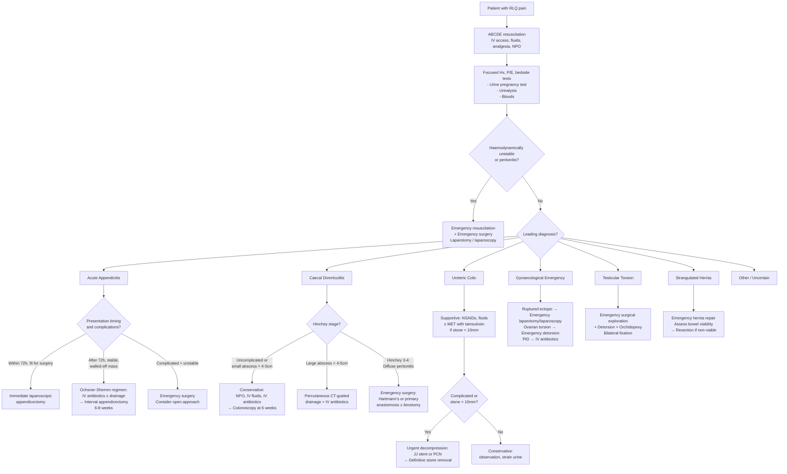

## Management of RLQ Pain

### Management Philosophy

The management of RLQ pain follows the same overarching surgical principle you apply to any acute abdomen: **Resuscitate → Diagnose → Decide (operative vs non-operative) → Definitive treatment → Follow-up**. The specific management depends entirely on the *underlying diagnosis*. Since acute appendicitis is the most common surgical cause of RLQ pain, it forms the backbone of this section, but we will also cover the management of other major causes.

Think of it this way: the RLQ pain is the *presenting complaint* — you don't treat "RLQ pain" per se. You treat the *cause*. The initial management, however, is universal regardless of the diagnosis: **stabilise the patient, establish venous access, give fluids, provide analgesia, and obtain investigations**.

---

### General Initial Management (Universal for All Causes of RLQ Pain)

***Resuscitation, NPO, IV fluids, analgesics*** [2]

| Step | Action | Rationale |
|---|---|---|
| **A — Airway** | Ensure patent airway | Obtunded patients (septic shock, DKA) may lose airway protection |
| **B — Breathing** | Assess respiratory status, give O₂ if needed | Rule out right basal pneumonia as a cause; assess for sepsis-related tachypnoea |
| **C — Circulation** | ***IV access (large bore), IV fluid resuscitation*** | Patients are often dehydrated from vomiting, reduced oral intake, and third-space fluid loss. ***Crystalloids (normal saline, Ringer's lactate/Hartmann's solution)*** [1]. ***K⁺ replacement may be indicated but given cautiously in AKI*** [1] |
| **NPO** | ***Nil per os*** | Limits further bowel distension; prepares for potential surgery (aspiration risk during anaesthesia) |
| **Analgesia** | ***Pain control with analgesics*** | Opioids (e.g., morphine, fentanyl) and/or paracetamol. ***NSAIDs are first-line for ureteric colic*** [12]. The old teaching that "analgesics mask surgical signs" is outdated — adequate pain relief actually improves clinical assessment [1] |
| **NG tube** | If vomiting or bowel obstruction suspected | Decompression of the stomach; reduce aspiration risk; "drip and suck" [1] |
| **Antibiotics** | Start empirically if infection suspected | Before theatre; within 60 minutes of incision (see below) |
| **Monitoring** | Vital signs, urine output (catheter if unwell), serial abdominal examination | Detect deterioration early (progression to peritonitis, septic shock) |

---

### Management Algorithm — Overview

---

### A. Management of Acute Appendicitis (The Prototypical RLQ Emergency)

This is the most important section. The management has three pillars: **supportive care, antibiotics, and surgery**.

#### 1. Supportive Care

***Resuscitation, NPO, IV fluids, analgesics*** [2]

- ***Adequate hydration with IV fluid resuscitation*** [1]
  - Paediatric resuscitation bolus = ***10–20 mL/kg full-rate*** [1]
  - Maintenance fluid therapy using the **4-2-1 rule** (Holliday-Segar):

| Weight | Rate |
|---|---|
| ***1st 10 kg*** | ***4 mL/kg/hr (100 mL/kg/day)*** |
| ***2nd 10 kg*** | ***2 mL/kg/hr (50 mL/kg/day)*** |
| ***Each additional kg*** | ***1 mL/kg/hr (20 mL/kg/day)*** |

- ***Correction of electrolyte abnormalities*** [1]
- ***Close monitoring of vital signs and urine output*** [1]
- ***Pain control with analgesics*** [1] — paracetamol ± opioids (morphine, fentanyl). Do NOT withhold analgesia while awaiting surgical review.

#### 2. Antibiotic Therapy

***Prophylactic IV antibiotics*** [2]

This is a critical component. The rationale differs depending on the clinical scenario:

| Scenario | Antibiotic Indication | Rationale |
|---|---|---|
| **Pre-operative prophylaxis** | ***Given within a 60-minute "window" before the initial incision*** [1] | Reduces risk of surgical site infection (wound infection, intra-abdominal abscess). The appendix harbours enteric organisms — operating through a contaminated field requires prophylaxis |
| **Non-complicated appendicitis** | ***Continue antibiotics until 24 hours post-op only*** [2] | Once the source is removed and there is no contamination, prolonged antibiotics are unnecessary and increase the risk of antibiotic resistance and *C. difficile* infection |
| **Complicated appendicitis (abscess, phlegmon, perforation)** | ***Continue antibiotics for 3–7 days post-op*** [2] | Ongoing bacterial contamination and established infection require a therapeutic (not just prophylactic) course |
| **Non-operative management (Ochsner-Sherren)** | Full therapeutic course of IV antibiotics | The antibiotics ARE the primary treatment in this scenario |

***Antibiotic choices:*** [1][2][3]

- ***Metronidazole AND 3rd-generation cephalosporin*** (e.g., ***ceftriaxone + metronidazole***) [1][2]
- Alternative: ***cefoxitin or cefotetan or cefazolin 2g + metronidazole 500mg IV*** [3]

> **Why metronidazole?** "Metro" = metre (measure), "nidazole" = nitroimidazole class. Metronidazole is a **nitroimidazole** that is selectively activated by anaerobic organisms (they reduce the nitro group → cytotoxic intermediates that damage DNA). Appendicitis involves **mixed aerobic-anaerobic flora** (*E. coli*, *Bacteroides fragilis*, *Peptostreptococcus*) — metronidazole provides the **anaerobic coverage** [2], while the cephalosporin covers **Gram-negative aerobes**.

#### 3. Surgical Treatment — Appendicectomy

***Laparoscopic appendicectomy is the first-line treatment*** [2][3]

##### a. Timing: Immediate vs Interval Surgery

This is a critical decision point based on **duration of symptoms and clinical status**:

| | ***Immediate Surgery*** | ***Interval Surgery (Ochsner-Sherren Regimen)*** |
|---|---|---|
| ***Indications*** | ***Present within 72 hours AND fit for surgery*** [2] | ***Present > 72 hours AND stable*** with a walled-off appendix mass [2] |
| | ***Complicated and unstable → consider open surgery*** [2] | |
| **Rationale** | Early disease is still resectable with minimal adhesions; delay risks perforation in untreated cases | ***After 72 hours, a walled-off appendix mass means immediate surgery is technically difficult due to adhesions*** [2]. The inflamed tissue planes are obscured, and forced dissection risks injury to the caecum, iliac vessels, and ureter |
| ***Approach*** | ***Laparoscopic is preferred: ↓ infection risk, ↓ post-op pain, ↓ hospital stay*** [2][3] | ***IV antibiotics (~90% success rate) ± image-guided drainage of abscess*** [2] |
| | ***Open: indicated if gross sepsis*** [2] | ***Laparoscopic appendicectomy 6–8 weeks later*** [2] |
| ***Follow-up*** | Histology of specimen | ***Colonoscopy if > 40 years old: exclude colorectal cancer*** [2] |

<Callout title="Why Interval Appendicectomy?">
***Clinical rationale for interval appendicectomy*** [1]:
1. ***Prevent recurrence of appendicitis*** — without appendicectomy, recurrence rates are ~20–30%
2. ***Exclude neoplasms*** — especially in older adults: ***carcinoid tumour, adenocarcinoma, mucinous cystadenoma and cystadenocarcinoma*** have higher incidence with age [1]. A walled-off mass in an elderly patient could be concealing a caecal malignancy

***Treatment failure during the Ochsner-Sherren regimen*** (as evidenced by ***bowel obstruction, sepsis, persistent pain, fever, or leucocytosis***) ***requires immediate appendicectomy*** [1]. You cannot persist with conservative management if the patient is deteriorating.
</Callout>

##### b. Surgical Approach: Laparoscopic vs Open

| Feature | ***Laparoscopic*** | ***Open*** |
|---|---|---|
| **Advantages** | ***↓ wound infection, ↓ post-op pain, ↓ duration of hospital stay*** [2][3] | ***↓ intra-abdominal abscess rate, ↓ operative time*** [3] |
| **Disadvantages** | Requires general anaesthesia; slightly higher intra-abdominal abscess rate | Larger wound; more post-op pain; longer recovery |
| **Preferred when** | ***First-line in most cases*** [2][3] | ***Gross sepsis; generalised peritonitis; when laparoscopic equipment/expertise unavailable*** [2] |

***Positioning:*** ***Supine ± Trendelenburg and right side up*** (allows small bowel to fall away from the operative field by gravity) [2]

##### c. Incisions for Open Appendicectomy

***These are high-yield for exams and consent:*** [2][3]

| Incision | Description | When Used |
|---|---|---|
| ***Lanz incision*** | ***Transverse incision ~2 cm below umbilicus, centred on mid-clavicular line*** | ***More popular*** because it follows ***Langer's lines → more cosmetically pleasing with reduced scarring*** [2] |
| ***Gridiron incision*** | ***Perpendicular to the line joining ASIS to umbilicus, at McBurney's point*** (90° to this line) | Classic teaching incision; muscle fibres are split (not cut) layer by layer [2][3] |
| ***Rutherford-Morrison*** | ***Extend Gridiron obliquely upwards and laterally*** | ***For paracaecal or retrocaecal appendix*** that is fixed and difficult to deliver [2][3] |
| ***Lower midline*** | Vertical midline incision | ***If diagnosis is in doubt*** (allows full exploration of the abdomen) [3] |

##### d. Unexpected Intra-Operative Findings

***This is tested in exams — "what do you do if you find a normal appendix?"*** [3]

| Finding | Action |
|---|---|
| ***Normal appendix*** | ***Exclude alternative causes: terminal ileitis, Meckel's diverticulitis, tubo-ovarian causes (females), mesenteric adenitis (children). Still remove the appendix*** (to avoid diagnostic confusion in future presentations) [3] |
| ***Cannot find appendix*** | ***Mobilise the caecum + trace the taeniae coli to their confluence*** — the base of the appendix is always at this point [3] |
| ***Appendicular tumour — Carcinoid*** | ***Simple appendicectomy if < 2 cm; right hemicolectomy if > 2 cm*** [3] |
| ***Appendiceal adenocarcinoma*** | ***Right hemicolectomy — standard*** [3] |

##### e. Risks of Appendicectomy (For Consent)

***These are important "need to know for consent" points*** [2]:

| Timing | Complication | Explanation |
|---|---|---|
| ***Immediate*** | ***Conversion to open surgery*** | Adhesions, poor visualisation, unexpected pathology |
| | ***Normal appendix found (still removed)*** | To prevent future diagnostic confusion |
| | ***Malignancy found → requiring right hemicolectomy ± stoma*** | Unexpected carcinoid or adenocarcinoma |
| | ***Injury to surrounding organs*** | Caecum, iliac vessels, ureter, small bowel |
| | ***Bleeding*** | From mesoappendix or appendicular artery stump |
| ***Early*** | ***Wound infection (5–10%)*** | Contaminated field (enteric organisms) |
| | ***Intra-abdominal/pelvic abscess*** (spiking fever post-op) | Residual infected fluid/inadequate washout |
| | ***Post-operative ileus*** | Bowel handling + peritoneal inflammation → temporary paralysis |
| ***Late*** | ***Incisional hernia*** | Weakness at the incision site |
| | ***Adhesions*** | Any intra-abdominal surgery causes adhesions |
| | ***Recurrent/stump appendicitis*** | Incomplete removal of appendiceal stump |

#### 4. Non-Operative (Conservative) Management of Appendicitis

***Conservative management can be considered if uncomplicated (no perforation/abscess) and patient is not fit for surgery*** [2]

| Aspect | Details |
|---|---|
| **Regimen** | ***Bowel rest (NPO) + IV ceftriaxone + metronidazole*** [2] |
| **Advantages** | ***Shorter duration of disability; lower pain score; lower risk of surgical complications; faster rate of recovery*** [1] |
| **Disadvantages** | ***Risk of progression to complicated appendicitis; risk of recurrent appendicitis; greater risk in elderly and immunocompromised patients; risk of unexpected lesion in appendix (carcinoid, carcinoma) — risk increases with age*** [1] |
| **Recurrence rates** | ***30% in 3 months; 40% in 1 year; 50% in 3 years*** [2] |
| **Key trials** | ***CODA (2020): 10-day antibiotics non-inferior to appendicectomy, but 30% chance of appendicectomy within 90 days, with increased risk if appendicoliths are present*** [2] |

<Callout title="Surgery vs Antibiotics — The Verdict" type="idea">
The evidence is evolving. The ***CODA trial (2020)*** and ***APPAC series*** suggest that antibiotics alone can work in selected, uncomplicated cases. However, ***surgery remains the gold standard*** because [3]:
1. Pre-operative imaging ***cannot reliably distinguish perforated from non-perforated*** appendicitis
2. Stratification of who needs surgery vs who doesn't is ***unsatisfactory***
3. Non-operative treatment is ***risky for older, immunocompromised, or comorbid patients*** in whom disease severity is often underestimated
4. Appendicoliths predict treatment failure with antibiotics alone

Bottom line: **Offer surgery to most patients. Reserve antibiotics-only for patients who refuse surgery or are unfit**, with clear counselling about recurrence risk.
</Callout>

---

### B. Management of Right-Sided (Caecal) Diverticulitis

The management parallels that of left-sided diverticulitis, stratified by the ***Hinchey classification*** [1][3]:

#### Conservative Treatment

***Indications:*** [3]
- ***Uncomplicated diverticulitis as evidenced by CT***
- ***Microperforation (localised pericolic air or small fluid on CT) — NOT considered complicated disease***
- ***Small diverticular abscesses ( < 4–5 cm) or not amenable to percutaneous drainage***

***Regimen:*** [3]
- ***Diet: NPO (bowel rest) → clear fluid diet → high-fibre low-residual diet***
- ***IV fluids + analgesics***
- ***Antibiotics: IV augmentin or cefuroxime + metronidazole × 10–14 days → IV tazocin if severe***
- ***Clinical resolution typically in 3–5 days → switch to oral antibiotics***

***Follow-up:*** [2][3]
- ***Elective colonoscopy at 6 weeks*** — because ***colorectal cancer can present similarly to diverticulitis on CT (2.8% positive rate)*** [3]
- ***Interval colectomy is usually NOT required*** — recurrence rate is low
- ***Number of recurrent attacks (traditionally ≥ 2) is no longer an indication for interval colectomy*** — prior uncomplicated attacks do NOT predict increased incidence/severity of future attacks [3]

#### Percutaneous CT-Guided Drainage

***Indication: large abscesses > 4–5 cm in a favourable location*** [3]

- ***Approach: trans-abdominal (majority); trans-gluteal for deep pelvic abscesses***
- Leave drainage catheter until output is minimal (can take up to 30 days)

#### Surgical Treatment

***Required in 15% of acute diverticulitis*** [3]

***Indications:*** [3]
- ***Diffuse peritonitis (Hinchey stage 3–4)***
- ***Failure of medical treatment in 3–5 days***
- ***Chronic diverticulitis***
- ***Obstruction (to obtain histology to rule out colorectal cancer)***
- ***Fistula***

***Surgical options:*** [3]

| Procedure | Description | When Used |
|---|---|---|
| ***Hartmann's procedure*** | Resection of the affected segment + end colostomy + closure of rectal stump | ***Usually the procedure of choice*** for emergency surgery; reversal is technically difficult and done > 6 months post-op in only ~50–60% [3] |
| ***Primary anastomosis ± diverting ileostomy*** | Resection + re-joining of bowel ends ± temporary ileostomy to protect the anastomosis | Advocated in some cases; ***↓ length of stay, ↓ cost, ↑ stoma reversal rate*** but evidence limited [3] |
| ***Laparoscopic lavage*** | Washout of the peritoneal cavity without resection | ***No longer recommended*** — ↑ intervention rate and ↑ major complications vs resection [3] |

***Management of diverticular bleeding:*** [1]
- Fluid resuscitation and blood transfusion
- Colonoscopy to identify and treat the bleeding site (adrenaline injection, metallic clips)
- ***Indications for laparotomy and subtotal/total colectomy:***
  - Haemodynamically unstable despite adequate resuscitation
  - Excessive blood transfusion > 6 units
  - Frequent rebleeding or persistent bleeding

---

### C. Management of Ureteric Colic

#### Supportive and Medical Expulsion Therapy (MET)

***First-line pain control: NSAIDs*** (e.g., diclofenac, ketorolac) — more effective than opioids for renal colic and reduce ureteric smooth muscle spasm [12]

***Chance of spontaneous passage (for ureteric stones):*** [12]
- ***≤ 4 mm: 95% pass spontaneously***
- ***4–10 mm: progressively decreasing chance, especially for proximal stones***
- ***≥ 10 mm: unlikely to pass spontaneously → definitive stone removal indicated***

***Medical expulsion therapy (MET):*** [12]
- ***Best for distal ureteric stones > 5 mm*** (the distal ureter has a large number of α₁-adrenergic receptors → α-blockers relax ureteric smooth muscle → facilitate stone passage)
- ***Regimen: tamsulosin 0.4 mg once daily × 4 weeks (off-label use)***
- ***α-blockers make stones 1.45× more likely to pass; most useful for 5–10 mm stones***

#### Urgent Decompression

***Indications:*** [12]
- ***Uncontrolled sepsis (urosepsis)***
- ***Progressively worsening renal function***
- ***(Intractable pain)***

***Methods:***
- ***JJ ureteric stent*** (under fluoroscopy) — more comfortable but not possible in BPH, non-compliant bladder, stone impaction
- ***Percutaneous nephrostomy (PCN)*** — quicker (preferred in septic shock) but contraindicated in bleeding tendency, distorted anatomy, obesity [12]

#### Definitive Stone Removal

***Indications (the "7 Ss"):*** Symptomatic, Sepsis, Solitary kidney with obstruction, Size > 10 mm, Social reasons (e.g., airline pilot), Stone growth on follow-up, Significant obstruction [12]

| Stone Location | Modality |
|---|---|
| Renal < 10 mm | ***ESWL or RIRS > PCNL*** |
| Renal 10–20 mm | ***ESWL or RIRS or PCNL*** |
| Renal > 20 mm | ***PCNL > RIRS or ESWL*** |
| Proximal ureter | ESWL or URS |
| Distal ureter | URS (ureteroscopy) |

***ESWL (Extracorporeal Shock Wave Lithotripsy):*** [1][12]
- Minimally invasive; does not require anaesthesia
- Uses high-energy shock waves for stone fragmentation
- ***Contraindications: pregnancy, active UTI/urosepsis, uncontrolled bleeding diathesis, obstruction distal to stone*** [1]
- ***Limitations: poor efficacy in obese patients (long skin-to-stone distance), hard stones (cystine, calcium oxalate monohydrate, brushite), lower pole stones, complex renal anatomy*** [1]

---

### D. Management of Other Key RLQ Conditions (Summary)

| Condition | Management | Key Points |
|---|---|---|
| **Ruptured ectopic pregnancy** | Emergency laparoscopy or laparotomy; salpingectomy (removal of affected tube) or salpingotomy | Haemodynamic resuscitation first; crossmatch blood; gynaecology consultation |
| **Ovarian torsion** | Emergency surgical detorsion (laparoscopy preferred); oophorectomy if non-viable | Time-critical — ovarian salvage rate drops with duration of torsion |
| **Testicular torsion** | ***Emergency surgical exploration + detorsion + orchidopexy (bilateral fixation)*** | ***Irreversible damage occurs after 6–12 hours of ischaemia*** [8]. Manual detorsion ("open the book" — medial to lateral) can be attempted if theatre is not immediately available but is NOT definitive. ***Bilateral orchidopexy*** because the underlying bell-clapper deformity is usually bilateral |
| **Strangulated hernia** | Emergency hernia repair; assess bowel viability → resection + primary anastomosis or stoma if non-viable | ***Assess viability using the "6 Ps": colour (pallor), pulsation, peristalsis, pinch test (bleeding from cut edge), Doppler, and pH*** [1] |
| **PID** | IV antibiotics (ceftriaxone + doxycycline + metronidazole); consider drainage of tubo-ovarian abscess if > 4 cm or not responding to antibiotics | Outpatient oral antibiotics if mild; STI screening and contact tracing |
| **Mesenteric adenitis** | Conservative: supportive care, analgesia, observation | Self-limiting; no surgery needed. Important to differentiate from appendicitis |
| **Crohn's ileitis** | Medical: steroids (acute flare), immunomodulators (azathioprine, methotrexate), biologics (infliximab, adalimumab); surgical resection for complications (stricture, fistula, abscess) | Avoid extensive bowel resection (Crohn's recurs — preserve bowel length). Stricturoplasty preferred over resection for short strictures |
| **Intestinal obstruction** | ***"Drip and suck" (NPO + NG tube + IV fluids)***; ***conservative for 48–72 hours if uncomplicated*** [1]; ***urgent surgery if strangulation, closed-loop, peritonitis*** [1] | ***Signs of resolution: ↓ distension, ↓ NG output, passage of flatus/stool, resolving AXR*** [1]. ***Water-soluble contrast (Gastrografin) follow-through*** is both diagnostic and therapeutic (hyperosmolar → draws fluid into lumen → ↓ oedema → ↑ peristalsis) [1] |
| **Ischaemic colitis** | ***Majority resolve with supportive care*** [3]: NPO, IV fluids, broad-spectrum antibiotics; ***emergency laparotomy for infarction/necrosis/perforation*** | ***Resection of ischaemic segments ± primary anastomosis; second-look procedure to assess viability*** [3] |

---

### Surgical Viability Assessment of Bowel

When any surgery for RLQ pathology involves bowel that may be ischaemic (strangulated hernia, mesenteric ischaemia, appendiceal gangrene extending to caecum), you must assess viability before deciding on resection vs conservation [1]:

| Feature | ***Viable*** | ***Non-Viable*** |
|---|---|---|
| **Colour** | ***Dark colour becomes lighter*** (after release of strangulation) | ***Dark colour persists*** |
| **Mesenteric pulsation** | ***Visible pulsation in mesenteric arteries*** | ***No detectable pulsation*** |
| **General appearance** | ***Shiny*** | ***Dull and lusterless*** |
| **Musculature** | ***Firm; peristalsis may be observed*** | ***No peristalsis*** |

If non-viable → **resect** the affected segment with margins of healthy bowel → primary anastomosis (if conditions allow) or stoma (if peritoneal contamination, haemodynamic instability, or malnutrition).

---

### Antibiotic Summary Table for RLQ Conditions

| Condition | Antibiotic Regimen | Duration |
|---|---|---|
| **Uncomplicated appendicitis (pre-op prophylaxis)** | ***Ceftriaxone + metronidazole*** (or cefazolin + metronidazole) | ***Pre-op dose → continue 24h post-op*** [2] |
| **Complicated appendicitis (perforation/abscess)** | ***Ceftriaxone + metronidazole*** | ***3–7 days post-op*** [2] |
| **Non-operative appendicitis (Ochsner-Sherren)** | ***IV ceftriaxone + metronidazole*** | Full course until clinical resolution |
| **Uncomplicated diverticulitis (outpatient)** | ***Amoxicillin-clavulanate*** OR ***metronidazole + cotrimoxazole*** OR ***ciprofloxacin*** OR ***moxifloxacin*** | ***7–10 days*** [1] |
| **Complicated diverticulitis (inpatient)** | ***Piperacillin-tazobactam*** OR ***metronidazole + cephalosporin/fluoroquinolone*** | ***10–14 days*** [1] |
| **PID** | Ceftriaxone 500 mg IM single dose + doxycycline 100 mg BD × 14 days + metronidazole 400 mg BD × 14 days | As per regimen |
| **Ureteric colic with infection** | Broad-spectrum (e.g., ceftriaxone) + urgent decompression (JJ stent or PCN) | Until sepsis resolves; then definitive stone removal |

---

### Contraindications Summary

| Treatment | Key Contraindications | Reason |
|---|---|---|
| **CT with IV contrast** | Pregnancy; contrast allergy; severe renal impairment | Radiation teratogenicity; anaphylaxis; contrast-induced nephropathy |
| **ESWL** | ***Pregnancy; active UTI/urosepsis; uncontrolled bleeding diathesis; distal obstruction*** [1][12] | Shock waves can harm the foetus; infected stone fragments cause sepsis; bleeding risk; fragments cannot pass if there is distal stricture |
| **NSAIDs for renal colic** | Severe renal impairment; active GI bleeding; pregnancy (3rd trimester); aspirin-sensitive asthma | NSAIDs reduce renal blood flow (prostaglandin-dependent) → worsen AKI; gastric mucosal injury; premature closure of ductus arteriosus |
| **Laparoscopic surgery** | Severe cardiopulmonary compromise (pneumoperitoneum ↓ venous return); uncorrected coagulopathy; diffuse peritonitis (relative — some centres still perform laparoscopic washout) | CO₂ pneumoperitoneum increases intra-abdominal pressure → ↓ venous return → haemodynamic compromise |
| **Colonoscopy in acute setting** | ***Acute abdomen; suspected perforation*** | ***Risk of perforation from gas insufflation → a sealed-off perforation may be opened*** [2][6] |
| **Manual reduction of strangulated hernia** | Evidence of bowel necrosis (peritonitis, sepsis); ***risk of reduction "en masse"*** (hernia mass pushed back below fascia but strangulation persists) | Necrotic bowel returned to abdomen → peritonitis; ***"en masse" reduction is a dangerous false reassurance*** [2] |

---

<Callout title="High Yield Summary">

**Initial management (universal):** Resuscitate (ABCDE), NPO, IV fluids (crystalloids), analgesia, blood tests, urine pregnancy test, NG tube if vomiting/obstruction.

**Acute appendicitis management:**
- **Antibiotics:** Ceftriaxone + metronidazole (anaerobic + Gram-negative coverage). Pre-op prophylaxis → 24h post-op if uncomplicated; 3–7 days if complicated.
- **Surgery:** Laparoscopic appendicectomy is first-line. Open if gross sepsis or laparoscopy unavailable.
- **Timing:** Within 72h and fit → immediate surgery. After 72h with walled-off mass → Ochsner-Sherren regimen (IV antibiotics ± drainage → interval appendicectomy at 6–8 weeks).
- **Unexpected findings at surgery:** Normal appendix → still remove it; carcinoid < 2 cm → appendicectomy; carcinoid > 2 cm or adenocarcinoma → right hemicolectomy.
- **Conservative (antibiotics-only):** CODA trial supports non-inferiority, but 30% need surgery within 90 days. Higher risk if appendicolith present. Surgery remains gold standard.

**Diverticulitis:** Uncomplicated → NPO + IV antibiotics; abscess > 4–5 cm → percutaneous drainage; Hinchey 3–4 → emergency surgery (Hartmann's or primary anastomosis ± ileostomy). Always colonoscopy at 6 weeks. Recurrent uncomplicated attacks are no longer an indication for interval colectomy.

**Ureteric colic:** NSAIDs first-line for pain. Stone ≤ 4 mm → 95% pass spontaneously. MET (tamsulosin) for distal ureteric stones > 5 mm. Urgent decompression (JJ stent or PCN) for urosepsis/worsening renal function. ESWL, PCNL, or URS for definitive removal depending on size and location.

**Testicular torsion:** Emergency surgical exploration + bilateral orchidopexy. Irreversible after 6–12h.

**Key consent risks for appendicectomy:** Wound infection (5–10%), intra-abdominal abscess, conversion to open, normal appendix, unexpected malignancy requiring hemicolectomy, organ injury, bleeding, ileus, adhesions, incisional hernia.
</Callout>

---

<ActiveRecallQuiz
  title="Active Recall - Management of RLQ Pain"
  items={[
    {
      question: "A patient presents within 48 hours with clinical and CT-confirmed uncomplicated appendicitis. Outline the antibiotic regimen and surgical approach.",
      markscheme: "Pre-operative IV antibiotics: ceftriaxone + metronidazole (or cefazolin + metronidazole), given within 60 minutes of incision. Laparoscopic appendicectomy is the preferred approach (first-line). Antibiotics continued for 24 hours post-op only (uncomplicated). Open approach if gross sepsis or laparoscopy unavailable."
    },
    {
      question: "Explain the Ochsner-Sherren regimen: its indications, what it involves, and what mandates switching to emergency surgery.",
      markscheme: "Indications: presentation more than 72 hours after onset with a stable, walled-off appendix mass/phlegmon. Involves: IV antibiotics (ceftriaxone + metronidazole), NPO, IV fluids, close monitoring. Success rate approximately 90%. Interval laparoscopic appendicectomy at 6-8 weeks. Colonoscopy if patient is over 40 to exclude malignancy. Switch to emergency surgery if: bowel obstruction, sepsis, persistent or worsening pain, persistent fever, or rising leucocytosis."
    },
    {
      question: "At laparoscopy for suspected appendicitis, the appendix appears macroscopically normal. What should you do?",
      markscheme: "1. Systematically exclude alternative diagnoses: examine the terminal ileum (Crohn's, Meckel's diverticulitis, Yersinia ileitis, TB), mesenteric lymph nodes (mesenteric adenitis), ovaries and fallopian tubes in females (ectopic pregnancy, ovarian torsion, PID), and check for other pathology. 2. Still remove the appendix to avoid diagnostic confusion in future presentations. 3. Send specimen for histology."
    },
    {
      question: "Describe the management approach to a Hinchey stage 3 (generalised purulent peritonitis) diverticulitis.",
      markscheme: "Emergency surgery is indicated (Hinchey 3-4). Options: 1. Hartmann's procedure (resection of affected segment + end colostomy + closure of rectal stump) - usually procedure of choice. 2. Primary anastomosis with or without diverting ileostomy. Laparoscopic lavage alone is no longer recommended (increased intervention rate and complications). Supportive care with IV antibiotics, NPO, IV fluids. Subsequent colonoscopy at 6 weeks if not done pre-operatively."
    },
    {
      question: "A 35-year-old man presents with right loin-to-groin colicky pain, haematuria, and a 7 mm distal ureteric stone on CT. He is afebrile with normal renal function. Outline the management.",
      markscheme: "Supportive: NSAIDs (first-line analgesia, e.g. diclofenac), IV fluids, anti-emetics. Medical expulsion therapy (MET): tamsulosin 0.4 mg once daily for up to 4 weeks (alpha-blocker relaxes distal ureteric smooth muscle). Strain urine to capture the stone for analysis. Follow-up imaging to confirm passage. If stone fails to pass or symptoms worsen: ureteroscopy (URS) is the preferred definitive treatment for distal ureteric stones. Urgent decompression (JJ stent or PCN) only if complicated by sepsis, worsening renal function, or intractable pain."
    },
    {
      question: "List five risks of appendicectomy that should be discussed during the consent process, categorised by timing.",
      markscheme: "Immediate: conversion to open surgery, normal appendix found (still removed), unexpected malignancy requiring right hemicolectomy and stoma, injury to surrounding organs (caecum, iliac vessels, ureter), bleeding. Early: wound infection (5-10%), intra-abdominal or pelvic abscess, post-operative ileus. Late: incisional hernia, adhesions, recurrent or stump appendicitis. (Any five from above categories is acceptable.)"
    }
  ]}
/>

---

## References

[1] Senior notes: felixlai.md (Acute appendicitis — supportive treatment, IV fluids, antibiotics, interval appendicectomy, non-operative approach, risks; Diverticular disease — medical and surgical treatment, diverticular bleeding; Urinary stones — ESWL; Intestinal obstruction — supportive and surgical management; Bowel viability assessment)
[2] Senior notes: maxim.md (Acute appendicitis — management: resuscitation, antibiotics, laparoscopic appendicectomy, immediate vs interval surgery, Ochsner-Sherren regimen, incisions, consent risks, conservative management, CODA trial, recurrence rates; Intestinal obstruction — management principles)
[3] Senior notes: Ryan Ho GI.pdf (p138–139: Intestinal obstruction management; p147: Ischaemic colitis management; p152: Appendicitis — approach to management, appendicectomy timing, approach, incisions, unexpected findings; p158–159: Diverticulitis — conservative, percutaneous drainage, surgical management)
[4] Lecture slides: GC 195. Lower and diffuse abdominal pain RLQ problems; pelvic inflammatory disease; peritonitis and abdominal emergencies.pdf (p12: Investigations)
[5] Senior notes: Ryan Ho Fundamentals.pdf (p279: Investigations for acute abdomen)
[6] Senior notes: maxim.md (p85–87: Acute abdomen — avoid endoscopy rule; imaging of choice by site)
[8] Senior notes: Ryan Ho Urogenital.pdf (p233: Testicular torsion — urgent exploration, manual detorsion)
[12] Senior notes: Ryan Ho Urogenital.pdf (p140–141: Ureteric colic — acute management, MET, definitive stone removal, ESWL, spontaneous passage rates)
