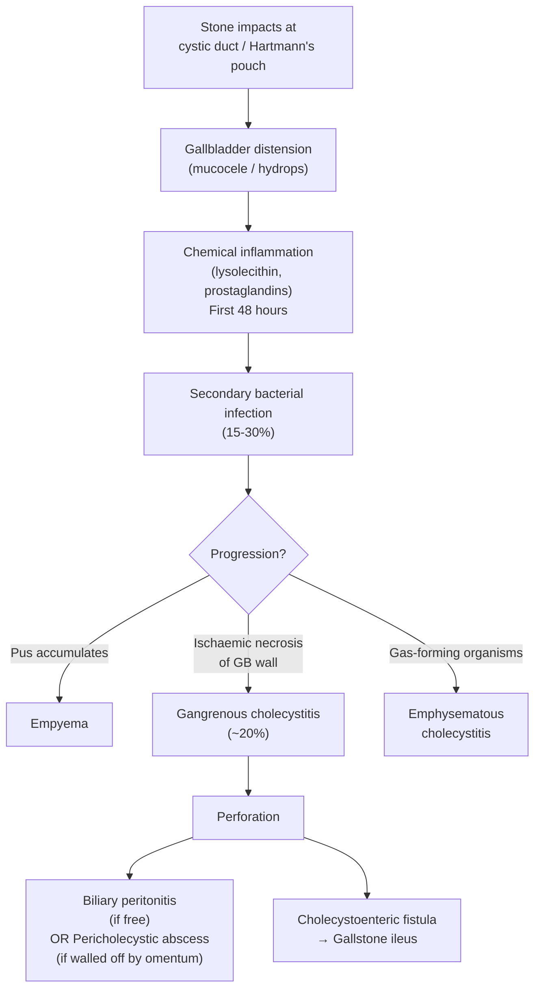

## Complications of RUQ Pain Conditions

Complications are where the clinical stakes are highest. Every condition that causes RUQ pain can progress, and understanding *why* each complication develops — the pathophysiological chain from the primary insult to the downstream disaster — is what separates safe clinical practice from pattern-matching. Let's work through each major condition systematically.

---

### 1. Complications of Gallstone Disease — Overview

Gallstones are the most common cause of RUQ pain, and their complications form a branching tree depending on *where* the stone sits and *how long* it has been there.

***Complications of gallstone disease*** [1]:
- ***Mucocele of gallbladder***
- ***Empyema of gallbladder***
- ***Rupture of gallbladder***
- ***Acute cholangitis***
- ***Acute pancreatitis***
- ***Cholecystoduodenal fistula***
- ***Liver abscess***

These can be organised by the structure involved [2]:

| Structure Involved | Complications |
|---|---|
| ***Gallbladder*** | Acute cholecystitis, chronic cholecystitis, mucocele/hydrops, empyema, gangrenous cholecystitis, perforation, emphysematous cholecystitis, gallbladder cancer, Mirizzi syndrome |
| ***Biliary tree*** | Choledocholithiasis, acute cholangitis, biliary stricture |
| ***Pancreas*** | Acute biliary pancreatitis |
| ***Bowel*** | ***Cholecystoenteric fistula (Bouveret's syndrome, gallstone ileus)*** [2] |

---

### 2. Complications of Acute Cholecystitis

Once a gallstone impacts in the cystic duct and cholecystitis develops, the disease follows a predictable escalation pathway if untreated. Understanding this sequence is essential.

#### A. ***Mucocele (Hydrops) of Gallbladder*** [1][4]

- **What happens**: Prolonged impaction of a stone in the cystic duct → bile cannot enter or exit the gallbladder → existing bile is absorbed → gallbladder fills with clear mucoid secretion ("white bile")
- **Why it matters**: The gallbladder becomes massively distended, tense, and palpable. It can compress adjacent structures (e.g. common hepatic duct → Mirizzi syndrome) or predispose to perforation.
- **Clinical features**: Palpable, non-tender (or mildly tender) RUQ mass; may be asymptomatic or present with chronic discomfort

#### B. ***Gallbladder Empyema*** [2]

- **What happens**: The obstructed, inflamed gallbladder becomes infected → ***pus fills the gallbladder lumen***
- **Why it happens**: Stagnant bile + compromised mucosal barrier → secondary bacterial infection → purulent collection that cannot drain (cystic duct is blocked)
- **Clinical features**: ***Tender RUQ mass + septic-looking patient*** (high fever, rigors, tachycardia, raised WCC) [2]
- **Management**: Urgent intervention — ***emergency cholecystectomy or percutaneous cholecystostomy*** if patient too sick for surgery
- **Risk**: If untreated → perforation → biliary peritonitis or septic shock

#### C. ***Gangrenous Cholecystitis (~20% of acute cholecystitis)*** [2]

- **What happens**: ***Ischaemic necrosis of the gallbladder wall***
- **Why it happens**: Gallbladder distension → wall tension exceeds perfusion pressure → compromised arterial inflow (cystic artery is an end-artery with limited collaterals) → transmural necrosis
- **Clinical features**: Disproportionately severe pain relative to examination findings; high fever; toxaemia. The patient looks sicker than you'd expect. Paradoxically, Murphy's sign may be **absent** because the gallbladder wall is necrotic and denervated.
- **Risk**: Precursor to perforation

<Callout title="Gangrenous Cholecystitis — The Silent Escalation" type="error">
Gangrenous cholecystitis can present deceptively. The patient may have ***less localised tenderness*** (because the necrotic wall has lost its nerve supply) but is ***systemically much sicker***. If a patient with cholecystitis has worsening sepsis but seemingly "improving" abdominal signs, suspect gangrene. ***This is an indication for emergency cholecystectomy.*** [2]
</Callout>

#### D. ***Gallbladder Perforation*** [2]

- **What happens**: Necrotic gallbladder wall breaks down → contents leak
- **Three types of perforation**:
  1. **Free perforation** into peritoneal cavity → ***generalised biliary peritonitis*** (rare, because the omentum usually wraps around the inflamed gallbladder)
  2. **Localised perforation** → ***pericholecystic abscess*** (walled off by omentum and adjacent viscera)
  3. **Perforation into adjacent viscus** → ***cholecystoenteric fistula*** (usually into duodenum)
- **Clinical features**: Sudden worsening of pain → generalised abdominal tenderness → peritoneal signs (guarding, rigidity, rebound tenderness)
- **Management**: Emergency surgery (cholecystectomy + peritoneal lavage)

#### E. ***Emphysematous Cholecystitis*** [2]

- **What happens**: ***Secondary bacterial infection of the gallbladder wall with gas-forming organisms*** (classically ***Clostridium welchii/perfringens***, but also E. coli, Klebsiella)
- **Why certain patients**: ***More common in diabetics*** (microangiopathy → gallbladder ischaemia predisposes to anaerobic infection) and elderly males
- **Clinical features**: ***Insidious onset, abdominal crepitus*** (gas in the gallbladder wall palpable as crepitation) [2]
- **Imaging**: CT shows ***gas within the gallbladder wall*** (intramural gas) — pathognomonic
- **Management**: ***Emergency cholecystectomy*** — this is a surgical emergency with high mortality (~15–25%)

#### F. ***Cholecystoenteric Fistula and Gallstone Ileus*** [2]

- **What happens**: Chronic inflammation erodes through the gallbladder wall into an adjacent hollow viscus (usually the duodenum → cholecystoduodenal fistula). A ***large gallstone (> 2.5 cm) passes through the fistula*** into the bowel lumen → ***impacts at the narrowest point of the small bowel (usually the ileocaecal valve)*** → mechanical small bowel obstruction
- **Why the ileocaecal valve?** It is the narrowest fixed point in the small bowel. Stones large enough to cause ileus are typically > 2.5 cm.
- **Bouveret's syndrome**: Variant where the gallstone impacts in the ***duodenum*** (causing gastric outlet obstruction) rather than distally — rare but important to recognise
- **Clinical features**: Symptoms of small bowel obstruction — colicky abdominal pain, vomiting, abdominal distension, absolute constipation
- ***Rigler's triad on AXR/CT*** [6]: 
  1. ***Pneumobilia*** (air in the biliary tree — entered through the fistula)
  2. ***Small bowel obstruction*** (dilated loops with air-fluid levels)
  3. ***Ectopic gallstone*** (visible in the bowel, usually at the ileocaecal valve)
- **Management**: Surgery — enterotomy and stone extraction (enterolithotomy); cholecystectomy and fistula repair may be done at the same time or as a staged procedure depending on the patient's fitness

---

### 3. Complications of Choledocholithiasis

CBD stones can cause downstream complications affecting the biliary tree and pancreas:

| Complication | Mechanism | Clinical Features |
|---|---|---|
| ***Acute cholangitis*** | Obstruction + bacterial contamination → ascending infection → cholangiovenous reflux → bacteraemia/sepsis | Charcot's triad → Reynolds' pentad if severe [4] |
| ***Gallstone pancreatitis*** | Stone impacts at the ampulla of Vater → obstructs the pancreatic duct → premature trypsin activation within acinar cells → autodigestion [4] | Severe epigastric pain radiating to back, ↑ amylase/lipase ≥ 3× ULN |
| **Obstructive jaundice** | Stone blocks the CBD → conjugated bilirubin cannot be excreted → regurgitates into blood | Progressive jaundice, dark urine, pale stools, pruritus |
| **Secondary biliary cirrhosis** | Chronic/recurrent biliary obstruction → chronic cholestasis → periductal fibrosis → biliary cirrhosis | Develops over months–years of untreated obstruction; ultimately leads to portal hypertension and liver failure |

---

### 4. Complications of Acute Cholangitis

Cholangitis itself is a complication of biliary obstruction, but it can further escalate:

| Complication | Mechanism |
|---|---|
| ***Septic shock (suppurative cholangitis)*** | ***Cholangiovenous reflux*** — at high biliary pressures, bacteria and endotoxins are forced through the bile duct epithelium into the hepatic venous sinusoids → bloodstream → systemic sepsis → multi-organ failure. This is what Reynolds' pentad represents. [4] |
| ***Liver abscess*** | Ascending infection from the bile ducts into the liver parenchyma → focal collection of pus. ***Direct spread*** from the biliary tree is one of the major routes of pyogenic liver abscess formation. [3] |
| **Multi-organ failure** | Sepsis → SIRS → cardiovascular collapse, ARDS, AKI, DIC |
| **Biliary stricture** | Recurrent cholangitis → chronic inflammation → cicatricial stricturing of the bile duct → further predisposes to obstruction and recurrent cholangitis (vicious cycle) |

---

### 5. Complications of Recurrent Pyogenic Cholangitis (RPC) [4]

RPC has a unique set of complications because of its chronic, recurrent nature and intrahepatic involvement:

| Complication | Mechanism |
|---|---|
| ***Biliary sepsis*** | Recurrent bacterial infection of obstructed bile ducts — the defining feature of RPC |
| ***Pancreatitis*** | ***Passage of biliary stones through the ampulla*** — same mechanism as gallstone pancreatitis [4] |
| ***Rupture*** | ***Obstructed, pus-filled bile ducts rupture into the peritoneum*** → biliary peritonitis [4] |
| ***Liver abscess*** | Ascending intrahepatic infection → focal abscess formation; can also occur at distant sites (lungs, brain via haematogenous spread) [4] |
| ***Fistula formation*** | ***Choledocho-duodenal fistula*** — chronic inflammation erodes into the GI tract or abdominal wall [4] |
| ***Secondary biliary cirrhosis*** | Chronic biliary obstruction and recurrent inflammation → progressive fibrosis → portal hypertension → liver failure [4] |
| ***Cholangiocarcinoma*** | ***Chronic inflammation of the biliary epithelium → dysplasia → malignant transformation***. This is one of the most feared long-term complications and is the reason patients with RPC require surveillance and consideration for hepatobiliary resection. [4] |
| ***Portal vein thrombosis*** | Chronic peribiliary inflammation extends to involve adjacent portal vein branches [4] |

---

### 6. Complications of Acute Pancreatitis

Pancreatitis complications are divided into **local** and **systemic**, and further by timing (**early** vs. **late**).

#### A. Early Complications (within first 1–2 weeks)

| Complication | Mechanism |
|---|---|
| ***Organ failure (most common cause of early death)*** | NF-κB–dependent inflammatory cascade → massive cytokine release (TNF-α, IL-1, IL-6) → SIRS → multi-organ dysfunction: **ARDS** (pulmonary capillary leak), **AKI** (hypovolaemia + cytokine-mediated tubular injury), **cardiovascular collapse** (vasodilatory shock) |
| ***Peripancreatic fluid collections*** | Inflammatory exudate from the inflamed pancreas → fluid accumulates in the lesser sac and retroperitoneum |
| ***Sterile pancreatic necrosis*** | Autodigestion of pancreatic and peripancreatic tissue by prematurely activated enzymes → areas of non-enhancing (dead) tissue on contrast CT |

#### B. Late Complications (after 2–4 weeks)

| Complication | Mechanism | Clinical Features |
|---|---|---|
| ***Infected pancreatic necrosis*** | Bacterial translocation from the gut (due to ileus and mucosal barrier breakdown) colonises necrotic tissue → infected necrosis | Persistent or new-onset fever after initial improvement; CT shows gas bubbles within necrotic tissue; confirmed by FNA. This is one of the main indications for intervention (necrosectomy). |
| ***Pancreatic pseudocyst*** | Encapsulated collection of pancreatic juice (amylase-rich fluid) that lacks an epithelial lining (hence "pseudo"); develops when a disrupted pancreatic duct leaks into an inflammatory capsule | Palpable epigastric mass, persistent pain, prolonged elevation of amylase; can compress stomach (early satiety), CBD (jaundice), or vessels |
| ***Walled-off necrosis (WON)*** | Mature, encapsulated collection containing necrotic pancreatic/peripancreatic tissue; develops ≥ 4 weeks after onset | Distinguished from pseudocyst by containing solid necrotic debris (not just fluid) |
| ***Pancreatic duct disruption*** | Necrosis disrupts the main pancreatic duct → pancreatic juice leaks freely | Pancreatic ascites (if leaks into peritoneal cavity) or pleural effusion (if tracks superiorly) |
| ***Pseudoaneurysm*** | Pancreatic enzymes erode into peripancreatic arteries (splenic, gastroduodenal, pancreaticoduodenal) → weakened arterial wall → pseudoaneurysm formation | Risk of ***catastrophic haemorrhage*** — can bleed into the pancreatic duct (haemosuccus pancreaticus), peritoneum, or GI tract. ***Severe and fatal haemorrhage can occur following endoscopic drainage in patients with an unsuspected pseudoaneurysm*** [4] |
| ***Splenic complications*** | Splenic vein thrombosis (due to adjacent inflammation) → left-sided portal hypertension → gastric varices | GI bleeding from gastric varices |

#### C. Long-Term Complications

| Complication | Mechanism |
|---|---|
| ***Exocrine insufficiency*** | Loss of functional pancreatic acinar tissue → malabsorption and steatorrhoea (fatty, foul-smelling stools) [4] |
| ***Endocrine insufficiency*** | Loss of islet cells → ***diabetes mellitus*** (pancreatogenic / Type 3c DM) [4] |
| ***Gastric stasis*** | Especially in patients undergoing pylorus-preserving pancreaticoduodenectomy (Whipple's) [4] |

---

### 7. Complications of Liver Abscess [3][6]

| Complication | Mechanism |
|---|---|
| ***Abscess rupture (3.8%)*** | Large abscess (> 6 cm) or in cirrhotic liver → wall breaks down → rupture into peritoneal cavity (subphrenic abscess, peritonitis), viscera, IVC, or kidney [6] |
| ***Pleuropulmonary complications (15–20%)*** | Right lobe abscess abutting the diaphragm → diaphragmatic irritation/erosion → pleurisy, pleural effusion, empyema, or even ***bronchohepatic fistula*** (abscess erodes through diaphragm into the lung → patient coughs up pus/bile) [6] |
| ***Local compression*** | Large abscess compresses adjacent structures → Budd-Chiari syndrome (IVC/hepatic vein compression), bile duct compression (jaundice) [6] |
| ***Metastatic abscess*** | Haematogenous seeding → distant abscesses (brain, lung) — especially in Klebsiella pneumoniae liver abscess, which has a well-described propensity for metastatic infection (endophthalmitis, meningitis) in diabetic patients |
| **Sepsis and multi-organ failure** | If abscess is not drained → progressive sepsis |

---

### 8. Complications of Cholecystectomy (Surgical Complications) [2]

Since laparoscopic cholecystectomy is the definitive treatment for most gallstone disease, its complications are frequently tested.

#### A. ***Immediate (< 24 hours)*** [2]

| Complication | Details |
|---|---|
| ***Conversion to open surgery*** | ***5% in elective, 25% in emergency*** [2] — this is ***NOT*** a failure; it is a safety decision when the critical view cannot be achieved |
| **GA risks** | Aspiration, cardiovascular complications |
| **Bleeding** | From liver bed (middle hepatic vein is close to GB fossa), cystic artery, trocar sites |
| ***Damage to neighbouring structures*** | ***Bile leakage (biliary tree injury), bleeding (cystic artery), pneumoperitoneum from injury to duodenum, transverse colon, or hepatic flexure*** [2] |

#### B. ***Early (1 day – 1 month)*** [2]

| Complication | Details |
|---|---|
| ***Biliary leakage (0.5%)*** | ***From cystic duct stump or duct of Luschka*** (small accessory bile ducts draining directly from the liver bed into the gallbladder fossa). Usually presents ***post-op day 2–10*** with ***fever, RUQ pain, deranged LFTs***. Investigated with USG/CT → HIDA scan/MRCP. Managed by ***ERCP with stenting (minor) or laparotomy + Roux-en-Y hepaticojejunostomy (major)*** [2] |
| ***Post-op jaundice*** | Due to dropped or missed CBD stones — presents with cholestatic LFTs and jaundice. Investigate with MRCP/ERCP. |
| **Post-op cholangitis** | Infected retained stone |
| ***Post-op diarrhoea*** | ***Initial uncoordinated excessive bile salt excretion*** (without gallbladder storage, bile flows continuously into the duodenum) ***+ fat malabsorption*** [2]. Usually self-limiting. |
| **Wound infection** | Trocar site infection |

#### C. ***Late (> 1 month)*** [2]

| Complication | Details |
|---|---|
| ***Bile duct stricture*** | Ischaemic or mechanical injury to the bile duct during surgery → cicatricial stricture → recurrent jaundice/cholangitis. Managed by reconstruction ± hepaticojejunostomy [2] |
| **Subphrenic abscess** | Infected collection in the subphrenic space — managed by drainage + antibiotics |
| ***Post-cholecystectomy syndrome*** | ***Persistent symptoms (biliary-type pain, dyspepsia, diarrhoea) after cholecystectomy*** [2]. Causes include retained CBD stone, bile duct injury, sphincter of Oddi dysfunction, or non-biliary causes that were misattributed to gallstones. |
| ***Post-cholecystectomy choledocholithiasis*** | ***Bile stasis due to increased CBD calibre*** (loss of gallbladder storage function → CBD dilates to compensate → stasis → stone formation) [2] |

<Callout title="Bile Duct Injury — The Most Feared Complication of LC">
***Bile duct injury*** during laparoscopic cholecystectomy (incidence ~0.3–0.6%) is the most feared complication. It typically occurs when the CBD is mistaken for the cystic duct (especially when Calot's triangle is obscured by inflammation or aberrant anatomy). The consequences can be devastating — biliary stricture, recurrent cholangitis, secondary biliary cirrhosis, and need for complex reconstructive surgery. This is why ***achieving the critical view of safety is paramount***. [2]
</Callout>

---

### 9. Complications of ERCP [4]

ERCP is both a diagnostic and therapeutic tool, but it carries significant procedural risks:

| Complication | Incidence | Mechanism |
|---|---|---|
| ***Post-ERCP pancreatitis*** | ***2–10% (MOST frequent)*** [4] | ***Manipulation of the pancreatic orifice/duct*** → traumatic oedema of the papilla → transient obstruction of pancreatic duct outflow → premature enzyme activation. Minimised by pancreatic duct stenting and rectal NSAIDs (indomethacin). [4] |
| ***Cholangitis*** | ~0.6% | ***Manipulation of an obstructed biliary system*** introduces bacteria or fails to achieve complete drainage [4] |
| ***Bleeding*** | 1–2% | ***Occurs after sphincterotomy*** — the cut traverses the sphincter muscle and surrounding vessels. Increased risk in coagulopathy and thrombocytopenia. [4] |
| ***Perforation*** | < 1% | Perforation of oesophagus, stomach, duodenum, or at the sphincterotomy site (retroperitoneal perforation). Increased risk with stenotic segments and previous gastric resection. [4] |
| ***Papillary stenosis*** | Late | ***Long-term fibrotic scarring of the ampulla of Vater*** following sphincterotomy → recurrent biliary obstruction [4] |
| **Stent occlusion/migration** | Late | Biofilm formation and sludge → blocked stent; mechanical dislodgement → migrated stent [4] |

---

### 10. Complications of PTBD [10]

| Timing | Complication | Mechanism |
|---|---|---|
| ***Acute (5–10%)*** | ***Bleeding into biliary system (most common)*** | Needle traverses liver parenchyma → puncture of hepatic artery or portal vein branches |
| | ***Septic shock*** | Infected bile spills during manipulation |
| | ***Pancreatitis (rare)*** | CBD damage during catheter manipulation |
| | **Puncture of other organs** | Lung (pneumothorax), kidney, colon |
| ***Delayed (45–50%)*** | ***Biliary sepsis (cholangitis)*** | Catheter serves as foreign body → nidus for infection |
| | ***Catheter migration*** | Mechanical dislodgement |
| | ***Bile leak*** | Around catheter entry site → peritoneal irritation |
| | ***Metastatic seeding*** | Tumour cells track along the catheter tract (in malignant obstruction) |
| | **Skin infection** | At catheter entry site |

---

### 11. Post-Hepatectomy Complications [2]

For patients undergoing liver resection (e.g. for RPC, HCC, cholangiocarcinoma):

| Complication | Definition / Details |
|---|---|
| ***Bile leakage*** | ***Drain bilirubin concentration ≥ 3× serum bilirubin on or after post-op day 3*** [2] — leaking from the transected liver surface or biliary anastomosis |
| ***Post-hepatectomy liver failure*** | ***Day 5 bilirubin > 50 µmol/L AND INR > 1.7 ("50-50 rule")*** → high risk of mortality [2]. Occurs because the remaining liver is insufficient to support metabolic demands. |
| ***Ischaemic damage to liver remnant*** | ***Prolonged liver rotation during surgery → twisting of inflow and outflow pedicles*** → hepatic ischaemia [2] |
| **Haemorrhage** | From raw liver transection surface, hepatic vein injury |
| **Subphrenic abscess/collection** | Infected fluid collection below the diaphragm |

---

### 12. Complications of Pancreatic Surgery (Whipple's Procedure) [4]

| Timing | Complication | Mechanism |
|---|---|---|
| **Early** | ***Delayed gastric emptying (common)*** | Disruption of vagal innervation and gastric/duodenal motility after reconstruction |
| | ***Pancreatic fistula (common)*** | Leak from the pancreaticojejunostomy anastomosis — surgeons traditionally place drains around this anastomosis for this reason [4] |
| | **Pancreatic anastomotic leak** | Technical failure of the pancreatic-enteric anastomosis |
| | **Biliary anastomotic breakdown** | Leak from the hepaticojejunostomy |
| | **Intra-abdominal bleeding / abscess** | From the extensive dissection and multiple anastomoses |
| **Late** | ***Exocrine insufficiency*** → malabsorption, steatorrhoea | Loss of pancreatic parenchyma → ↓ lipase, amylase, protease secretion |
| | ***Endocrine insufficiency*** → diabetes mellitus | Loss of islet cells → ↓ insulin production |
| | ***Gastric stasis*** | Especially in pylorus-preserving Whipple's [4] |

---

<Callout title="High Yield Summary — Complications of RUQ Pain Conditions">

1. ***Acute cholecystitis complications follow a predictable escalation***: mucocele → empyema → gangrene (20%) → perforation → biliary peritonitis.

2. ***Emphysematous cholecystitis***: gas-forming organisms in GB wall; more common in diabetics; insidious onset + abdominal crepitus; ***surgical emergency***.

3. ***Cholecystoenteric fistula → gallstone ileus***: large stone erodes into duodenum → impacts at ileocaecal valve → SBO. ***Rigler's triad***: pneumobilia + SBO + ectopic stone.

4. ***Cholangitis → suppurative cholangitis***: cholangiovenous reflux at high biliary pressures → bacteria enter bloodstream → septic shock (Reynolds' pentad).

5. ***RPC long-term complications***: secondary biliary cirrhosis, ***cholangiocarcinoma*** (most feared), liver abscess, portal vein thrombosis.

6. ***Acute pancreatitis***: Early death from organ failure (SIRS/MODS); Late complications: infected necrosis, pseudocyst, pseudoaneurysm (risk of fatal haemorrhage), exocrine/endocrine insufficiency.

7. ***Post-cholecystectomy***: Bile duct injury is the most feared complication (~0.3-0.6%); biliary leakage from cystic duct stump or duct of Luschka (0.5%); post-cholecystectomy syndrome (persistent symptoms).

8. ***Post-ERCP pancreatitis*** is the most common ERCP complication (2-10%); minimised by pancreatic duct stent + rectal indomethacin.

9. ***PTBD***: bleeding is the most common acute complication; delayed biliary sepsis and catheter migration are the most common late complications.

10. ***Post-hepatectomy liver failure***: 50-50 rule (Day 5 bilirubin > 50 AND INR > 1.7) predicts high mortality.

</Callout>

---

<ActiveRecallQuiz
  title="Active Recall - Complications of RUQ Pain Conditions"
  items={[
    {
      question: "Describe the pathophysiological sequence from stone impaction in the cystic duct to gallbladder perforation. What are the three types of perforation?",
      markscheme: "Stone impaction -> gallbladder distension (mucocele) -> chemical inflammation (lysolecithin, prostaglandins, first 48h) -> secondary bacterial infection (15-30%) -> empyema (pus fills GB) OR gangrenous cholecystitis (wall ischaemia from overdistension compressing cystic artery) -> perforation. Three types: 1) Free perforation into peritoneal cavity (generalised biliary peritonitis), 2) Localised perforation (pericholecystic abscess, walled off by omentum), 3) Perforation into adjacent viscus (cholecystoenteric fistula).",
    },
    {
      question: "What is Rigler's triad and what condition does it diagnose? Explain why pneumobilia occurs.",
      markscheme: "Rigler's triad: 1) Pneumobilia (air in the biliary tree), 2) Small bowel obstruction, 3) Ectopic gallstone (usually at ileocaecal valve). Diagnoses gallstone ileus. Pneumobilia occurs because the cholecystoenteric fistula creates a communication between the bowel lumen and the biliary tree, allowing air to enter the biliary system from the duodenum.",
    },
    {
      question: "What is cholangiovenous reflux and why does it make acute cholangitis a life-threatening emergency?",
      markscheme: "Cholangiovenous reflux occurs when biliary pressure rises due to obstruction. At high pressures, bacteria and endotoxins are forced through the disrupted bile duct epithelium into the hepatic venous sinusoids, entering the systemic bloodstream. This causes overwhelming bacteraemia and endotoxaemia leading to septic shock and multi-organ failure (Reynolds' pentad). This is why emergency biliary decompression is critical.",
    },
    {
      question: "Name three long-term complications of RPC and explain why cholangiocarcinoma develops in this condition.",
      markscheme: "Long-term complications: 1) Secondary biliary cirrhosis, 2) Cholangiocarcinoma, 3) Portal vein thrombosis. Also acceptable: liver abscess, fistula formation. Cholangiocarcinoma develops because chronic recurrent inflammation of the biliary epithelium causes a cycle of epithelial injury and regeneration, leading to dysplasia and eventual malignant transformation of the bile duct lining cells.",
    },
    {
      question: "A patient develops fever, RUQ pain, and deranged LFTs on post-operative day 5 after laparoscopic cholecystectomy. What are the two most likely diagnoses and how would you investigate?",
      markscheme: "1) Biliary leakage (from cystic duct stump or duct of Luschka) - most likely given timing (post-op day 2-10). 2) Post-op choledocholithiasis (dropped or missed CBD stones causing cholangitis). Investigations: USG/CT abdomen (look for fluid collection, biloma), then HIDA scan or MRCP to confirm bile leak. ERCP for both diagnosis and treatment (stent placement for leak, stone extraction for retained stone).",
    },
    {
      question: "What is the 50-50 rule in post-hepatectomy liver failure?",
      markscheme: "The 50-50 rule states that if on post-operative day 5 the serum bilirubin is greater than 50 micromol/L AND the INR is greater than 1.7, the patient is at high risk of mortality from post-hepatectomy liver failure. This occurs because the remaining liver remnant has insufficient functional capacity to meet the body's metabolic demands.",
    },
  ]}
/>

---

## References

[1] Lecture slides: GC 200. RUQ pain, jaundice and fever Cholecytitis and cholangitis Imaging of GI system.pdf
[2] Senior notes: maxim.md (Sections: Gallstone complications, Acute cholecystitis complications, Cholecystectomy specific complications, Choledocholithiasis, RPC complications, Post-hepatectomy care)
[3] Senior notes: felixlai.md (Section: Liver abscess)
[4] Senior notes: felixlai.md (Sections: Cholecystitis pathogenesis, Acute cholangitis, RPC complications, Acute pancreatitis complications, Whipple's complications, ERCP complications, Pseudoaneurysm haemorrhage, Gallstone pancreatitis prevention)
[6] Senior notes: Ryan Ho GI.pdf (Sections: Liver abscess complications p237, Gallstone ileus Rigler's triad p136)
[10] Senior notes: Ryan Ho Diagnostic Radiology.pdf (Section: PTBD complications p82)
