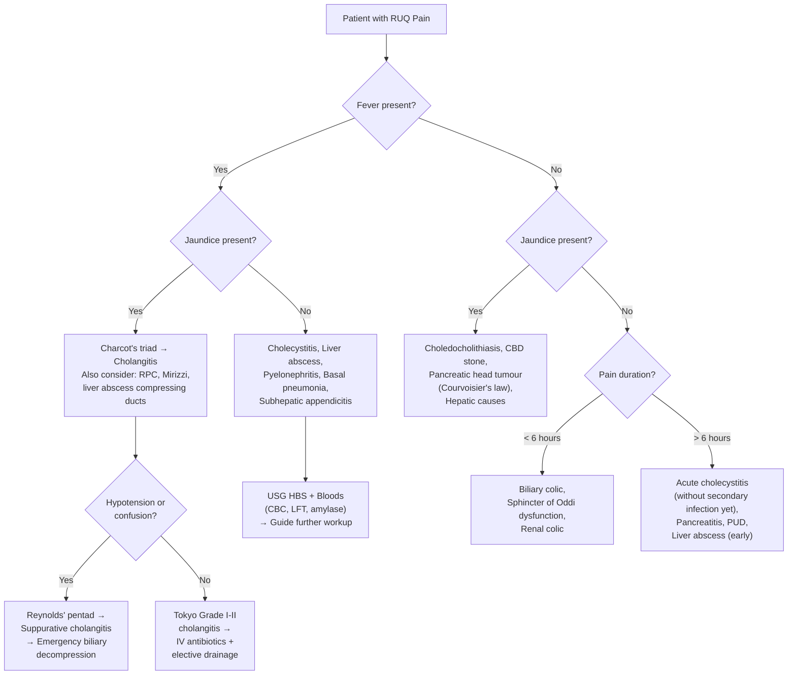

## Differential Diagnosis of RUQ Pain

The differential diagnosis of RUQ pain is one of the most commonly tested clinical reasoning exercises. The key to nailing it is to think **anatomically** — what organs live in the RUQ? — and then **pathophysiologically** — what can go wrong with each of them? Let's build this systematically.

### Organising Framework: Think Anatomically, Then Pathologically

When a patient presents with RUQ pain, you should mentally "scan" the structures in and near the RUQ:

1. **Biliary system** (gallbladder, cystic duct, CBD, intrahepatic ducts)
2. **Liver** (parenchyma, capsule, vasculature)
3. **Pancreas** (head — anatomically close to RUQ)
4. **Duodenum** (especially D1 and D2)
5. **Hepatic flexure of colon**
6. **Right kidney and adrenal**
7. **Right lung base / pleura / diaphragm** (referred pain)
8. **Gynaecological** (in females)
9. **Vascular** (aorta, hepatic/portal vasculature)
10. **Abdominal wall**

> Think of the differential as a series of concentric circles radiating outward from the gallbladder. Biliary is most common, but don't stop there.

---

### Systematic Differential Diagnosis — Condition by Condition

#### 1. Biliary Causes (Most Common) [1][2][4]

These are the bread-and-butter of RUQ pain. In the exam and on the ward, biliary disease should be at the top of your list.

| Condition | Key Distinguishing Features | Why It Causes RUQ Pain |
|---|---|---|
| ***Biliary colic*** | ***Intense, dull, constant ("false colic"); lasts ≥ 30 min, plateaus within 1 h, resolves < 6 h; NO fever; NO peritoneal signs; often after fatty meal*** [1][2] | Gallstone transiently impacts cystic duct/Hartmann's pouch → gallbladder contracts against fixed obstruction → visceral pain via coeliac plexus (T5–T9) |
| ***Acute cholecystitis*** | ***Pain > 4–6 h, fever, Murphy's sign positive; exacerbated by movement/breathing*** [1][2][4] | Prolonged impaction → chemical inflammation (lysolecithin) → parietal peritoneal irritation → well-localised somatic pain |
| ***Choledocholithiasis*** | ***More prolonged pain (> 6 h), ± jaundice (conjugated hyperbilirubinaemia), dark urine, pale stools*** [4] | Stone in CBD → biliary obstruction → duct distension → visceral pain; impaired bilirubin excretion → jaundice |
| ***Acute cholangitis*** | ***Charcot's triad: fever with rigors + RUQ pain + jaundice; Reynolds' pentad adds hypotension + altered mental status*** [1][4] | Obstruction + bacterial contamination → ascending infection → cholangiovenous reflux (bacteria enter bloodstream under high biliary pressure) → sepsis |
| ***Recurrent pyogenic cholangitis (RPC)*** | ***Recurrent Charcot's triad episodes; Southeast Asian/Hong Kong patient; intrahepatic stones on imaging*** [4] | De novo intrahepatic brown pigment stones → cycles of obstruction → stasis → infection → stricturing → more stones |
| ***Mirizzi syndrome*** | ***Fever + jaundice + RUQ pain mimicking choledocholithiasis; imaging shows stone in cystic duct/Hartmann's pouch compressing CHD*** [4] | Impacted cystic duct stone → extrinsic compression of common hepatic duct → obstructive jaundice; chronic inflammation → cholecystobiliary fistula |
| ***Sphincter of Oddi dysfunction*** | ***Biliary-type pain < 6 h, intermittent; normal labs and imaging; diagnosis of exclusion*** [4] | Functional spasm or stenosis of sphincter of Oddi → transient biliary/pancreatic duct hypertension → visceral pain |
| ***Gallbladder cancer*** | ***Late presentation; associated with gallstones (95%), porcelain gallbladder, polyps > 1 cm; weight loss*** [4] | Tumour invades gallbladder wall → capsular/peritoneal irritation; may obstruct cystic duct or invade liver |
| ***Cholangiocarcinoma*** | ***Painless jaundice (extrahepatic type); weight loss; pruritus; risk factors: PSC, RPC, choledochal cysts, Clonorchis sinensis*** [4] | Extrahepatic tumour obstructs bile duct → progressive jaundice; perineural invasion → pain; intrahepatic type may cause capsular distension |
| ***Choledochal cyst*** | ***RUQ mass + pain + jaundice; often diagnosed in childhood; risk of cholangiocarcinoma*** [2] | Congenital cystic dilatation of biliary system → may become infected or obstruct bile flow |

<Callout title="Differentiating Biliary Colic from Acute Cholecystitis" type="idea">
The single most important distinction to make in RUQ pain:
- **Biliary colic**: pain resolves within **< 6 hours**, **no fever**, **no peritoneal signs** — the stone dislodges and the gallbladder relaxes.
- **Acute cholecystitis**: pain persists **> 4–6 hours**, **fever present**, **Murphy's sign positive** — the stone stays impacted, chemical and then bacterial inflammation ensues.

If you remember one thing: ***the 6-hour rule*** separates colic from cholecystitis. [1][4]
</Callout>

#### 2. Hepatic Causes [1][3][6]

The liver itself has no pain fibres. All hepatic pain is due to **distension of Glisson's capsule** (the fibrous liver capsule that IS innervated by somatic sensory nerves). Anything that swells the liver — inflammation, congestion, abscess, tumour — stretches the capsule and causes a dull, constant RUQ ache.

| Condition | Key Distinguishing Features | Why It Causes RUQ Pain |
|---|---|---|
| ***Acute hepatitis*** | ***Tender hepatomegaly; jaundice; markedly elevated AST/ALT (typically > 10× ULN); viral prodrome or drug history*** [1] | Hepatocyte inflammation and swelling → liver enlargement → Glisson's capsule distension |
| ***Liver abscess (pyogenic)*** | ***High spiking fever (90%) with rigors; tender hepatomegaly; ± right pleural effusion; diabetic patient in Hong Kong → think Klebsiella pneumoniae*** [3] | Expanding abscess within parenchyma → capsular stretch; diaphragmatic irritation → referred right shoulder pain |
| ***Liver abscess (amoebic)*** | ***Similar to pyogenic but travel to endemic area; single right lobe abscess; anchovy sauce pus; serology for E. histolytica*** [3] | Same capsular distension mechanism; amoebae reach liver via portal vein from intestinal infection |
| ***HCC / liver metastases*** | ***Background chronic liver disease (HBV in HK), ↑AFP; constitutional symptoms; hepatomegaly with irregular edge*** [6] | Large tumour → capsular stretching; tumour rupture → acute haemoperitoneum |
| ***Budd-Chiari syndrome*** | ***RUQ pain + massive ascites + hepatomegaly + LL oedema; thrombotic risk factors (myeloproliferative, OCP, APS)*** [1] | Hepatic venous outflow obstruction → hepatic congestion → capsular distension |
| ***Portal vein thrombosis*** | ***Background cirrhosis; acute RUQ pain + fever + dyspepsia*** [1] | Acute portal congestion → hepatomegaly → capsular distension |
| ***Hepatic congestion (Right heart failure)*** | ***Raised JVP, peripheral oedema, hepatojugular reflux; tender hepatomegaly*** | Elevated right atrial pressure → back-pressure transmitted to hepatic veins → sinusoidal congestion → liver swelling → capsular stretch |

#### 3. Pancreatic Causes [4]

| Condition | Key Distinguishing Features | Why It Causes RUQ Pain |
|---|---|---|
| ***Acute pancreatitis*** | ***Epigastric pain (can be RUQ) radiating to back; relieved by sitting up/leaning forward; prominent N/V; ↑ amylase/lipase > 3× ULN; history of gallstones or alcohol*** [4] | Pancreas is retroperitoneal → inflammation radiates anteriorly to epigastrium/RUQ and posteriorly to back; leaning forward moves inflamed pancreas away from retroperitoneal structures |
| **Pancreatic head tumour** | Painless progressive jaundice; palpable gallbladder (Courvoisier's law); weight loss; new-onset diabetes | Tumour at pancreatic head compresses CBD → obstructive jaundice; perineural invasion → deep boring pain |

#### 4. Gastrointestinal Causes [1][6]

| Condition | Key Distinguishing Features | Why It Causes RUQ Pain |
|---|---|---|
| ***Peptic ulcer disease (duodenal ulcer)*** | ***Upper abdominal burning pain related to eating; DU pain ↓ after eating, recurs ~2 h later; NSAID/H. pylori history; may present with UGIB*** [1][6] | Acid erosion of duodenal mucosa (D1 is in the RUQ) → visceral nociceptor stimulation; posterior DU can erode into the pancreas → back pain |
| **Perforated duodenal ulcer** | Sudden severe epigastric pain rapidly generalising; board-like rigidity; ↓ liver dullness (pneumoperitoneum); history of NSAIDs | Full-thickness erosion → peritoneal contamination with acid and then bacteria → chemical then bacterial peritonitis |
| ***Hepatic flexure pathology*** | ***Colorectal carcinoma, diverticulitis, colitis at hepatic flexure; altered bowel habit, PR bleeding*** [1] | Distension or inflammation of colon at hepatic flexure → visceral pain referred to RUQ |
| **Subhepatic/high appendicitis** | Fever, RUQ tenderness (mimics cholecystitis); younger patient; progressive course typical of appendicitis | Appendix in retrocaecal or subhepatic position → inflamed appendix sits high in RUQ |
| ***Gastric outlet obstruction*** | ***Epigastric pain; non-bilious projectile vomiting of undigested food; succussion splash; malignant until proven otherwise*** [2] | Mechanical obstruction at pylorus/duodenum → gastric distension → visceral pain |

#### 5. Renal / Urological Causes [1][7]

| Condition | Key Distinguishing Features | Why It Causes RUQ Pain |
|---|---|---|
| ***Right renal colic*** | ***Severe, colicky flank-to-groin pain; haematuria; restlessness (patient cannot lie still — unlike peritonitis)*** [7] | Ureteric stone → ureteric spasm and distension → true colic (peristaltic smooth muscle); upper ureteric stones may refer pain to RUQ |
| ***Right pyelonephritis*** | ***Classical triad: loin pain + tenderness + fever; dysuria, frequency; pyuria; costovertebral angle tenderness (Murphy's kidney punch)*** [7] | Renal parenchymal infection → capsular distension + pelvicalyceal inflammation |
| **Renal cell carcinoma** | Traditional triad: flank pain + painless haematuria + palpable flank mass (rare); constitutional symptoms; paraneoplastic features | Tumour expanding within kidney → capsular distension |

#### 6. Thoracic Causes (Don't Forget!) [1][6][8]

These are the classic "catches" in exams — extra-abdominal pathology causing RUQ pain via diaphragmatic irritation or referred pain.

| Condition | Key Distinguishing Features | Why It Causes RUQ Pain |
|---|---|---|
| ***Right basal pneumonia*** | ***Cough, fever, pleuritic pain, crackles on auscultation, CXR infiltrate in right lower zone*** [1][6] | Infection of right lower lobe → inflammation of visceral and parietal pleura overlying diaphragm → phrenic nerve (C3–C5) irritation → referred to RUQ/right shoulder |
| ***Pleural effusion*** | Dyspnoea, dullness to percussion, ↓ breath sounds at right base | Pleural fluid irritates diaphragmatic pleura → same phrenic nerve mechanism |
| ***Pulmonary embolism*** | Sudden pleuritic chest pain + dyspnoea ± haemoptysis; DVT risk factors; tachycardia | Right-sided pulmonary infarction → pleuritic inflammation → referred diaphragmatic pain |
| ***Basal myocardial infarction (inferior MI)*** | ***Epigastric/RUQ discomfort (especially elderly, diabetics); diaphoresis; ECG changes (ST elevation in leads II, III, aVF)*** [6][8] | Inferior wall of the heart shares vagal afferent pathways with the upper abdomen → pain misinterpreted as GI; also diaphragmatic irritation |

<Callout title="Never Forget the ECG" type="error">
***An inferior MI can masquerade as RUQ pain***, especially in elderly and diabetic patients. **Always do a 12-lead ECG** in any patient presenting with acute upper abdominal pain, particularly if the abdominal examination is surprisingly benign. Missing an MI is catastrophic. [6][8]
</Callout>

#### 7. Gynaecological Causes [5]

| Condition | Key Distinguishing Features | Why It Causes RUQ Pain |
|---|---|---|
| ***Fitz-Hugh-Curtis syndrome*** | ***Young, sexually active woman; pleuritic RUQ pain ± radiation to right shoulder; vaginal discharge; concurrent PID features; "violin string" adhesions on liver surface*** [5] | Chlamydia trachomatis or Neisseria gonorrhoeae ascends from pelvis → perihepatitis (inflammation of liver capsule/peritoneum) → RUQ pain |

#### 8. Other / Rare Causes [1][6]

| Condition | Key Distinguishing Features | Why It Causes RUQ Pain |
|---|---|---|
| ***Herpes zoster*** | ***Unilateral dermatomal burning pain ± vesicular rash in T7–T11 distribution*** [6] | Reactivation of VZV in dorsal root ganglia → neuropathic pain along the intercostal/subcostal nerve dermatomes overlying the RUQ |
| **Abdominal wall pain** | Localised, superficial tenderness that worsens with tensing abdominal muscles (Carnett's sign positive) | Myofascial pain, nerve entrapment, or rectus sheath haematoma → somatic pain in the RUQ |
| **Right adrenal haemorrhage** | Anticoagulated patient or sepsis (Waterhouse-Friderichsen syndrome); acute flank/RUQ pain; adrenal insufficiency | Haemorrhage into adrenal gland → capsular distension and retroperitoneal irritation |
| **Subphrenic abscess** | Post-surgical or post-perforation; fever, RUQ pain, referred shoulder pain; ↓ breath sounds at right base | Collection of pus between liver dome and diaphragm → diaphragmatic irritation → phrenic nerve referral |

---

### Clinical Decision-Making Diagram

Here is a practical approach to narrowing the differential when a patient presents with RUQ pain:

> **How to read this diagram**: Start with the two most discriminating questions — is there fever? Is there jaundice? These two features alone stratify most biliary-hepatic RUQ pathology. Then refine with pain duration, lab results, and imaging.

---

### Key Differentiating Features — Summary Table

This table is designed for rapid revision. Each row highlights the **single most distinguishing feature** of each condition.

| Condition | **"If you see this, think this"** |
|---|---|
| ***Biliary colic*** | ***Constant pain < 6 h + no fever + no peritoneal signs*** |
| ***Acute cholecystitis*** | ***Pain > 6 h + fever + Murphy's sign*** |
| ***Choledocholithiasis*** | ***Jaundice + prolonged pain + cholestatic LFTs*** |
| ***Acute cholangitis*** | ***Charcot's triad (fever + pain + jaundice)*** |
| ***Suppurative cholangitis*** | ***Reynolds' pentad (add shock + confusion)*** |
| ***RPC*** | ***Recurrent cholangitis in SE Asian patient + intrahepatic stones*** |
| ***Mirizzi syndrome*** | ***Jaundice + stone in cystic duct/Hartmann's compressing CHD on imaging*** |
| ***Liver abscess*** | ***Spiking fever + tender hepatomegaly + diabetic (Klebsiella in HK)*** |
| ***Acute hepatitis*** | ***Tender hepatomegaly + massively ↑ AST/ALT + jaundice*** |
| ***HCC*** | ***Chronic liver disease background + irregular hepatomegaly + ↑ AFP*** |
| ***Budd-Chiari*** | ***RUQ pain + massive ascites + thrombotic risk factors*** |
| ***Acute pancreatitis*** | ***Epigastric/RUQ pain to back + ↑ amylase/lipase > 3×*** |
| ***Duodenal ulcer*** | ***Epigastric pain ↓ by eating + NSAID/H. pylori history*** |
| ***Perforated DU*** | ***Sudden severe pain + board-like rigidity + ↓ liver dullness*** |
| ***Right renal colic*** | ***Colicky loin-to-groin + haematuria + restless patient*** |
| ***Right pyelonephritis*** | ***Loin pain + fever + pyuria + CVA tenderness*** |
| ***Right basal pneumonia*** | ***Cough + fever + pleuritic pain + CXR infiltrate*** |
| ***Inferior MI*** | ***Elderly/diabetic + RUQ pain + ECG changes (II, III, aVF)*** |
| ***Fitz-Hugh-Curtis*** | ***Young sexually active woman + RUQ + PID features*** |
| ***Herpes zoster*** | ***Dermatomal burning pain ± vesicular rash*** |

---

### Important Principles for the Differential

**1. The "6-hour rule" for biliary pain** [4]
- Pain < 6 hours, no fever → biliary colic
- Pain > 6 hours, fever → cholecystitis
- This is because the stone either dislodges (colic resolves) or stays impacted long enough for chemical inflammation to set in (cholecystitis begins)

**2. Courvoisier's law — when the gallbladder is palpable** [4]
- ***"In painless jaundice, if the gallbladder is palpable, the cause is unlikely to be gallstones"***
- **Why?** Chronic gallstones → repeated cholecystitis → fibrosed, shrunken gallbladder that cannot distend. A palpable gallbladder therefore implies a *previously normal* gallbladder distended by *distal* obstruction (periampullary tumour)
- ***Exceptions***: double impaction (stone in cystic duct + CBD), Mirizzi syndrome, RPC [4]

**3. Always consider extra-abdominal causes** [6][8]
- Right basal pneumonia and inferior MI are the two most dangerous "mimics" of RUQ pain
- ***A CXR and ECG should be part of the initial workup for any acute RUQ pain presentation***

**4. Age and context matter**
- Young woman with RUQ pain → consider Fitz-Hugh-Curtis, ectopic pregnancy, ovarian pathology [5]
- Elderly diabetic with RUQ pain and fever → Klebsiella liver abscess in Hong Kong context [3]
- Patient with known chronic liver disease and new RUQ pain → HCC rupture until proven otherwise

**5. Referred pain patterns** [1]
- Right shoulder/scapula → diaphragmatic irritation (phrenic nerve C3–C5): cholecystitis, liver abscess, subphrenic abscess, basal pneumonia
- Back → retroperitoneal structure (pancreas, posterior DU, kidney, AAA)
- Loin to groin → ureteric colic

---

<Callout title="High Yield Summary — Differential Diagnosis of RUQ Pain">

1. **Biliary disease is the most common cause** — always consider biliary colic, cholecystitis, choledocholithiasis, and cholangitis first.
2. ***The 6-hour rule***: pain < 6 h without fever = biliary colic; pain > 6 h with fever = cholecystitis.
3. ***Charcot's triad*** (fever + pain + jaundice) = cholangitis. ***Reynolds' pentad*** adds shock + confusion = suppurative cholangitis needing emergency drainage.
4. ***Courvoisier's law***: painless jaundice + palpable gallbladder = periampullary tumour (NOT gallstones). Exceptions: double impaction, Mirizzi, RPC.
5. **Hepatic pain** = Glisson's capsule distension (liver itself has no nociceptors). Think hepatitis, abscess, HCC, Budd-Chiari, congestion.
6. ***In Hong Kong***: Klebsiella liver abscess in diabetics, RPC with intrahepatic pigment stones, HBV-related HCC.
7. ***Don't forget extra-abdominal causes***: right basal pneumonia, PE, inferior MI (especially in elderly/diabetics — **always do ECG and CXR**).
8. ***Fitz-Hugh-Curtis syndrome***: young sexually active woman with pleuritic RUQ pain + PID features.

</Callout>

---

<ActiveRecallQuiz
  title="Active Recall - Differential Diagnosis of RUQ Pain"
  items={[
    {
      question: "A 45-year-old woman presents with RUQ pain that started 2 hours ago after a fatty meal. She is afebrile with no peritoneal signs. What is the most likely diagnosis and what is the expected natural history of the pain?",
      markscheme: "Biliary colic. The pain is expected to plateau within 1 hour and resolve completely within 6 hours as the stone dislodges from the cystic duct. No fever and no peritoneal signs distinguish it from cholecystitis.",
    },
    {
      question: "List five non-biliary causes of RUQ pain that should be considered in the differential, and for each state one key distinguishing clinical feature.",
      markscheme: "1) Liver abscess — spiking fever with rigors and tender hepatomegaly. 2) Acute pancreatitis — pain radiating to back, relieved by leaning forward. 3) Duodenal ulcer — pain related to meals, NSAID history. 4) Right basal pneumonia — cough, pleuritic pain, CXR infiltrate. 5) Inferior MI — ECG changes in II, III, aVF, especially in elderly/diabetics. Other acceptable answers include pyelonephritis, renal colic, Fitz-Hugh-Curtis, Budd-Chiari, herpes zoster.",
    },
    {
      question: "A 70-year-old diabetic man in Hong Kong presents with high spiking fever, rigors, and tender hepatomegaly. What is the most likely diagnosis and most likely causative organism?",
      markscheme: "Pyogenic liver abscess. The most likely organism in this Hong Kong context is Klebsiella pneumoniae, which is strongly associated with diabetes mellitus in East Asian populations.",
    },
    {
      question: "Explain why right basal pneumonia can cause RUQ pain, including the neuroanatomical pathway.",
      markscheme: "Right lower lobe pneumonia causes inflammation of the visceral and parietal pleura overlying the diaphragm. The diaphragmatic peritoneum and pleura are innervated by the phrenic nerve (C3-C5). Irritation of these fibres is misinterpreted by the brain as pain from the C3-C5 dermatome, which overlies the shoulder tip and RUQ area. This is referred pain via shared spinal cord segments.",
    },
    {
      question: "A young sexually active woman presents with acute pleuritic RUQ pain and right shoulder pain. She has vaginal discharge and adnexal tenderness. What is the diagnosis, and what organisms are responsible?",
      markscheme: "Fitz-Hugh-Curtis syndrome (perihepatitis). Caused by ascending infection of Chlamydia trachomatis or Neisseria gonorrhoeae from the pelvis to the liver capsule, producing 'violin string' adhesions. It is secondary to pelvic inflammatory disease.",
    },
  ]}
/>

---

## References

[1] Lecture slides: GC 200. RUQ pain, jaundice and fever Cholecytitis and cholangitis Imaging of GI system.pdf
[2] Senior notes: maxim.md (Sections: Biliary colic, Acute cholecystitis, Choledochal cyst, Gastric outlet obstruction)
[3] Senior notes: felixlai.md (Section: Liver abscess)
[4] Senior notes: felixlai.md (Sections: Cholecystitis, Acute cholangitis, Choledocholithiasis, Recurrent pyogenic cholangitis, Mirizzi syndrome, Cholangiocarcinoma, Gallbladder cancer, Acute pancreatitis)
[5] Lecture slides: GC 195. Lower and diffuse abdominal pain RLQ problems; pelvic inflammatory disease; peritonitis and abdominal emergencies.pdf
[6] Senior notes: Ryan Ho GI.pdf (Section: RUQ Pain differential table, p209–210)
[7] Senior notes: Ryan Ho Urogenital.pdf (Sections: Acute pyelonephritis, Haematuria and Urolithiasis)
[8] Senior notes: Ryan Ho Cardiology.pdf (Section: Approach to acute chest pain, biliary as chest pain mimic)
