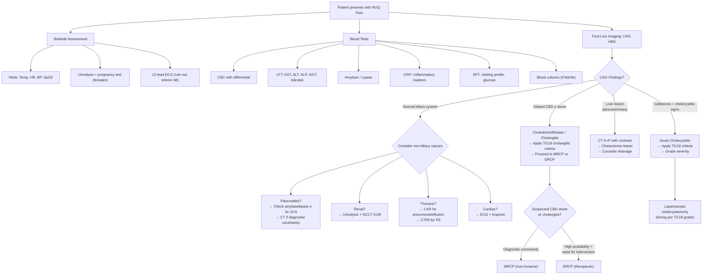

## Diagnostic Criteria, Diagnostic Algorithm, and Investigation Modalities for RUQ Pain

RUQ pain is a clinical syndrome, not a single diagnosis. The investigation strategy is therefore a **staged approach** — you start with bedside and blood tests to narrow the differential, then use targeted imaging to confirm (or exclude) specific diagnoses. Let's build this from first principles.

---

### 1. Formal Diagnostic Criteria for Major Causes of RUQ Pain

While "RUQ pain" itself has no single diagnostic criterion, the major conditions that present with RUQ pain each have well-defined criteria. Knowing these is essential for exams.

#### A. ***Tokyo Guidelines 2018/2013 (TG18/TG13) — Acute Cholecystitis*** [4][6]

The TG criteria are the internationally accepted standard. They combine **local signs**, **systemic signs**, and **imaging** into a structured diagnostic framework.

| Component | Criteria |
|---|---|
| ***A: Local signs of inflammation*** | ***Murphy's sign (Sens 50–65%, Spec 79–96%)***, ***RUQ mass/pain/tenderness*** |
| ***B: Systemic signs of inflammation*** | ***Fever, ↑ WBC, ↑ CRP (> 3 mg/dL)*** |
| ***C: Imaging findings*** | ***Findings characteristic of acute cholecystitis (see USG section below)*** |

**Interpretation** [4][6]:
- ***Suspected diagnosis*** = **one item from A + one item from B**
- ***Definite diagnosis*** = **one item from A + one item from B + C (imaging confirmation)**

> Why three components? Because clinical signs alone can be non-specific (Murphy's sign has only ~50–65% sensitivity), and imaging alone may show incidental findings. The combination increases both sensitivity (~91%) and specificity (~97%). [6]

<Callout title="TG18 Severity Grading — Don't Just Diagnose, Grade It" type="idea">
Once you diagnose acute cholecystitis, the TG18 system also grades severity — this directly determines management:
- **Grade I (Mild)**: Acute cholecystitis in a healthy patient with no organ dysfunction → early laparoscopic cholecystectomy
- **Grade II (Moderate)**: Any of: WBC > 18,000, palpable RUQ mass, duration > 72 h, marked local inflammation (gangrenous, emphysematous, pericholecystic abscess) → early LC if suitable, otherwise percutaneous cholecystostomy
- **Grade III (Severe)**: With organ dysfunction (cardiovascular, neurological, respiratory, renal, hepatic, haematological) → urgent drainage + ICU care
</Callout>

#### B. ***Tokyo Guidelines 2018/2013 — Acute Cholangitis*** [4]

| Component | Criteria |
|---|---|
| ***A: Systemic inflammation*** | ***Fever/chills OR laboratory evidence of inflammatory response (↑ WBC, ↑ CRP)*** |
| ***B: Cholestasis*** | ***Jaundice OR abnormal liver chemistries (↑ AST/ALT/ALP/GGT)*** |
| ***C: Imaging*** | ***Biliary dilatation on imaging OR evidence of aetiology (stone, stricture, stent)*** |

**Interpretation** [4]:
- ***Suspected diagnosis*** = **one item from A + one item from B**
- ***Definite diagnosis*** = suspected criteria met **+ BOTH items from C** (biliary dilatation + identified cause)

**Severity grading** [4]:
- ***Grade I (Mild)***: responds to initial medical treatment (antibiotics)
- ***Grade II (Moderate)***: does not respond to initial treatment; any 2 of: WBC > 12,000 or < 4,000, fever ≥ 39°C, age ≥ 75, bilirubin ≥ 85 µmol/L, albumin < 0.7 × LLN
- ***Grade III (Severe / Reynolds' pentad territory)***: organ dysfunction — cardiovascular (hypotension requiring vasopressors), neurological (altered consciousness), respiratory, renal, hepatic, haematological (DIC)

#### C. ***Revised Atlanta Classification 2012 — Acute Pancreatitis*** [4][9]

***Diagnosis requires ≥ 2 out of 3*** [4][9]:

1. ***Clinical***: Acute onset of persistent, severe, epigastric pain often radiating to the back
2. ***Biochemical***: ***Serum amylase or lipase ≥ 3× upper limit of normal (ULN)***
3. ***Imaging***: Characteristic findings of acute pancreatitis on USG, contrast-enhanced CT, or MRI

> Why 2 of 3? Because in most cases, the clinical picture + elevated enzymes are sufficient. Imaging is reserved for diagnostic uncertainty or to assess complications (CT ideally done ≥ 72 hours after onset to detect necrosis). [9]

<Callout title="Amylase vs Lipase" type="error">
Students often confuse these:
- ***Serum amylase***: rises within 6–12 h, normalises in 3–5 days. ***Less specific*** — can be elevated in PPU, ruptured AAA, DKA, macroamylasaemia, salivary disease. Cut-off for pancreatitis = ***≥ 3× ULN*** (NOT just any elevation). [9]
- ***Serum lipase***: rises within 4–8 h, normalises in 8–14 days (longer half-life). ***More specific for pancreatic origin***. ***Preferred test for delayed presentations (> 24 h)*** because amylase may have already normalised by then. [9]
- ***Neither enzyme level correlates with severity*** — a patient with amylase of 5000 is not necessarily sicker than one with 1000. [9]
</Callout>

#### D. Courvoisier's Law — A "Diagnostic Principle" Rather Than Formal Criteria [4]

***"In painless obstructive jaundice, if the gallbladder is palpable, the cause is unlikely to be gallstones"*** [4]

- **Why?** Chronic exposure to gallstones → repeated episodes of cholecystitis → gallbladder becomes **fibrosed and contracted** → cannot distend even when the CBD is obstructed. A palpable gallbladder therefore implies the gallbladder was **previously normal** and is now distended by a **new, distal obstruction** (i.e., ***periampullary tumour*** — pancreatic head cancer, ampullary cancer, distal cholangiocarcinoma). [4]
- ***Exceptions***: double impaction (stone in cystic duct + CBD simultaneously), Mirizzi syndrome, RPC [4]

---

### 2. Diagnostic Algorithm — Stepwise Approach

The approach to investigating RUQ pain is systematic: **bedside → bloods → first-line imaging (USG) → second-line imaging/intervention as needed**. [1][6]

<Callout title="The RUQ Pain Investigation Hierarchy">
Think of investigations as a pyramid:
1. **Base (always do)**: ***CBC/D, L/RFT, amylase/lipase*** — these are your screening bloods [1][6]
2. **First-line imaging**: ***USG HBS*** — this is THE first investigation for RUQ pain. It is quick, readily available, non-invasive, and highly sensitive for gallstones (95%) [1][6][9]
3. **Second-line**: ***MRCP*** (non-invasive ductal imaging, more sensitive than CT) or ***CT abdomen*** (for complications, alternative diagnoses, staging) [1][6]
4. **Therapeutic/diagnostic**: ***ERCP*** (when you need to intervene — stone extraction, stent, sphincterotomy) [1][6]
5. **Rarely needed**: ***HIDA scan*** (cholescintigraphy) — for equivocal USG in suspected cholecystitis [6]
</Callout>

---

### 3. Investigation Modalities — Detailed Breakdown

#### A. Bedside Investigations

| Test | What You're Looking For | Why |
|---|---|---|
| **Vital signs** | Fever (cholecystitis, cholangitis, abscess), tachycardia (sepsis, dehydration), hypotension (Reynolds' pentad) | Fever + hypotension = ***think septic cholangitis → emergency*** |
| **Urinalysis** | Pyuria/bacteriuria (pyelonephritis), haematuria (renal colic), bilirubinuria (obstructive jaundice) | ***Bilirubinuria*** = conjugated bilirubin in urine, confirms obstructive jaundice (only conjugated bilirubin is water-soluble enough to be filtered) [4] |
| **Urine pregnancy test** | Rule out ectopic pregnancy in women of childbearing age | Ruptured ectopic can cause acute abdominal pain; essential before CT (radiation) [5][9] |
| ***12-lead ECG*** | ***ST elevation in leads II, III, aVF (inferior MI)*** | ***Inferior MI can masquerade as RUQ/epigastric pain, especially in elderly and diabetics*** [8][9] |

#### B. Blood Tests

| Test | Key Findings | Interpretation and Pathophysiology |
|---|---|---|
| ***CBC with differential*** | ***Leukocytosis with left shift (↑ neutrophils/bands)*** | Bacterial infection — cholecystitis, cholangitis, abscess, appendicitis. ***Markedly ↑ WBC (> 18,000)*** suggests ***gangrenous/complicated cholecystitis*** or abscess. Normal WBC does NOT rule out surgical pathology. [4][6] |
| ***Liver function tests (LFT)*** | **Hepatocellular pattern**: ↑↑ AST/ALT (> 10× ULN) | Hepatitis (viral, drug-induced, ischaemic). Transaminases leak from damaged hepatocytes into the blood. |
| | ***Cholestatic pattern***: ***↑ ALP, ↑ GGT, ↑ conjugated bilirubin*** | ***Biliary obstruction*** (choledocholithiasis, cholangitis, Mirizzi, tumour). ALP is concentrated in the canalicular membrane of hepatocytes — obstruction causes back-pressure and ↑ ALP synthesis. GGT confirms hepatic origin of ↑ ALP (vs. bone). [4] |
| | ***Mixed pattern***: ↑ AST/ALT early, then ALP/GGT predominate | ***Early biliary obstruction*** — transient hepatocyte injury from acute bile duct pressure, then cholestatic pattern emerges as obstruction persists [4] |
| | ***↑ Bilirubin (conjugated)*** | Post-hepatic obstruction → conjugated bilirubin cannot be excreted into bile → regurgitates into blood → dark urine (conjugated bilirubin is water-soluble) + pale stools (no urobilinogen in gut) |
| ***Amylase / Lipase*** | ***≥ 3× ULN diagnostic of pancreatitis (in context of clinical features)*** [9] | See box above for amylase vs. lipase differences. ***Mild elevations (< 3× ULN)*** can occur in cholecystitis, cholangitis, intestinal obstruction, and PPU — these are ***not diagnostic of pancreatitis*** [9] |
| **CRP** | ↑ in infection/inflammation | Non-specific but used in TG18 criteria (CRP > 3 mg/dL) for diagnosing cholecystitis. Also useful for monitoring treatment response. |
| ***Clotting profile (PT/INR)*** | ***Prolonged PT/INR in obstructive jaundice*** | ***Vitamin K is a fat-soluble vitamin that requires bile salts for intestinal absorption. Biliary obstruction → no bile in gut → Vitamin K malabsorption → ↓ synthesis of clotting factors II, VII, IX, X → coagulopathy.*** Must correct before any invasive procedure (ERCP, surgery, drainage). [4] |
| **RFT (Cr, urea, electrolytes)** | ↑ Cr (dehydration from vomiting; contrast suitability); electrolyte derangement | Hypokalemia and hypochloraemia from prolonged vomiting; Cr needed to assess safety of contrast CT [9] |
| ***Blood cultures*** | ***Positive in cholangitis, liver abscess*** | Should be taken ***before*** starting antibiotics. Identifies causative organism and guides targeted therapy. Cholangitis classically grows ***E. coli, Klebsiella, Enterococcus***. [4] |
| **Tumour markers** | ***CEA, CA 19-9*** | ***Often elevated in cholangiocarcinoma and pancreatic cancer but lack sensitivity and specificity — NOT diagnostically useful on their own*** [4]. Useful for serial monitoring after resection. |

<Callout title="The LFT Pattern Tells You WHERE the Problem Is" type="idea">
- ***↑↑ AST/ALT (hepatocellular)*** → the problem is **in** the liver (hepatitis, ischaemia, drug toxicity)
- ***↑↑ ALP/GGT/bilirubin (cholestatic)*** → the problem is **downstream** of the liver (bile duct obstruction)
- ***Mixed*** → early biliary obstruction or infiltrative liver disease

This simple pattern recognition is one of the highest-yield concepts for interpreting LFTs in RUQ pain. [4]
</Callout>

#### C. First-Line Imaging: ***Transabdominal Ultrasound (USG HBS)*** [1][2][6][9]

***USG of the hepatobiliary system is THE first-line investigation for RUQ pain.*** There is no debate about this.

**Why USG first?**
- Readily available, quick (can be done at bedside)
- No radiation, no contrast
- ***Highly sensitive for gallstones (~95%)*** [9]
- Can assess gallbladder wall, bile duct diameter, liver parenchyma, kidneys
- Can perform ***sonographic Murphy's sign*** in real time

**Limitations:**
- ***Operator-dependent*** [2]
- ***Limited by body habitus (obesity) and bowel gas*** (especially the distal CBD and pancreas) [1][6]
- Cannot reliably detect CBD stones (sensitivity ~50–75% for choledocholithiasis vs. ~95% for gallbladder stones) — ***distal bile duct is obscured by duodenal gas*** [1][6]

##### Key USG Findings by Condition:

**1. Gallstones (Cholelithiasis)**
- ***Hyperechoic focus with posterior acoustic shadowing*** [2]
- ***Gravity-dependent***: moves when patient turns → ***"rolling stone sign"*** (helps differentiate from polyps, which are fixed) [2]

**2. ***Five Cardinal USG Signs of Acute Cholecystitis*** [2][6]**

This is extremely high yield. Memorise these:

| Sign | Finding | Pathophysiological Basis |
|---|---|---|
| ***1. Gallstones*** | Hyperechoic with posterior shadowing | Causative agent of calculous cholecystitis |
| ***2. Distended gallbladder*** | ***> 4 × 10 cm*** | Obstructed cystic duct → bile cannot exit → gallbladder distends |
| ***3. Gallbladder wall thickening*** | ***> 3 mm*** | Inflammatory oedema of the gallbladder wall |
| ***4. Pericholecystic fluid*** | Anechoic rim around gallbladder | Inflammatory exudate/oedema seeping through inflamed wall |
| ***5. Sonographic Murphy's sign*** | Maximal tenderness when USG probe presses directly over the visualised gallbladder | Confirms that the tenderness is specifically arising from the gallbladder (not adjacent structures) |

- ***USG performance for acute cholecystitis: Sens ~88%, Spec ~80%*** [6]

> ***Sonographic Murphy's sign*** is simply Murphy's sign performed under ultrasound guidance — the examiner presses the ultrasound probe over the gallbladder and watches for inspiratory arrest. This is more specific than clinical Murphy's sign because you know you are pressing directly on the gallbladder. [6][9]

**3. Choledocholithiasis / Biliary Obstruction**
- ***Dilated CBD (> 6–7 mm)***: measured at the porta hepatis. In post-cholecystectomy patients, up to 10 mm may be normal.
- ***Dilated intrahepatic ducts*** (> 2 mm or "parallel channel sign" — dilated duct running alongside portal vein branch, creating a "double barrel shotgun" appearance)
- Stone may be visible in CBD but often ***not seen*** due to distal bowel gas — this is why ***MRCP or ERCP is needed as second-line*** when CBD stone is suspected [1][6]

**4. Liver Abscess**
- ***Hypoechoic or heterogeneous lesion*** within liver parenchyma, often with ***internal echoes/debris*** (pus)
- Usually in **right lobe** (greater portal blood flow)
- May show ***gas*** within abscess (hyperechoic foci with "dirty shadowing")

**5. Mirizzi Syndrome** [4]
- Gallstone impacted in gallbladder neck
- ***Dilatation of biliary system above the level of gallbladder neck***
- ***Abrupt change to normal-width CBD below the level of the stone*** [4]

**6. Other Findings**
- **Hepatomegaly / liver masses** (HCC, metastases — require CT/MRI for characterisation)
- **Ascites** (anechoic free fluid)
- **Renal pathology** (hydronephrosis, renal stones)

#### D. Second-Line Imaging

##### 1. ***MRCP (Magnetic Resonance Cholangiopancreatography)*** [1][4][6]

MRCP = "MR" (magnetic resonance) + "C" (cholangio- = bile ducts) + "P" (pancreatography = pancreatic duct). It is a **non-invasive** way to visualise the biliary and pancreatic ductal systems using heavily T2-weighted MRI sequences (fluid-filled structures appear bright).

**When to use:**
- ***Second-line investigation when USG is inconclusive*** — ***more sensitive than CT for biliary pathology*** [1][6]
- Suspected choledocholithiasis when USG shows dilated CBD but no visible stone
- ***Mirizzi syndrome*** — high sensitivity for demonstrating stone position and fistula; ***T2-weighted images can differentiate neoplastic from inflammatory mass*** [4]
- Suspected cholangiocarcinoma — maps ductal anatomy before intervention
- ***When intervention is NOT immediately needed*** (if you need intervention, go straight to ERCP)

**Advantages:**
- No radiation, no contrast, non-invasive
- Excellent for ductal anatomy
- Can detect small CBD stones missed by USG

**Limitations:**
- Less available, takes longer
- Cannot provide therapy (unlike ERCP)
- Claustrophobia, metal implants (MRI contraindications)

##### 2. ***CT Abdomen (Contrast-Enhanced)*** [1][6][9]

**When to use:**
- ***Rule out complications*** of cholecystitis (gangrenous cholecystitis, perforation, emphysematous cholecystitis, pericholecystic abscess) [6]
- ***Rule out alternative diagnoses*** (pancreatitis, appendicitis, perforated ulcer, renal pathology, aortic pathology)
- Suspected liver abscess (CT better characterises than USG)
- ***Staging of malignancy*** (gallbladder cancer, cholangiocarcinoma, pancreatic cancer)
- ***Pancreatic protocol CT*** for suspected pancreatic head tumour: oral water contrast, early arterial phase (25 s), pancreatic phase (40 s), delayed phase (70 s) [6]

**Key CT Findings:**

| Condition | CT Findings |
|---|---|
| **Acute cholecystitis** | GB wall thickening, ***pericholecystic fat stranding*** (not seen on USG), gallstones (less readily seen than on USG), pericholecystic fluid; ***Sens 94%, Spec 59%*** [6] |
| **Emphysematous cholecystitis** | ***Gas within GB wall*** — pathognomonic; gas-forming organisms (Clostridium welchii) |
| **Gallbladder perforation** | Discontinuity of GB wall, pericholecystic collection/abscess |
| **Liver abscess** | Hypoattenuating lesion with ***rim enhancement*** (enhancing wall), ± gas |
| **Acute pancreatitis** | Diffuse pancreatic enlargement, ***peripancreatic fat stranding***, ± necrosis (hypoenhancement on contrast), ± peripancreatic fluid collections [9] |
| **Pancreatic head tumour** | ***Hypoenhancing mass in pancreatic head*** + ***double duct sign*** (dilated CBD + dilated pancreatic duct) [6] |
| **Perforated DU** | Free gas under diaphragm (also seen on erect CXR), peri-duodenal fluid |
| **Renal stone** | ***Non-contrast CT (NCCT) is gold standard for urolithiasis*** — hyperdense focus in ureter |
| **Appendicitis** | Distended appendix (> 6 mm), wall thickening (> 2 mm) + hyperenhancement, periappendiceal fat stranding, ± appendicolith [6] |

##### 3. ***Plain Radiography (CXR and AXR)*** [5][9]

Often overlooked but still important as part of the initial workup:

| Modality | Key Findings | Interpretation |
|---|---|---|
| ***Erect CXR*** | ***Free gas under diaphragm*** | ***Perforated viscus (PPU, perforated GB)*** — however, absence of free gas does NOT rule out perforation (~20% of PPU have no visible free gas) |
| | Right basal consolidation / pleural effusion | Right basal pneumonia or reactive effusion from subdiaphragmatic pathology |
| ***Supine AXR*** | ***Radio-opaque stones*** | ***Only 15% of gallstones are radio-opaque*** (pigment stones contain calcium); ***90% of urinary stones are radio-opaque*** — this helps differentiate gallstones from renal stones [9] |
| | ***Mercedes-Benz sign*** | ***Triradiate lucency within a gallstone*** — gas fissures in a gallstone (rare but pathognomonic) [2] |
| | ***Sentinel loop sign*** | ***Single dilated loop of bowel (usually jejunum) adjacent to inflamed organ*** — indicates localised ileus from nearby inflammation (e.g. pancreatitis) [9] |
| | ***Colonic cut-off sign*** | Distended colon from ascending to mid-transverse colon with ***spasm/paucity of gas distal to splenic flexure*** — suggests pancreatitis [9] |
| | ***Rigler's triad (gallstone ileus)*** | Pneumobilia + small bowel obstruction + ectopic gallstone — pathognomonic for cholecystoenteric fistula with gallstone ileus |
| | Pancreatic calcification | Chronic pancreatitis |

#### E. Therapeutic / Diagnostic Interventional Procedures

##### 1. ***ERCP (Endoscopic Retrograde Cholangiopancreatography)*** [1][4][6]

ERCP = "E" (endoscopic) + "R" (retrograde — contrast injected backwards up the ducts) + "C" (cholangio) + "P" (pancreatography)

**When to use** [6]:
- ***High probability of CBD stone*** AND need for therapeutic intervention
- ***Acute cholangitis requiring biliary decompression*** (stone extraction, stent placement)
- Suspected biliary pancreatitis with ***concurrent cholangitis***
- Suspected periductal malignancy (cholangiocarcinoma, ampullary cancer)
- ***Sphincter of Oddi dysfunction***
- ***Biliary strictures and RPC*** [6]

**Therapeutic capabilities** [6]:
- ***Endoscopic sphincterotomy*** (cutting the sphincter of Oddi to widen the bile duct opening)
- ***Stone retrieval*** (using balloon or basket)
- ***Stent insertion*** (for malignant or benign strictures — allows bile drainage)
- ***Balloon dilatation of strictures***
- ***Brush biopsy*** (sensitivity ~60% only) [6]

**Complications of ERCP** (important for exams):
- ***Post-ERCP pancreatitis*** (most common, 3–10%) — due to trauma to ampulla/pancreatic duct orifice
- ***Bleeding*** (post-sphincterotomy)
- ***Perforation*** (duodenal)
- ***Cholangitis*** (introducing bacteria during the procedure)
- ***Basket impaction*** (stone too large to extract)

> **When NOT to use ERCP**: if you only need diagnostic imaging and no intervention is planned → use MRCP instead. ERCP carries procedural risks and should be reserved for when therapeutic intervention is intended. [6]

##### 2. ***HIDA Scan (Cholescintigraphy)*** [6]

HIDA = "Hepatobiliary Iminodiacetic Acid" — a nuclear medicine scan.

**Mechanism**: ***IV 99mTc-labelled HIDA is taken up selectively by hepatocytes → excreted into bile → normally fills the gallbladder within 1 hour. Non-visualisation of the gallbladder indicates cystic duct obstruction (i.e., acute cholecystitis).*** [6]

**When to use:**
- ***When USG is equivocal/inconclusive for acute cholecystitis*** [6]
- Acalculous cholecystitis (no stones on USG but clinical picture fits)

**Performance:** ***Sens 90–97%, Spec 71–90%*** [6] — highest sensitivity of any single test for acute cholecystitis, but rarely available and takes time.

**Morphine augmentation**: Morphine can be administered during HIDA scan to contract the sphincter of Oddi, increasing biliary pressure → if gallbladder still doesn't fill, it strongly confirms cystic duct obstruction. [2]

##### 3. ***Percutaneous Transhepatic Cholangiography/Drainage (PTC/PTBD)*** [6][10]

**When to use:**
- ***When ERCP fails or is not possible*** (e.g., altered anatomy from previous Billroth II / Roux-en-Y surgery, tumour blocking endoscopic access)
- Proximal biliary obstruction (e.g., hilar cholangiocarcinoma) where ERCP cannot reach
- Percutaneous cholecystostomy in acalculous cholecystitis (critically ill patient unfit for surgery) [4]

**Complications**: sepsis (spillage of infected bile), haemorrhage (puncturing hepatic vessels), bile leak [10]

##### 4. ***EUS (Endoscopic Ultrasound)***

- High sensitivity for small CBD stones (< 5 mm) that may be missed on USG and even MRCP
- Can perform fine-needle aspiration (FNA) of pancreatic masses, lymph nodes
- Increasingly used in biliary/pancreatic workup

---

### 4. Condition-Specific Diagnostic Pathways — Quick Reference

| Condition | First-Line | Second-Line | Gold Standard / Definitive |
|---|---|---|---|
| ***Biliary colic*** | ***USG HBS*** (gallstones + normal GB wall) + bloods (normal WBC, LFT) | Rarely needed | USG confirming gallstones + consistent clinical picture |
| ***Acute cholecystitis*** | ***USG HBS (5 cardinal signs)*** + TG18 criteria | CT (complications), HIDA (equivocal USG) | TG18 criteria (local + systemic + imaging) |
| ***Choledocholithiasis*** | USG (dilated CBD ± stone) + cholestatic LFTs | ***MRCP*** (non-invasive ductal imaging) | ***ERCP*** (diagnostic + therapeutic) |
| ***Acute cholangitis*** | USG (dilated CBD) + TG18 criteria + blood cultures | MRCP/CT | ERCP with bile culture |
| ***Acute pancreatitis*** | Amylase/lipase ≥ 3× ULN + clinical features | ***Contrast-enhanced CT (≥ 72 h for necrosis)*** | Revised Atlanta criteria (2/3) |
| ***Liver abscess*** | USG (hypoechoic lesion) + blood cultures | ***Contrast CT*** (characterisation) | ***USG/CT-guided aspiration*** (diagnostic + therapeutic) |
| ***Perforated DU*** | ***Erect CXR (free gas under diaphragm)*** | CT abdomen | Surgical exploration |
| ***Cholangiocarcinoma*** | USG + cholestatic LFTs + CA 19-9 | ***MRCP + CT with pancreatic protocol*** | ERCP with brush biopsy / surgical histology |
| ***Right renal colic*** | Urinalysis (haematuria) | ***NCCT KUB (gold standard)*** | NCCT KUB |
| ***Right basal pneumonia*** | ***CXR*** | CT thorax if needed | CXR + clinical response to antibiotics |

---

<Callout title="High Yield Summary — Diagnosis of RUQ Pain">

1. ***USG HBS is the first-line investigation for all RUQ pain*** — quick, non-invasive, 95% sensitive for gallstones.
2. ***5 cardinal USG signs of acute cholecystitis***: gallstones, distended GB (> 4 × 10 cm), wall thickening (> 3 mm), pericholecystic fluid, sonographic Murphy's sign.
3. ***TG18 criteria for acute cholecystitis***: Suspected = 1 local sign + 1 systemic sign; Definite = + imaging.
4. ***TG18 criteria for acute cholangitis***: Suspected = systemic inflammation + cholestasis; Definite = + biliary dilatation + identified cause.
5. ***Revised Atlanta criteria for acute pancreatitis***: ≥ 2 of 3 (clinical + amylase/lipase ≥ 3× ULN + imaging).
6. ***Lipase is preferred over amylase for delayed presentations (> 24 h)*** due to longer half-life and greater specificity.
7. ***MRCP*** is second-line for ductal imaging (non-invasive); ***ERCP*** is for when you need to intervene (therapeutic).
8. ***HIDA scan*** is the most sensitive test for acute cholecystitis (Sens 90–97%) but is reserved for equivocal USG cases.
9. ***Always do ECG + CXR*** in acute RUQ pain to rule out inferior MI and right basal pneumonia.
10. ***Cholestatic LFT pattern (↑ ALP, GGT, conjugated bilirubin)*** points to biliary obstruction; ***hepatocellular pattern (↑↑ AST/ALT)*** points to liver parenchymal disease.
11. ***Courvoisier's law***: painless jaundice + palpable GB → periampullary tumour, NOT gallstones.
12. ***Coagulopathy in obstructive jaundice*** is due to Vitamin K malabsorption (fat-soluble vitamin requiring bile salts) — must correct before invasive procedures.

</Callout>

---

<ActiveRecallQuiz
  title="Active Recall - Diagnostic Criteria and Investigations for RUQ Pain"
  items={[
    {
      question: "State the TG18 diagnostic criteria for acute cholecystitis. What is the difference between a suspected and definite diagnosis?",
      markscheme: "Suspected: 1 local sign (Murphy's sign OR RUQ mass/pain/tenderness) + 1 systemic sign (fever OR raised WBC OR raised CRP). Definite: suspected criteria met PLUS imaging findings characteristic of acute cholecystitis (e.g. 5 cardinal USG signs).",
    },
    {
      question: "List the 5 cardinal ultrasound features of acute cholecystitis and explain the pathophysiological basis of gallbladder wall thickening.",
      markscheme: "1) Gallstones, 2) Distended GB greater than 4 x 10 cm, 3) GB wall thickening greater than 3 mm, 4) Pericholecystic fluid, 5) Sonographic Murphy sign. Wall thickening is due to inflammatory oedema of the gallbladder wall caused by prolonged stone impaction leading to chemical and bacterial inflammation.",
    },
    {
      question: "Why is serum lipase preferred over amylase in the diagnosis of acute pancreatitis when the patient presents more than 24 hours after symptom onset?",
      markscheme: "Lipase has a longer half-life: rises within 4-8 hours and normalises in 8-14 days, compared to amylase which rises in 6-12 hours but normalises in only 3-5 days. By 24 hours, amylase may have already normalised while lipase remains elevated. Lipase is also more specific for pancreatic origin (amylase can be elevated in PPU, DKA, salivary disease).",
    },
    {
      question: "Explain why prolonged PT/INR occurs in obstructive jaundice and why this must be corrected before ERCP.",
      markscheme: "Biliary obstruction prevents bile salts from reaching the gut. Vitamin K is a fat-soluble vitamin that requires bile salts for intestinal absorption. Without Vitamin K, the liver cannot synthesise clotting factors II, VII, IX, and X (the vitamin K-dependent factors), leading to coagulopathy and prolonged PT/INR. This must be corrected (with IV vitamin K) before ERCP to prevent bleeding complications from sphincterotomy.",
    },
    {
      question: "When should you choose MRCP over ERCP, and when should you go directly to ERCP?",
      markscheme: "MRCP: when you need non-invasive diagnostic ductal imaging and intervention is not immediately planned (e.g. suspected choledocholithiasis with low/intermediate probability, characterising Mirizzi syndrome, mapping cholangiocarcinoma anatomy). ERCP: when there is high probability of CBD stone AND therapeutic intervention is needed (stone extraction, sphincterotomy, stenting), or in acute cholangitis requiring emergency biliary decompression.",
    },
    {
      question: "A patient with RUQ pain has an equivocal USG for acute cholecystitis. What investigation would you order next, and how does it work?",
      markscheme: "HIDA scan (cholescintigraphy). IV 99mTc-labelled HIDA is taken up by hepatocytes and excreted into bile. Normally the gallbladder fills within 1 hour. Non-visualisation of the gallbladder after 1 hour (or after morphine augmentation) indicates cystic duct obstruction, confirming acute cholecystitis. Sensitivity 90-97%, specificity 71-90%.",
    },
  ]}
/>

---

## References

[1] Lecture slides: GC 200. RUQ pain, jaundice and fever Cholecytitis and cholangitis Imaging of GI system.pdf
[2] Senior notes: maxim.md (Sections: Biliary colic USG findings, Acute cholecystitis USG signs, Mercedes Benz sign)
[4] Senior notes: felixlai.md (Sections: Cholecystitis diagnostic criteria Tokyo 2013, Acute cholangitis diagnosis, Mirizzi syndrome diagnosis, Choledocholithiasis diagnosis, Courvoisier's law)
[5] Lecture slides: GC 195. Lower and diffuse abdominal pain RLQ problems; pelvic inflammatory disease; peritonitis and abdominal emergencies.pdf
[6] Senior notes: Ryan Ho GI.pdf (Sections: Acute cholecystitis TG13 criteria and imaging p247-248, RUQ pain approach p209-210, ERCP indications p299, Acute pancreatitis diagnostic criteria p340-341, Appendicitis workup p150)
[8] Senior notes: Ryan Ho Cardiology.pdf (Section: Approach to acute chest pain p56-58)
[9] Senior notes: Ryan Ho Fundamentals.pdf (Sections: Investigations for abdominal pain p279, RUQ pain approach p308, Dyspepsia approach p263)
[10] Senior notes: Ryan Ho Diagnostic Radiology.pdf (Section: Percutaneous drainage p81)
