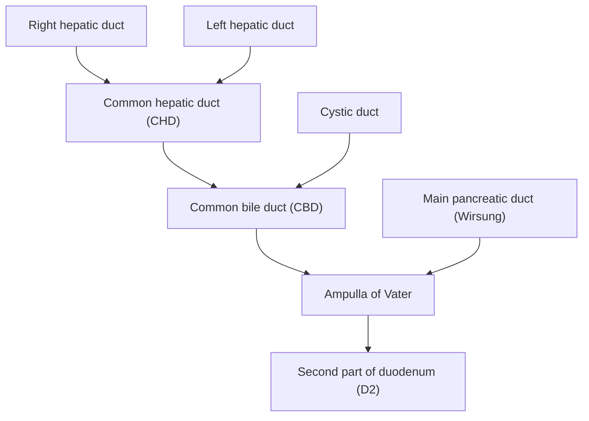

# Right Upper Quadrant (RUQ) Pain

## 1. Definition

**Right upper quadrant (RUQ) pain** refers to pain or discomfort localised to the area beneath the right costal margin, roughly bounded by the midline (linea alba) medially, the right mid-axillary line laterally, the right costal margin superiorly, and the umbilical plane inferiorly. It is one of the most common acute abdominal presentations and serves as a clinical syndrome — not a diagnosis in itself — that demands systematic evaluation.

> The term essentially describes "where" the pain is. Your job is to work out "why" it's there.

---

## 2. Epidemiology and Risk Factors

### 2.1 Epidemiology
- The most common cause of RUQ pain is **biliary disease** (biliary colic and cholecystitis), accounting for roughly 30–50% of presentations. [1][2]
- ***Gallstones affect ~10–15% of the adult population in Western countries***; in Hong Kong the prevalence is slightly lower (~5–10%) but rising with westernisation of diet and increasing obesity. [1]
- ***Cholecystitis accounts for 3–10% of all patients presenting with abdominal pain to the emergency department.*** [1]
- Acute cholangitis and gallstone pancreatitis are less frequent but carry significant morbidity and mortality if untreated.
- Liver abscess (particularly Klebsiella pneumoniae primary liver abscess) is a diagnosis with particular significance in East and Southeast Asia, including Hong Kong, where diabetes mellitus prevalence is high. [3]

### 2.2 Risk Factors — Focused on Biliary Disease

The classic mnemonic for cholesterol gallstone risk factors is the ***"5 Fs": Fat, Female, Fertile, Forty, Fair/Family***. Let's break this down pathophysiologically:

| Risk Factor | Mechanism |
|---|---|
| **Fat (Obesity)** | Increased hepatic cholesterol synthesis → supersaturation of bile with cholesterol → cholesterol crystal nucleation |
| **Female** | Oestrogen increases hepatic HMG-CoA reductase activity (↑ cholesterol synthesis) and stimulates hepatic lipoprotein receptors (↑ cholesterol uptake). Progesterone impairs gallbladder contractility → stasis |
| **Fertile (Multiparity / OCP / HRT)** | Same oestrogen/progesterone mechanisms amplified during pregnancy |
| **Forty (Age > 40)** | Cumulative bile stasis, ↑ biliary cholesterol saturation with age, ↓ gallbladder motility |
| **Fair / Family** | Genetic polymorphisms in cholesterol transporters (e.g. ABCG5/ABCG8) and bile salt metabolism; higher prevalence in certain ethnic groups (e.g. Pima Indians, Scandinavians) |

Additional risk factors:
- **Rapid weight loss / Total parenteral nutrition (TPN)** → gallbladder stasis (lack of CCK stimulation)
- **Haemolytic anaemias** (e.g. sickle cell disease, hereditary spherocytosis) → excess unconjugated bilirubin → **black pigment stones**
- **Cirrhosis** → impaired bile salt synthesis and gallbladder hypomotility
- **Ileal disease or resection** (e.g. Crohn's disease) → bile salt malabsorption → ↓ bile salt pool → cholesterol supersaturation
- ***Diabetes mellitus*** → gallbladder hypomotility (autonomic neuropathy) and increased risk of complicated biliary disease and Klebsiella liver abscess [1][3]
- **Drugs**: octreotide, fibrates (clofibrate), ceftriaxone (forms biliary sludge)

<Callout title="High Yield — 5Fs + Extra Risk Factors">
Remember the 5Fs for cholesterol stones. But in Hong Kong, also think about:
- ***Recurrent pyogenic cholangitis (RPC)*** — endemic in Southeast Asia, associated with *Clonorchis sinensis* and pigment stones formed *de novo* in intrahepatic ducts [4]
- ***Klebsiella pneumoniae liver abscess*** — strongly associated with diabetes mellitus, particularly in East Asian populations [3]
</Callout>

---

## 3. Anatomy and Function

Understanding the anatomy of the biliary tree is absolutely critical for approaching RUQ pain. Let's build it from first principles.

### 3.1 Gallbladder Anatomy

- ***The gallbladder consists of fundus, body, infundibulum (Hartmann's pouch), and neck*** [4]
  - **Fundus**: the blind end that projects beyond the inferior liver edge at the tip of the right 9th costal cartilage (landmark for Murphy's sign)
  - **Body**: the main storage portion, lies in the gallbladder fossa on the visceral surface of the right liver lobe (segments IVb and V)
  - **Infundibulum (Hartmann's pouch)**: a saccular outpouching between the body and neck — ***this is where stones most commonly become impacted*** → can compress the common hepatic duct in **Mirizzi syndrome** [4]
  - **Neck**: the narrow portion that tapers into the cystic duct; contains the **spiral valves of Heister** which help regulate bile flow

### 3.2 Biliary Ductal Anatomy

- **Right and left hepatic ducts** converge to form the **common hepatic duct (CHD)**
- The **cystic duct** joins the CHD to form the **common bile duct (CBD)** — the CBD runs in the free edge of the **lesser omentum** (hepatoduodenal ligament), anterior to the portal vein and to the right of the hepatic artery proper
- The CBD passes behind the first part of the duodenum and through the head of the pancreas before opening at the **ampulla of Vater** in the second part of the duodenum (D2)
- The **sphincter of Oddi** controls bile (and pancreatic juice) flow into the duodenum

### 3.3 Blood Supply

- **Cystic artery** (usually a branch of the right hepatic artery) — runs through the **Triangle of Calot** (bounded by the cystic duct, common hepatic duct, and inferior border of the liver)
  - Identifying the Triangle of Calot and achieving the ***"critical view of safety"*** is the key step in laparoscopic cholecystectomy to avoid bile duct injury [1]
- The gallbladder is drained by the **cystic vein** into the portal vein

### 3.4 Nerve Supply and Referred Pain Patterns

- **Visceral afferents**: travel via the coeliac plexus and greater splanchnic nerves (T5–T9) → this is why biliary pain is felt as a **vague epigastric or RUQ ache** (visceral peritoneum → poorly localised)
- **Phrenic nerve (C3–C5)**: the diaphragmatic peritoneum overlying the gallbladder fossa is innervated by the phrenic nerve → ***inflammation here causes referred pain to the right shoulder tip*** (Kehr's sign equivalent for the biliary system) [2]
- **Somatic afferents (intercostal nerves T7–T11)**: when inflammation extends to involve the **parietal peritoneum**, pain becomes sharp, well-localised, and worsened by movement or breathing — this is the transition from biliary colic to acute cholecystitis

<Callout title="Why does gallbladder pain radiate to the right shoulder/scapula?">
The gallbladder sits on the undersurface of the liver, directly beneath the right hemidiaphragm. Inflammation of the gallbladder can irritate the diaphragmatic peritoneum, whose sensory fibres travel in the phrenic nerve (C3–C5). The brain misinterprets this as pain from the dermatome of C3–C5, which overlies the shoulder tip. This is referred pain via shared spinal cord segments.
</Callout>

### 3.5 Physiology of Bile

- **Bile** is produced continuously by hepatocytes (~500–1000 mL/day)
- Between meals, the sphincter of Oddi is closed → bile diverts into the gallbladder for storage and concentration (5–10× via Na⁺/H₂O absorption)
- After a meal (especially fatty), CCK is released from I-cells in the duodenum → stimulates gallbladder contraction and relaxation of the sphincter of Oddi → bile enters the duodenum
- **Bile composition**: bile salts (conjugated bile acids), phospholipids (lecithin), cholesterol, bilirubin (conjugated), water, electrolytes
- When the cholesterol-to-bile-salt-to-lecithin ratio exceeds the critical micellar solubility, cholesterol crystallises → **cholesterol gallstones**

### 3.6 Other RUQ Structures

Remember, not everything in the RUQ is biliary. Other structures:
- **Liver** (hepatitis, abscess, tumour → capsular distension → RUQ pain)
- **Right kidney and adrenal** (pyelonephritis, renal colic, adrenal haemorrhage)
- **Hepatic flexure of the colon** (colitis, obstruction, tumour)
- **Duodenum** (duodenal ulcer — especially posterior wall)
- **Right lower lobe of the lung/pleura** (right basal pneumonia, pulmonary embolism)
- **Appendix** (high/subhepatic appendix can mimic biliary disease)

---

## 4. Etiology (Focus on Hong Kong)

Here we systematically list the causes of RUQ pain, grouped by organ system, with pathophysiological explanation.

### 4.1 Biliary Causes (Most Common)

#### A. Biliary Colic
- **Pathophysiology**: ***A gallstone transiently impacts in the cystic duct or Hartmann's pouch → gallbladder contracts against a fixed obstruction → visceral pain*** [1][2]
- ***The pain is called "colic" but is actually steady/constant*** (not truly colicky like intestinal colic) because the gallbladder is a smooth-muscle sac without peristalsis; it generates a sustained contraction. "False colic" is a better descriptor. [2]
- The stone either dislodges (pain resolves in < 6 hours) or remains impacted (→ cholecystitis)

#### B. Acute Cholecystitis (Calculous, 90–95%)
- ***Pathophysiology:*** ***Prolonged gallstone impaction at Hartmann's pouch or cystic duct → stagnant bile becomes concentrated (mucocele/hydrops) → chemical inflammation*** (mediated by ***lysolecithin***, prostaglandins, and phospholipase A) ***in the first 48 hours → secondary bacterial infection*** (15–30% of cases) by enteric organisms: ***E. coli, Klebsiella, Enterococcus, Enterobacter*** [1][2][4]
- Prolonged obstruction → gallbladder distension → compromised blood supply → gangrenous cholecystitis (20%) → perforation → biliary peritonitis [2]

#### C. Acalculous Cholecystitis (5–10%)
- ***Occurs in critically ill patients: ICU, TPN, sepsis, major burns, multi-organ dysfunction*** [4]
- Mechanism: ***gallbladder stasis + ischaemia*** (due to hypoperfusion in critical illness) → bile stasis → mucosal injury → inflammation without stones
- Requires ***urgent percutaneous cholecystostomy*** (drainage) + antibiotics as these patients are usually too sick for surgery [4]

#### D. Choledocholithiasis (CBD Stones)
- ***Most common manifestation is jaundice*** (obstructive/post-hepatic); pain is often more prolonged (> 6 hours) than simple biliary colic [4]
- Transient impaction at the ampulla → transient jaundice; persistent impaction → progressive jaundice
- Complications: **acute cholangitis**, **gallstone pancreatitis**

#### E. ***Acute Cholangitis***
- **Definition**: ***Infection of the biliary tree secondary to obstruction and bacterial contamination*** [1][4]
- ***Requires BOTH obstruction + bacteria*** — obstruction alone = obstructive jaundice; bacteria alone without obstruction rarely causes clinical cholangitis [4]
- ***Most common cause: choledocholithiasis*** [4]
- Other causes: benign/malignant strictures, stent occlusion, parasitic infection, post-ERCP
- **Bacteriology**: ***E. coli, Klebsiella pneumoniae, Enterococcus, Enterobacter, Bacteroides fragilis*** [4]
- ***Pathogenesis***: biliary obstruction → stasis → loss of normal barrier mechanisms (continuous bile flushing, bacteriostatic bile salts, secretory IgA, sphincter of Oddi barrier) → ascending bacterial infection from duodenum or haematogenous spread via portal vein → ***cholangiovenous reflux*** (bacteria/endotoxins enter the bloodstream through disrupted bile duct epithelium at high biliary pressures → sepsis) [4]

#### F. ***Recurrent Pyogenic Cholangitis (RPC)***
- ***Also called "Hong Kong disease" / "Oriental cholangiohepatitis"*** [4]
- ***Characterised by recurrent bouts of cholangitis from de novo formation of brown pigment/calcium bilirubinate stones within intrahepatic bile ducts*** (contrast with gallbladder origin of Western gallstones) [4]
- ***Pathogenesis: Stasis + Stricturing + Recurrent infection*** — bacterial β-glucuronidase deconjugates bilirubin glucuronide → unconjugated bilirubin complexes with calcium → calcium bilirubinate stones; repeated cycles of stone formation → obstruction → infection → inflammation → stricturing → more stone formation [4]
- ***Associated with Clonorchis sinensis, Opisthorchis viverrini, Ascaris lumbricoides*** [4]
- ***Peak prevalence in 30–40s; equal sex distribution; found predominantly in Southeast Asia*** [4]

#### G. Mirizzi Syndrome
- ***Extrinsic compression of the common hepatic duct by a stone impacted in the cystic duct or Hartmann's pouch*** [4]
- Presents with ***fever, jaundice, and RUQ pain*** — can mimic choledocholithiasis
- ***Classification (Csendes-McSherry, based on cholecystobiliary fistula):*** [4]
  - ***Type I***: External compression only, no fistula
  - ***Type II***: Fistula involving < 1/3 of CBD circumference
  - ***Type III***: Fistula involving 1/3–2/3 of CBD circumference
  - ***Type IV***: Fistula involving > 2/3 of CBD circumference (destruction of entire CBD wall)

### 4.2 Hepatic Causes

#### A. ***Liver Abscess***
- ***Pyogenic liver abscess*** — most commonly involves the **right lobe** (larger, greater portal blood flow) [3]
  - ***Routes of spread:*** [3]
    - ***Intra-abdominal*** (via portal vein): appendicitis, diverticulitis, peritonitis
    - ***Direct*** (from biliary infection): gallstones, malignant obstruction
    - ***Haematogenous*** (arterial): infective endocarditis
    - ***External inoculation***: surgical/traumatic
  - ***Microbiology***: ***Klebsiella pneumoniae*** (dominant in Hong Kong/East Asia, especially in diabetics), E. coli, Streptococcus milleri group, Staphylococcus aureus, anaerobes; polymicrobial in many cases [3]
  - ***Risk factors: diabetes mellitus, hepatobiliary disease, liver transplantation*** [3]
- ***Amoebic liver abscess*** — caused by *Entamoeba histolytica*; most common extra-intestinal manifestation of amoebiasis; consider in travellers from endemic areas [3]

#### B. Acute Hepatitis
- Viral (HAV, HBV, HCV, HEV), drug-induced (paracetamol, isoniazid), alcoholic hepatitis
- Mechanism: hepatocyte inflammation and swelling → distension of the **Glisson's capsule** (the liver capsule) → dull RUQ ache
- Capsular distension is a key concept: the liver parenchyma itself has no pain fibres; it is the capsule that is innervated

#### C. Hepatocellular Carcinoma (HCC) / Liver Metastases
- In Hong Kong, HCC is strongly associated with chronic hepatitis B (and increasing HCV/NAFLD)
- Large tumour → capsular stretching → RUQ pain; tumour rupture → acute haemoperitoneum

#### D. Budd-Chiari Syndrome
- Hepatic venous outflow obstruction → hepatomegaly, RUQ pain, ascites
- Causes: myeloproliferative disorders, OCP, hypercoagulable states

### 4.3 Pancreatic Causes

- ***Acute pancreatitis*** (gallstone pancreatitis is the most common cause in Hong Kong) — epigastric pain radiating to the back, but can present as or include RUQ pain [4]
  - ***Pathophysiology***: unregulated premature activation of trypsin within pancreatic acinar cells → autodigestion → peripancreatic necrosis → NF-κB–dependent inflammatory cascade → SIRS [4]

### 4.4 Gastrointestinal Causes

- **Duodenal ulcer** (especially posterior D1): epigastric pain, may localise to RUQ; aggravated by hunger, relieved by food (in classic DU)
- **Hepatic flexure pathology**: colorectal carcinoma, colitis, diverticulitis (rare at hepatic flexure)
- **High / subhepatic appendicitis**: can mimic biliary disease — always consider in young patients with RUQ tenderness and fever

### 4.5 Renal Causes

- **Right renal colic** (ureteric stone): severe, colicky loin-to-groin pain, but can be felt in RUQ
- **Right pyelonephritis**: flank pain + fever + pyuria; can overlap with RUQ tenderness

### 4.6 Thoracic Causes (Don't Forget!)

- ***Right basal pneumonia / pleuritis***: lower lobe pneumonia can cause referred RUQ pain via irritation of the diaphragm
- ***Pulmonary embolism***: pleuritic chest pain in right lower zone can mimic RUQ pathology
- **Inferior MI**: can present with epigastric/RUQ discomfort (especially in elderly, diabetics) — always do an ECG!

### 4.7 Other / Rare Causes

- **Fitz-Hugh-Curtis syndrome**: perihepatitis secondary to PID (*Chlamydia trachomatis* or *Neisseria gonorrhoeae*) — young sexually active woman with RUQ pain + "violin string" adhesions on the liver surface [5]
- **Right adrenal haemorrhage** (in anticoagulated patients, sepsis, Waterhouse-Friderichsen syndrome)
- **Gallbladder cancer**: usually presents late; associated with gallstones (95%), porcelain gallbladder, gallbladder polyps > 1 cm, PSC [4]
- ***Cholangiocarcinoma***: perihilar (Klatskin tumour, most common), distal, or intrahepatic; risk factors include ***PSC, RPC, choledochal cysts, Caroli's disease, Clonorchis sinensis, Lynch syndrome*** [4]
- ***Choledochal cysts***: congenital dilatation of intra/extrahepatic biliary system; RUQ mass + pain + jaundice; risk of cholangiocarcinoma [2]

---

## 5. Classification

### 5.1 By Organ System (Anatomical Classification)

| Organ System | Conditions |
|---|---|
| **Biliary** | Biliary colic, acute cholecystitis (calculous/acalculous), choledocholithiasis, acute cholangitis, RPC, Mirizzi syndrome, gallbladder cancer, cholangiocarcinoma, choledochal cyst |
| **Hepatic** | Hepatitis (viral, alcoholic, drug-induced), liver abscess (pyogenic, amoebic), HCC/metastases, Budd-Chiari syndrome, hepatic congestion (right heart failure) |
| **Pancreatic** | Acute pancreatitis (gallstone, alcoholic), pancreatic head tumour |
| **GI** | Duodenal ulcer, hepatic flexure pathology, subhepatic appendicitis |
| **Renal** | Renal colic, pyelonephritis |
| **Thoracic** | Right basal pneumonia, pulmonary embolism, inferior MI |
| **Gynaecological** | Fitz-Hugh-Curtis syndrome |
| **Vascular** | Budd-Chiari, portal vein thrombosis |

### 5.2 By Acuity

| Acute (hours) | Subacute (days–weeks) | Chronic (weeks–months) |
|---|---|---|
| Biliary colic, acute cholecystitis, cholangitis, pancreatitis, perforated DU, ruptured liver abscess, hepatic artery aneurysm rupture | Liver abscess, subacute hepatitis, RPC | Chronic cholecystitis, HCC, cholangiocarcinoma, chronic hepatitis, Budd-Chiari |

### 5.3 ***Gallstone Classification by Composition*** [1][2]

| Type | Cholesterol Stones (80% in West) | Black Pigment Stones (10–15%) | Brown Pigment Stones (5–10%) |
|---|---|---|---|
| **Composition** | > 50% cholesterol monohydrate crystals + mucin glycoprotein + calcium bilirubinate | Calcium bilirubinate polymer + calcium carbonate/phosphate | Calcium bilirubinate + calcium palmitate + cholesterol |
| **Pathogenesis** | Supersaturation of bile with cholesterol (↑ cholesterol, ↓ bile salts, ↓ lecithin) + nucleation + gallbladder hypomotility | Excess unconjugated bilirubin in bile (haemolysis, cirrhosis) | ***Bacterial infection (E. coli, Klebsiella) → β-glucuronidase deconjugates bilirubin → unconjugated bilirubin + calcium; associated with RPC, Clonorchis sinensis*** |
| **Location** | Gallbladder | Gallbladder | ***Intrahepatic and extrahepatic bile ducts (de novo)*** |
| **Radiopacity** | 15% radio-opaque | Radio-opaque | Radio-lucent |
| **Associations** | 5Fs, obesity, TPN, rapid weight loss, fibrates | Haemolytic anaemias (SCD, spherocytosis), cirrhosis | ***RPC, parasitic infections*** |

---

## 6. Clinical Features

### 6.1 Symptoms

The clinical features of RUQ pain depend on the underlying pathology. Here we present them condition-by-condition with pathophysiological rationale.

#### A. ***Biliary Colic*** [1][2]

| Feature | Description | Pathophysiological Basis |
|---|---|---|
| **Site** | RUQ or epigastrium (sometimes substernal) | Visceral afferents from gallbladder travel via coeliac plexus to T5–T9 → referred to epigastrium/RUQ |
| **Onset** | ***Abrupt*** | Sudden impaction of stone in cystic duct |
| **Character** | ***Intense, dull, constant ("steady")*** — despite the name "colic" | ***Gallbladder is a muscular sac, not a tube; it contracts as a whole unit against obstruction → sustained pressure, not peristaltic waves*** |
| **Radiation** | ***Right shoulder tip or interscapular region*** | Phrenic nerve irritation (C3–C5) from diaphragmatic peritoneal inflammation |
| **Associated** | Nausea, vomiting, diaphoresis | Vagal stimulation from visceral pain |
| **Timing** | ***Lasts ≥ 30 min, plateaus within 1 hour, resolves within 6 hours*** | Stone dislodges from cystic duct → pressure normalises |
| **Exacerbating** | ***After a fatty meal*** | Fat in duodenum → CCK release → gallbladder contraction against impacted stone |
| **Relieving** | ***NOT relieved by position change, bowel movements, or antacids*** | Not GI motility-related or acid-related |
| **NOT present** | ***No fever, no peritoneal signs*** | No infection, no parietal peritoneal involvement — purely visceral pain |

<Callout title="Key Distinction" type="error">
Students often mistake biliary colic for a "colicky" pain with pain-free intervals. Biliary "colic" is actually a **constant, steady** pain (false colic). It is the ***duration (< 6 hours) and absence of fever*** that distinguishes it from cholecystitis, not the character of the pain.
</Callout>

#### B. ***Acute Cholecystitis*** [1][2]

| Feature | Description | Pathophysiological Basis |
|---|---|---|
| **Pain** | ***Starts as biliary colic but becomes more constant, prolonged (> 4–6 hours), and severe*** | Stone remains impacted → chemical inflammation → parietal peritoneal irritation |
| **Site** | RUQ | Gallbladder fossa is in the RUQ (segments IVb/V) |
| **Radiation** | ***Right shoulder (Boas sign) or back / interscapular*** | Phrenic nerve (C3–C5) from diaphragmatic irritation |
| **Fever** | ***Present (low-grade initially, high-grade if empyema/gangrene)*** | ***Chemical then bacterial inflammation*** → cytokine release → hypothalamic set-point elevation |
| **Exacerbated by** | ***Movement and deep inspiration*** | Inflamed gallbladder adherent to parietal peritoneum → movement stretches inflamed peritoneum |
| **Nausea/vomiting** | Common | Vagal stimulation |
| **Anorexia** | Common | Systemic inflammatory response |

**Complications of acute cholecystitis (clinical features)** [2]:
- ***Gallbladder empyema***: ***tender RUQ mass + septic-looking patient*** — pus fills the gallbladder
- ***Gangrenous cholecystitis (20%)***: disproportionately severe pain, high fever, toxaemia — ischaemic necrosis of gallbladder wall
- ***Perforation***: biliary peritonitis — generalised guarding (though usually contained by omentum)
- ***Emphysematous cholecystitis***: ***gas-forming organisms (e.g. Clostridium welchii) → gas in gallbladder wall; insidious onset, abdominal crepitus*** — more common in diabetics
- ***Cholecystoenteric fistula → gallstone ileus***: large stone erodes through gallbladder into duodenum → impacts at ileocaecal valve → small bowel obstruction

#### C. ***Acute Cholangitis*** [1][4]

| Feature | Description | Pathophysiological Basis |
|---|---|---|
| ***Charcot's triad (present in ~2/3)*** | ***Fever (with rigors), RUQ pain, jaundice*** | Biliary obstruction + infection → intermittent bacteraemia (rigors), biliary distension (pain), impaired bilirubin excretion (jaundice) |
| ***Reynolds' pentad*** | ***Charcot's triad + hypotension + altered mental status*** | Indicates overwhelming sepsis → cholangiovenous reflux (bacteria/endotoxin enter bloodstream from bile ducts under pressure) → septic shock |

- ***Fever is often intermittent with chills/rigors*** — classic "spiking" fever pattern of cholangitis due to intermittent bacteraemia as bile duct pressure fluctuates [4]
- ***Scleral icterus, pale stools, dark urine*** = obstructive jaundice pattern (conjugated hyperbilirubinaemia → absent urobilinogen in stool, increased renal conjugated bilirubin excretion) [1]

<Callout title="High Yield — Charcot vs Reynolds">
- **Charcot's triad** = Fever + RUQ pain + Jaundice → suggests cholangitis
- **Reynolds' pentad** = Charcot's triad + Hypotension + Altered mental status → suggests **suppurative/toxic cholangitis** with septic shock — **emergency biliary decompression** needed
</Callout>

#### D. ***Recurrent Pyogenic Cholangitis (RPC)*** [4]

- ***Charcot's triad*** (fever ± chills, RUQ/epigastric pain, jaundice) — recurrent episodes
- History of prior biliary interventions, known intrahepatic stones
- May have hepatomegaly (from intrahepatic stone-related hepatic parenchymal damage)

#### E. ***Liver Abscess*** [3]

| Feature | Description | Pathophysiological Basis |
|---|---|---|
| **Fever** (90%) | ***High spiking fever with rigors*** | Abscess = contained infection → intermittent bacteraemia |
| **RUQ pain** | Dull, constant, may be pleuritic | Hepatic capsular distension (Glisson's capsule) |
| **Right shoulder pain** | Referred pain | Diaphragmatic irritation → phrenic nerve (C3–C5) |
| **Hepatomegaly** | Tender, smooth enlargement | Abscess expanding within liver parenchyma |
| **Weight loss, malaise** | Subacute/chronic presentations | Chronic infection and catabolic state |
| **Cough / right pleural effusion** | In right lobe abscess abutting diaphragm | Diaphragmatic irritation → reactive pleural effusion |

#### F. Acute Pancreatitis [4]

| Feature | Description | Pathophysiological Basis |
|---|---|---|
| **Pain** | ***Epigastric (can be RUQ), severe, radiates to back*** | Pancreas is retroperitoneal → pain felt in epigastrium and referred posteriorly |
| **Relieved by** | ***Sitting up or leaning forward*** | Shifts the inflamed pancreas away from the retroperitoneal structures |
| **Nausea/vomiting** | Prominent | Gastric and duodenal ileus from adjacent inflammation |
| **Onset** | ***Rapid (gallstone); less abrupt (alcohol)*** | Gallstone impacts at ampulla suddenly vs. chronic alcohol-induced ductal changes |

#### G. Peptic Ulcer Disease (Duodenal Ulcer)

- Epigastric pain that can localise to RUQ
- **DU**: pain ~2 hours after meals, relieved by eating (food buffers acid, then acid rebounds)
- **GU**: pain immediately after meals (food stimulates acid production on an already ulcerated mucosa)
- Perforation: sudden, severe, constant epigastric pain → generalised peritonitis

#### H. Other Causes (Characteristic Features)

| Condition | Key Features |
|---|---|
| **Right pyelonephritis** | Fever, costovertebral angle tenderness, dysuria, pyuria |
| **Right basal pneumonia** | Cough, fever, pleuritic pain, crackles on auscultation, CXR infiltrate |
| **Fitz-Hugh-Curtis** | Young woman, sexually active, RUQ pain, concurrent vaginal discharge/PID features |
| **Subhepatic appendicitis** | Mimics cholecystitis — fever, RUQ tenderness, but more progressive course typical of appendicitis |

### 6.2 Signs

#### A. ***Murphy's Sign*** [1][2]

- **How to elicit**: With the examiner's fingers hooked under the right costal margin (at the gallbladder point — intersection of the lateral border of rectus abdominis with the costal margin), ask the patient to inspire deeply. A positive Murphy's sign = ***inspiratory arrest (the patient catches their breath and stops inhaling) due to the inflamed gallbladder descending onto the examiner's fingers during inspiration***
- **Pathophysiological basis**: In acute cholecystitis, the gallbladder wall is inflamed and adherent to parietal peritoneum. During inspiration, the diaphragm pushes the liver (and gallbladder) down → the inflamed gallbladder contacts the examining fingers → sharp peritoneal pain → reflex cessation of inspiration
- ***Positive in acute cholecystitis; NEGATIVE in chronic cholecystitis*** (fibrotic gallbladder does not distend or move as much)
- ***Sonographic Murphy sign***: Murphy's sign elicited under ultrasound guidance — one of the cardinal ultrasound signs of acute cholecystitis [2]

#### B. ***RUQ Tenderness and Guarding***

- **Tenderness**: localised pain on palpation → peritoneal inflammation (from biliary, hepatic, or other cause)
- **Guarding**: voluntary (patient tenses abdominal muscles) or involuntary (reflex spasm due to peritonitis) → indicates parietal peritoneal involvement
- **Rigidity** (board-like): indicates diffuse peritonitis (e.g. perforated cholecystitis or duodenal ulcer)

#### C. ***Palpable Gallbladder*** [2]

- ***Courvoisier's law***: ***In the presence of painless obstructive jaundice, a palpable (non-tender, distended) gallbladder is unlikely to be due to gallstones*** [2]
  - **Why?** A gallbladder chronically exposed to gallstones becomes fibrotic and shrunken from repeated cholecystitis → it *cannot* distend. A palpable gallbladder in painless jaundice implies a previously normal gallbladder now distended by a *distal* obstruction (e.g. ***periampullary tumour — pancreatic head cancer, ampullary cancer, cholangiocarcinoma***) [2]
  - ***Exceptions***: double impaction (stone in cystic duct + CBD simultaneously), Mirizzi syndrome, RPC [2]

#### D. ***Jaundice*** [1]

- **Scleral icterus**: visible when bilirubin > 35–50 µmol/L (look at the sclerae in natural light)
- Indicates biliary obstruction (choledocholithiasis, cholangitis, Mirizzi) or hepatocellular dysfunction (hepatitis)

#### E. ***Fever and Rigors***

- Present in cholecystitis, cholangitis, liver abscess, pancreatitis (late), and extra-biliary infections
- ***Rigors (true shaking chills)*** are particularly suggestive of **bacteraemia** — classic for cholangitis and liver abscess

#### F. Signs of Complications

| Sign | Condition | Mechanism |
|---|---|---|
| **Tender RUQ mass** | Gallbladder empyema, mucocele, large liver abscess | Pus-filled gallbladder or expanding hepatic abscess → palpable |
| **Abdominal crepitus** | Emphysematous cholecystitis | Gas-forming organisms (Clostridium) in gallbladder wall |
| **Board-like rigidity** | Perforation (gallbladder, duodenal ulcer) | Generalised peritonitis → involuntary abdominal wall spasm |
| **Hepatomegaly** | Liver abscess, HCC, hepatitis, Budd-Chiari | Parenchymal expansion or venous congestion |
| **Cullen's sign / Grey Turner's sign** | Severe acute pancreatitis | Retroperitoneal haemorrhage tracking to periumbilical area (Cullen) or flanks (Grey Turner) |

---

## 7. High Yield Summary

<Callout title="High Yield Summary">

1. **RUQ pain differential** — always think biliary first, but don't forget liver, pancreas, duodenum, kidney, lung, and gynaecological causes.

2. ***Biliary colic*** = ***constant*** (not truly colicky) pain, < 6 hours, no fever, no peritoneal signs. Pain is due to gallbladder contracting against an impacted stone.

3. ***Acute cholecystitis*** = biliary colic that persists > 4–6 hours + ***fever*** + ***Murphy's sign*** + peritoneal signs. Pathogenesis: impaction → chemical inflammation (lysolecithin) → secondary bacterial infection.

4. ***Acute cholangitis*** = ***Charcot's triad*** (fever + RUQ pain + jaundice). ***Reynolds' pentad*** adds hypotension + confusion → **suppurative cholangitis/septic shock**. Requires BOTH obstruction + bacteria.

5. ***RPC*** ("Hong Kong disease") = recurrent cholangitis from ***de novo intrahepatic brown pigment stones***. Think ***Clonorchis sinensis***, stasis + stricturing + recurrent infection.

6. ***Courvoisier's law*** = painless jaundice + palpable gallbladder → NOT gallstones → think **periampullary tumour**.

7. ***Murphy's sign*** = inspiratory arrest on deep RUQ palpation during inspiration. Positive in acute cholecystitis. ***Sonographic Murphy sign*** is one of the 5 cardinal USG features.

8. ***5 cardinal USG signs of acute cholecystitis***: gallstones + distended GB (> 4 × 10 cm) + wall thickening (> 3 mm) + pericholecystic fluid + sonographic Murphy sign.

9. ***Liver abscess*** in Hong Kong → think ***Klebsiella pneumoniae*** in a ***diabetic*** patient.

10. ***Gallstone pancreatitis*** is the most common cause of acute pancreatitis in Hong Kong. Pain is epigastric, radiates to back, relieved by leaning forward.

</Callout>

---

<ActiveRecallQuiz
  title="Active Recall - RUQ Pain: Definition to Clinical Features"
  items={[
    {
      question: "Why is biliary colic described as 'constant' rather than truly colicky, despite its name?",
      markscheme: "The gallbladder is a muscular sac, not a peristaltic tube. It contracts as a whole unit against an impacted stone, generating sustained pressure rather than rhythmic waves. Hence the pain is steady/constant. The term 'false colic' is more accurate.",
    },
    {
      question: "What is the pathophysiological sequence in acute calculous cholecystitis, from stone impaction to secondary infection?",
      markscheme: "Prolonged stone impaction at Hartmann's pouch/cystic duct -> stagnant bile concentrates (mucocele/hydrops) -> chemical inflammation in first 48 hours mediated by lysolecithin and prostaglandins -> secondary bacterial infection (15-30%) by E. coli, Klebsiella, Enterococcus, Enterobacter.",
    },
    {
      question: "State Charcot's triad and Reynolds' pentad. What is the key difference in their clinical significance?",
      markscheme: "Charcot's triad: Fever + RUQ pain + Jaundice (suggests cholangitis). Reynolds' pentad adds hypotension + altered mental status (indicates suppurative/toxic cholangitis with septic shock requiring emergency biliary decompression).",
    },
    {
      question: "Explain Courvoisier's law and its pathophysiological basis. Give three exceptions.",
      markscheme: "In painless jaundice with a palpable gallbladder, the cause is unlikely gallstones. Basis: chronic gallstones cause fibrosis of the GB wall from repeated cholecystitis, so it cannot distend. A palpable GB implies a previously healthy GB distended by distal obstruction (periampullary tumour). Exceptions: double impaction, Mirizzi syndrome, RPC.",
    },
    {
      question: "What are the 5 cardinal ultrasound features of acute cholecystitis?",
      markscheme: "1) Presence of gallstones, 2) Distended GB (greater than 4 x 10 cm), 3) GB wall thickening (greater than 3 mm), 4) Pericholecystic fluid/stranding, 5) Sonographic Murphy sign.",
    },
    {
      question: "Why is RPC called 'Hong Kong disease' and how does its stone pathogenesis differ from typical Western gallstones?",
      markscheme: "RPC is endemic in Southeast Asia (including Hong Kong). Stones form de novo within intrahepatic bile ducts (not the gallbladder). They are brown pigment/calcium bilirubinate stones formed when bacterial beta-glucuronidase deconjugates bilirubin glucuronide into unconjugated bilirubin, which complexes with calcium. Associated with Clonorchis sinensis and recurrent cycles of stasis, stricturing, and infection.",
    },
  ]}
/>

---

## References

[1] Lecture slides: GC 200. RUQ pain, jaundice and fever Cholecytitis and cholangitis Imaging of GI system.pdf
[2] Senior notes: maxim.md (Section: Biliary colic, Acute cholecystitis, Gallstone classification)
[3] Senior notes: felixlai.md (Section: Liver abscess)
[4] Senior notes: felixlai.md (Sections: Cholecystitis, Acute cholangitis, Recurrent pyogenic cholangitis, Mirizzi syndrome, Gallbladder cancer, Acute pancreatitis)
[5] Lecture slides: GC 195. Lower and diffuse abdominal pain RLQ problems; pelvic inflammatory disease; peritonitis and abdominal emergencies.pdf
