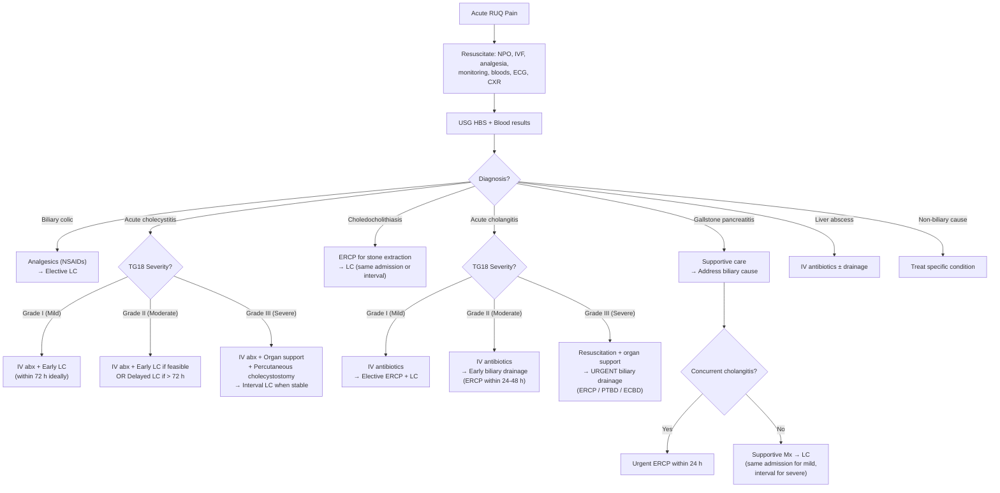
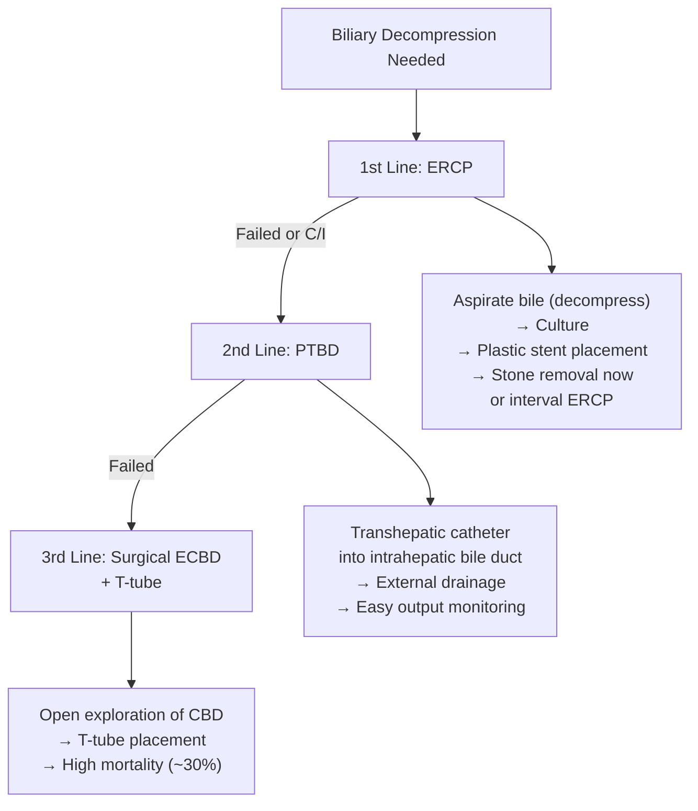

## Management Algorithm and Treatment Modalities for RUQ Pain

The management of RUQ pain is not a single treatment pathway — it is a **condition-specific** approach guided by the diagnosis you've established. However, there are universal principles that apply to almost every acute RUQ presentation. Let's build from first principles: stabilise the patient first, then treat the cause.

---

### 1. Universal Initial Management Principles

Before you even know the exact diagnosis, every patient with acute RUQ pain needs:

| Step | Action | Rationale |
|---|---|---|
| **A — Assess and resuscitate** | ***NPO (nil per os), IV fluids, monitor vitals and I/O*** [2][4] | NPO rests the biliary/GI system (food triggers CCK → gallbladder contraction → worsens biliary pain); IV fluids replace insensible losses from vomiting, fever, and third-spacing |
| **B — Bloods** | CBC/D, L/RFT, amylase/lipase, CRP, clotting, blood cultures (if febrile), cross-match | Establish baseline, identify organ-specific pattern, prepare for surgery |
| **C — Analgesia** | ***NSAIDs preferred for biliary pain*** (e.g. diclofenac IM/IV); paracetamol; opioids if needed [2] | ***NSAIDs are first-line for biliary colic*** because they reduce prostaglandin-mediated gallbladder wall inflammation AND relax gallbladder smooth muscle. Opioids (especially morphine) were historically feared to cause sphincter of Oddi spasm, though this is now considered clinically insignificant at standard doses. Pethidine was preferred but is now falling out of favour due to seizure risk. |
| **D — Imaging** | USG HBS as first-line | Confirm/exclude biliary pathology |
| **E — ECG + CXR** | Rule out inferior MI and right basal pneumonia | These are the dangerous mimics you must not miss [6][8] |

---

### 2. Master Management Algorithm

---

### 3. Condition-Specific Management

#### A. Biliary Colic [2][4]

Biliary colic is **uncomplicated** — there is no infection, no inflammation of the gallbladder wall. The stone transiently impacts and dislodges. Management is therefore relatively straightforward.

**Acute management:**
- ***NPO, analgesics (NSAIDs preferred)*** [2]
- Anti-emetics (e.g. ondansetron) if vomiting
- Pain typically resolves within 6 hours

**Definitive management:**
- ***Elective laparoscopic cholecystectomy (LC)*** [2]
  - **Why?** A patient who has had one episode of biliary colic has a **1–4% per year risk of future complications** (cholecystitis, cholangitis, pancreatitis) [2]. Elective LC removes the stone-bearing gallbladder and eliminates this risk.
  - Performed as a **planned, elective** procedure after the acute episode resolves

**Alternative for non-surgical candidates:**
- ***Ursodeoxycholic acid (UDCA)*** — an oral bile acid that works by reducing biliary cholesterol secretion and promoting cholesterol desaturation, thereby slowly dissolving cholesterol stones. ***Only useful for cholesterol stones*** (not pigment stones), small stones (< 10 mm), and functioning gallbladder. Very slow (6–24 months) and high recurrence rate (~50% within 5 years). [2]

#### B. Acute Cholecystitis — Management by TG18 Severity [1][2][4]

The key principle: ***treat the infection, then remove the gallbladder***. The timing of cholecystectomy depends on severity.

##### Initial Management (All Grades) [4]

- ***NPO and IV fluids*** until inflammation subsides (bowel rest) [2]
- ***IV antibiotics***: empirical coverage for gram-negative aerobes and anaerobes [4]:
  - ***Augmentin (amoxicillin-clavulanate)*** — first-line for mild/moderate [2]
  - ***Tazocin (piperacillin-tazobactam)*** — for severe or if Augmentin inadequate [2]
  - Alternatives: ***Metronidazole + 3rd-generation cephalosporin (e.g. ceftriaxone)*** OR ***Metronidazole + fluoroquinolone (e.g. ciprofloxacin/levofloxacin)*** [4]
- Monitor vitals, I/O, analgesia

> ***Why these antibiotic choices?*** The organisms causing secondary biliary infection are enteric bacteria — ***E. coli, Klebsiella, Enterobacter, Enterococcus*** — that ascend from the duodenum. They are gram-negative rods and facultative anaerobes. You need a beta-lactam/beta-lactamase inhibitor combination (like Augmentin or Tazocin) to cover beta-lactamase-producing gram-negatives, plus anaerobic coverage (the beta-lactamase inhibitor component provides this, or add metronidazole separately). [4]

##### Surgical Management by Severity Grade

| TG18 Grade | Definition | Management |
|---|---|---|
| ***Grade I (Mild)*** | Healthy patient, no organ dysfunction, mild inflammatory changes | ***Early laparoscopic cholecystectomy (within 72 hours of symptom onset ideally)*** [4][2] |
| ***Grade II (Moderate)*** | ↑ WBC > 18,000, palpable RUQ mass, duration > 72 h, marked local inflammation (gangrenous, emphysematous, pericholecystic abscess) but no organ dysfunction | ***Early LC if feasible and patient fit; otherwise IV antibiotics → interval (delayed) LC after 6–8 weeks*** [2][4] |
| ***Grade III (Severe)*** | Organ dysfunction (cardiovascular, neurological, respiratory, renal, hepatic, haematological) | ***IV antibiotics + organ support (ICU) + gallbladder drainage → interval LC when patient stabilises*** [4] |

##### Early vs. Interval (Delayed) Cholecystectomy [2]

| | ***Early LC (within 72 h / 3–5 days)*** | ***Interval LC (after 6–8 weeks)*** |
|---|---|---|
| **Timing** | During the index admission | Separate admission, after inflammation resolves |
| **Advantage** | ***Shorter hospital stay, single admission; initial inflammation creates pericholecystic oedema that can serve as a dissection plane*** [2] | ***Lower risk of conversion to open; fibrosis creates clearer planes*** (in theory) |
| **Disadvantage** | Higher risk of bleeding and post-op infection; higher conversion rate to open | ***Separate admission; fibrosis at Calot's triangle can make dissection difficult; risk of recurrent symptoms while waiting*** [2] |
| **Current evidence** | ***Early LC is now preferred*** — multiple RCTs and meta-analyses show equivalent safety with shorter total hospital stay and lower costs | Reserved for patients presenting late (> 72 h) or those unfit for early surgery |

<Callout title="Critical View of Safety — The Key to Safe Cholecystectomy">
During laparoscopic cholecystectomy, the surgeon must achieve the ***"critical view of safety"*** before clipping and dividing any structure. This means clearly identifying:
1. The **cystic duct** joining the gallbladder to the CBD
2. The **cystic artery** entering the gallbladder
3. The **hepatocystic triangle** (Triangle of Calot) cleared of all fat and fibrous tissue

This prevents the most feared complication: ***bile duct injury*** (incidence ~0.3–0.6% for LC). If the critical view cannot be achieved, the surgeon should convert to open or perform a "bail-out" procedure (subtotal cholecystectomy or cholecystostomy). [1]
</Callout>

##### Gallbladder Drainage (for patients unfit for surgery) [2][4]

- ***Percutaneous transhepatic cholecystostomy (PTC / PC)*** [2][4]
  - **Indication**: ***Grade III (severe) cholecystitis in patients too sick for surgery, OR patients not responding to antibiotics*** [2]
  - **Technique**: USG/CT-guided percutaneous catheter placed into the gallbladder lumen → drains infected bile → decompresses the gallbladder
  - **Advantages**: Can be both diagnostic (culture the bile) and therapeutic (decompress)
  - **Complications**: catheter migration, bile leakage, bowel injury [2]
  - ***Definitive treatment remains interval cholecystectomy*** once the patient recovers [4]

- ***Endoscopic drainage*** [2]
  - Transpapillary (via ERCP — placement of a pigtail stent from the CBD into the gallbladder through the cystic duct)
  - EUS-guided transmural drainage (EUS-guided gallbladder drainage with lumen-apposing metal stent — LAMS)
  - Reserved for when percutaneous approach is not feasible

##### Complications Requiring Emergency Surgery [2]

- ***Gangrenous cholecystitis***: progressive symptoms despite antibiotics, disproportionate toxaemia → ***emergency LC***
- ***Gallbladder perforation***: generalised peritonitis → ***emergency LC + peritoneal lavage***
- ***Emphysematous cholecystitis***: ***gas-forming organisms in GB wall (Clostridium welchii); more common in diabetics*** → ***emergency LC*** [2]
- ***Gallbladder empyema***: pus-filled gallbladder → ***urgent LC or percutaneous drainage***

##### Acalculous Cholecystitis [2][4]

- ***Occurs in critically ill/hospitalised patients (ICU, TPN, sepsis, burns)*** [4]
- ***Higher mortality*** than calculous cholecystitis
- Management: ***IV antibiotics + laparoscopic cholecystectomy (if fit) or gallbladder drainage (percutaneous cholecystostomy) if unfit*** [2][4]

---

#### C. Choledocholithiasis (CBD Stones) [2][4]

The principle is: ***clear the duct, then remove the gallbladder***.

**Management approach** [2]:
1. ***Supportive care*** (NPO, IVF, analgesia)
2. ***Biliary decompression*** — remove the CBD stone
3. ***Prevent recurrence*** — cholecystectomy

**Methods of stone clearance:**

| Method | Details |
|---|---|
| ***ERCP with sphincterotomy + stone extraction*** | ***First-line approach*** [1][2]. Endoscopic sphincterotomy cuts the sphincter of Oddi to widen the bile duct opening → stones are extracted using a balloon or Dormia basket. For large stones (> 15 mm), mechanical lithotripsy may be needed. |
| **Laparoscopic CBD exploration** | Alternative at the time of LC — common duct is explored intraoperatively. Requires expertise. |
| **Open CBD exploration (ECBD) with T-tube** | ***Reserved for failed ERCP and failed PTBD*** [4]. T-tube is placed in the CBD to decompress the biliary tree and allows post-operative cholangiography. Higher morbidity. |

**Followed by:**
- ***Laparoscopic cholecystectomy*** — ideally during the ***same admission*** (early rather than interval) to reduce risk of recurrent biliary events [2]
  - Ascending cholangitis is still possible after LC due to ***ERCP-induced CBD dilatation*** or ***age-related CBD dilatation*** causing stasis [2]

---

#### D. ***Acute Cholangitis — Management: "RAD" (Resuscitation, Antibiotics, Drainage)*** [2][4]

This is one of the most important management algorithms in surgery. ***Acute cholangitis can kill rapidly*** if biliary decompression is delayed.

<Callout title="Must Know — RAD for Cholangitis" type="idea">
The mnemonic ***RAD*** captures the management of acute cholangitis [2]:
- **R** = ***Resuscitation*** (NPO, IV fluids, monitor vitals and I/O hourly)
- **A** = ***Antibiotics*** (broad-spectrum IV)
- **D** = ***Drainage*** (biliary decompression — the definitive treatment)
</Callout>

##### Step 1: Resuscitation [4]
- ***NPO, IV fluids, monitor vitals and I/O Q1h*** [2]
- Recognise signs of shock: hypotension, oliguria, confusion, cold/clammy skin, metabolic acidosis [4]
- Fluid resuscitation to prevent multi-organ failure
- ***15% of patients will NOT respond to antibiotics alone*** and require emergency biliary decompression [4]

##### Step 2: Antibiotics [2][4]
- ***IV Augmentin (mild)*** or ***IV Tazocin (severe)*** × 7 days [2]
  - Same rationale as cholecystitis — cover enteric gram-negatives and anaerobes
- ***Blood cultures BEFORE starting antibiotics***
- Adjust based on culture and sensitivity results

##### Step 3: Biliary Drainage [1][2][4]

***Indications for urgent drainage*** [2]:
- ***Reynolds' pentad*** (hypotension + altered mental status)
- ***Not responding to antibiotics within 24 hours*** — because obstruction impairs secretion of antibiotics into bile, meaning antibiotics alone cannot treat an obstructed infected system [2]
- Worsening clinical status despite medical therapy

***The QMH hierarchy for biliary decompression*** [4]:

**1. ***ERCP (First-Line)*** [1][2][4]**

- ***ERCP is ALWAYS first-line for biliary drainage in acute cholangitis*** [1]
- **Procedure in acute cholangitis** [2]:
  - ***First aspirate bile duct to remove bile and pus*** → decompresses the biliary tree and reduces risk of inducing bacteraemia during contrast injection [2]
  - Then inject contrast and identify the obstruction
  - ***Place a plastic stent (temporary)*** for biliary drainage [2]
  - ***Stone removal can be done now or at interval ERCP after sepsis resolves*** [2] — in an acutely septic patient, the priority is ***drainage, NOT definitive stone clearance***
- ***Potential complications: perforation, bleeding from papillotomy (sphincterotomy), post-ERCP pancreatitis*** [1]
- ***Relative contraindications for ERCP: altered GI anatomy (e.g. Billroth II gastrectomy, Roux-en-Y reconstruction)*** [1]
  - Why? The duodenoscope needs to reach the ampulla of Vater in D2. Surgically altered anatomy makes access technically very difficult or impossible.

**2. ***Percutaneous Transhepatic Biliary Drainage (PTBD) (Second-Line)*** [4][10]**

- ***Indicated when ERCP is unsuccessful or contraindicated*** [2][10]
- **Technique**: Under fluoroscopic and USG guidance, a needle is passed percutaneously through the liver parenchyma into a dilated intrahepatic bile duct → guidewire advanced → drainage catheter placed [10]
- ***Requires antibiotic coverage*** (risk of seeding infection during manipulation) [10]
- **Types** [4]:
  - ***Simple external PTBD***: short-term drainage to bridge to surgery; prone to fluid and electrolyte loss (bile drains externally → loss of bile salts, bicarbonate)
  - ***External-internal PTBD***: catheter crosses the stricture/obstruction and re-enters the duodenum → bile drains both externally and internally → can be capped for internal drainage only
- ***Complications***: bleeding into biliary system (***most common***), septic shock, pancreatitis, puncture of adjacent organs, catheter migration, bile leak, metastatic seeding [10]

**3. ***Surgical ECBD (Exploration of Common Bile Duct) (Third-Line)*** [1][4]**

- ***Indication: failure of both endoscopic and percutaneous drainage, or clinical deterioration despite drainage*** [1]
- **Procedure**: Open (or rarely laparoscopic) exploration of the CBD → stone removal → T-tube placement for ongoing decompression and post-operative cholangiography
- ***High mortality (~30%) in emergency setting*** [2] — this is why it is the last resort

##### Long-Term Management After Cholangitis [2]

- ***Gallstone-related cholangitis***: ***ERCP for stone clearance + laparoscopic cholecystectomy*** (early rather than interval) [2]
- ***Stricture-related cholangitis*** (benign or malignant): endoscopic stent placement or definitive surgical correction
- ***RPC***: regular stone clearance + surgical resection of affected hepatic segments (see below)

---

#### E. Gallstone Pancreatitis [4][9]

The pancreas is treated supportively — you cannot "fix" the inflamed pancreas directly. The key is to ***support the patient through the acute episode and then address the underlying biliary cause***.

##### Acute Supportive Management [4]

| Measure | Details | Rationale |
|---|---|---|
| ***IV fluid resuscitation*** | ***Lactated Ringer's preferred over NS*** (may reduce SIRS); aim urine output ***≥ 0.5 mL/kg/h*** (minimum) to ***1.0 mL/kg/h*** (optimal) [4] | Pancreatitis causes massive third-spacing and intravascular volume depletion → aggressive fluid resuscitation prevents end-organ ischaemia |
| **O₂ supplementation** | Pulse oximetry + ABG monitoring [4] | Pancreatitis can cause ARDS and pleural effusions → hypoxaemia |
| ***NPO only if necessary*** | Only if significant nausea/vomiting; otherwise ***early enteral nutrition is preferred*** [4] | It is ***NO longer acceptable to "rest the pancreas"*** by prolonged NPO. Early enteral feeding (NG or NJ tube) reduces infection rates, surgical intervention rates, and length of stay. The gut barrier function is maintained by enteral nutrition, preventing bacterial translocation. [4] |
| **Analgesia** | Paracetamol, NSAIDs, opioids as needed | Pain control is critical; there is no evidence that opioids worsen pancreatitis at standard doses |
| **Electrolyte correction** | Correct hypocalcaemia (saponification of peripancreatic fat binds Ca²⁺), hyperglycaemia | Complications of pancreatitis |
| **NG tube** | Only if ileus or protracted vomiting | Nasogastric decompression decreases neurohormonal stimulation of pancreatic secretion [4] |
| ***Nutritional support*** | ***Enteral route preferred (NG or NJ)*** [4]; parenteral only if enteral not tolerated | ***Recommended: Energy 25–35 kcal/kg/day, Protein 1.2–1.5 g/kg/day*** [4] |

##### Addressing the Biliary Cause [4]

| Scenario | Management |
|---|---|
| ***Gallstone pancreatitis WITH concurrent cholangitis*** | ***Urgent ERCP within 24 hours of admission*** [4] — the cholangitis requires emergency biliary decompression |
| ***Gallstone pancreatitis with CBD obstruction (visible stone on imaging, dilated CBD, or rising LFTs) but NO cholangitis*** | ***Early ERCP*** (within 24–72 h) for stone extraction [4] |
| ***Gallstone pancreatitis without evidence of CBD obstruction*** | ***ERCP is NOT indicated*** [4] — the stone has likely already passed. Proceed to cholecystectomy. |

##### Cholecystectomy After Gallstone Pancreatitis [4]

- ***Should be performed after recovery in ALL patients with gallstone pancreatitis*** to prevent recurrence [4]
- ***Mild pancreatitis***: cholecystectomy can be performed safely ***within the same index hospitalisation*** (within 1 week of recovery) [4]
- ***Severe necrotising pancreatitis***: ***delay cholecystectomy until active inflammation subsides and fluid collections resolve or stabilise*** (interval cholecystectomy) [4]
- ***Intraoperative cholangiography (IOC)*** is performed to rule out persistent choledocholithiasis [4]

**Risk stratification for CBD stone before cholecystectomy** [4]:
- ***High suspicion of CBD stone → ERCP*** (before cholecystectomy)
- ***Moderate suspicion → MRCP or EUS*** to confirm before proceeding
- ***Low suspicion → Cholecystectomy with intraoperative cholangiogram***

---

#### F. Recurrent Pyogenic Cholangitis (RPC) [4]

The management of RPC is challenging because of the recurrent nature and intrahepatic stone burden.

| Step | Details |
|---|---|
| ***Acute management*** | Same as acute cholangitis: ***RAD (Resuscitation, Antibiotics, Drainage)*** |
| ***ERCP*** | Initial biliary decompression with sphincterotomy, stricture dilatation, and biliary stent placement. ***Challenging due to multiple intrahepatic/extrahepatic stones and stricturing*** [4] |
| ***Percutaneous/surgical drainage*** | For patients in whom ERCP cannot achieve adequate drainage [4] |
| ***Hepatobiliary resection*** | ***Resection of hepatobiliary segments*** with the aim to ***remove areas of recurrent infection, biliary stasis, and hepatic atrophy*** [4]. ***Hepaticojejunostomy*** (Roux-en-Y) is frequently required. Standard biliary drainage (choledochoduodenostomy/choledochojejunostomy) is contraindicated since ***residual strictured biliary segments may not be drained adequately*** [4]. |
| ***Choledochoscopy*** | Endoscopic or percutaneous choledochoscopy for intrahepatic stone clearance — allows direct visualisation and lithotripsy of intrahepatic stones |

---

#### G. Liver Abscess [3]

| Step | Details |
|---|---|
| **IV antibiotics** | Empirical broad-spectrum antibiotics covering gram-negatives and anaerobes (e.g. ceftriaxone + metronidazole, or Tazocin). Adjust based on blood/aspirate cultures. For Klebsiella pneumoniae abscess (Hong Kong context): 3rd-gen cephalosporin is usually adequate. |
| ***Percutaneous drainage*** | ***USG/CT-guided aspiration or catheter drainage*** — indicated for abscesses > 5 cm, those not responding to antibiotics alone (within 48–72 h), or for diagnostic purposes (culture, rule out amoebic vs pyogenic) [3][10] |
| **Amoebic abscess** | ***Metronidazole*** is the primary treatment (amoebiasis). Drainage is reserved for large abscesses (> 5–10 cm), failure to respond to medical therapy, or risk of rupture. Follow with luminal agent (e.g. diloxanide furoate or paromomycin) to eradicate intestinal cysts. |
| **Surgical drainage** | Rarely needed — for ruptured abscess, multiloculated abscess not amenable to percutaneous drainage, or failed percutaneous approach |

---

#### H. Malignant Biliary Obstruction (Pancreatic Head / Cholangiocarcinoma / Gallbladder Cancer)

The principles here are different — the goal is to determine ***resectability*** first, then decide between curative and palliative intent. [6][11]

***Management principles*** [6][11]:
1. ***Establish diagnosis***
2. ***Delineate level and cause of obstruction***
3. ***Treat suppurative cholangitis*** (if present — this takes priority)
4. ***Assess resectability***
5. ***Definitive or palliative treatment***

<Callout title="Key Principle — Drainage is NOT Always Urgent in MBO" type="error">
Unlike gallstone disease, ***drainage of malignant biliary obstruction is NOT always urgent*** [6]. The effect on liver function is slow in onset. ***Premature drainage (especially stenting) before CT can obscure tumour assessment.*** Drainage should be done after CT if no indications for early decompression.

***Indications for early drainage in MBO*** [6]:
- ***Biliary sepsis or stones*** (contaminated biliary system)
- ***Poor liver function due to prolonged cholestasis*** (needs pre-operative optimisation)
- ***Klatskin tumour*** (drainage allows normalisation of liver function → important for pre-op ICG testing and post-op monitoring, as hepatectomy is part of management)
</Callout>

**Palliative Biliary Drainage Options** [4]:

| Method | Details |
|---|---|
| ***ERCP with endoprosthesis (stenting)*** | ***ALWAYS first-line*** regardless of level of obstruction, especially for periampullary carcinoma [4]. ***Metallic stent preferred if confirmed inoperable*** (more durable). ***Plastic stent*** for short-term drainage or uncertain diagnosis. |
| ***PTBD*** | ***Second-line when ERCP fails or is contraindicated*** (e.g. altered anatomy) [4]. Complications: bleeding (hepatic artery/portal vein puncture), bile leak, catheter migration. |
| ***Palliative bypass surgery*** | Hepaticojejunostomy or choledochojejunostomy (Roux-en-Y) for patients with good performance status and failed endoscopic/percutaneous drainage. ± Gastrojejunostomy if concurrent duodenal obstruction. |

**ERCP vs PTBD** [4]:
- ***ERCP is preferred over PTBD*** because PTBD is technically more difficult, has higher bleeding risk (needle must traverse the portal triad — hepatic artery and portal vein lie adjacent to the bile ducts), and carries risk of catheter-related complications [4]

---

#### I. Special Situations — Quick Reference

| Condition | Management Summary |
|---|---|
| ***Asymptomatic gallstones*** | ***Watchful waiting*** (1–4%/year risk of complications). Prophylactic cholecystectomy only in high-risk groups: porcelain gallbladder, gallstones > 3 cm, polyps > 1 cm, anomalous pancreaticobiliary junction [2] |
| ***Gallbladder polyps*** | ***< 1 cm: surveillance USG*** (Q6 months if 6–9 mm, Q12 months if ≤ 5 mm). ***≥ 1 cm: laparoscopic cholecystectomy*** (risk of malignancy). ***Rapidly growing polyps or sessile polyps: cholecystectomy*** [2] |
| ***Porcelain gallbladder*** | ***ALL porcelain gallbladders should be removed*** (absolute indication for cholecystectomy) — risk of gallbladder cancer [4] |
| ***Choledochal cyst*** | ***Radical excision of cyst + biliary tract reconstruction (Roux-en-Y hepaticojejunostomy or choledochojejunostomy)*** — to prevent cholangiocarcinoma, reduce stricture risk, and reduce recurrent cholangitis [2] |
| ***Sphincter of Oddi dysfunction*** | Endoscopic sphincterotomy (if manometry confirms elevated sphincter pressure) |
| ***Mirizzi syndrome*** | Depends on Csendes type: Type I → cholecystectomy (may need subtotal/open); Types II–IV → cholecystectomy + repair of CBD defect (± Roux-en-Y hepaticojejunostomy for large fistulae) [4] |

---

### 4. Contraindications — Key Points

| Procedure | Contraindications |
|---|---|
| ***ERCP*** | ***Altered GI anatomy (Billroth II, Roux-en-Y)*** — relative C/I (can use device-assisted enteroscopy ERCP in some centres) [1]; suspected perforation; severe coagulopathy (must correct PT/INR before sphincterotomy) |
| ***PTBD*** | Massive ascites (no safe window), severe coagulopathy, lack of intrahepatic duct dilatation (difficult to access non-dilated ducts) |
| ***Laparoscopic cholecystectomy*** | No absolute contraindications to LC itself, but ***inability to tolerate general anaesthesia*** or ***inability to tolerate pneumoperitoneum*** (e.g. severe cardiopulmonary disease) may favour open approach or percutaneous drainage. ***Gallbladder cancer*** with suspected invasion may favour ***open approach*** to avoid port-site recurrence and bile spillage [4]. |
| ***TACE*** | ***Portal vein thrombosis (liver depends on hepatic artery → total ischaemia), Child C cirrhosis, distant metastasis, AV shunting*** [2] |

---

<Callout title="High Yield Summary — Management of RUQ Pain">

1. ***Universal initial management***: NPO, IVF, analgesia (***NSAIDs first-line for biliary pain***), monitoring, bloods (CBC, LFT, amylase/lipase), ECG, CXR, USG HBS.

2. ***Biliary colic***: analgesics → ***elective LC*** to prevent future complications.

3. ***Acute cholecystitis (TG18)***: IV antibiotics + LC. ***Grade I → early LC; Grade II → early or delayed LC; Grade III → drainage (percutaneous cholecystostomy) → interval LC.***

4. ***Early LC is preferred over interval LC*** — shorter hospital stay, single admission, equivalent safety.

5. ***Cholangitis = RAD***: ***Resuscitation, Antibiotics (Augmentin mild / Tazocin severe), Drainage (ERCP 1st → PTBD 2nd → ECBD 3rd).***

6. ***Urgent drainage indications in cholangitis***: Reynolds' pentad, failure to respond to antibiotics within 24 h.

7. ***ERCP is first-line for biliary drainage*** — role in cholangitis is ***decompression first, NOT definitive stone clearance*** in the acute septic setting.

8. ***Gallstone pancreatitis***: supportive care + ***early enteral nutrition*** (NO prolonged NPO). Urgent ERCP only if concurrent cholangitis. ***LC during same admission for mild; interval for severe.***

9. ***Malignant biliary obstruction***: drainage is ***not always urgent*** — CT before drainage to avoid obscuring tumour assessment. ERCP with stent is first-line for palliation.

10. ***Porcelain gallbladder = absolute indication for cholecystectomy*** (cancer risk).

11. ***ERCP preferred over PTBD*** (less technically difficult, lower bleeding risk). ***ECBD is last resort (30% mortality).***

</Callout>

---

<ActiveRecallQuiz
  title="Active Recall - Management of RUQ Pain"
  items={[
    {
      question: "State the RAD mnemonic for acute cholangitis management and describe what each letter stands for. When is urgent drainage indicated?",
      markscheme: "R = Resuscitation (NPO, IV fluids, monitor vitals and I/O Q1h). A = Antibiotics (IV Augmentin for mild, IV Tazocin for severe, x7 days). D = Drainage (biliary decompression). Urgent drainage is indicated for: Reynolds' pentad (hypotension + confusion), failure to respond to antibiotics within 24 hours, clinical deterioration.",
    },
    {
      question: "What is the QMH hierarchy for biliary decompression in acute cholangitis, and why is ERCP preferred over PTBD?",
      markscheme: "Hierarchy: ERCP (1st line) then PTBD (2nd line) then surgical ECBD with T-tube (3rd line). ERCP is preferred because PTBD is technically more difficult, has higher bleeding risk (needle traverses the portal triad with hepatic artery and portal vein adjacent to bile ducts), and carries catheter-related complications. ECBD has approximately 30% mortality in the emergency setting.",
    },
    {
      question: "Describe the TG18 severity grading for acute cholecystitis and the management approach for each grade.",
      markscheme: "Grade I (Mild): healthy patient, no organ dysfunction -> early laparoscopic cholecystectomy within 72 hours. Grade II (Moderate): raised WBC greater than 18000, palpable mass, duration greater than 72h, marked local inflammation but no organ dysfunction -> early LC if feasible, otherwise IV antibiotics then interval LC after 6-8 weeks. Grade III (Severe): with organ dysfunction -> IV antibiotics + organ support + percutaneous cholecystostomy for drainage -> interval LC when patient stabilises.",
    },
    {
      question: "When is ERCP indicated in gallstone pancreatitis, and when is it NOT indicated?",
      markscheme: "Indicated: 1) Concurrent cholangitis (urgent ERCP within 24h), 2) CBD obstruction with visible stone, dilated CBD, or rising LFTs without cholangitis (early ERCP within 24-72h). NOT indicated: when there is no evidence of CBD obstruction (stone has likely already passed) - proceed to cholecystectomy instead.",
    },
    {
      question: "Why are NSAIDs preferred over opioids as first-line analgesia for biliary colic?",
      markscheme: "NSAIDs reduce prostaglandin-mediated gallbladder wall inflammation and relax gallbladder smooth muscle. Opioids (especially morphine) were historically feared to cause sphincter of Oddi spasm, increasing biliary pressure and potentially worsening pain. While this effect is now considered clinically insignificant at standard doses, NSAIDs address the underlying inflammatory component more directly.",
    },
    {
      question: "In malignant biliary obstruction, why should biliary drainage NOT always be performed urgently, and what are the exceptions?",
      markscheme: "The effect of MBO on liver function is slow in onset. Premature drainage (especially stenting) before CT can obscure tumour assessment on imaging. Exceptions requiring early drainage: 1) Biliary sepsis or stones (contaminated system), 2) Poor liver function from prolonged cholestasis (needs pre-operative optimisation), 3) Klatskin tumour (drainage allows normalisation of liver function for pre-op ICG testing and post-hepatectomy monitoring).",
    },
  ]}
/>

---

## References

[1] Lecture slides: GC 200. RUQ pain, jaundice and fever Cholecytitis and cholangitis Imaging of GI system.pdf
[2] Senior notes: maxim.md (Sections: Biliary colic management, Acute cholecystitis management, Early vs interval LC, Cholangitis RAD, GB drainage, Asymptomatic gallstones, GB polyps, Choledochal cyst, TACE contraindications)
[3] Senior notes: felixlai.md (Section: Liver abscess)
[4] Senior notes: felixlai.md (Sections: Cholecystitis treatment, Cholangitis treatment, RPC treatment, Gallstone pancreatitis management, Mirizzi syndrome, Periampullary carcinoma palliative management, Gallbladder cancer surgery, ERCP/PTBD)
[6] Senior notes: Ryan Ho GI.pdf (Sections: Acute cholecystitis management p247-248, RUQ pain approach p209-210, ERCP indications p299, Pancreatitis management p340-341, HCC management p266)
[8] Senior notes: Ryan Ho Cardiology.pdf (Section: Approach to acute chest pain)
[9] Senior notes: Ryan Ho Fundamentals.pdf (Sections: Approach to MBO p298-299, ERCP preparation p299)
[10] Senior notes: Ryan Ho Diagnostic Radiology.pdf (Sections: PTBD p82, Cholangiogram p22)
[11] Lecture slides: Malignant biliary obstruction.pdf
