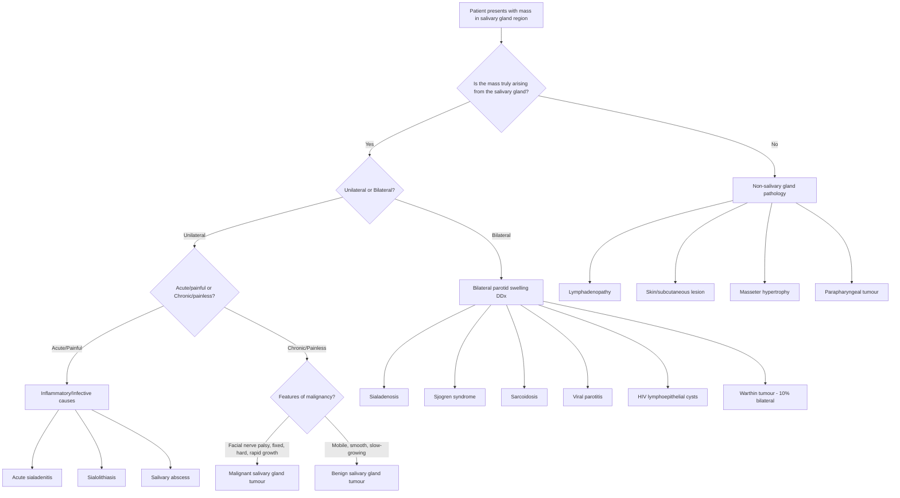

## Differential Diagnosis of Salivary Gland Tumours

The differential diagnosis of a salivary gland swelling is one of the most commonly tested clinical reasoning exercises. The core challenge is this: **not every swelling in the salivary gland region is a salivary gland tumour**, and even if it is a salivary gland tumour, you need to distinguish benign from malignant. Let's think about this systematically from first principles.

When a patient presents with a mass in the parotid, submandibular, or oral cavity region, you must work through a structured differential. The approach depends on:

1. **Location** — which gland region? Is it truly arising from the gland or from adjacent structures?
2. **Laterality** — unilateral vs bilateral
3. **Tempo** — acute, subacute, or chronic
4. **Associated features** — pain, nerve involvement, skin changes, systemic symptoms

---

### Approach Algorithm: Salivary Gland Region Mass

---

### A. Primary Salivary Gland Neoplasms (The "True" Differentials Among Tumour Types)

When you have confirmed a salivary gland mass is neoplastic, the differential is between the tumour subtypes. This is ultimately resolved by histology (FNA/core biopsy), but clinical features help narrow the differential:

| Feature | Pleomorphic Adenoma | Warthin's Tumour | Mucoepidermoid Ca | Adenoid Cystic Ca | Acinic Cell Ca | SCC | Carcinoma ex PA |
|---|---|---|---|---|---|---|---|
| Growth | Slow | Slow | Low-grade: slow; High-grade: rapid | Slow but relentless | Slow | Rapid | Sudden acceleration of long-standing mass |
| Pain | No | No | Low: No; High: ± | ***Yes — pain, paraesthesia*** [1] | Usually no | Yes | Variable |
| Facial nerve | Intact | Intact | Late involvement in high-grade | ***Facial weakness/paralysis*** [1] | Rare | Common | Common |
| Consistency | Firm, rubbery | Soft, fluctuant | Variable | Hard | Firm | Hard, stony | Hard within previously rubbery mass |
| Bilaterality | No | ***10% bilateral*** [2] | No | No | Rare | No | No |
| Key clue | Long-standing, tail of parotid | Smoker, older male, cystic on USS | Cystic on imaging if low-grade | Perineural invasion on MRI, submandibular gland | 2nd commonest parotid malignancy, favourable prognosis | ***Must rule out metastatic SCC and high-grade mucoepidermoid*** [1] | History of prior PA or long-standing parotid mass |

<Callout title="Key Clinical Reasoning">
The most important initial clinical question at the bedside is: **Is this benign or malignant?** The "red flags" for malignancy are: facial nerve palsy, rapid growth, pain/paraesthesia, fixation, skin involvement, and cervical lymphadenopathy [2]. If ANY of these are present, treat as malignant until proven otherwise.
</Callout>

---

### B. Non-Neoplastic Salivary Gland Conditions (Mimics of Salivary Gland Tumours)

These are critical differentials because they are **far more common** than salivary gland tumours and must be excluded before proceeding to tumour workup:

#### 1. ***Sialolithiasis (Salivary Gland Stones)*** [2]

- **Why it mimics a tumour**: A stone obstructing Wharton's or Stensen's duct causes **episodic swelling** of the gland that can become chronically enlarged and firm, mimicking a tumour
- **How to differentiate**: The hallmark is ***pain and swelling aggravated by eating*** (or even anticipation of eating) — because meals stimulate saliva production, increasing pressure behind the obstruction [6]. This waxing-and-waning pattern is **not** seen in tumours, which enlarge progressively
- ***80% occur in the submandibular gland*** [6] — because Wharton's duct is longer, runs against gravity, and submandibular saliva is more viscous (higher mucin content, higher calcium concentration)
- On examination, ***palpate the ducts for stones*** and ***express pus*** if infected [1]
- ***Chronic obstruction*** will eventually cause the gland to ***cease producing saliva***, and the ***gland will feel firm and may be mistaken for a focal mass*** with the patient being asymptomatic [6]

#### 2. ***Acute Bacterial Sialadenitis*** [3]

- ***Typically affects older adults, malnourished or post-operative patients*** [3] — reduced oral intake → reduced salivary flow → stasis → ascending bacterial infection via the duct
- ***Commonly caused by S. aureus*** [3]
- ***Characterized by sudden onset of a very firm and tender swelling*** with ***fever, chills and fairly marked systemic toxicity*** [3]
- ***Purulent discharge can be expressed from the affected duct orifice*** [3] — this is the key distinguishing sign from a tumour (tumours don't produce pus from the duct)
- **Why it mimics a tumour**: The acutely inflamed gland can be rock-hard due to oedema and cellulitis, mimicking a malignant mass. However, the acute onset, tenderness, fever, and pus from the duct all point to infection

#### 3. ***Chronic Bacterial Sialadenitis*** [3]

- ***Low-grade chronic infection that eventually leads to destruction of the salivary gland*** [3]
- ***Occurs more commonly in patients with decreased salivary secretion and increased mucus content in the saliva*** [3]
- ***Predisposing factors include stones, strictures and trauma*** [3]
- Results in a chronically enlarged, firm gland that can be very difficult to distinguish from a low-grade tumour on examination alone → imaging (USS/CT) and FNA are essential

#### 4. ***Chronic Sclerosing Sialadenitis (Kuttner's Tumour)*** [2]

- A specific form of chronic sialadenitis characterised by dense fibrosis and lymphocytic infiltration of the submandibular gland
- The name "Kuttner's tumour" itself tells you it mimics a neoplasm — it presents as a **hard, painless submandibular mass**
- Now increasingly recognised as part of the **IgG4-related disease** spectrum — check serum IgG4 levels
- **Why it mimics a tumour**: The fibrotic replacement makes the gland hard and irregular, essentially indistinguishable from submandibular gland carcinoma on palpation. FNA or biopsy is needed to make the distinction

#### 5. ***Viral Sialadenitis (Parotitis)*** [3]

- ***Commonly caused by mumps virus leading to acute pain and swelling of one or both parotid glands*** [3]
- ***Associated with non-specific prodrome consisting of low-grade fever, malaise, headache, myalgia and anorexia*** [3]
- **Why it's usually not confused with a tumour**: Bilateral involvement, acute onset, systemic symptoms, and self-limiting course (7–10 days) make this clinically distinct. However, unilateral viral parotitis in the early stages can briefly mimic a rapidly growing tumour
- Other viral causes: influenza, parainfluenza, coxsackievirus, EBV, CMV, HIV [7]

#### 6. ***Sjögren's Syndrome*** [2][3]

- ***Chronic inflammatory disorder characterized primarily by diminished lacrimal and salivary gland secretions resulting in symptoms of dry eyes and mouth (sicca complex)*** [3]
- ***Presents with a gradual swelling of parotid or submandibular glands, typically bilaterally*** [3]
- ***Autoimmune sialadenitis causes parenchymal destruction and dilation of intraglandular ducts*** [3]
- **Why it matters in the DDx of salivary gland tumour**: Sjögren's patients have a **15–20× increased risk of developing lymphoma** (MALT lymphoma) of the salivary gland. A unilateral, progressive enlargement of one gland in a known Sjögren's patient should raise suspicion for lymphomatous transformation
- Also associated with increased risk of other salivary gland tumours

#### 7. ***Salivary Cysts*** [2]

- Include mucoceles (from minor salivary glands), ranulas (sublingual gland retention cysts), and simple cysts of the major glands
- **Mucoceles**: painless, bluish, dome-shaped swellings on the lower lip (most common location) — caused by trauma to a minor salivary gland duct → extravasation of mucus into surrounding tissue
- **Ranulas**: translucent, bluish swelling in the floor of the mouth; a "plunging ranula" extends through the mylohyoid into the neck and can mimic a submandibular mass
- Usually soft/fluctuant on palpation, distinguishing them from solid tumours

#### 8. ***Lymphoepithelial Cysts*** [2]

- ***Benign cystic lesions*** of the parotid, particularly associated with **HIV infection**
- Bilateral parotid cystic enlargement in a young patient → think HIV-associated lymphoepithelial cysts
- Pathophysiology: HIV-driven reactive lymphoid hyperplasia within intraglandular lymph nodes leads to ductal obstruction → cyst formation
- On imaging, these appear as **multiple bilateral parotid cysts** — quite characteristic

---

### C. Non-Salivary Gland Pathology Presenting as a Salivary Gland Region Mass

These are lesions that are **not arising from the salivary gland** but present in the same anatomical region:

#### 1. ***Regional Lymphadenopathy*** [2]

- **This is the single most common mimic of a salivary gland tumour**, particularly in the submandibular and parotid regions
- ***It can be difficult to ascertain whether a mass is a parotid tumour versus parotid region lymph node*** [1]
- ***Cannot really differentiate between submandibular lymph nodes or submandibular gland tumour*** on palpation alone [1]
- Causes of lymphadenopathy:
  - **Reactive**: dental infections, pharyngitis, skin infections of the scalp/face
  - **Granulomatous**: tuberculosis (important in Hong Kong), sarcoidosis, cat-scratch disease
  - **Malignant**: lymphoma, metastatic SCC (from scalp/face/oral cavity), metastatic NPC (level II nodes mimicking parotid tail mass)

#### 2. ***Metastasis from Other Tumours*** [2]

- ***Metastatic SCC to intraglandular lymph nodes, usually from scalp SCC*** [1] — this is extremely important because the parotid contains intraglandular lymph nodes that drain the scalp, forehead, temple, and ear skin
- Cutaneous melanoma of the scalp/face can also metastasise to parotid nodes
- ***Metastatic H&N carcinoma is predominantly related to metastatic squamous cell carcinoma arising from the aerodigestive tract*** [5]
- Always examine the scalp, face, ears and oral cavity carefully in any patient with a parotid mass

<Callout title="Exam Pearl" type="idea">
A hard parotid mass in an elderly patient with a history of skin SCC or melanoma of the scalp is **metastatic disease to intraglandular lymph nodes until proven otherwise**. This is not a primary salivary gland tumour — it changes the management entirely (requires treatment of the primary cutaneous malignancy plus parotidectomy and neck dissection).
</Callout>

#### 3. ***Lymphoma*** [5]

- ***Tonsils and tongue base may be the presenting site for a lymphoma*** [5]
- Lymphoma can present as a parotid mass (arising from intraglandular lymph nodes) or as a submucosal oropharyngeal mass mimicking a minor salivary gland tumour
- ***Tissue diagnosis is required to make the diagnosis of a salivary gland tumour prior to definitive treatment whenever possible to avoid major surgery for a benign tumour or a lymphoma*** [2] — this point is critical because lymphoma is treated with chemotherapy/radiotherapy, NOT surgery. Performing a parotidectomy for what turns out to be lymphoma would be unnecessary morbidity
- MALT lymphoma of salivary glands is particularly associated with Sjögren's syndrome

#### 4. ***Parapharyngeal Space Tumours*** [8]

- ***Incidental finding; present during URTI; no trismus; 80% benign*** [8]
- These present as a medial bulge of the tonsillar pillar/soft palate on intraoral examination and can mimic a deep-lobe parotid tumour
- Include: deep lobe pleomorphic adenoma (most common), paragangliomas, schwannomas, neuromas
- The key distinguishing feature from a mucosal (minor salivary gland) tumour is that ***the overlying mucosa is normal*** (smooth) because the tumour is deep to the mucosa [8]

#### 5. ***Paraganglioma (Carotid Body Tumour / Chemodectoma)*** [5]

- ***Neoplasm arising from extra-adrenal chromaffin cells of the parasympathetic paraganglia*** [5]
- ***Pulsatile mass with a bruit on auscultation*** [5]
- ***Mobile in a side-to-side but not up-and-down direction (Fontaine's sign)*** [5] — because the carotid sheath allows lateral displacement but is tethered superiorly and inferiorly
- Located at the carotid bifurcation → can mimic a parotid tail or upper cervical mass
- ***Highly vascular and typically benign*** [5]

#### 6. ***Schwannoma*** [5]

- ***Neoplastic proliferation of Schwann cells; arise from any peripheral nerve and commonly from the vagus nerve or superior cervical sympathetic chain in the neck*** [5]
- ***Vagal schwannoma may cause hoarseness or aspiration*** [5]
- ***Sympathetic chain schwannoma may cause Horner's syndrome*** [5]
- Can present as a parapharyngeal or upper neck mass mimicking a salivary gland tumour

#### 7. ***Branchial Cleft Cyst*** [5]

- ***Accounts for 20% of paediatric neck masses*** [5]
- ***1st branchial cleft cyst*** passes through the parotid gland in close proximity to the facial nerve — directly mimics a parotid tumour [5]
- ***2nd branchial cleft cyst*** (most common) presents inferior to the angle of the mandible, anterior to SCM [5]
- ***Present in late childhood or early adulthood when a previously unrecognised cyst becomes infected*** [5]
- The key clue is the **age** (young patient), **location** (anterior to SCM), and **recurrent infections**

#### 8. Lipoma and Skin Lesions [5]

- ***Lipoma***: ***benign neoplasm comprised of fat; typically asymptomatic and presents as soft, ill-defined, slowly enlarging mass*** [5] — easily distinguished from a salivary gland tumour by its soft consistency and superficial location
- ***Epidermoid inclusion cyst, dermoids, or pilomatrixoma*** can also present as masses in the salivary gland region [5]
- ***Confirm the lesion is not arising from the skin*** on palpation [1] — if the mass moves with the skin, it's a skin/subcutaneous lesion, not a salivary gland tumour

#### 9. Masseter Hypertrophy / Bruxism [2]

- ***Bruxism (excess teeth grinding or jaw clenching)*** [2] and ***masseter hypertrophy*** [2] can cause bilateral parotid-region fullness
- Distinguished by: bilateral, no discrete mass, hypertrophied masseter palpable as a firm muscle bulk (ask the patient to clench their jaw), no abnormality on imaging of the parotid gland itself

---

### D. ***Differential Diagnosis of Bilateral Parotid Swelling*** [2]

Bilateral parotid swelling has a specific differential that is quite different from unilateral parotid masses. The unifying concept is that bilateral swelling almost always represents a **systemic or metabolic condition**, not a tumour (with the notable exception of Warthin's tumour):

| Condition | Mechanism | Key Features |
|---|---|---|
| ***Parotitis*** (viral) [2] | Viral infection of both glands | Acute, painful, febrile, self-limiting |
| ***Sjögren's syndrome*** [2][3] | Autoimmune destruction of salivary glands | Dry eyes + dry mouth, bilateral gradual swelling, ANA/anti-Ro/anti-La positive |
| ***Sialadenosis*** [2] | ***Non-inflammatory, non-neoplastic hypertrophy of salivary gland; usually bilateral and painless*** | Associated with: ***anorexia/bulimia nervosa (self-induced vomiting), alcoholic cirrhosis, diabetes mellitus*** [2] |
| ***Sarcoidosis*** [3] | ***Granulomatous infiltration*** of both parotids | ***Bilateral painless parotid enlargement***, may have Heerfordt syndrome (uveoparotid fever: parotitis + uveitis + facial nerve palsy + fever) |
| ***Drug-induced*** [2] | ***e.g., Phenytoin*** | Bilateral, painless, medication history |
| ***Bruxism / Masseter hypertrophy*** [2] | Mechanical hypertrophy | Bilateral fullness, no discrete mass, clench test |
| ***Warthin's tumour*** [2] | ***Bilateral in 10%*** | Older male smoker, soft/fluctuant |
| ***HIV lymphoepithelial cysts*** | Reactive lymphoid hyperplasia | Bilateral cystic parotid enlargement, young patient, check HIV status |

<Callout title="Clinical Rule" type="error">
A common exam mistake is to forget that **bilateral parotid swelling is almost never a primary salivary gland tumour** (except Warthin's tumour). Always think of systemic causes — sialadenosis, Sjögren's, sarcoidosis, viral parotitis, HIV — before considering neoplasia. If the examiner says "bilateral painless parotid enlargement," think metabolic/autoimmune first.
</Callout>

---

### E. Differentiating Oral Cavity Masses (Minor Salivary Gland Tumour vs Other Pathology)

***Minor salivary gland tumours may present as submucosal masses in the tongue base and soft palate*** [5]. The DDx of a submucosal oral cavity/oropharyngeal mass includes:

| Diagnosis | Key Features |
|---|---|
| Minor salivary gland tumour | Submucosal, ***normal overlying mucosa (smooth)*** [8][9], hard palate most common, painless unless malignant |
| ***Lymphoma*** [5] | ***Tonsils and tongue base may be the presenting site*** — rubbery, may be bilateral, systemic B symptoms |
| Oral cavity SCC | ***Ulcerative mucosal lesion*** [9], not submucosal; associated with smoking, alcohol, betel nut |
| Mucocele | Lower lip, bluish, fluctuant, young patient |
| Pleomorphic adenoma of palate | ***Lateral palate, submucosal mass*** [1], firm, painless, well-circumscribed |
| Deep extension of maxillary sinus tumour | ***May present with nasal symptoms*** [8] |

> ***Histology of oral cavity malignancy: epithelium (ulcerative) = SCC/adenocarcinoma; underlying structure (smooth overlying mucosa) = lymphoma/minor salivary gland tumour*** [9]. This distinction based on mucosal surface is a high-yield clinical pearl.

---

### F. Summary Table: Complete Differential Diagnosis of a Salivary Gland Mass

| Category | Differential Diagnoses |
|---|---|
| **Benign salivary neoplasms** | Pleomorphic adenoma, Warthin's tumour, basal cell adenoma, myoepithelioma, oncocytoma, canalicular adenoma |
| **Malignant salivary neoplasms** | Mucoepidermoid carcinoma, adenoid cystic carcinoma, acinic cell carcinoma, salivary duct carcinoma, carcinoma ex pleomorphic adenoma, SCC, lymphoepithelial carcinoma |
| **Inflammatory/Infective** | Acute bacterial sialadenitis, chronic sialadenitis, viral parotitis (mumps), salivary abscess, TB |
| **Obstructive** | Sialolithiasis, mucous plug, ductal stricture |
| **Autoimmune** | Sjögren's syndrome, IgG4-related disease (Kuttner's tumour) |
| **Cystic** | Salivary cysts, lymphoepithelial cysts (HIV), mucocele, ranula |
| **Systemic/Metabolic** | Sialadenosis (bulimia, alcoholic cirrhosis, DM), sarcoidosis, drug-induced (phenytoin) |
| **Non-salivary gland mimics** | Regional lymphadenopathy (reactive, TB, lymphoma, metastatic), branchial cleft cyst (1st), paraganglioma, schwannoma, lipoma, skin cyst, masseter hypertrophy |
| **Metastatic** | Cutaneous SCC → intraglandular parotid nodes, melanoma → parotid nodes, NPC → level II nodes |

---

<Callout title="High Yield Summary">

**Differential Diagnosis — Key Points for Exams:**

1. ***Not all parotid masses are salivary gland tumours*** — always consider lymphadenopathy, metastatic disease (especially scalp SCC to intraglandular parotid nodes), and lymphoma [1][2][5]
2. ***Tissue diagnosis (FNA/core biopsy) is required before definitive surgery*** to avoid performing a parotidectomy for lymphoma (which needs chemo/RT, not surgery) [2]
3. ***Cannot really differentiate submandibular LN from submandibular gland tumour on palpation alone*** [1] — imaging is essential
4. ***Bilateral parotid swelling → think systemic***: sialadenosis (bulimia, cirrhosis, DM), Sjögren's, sarcoidosis, viral parotitis, HIV cysts, drug-induced, bruxism [2]
5. ***Sialolithiasis***: waxing-and-waning pain with eating; 80% submandibular; can cause chronic gland enlargement mimicking tumour [6]
6. ***Kuttner's tumour***: chronic sclerosing sialadenitis (IgG4-related) mimicking submandibular carcinoma — hard, painless [2]
7. ***1st branchial cleft cyst*** passes through the parotid gland near the facial nerve — directly mimics a parotid tumour in young patients [5]
8. ***Parapharyngeal mass with normal overlying mucosa*** suggests deep-lobe tumour, paraganglioma, or schwannoma — NOT a mucosal primary [8]
9. ***Oral cavity submucosal smooth mass*** = minor salivary gland tumour or lymphoma; ***ulcerative mucosal mass*** = SCC [9]
10. ***Carotid body tumour*** is pulsatile, has a bruit, and is mobile side-to-side but not up-and-down (Fontaine's sign) [5]

</Callout>

---

<ActiveRecallQuiz
  title="Active Recall - Differential Diagnosis of Salivary Gland Tumours"
  items={[
    {
      question: "A patient presents with bilateral painless parotid enlargement. List 5 differential diagnoses and explain the unifying concept.",
      markscheme: "Bilateral painless parotid swelling is almost always systemic/metabolic, not neoplastic. DDx: (1) Sialadenosis (bulimia, cirrhosis, DM), (2) Sjogren syndrome, (3) Sarcoidosis, (4) Viral parotitis, (5) HIV lymphoepithelial cysts, (6) Drug-induced (phenytoin), (7) Warthin tumour (10% bilateral - only neoplastic exception).",
    },
    {
      question: "Why must tissue diagnosis be obtained before definitive surgery for a parotid mass? What is the key diagnosis you want to exclude?",
      markscheme: "To avoid performing unnecessary parotidectomy for lymphoma, which is treated with chemotherapy and radiotherapy, not surgery. Also to differentiate benign tumour (may need less extensive surgery) from malignant tumour (may need more extensive surgery with neck dissection).",
    },
    {
      question: "An elderly man with a history of scalp SCC presents with a hard parotid mass. What is the most likely diagnosis and why?",
      markscheme: "Metastatic cutaneous SCC to intraglandular parotid lymph nodes. The parotid is the only salivary gland containing intraglandular lymph nodes, which drain the scalp, forehead, temple, and ear skin. This is NOT a primary salivary gland tumour.",
    },
    {
      question: "How do you clinically distinguish sialolithiasis from a salivary gland tumour?",
      markscheme: "Sialolithiasis: pain and swelling aggravated by eating (increased saliva production behind obstruction), waxing-and-waning pattern, palpable stone in duct, pus expression. Tumour: progressive painless enlargement, no meal-related fluctuation, no pus, may have features of malignancy (nerve palsy, fixation).",
    },
    {
      question: "A smooth submucosal mass is found on the hard palate. What are the two main differential diagnoses, and how does mucosal surface appearance help you differentiate oral cavity lesions?",
      markscheme: "Main DDx: pleomorphic adenoma of minor salivary gland and minor salivary gland malignancy (e.g., adenoid cystic carcinoma, polymorphous adenocarcinoma). Rule: smooth overlying mucosa = submucosal origin (minor salivary gland tumour or lymphoma); ulcerative mucosal lesion = epithelial origin (SCC or adenocarcinoma).",
    },
  ]}
/>

## References

[1] Lecture slides: GC 217. Facial nerve palsy and salivary gland diseases.pdf (p41, p46, p59, p61, p68, p75, p77)
[2] Senior notes: felixlai.md (Salivary gland tumour, sections V–VI — differential diagnosis, bilateral parotid DDx)
[3] Senior notes: felixlai.md (Salivary gland diseases — sialadenitis, Sjögren's, sarcoidosis differential)
[5] Senior notes: felixlai.md (Neck mass differential — metastatic H&N carcinoma, paraganglioma, schwannoma, branchial cleft cyst, lipoma, lymphoma)
[6] Senior notes: felixlai.md (Sialolithiasis — pathogenesis, clinical features, chronic obstruction)
[7] Senior notes: felixlai.md (Parotitis — microbiology)
[8] Lecture slides: GC 219. Infections and tumours in pharynx and oral cavity.pdf (p24, p30 — parapharyngeal tumour, neoplasm benign vs malignant)
[9] Lecture slides: GC 219. Infections and tumours in pharynx and oral cavity.pdf (p34 — oral cavity malignancy histology)
