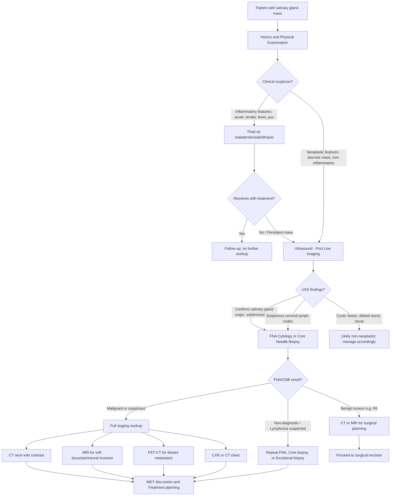

## Diagnosis of Salivary Gland Tumours

### Preamble: Why Is Diagnosis of Salivary Gland Tumours Challenging?

Salivary gland tumours pose a unique diagnostic challenge for several reasons:

1. ***Diverse histopathology*** [1] — over 30 subtypes exist, and FNA cytology alone often cannot specify the exact subtype
2. **Clinical overlap** — benign and low-grade malignant tumours can look identical on examination (both slow-growing, painless)
3. **Anatomical mimics** — ***it is difficult to ascertain whether a mass is a parotid tumour versus a parotid region lymph node*** [1]; similarly, ***cannot really differentiate between submandibular lymph nodes or submandibular gland tumour*** on palpation [1]
4. **The facial nerve runs through the parotid** — you cannot simply perform an incisional or punch biopsy of a parotid mass (risk of nerve injury and tumour spillage), so tissue diagnosis must be obtained carefully

The diagnostic approach therefore follows a structured sequence: **History → Physical Examination → Imaging → Tissue Diagnosis → Staging** (if malignant).

---

### I. History Taking

A targeted history is the first and most important step. You are trying to answer three questions: (1) Is this a salivary gland tumour? (2) Is it benign or malignant? (3) What might the subtype be?

#### ***History of Presenting Illness (HPI)*** [2]

| Question | Why You're Asking | What It Tells You |
|---|---|---|
| ***Duration of presence of mass*** [2] | Short history ( < 6 months) with rapid growth suggests malignancy; long history (years) with stable size suggests benign | A mass present for > 10 years with sudden growth = carcinoma ex pleomorphic adenoma |
| ***Rapidity and progression of growth*** [2] | Rate of growth is the single best clinical discriminator between benign and malignant | Slow + stable = benign; rapidly enlarging = high-grade malignancy |
| ***Pain and paraesthesia*** [2] | Pain indicates neural invasion or inflammation | Pain + paraesthesia = think adenoid cystic carcinoma (perineural invasion) |
| ***Facial muscle paralysis*** [2] | Facial nerve involvement = malignant until proven otherwise | Progressive, painless weakness with a mass ≠ Bell's palsy |
| Dysphagia, voice change | Suggests deep lobe/parapharyngeal extension | Oropharyngeal compression or CN X involvement |
| Trismus | Suggests pterygoid muscle or infratemporal fossa invasion | Locally advanced malignancy |
| Skin changes over the mass | Tethering, ulceration, fungation = invasion through capsule | High-grade malignancy with dermal invasion |
| Meal-related symptoms | Waxing-and-waning swelling with eating = obstruction | Sialolithiasis, not tumour |

#### ***Medical History*** [2]

- ***Previous skin cancer (e.g., SCC)*** [2] — metastatic cutaneous SCC to intraglandular parotid lymph nodes is a critical differential; ***must rule out metastatic SCC to intraglandular lymph nodes, usually from scalp SCC*** [1]
- ***Melanoma of scalp or facial region*** [2] — same mechanism as above
- Sjögren's syndrome — increased risk of MALT lymphoma and other salivary gland tumours
- HIV status — lymphoepithelial cysts, lymphoepithelial carcinoma

#### ***Drug History*** [2]

- ***Radiotherapy*** [2] — prior radiation to H&N region increases risk of salivary gland malignancy (10–30 year latency)
- Phenytoin, thiouracil — can cause bilateral parotid swelling (sialadenosis), not tumour

#### ***Social History*** [2]

- ***Smoking*** [2] — Warthin's tumour is strongly associated with smoking; also relevant for concurrent H&N SCC risk
- Alcohol — associated with sialadenosis (alcoholic cirrhosis) and synergistic risk for H&N SCC
- Betel nut chewing — oral cavity SCC risk

---

### II. Physical Examination

#### ***Head and Neck Examination*** [2]

A systematic examination of the salivary gland region is essential. Think of it as three steps: **Inspection → Palpation → Intraoral Examination**.

**A. Inspection**

- ***Intraoral inspection*** [1]:
  - ***Parotid duct opening*** (Stensen's duct — opposite upper 2nd molar) [1]
  - ***Submandibular duct opening*** (Wharton's duct — sublingual caruncle, floor of mouth) [1]
  - ***Floor of mouth swelling*** [1]
  - ***Tumour in floor of mouth/oral cavity*** [1]
  - ***Pus in the salivary duct openings*** [1] — suggests sialadenitis, not tumour
- Extraoral inspection:
  - Asymmetry of the face/jaw angle/neck
  - Skin changes: erythema, tethering, ulceration, scars from previous surgery
  - Facial nerve function — observe at rest for asymmetry, then test all five branches

**B. Palpation**

- ***Confirm the lesion is not arising from the skin*** [1] — if the mass moves with the skin, it's a cutaneous/subcutaneous lesion (epidermoid cyst, lipoma), not salivary gland
- Assess: ***Size, Tenderness, Mobility, Fixation to skin or underlying structures*** [2]
- ***Limitation in jaw opening*** [2] — trismus suggests pterygoid invasion (locally advanced)
- ***Pharyngeal asymmetry*** [2] — medial displacement of the tonsil/soft palate suggests deep lobe parotid tumour extending into the parapharyngeal space
- ***Buccal involvement*** [2] — minor salivary gland tumour of the buccal mucosa
- ***Palpate the ducts for stones*** and ***express pus*** [1] — bimanual palpation of Wharton's duct (one finger in the floor of the mouth, one externally) can detect submandibular stones
- ***Cervical lymphadenopathy*** [2] — systematic palpation of all cervical node levels (I–V)

**C. ***Facial Nerve Examination*** [2]**

- ***Document specific branch involvement if present*** [2]
- Test all five branches systematically:
  - **Temporal**: raise eyebrows, wrinkle forehead
  - **Zygomatic**: close eyes tightly (against resistance)
  - **Buccal**: puff cheeks, smile showing teeth
  - **Marginal mandibular**: depress lower lip, show lower teeth
  - **Cervical**: platysma contraction
- A complete examination should also include CN V (sensation), CN IX-XII (for parapharyngeal/skull base extension), and Horner's syndrome assessment

<Callout title="Examination Checklist for Salivary Gland Mass">

**Must-do on every salivary gland examination:**
1. Inspect intraorally (duct openings, pus, floor of mouth, palate, pharyngeal asymmetry)
2. Palpate the mass (size, consistency, mobility, fixation, tenderness)
3. Palpate the duct (stones, express pus)
4. Confirm it's not a skin lesion
5. Test ALL branches of the facial nerve and document findings
6. Examine the cervical lymph nodes systematically
7. Examine the scalp, ears, and facial skin for primary cutaneous malignancy (to rule out metastatic SCC/melanoma to parotid nodes)

</Callout>

---

### III. Diagnostic Algorithm

The following flowchart represents the standard clinical and investigative approach to a salivary gland mass. The principle is: **clinical assessment first → imaging to characterise → tissue diagnosis to confirm → staging if malignant**.

> ***Diagnosis requires: age, location and clinical features → imaging, FNA, excision → treatment depends on nature of pathology*** [10]

---

### IV. Investigation Modalities

#### A. First-Line: ***Ultrasound (USS)*** [1][2]

***Ultrasound is the first-line investigation*** [1] for any salivary gland mass. It is the logical starting point because it is non-invasive, radiation-free, inexpensive, widely available, and can be performed at the bedside.

**What USS tells you:**

| USS Finding | Interpretation |
|---|---|
| ***Confirm origin of mass*** [1] | Is the mass truly arising from the salivary gland, or from adjacent lymph nodes, skin, or muscle? |
| ***Enlarged neck lymph nodes*** [1] | Cervical lymphadenopathy suggests malignancy or metastatic disease |
| ***Stones*** [1] | Echogenic focus with posterior acoustic shadowing within the duct = sialolithiasis |
| ***Dilated ducts*** [1] | Suggests obstruction (stone or stricture) upstream of the dilatation |
| Solid vs cystic mass | Solid = more likely neoplasm; cystic = Warthin's, low-grade mucoepidermoid, cyst; mixed = pleomorphic adenoma (heterogeneous) |
| ***Tumour vs inflammation*** [1] | Inflammatory conditions show diffuse gland enlargement with increased vascularity; tumours show a discrete focal mass |
| ***Location of tumour*** [1] | Superficial vs deep; intra- vs extra-glandular |

**Why USS cannot be the final investigation**: USS cannot assess deep lobe extension, parapharyngeal space, skull base, or bone invasion. It also cannot reliably determine the histological subtype. Hence, cross-sectional imaging (CT/MRI) and tissue diagnosis are always needed for surgical planning.

**USS also ***facilitates fine needle aspiration (FNA) and core needle biopsy*** [2]** — ultrasound-guided sampling is more accurate than blind FNA, particularly for small or deep lesions.

---

#### B. ***Fine Needle Aspiration (FNA) Cytology*** [1][2]

***FNA for cytology can usually discriminate benign tumours from malignant tumours and metastasis but is less specific in the exact type of tumour*** [2].

**Why FNA is the preferred tissue sampling method for major salivary glands:**

1. **Safety**: Uses a 21–25 gauge needle — minimal risk of damaging the facial nerve (compared to larger core needles or incisional biopsy)
2. **No tumour spillage**: The fine needle creates a tiny puncture track with negligible risk of seeding tumour cells (a critical concern for pleomorphic adenoma, which recurs if there is capsular disruption)
3. **Quick and cheap**: Can be done in the outpatient clinic, often at the same time as USS
4. **Guides management**: The main clinical question FNA answers is: **Is this benign, malignant, or lymphoma?** This determines whether the patient needs:
   - Simple parotidectomy (benign)
   - Extended surgery + neck dissection + possible adjuvant radiotherapy (malignant)
   - Chemotherapy/radiotherapy without surgery (lymphoma)

***Tissue diagnosis is required to make the diagnosis of a salivary gland tumour prior to definitive treatment whenever possible to avoid major surgery for a benign tumour or a lymphoma*** [2]

**Limitations of FNA:**
- Sensitivity: ~85–95% for distinguishing benign vs malignant
- Specificity for exact histological subtype is lower (~60–75%) — e.g., low-grade mucoepidermoid carcinoma can look like a mucocele on FNA; adenoid cystic carcinoma can look like pleomorphic adenoma
- **Non-diagnostic rate**: ~5–15% — insufficient cells, blood-contaminated, or non-representative sampling
- Uses the **Milan System for Reporting Salivary Gland Cytopathology (MSRSGC)** (2018) for standardised reporting:

| Milan Category | Description | Risk of Malignancy | Recommended Management |
|---|---|---|---|
| I | Non-diagnostic | ~25% | Repeat FNA (USS-guided) |
| II | Non-neoplastic | ~10% | Clinical follow-up; treat underlying cause |
| III | Atypia of undetermined significance | ~20% | Repeat FNA or surgery |
| IVa | Benign neoplasm | ~5% | Surgery (e.g., superficial parotidectomy) |
| IVb | Salivary gland neoplasm of uncertain malignant potential | ~35% | Surgery |
| V | Suspicious for malignancy | ~60% | Surgery (may need more extensive resection) |
| VI | Malignant | ~90% | Surgery + staging + adjuvant therapy as needed |

<Callout title="Key Principle">
FNA is a **screening tool**, not the definitive diagnostic test. The definitive histological diagnosis comes from the **excision specimen** (parotidectomy or submandibulectomy). FNA guides the extent of initial surgery — e.g., if FNA shows "benign neoplasm consistent with pleomorphic adenoma," you proceed with superficial parotidectomy with facial nerve preservation. If FNA shows "malignant," you plan for total parotidectomy ± neck dissection ± adjuvant radiotherapy.
</Callout>

---

#### C. ***Core Needle Biopsy (Trucut)*** [1][2]

***Trucut*** (core needle biopsy) [1] provides a core of tissue with preserved architecture, allowing histological (not just cytological) analysis. This gives more information about the subtype and grade.

***Core needle biopsy has risks of bleeding, nerve injury and tumour seeding*** [2]

**When to use core biopsy instead of FNA:**
- Non-diagnostic FNA (repeated)
- Suspicion of lymphoma (FNA cannot provide the architectural information needed for lymphoma subtyping — need tissue for flow cytometry, immunohistochemistry)
- Need to distinguish high-grade subtypes where FNA is ambiguous

**Risks (why it's not first-line for all cases):**
- **Nerve injury**: The larger-bore needle (14–18 gauge) has a small but real risk of damaging the facial nerve or its branches within the parotid
- **Bleeding**: More tissue disruption → haematoma risk
- ***Tumour seeding***: Larger track → theoretical risk of implanting tumour cells along the needle path; particularly concerning for pleomorphic adenoma

---

#### D. ***Incisional Biopsy*** [1]

***Incisional biopsy — tumour spillage; for minor salivary glands only*** [1]

**Why incisional biopsy is generally AVOIDED for major salivary glands:**
- Risk of **tumour spillage** — particularly for pleomorphic adenoma, where capsular disruption leads to multifocal recurrence
- Risk of **facial nerve injury** in the parotid
- Risk of **fistula formation**
- Creates tissue planes that make subsequent definitive surgery more difficult

**When it IS appropriate:**
- ***For minor salivary glands only*** [1] — e.g., a submucosal hard palate mass can be biopsied transorally because:
  - No facial nerve is at risk
  - The biopsy site will be included in the definitive surgical resection specimen
  - The clinical situation demands tissue diagnosis before committing to potentially disfiguring palatal surgery

---

#### E. ***Excisional Biopsy*** [1]

***Excisional biopsy: Parotidectomy, Submandibulectomy*** [1]

In many cases, the definitive diagnosis is only obtained when the entire tumour is excised. This is particularly true when:
- FNA is repeatedly non-diagnostic
- There is high clinical suspicion of neoplasm despite equivocal FNA
- The tumour is small and the definitive surgery (superficial parotidectomy or submandibulectomy) serves as both diagnostic and therapeutic

The concept: you are performing a **therapeutic excision that simultaneously provides the definitive histological diagnosis**. This is the standard approach for most parotid tumours — you don't wait for a confirmed histological diagnosis before offering parotidectomy if the clinical and imaging picture is consistent with a benign neoplasm (e.g., pleomorphic adenoma on FNA + typical USS/MRI features).

---

#### F. ***CT Scan*** [1][2]

***CT scan/CT sialogram*** [1] provides cross-sectional anatomical detail:

| CT Finding | Interpretation |
|---|---|
| ***Delineate deep lobe vs superficial lobe tumour*** [1] | Critical for surgical planning — deep lobe tumours require a different approach (total parotidectomy) |
| ***Differentiate salivary gland swelling vs other pathologies*** [1] | Distinguishes glandular from non-glandular lesions (lymph node, parapharyngeal tumour) |
| ***Enlarged lymph nodes*** [1] | Features of pathological LN: ***size > 1.0 cm in minimal axial diameter, rounded shape, heterogeneous contrast enhancement, loss of normal fatty hilum, central necrosis*** [11] |
| ***Bony invasion*** [1] | ***Temporal bone or mandibular destruction is best identified by CT scan*** [2] — critical for staging and resectability |
| ***Cervical LN*** [1] | Staging of regional nodal disease |

**Why CT and not just USS?**
- USS cannot see deep to bone (temporal bone, skull base, mandible)
- USS cannot evaluate the parapharyngeal space adequately
- CT provides the **3D anatomical roadmap** needed for surgical planning
- ***CT is superior to MRI in terms of providing greater spatial resolution, faster acquisition time and better for evaluation of bony destruction*** [11]

**CT sialogram**: CT performed after injection of contrast medium into the salivary duct — demonstrates ductal anatomy, strictures, filling defects (stones), and the relationship of a mass to the ductal system. Less commonly used now that MRI sialography is available.

---

#### G. ***MRI Scan*** [1][2]

MRI is the **gold standard imaging modality** for salivary gland tumours, particularly for the parotid gland. It provides:

| MRI Advantage | Detail |
|---|---|
| ***Accurate delineation of extent of invasion*** [1] | Superior soft tissue contrast compared to CT → better defines tumour margins, capsule integrity, and relationships to adjacent structures |
| ***Maybe able to see nerve invasion*** [1] | ***Detailed evaluation of soft tissue infiltration, perineural invasion and intracranial extension*** [2] — this is critical for adenoid cystic carcinoma. Enhancement and thickening of the facial nerve or its branches on post-gadolinium T1-weighted images suggests perineural invasion |
| Deep lobe / parapharyngeal extent | ***Assess pharyngeal space for involvement from lesions in parotid*** [2] |
| Relationship to facial nerve | Although the facial nerve is difficult to see directly, its course can be inferred from the retromandibular vein (which runs parallel to the nerve). Advanced MRI sequences (diffusion tensor imaging) may directly visualise the nerve |

**MRI signal characteristics of common tumours:**

| Tumour | T1 Signal | T2 Signal | Key MRI Feature |
|---|---|---|---|
| Pleomorphic adenoma | Low–intermediate | Very high (bright) | Homogeneous, well-defined, T2 bright (due to high water content of myxoid stroma). Delayed enhancement on dynamic contrast-enhanced MRI |
| Warthin's tumour | Low–intermediate | Intermediate–low | Lower T2 signal than PA (due to lymphoid stroma). Early enhancement with rapid washout on dynamic MRI. May show cystic spaces |
| Mucoepidermoid Ca (low-grade) | Low | High | Can mimic PA; cystic component bright on T2 |
| Mucoepidermoid Ca (high-grade) | Low | Intermediate | Solid, poorly defined, enhancing. Looks aggressive |
| Adenoid cystic Ca | Low | Intermediate–high | Look for perineural spread (thickened, enhancing nerves on post-gad T1), ill-defined margins, cribriform pattern can show targetoid appearance |
| Carcinoma ex PA | Low | Mixed (high and low) | A heterogeneous mass with areas of both PA-like signal and new solid aggressive-looking component |

<Callout title="MRI vs CT — When to Use Which?" type="idea">

- **CT**: Better for bony invasion (temporal bone, mandible), faster acquisition, better spatial resolution, good for cervical LN assessment
- **MRI**: Better for soft tissue delineation, perineural invasion, intracranial extension, parapharyngeal space assessment, facial nerve relationship
- **In practice**: Many centres obtain **both** CT and MRI for malignant salivary gland tumours to get complementary information. For presumed benign tumours, MRI alone is often sufficient for surgical planning.

</Callout>

---

#### H. ***PET-CT*** [1][2]

***PET-CT: Workup for distant metastasis*** [1]

- **Principle**: FDG-PET detects metabolically active cells (cancer cells with high glucose uptake). Combined with CT, it provides both functional and anatomical information
- **Role in salivary gland tumours**:
  - ***Evaluate for lymph node and distant metastasis*** [2] — lungs, bone, liver
  - ***PET scan is superior to both CT and MRI for detecting regional nodal metastasis as well as distant metastasis and second primary tumours*** [11]
  - Particularly important for adenoid cystic carcinoma (propensity for distant haematogenous metastasis, especially lungs)
  - Can detect **synchronous primary tumours** in the rest of the aerodigestive tract (field cancerisation concept)
- **Limitations**: 
  - Low-grade tumours (e.g., low-grade mucoepidermoid, acinic cell carcinoma) may not be FDG-avid → false negatives
  - Warthin's tumour and pleomorphic adenoma can be FDG-avid → false positives
  - Not routinely used for clearly benign tumours

---

#### I. Other Investigations

**Chest X-ray (CXR)**
- ***CXR*** [12] — baseline screening for pulmonary metastases, particularly relevant for adenoid cystic carcinoma
- Quick, cheap, and available everywhere; if suspicious, follow up with CT chest

**Panendoscopy**
- ***Panendoscopy + biopsy*** [12] — direct laryngoscopy + bronchoscopy + oesophagoscopy (OGD)
- Required when: (a) ***10% risk of synchronous/metachronous tumour (field cancerisation)*** [12] in patients with H&N malignancy, (b) looking for a primary in patients presenting with metastatic cervical LN of unknown primary
- ***Panendoscopy may identify synchronous primaries that are too small to be identified with PET scan*** [11]

**Blood Tests**
- Routine bloods (FBC, RFT, LFT) — baseline for surgical fitness
- Serum IgG4 — if chronic sclerosing sialadenitis (IgG4-related disease / Kuttner's tumour) is suspected
- Anti-Ro/Anti-La, ANA — if Sjögren's syndrome is in the differential
- EBV serology/DNA — if lymphoepithelial carcinoma is suspected (particularly relevant in Hong Kong)
- HIV test — if bilateral cystic parotid enlargement in a young patient

**Tc-99m Pertechnetate Scintigraphy (Technetium Scan)**
- Largely historical but worth knowing: Warthin's tumour and oncocytoma appear as **"hot" (warm)** nodules because their oncocytic cells actively concentrate technetium. Most other salivary gland tumours appear **"cold"**
- Rarely used in current practice (replaced by USS, MRI, and PET-CT)

---

### V. Staging of Malignant Salivary Gland Tumours

Once a malignant diagnosis is confirmed, **AJCC/UICC TNM staging (8th Edition, 2017)** is applied. Staging is performed using the combined clinical, imaging, and pathological data.

**T Staging (Primary Tumour — Major Salivary Glands)**

| T Stage | Criteria |
|---|---|
| T1 | Tumour ≤ 2 cm without extraparenchymal extension |
| T2 | Tumour > 2 cm but ≤ 4 cm without extraparenchymal extension |
| T3 | Tumour > 4 cm and/or with extraparenchymal extension |
| T4a | Tumour invades skin, mandible, ear canal, and/or facial nerve |
| T4b | Tumour invades skull base, pterygoid plates, or encases carotid artery |

*Extraparenchymal extension* = clinical or macroscopic evidence of invasion of soft tissues or nerve (except T4a/b categories). Microscopic extraparenchymal extension alone does not constitute T3.

**N Staging** — uses the same N staging system as other H&N cancers (incorporating extranodal extension, ENE):

| N Stage | Criteria |
|---|---|
| N0 | No regional lymph node metastasis |
| N1 | Single ipsilateral LN ≤ 3 cm, ENE− |
| N2a | Single ipsilateral LN > 3 cm but ≤ 6 cm, ENE− |
| N2b | Multiple ipsilateral LN ≤ 6 cm, ENE− |
| N2c | Bilateral or contralateral LN ≤ 6 cm, ENE− |
| N3a | Any LN > 6 cm, ENE− |
| N3b | Any LN with ENE+ |

***Features of pathological lymph nodes on CT*** [11]:
- ***Size > 1.0 cm in minimal axial diameter***
- ***Rounded shape***
- ***Heterogeneous contrast enhancement***
- ***Loss of normal fatty hilum***
- ***Central necrosis***

**M Staging**

| M Stage | Criteria |
|---|---|
| M0 | No distant metastasis |
| M1 | Distant metastasis (lung, bone, liver) |

---

### VI. Summary: Investigation Modalities at a Glance

| Investigation | Role | Key Findings |
|---|---|---|
| ***Bedside USS*** [1] | ***First line; tumour vs inflammation; location; cervical LN*** | Solid/cystic mass; stones; dilated ducts; LN |
| ***FNA cytology*** [2] | ***Discriminate benign vs malignant vs metastasis; guide surgery*** | Milan classification I–VI |
| ***Core biopsy (Trucut)*** [1] | Lymphoma suspicion; non-diagnostic FNA; subtype needed | Tissue architecture preserved; risk of nerve injury and seeding |
| ***Incisional biopsy*** [1] | ***Minor salivary glands only; risk of tumour spillage*** | Direct tissue diagnosis of submucosal palatal/oral lesions |
| ***Excisional biopsy*** [1] | ***Parotidectomy / Submandibulectomy — diagnostic + therapeutic*** | Definitive histological diagnosis |
| ***CT scan*** [1] | ***Bony invasion; cervical LN; deep vs superficial lobe*** | Temporal bone/mandible destruction; pathological LN features |
| ***MRI*** [1] | ***Accurate delineation of invasion; perineural invasion; intracranial extension*** | T2 signal characteristics; nerve enhancement; parapharyngeal extent |
| ***PET-CT*** [1] | ***Distant metastasis workup*** | FDG-avid disease; synchronous primaries |
| ***CXR*** [12] | Baseline pulmonary screening | Lung metastases (especially adenoid cystic carcinoma) |
| ***Panendoscopy*** [12] | Synchronous primary detection; field cancerisation | 10% synchronous/metachronous tumour risk |

---

<Callout title="High Yield Summary">

**Diagnosis of Salivary Gland Tumours — Must-Know Points:**

1. ***Ultrasound is the first-line investigation*** — confirms origin, differentiates tumour vs inflammation, identifies stones and dilated ducts, guides FNA [1]
2. ***FNA cytology is the primary tissue sampling method*** — discriminates benign vs malignant vs lymphoma; less specific for exact subtype; uses Milan System for standardised reporting [2]
3. ***Tissue diagnosis is required before definitive treatment whenever possible*** — to avoid unnecessary major surgery for lymphoma or benign disease [2]
4. ***Incisional biopsy is for minor salivary glands only*** — tumour spillage risk makes it inappropriate for parotid/submandibular [1]
5. ***CT is best for bony invasion*** (temporal bone, mandible destruction) and ***cervical LN assessment*** [1][2]
6. ***MRI is best for soft tissue delineation, perineural invasion, and intracranial extension*** — gold standard for surgical planning [1][2]
7. ***PET-CT is for distant metastasis workup*** — superior to CT/MRI for nodal and distant staging [1]
8. ***Excisional biopsy (parotidectomy/submandibulectomy)*** is both diagnostic and therapeutic — often the definitive step when FNA suggests benign neoplasm [1]
9. ***Core needle biopsy risks***: bleeding, nerve injury, tumour seeding [2]
10. For malignant tumours, staging uses **AJCC TNM 8th Edition**: T based on size and extraparenchymal extension; N includes extranodal extension; CT features of pathological LN include size > 1.0 cm, rounded, central necrosis, loss of fatty hilum [11]

</Callout>

---

<ActiveRecallQuiz
  title="Active Recall - Diagnosis of Salivary Gland Tumours"
  items={[
    {
      question: "What is the first-line investigation for a salivary gland mass and what four things does it assess?",
      markscheme: "Ultrasound. Assesses: (1) confirms origin of mass (salivary gland vs other), (2) stones and dilated ducts, (3) cervical lymph nodes, (4) tumour vs inflammation. Also guides FNA.",
    },
    {
      question: "Why is incisional biopsy avoided for parotid gland tumours but acceptable for minor salivary gland tumours?",
      markscheme: "Parotid: risk of tumour spillage (especially pleomorphic adenoma leading to multifocal recurrence), risk of facial nerve injury, disrupts tissue planes for subsequent surgery. Minor salivary glands: no facial nerve at risk, biopsy site included in definitive surgical resection, tissue diagnosis needed before committing to potentially disfiguring surgery.",
    },
    {
      question: "Describe the key advantage of MRI over CT and the key advantage of CT over MRI in salivary gland tumour assessment.",
      markscheme: "MRI advantage: superior soft tissue delineation, can detect perineural invasion and intracranial extension. CT advantage: superior spatial resolution, faster acquisition, better evaluation of bony destruction (temporal bone, mandible).",
    },
    {
      question: "What are five CT features of a pathological lymph node in the neck?",
      markscheme: "(1) Size greater than 1.0 cm in minimal axial diameter, (2) Rounded shape, (3) Heterogeneous or increased contrast enhancement, (4) Loss of normal fatty hilum, (5) Central necrosis.",
    },
    {
      question: "Why is tissue diagnosis required before definitive surgery for a salivary gland mass? What specific diagnosis must you not miss preoperatively?",
      markscheme: "To avoid performing unnecessary parotidectomy for lymphoma, which requires chemotherapy/radiotherapy, not surgery. Also to plan the extent of surgery (simple parotidectomy for benign vs total parotidectomy plus neck dissection for malignant). Must not miss: lymphoma.",
    },
    {
      question: "A pleomorphic adenoma appears bright on T2-weighted MRI while a Warthin tumour has intermediate-to-low T2 signal. Explain the pathological basis for this difference.",
      markscheme: "Pleomorphic adenoma has abundant myxoid (water-rich) stroma giving high T2 signal. Warthin tumour has dense lymphoid stroma and oncocytic epithelium with less free water, giving lower T2 signal. Additionally, Warthin tumour shows early enhancement with rapid washout on dynamic MRI due to its high vascularity.",
    },
  ]}
/>

## References

[1] Lecture slides: GC 217. Facial nerve palsy and salivary gland diseases.pdf (p40, p41, p43, p46, p49, p59, p77)
[2] Senior notes: felixlai.md (Salivary gland tumour, sections VI — Diagnosis: history, physical examination, FNA, imaging)
[10] Lecture slides: GC 218. I have a swelling in the neck Neck mass.pdf (p13 — Summary: diagnosis by age, location, clinical features; investigation by imaging, FNA, excision)
[11] Senior notes: felixlai.md (Head and neck cancer, section V — Diagnosis: CT features of pathological LN, MRI, panendoscopy, PET)
[12] Lecture slides: GC 219. Infections and tumours in pharynx and oral cavity.pdf (p42 — Workup and investigation: panendoscopy, CXR, FNAC, CT/MRI, PET)
