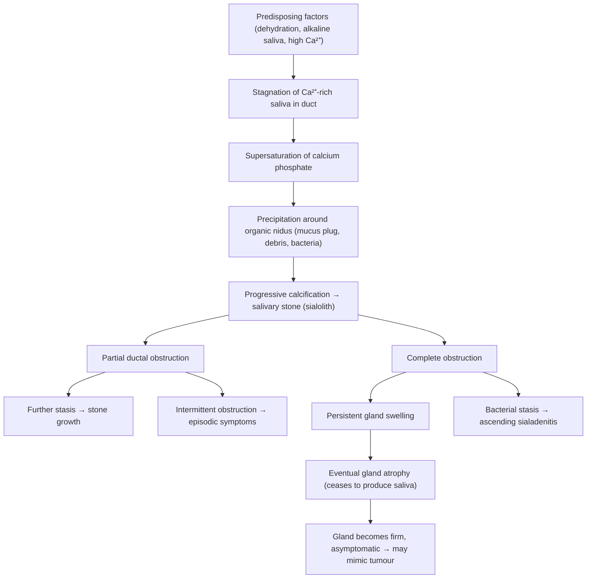

# Sialolithiasis

## 1. Definition

Sialolithiasis (from Greek: *sialon* = saliva, *lithos* = stone, *-iasis* = condition/disease) refers to the formation and presence of calcified stones (calculi) within the salivary glands or their ductal systems [1][2]. It is the most common cause of obstructive salivary gland disease and the most common benign non-neoplastic condition of the salivary glands.

When stones obstruct salivary outflow, this leads to **sialadenitis** (*sialon* = saliva, *aden* = gland, *-itis* = inflammation) — i.e., inflammation of the salivary gland — which is secondary to ductal obstruction and stasis [2]. So think of sialolithiasis as the primary pathology (the stone) and sialadenitis as its chief complication (the infection/inflammation).

<Callout title="Key Distinction">
Sialolithiasis = the stone itself. Sialadenitis = the gland inflammation (which can be caused by stones, autoimmune disease like Sjögren's, or ascending bacterial infection). They are related but distinct entities. The lecture slides emphasize that ***chronic sialadenitis is most commonly caused by stones*** [1].
</Callout>

---

## 2. Epidemiology

- **Prevalence**: Sialolithiasis affects approximately 1.2% of the population. It accounts for ~50–60% of all major salivary gland disease [2].
- **Age**: Typically occurs in individuals aged ***30–60 years***, with peak incidence in the 4th–6th decades [2].
- **Sex**: Slight **female predominance** (some sources say male predominance — exam-wise, know that it is roughly equal with a slight lean depending on the series) [2].
- ***Only 1 stone in ¾ (75%) of cases*** — meaning most patients present with a single calculus. Multiple stones occur in ~25% [1].
- **Recurrence**: Recurrence rate after removal is approximately 10–20%, particularly in the submandibular gland.

### Gland-Specific Distribution

| Feature | Submandibular Gland | Parotid Gland | Sublingual / Minor Glands |
|---|---|---|---|
| ***Frequency*** | ***80%*** of all sialolithiasis [1][3] | ***20%*** [1] | Rare |
| Stone size | Tend to be **larger** | Tend to be **smaller, multiple** | Variable |
| Stone location | **More often in the duct** (Wharton's duct) | **More often within the gland itself** | Variable |
| ***Radiopacity*** | ***90% radiopaque*** [1] | ***90% radiolucent*** [1] | Variable |

<Callout title="High Yield — Why Submandibular Gland?" type="idea">
The submandibular gland accounts for 80% of sialolithiasis. This is not random — it is entirely explained by anatomy and physiology (see Section 4 below). The parotid gland accounts for ~20%, and sublingual/minor glands are rarely affected [1][3].
</Callout>

---

## 3. Anatomy and Function of the Salivary Glands

Understanding the anatomy is absolutely essential to understanding why stones form where they do.

### 3.1 Major Salivary Glands

***There are three pairs of major salivary glands*** [1]:
- ***2 parotid glands***
- ***2 submandibular glands***
- ***2 sublingual glands***

Additionally, there are ***hundreds of minor salivary glands*** scattered throughout the ***oral cavity, tongue base, larynx, and nasopharynx*** [1].

### 3.2 Parotid Gland and Stensen's Duct

- The **parotid gland** is the largest salivary gland, located anterior and inferior to the ear, draped over the posterior ramus of the mandible.
- Its duct is **Stensen's duct** (parotid duct):
  - Arises from the **anterior border** of the parotid gland
  - Is approximately **4–7 cm long** [2]
  - Crosses the masseter muscle, pierces the buccinator
  - ***Opens opposite the upper second molar tooth*** on the buccal mucosa (at the parotid papilla) [2]
- The **facial nerve (CN VII)** runs *through* the substance of the parotid gland, dividing it into superficial and deep lobes. This is critically important surgically — any surgery on the parotid risks facial nerve injury.
- The parotid gland produces **serous** (watery) saliva.

### 3.3 Submandibular Gland and Wharton's Duct

- The **submandibular gland** lies in the submandibular triangle, below the floor of the mouth and wraps around the posterior border of the mylohyoid muscle.
- Its duct is **Wharton's duct** (submandibular duct):
  - Runs from the deep part of the gland, coursing anteriorly and superiorly along the floor of the mouth
  - ***Opens at the sublingual caruncle*** (small papilla on either side of the lingual frenulum) on the floor of the mouth [2]
  - The duct is **long (~5 cm)** and **tortuous**, and courses **upward against gravity** from the gland to its opening
- The submandibular gland produces **mixed** (serous + mucinous) saliva — importantly, the mucinous component makes the saliva more viscous and alkaline.
- The **lingual nerve** (branch of CN V3) and **hypoglossal nerve (CN XII)** are in close relation to the gland and duct — relevant for surgical complications.

### 3.4 Sublingual Gland

- Smallest of the major salivary glands, lies beneath the mucosa of the floor of the mouth.
- Drains via multiple small ducts (ducts of Rivinus), some of which join to form the **duct of Bartholin**, which opens into or near Wharton's duct.
- Produces predominantly **mucinous** saliva.

### 3.5 Saliva Composition and Function

Saliva has multiple critical functions:
- **Lubrication** and facilitation of swallowing
- **Antimicrobial** (contains IgA, lysozyme, lactoferrin)
- **Buffering** of oral pH
- **Digestive** (salivary amylase for starch)
- **Remineralisation** of teeth (calcium and phosphate)

Normal daily salivary output is approximately **1–1.5 litres/day**. The submandibular glands contribute ~70% of resting salivary output. The parotid glands contribute the majority of stimulated salivary output.

---

## 4. Etiology and Risk Factors (with Pathophysiology)

### 4.1 Why the Submandibular Gland is Most Commonly Affected

This is a favourite exam question. ***80% of sialolithiasis occurs in the submandibular gland*** [1][3] because of four anatomical and physiological reasons:

1. **Wharton's duct is long and large** — a longer ductal system gives more opportunity for stasis and stone formation [2].
2. **Saliva flow is against gravity** — the duct courses superiorly from the gland (below the mylohyoid) to its opening on the floor of the mouth. Gravity works against drainage [2].
3. **Saliva is more alkaline** — the higher pH favours calcium phosphate precipitation [2].
4. **Higher mucin and Ca²⁺ content** — submandibular saliva is mixed seromucinous (more viscous), with higher calcium concentration. This is the key substrate for calculus formation [2].

In contrast, the parotid gland produces serous (watery, low-viscosity) saliva with lower calcium content, and Stensen's duct is shorter and more horizontal — all protective against stone formation.

<Callout title="Exam Must-Know">
When asked "Why is sialolithiasis most common in the submandibular gland?", always give these four reasons: (1) long duct, (2) flow against gravity, (3) alkaline saliva, (4) high mucin and calcium content. This is a classic exam answer [2].
</Callout>

### 4.2 Stone Composition

Salivary stones are composed largely of **calcium phosphate** and **hydroxyapatite** (the same mineral found in bone and teeth), embedded in an organic matrix of glycoproteins and mucopolysaccharides [2]. This is why most submandibular stones (90%) are radiopaque — they are heavily calcified. Parotid stones tend to have more organic matrix and less calcification, which is why 90% are radiolucent [1].

### 4.3 Risk Factors

| Category | Risk Factor | Mechanism |
|---|---|---|
| **Hydration** | ***Dehydration*** | Reduced salivary flow → stasis → supersaturation of calcium salts |
| **Metabolic** | ***Hypercalcaemia*** (e.g., hyperparathyroidism) | Increased calcium in saliva → favours stone precipitation |
| | ***Gout*** (hyperuricaemia) | Uric acid crystals can serve as nidus; altered salivary composition |
| | ***Nephrolithiasis*** | Shared metabolic predisposition (hypercalciuria, dehydration) [2] |
| **Oral** | ***Chronic periodontal disease*** | Local inflammation and debris may serve as a nidus for stone formation |
| **Drugs** | ***Anticholinergics*** | Reduce salivary secretion → stasis → stone formation [2] |
| | ***Diuretics*** | Cause systemic dehydration → reduced salivary flow |
| **Social** | ***Smoking*** | Reduces salivary flow; alters saliva composition; chronic inflammation of ducts |
| | ***Trauma*** | Direct ductal injury → stricture → obstruction → stasis [2] |

<Callout title="Drug History is Key" type="error">
Always ask about anticholinergics (e.g., antihistamines, tricyclic antidepressants, antipsychotics, oxybutynin) and diuretics. These are common culprits that reduce salivary flow and predispose to stone formation. Post-operative patients who are NPO, intubated, and on anticholinergics are at particular risk [2].
</Callout>

---

## 5. Pathophysiology

### 5.1 Mechanism of Stone Formation

The fundamental process is:

Step by step:

1. **Stagnation**: Any factor that reduces salivary flow (dehydration, drugs, anatomical kinking) causes saliva to pool, particularly in the long, gravity-dependent Wharton's duct [2].

2. **Supersaturation**: The stagnant saliva, already rich in Ca²⁺ and mucin, becomes supersaturated with calcium phosphate.

3. **Nucleation**: Precipitation occurs around an organic nidus — this can be a mucus plug, desquamated epithelial cells, bacteria, or even foreign material. This is analogous to Randall's plaque in nephrolithiasis (calcium crystals in the interstitial space serving as a nidus) [4].

4. **Stone growth**: Layers of calcium phosphate and hydroxyapatite are deposited concentrically around the nidus, forming a progressively larger calculus.

5. **Obstruction**: The stone partially or completely obstructs the duct.

### 5.2 Consequences of Obstruction

- **Partial obstruction** → ***episodic, meal-related swelling and pain*** (saliva production increases with eating but cannot drain past the stone → gland swells → pain → as eating stops, gland slowly decompresses → symptoms resolve) [1][2].

- **Complete, chronic obstruction** [2]:
  - Initially: persistent gland swelling
  - Over time: the gland **ceases to produce saliva** (pressure atrophy of acinar cells)
  - The gland becomes **firm and fibrosed**, and swelling actually *regresses*
  - This can be mistaken for a **focal mass/tumour** clinically
  - Patient becomes **asymptomatic** — no saliva production means no build-up of pressure

- ***Chronic sialadenitis*** results from ***destruction of gland tissue after acute infection*** and ***blockage of saliva drainage*** [1].

<Callout title="Clinical Pearl" type="idea">
A firm, non-tender submandibular gland that the patient says "used to swell but doesn't anymore" is classic for chronic obstruction with gland atrophy. Don't mistake it for a tumour. The history of prior episodic meal-related swelling is the key differentiator.
</Callout>

### 5.3 Sialadenitis as a Complication

***Stagnant saliva behind an obstructing stone is an ideal culture medium for bacteria*** [3]. Bacteria from the oral cavity can ascend through the duct orifice into the stagnant pool, causing:
- ***Acute sialadenitis***: fever, chills, severe pain, erythema, purulent discharge from the duct orifice [3]
- ***Abscess formation***: if untreated, may threaten the airway (particularly submandibular space infections → Ludwig's angina) [2]

***Complications of sialolithiasis include: sialadenitis, ductal ectasia, and stricture*** [1].

---

## 6. Classification

Sialolithiasis can be classified by several axes:

### 6.1 By Gland Involved

| Gland | Frequency | Notes |
|---|---|---|
| ***Submandibular*** | ***80%*** | Most common; stones larger, usually in duct [1] |
| ***Parotid*** | ***20%*** | Stones smaller, often intraglandular [1] |
| Sublingual | Rare | Very uncommon |
| Minor salivary glands | Very rare | Case reports |

### 6.2 By Location Within the Ductal System

- **Intraductal** (within the duct) — more common in submandibular stones; more amenable to transoral removal or sialoendoscopy
- **Intraglandular** (within the gland parenchyma) — more common in parotid stones; often requires gland excision if symptomatic

### 6.3 By Number

- ***Single stone: ~75% of cases*** [1]
- Multiple stones: ~25%

### 6.4 By Radiopacity

- ***Submandibular stones: ~90% radiopaque*** (visible on plain X-ray) [1]
- ***Parotid stones: ~90% radiolucent*** (NOT visible on plain X-ray) [1]

This distinction is clinically important because it determines the initial imaging strategy.

### 6.5 By Chronicity/Presentation

- **Acute** — episodic meal-related swelling and pain (partial obstruction)
- **Chronic** — persistent swelling, fibrosed gland, possible superinfection
- **Complicated** — sialadenitis, abscess, stricture, ductal ectasia

---

## 7. Clinical Features

### 7.1 Symptoms

| Symptom | Description | Pathophysiological Basis |
|---|---|---|
| ***Recurrent swelling of the affected gland*** | ***Episodic*** gland enlargement, often ***worse with eating*** or even ***anticipation of eating*** [1][2] | Eating stimulates salivary secretion (via parasympathetic stimulation). If the duct is obstructed by a stone, saliva accumulates behind it → gland distends → swelling. Between meals, secretion rate drops and saliva slowly seeps past the stone → gland decompresses. |
| ***Pain*** ("salivary colic") | ***Colicky postprandial glandular pain*** [3] — sharp, cramping pain in the region of the gland, ***worse with eating*** [1] | Same mechanism as above. Distension of the gland capsule and duct by trapped saliva stimulates nociceptors → pain. Analogous to biliary colic (gallstone obstructing bile duct during fat digestion). |
| ***Waxing and waning symptoms*** | Symptoms come and go, often with meals | Partial obstruction: stone acts as a ball-valve, intermittently blocking and then allowing flow [2]. |
| **Painless swelling (30%)** | ***30% of patients with submandibular sialolithiasis present with painless swelling*** [2] | Slow, progressive obstruction → gradual gland enlargement without acute distension → less pain. Or chronic obstruction → gland atrophy → firm, non-tender mass. |
| **Salty or foul taste in mouth** | Intermittent bad taste | Stagnant, infected saliva occasionally draining past the stone into the mouth. |
| **Dry mouth** (if bilateral or severe) | Reduced salivary output | Obstructed gland cannot contribute to oral moisture. |

#### Symptoms of Superimposed Sialadenitis

| Symptom | Pathophysiological Basis |
|---|---|
| ***Fever and chills*** | Systemic inflammatory response to bacterial infection in the obstructed gland [2] |
| ***Worsening pain*** | Inflammatory oedema and pus within the gland capsule → increased pressure → more pain |
| ***Purulent taste*** | Pus draining from the duct orifice into the mouth |

### 7.2 Signs

| Sign | Description | Pathophysiological Basis |
|---|---|---|
| **Gland enlargement** | Visible/palpable swelling in the submandibular triangle (submandibular stones) or pre-auricular/angle of jaw region (parotid stones) | Accumulation of saliva behind the obstructing stone → glandular distension |
| **Gland tenderness** | Tender on palpation, especially during or after meals | Ductal distension stretching the gland capsule → nociceptor activation |
| **Firm, non-tender gland** (chronic) | In chronic obstruction, gland is firm and rubbery | Gland fibrosis and atrophy from prolonged obstruction; may mimic a tumour [2] |
| ***Palpable stone*** | A hard, smooth or irregular structure palpable in the floor of the mouth (Wharton's duct) or buccal mucosa (Stensen's duct) | Direct palpation of the calcified calculus within the duct |
| ***Visible stone at duct orifice*** | Small stones may be visible at the sublingual caruncle or parotid papilla, ***moving in and out of view with gland compression*** [2] | Stone at the distal end of the duct, partially extruding through the orifice |
| **Erythema and swelling over the gland** | Red, swollen, warm skin over the gland | Acute sialadenitis: inflammatory vasodilatation and oedema |
| ***Purulent discharge from the duct*** | ***Pus expressed from the ductal orifice*** when the gland is milked [1][3] | Bacterial infection in stagnant saliva → suppuration → pus drains along the duct |
| **Absent or reduced saliva flow** | When gland is compressed/milked, no clear saliva is seen flowing from the duct | Duct is obstructed → saliva cannot reach the orifice |
| **Trismus** (if parotid abscess) | Difficulty opening the mouth | Parotid abscess spreading to involve the masseter or medial pterygoid → muscle spasm |
| **Induration of the floor of mouth** | Firm swelling of the floor of mouth | Large Wharton's duct stone or associated submandibular abscess |

### 7.3 Physical Examination Technique

***Examination of salivary glands and ducts*** [2]:

**Bimanual palpation** is the key technique:

- **For Wharton's duct (submandibular)**:
  - Palpate the ***floor of mouth in a posterior-to-anterior direction***
  - One finger intraorally on the floor of the mouth, other hand externally on the submandibular triangle
  - ***Have the patient close their mouth slightly to relax the musculature of the floor of mouth*** — this facilitates examination [2]
  - Stones are ***typically rock hard, small, smooth or irregular, mostly felt within the ductal system*** [2]

- **For Stensen's duct (parotid)**:
  - ***Palpation of the buccal mucosa around the orifice of Stensen's duct*** [2]
  - ***Start at the attachment of the earlobe and palpate forward along the jaw-line*** toward the cheek, with one hand on the outside of the face and one finger inside the mouth along the buccal mucosa [2]

- **General principles**:
  - The salivary gland should normally feel ***spongy and elastic*** [2]
  - In sialolithiasis, the gland may be ***tender*** (especially with infection) [2]
  - ***Normally, clear saliva should be seen flowing from the duct when the gland is compressed*** — absence of flow suggests obstruction [2]
  - ***Always compare both sides***

<Callout title="Exam Tip — Bimanual Palpation" type="idea">
Bimanual palpation of the floor of the mouth is the single most important clinical skill for detecting submandibular stones. One finger inside the mouth, one hand outside. Roll the tissues between your fingers. A stone feels like a hard pebble in the duct. If you can express pus from the orifice, that confirms secondary sialadenitis.
</Callout>

---

## 8. Summary of Key Pathophysiology-to-Clinical Feature Links

| Pathophysiology | → Clinical Consequence |
|---|---|
| Partial ductal obstruction by stone | Episodic meal-related swelling and pain (waxing/waning) |
| Complete chronic obstruction | Persistent swelling → eventual gland atrophy → firm, asymptomatic mass |
| Stagnant saliva behind stone | Bacterial colonization → acute sialadenitis (fever, purulent discharge) |
| Abscess formation in gland | Fluctuant mass, marked toxicity, airway compromise risk |
| Chronic inflammation/fibrosis | Ductal stricture, ductal ectasia, gland destruction |
| Gravity-dependent anatomy of Wharton's duct | Submandibular stones are 4× more common than parotid |
| High Ca²⁺ + mucin in submandibular saliva | Stones are larger and more radiopaque in submandibular gland |

---

<Callout title="High Yield Summary">

1. **Definition**: Sialolithiasis = calcified stones in salivary glands/ducts; most common cause of obstructive salivary gland disease.

2. ***80% submandibular gland, 20% parotid*** [1]. Sublingual/minor glands rare.

3. ***Only 1 stone in 75% of cases*** [1].

4. **Why submandibular?** Long duct, flow against gravity, alkaline saliva, high mucin and Ca²⁺ content.

5. ***90% of submandibular stones are radiopaque; 90% of parotid stones are radiolucent*** [1].

6. **Composition**: Calcium phosphate and hydroxyapatite in an organic matrix.

7. ***Presentation: recurrent swelling and pain, worse with eating*** ("salivary colic") [1].

8. ***30% of submandibular sialolithiasis presents with painless swelling*** [2].

9. ***Complications: sialadenitis, ductal ectasia, and stricture*** [1].

10. **Examination**: Bimanual palpation of floor of mouth (submandibular) or buccal mucosa (parotid). Look for palpable stone, express saliva/pus from duct orifice.

11. ***Chronic sialadenitis is most commonly caused by stones*** → destruction of gland tissue after acute infection + blockage of saliva drainage [1].

12. **Risk factors**: Dehydration, anticholinergics, diuretics, hypercalcaemia, gout, smoking, chronic periodontal disease.

</Callout>

---

<ActiveRecallQuiz
  title="Active Recall - Sialolithiasis (Definition to Clinical Features)"
  items={[
    {
      question: "Why does sialolithiasis occur most commonly (80%) in the submandibular gland? Give 4 reasons.",
      markscheme: "(1) Long duct (Wharton's duct ~5 cm), (2) salivary flow against gravity, (3) more alkaline saliva (favours calcium phosphate precipitation), (4) higher mucin and calcium content compared to parotid saliva."
    },
    {
      question: "What is the radiopacity profile of submandibular vs parotid stones, and why?",
      markscheme: "90% of submandibular stones are radiopaque (heavily calcified with calcium phosphate/hydroxyapatite). 90% of parotid stones are radiolucent (higher organic matrix, less calcification). This determines whether plain X-ray is useful."
    },
    {
      question: "Explain why sialolithiasis causes episodic meal-related swelling and pain.",
      markscheme: "Eating stimulates parasympathetic-mediated salivary secretion. If the duct is obstructed by a stone, saliva accumulates behind it causing gland distension (swelling) and capsular stretch (pain). Between meals, secretion rate falls and saliva slowly seeps past the stone, so gland decompresses and symptoms resolve."
    },
    {
      question: "What happens to the salivary gland in chronic complete obstruction? Why might this mimic a tumour?",
      markscheme: "Chronic complete obstruction leads to persistent swelling initially, then the gland ceases to produce saliva (pressure atrophy of acinar cells). The gland becomes firm and fibrosed, swelling regresses, and patient becomes asymptomatic. The firm, non-tender gland can be mistaken for a focal mass/tumour."
    },
    {
      question: "Name the ductal openings for the parotid and submandibular glands and their landmarks.",
      markscheme: "Parotid: Stensen's duct opens at the parotid papilla on the buccal mucosa opposite the upper second molar. Submandibular: Wharton's duct opens at the sublingual caruncle on the floor of the mouth near the lingual frenulum."
    },
    {
      question: "What are the three main complications of sialolithiasis listed in the lecture slides?",
      markscheme: "Sialadenitis (secondary infection of obstructed gland), ductal ectasia (dilation of the duct proximal to obstruction), and ductal stricture (fibrotic narrowing from chronic inflammation)."
    }
  ]}
/>

---

## References

[1] Lecture slides: GC 217. Facial nerve palsy and salivary gland diseases.pdf (p26, p45, p52, p56, p57)
[2] Senior notes: felixlai.md (sections 325–330)
[3] Lecture slides: GC 219. Infections and tumours in pharynx and oral cavity.pdf (p27, p28)
[4] Senior notes: maxim.md (section 644 — Randall's plaque concept in urolithiasis, applied by analogy)
