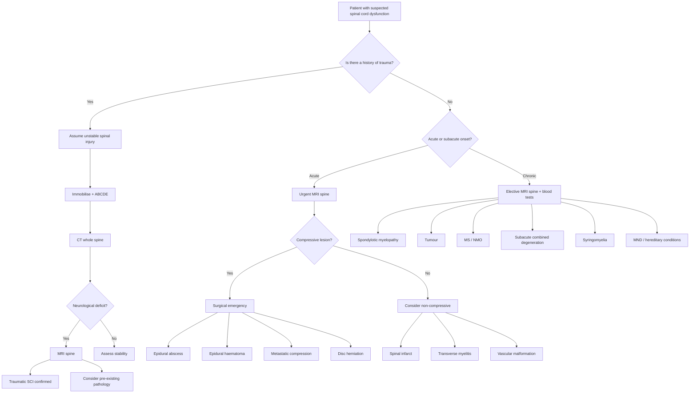

## Differential Diagnosis of Spinal Cord Injury

### Overview: The Clinical Problem

When a patient presents with acute neurological deficit suggestive of spinal cord dysfunction — weakness, sensory level, sphincter disturbance — the differential diagnosis is not simply "trauma vs. not trauma." The real clinical challenge is threefold:

1. **Is this truly a spinal cord lesion?** (vs. brain, peripheral nerve, NMJ, or functional)
2. **If spinal cord, what is the aetiology?** (trauma, tumour, infection, vascular, inflammatory, degenerative, congenital)
3. **Is there a surgically treatable compressive lesion?** (because this is a time-critical emergency)

The approach hinges on the **tempo of onset** (acute vs. subacute vs. chronic), the **pattern of deficit** (which cord syndrome), and the **clinical context** (trauma, cancer history, immunosuppression, etc.).

> ***"The spinal cord is very unforgiving. Acute paraplegia is an EMERGENCY. Sphincter dysfunction — a point of no return."*** [1]

---

### Step 1: Is This a Spinal Cord Lesion? — Localising the Problem

Before committing to a spinal cord differential, you must confirm the lesion is actually in the cord and not elsewhere. The clinical features of a spinal cord lesion are distinctive [11]:

| **Spinal Cord** | **Brain (Hemispheric / Brainstem)** | **Peripheral Nerve / Cauda Equina** |
|------------------|--------------------------------------|--------------------------------------|
| UMN signs below level, LMN at level | Contralateral UMN + higher cortical deficits (aphasia, neglect) or cranial nerve palsies (brainstem) | Pure LMN signs (flaccid, areflexic, wasting) |
| Sensory level on trunk | Hemisensory loss (face + arm + leg on same side) | Dermatomal / peripheral nerve distribution |
| Sphincter disturbance (early in conus, late in cord) | Sphincters usually spared (cortical lesions rarely cause incontinence acutely unless bilateral) | Sphincter dysfunction in cauda equina (late, irreversible) |
| Bilateral leg involvement common | Usually unilateral (hemiplegia) | May be unilateral or bilateral, asymmetric |
| No cranial nerve involvement | Cranial nerve involvement (brainstem) or cortical signs | No cranial nerve involvement |

**Key mimics of spinal cord disease** [12][13]:

- ***Stroke or TIA***: occurs more rapidly, typically "negative" symptoms (weakness/numbness rather than tingling), unilateral, associated cortical signs [13]
- ***Migraine aura***: spreading tingling or paraesthesia followed by numbness, evolves over 20–30 minutes over one half of body [13]
- **Guillain-Barré syndrome (GBS)**: ascending weakness with areflexia, but sensory level is absent; CSF shows albuminocytological dissociation
- **Bilateral cerebral lesions (e.g., parasagittal meningioma, bilateral ACA territory infarct)**: can cause bilateral leg weakness mimicking paraplegia, but typically with cortical features
- ***Psychogenic / functional***: bizarre distribution not conforming to known anatomical patterns [13]

<Callout title="How to Tell Cord from Cauda Equina" type="idea">
Both cause weakness + sensory loss + sphincter problems. The key difference: cord = UMN signs (spastic, hyperreflexic, upgoing plantars) with a sensory *level*. Cauda equina = LMN signs (flaccid, areflexic) with *saddle* anaesthesia and radicular pain. In practice, the conus medullaris at L1-2 can give a mixed picture.
</Callout>

---

### Step 2: Differential Diagnosis by Tempo of Onset

This is the most clinically useful way to organise the differential, because the speed of onset narrows the aetiology dramatically [6][8]:

#### A. Acute Onset (Minutes to Hours)

| Aetiology | Key Features | Why It Presents Acutely |
|-----------|-------------|------------------------|
| ***Spinal trauma*** | History of trauma, bony tenderness, neurogenic shock | Direct mechanical destruction of cord tissue at the moment of impact |
| ***Spinal infarct (anterior spinal artery syndrome)*** | Sudden onset, anterior cord syndrome (motor + pain/temp loss, proprioception spared), risk factors: DM, AF, aortic surgery, hypotension [8][11] | Vascular occlusion → immediate ischaemic necrosis of the anterior 2/3 of cord (analogous to a stroke but in the cord) |
| ***Spinal epidural/subdural haematoma*** | Anticoagulant use, post-procedure, sudden back pain → progressive deficit | Rapid blood accumulation compresses the cord |
| ***Acute disc herniation (massive central)*** | Preceded by back pain, heavy lifting; cauda equina or conus syndrome | Large disc fragment suddenly compresses neural elements |
| ***Vascular malformation (AVM) with haemorrhage*** | Sudden deficit ± subarachnoid haemorrhage (SAH) | Rupture of abnormal vessels → haemorrhage into or around the cord |

#### B. Subacute Onset (Days to Weeks)

| Aetiology | Key Features | Why It Presents Subacutely |
|-----------|-------------|---------------------------|
| ***Transverse myelitis*** | Acute/subacute progressive paraparesis, sensory level, autonomic dysfunction; may be idiopathic or a/w MS, NMO, SLE [14] | Inflammatory demyelination and oedema evolve over days |
| ***Epidural abscess*** | Fever, severe back pain, progressive neurological deficit; risk factors: IVDU, immunosuppression, diabetes | Infection forms and enlarges over days, causing progressive compression and direct cord inflammation |
| ***Spondylodiscitis / TB spine (Pott's disease)*** | Subacute back pain, constitutional symptoms, kyphosis; cord compression present at diagnosis in 40–70% [15] | Vertebral body destruction + abscess formation → gradual cord compression; TB classically disc-sparing early |
| ***Viral myelitis*** | Post-viral prodrome, rapidly ascending weakness | Direct viral invasion or post-infectious immune-mediated damage |
| ***Acute cord compression from metastasis*** | Known cancer, progressive back pain worse at night/lying down, rapid neurological deterioration | Tumour grows or pathological fracture collapses → acute-on-chronic compression |
| ***Guillain-Barré syndrome*** (mimic) | Ascending weakness, areflexia, no sensory *level* | Autoimmune peripheral nerve demyelination — NOT cord, but must be excluded |

#### C. Chronic/Insidious Onset (Weeks to Months to Years)

| Aetiology | Key Features | Why It Presents Chronically |
|-----------|-------------|----------------------------|
| ***Spondylotic (cervical) myelopathy*** | Most common cause of cervical cord lesion in pt > 50 years [8]; insidious gait unsteadiness, clumsy hands, myelopathic hand signs | Slow osteophyte growth / ligamentum flavum hypertrophy → gradual canal narrowing; cord adapts until a critical threshold |
| ***Primary or secondary tumours*** | Progressive deficit, worse at night (intradural tumours), weight loss; metastases from ***thyroid, breast, lung, kidney, prostate*** | Tumour growth is slow (primary) or stepwise (metastatic with pathological fracture) |
| ***Syringomyelia*** | Cape-like dissociated sensory loss, central cord syndrome, may be a/w Chiari I malformation | Slowly expanding fluid-filled cavity (syrinx) within the cord |
| ***Multiple sclerosis*** | Relapsing-remitting course, optic neuritis, Lhermitte's sign, periventricular lesions on brain MRI; d/dx includes neurofibroma, syringomyelia, early MND [8] | Inflammatory demyelinating plaques accumulate over time |
| ***Subacute combined degeneration*** | B12 deficiency → posterior + lateral column disease (loss of proprioception + vibration + UMN signs); megaloblastic anaemia, glossitis | Demyelination from impaired myelin synthesis due to lack of B12 as a cofactor in methionine synthase |
| ***Motor neurone disease (MND)*** | Pure motor (no sensory loss), combined UMN + LMN signs, fasciculations, bulbar symptoms | Progressive degeneration of motor neurons |
| ***Hereditary spastic paraplegia*** | Family history, slowly progressive spastic paraparesis, usually minimal sensory involvement | Genetic → axonal degeneration in corticospinal tracts |
| ***Friedreich's ataxia*** | Onset < 25 years, ataxia, absent reflexes (despite UMN signs), cardiomyopathy, scoliosis | Trinucleotide repeat → mitochondrial iron accumulation → dorsal columns + corticospinal tracts + cerebellum degeneration |
| ***Spinal dysraphism / tethered cord*** | History from birth, lumbosacral skin abnormalities, progressive LL weakness + bladder dysfunction with growth | Congenital failure of neural tube closure; tethering stretches the cord as the child grows |
| ***Radiation myelopathy*** | History of radiation therapy, delayed onset (months to years), progressive myelopathy | Radiation-induced vasculopathy and demyelination |
| ***HTLV-1 associated myelopathy*** | Tropical spastic paraparesis, slowly progressive, anterior cord pattern | Retroviral-induced chronic inflammation |
| ***Spinal stenosis*** | Neurogenic claudication (leg pain with walking, relieved by sitting/flexion), chronic | Degenerative narrowing of the spinal canal → positional compression |

> ***Differential diagnosis of back pain: Degeneration (spondylosis), Prolapsed intervertebral disc, Spinal stenosis, Cauda equina syndrome, Muscle/ligamentous injury (muscle strain), Fractures/injuries, Infection (TB spine, epidural abscess), Tumour (primary, metastases e.g. lung, breast, prostate), Inflammation (AS, PSA, RA), Extra-spinal causes/Referred pain (pancreatitis, AAA, uro/gynae causes, zoster)*** [3]

---

### Step 3: Differential by Cord Syndrome Pattern

The clinical pattern tells you the location of the lesion within the cord, which in turn narrows the aetiological differential [6][8]:

| Syndrome | Differential Diagnosis | Reasoning |
|----------|----------------------|-----------|
| ***Complete cord*** | ***Trauma, transverse myelitis, acute compression, benign tumours, spondylosis*** | Total cross-sectional cord destruction → only severe/complete insults produce this |
| ***Anterior cord*** | ***SC infarct, prolapsed disc, radiation myelopathy, HTLV-1*** | Anterior spinal artery territory → vascular or ventral compressive causes |
| ***Dorsal cord*** | ***Epidural metastasis, spondylosis, MS, subacute combined degeneration, Friedreich's ataxia*** | Posterior column selective damage → metabolic, compressive from behind, or inflammatory |
| ***Brown-Séquard*** | ***Knife or bullet injury, tumour, spondylosis, MS, radiation necrosis*** | Hemisection → penetrating trauma is classic; lateral tumours/plaques can also do this |
| ***Central cord*** | ***Spinal stroke, traumatic contusion, transverse myelitis, syringomyelia, intramedullary tumour*** | Central damage → hyperextension in spondylotic canal (elderly); expanding syrinx (young) |
| ***Pure motor*** | ***Poliomyelitis, motor neurone disease, hereditary spastic paraplegias*** | Only motor tracts/neurons affected, no sensory involvement |
| ***Conus medullaris*** | ***Prolapsed IVD, trauma, tumours*** | Lesion at L1-2; sacral autonomic nuclei involved early → early bladder/bowel |
| ***Cauda equina*** | ***Prolapsed IVD (L4/5, L5/S1), tumours, spinal stenosis, arachnoiditis*** | Below L2 → pure peripheral nerve roots |

---

### Step 4: "Don't Miss" Diagnoses (Surgical Emergencies)

These are the conditions where delayed diagnosis leads to irreversible deficit:

| Condition | Why It's Urgent | Key Clues |
|-----------|----------------|-----------|
| **Epidural abscess** | Cord compression + direct infection → irreversible paraplegia if not drained | Fever + back pain + progressive deficit; IVDU, DM, immunosuppression |
| **Epidural haematoma** | Expanding haematoma compresses cord | On anticoagulants, post-procedure, sudden back pain → rapid deficit |
| **Cauda equina syndrome** | ***"Point of no return"*** for sphincters; usually irreversible unless very early intervention [11] | Saddle anaesthesia, urinary retention, bilateral radicular pain |
| **Metastatic cord compression** | Tumour rapidly destroys cord; dexamethasone + urgent radiation/surgery needed | Known cancer + back pain worse lying down + progressive deficit |
| **Unstable spinal fracture** | ***Secondary neurological injury from instability*** [1] → further cord damage | Trauma + gap between spinous processes + neurological deficit |

<Callout title="The 'Red Flags' for Serious Spinal Pathology" type="error">
Always ask about:
- ***Cauda equina syndrome: faecal incontinence, painless urinary retention ± incontinence, saddle anaesthesia*** [3]
- ***Infection: fever, immunosuppression*** [3]
- ***Fracture: chronic steroid use, osteoporosis / metabolic bone disease*** [3]
- ***Malignancy: constitutional symptoms, history of cancer, age > 50 with new back pain***
- ***Neurological deficit: progressive weakness or sensory loss***

Missing these means missing a surgical emergency.
</Callout>

---

### Step 5: Diagnostic Differentiation by Context

#### In the Trauma Setting

The main differential is:
- **Traumatic SCI** (obvious mechanism) — but you must also consider:
  - ***Delay in diagnosis*** due to: ***unconscious patient, head injury, alcohol intoxication, multiple distracting injuries*** [2]
  - **Pre-existing pathology unmasked by minor trauma**: cervical spondylotic myelopathy + hyperextension → central cord syndrome (elderly)
  - **Pathological fracture**: metastasis or osteoporosis → low-energy mechanism causing fracture → cord compression
  - ***Chronic condition with acute deterioration*** [1] — e.g., patient with ankylosing spondylitis whose rigid "bamboo spine" fractures like a long bone from a minor fall

#### In the Non-Trauma Setting

The key differentiation is:
- **Compressive** (tumour, abscess, disc, haematoma) — requires urgent surgical decompression → ***MRI is the modality of choice; plain XR cannot make or exclude diagnosis of cord compression*** [16]
- **Non-compressive** (transverse myelitis, vascular, inflammatory, metabolic) — managed medically

> ***D/dx of transverse myelitis includes: Non-inflammatory myelopathy by MRI spine (mechanical: disc herniation, vertebral body compression fractures...)*** [14]. The first step is always MRI to exclude compression.

---

### Differential Diagnosis Algorithm

---

### Summary Table: Key Differentiating Features

| Condition | Onset | Pain | Motor Pattern | Sensory Pattern | Sphincters | Special Features |
|-----------|-------|------|--------------|-----------------|------------|-----------------|
| **Traumatic SCI** | Acute | At injury site | Depends on level/completeness | Sensory level | Often early | History of trauma, neurogenic shock |
| **Spinal infarct** | Hyperacute (minutes) | Sudden back pain | Anterior cord (motor loss) | Pain/temp loss, proprioception spared | Spastic bladder | Risk factors: AF, DM, aortic surgery |
| **Epidural abscess** | Subacute (days) | Severe, localised | Progressive UMN | Sensory level | Late | Fever, ↑WBC/CRP, IVDU |
| **TB spine** | Subacute–chronic | Insidious back pain | UMN below | Sensory level | Late | Constitutional symptoms, kyphosis |
| **Transverse myelitis** | Subacute (hours–days) | Girdle-like | Bilateral, often complete | Sensory level | Early | Post-viral, a/w MS or NMO |
| **Metastatic compression** | Subacute–acute | Night pain, worse lying down | Progressive UMN | Dorsal cord pattern | Late | Known cancer, weight loss |
| **Cervical spondylotic myelopathy** | Chronic | Neck stiffness | UMN in legs, myelopathic hands | Often subtle | Very late | Age > 50, Lhermitte's sign |
| **Syringomyelia** | Chronic | Painless burns on hands | Central cord (UL > LL) | Cape-like dissociated | Late | Chiari I malformation |
| **B12 deficiency** | Chronic | None | UMN (lateral columns) | Posterior columns (proprioception, vibration) | Usually spared | Megaloblastic anaemia, glossitis |
| **MS** | Relapsing-remitting | Variable | Variable | Variable | Variable | Optic neuritis, Lhermitte's, brain lesions |
| **Cauda equina** | Variable | Radicular, bilateral | Pure LMN | Saddle | Late but irreversible | Usually L4/5 disc or tumour |

---

### The Neurogenic Shock vs Other Causes of Shock — A Critical DDx in Trauma

In the polytrauma setting, hypotension must be differentiated [17]:

| | ***Neurogenic Shock*** | **Hypovolaemic Shock** | **Cardiogenic Shock** |
|---|---|---|---|
| **Mechanism** | ***Interruption of neurogenic vasomotor control → inappropriate ↓HR, ↓SVR*** [17] | Blood loss → ↓preload | Pump failure → ↓CO |
| **Heart Rate** | ***Paradoxically slow HR*** (bradycardia) | Tachycardia | Variable |
| **Skin** | Warm, flushed, dry | Cold, clammy, pale | Cold, clammy |
| **JVP/CVP** | Low–normal | Low (↓CVP < 8) | High (↑CVP > 12) |
| **Context** | ***Compatible Hx of CNS injury*** [17] | Visible bleeding, pelvic fracture | MI, arrhythmia |
| **Treatment** | ***IV fluids + vasopressors*** | Volume resuscitation, stop bleeding | Inotropes, IABP |

<Callout title="A Trap in Polytrauma" type="error">
In a polytrauma patient with a spinal injury AND hypotension, **always assume hypovolaemic shock first** and look for bleeding (chest, abdomen, pelvis, long bones). Neurogenic shock is a diagnosis of exclusion. If you assume neurogenic shock and the patient is actually bleeding, they will die from uncontrolled haemorrhage.
</Callout>

---

### Special DDx: Overactive Bladder / Neurogenic Bladder

When a patient presents with urinary symptoms and SCI is suspected, the differential for the bladder dysfunction itself includes [18]:
- ***Neurogenic overactive bladder***: ***Stroke, Spinal cord injury, Multiple sclerosis, Parkinson's disease***
- ***Non-neurogenic overactive bladder*** (idiopathic): post-operative pelvic surgery, secondary to bladder outlet obstruction
- **Detrusor underactivity**: diabetic neuropathy, cauda equina

---

<Callout title="High Yield Summary — Differential Diagnosis of SCI">

1. **Confirm it's a cord lesion**: UMN below + LMN at level + sensory level + sphincter disturbance = cord. Pure LMN = cauda equina or peripheral. Cortical signs = brain.

2. **Tempo narrows aetiology**: Hyperacute = vascular/trauma. Subacute = infection/inflammation. Chronic = degenerative/neoplastic/metabolic.

3. **Cord syndrome narrows further**: Anterior cord → infarct. Central cord → syringomyelia/hyperextension injury. Brown-Séquard → penetrating trauma. Dorsal cord → B12/MS/metastasis.

4. **Surgical emergencies not to miss**: Epidural abscess, epidural haematoma, metastatic compression, cauda equina syndrome, unstable fracture.

5. **MRI is the modality of choice** for non-traumatic cord compression; plain XR cannot make or exclude the diagnosis.

6. **In trauma**: always assume hypovolaemic shock before neurogenic shock. Always image the whole spine (15% non-contiguous injuries).

7. **Red flags**: cauda equina symptoms, fever/immunosuppression, cancer history, progressive neurological deficit, chronic steroid use/osteoporosis.
</Callout>

---

<ActiveRecallQuiz
  title="Active Recall - Differential Diagnosis of Spinal Cord Injuries"
  items={[
    {
      question: "A 70-year-old man with cervical spondylosis falls and hits his chin on the ground. He presents with upper limb weakness much greater than lower limb weakness, with cape-like sensory loss. What cord syndrome is this, and what is the mechanism?",
      markscheme: "Central cord syndrome. Mechanism: hyperextension injury in a patient with pre-existing cervical spondylotic stenosis causes contusion/compression of the central cord. Corticospinal tract is somatotopically arranged with cervical (upper limb) fibres medially, so these are damaged first. Spinothalamic fibres crossing centrally are also disrupted causing cape-like dissociated sensory loss.",
    },
    {
      question: "List 4 surgical emergencies that must not be missed in the differential diagnosis of acute spinal cord dysfunction, and explain why each is time-critical.",
      markscheme: "1. Epidural abscess: progressive compression plus direct infection leads to irreversible cord necrosis if not drained. 2. Epidural haematoma: expanding blood collection causes rapid compression. 3. Metastatic cord compression: tumour destroys cord; needs urgent dexamethasone plus radiation/surgery. 4. Cauda equina syndrome: sphincter dysfunction is irreversible if not decompressed early (point of no return).",
    },
    {
      question: "How do you differentiate neurogenic shock from hypovolaemic shock in a polytrauma patient? Which should you assume first, and why?",
      markscheme: "Neurogenic: hypotension plus bradycardia plus warm flushed skin (loss of sympathetic tone, unopposed vagus). Hypovolaemic: hypotension plus tachycardia plus cold clammy skin (sympathetic activation). Always assume hypovolaemic first because it is immediately lethal if missed (uncontrolled haemorrhage), whereas neurogenic shock is a diagnosis of exclusion.",
    },
    {
      question: "A patient presents with sudden-onset paraplegia, loss of pain and temperature sensation below T10, but preserved proprioception and vibration. What is the most likely diagnosis and which artery is affected?",
      markscheme: "Anterior spinal artery syndrome (spinal cord infarct). The anterior spinal artery supplies the anterior two-thirds of the cord (corticospinal tracts and spinothalamic tracts), so its occlusion causes motor loss and pain/temperature loss. Proprioception and vibration are preserved because the dorsal columns are supplied by the posterior spinal arteries.",
    },
    {
      question: "Name 5 causes of chronic myelopathy and state one distinguishing clinical or investigative feature for each.",
      markscheme: "1. Cervical spondylotic myelopathy: myelopathic hand signs, age over 50, gradual gait unsteadiness. 2. Intramedullary tumour: central cord syndrome, enhancing lesion on MRI. 3. MS: relapsing-remitting, periventricular white matter lesions on brain MRI. 4. Subacute combined degeneration (B12): posterior plus lateral column signs, megaloblastic anaemia. 5. Syringomyelia: cape-like dissociated sensory loss, associated Chiari I malformation on MRI.",
    },
  ]}
/>

## References

[1] Lecture slides: GC 110. Paraplegia Spinal cord compression Transverse myelitis Spinal dysraphism Neuroimaging III Spinal Cord.pdf
[2] Lecture slides: GC 227. Cervical Spine Pathology.pdf
[3] Senior notes: maxim.md (Section 2.3 Approach to spine diseases)
[6] Senior notes: Ryan Ho Neurology.pdf (Section 9.6 Spinal Trauma, p176-177)
[8] Senior notes: Ryan Ho Fundamentals.pdf (Section 3.4.9 Paraplegia, p334-335)
[11] Senior notes: Ryan Ho Neurology.pdf (Section 1.3 Where and What is the Lesion, p45)
[12] Senior notes: felixlai.md (Differential diagnosis of stroke)
[13] Senior notes: Ryan Ho Neurology.pdf (p72 — D/dx and Characteristic Presentations of sensory loss)
[14] Senior notes: Ryan Ho Neurology.pdf (Section 6.2 Transverse Myelitis, p141)
[15] Senior notes: Ryan Ho Respiratory.pdf (p80 — Skeletal TB / Pott disease)
[16] Senior notes: Ryan Ho Radiology.pdf (p18 — Spinal trauma and non-traumatic cord compression imaging)
[17] Senior notes: Ryan Ho Critical Care.pdf (p16 — Neurogenic shock)
[18] Senior notes: felixlai.md (Differential diagnosis of LUTS — overactive bladder)
