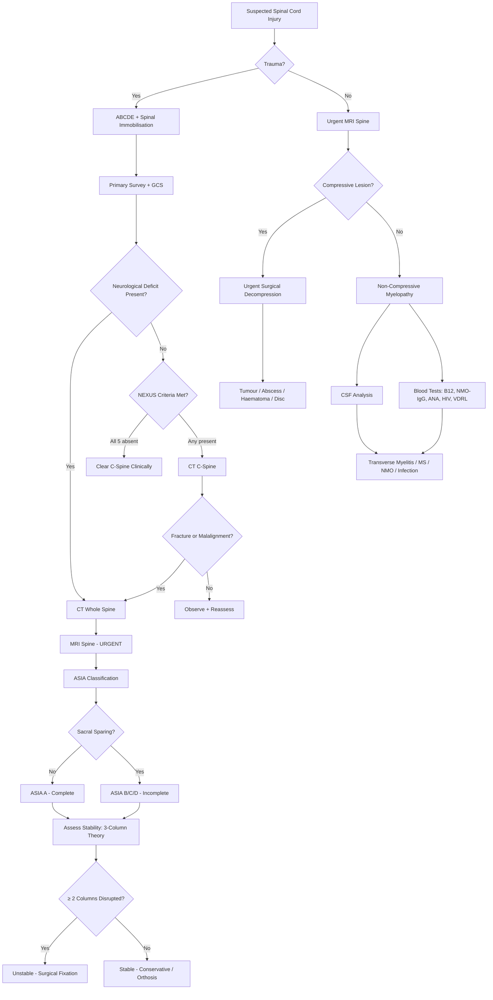

## Diagnostic Criteria, Diagnostic Algorithm, and Investigations for Spinal Cord Injuries

### A. Diagnostic Framework — What Are We Trying to Answer?

The diagnosis of spinal cord injury is not a single "test" — it is a systematic process that answers five questions in order:

1. **Is there a spinal cord injury?** (clinical assessment — ASIA)
2. **What is the level?** (neurological examination — dermatomes/myotomes)
3. **Is it complete or incomplete?** (sacral sparing — ASIA grade)
4. **Is it stable or unstable?** (imaging — three-column theory)
5. **What is the cause?** (context + imaging + supportive investigations)

The first three are determined primarily by **clinical examination**. The last two require **imaging**. There is no single "diagnostic criterion" like the Jones Criteria for rheumatic fever — instead, the diagnosis rests on a structured clinical-radiological framework.

---

### B. Clinical Diagnostic Assessment

#### B1. The ASIA / ISNCSCI Examination — The Gold Standard for Classifying SCI

***The ASIA classification (IMPORTANT!)*** [3] is the internationally accepted system for classifying spinal cord injury severity. ASIA stands for **American Spinal Injury Association**; ISNCSCI stands for **International Standards for Neurological Classification of Spinal Cord Injury**.

***Sensory: test pinprick and touch in each dermatome*** [6]
***Motor: in the 10 key motor functions listed*** [6]

**The ASIA Examination systematically assesses:**

**Sensory examination** — 28 dermatomes on each side (C2–S4/5), tested for:
- **Light touch** (tests dorsal column-medial lemniscal pathway)
- **Pinprick** (tests spinothalamic pathway)
- Each scored 0 (absent), 1 (impaired), 2 (normal) → maximum sensory score = 112 per side per modality

**Motor examination** — 10 key muscles on each side (5 upper limb, 5 lower limb):

| Root | Key Muscle | Action Tested |
|------|-----------|---------------|
| C5 | Elbow flexors (biceps) | Elbow flexion |
| C6 | Wrist extensors (ECRL, ECRB) | Wrist extension |
| C7 | Elbow extensors (triceps) | Elbow extension |
| C8 | Finger flexors (FDP to middle finger) | Finger flexion |
| T1 | Small finger abductors (ADM) | Finger abduction |
| L2 | Hip flexors (iliopsoas) | Hip flexion |
| L3 | Knee extensors (quadriceps) | Knee extension |
| L4 | Ankle dorsiflexors (tibialis anterior) | Ankle dorsiflexion |
| L5 | Long toe extensors (EHL) | Great toe extension |
| S1 | Ankle plantarflexors (gastrocnemius/soleus) | Ankle plantarflexion |

Each scored 0–5 (MRC scale) → maximum motor score = 50 per side

**Key definitions:**
- **Neurological level of injury (NLI)**: the most caudal segment with **both** normal sensory AND motor function (grade ≥ 3 motor + grade 2 sensory on both modalities)
- **Sensory level**: most caudal dermatome with normal sensation
- **Motor level**: most caudal myotome with ≥ 3/5 power, provided the segment above is 5/5

**Sacral sparing** — the critical determinant of complete vs incomplete:
- Test: **voluntary anal contraction** (motor) + **S4-S5 light touch/pinprick** (sensory) + **deep anal pressure** (sensation)
- If ANY of these are present → **incomplete** (ASIA B–D)
- If ALL absent → **complete** (ASIA A)

> ***ASIA Impairment Scale*** [3]:
>
> | Grade | Type | Definition |
> |-------|------|-----------|
> | ***A*** | ***Complete*** | ***No motor, No sensory, No sacral sparing*** |
> | ***B*** | ***Incomplete*** | ***No motor, sensory only*** (preserved below level including S4-5) |
> | ***C*** | ***Incomplete*** | ***> 50% of key muscles below the level have muscle grade < 3 (cannot raise arms or legs off bed)*** |
> | ***D*** | ***Incomplete*** | ***≥ 50% of key muscles below the level have muscle grade ≥ 3 (can raise arms or legs off bed)*** |
> | ***E*** | ***Normal*** | ***Motor and sensory function are normal*** |

<Callout title="ASIA C vs D — The Grade 3 Rule">
The difference between C and D is whether the patient can move against gravity. Grade 3 = movement against gravity. If more than half the key muscles below the injury are weaker than grade 3, they literally cannot lift their limbs off the bed → ASIA C. If more than half can → ASIA D. This simple bedside distinction has enormous prognostic implications: ASIA D patients have a much higher chance of community ambulation.
</Callout>

#### B2. Determining Stability — Clinical Signs

***Mechanism of injury helps determine degree of stability*** [6]:
- ***Stable: ligament not damaged*** [6]
- ***Unstable: ligament disrupted*** [6]

On physical examination:
- ***"Step over spinous processes" for any tenderness, swelling or gap between spinous processes*** [6] — a palpable gap indicates ***rupture of interspinous ligament (i.e. unstable injury)*** [6]

***Three-column theory*** (Denis) for thoracolumbar spine [3]:
- ***Unstable fracture if 2/3 segments disrupted*** [3]
- Anterior column: anterior 2/3 of vertebral body + disc + ALL
- Middle column: posterior 1/3 of vertebral body + disc + PLL
- Posterior column: posterior arch

#### B3. Determining Completeness — Spinal Shock Caveat

You cannot definitively classify a patient as ASIA A (complete) during the spinal shock phase, because areflexia from spinal shock mimics complete injury. You must wait for the **bulbocavernosus reflex** to return (signalling end of spinal shock) before declaring an injury "complete" [3]:

| | ***Spinal Shock*** | ***Neurogenic Shock*** |
|---|---|---|
| ***Bulbocavernosus reflex*** | ***Absent*** | ***Present*** |
| ***Motor*** | ***Flaccid paralysis*** | ***Normal*** |

The bulbocavernosus reflex (squeeze glans penis or tug Foley catheter → look for anal wink) is the first sacral reflex to return. Once it returns, if there is still no sacral sparing, the injury is truly complete.

<Callout title="Don't Declare Complete Too Early" type="error">
A patient in spinal shock looks like ASIA A — flaccid, areflexic, no sacral sparing. But this may be temporary. Only after the bulbocavernosus reflex returns can you reliably call it complete. This distinction matters because incomplete injuries (ASIA B–D) have far better recovery potential.
</Callout>

---

### C. Imaging — The Diagnostic Workup

#### C1. Decision Rules: Who Needs Imaging?

Not every patient with neck pain after minor trauma needs imaging. Two validated clinical decision rules guide this:

##### ***NEXUS Criteria*** [2]

***NEXUS Mnemonic*** [2]:
- ***N — Neuro deficit*** (any focal neurological deficit)
- ***E — EtOH / intoxication*** (alcohol or drugs impairing assessment)
- ***X — eXtreme distracting injury*** (injuries so painful they may mask spinal tenderness)
- ***U — Unable to provide history*** (altered level of consciousness)
- ***S — Spinal tenderness*** (midline posterior cervical tenderness)

***If ALL five criteria are ABSENT → the cervical spine can be cleared clinically without imaging*** [2]. If ANY one is present → imaging is required.

> The logic: NEXUS identifies patients whose clinical examination is reliable enough to exclude significant injury without radiation. If the patient is alert, sober, non-tender, neurologically intact, and has no distracting injuries, the negative predictive value is > 99%.

##### Canadian C-Spine Rule (CCR)

An alternative (and arguably more sensitive/specific) tool:
1. Any high-risk factor mandating imaging? (age ≥ 65, dangerous mechanism, paraesthesia in extremities) → If yes → image
2. Any low-risk factor allowing safe assessment of ROM? (simple rear-end RTA, sitting in ED, ambulatory, delayed onset neck pain, no midline tenderness) → If yes → assess ROM
3. Can the patient actively rotate the neck 45° left and right? → If yes → no imaging needed

<Callout title="NEXUS vs CCR">
Both are validated for "clearing the c-spine" in alert trauma patients. CCR has slightly higher sensitivity (~99.4% vs 99.0%) and specificity. In practice, many centres use NEXUS because it is simpler. Neither applies to children < 16, GCS < 15, or known vertebral disease.
</Callout>

#### C2. Imaging Modalities — Systematic Overview

##### 1. ***Plain X-Ray Spine*** [1][6][16]

***Investigation – Plain X-ray*** [1]:
- ***Readily available***
- ***Show obvious fracture and malalignment***
- ***Can miss subtle fracture***
- ***Cannot exclude ligamentous instability***
- ***Cannot exclude soft-tissue compressive lesion (e.g., haematoma)***

| View | What It Shows | Key Findings |
|------|--------------|-------------|
| ***AP view*** | Alignment, spinous process spacing | ***3 lines on AP should be smooth*** [6]: alignment of spinous processes, lateral margins of lateral masses/vertebral bodies |
| ***Lateral view*** | Most important single view | ***4 lines on lateral should be smooth*** [6]: anterior vertebral body line, posterior vertebral body line, spinolaminar line, spinous process tips. ***Fracture lines***, ***malalignment***, ***soft tissue swelling*** |
| ***Open mouth (odontoid) view*** | C1-C2 specifically | ***Odontoid fracture***, ***C1 fracture***; ***Rule of Spence: sum of distance between lateral masses of C1 beyond vertebral body of C2 > 7mm → transverse ligament likely disrupted → unstable injury*** [6] |

**C-spine lateral view: soft tissue rules** [3]:
- ***3×7=21 rule***: prevertebral soft tissue — ***C1 ≤ 10mm, C3 ≤ 7mm, C7 ≤ 21mm***
- ***Soft tissue swelling may indicate nearby fracture*** [6]:
  - ***Above C4: ≤ 1/3 vertebral body width***
  - ***Below C4: ≤ 100% vertebral body width***

Why does soft tissue swelling matter? Because a vertebral fracture causes local haemorrhage and oedema → the prevertebral soft tissue space widens. This may be the only clue on a lateral X-ray when the fracture line itself is occult.

**Useful plain XR findings in spinal cord lesions** [8]:
- ***Pedicle erosion → extradural metastases*** (tumour erodes the pedicle because it sits in the epidural space)
- ***Vertebral body collapse*** (pathological fracture from osteoporosis or malignancy)
- ***Narrow disc space, osteophytes, hypertrophic facet joints → spondylosis***
- ***Expansion of intervertebral foramina → neurofibroma*** (tumour enlarges the foramen as it grows)

> ***Plain XR: AP + lateral views should be ordered. For C-spine, ask for open mouth view. Flexion-extension views are not useful in the acute injury period due to muscle spasm*** [16].

<Callout title="Limitation of Plain XR" type="error">
***Plain XR cannot make or exclude the diagnosis of cord compression*** [16]. A normal X-ray does NOT rule out SCI. The cord is not visible on X-ray — you can only infer cord injury from bony or alignment abnormalities. This is why CT and MRI are essential in any patient with neurological deficit.
</Callout>

##### 2. ***CT Spine*** [1][2][16]

***Investigation: CT*** [1]:
- ***Reasonably available***
- ***Still cannot show soft-tissue injury*** [1]

***CT Spine*** [16]:
- ***High sensitivity and specificity*** (for fractures)
- ***T and L-S spine within scan field in patients who undergo torso CT for assessment of other injuries*** [16] — this is a practical point: if a polytrauma patient gets a CT chest/abdomen/pelvis, the spine is already in the field → reconstruct spinal images from the same data
- ***Provides radiographic clearance when X-rays are inadequate*** [2]

| What CT Shows Well | What CT Does NOT Show |
|---|---|
| Fracture lines (even subtle ones) | Ligamentous injury |
| Bony canal narrowing | Cord oedema / contusion |
| Retropulsed fragments | Disc herniation (soft tissue) |
| Facet joint alignment | Epidural haematoma |

> ***All injuries otherwise*** (i.e., not minor) → ***CT ± MRI (if focal neurological deficit)*** [3]

##### 3. ***MRI Spine*** [1][2][6][8][16]

***Investigation: MRI spine*** [1]:
- ***Difficult to arrange*** [1] (takes time, limited availability)
- ***Shows soft-tissue lesion, cord oedema*** [1]

***MRI*** [16]:
- ***For ligamentous, spinal cord and soft tissue injuries***
- ***Done when there are neurological deficits not explained by plain film or CT*** [16]
- ***Essential if there are neurological deficits*** [2]
- ***Useful for delineation of soft tissue injury (i.e., discoligamentous)*** [2]

***For non-traumatic cord compression: MRI is the modality of choice unless contraindicated*** [16]

***Contrast MRI spine: urgent if acute paraplegia*** [8]

**MRI Interpretation — Basic Principles** [2]:
- ***Level of lesion, location***
- ***Pathoanatomy (disc, osteophyte, OPLL, flavum)***
- ***Obliteration of the CSF space*** (indicates significant compression — the bright CSF signal disappears around the cord)
- ***Cord shape / cross-sectional area*** (cord compression causes flattening)
- ***Intramedullary signal change (myelomalacia)*** — T2 hyperintensity within the cord indicates oedema or gliosis; this is a poor prognostic sign

| MRI Sequence | What It Shows Best |
|---|---|
| **T1-weighted** | Anatomy (fat bright, CSF dark). Vertebral body marrow replacement (metastasis = dark on T1) |
| **T2-weighted** | Fluid bright (CSF, oedema bright). Cord oedema/contusion = bright signal within cord. Disc herniation well-delineated |
| **STIR** | Fat-suppressed T2 — excellent for bone marrow oedema (fractures glow bright) and ligamentous injury |
| **T1 with gadolinium** | Enhancement indicates active inflammation, infection, or tumour vascularity |

**Key MRI findings and their interpretation:**

| Finding | Interpretation | Clinical Significance |
|---------|---------------|----------------------|
| T2 hyperintensity in cord | Cord oedema / contusion | Confirms cord injury; extent correlates with severity |
| T1 hypointensity + T2 hyperintensity in cord | Haemorrhagic necrosis | Poor prognosis — irreversible damage |
| Loss of CSF signal around cord | Cord compression | Needs decompression if progressive |
| Disc material in canal | Disc herniation | Surgical target |
| T2 bright ligament signal | Ligamentous disruption | Indicates instability → may need surgical fixation |
| Epidural collection | Haematoma or abscess | Compressive lesion → may need urgent drainage |
| Vertebral body T1 low / T2 high | Metastasis, fracture (with oedema) | Check for pathological fracture |

<Callout title="MRI is the Only Way to See the Cord">
The spinal cord itself is invisible on X-ray and poorly seen on CT. MRI is the only modality that directly visualises cord contusion, oedema, haemorrhage, and compression. Any patient with neurological deficit after spinal trauma MUST get an MRI.
</Callout>

##### 4. ***Myelography / CT Myelography*** [8]

***Myelography / CT myelography: if MRI is contraindicated or not available*** [8]
- Involves intrathecal injection of contrast followed by CT scanning
- Contraindicated in patients with raised intracranial pressure
- Used when MRI cannot be performed (e.g., pacemaker, metallic implants, claustrophobia, patient too unstable for MRI)
- Shows subarachnoid space filling defects (compression)

##### 5. Other Imaging

| Modality | Indication |
|----------|-----------|
| ***CTA vertebral artery*** | C-spine injury involving vertebral foramen — risk of vertebral artery injury [3] |
| ***CTA Circle of Willis*** | Skull base fracture involving foramen lacerum [3] |
| ***Spinal angiography (DSA)*** | Suspected vascular malformation (AVM, dural AVF) |

---

### D. Supportive Investigations

These do not diagnose the spinal cord injury itself but help identify the **cause** or **complications**:

#### D1. ***CSF Analysis*** [8]

***CSF analysis: only if suspect transverse myelitis*** [8]
***May cause deterioration for cord compression!*** [8] — this is critically important. If there is any possibility of a compressive lesion, lumbar puncture is DANGEROUS because removing CSF below a block can cause the cord to herniate downward.

***Send: R/M, cell count, C/ST, biochemistry, TB workup, viral studies, cytology ± VDRL, oligoclonal bands*** [8]

| CSF Finding | Suggests |
|-------------|---------|
| Moderate lymphocytosis, normal glucose, normal/slightly ↑protein | Transverse myelitis |
| Oligoclonal IgG bands | MS (↑risk of progression into MS) |
| Very high protein ( > 5 g/L), nodular arachnoiditis | TB arachnoiditis |
| Malignant cells on cytology | Leptomeningeal metastasis |
| Elevated WBC + low glucose + high protein + positive C/ST | Bacterial infection |

<Callout title="NEVER LP Before Imaging in Suspected Cord Compression" type="error">
If you suspect a compressive cause (tumour, abscess, haematoma), **do NOT perform lumbar puncture** until MRI has excluded a block. Removing CSF below a compressive lesion drops the pressure below the block relative to above it → can cause the cord to herniate further → catastrophic deterioration.
</Callout>

#### D2. Blood Tests

| Test | Purpose |
|------|---------|
| ***Vitamin B12*** | Rule out subacute combined degeneration [8] |
| FBC, CRP, ESR | Infection (abscess, spondylodiscitis), malignancy |
| RFT, LFT | Baseline; renal function for contrast imaging |
| Calcium, phosphate, ALP | Metastatic bone disease, osteoporosis |
| Coagulation profile | If haematoma suspected; anticoagulant use |
| Blood cultures | If epidural abscess/spondylodiscitis suspected |
| Tumour markers (PSA, etc.) | If metastatic disease suspected |
| NMO-IgG (anti-AQP4 Ab) | If longitudinally extensive transverse myelitis (≥ 3 segments) → NMO spectrum disorder |
| ANA, anti-Ro, anti-La | SLE, Sjögren's as cause of myelitis |
| HIV antibody, VDRL | Infective/inflammatory causes of myelopathy |
| TSH | Hypothyroidism can cause myelopathy (rare) |

#### D3. Neurophysiological Studies

| Test | Purpose | Interpretation |
|------|---------|----------------|
| ***Nerve conduction study (NCS)*** | Differentiate cord (central) from peripheral nerve lesion | Normal NCS with UMN signs = cord lesion. Abnormal NCS = peripheral neuropathy/radiculopathy |
| ***Somatosensory evoked potentials (SSEP)*** | Assess dorsal column conduction | Delayed or absent cortical potentials confirm cord conduction block; useful for intraoperative monitoring |
| ***Motor evoked potentials (MEP)*** | Assess corticospinal tract conduction | Useful intraoperatively to monitor motor pathways during spinal surgery |
| ***EMG*** | Assess denervation in muscles | Confirms LMN involvement at specific levels; differentiates from NMJ or myopathic disease |

#### D4. Urodynamic Studies

- Assess neurogenic bladder function (detrusor pressure, sphincter coordination)
- Important for long-term management of bladder in established SCI
- Shows detrusor sphincter dyssynergia (DSD) in suprasacral lesions

---

### E. Diagnostic Algorithm

---

### F. Indications for Imaging — Summary Table

| Scenario | Imaging | Rationale |
|----------|---------|-----------|
| ***High energy trauma*** | CT whole spine | High sensitivity for fractures [16] |
| ***Patient at risk of fractures (e.g., ankylosing spondylitis)*** | CT whole spine | Rigid spine fractures easily; may be missed clinically [16] |
| ***Focal neurological deficits*** | CT + ***MRI*** (essential) | CT for bony; ***MRI essential if there are neurological deficits*** [2][16] |
| Minor injury, alert, NEXUS-negative | No imaging needed | Clinical clearance is safe |
| Minor injury, NEXUS-positive | ***Full C-spine XR (AP + lateral + open mouth view)*** or CT | Screening for fracture [3] |
| Non-traumatic progressive myelopathy | ***MRI — modality of choice*** | ***Plain XR cannot make or exclude dx of cord compression*** [16] |
| Suspected transverse myelitis (after MRI excludes compression) | MRI + CSF analysis | Demonstrate cord inflammation without compression |
| Suspected vascular lesion | MR angiography or DSA | Map AVM/AVF for treatment planning |

---

### G. Putting It All Together — The Systematic Approach

***Clinical evaluation: aim to localise and delineate lesion*** [8]:

**History** [8]:
- ***Weakness, sensory loss, sphincter disturbance, pain***
- ***Temporal course and spatial distribution***
- Mechanism (***high / low energy trauma; motor vehicle accident, fall from height, fall from level ground***) [2]
- ***Time of injury*** [2]
- ***Delay in diagnosis*** (risk factors for missed SCI): ***unconscious, head injury, alcohol, multiple distracting injuries*** [2]

**Physical Examination** [8]:
- ***Motor: segmental weakness according to myotome***
- ***Sensory: sensory level according to dermatome***
- ***Cerebellar: for MS and Friedreich's ataxia***
- Signs of cord compression: ***saddle anaesthesia, anal tone, perianal sensation*** [19]
- ***DRE: anal reflex, bulbocavernosus reflex (BCR, S2-4)*** [19]
- ***LL neurological examination*** [19]

**Investigations** [8]:
- ***Plain XR spine***
- ***Contrast MRI spine: urgent if acute paraplegia***
- ***Myelography / CT myelography: if MRI is C/I or N/A***
- ***CSF analysis: only if suspect transverse myelitis*** (***may cause deterioration for cord compression!***)
- ***Vitamin B12 for subacute combined degeneration***

> ***Investigations for cervical spine pathology: X-rays (AP/lateral, oblique views for foraminal narrowing), CT scan, MRI scan (confirm nerve root/cord compression), NCV/EMG*** [2]

---

### H. Special Scenario: C-Spine Clearance in the Obtunded Patient

In unconscious or intubated patients, clinical clearance is impossible. The approach:
1. Maintain immobilisation (hard collar + logroll precautions)
2. CT cervical spine — if normal:
   - Some centres accept CT-only clearance in obtunded patients (high sensitivity > 99%)
   - Others require MRI within 48–72 hours to exclude occult ligamentous injury
3. If CT abnormal → MRI
4. If MRI abnormal → neurosurgical consultation

> ***Spinal cord injury: sensory level, motor deficits, anal tone*** should be assessed as part of head injury assessment [3]. Always assume spinal injury in an unconscious trauma patient until proven otherwise.

---

<Callout title="High Yield Summary — Diagnosis of SCI">

1. **ASIA/ISNCSCI is the gold standard** for classifying SCI: tests 28 dermatomes (pinprick + light touch) and 10 key muscles bilaterally. Sacral sparing (S4-5 sensation or voluntary anal contraction) distinguishes complete (ASIA A) from incomplete (ASIA B-D).

2. **Cannot declare complete until spinal shock resolves** — wait for bulbocavernosus reflex to return.

3. **NEXUS criteria** clear the c-spine clinically: N (neuro deficit), E (EtOH), X (extreme distracting injury), U (unable to provide history), S (spinal tenderness). All 5 absent → no imaging needed.

4. **Three imaging modalities**: Plain XR (readily available but misses subtle fractures and cannot see the cord); CT (high sensitivity for fractures but cannot show soft tissue); MRI (shows cord, ligaments, disc — essential with neurological deficit, but harder to arrange).

5. **Plain XR cannot make or exclude cord compression** — MRI is mandatory if neurological deficit present.

6. **CSF analysis only if transverse myelitis suspected AND MRI excludes compression first** — LP with a compressive lesion risks catastrophic deterioration.

7. **CT whole spine** for all significant trauma — 15% have non-contiguous injuries.

8. **Three-column theory**: ≥ 2/3 columns disrupted = unstable.

9. **MRI key findings**: T2 cord hyperintensity = oedema/contusion; T1 hypointensity = haemorrhagic necrosis (poor prognosis); loss of CSF signal = compression; ligament bright on T2/STIR = disruption.

10. **Supportive blood tests**: B12, NMO-IgG, ANA, HIV, VDRL to identify non-traumatic causes.
</Callout>

---

<ActiveRecallQuiz
  title="Active Recall - Diagnosis of Spinal Cord Injuries"
  items={[
    {
      question: "What are the five components of the NEXUS criteria for clearing the cervical spine, and what does it mean if all are absent?",
      markscheme: "N - Neuro deficit, E - EtOH/intoxication, X - eXtreme distracting injury, U - Unable to provide history (altered consciousness), S - Spinal tenderness (midline). If all five are absent, the cervical spine can be cleared clinically without imaging (NPV > 99%).",
    },
    {
      question: "A trauma patient has flaccid paralysis and areflexia below T6 with absent bulbocavernosus reflex. Is this ASIA A? Explain your reasoning.",
      markscheme: "Cannot classify as ASIA A yet. Absent bulbocavernosus reflex indicates the patient is still in spinal shock (temporary areflexia from loss of descending excitatory input). The flaccidity and apparent completeness may be temporary. Must wait for bulbocavernosus reflex to return (end of spinal shock), then re-examine for sacral sparing. Only if sacral sparing is still absent after spinal shock resolves can you call it ASIA A (complete).",
    },
    {
      question: "Compare the three main spinal imaging modalities in trauma (plain XR, CT, MRI) in terms of what each shows well and what each misses.",
      markscheme: "Plain XR: readily available, shows obvious fractures and malalignment, but can miss subtle fractures, cannot exclude ligamentous instability, cannot show soft-tissue compressive lesions. CT: high sensitivity/specificity for fractures, provides bony detail, but cannot show soft-tissue injury or cord pathology. MRI: shows cord oedema/contusion, ligamentous injury, disc herniation, haematoma, but is difficult to arrange and time-consuming. MRI is essential when there are neurological deficits.",
    },
    {
      question: "Why is lumbar puncture contraindicated when cord compression is suspected? What must be done before CSF analysis?",
      markscheme: "Removing CSF below a compressive block drops pressure below the block relative to above it, which can cause the spinal cord to herniate further through the block, causing catastrophic neurological deterioration. MRI must be performed first to exclude a compressive lesion. CSF analysis is only indicated if transverse myelitis is suspected AND MRI shows no compression.",
    },
    {
      question: "List five key findings to look for on MRI spine in a patient with suspected spinal cord injury, and explain what each indicates.",
      markscheme: "1. T2 cord hyperintensity = cord oedema/contusion (confirms injury). 2. T1 hypointensity within cord = haemorrhagic necrosis (poor prognosis). 3. Loss of CSF signal around cord = cord compression (needs decompression). 4. T2/STIR bright ligament signal = ligamentous disruption (indicates instability). 5. Intramedullary signal change/myelomalacia = chronic cord damage (prognostic significance). Also: disc material in canal, epidural collection (haematoma/abscess).",
    },
    {
      question: "State the Rule of Spence. What does a positive result indicate and why?",
      markscheme: "Rule of Spence: on open-mouth (odontoid) view, sum of the distance that the lateral masses of C1 overhang the lateral edges of C2 on both sides. If total > 7mm, the transverse ligament is likely disrupted, making it an unstable injury. Reasoning: the transverse ligament is the primary restraint holding C1 against the dens of C2. If C1 lateral masses spread beyond C2, it means the ligament has failed and C1 can translate relative to C2, risking cord compression.",
    },
  ]}
/>

## References

[1] Lecture slides: GC 110. Paraplegia Spinal cord compression Transverse myelitis Spinal dysraphism Neuroimaging III Spinal Cord.pdf
[2] Lecture slides: GC 227. Cervical Spine Pathology.pdf
[3] Senior notes: maxim.md (Section 2.7 Spine trauma; Section 2.3 Approach to spine diseases)
[6] Senior notes: Ryan Ho Neurology.pdf (Section 9.6 Spinal Trauma, p176-177)
[8] Senior notes: Ryan Ho Fundamentals.pdf (Section 3.4.9 Paraplegia, p334-335) and Ryan Ho Neurology.pdf (Section 9.1, p168-169)
[16] Senior notes: Ryan Ho Radiology.pdf (p18 — Spinal trauma and non-traumatic cord compression imaging)
[19] Senior notes: Ryan Ho Urogenital.pdf (p161, p166 — Physical examination for cord compression / AROU workup)
