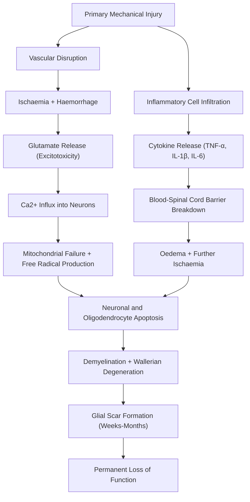
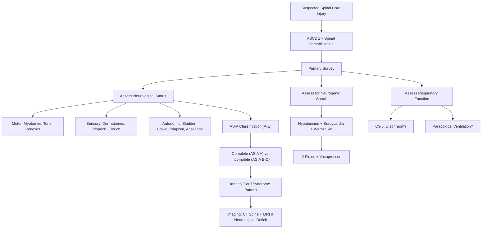

# Spinal Cord Injuries

## 1. Definition

A **spinal cord injury (SCI)** is damage to the spinal cord that results in temporary or permanent changes in its motor, sensory, and/or autonomic function below the level of the lesion. The term breaks down from Latin/Greek roots: "spinal" (from Latin *spina* = thorn/backbone), "cord" (the cylindrical neural structure within the vertebral canal), and "injury" (from Latin *injuria* = wrongful damage).

SCI can be:
- **Primary injury**: the immediate mechanical disruption of neural tissue at the time of trauma (contusion, laceration, compression, distraction) — this is essentially irreversible at the moment it occurs.
- ***Secondary injury***: the cascade of ischaemia, oedema, inflammation, excitotoxicity, and apoptosis that follows the primary insult, causing **delayed neurological deterioration** [1]. This is the window where early intervention can make a difference.

> ***"Acute paraplegia is an EMERGENCY"*** — the spinal cord is "very unforgiving," and ***sphincter dysfunction represents a point of no return*** [1].

<Callout title="Key Concept">
The distinction between primary and secondary injury is critical: you cannot undo primary mechanical damage, but you CAN mitigate secondary injury through rapid immobilisation, haemodynamic optimisation, and timely surgical decompression.
</Callout>

---

## 2. Epidemiology

### 2.1 Global and Hong Kong Context

- **Global incidence**: approximately 250,000–500,000 new SCI cases per year worldwide (WHO estimate). Traumatic SCI incidence is roughly 10–80 per million population per year depending on region.
- **Hong Kong**: SCI incidence is approximately 20–30 per million per year. Queen Mary Hospital and Princess Margaret Hospital are the major SCI referral centres.
- **Prevalence**: due to improved survival, the global prevalence of SCI is rising; estimated 2–3 million people living with SCI worldwide.

### 2.2 Age and Sex Distribution

- ***Bimodal distribution*** [2]:
  - ***Young adults (15–35 years)***: predominantly ***high-energy trauma*** (road traffic accidents, falls from height, sports injuries, assaults) [2]
  - ***Older adults (≥ 65 years)***: predominantly ***low-energy trauma*** in the setting of ***osteoporotic bone*** and ***pre-existing spinal stenosis*** (meaning a minor fall can cause cord injury in an already narrow canal) [2]
- **Male:Female ratio** ≈ 3–4:1 (young males are overrepresented due to high-risk behaviours and occupational hazards)

### 2.3 Common Causes

- ***Falls*** (most common overall, especially in children and the elderly) [3]
- ***Road traffic accidents (RTA)*** (most common cause of death < 40) [4][3]
- ***Assaults*** (knife/bullet injuries — these produce specific injury patterns such as ***Brown-Séquard syndrome***) [1][5]
- Sports/recreation-related injuries (diving into shallow water, rugby, equestrian)
- In Hong Kong, falls from height (especially construction-related) and RTAs are the leading causes.

### 2.4 Site of Injury

- ***50% cervical*** [6] — this is the most mobile segment of the spine and has the least bony protection relative to the range of movement
- ***15% associated with non-adjacent level injuries*** [6] — meaning if you find one spinal fracture, you **must** image the entire spine because there may be another fracture elsewhere
- ***25% associated with other organ injuries*** [6] — polytrauma is the norm, not the exception

> ***Polytrauma involves injuries to the spine in up to 30% of cases. Multiple spinal fractures occur in 3 to 5% — examine and XR the whole spine.*** [2]

<Callout title="Exam Pearl" type="error">
A common mistake is to stop looking after finding one spinal fracture. Up to 15% of spinal injuries are non-contiguous (at a different level), and polytrauma patients may have 2–3 fractures. Always image the whole spine.
</Callout>

---

## 3. Risk Factors

| Category | Risk Factors | Mechanism |
|----------|-------------|-----------|
| **Demographic** | Young males (15–35), elderly (≥ 65) | High-energy behaviour; osteoporotic/stenotic spine |
| **Pre-existing spinal disease** | ***Pre-existing spinal stenosis***, cervical spondylosis, OPLL, ankylosing spondylitis | Already narrowed canal → minor trauma causes disproportionate cord injury |
| **Bone quality** | ***Osteoporosis***, metabolic bone disease, chronic steroid use | Vertebral body fractures occur with minimal force |
| **Connective tissue disorders** | Down syndrome (absent/lax transverse ligament), Marfan syndrome, Ehlers-Danlos | Ligamentous hyperlaxity → atlantoaxial instability |
| **Inflammatory** | Rheumatoid arthritis (atlantoaxial subluxation), ankylosing spondylitis (bamboo spine) | Weakened transverse ligament (RA); rigid ankylosed spine fractures like a long bone (AS) |
| **Behavioural** | Alcohol/drug intoxication, high-risk sports, occupational hazards (construction workers) | Impaired judgment, high-energy mechanisms |
| **Iatrogenic** | Spinal surgery, intubation in unstable C-spine | Direct mechanical injury during procedures |

---

## 4. Anatomy and Function of the Spinal Cord

Understanding the anatomy is essential because the clinical features of SCI are a direct map of which tracts and segments are damaged.

### 4.1 Vertebral Column

- **33 vertebrae**: 7 cervical, 12 thoracic, 5 lumbar, 5 sacral (fused), 4 coccygeal (fused)
- The spinal cord ends at approximately **L1-L2** (conus medullaris) in adults. Below this, the cauda equina (Latin: "horse's tail") — a bundle of nerve roots, not spinal cord — occupies the vertebral canal.
- **Critical clinical implication**: injuries above L1 cause spinal cord syndromes (UMN); injuries below L2 cause **cauda equina syndrome** (pure LMN) [7][8].

### 4.2 Three-Column Theory (Denis Classification)

This is used for **assessing stability of the lower cervical spine and thoracolumbar spine** [3]:

| Column | Components |
|--------|-----------|
| ***Anterior column*** | ***Anterior 2/3 of vertebral body, disc, and anterior longitudinal ligament (ALL)*** |
| ***Middle column*** | ***Posterior 1/3 of vertebral body, disc, and posterior longitudinal ligament (PLL)*** |
| ***Posterior column*** | ***Remaining posterior arch (pedicles, laminae, facet joints, spinous processes, interspinous and supraspinous ligaments)*** |

> ***Unstable fracture if 2/3 segments are disrupted*** [3]. This is the key principle — if two or more columns are broken, the spine cannot hold itself together and the cord is at risk of further damage from instability.

### 4.3 Spinal Cord Internal Anatomy

The cross-section of the spinal cord contains:

| Structure | Location | Function | What happens if damaged? |
|-----------|----------|----------|--------------------------|
| **Corticospinal tract (lateral)** | Lateral white matter | Voluntary motor (UMN) — fibres have already crossed in the medullary pyramids | Ipsilateral UMN weakness below the lesion (spasticity, hyperreflexia, upgoing plantars) |
| **Dorsal columns (gracilis & cuneatus)** | Posterior white matter | Proprioception, vibration, fine touch — fibres ascend ipsilaterally, cross in medulla | Ipsilateral loss of proprioception and vibration below lesion |
| **Spinothalamic tract** | Anterolateral white matter | Pain and temperature — fibres cross within 1–2 segments of entering the cord | Contralateral loss of pain and temperature (the crossing happens at the level of entry, which matters for central cord syndrome) |
| **Anterior horn cells** | Central grey matter (ventral) | LMN cell bodies | LMN signs at the level of lesion (flaccid weakness, fasciculations, areflexia) |
| **Intermediolateral cell column** | Lateral grey matter (T1–L2) | Sympathetic preganglionic neurons | Autonomic dysfunction (neurogenic shock, autonomic dysreflexia) |
| **Sacral parasympathetic nuclei** | S2–S4 | Bladder, bowel, sexual function | Bladder/bowel/sexual dysfunction |

### 4.4 Blood Supply

- **Anterior spinal artery (ASA)**: supplies the anterior 2/3 of the cord (corticospinal tracts, spinothalamic tracts, anterior horns). This is a single vessel — a "watershed" area vulnerable to ischaemia.
- **Paired posterior spinal arteries (PSA)**: supply the posterior 1/3 (dorsal columns).
- **Segmental radicular arteries**: feed into the ASA and PSA. The most important is the **artery of Adamkiewicz** (usually arises T9–T12 on the left) — occlusion causes devastating anterior cord syndrome.
- **Venous drainage**: internal vertebral venous plexus (Batson's plexus) — valveless, which is why metastases from prostate, breast, lung, kidney, and thyroid spread to the spine so readily.

<Callout title="Why does anterior cord syndrome spare proprioception?">
Because proprioception travels in the dorsal columns, which are supplied by the posterior spinal arteries. Anterior spinal artery occlusion therefore spares them while destroying motor function and pain/temperature sensation.
</Callout>

### 4.5 Key Dermatome Landmarks

| Dermatome | Landmark |
|-----------|----------|
| C4 | Clavicle / shoulder cape |
| C6 | Thumb |
| C7 | Middle finger |
| C8 | Little finger |
| T4 | Nipple line |
| T10 | Umbilicus |
| L1 | Inguinal ligament |
| L4 | Medial leg / knee |
| L5 | Dorsum of foot / great toe |
| S1 | Lateral foot / sole |
| S2-S4 | Perianal ("saddle") area |

### 4.6 Key Myotome Landmarks (ASIA Motor Testing)

| Root | Key Muscle | Action |
|------|-----------|--------|
| C5 | Biceps/deltoid | Elbow flexion |
| C6 | Wrist extensors | Wrist extension |
| C7 | Triceps | Elbow extension |
| C8 | Finger flexors (FDP to middle finger) | Finger flexion |
| T1 | Hand intrinsics (abductor digiti minimi) | Finger abduction |
| L2 | Iliopsoas | Hip flexion |
| L3 | Quadriceps | Knee extension |
| L4 | Tibialis anterior | Ankle dorsiflexion |
| L5 | Extensor hallucis longus | Great toe extension |
| S1 | Gastrocnemius/soleus | Ankle plantarflexion |

### 4.7 The Phrenic Nerve (C3, C4, C5)

The diaphragm is innervated by the phrenic nerve (C3-C5). This is clinically critical:
- ***Respiratory arrest if injury above C3*** (loss of control of diaphragm → cannot breathe at all) [8]
- ***Diaphragmatic breathing if C5 or below*** (loss of control of intercostal muscles, but diaphragm preserved) [8]
- ***Paradoxical ventilation*** [6]: when intercostal muscles are paralysed, diaphragmatic contraction during inspiration draws the rib cage inward instead of expanding it — the chest and abdomen move out of phase.

<Callout title="C3, 4, 5 keeps the diaphragm alive" type="idea">
This classic mnemonic reminds you that C3-5 injuries are life-threatening because they compromise diaphragmatic function. Any cervical SCI patient needs immediate airway assessment.
</Callout>

---

## 5. Etiology (Focus on Hong Kong)

### 5.1 Traumatic SCI (Most Common)

***Trauma is the commonest cause of acute paraplegia*** [1][7].

| Mechanism | Examples | Hong Kong Context |
|-----------|---------|-------------------|
| ***Falls*** | Falls from height (construction), falls at home (elderly) | **Leading cause in HK** — construction industry falls, elderly falls at home |
| ***RTA*** | Motor vehicle collisions, motorcycle accidents, pedestrian struck | Second most common; high-speed collisions on highways |
| ***Assault*** | Stab wounds (knife), gunshot wounds | ***Gang fights with chopped/stabbed wounds*** can cause ***nerve and vascular injury*** [5] |
| ***Sports*** | Diving into shallow water, rugby, equestrian | Diving injuries particularly cause cervical SCI |
| ***Iatrogenic*** | Surgical positioning, epidural haematoma post-spinal anaesthesia | Rare but important |

### 5.2 Non-Traumatic SCI

| Category | Examples | Notes |
|----------|---------|-------|
| **Degenerative** | ***Spondylotic myelopathy*** (MC non-traumatic), OPLL | Very common in elderly HK population; chronic canal narrowing |
| **Neoplastic** | ***Primary or secondary tumours*** | Metastases from paired organs: ***thyroid, breast, lung, kidney, prostate*** (spread via Batson's plexus) [7] |
| **Infective** | ***TB spine (Pott's disease)***, epidural abscess, spondylodiscitis, viral myelitis | TB spine is particularly relevant in HK due to higher prevalence of TB compared to Western countries |
| **Inflammatory** | ***Transverse myelitis, MS, NMO, radiation myelopathy, paraneoplastic myelopathy*** | MS less common in HK Chinese population vs Caucasians; NMO (Devic's) relatively more common in Asians |
| **Vascular** | ***Spinal infarct*** (anterior spinal artery syndrome), vascular malformations (AVM, dural AVF) | Spinal infarct may follow aortic surgery or hypoperfusion states |
| **Congenital/Developmental** | ***Spinal dysraphism, syringomyelia***, hereditary spastic paraplegia, Friedreich's ataxia | Spina bifida incidence reduced by folate supplementation |
| **Degenerative (neurological)** | ***MND, spinocerebellar ataxia*** | Progressive, no acute presentation |
| **Metabolic** | ***Subacute combined degeneration*** (B12 deficiency) | Combined posterior and lateral column disease |
| **Disc herniation** | ***Prolapsed intervertebral disc (PID)*** | L4/5 and L5/S1 most common levels; can cause cauda equina if massive central herniation |

> ***Common causes of paraplegia: Spinal trauma, Spinal tumours, Degenerative conditions, Infection, Spinal dysraphism*** [1]

---

## 6. Pathophysiology

### 6.1 Primary Injury Mechanisms

These are the **immediate** mechanical forces applied to the cord at the moment of injury:

1. **Compression**: most common — fractured vertebral body or disc material pushes into the cord. Think of a burst fracture where bone fragments retropulse into the canal.
2. **Contusion**: cord is bruised by transient compression/impact. The cord bounces back to normal position but the internal damage is done — central haemorrhagic necrosis of grey matter with relative white matter sparing (explains central cord syndrome).
3. **Laceration/transection**: complete or partial cutting of the cord (e.g., knife or bullet wound — produces Brown-Séquard).
4. **Distraction**: the cord is stretched longitudinally beyond tolerance (e.g., seatbelt injuries, hangings).
5. **Vascular disruption**: tearing of vessels supplying the cord → ischaemia.

### 6.2 Secondary Injury Cascade

After the primary insult, a devastating cascade unfolds over hours to weeks:

Key points:
- **Ischaemia** is the main driver of secondary injury — the cord's blood supply is disrupted and autoregulation fails
- **Excitotoxicity**: damaged neurons release excessive glutamate → overactivation of NMDA receptors → massive calcium influx → cell death
- **Inflammation**: neutrophils infiltrate within hours, followed by macrophages — this initially worsens damage but is also necessary for debris clearance
- **Oedema**: vasogenic and cytotoxic oedema expand the zone of injury cranially and caudally
- **Glial scar**: astrocytes form a barrier (the "glial scar") that prevents axonal regeneration — this is why spinal cord injuries are so permanent

> ***Secondary neurological injury occurs from instability due to bony and ligamentous injuries, and haematoma → this leads to delayed neurological deterioration*** [1]

<Callout title="Why is early immobilisation so important?">
Because secondary injury is worsened by ongoing mechanical instability. If a spine is unstable (2/3 columns disrupted), any movement allows further compression, distraction, and vascular disruption of the already-injured cord. This is why we immobilise first and investigate later.
</Callout>

### 6.3 Spinal Shock — Two Meanings

***Spinal shock has TWO meanings*** [1]:

| Meaning | Mechanism | Clinical Features | Duration |
|---------|-----------|-------------------|----------|
| ***1. Neurological spinal shock*** | ***Flaccid paralysis and areflexia for 1–2 weeks after injury*** — peripheral neurons become temporarily unresponsive to brain stimuli due to sudden loss of tonic descending excitatory input | ***Flaccid paralysis*** (NOT spastic), absent deep tendon reflexes, absent bulbocavernosus reflex | ***1–2 weeks*** (then ***hyperreflexia of UMN lesion occurs later***) [1] |
| ***2. Neurogenic (haemodynamic) shock*** | ***Interruption of sympathetics*** → loss of vasomotor tone below the lesion (T1–L2 sympathetic outflow disrupted) | ***Vasodilatation → hypotension, bradycardia*** (because unopposed vagal tone), ***warm flushed skin*** (unlike hypovolaemic shock where skin is cold and clammy) | Days to weeks |

***Treatment of neurogenic shock: IV fluids and vasopressors/inotropes*** [1]

| Feature | Spinal Shock | Neurogenic Shock |
|---------|-------------|-----------------|
| **BP/Pulse** | ***Hypotension, Bradycardia*** | ***Hypotension, Bradycardia*** |
| **Bulbocavernosus reflex** | ***Absent*** | ***Present*** |
| **Motor** | ***Flaccid paralysis*** | ***Normal*** (motor deficit is from the cord injury itself, not the shock) |

> The **bulbocavernosus reflex** (squeeze glans penis or tug on Foley catheter → anal sphincter contraction) is the first reflex to return after spinal shock resolves. Its return signals the end of spinal shock — at that point, whatever deficits remain are likely permanent.

<Callout title="Don't confuse these two!" type="error">
Students commonly conflate neurological spinal shock (a period of areflexia) with neurogenic shock (a cardiovascular state of hypotension + bradycardia from sympathetic disruption). They are different phenomena that can coexist. Also, don't confuse neurogenic shock with hypovolaemic shock — in neurogenic shock, the patient is warm and bradycardic; in hypovolaemic shock, the patient is cold and tachycardic.
</Callout>

### 6.4 Why Does SCI Above T6 Cause Autonomic Dysreflexia (Later)?

This is a chronic complication but worth understanding the pathophysiology now [8]:

- Lesion at or above T6 disrupts descending sympathetic regulation
- A noxious stimulus below the lesion (full bladder, constipation, skin pressure) generates a massive afferent signal
- This triggers a **reflex sympathetic discharge below the lesion** → vasoconstriction → **severe hypertension** (the brain cannot send inhibitory signals down through the damaged cord)
- The brain detects the hypertension via baroreceptors → sends **vagal reflex** → **bradycardia** + vasodilation **above** the lesion only (because the sympathetic inhibition cannot pass through the cord lesion)
- Result: ***paroxysmal HTN, throbbing headache, excessive sweating and flushing above the lesion, bradycardia, anxiety*** [8]

---

## 7. Classification

### 7.1 By Completeness — ***ASIA Classification (IMPORTANT!)*** [1][3][6]

The **American Spinal Injury Association (ASIA) Impairment Scale** classifies the severity of SCI:

***Sensory: test pinprick and touch in each dermatome***
***Motor: test the 10 key motor functions*** [1][6]

| Grade | Type | Description |
|-------|------|-------------|
| ***A*** | ***Complete*** | ***No motor, No sensory, No sacral sparing*** below the neurological level |
| ***B*** | ***Incomplete*** | ***No motor, sensory only*** preserved below the level (including sacral segments S4-S5) |
| ***C*** | ***Incomplete*** | ***Motor function preserved below level, but > 50% of key muscles below the level have a muscle grade < 3*** (***cannot raise arms or legs off bed***) |
| ***D*** | ***Incomplete*** | ***Motor function preserved below level, and ≥ 50% of key muscles below the level have a muscle grade ≥ 3*** (***can raise arms or legs off bed***) |
| ***E*** | ***Normal*** | ***Motor and sensory function are normal*** |

<Callout title="Sacral Sparing — The Key Distinction">
The difference between ASIA A (complete) and ASIA B (incomplete) is **sacral sparing** — if the patient has any sensation at S4-S5 (perianal area) or voluntary anal contraction, the injury is INCOMPLETE. This matters enormously for prognosis because incomplete injuries have far better recovery potential.
</Callout>

> ***Complete injury — prognosis is generally poor. Incomplete injury — prognosis highly variable.*** [1]

### 7.2 By Level

| Level | Term | Key Features |
|-------|------|-------------|
| **C1–C4** | High cervical tetraplegia | Respiratory failure (C3-5 → phrenic nerve), ventilator-dependent |
| **C5–C8** | Low cervical tetraplegia | Upper and lower limb involvement, variable hand function |
| **T1–T12** | Paraplegia | Lower limbs affected, upper limbs spared; above T6 → risk of autonomic dysreflexia |
| **L1–L2** | Conus medullaris | Mixed UMN + LMN signs, early bladder/bowel involvement |
| **Below L2** | Cauda equina | Pure LMN, saddle anaesthesia, bladder/bowel dysfunction |

### 7.3 By Spinal Cord Syndrome — Clinical Patterns

These are the classic incomplete cord syndromes [7][8]:

#### Complete Cord Syndrome
- **Features**: ***Loss of all sensory modality below lesion; LMN loss at level, UMN loss below level; Spastic bladder (or DSD)***
- **Causes**: ***Trauma, transverse myelitis, acute compression; Benign tumours, spondylosis***
- **Pathophysiology**: complete disruption of all ascending and descending tracts

#### Anterior Cord Syndrome
- **Features**: ***Loss of pain and temperature below; UMN loss below with spastic bladder***
- **Causes**: ***SC infarct, prolapsed disc; Radiation myelopathy, HTLV-1***
- **Pathophysiology**: anterior spinal artery occlusion → infarction of the anterior 2/3 of the cord (corticospinal tracts + spinothalamic tracts + anterior horns). Dorsal columns are spared because they are supplied by posterior spinal arteries.

#### Dorsal Cord Syndrome (Posterior Cord)
- **Features**: ***Loss of proprioception and vibration below; Variable weakness and bladder dysfunction***
- **Causes**: ***Epidural metastasis; Spondylosis, MS, subacute combined degeneration, Friedreich's ataxia***
- **Pathophysiology**: damage to dorsal columns. Motor function relatively preserved because corticospinal tracts are lateral.

#### Brown-Séquard Syndrome (Cord Hemisection)
- **Features**: ***Ipsilateral weakness + loss of proprioception; Contralateral loss of pain and temperature***
- **Causes**: ***Knife or bullet injury; Tumour, spondylosis, MS, radiation necrosis***
- **Pathophysiology**: hemisection of the cord. Motor tracts (corticospinal) and dorsal columns have already crossed above (or don't cross until the brainstem), so damage is ipsilateral. Spinothalamic tracts cross within 1–2 segments of entry, so the contralateral pain/temperature loss is from fibres that have already crossed from the opposite side.
- **Best prognosis** of all incomplete syndromes (because at least half the cord is intact)

#### Central Cord Syndrome
- **Features**: ***Segmental suspended spinothalamic loss; Segmental ± UL > LL long-tract weakness; ± "cape-like" loss of pain and temperature***
- **Causes**: ***Spinal stroke, traumatic contusion, transverse myelitis; Syringomyelia, intramedullary tumour***
- **Pathophysiology**: the central cord is damaged first. The spinothalamic fibres cross centrally (in the anterior white commissure) → suspended (segmental) pain/temperature loss at the level of the lesion. The corticospinal tract is arranged somatotopically with **cervical fibres medially and sacral fibres laterally** (lamination) → central damage preferentially affects upper limb motor fibres → ***UL weakness > LL weakness***. In syringomyelia, the expanding syrinx gradually destroys crossing spinothalamic fibres → "cape-like" dissociated sensory loss.
- **Most common incomplete SCI in the elderly** — typically from hyperextension injury in a patient with pre-existing cervical spondylosis.

#### Conus Medullaris Syndrome
- **Features**: ***Mixed LMN + UMN signs + saddle anaesthesia; Paralytic bladder and bowel incontinence***
- **Causes**: ***Prolapsed IVD, trauma; Tumours***
- **Pathophysiology**: the conus (L1-L2 level) contains the sacral parasympathetic outflow (S2-4) and the terminal portion of the cord where UMN and LMN overlap → mixed picture. Early bladder/bowel involvement because the sacral micturition centre is located here.

#### Cauda Equina Syndrome
- **Features**: ***Pure LMN signs + saddle anaesthesia; Paralytic bladder and bowel incontinence***
- **Causes**: ***Prolapsed IVD (L4/5, L5/S1); Tumours, spinal stenosis***
- **Pathophysiology**: below L2, there is no spinal cord — only nerve roots (cauda equina). Compression produces purely peripheral nerve damage (LMN). ***Compression of cauda equina (below L2)*** [7].
- **Key difference from conus**: no UMN signs; pain is more prominent and radicular; bladder involvement may present later but is often irreversible once established.

<Callout title="Conus vs Cauda Equina" type="idea">

| Feature | Conus Medullaris | Cauda Equina |
|---------|-----------------|--------------|
| Motor | Mixed UMN + LMN | Pure LMN |
| Pain | Less prominent, bilateral | Prominent, often unilateral/radicular |
| Bladder/bowel | Early, severe | Late, but irreversible |
| Sensory | Saddle, bilateral, symmetric | Saddle, may be asymmetric |
| Reflexes | Variable (UMN and LMN mixed) | Absent (LMN) |
</Callout>

### 7.4 AO Classification of Cervical Spine Fractures [3]

#### Upper Cervical (C0–C2)

| Region | Injury Type |
|--------|------------|
| ***Type 1: Occipital condyle, cranio-cervical junction*** | ***Type A: Bony injury only*** |
| ***Type 2: C1 ring, C1/2 joint*** | ***Type B: Tension band injuries*** |
| ***Type 3: C2 and C2/3 joint*** | ***Type C: Translation injuries*** |

#### Subaxial (C3–C7)

| Injury Type |
|------------|
| ***Type A: Compression injuries*** |
| ***Type B: Distraction injuries*** |
| ***Type C: Translation injuries*** |
| ***Type F: Facet joint injuries*** |

### 7.5 Stability Assessment

- ***Stable injury: ligaments not damaged*** [6]
- ***Unstable injury: ligaments disrupted*** [6]
- ***Mechanism of injury helps determine degree of stability*** [6]

Clinical signs of instability:
- ***"Step over spinous processes" for any tenderness, swelling or gap between spinous processes*** [6] — a gap indicates rupture of the interspinous ligament (i.e., unstable injury)

---

## 8. Clinical Features

### 8.1 Symptoms

#### A. Motor Symptoms

| Symptom | Pathophysiological Basis |
|---------|------------------------|
| **Weakness/paralysis of limbs below the lesion** | Disruption of descending corticospinal tracts → loss of voluntary motor commands to anterior horn cells below the level |
| **Tetraplegia** (all four limbs) | Cervical cord injury → both upper and lower limb corticospinal tracts interrupted |
| **Paraplegia** (lower limbs only) | Thoracic or lumbar cord injury → lower limb corticospinal tracts interrupted, upper limbs spared |
| **Clumsiness/loss of fine motor control** | Damage to corticospinal tract (which carries fine, fractionated finger movements) and/or dorsal columns (loss of proprioceptive feedback) |
| ***Upper limb > lower limb weakness (central cord)*** | Central cord syndrome — somatotopic arrangement of corticospinal tract with cervical fibres medially → damaged first by central lesion |

#### B. Sensory Symptoms

| Symptom | Pathophysiological Basis |
|---------|------------------------|
| **Numbness/anaesthesia below a sensory level** | Disruption of ascending sensory tracts (spinothalamic and/or dorsal columns) |
| **Paraesthesia (tingling/pins and needles)** | Partial damage to sensory tracts → aberrant signal transmission |
| ***Saddle anaesthesia*** | Damage to S2-S4 nerve roots or conus → loss of sensation in perineum, inner thighs, and perianal area |
| **Band-like sensation** at the level of injury | Segmental irritation of dorsal root at the level of the lesion |
| **Dissociated sensory loss** | Selective tract damage: anterior cord → lose pain/temperature but keep proprioception; dorsal cord → lose proprioception but keep pain/temperature |
| ***"Cape-like" loss of pain and temperature*** | Central cord / syringomyelia → crossing spinothalamic fibres at multiple segmental levels destroyed → bilateral suspended sensory loss in a cape distribution |

#### C. Autonomic and Visceral Symptoms

| Symptom | Pathophysiological Basis |
|---------|------------------------|
| ***Painless acute retention of urine (AROU)*** | Loss of descending control to sacral micturition centre (S2-4) → detrusor cannot contract; loss of sensation → patient doesn't feel the full bladder [1][6] |
| **Overflow urinary incontinence** | Bladder fills beyond capacity → passive overflow due to paralysed detrusor |
| ***Faecal incontinence / constipation*** | Loss of voluntary control of external anal sphincter and disruption of colonic motility |
| **Sexual dysfunction / impotence** | Disruption of parasympathetic (S2-4 erection) and sympathetic (T11-L2 ejaculation) pathways |
| ***Priapism*** | Loss of sympathetic tone → unopposed parasympathetic vasodilation of penile blood vessels → sustained erection [6] — this is an ominous sign of severe SCI |
| **Respiratory difficulty** | Cervical injuries → loss of intercostal muscle function (T1-T12) and/or diaphragm (C3-5) |

#### D. Pain

| Pain Type | Pathophysiological Basis |
|-----------|------------------------|
| **Back/neck pain at the level of injury** | Bony, ligamentous, and soft tissue damage; nerve root compression |
| **Radicular pain** (shooting, dermatomal) | Compression or irritation of individual nerve roots at the fracture level |
| **Neuropathic pain** (burning, electric) | Damage to spinothalamic tract and/or posterior horn → aberrant pain signalling |

### 8.2 Signs

#### A. Motor Signs

**During spinal shock phase (first 1–2 weeks):**

| Sign | Pathophysiological Basis |
|------|------------------------|
| ***Flaccid paralysis below the lesion*** | Spinal shock → temporary complete loss of all reflex activity below the lesion due to sudden withdrawal of tonic descending facilitation [1] |
| ***Areflexia (absent deep tendon reflexes)*** | Same mechanism — the reflex arc's excitability depends on descending supraspinal facilitation, which is suddenly lost |
| ***Absent bulbocavernosus reflex*** | The sacral reflex arc is temporarily suppressed |

**After spinal shock resolves (weeks to months):**

| Sign | Pathophysiological Basis |
|------|------------------------|
| **Spastic paralysis below the lesion** | ***Hyperreflexia of UMN lesion occurs later*** [1] — loss of descending inhibitory pathways → anterior horn cells become hyperexcitable |
| **Hyperreflexia** | Loss of inhibitory UMN influence on spinal reflex arcs → exaggerated stretch reflexes |
| **Clonus** | Sustained rhythmic involuntary contraction due to hyperexcitable stretch reflex loop |
| **Upgoing plantars (Babinski sign)** | Loss of corticospinal tract input → primitive flexion withdrawal reflex (normally suppressed) re-emerges |
| **Increased muscle tone / spasticity** | Loss of descending inhibition → increased gamma motor neuron activity → increased muscle spindle sensitivity |
| **LMN signs at the level of the lesion** | Destruction of anterior horn cells at the injury level → flaccid weakness, muscle wasting, fasciculations at that specific segment |

#### B. Sensory Signs

| Sign | Pathophysiological Basis |
|------|------------------------|
| **Sensory level** (sharp dermatomal boundary) | All ascending sensory fibres interrupted at a specific cord level → sensory loss below, normal above. The highest intact dermatome defines the "sensory level." |
| **Segmental sensory loss at the level** | Damage to entering dorsal root fibres at the injury level |
| **Dissociated sensory loss** | Selective tract involvement — depends on which syndrome |
| ***Lhermitte's sign*** (electric shock sensation down spine with neck flexion) | Demyelinated dorsal columns in the cervical cord are mechanically sensitive → flexion stretches them → paroxysmal discharge |

#### C. Autonomic and Other Signs

| Sign | Pathophysiological Basis |
|------|------------------------|
| ***Neurogenic shock: hypotension, bradycardia, warm flushed skin*** | ***Interruption of sympathetics*** → loss of vascular tone (vasodilatation) and loss of cardiac sympathetic drive (T1-T4) → unopposed vagal bradycardia [1][8] |
| ***Paradoxical ventilation*** | ***When intercostal muscles are paralysed, diaphragmatic muscle contraction during inspiration draws the rib cage inward*** [6] |
| ***Diaphragmatic breathing*** | Loss of intercostal muscle innervation → sole reliance on diaphragm for ventilation |
| ***Lax anal tone*** | Loss of S2-4 innervation to external anal sphincter → flaccid [1][6] |
| ***Priapism*** | Loss of sympathetic tone → unopposed parasympathetic → sustained erection [6] |
| **Distended bladder (palpable/percussable)** | AROU from neurogenic bladder |
| **Ileus / absent bowel sounds** | Neurogenic ileus — loss of autonomic input to bowel → atonic gut |
| **Poikilothermia** (body temperature varies with environment) | ***Impaired thermoregulation*** [8] — loss of sympathetic control of cutaneous vasomotor responses and sweating below the lesion |
| **Pressure sores** | Loss of sensation → patient cannot feel prolonged pressure → tissue ischaemia → ulceration [8] |

<Callout title="Initial Assessment Checklist for SCI" type="idea">
On initial assessment, look for [6]:
1. ***"Step over spinous processes"*** for tenderness, swelling, or gap
2. ***Neurogenic shock signs***: paradoxical ventilation, bradycardia, hypotension
3. ***Neurological deficits***: flaccid limbs, sensory level
4. ***Anogenital signs***: painless AROU, lax anal tone, priapism
</Callout>

### 8.3 Clinical Scenario (From Lecture Slides)

> ***A 28-year-old man sustained a fall from height. On admission, he was fully conscious. He was unable to move his lower limbs. His upper limbs were normal.*** [1]
>
> ***What other symptoms and signs should you look for?***
> ***UMN/LMN signs; sensory level & segmental loss; saddle anaesthesia; AROU; lax anal tone; spinal shock*** [1]
>
> ***What was the likely level of spinal cord injury?***
> ***Likely below T1; see sensory level*** [1]
>
> ***What was the extent of injury?***
> Determined by ASIA classification — need to assess motor and sensory function systematically.

---

## 9. Special Considerations

### 9.1 Neurogenic Bladder in SCI

***Detrusor sphincter dyssynergia (DSD)*** [8][9]:
- ***Cause: spinal cord injury, pontine stroke***
- ***Mechanism: interruption of descending control by pontine micturition centre → failure of detrusor-sphincter coordination → synchronous contraction of both detrusor and sphincters***
- ***Consequence: ↑↑urinary tract pressure → upper tract damage***

This is different from the initial areflexic bladder during spinal shock (where the detrusor is flaccid). After spinal shock resolves:
- **Suprasacral lesion** → spastic (reflex) bladder with DSD
- **Sacral lesion / cauda equina** → flaccid (paralytic) bladder → overflow incontinence

Patients with long-term indwelling catheters have a ***16–20x risk of developing SCC (squamous cell carcinoma) in the bladder*** (NOT UCC, because of chronic irritation by catheter in bladder) [10].

### 9.2 SCI in the Context of Head Injury

***Spinal cord injury: sensory level, motor deficits, anal tone*** should be assessed as part of head injury evaluation [3]. In polytrauma, always assume a spinal injury until proven otherwise.

### 9.3 ***Long-Term Issues*** [1]

> ***Long-term issues include: dysreflexia, neurogenic bladder, spasticity, contracture, and skin problems*** [1]

---

## 10. Summary of Clinical Approach

---

<Callout title="High Yield Summary">

1. **SCI = primary (irreversible) + secondary (preventable) injury**. Early immobilisation and haemodynamic support reduce secondary damage.

2. **Epidemiology**: bimodal (young males — high energy trauma; elderly — low energy + stenosis). 50% cervical. 15% non-contiguous. Always image the whole spine.

3. **Three-column theory**: unstable if ≥ 2/3 columns disrupted.

4. **Spinal shock ≠ Neurogenic shock**: Spinal shock = flaccid paralysis + areflexia (1–2 weeks). Neurogenic shock = hypotension + bradycardia from sympathetic disruption. Key differentiator: bulbocavernosus reflex absent in spinal shock, present in neurogenic shock.

5. **ASIA classification**: A = complete (no sacral sparing); B = sensory only; C = motor < grade 3 in > 50%; D = motor ≥ grade 3 in ≥ 50%; E = normal. Sacral sparing differentiates A from B.

6. **Cord syndromes**: Complete, Anterior (lose pain/temp + motor, keep proprioception), Dorsal (lose proprioception, keep motor), Brown-Séquard (ipsilateral motor + proprioception, contralateral pain/temp — best prognosis), Central (UL > LL weakness, cape-like sensory loss — most common in elderly with spondylosis), Conus (mixed UMN/LMN + early bladder), Cauda equina (pure LMN + saddle anaesthesia).

7. **C3, 4, 5 keeps the diaphragm alive** — injuries above C3 → respiratory arrest.

8. **Autonomic dysreflexia**: lesion at or above T6, noxious stimulus below → reflex sympathetic surge → severe HTN + bradycardia.

9. **Initial assessment**: step over spinous processes, neurogenic shock signs, neurological deficits (flaccid limbs + sensory level), anogenital signs (AROU, lax anal tone, priapism).

10. **Prognosis**: Complete injury — recovery rare. Incomplete injury — most recovery within 6 months. Loss of sphincter function is a poor prognostic factor. Methylprednisolone is NOT recommended (higher morbidity).

11. **Long-term problems**: autonomic dysreflexia, neurogenic bladder (DSD), spasticity, contractures, pressure sores, impaired thermoregulation.
</Callout>

---

<ActiveRecallQuiz
  title="Active Recall - Spinal Cord Injuries"
  items={[
    {
      question: "A patient has a spinal cord injury. On examination there is flaccid paralysis, areflexia, and absent bulbocavernosus reflex. After 3 weeks, hyperreflexia and spasticity develop. Explain what happened and name the two phases.",
      markscheme: "Phase 1: Spinal shock - temporary flaccid paralysis and areflexia due to sudden loss of descending excitatory input (lasts 1-2 weeks). Phase 2: UMN signs emerge (spasticity, hyperreflexia, upgoing plantars) as spinal reflex arcs become hyperexcitable without descending inhibition. Return of bulbocavernosus reflex signals end of spinal shock.",
    },
    {
      question: "A patient presents after a stab wound with ipsilateral weakness and loss of proprioception, plus contralateral loss of pain and temperature. Name the syndrome, explain the lateralisation pattern, and state the prognosis compared to other incomplete SCI syndromes.",
      markscheme: "Brown-Sequard syndrome (cord hemisection). Ipsilateral motor loss: corticospinal tract crosses at medullary pyramids so is ipsilateral at cord level. Ipsilateral proprioception loss: dorsal columns ascend ipsilaterally, cross in medulla. Contralateral pain/temperature loss: spinothalamic fibres cross within 1-2 segments of entry, so opposite side fibres are interrupted. Best prognosis of all incomplete syndromes because half the cord remains intact.",
    },
    {
      question: "What is the Three-Column Theory? When is a spinal fracture considered unstable?",
      markscheme: "Denis Three-Column Theory: Anterior column = anterior 2/3 vertebral body + disc + ALL; Middle column = posterior 1/3 vertebral body + disc + PLL; Posterior column = posterior arch (pedicles, laminae, facets, spinous processes, interspinous and supraspinous ligaments). Unstable if 2 or more of 3 columns are disrupted.",
    },
    {
      question: "Differentiate neurogenic shock from hypovolaemic shock in a trauma patient. Include mechanism, vital signs, and skin findings.",
      markscheme: "Neurogenic shock: loss of sympathetic tone from SCI -> vasodilatation -> hypotension + bradycardia (unopposed vagal tone) + warm, flushed skin. Hypovolaemic shock: blood loss -> sympathetic activation -> hypotension + tachycardia + cold, clammy skin. Key: bradycardia vs tachycardia; warm vs cold.",
    },
    {
      question: "Explain why a central cord syndrome causes upper limb weakness greater than lower limb weakness. What is the typical patient demographic?",
      markscheme: "The corticospinal tract is somatotopically arranged with cervical (upper limb) fibres medially and sacral (lower limb) fibres laterally. A central cord lesion damages medial fibres first, preferentially affecting the upper limbs. Typical patient: elderly with pre-existing cervical spondylosis who sustains a hyperextension injury (e.g., fall).",
    },
    {
      question: "What is autonomic dysreflexia? State the level of lesion required, the mechanism, and the clinical features.",
      markscheme: "Autonomic dysreflexia occurs with lesions at or above T6. Mechanism: noxious stimulus below lesion (e.g., full bladder) triggers massive reflex sympathetic discharge below lesion -> severe vasoconstriction -> hypertension. Brain detects HTN via baroreceptors -> vagal response -> bradycardia + vasodilation ABOVE lesion only (inhibitory signals cannot pass through the lesion). Features: paroxysmal hypertension, throbbing headache, sweating and flushing above lesion, bradycardia, anxiety.",
    },
  ]}
/>

---

## References

[1] Lecture slides: GC 110. Paraplegia Spinal cord compression Transverse myelitis Spinal dysraphism Neuroimaging III Spinal Cord.pdf
[2] Lecture slides: GC 227. Cervical Spine Pathology.pdf (slides on epidemiology and polytrauma)
[3] Senior notes: maxim.md (Section 2.7 Spine trauma)
[4] Senior notes: Ryan Ho Radiology.pdf (p1 — Trauma deaths)
[5] Lecture slides: GC 182. Chopped and stabbed wound in gang fight Nerves and vascular injury; Classification of injuries.pdf
[6] Senior notes: Ryan Ho Neurology.pdf (Section 9.6 Spinal Trauma, p176-177)
[7] Senior notes: maxim.md (Section 2.3 Approach to spine diseases — Cauda equina syndrome)
[8] Senior notes: Ryan Ho Fundamentals.pdf (Section 3.4.9 Paraplegia, p334-335)
[9] Senior notes: Ryan Ho Urogenital.pdf (p164 — Detrusor sphincter dyssynergia)
[10] Senior notes: felixlai.md (Section on bladder cancer risk factors — SCC in SCI patients)
