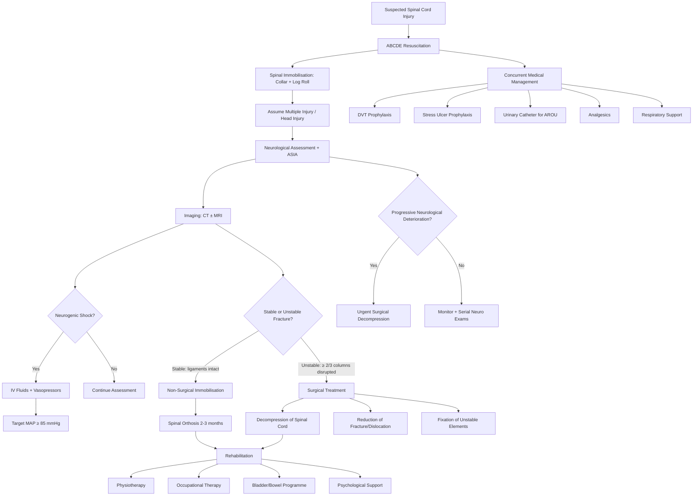

## Management of Spinal Cord Injuries

### Overarching Philosophy

Management of SCI follows a time-critical, phased approach. The fundamental principle is that **you cannot reverse primary injury, but you CAN prevent secondary injury**. Every minute of ongoing cord compression, ischaemia, or instability allows the secondary cascade (oedema, excitotoxicity, apoptosis) to extend the zone of damage. The management framework therefore moves through:

1. **Resuscitation** (keep the patient alive — ABCDE)
2. **Protection** (prevent further cord damage — immobilisation)
3. **Decompression** (relieve ongoing cord compression — surgery)
4. **Stabilisation** (restore spinal alignment and prevent future instability)
5. **Prevention of complications** (DVT, pressure sores, bladder, etc.)
6. **Rehabilitation** (maximise functional recovery)

> ***Principles of Management: Resuscitation (NB: spinal shock); Collar & log roll to protect spine; Assume multiple injury / head injury; Imaging studies; Methylprednisolone(?); Surgery to decompress spinal cord; Mechanical stabilisation; Prevent/Treat complications; Rehabilitation*** [1]

---

### Management Algorithm

---

### Phase 1: Pre-Hospital and Emergency Department — Resuscitation and Protection

#### A. ABCDE Approach

***ABCDE before any P/E*** [6]. The entire point is to keep the patient alive first. A dead patient has no spinal cord to save.

##### Airway

- ***Jaw thrust when C-spine injury IS a concern (eg. trauma)*** [20] — **never** head-tilt chin-lift in a suspected C-spine injury because extending the neck can worsen cervical cord compression
- If airway is not maintainable with basic manoeuvres → **rapid sequence intubation (RSI)** with **manual in-line stabilisation (MILS)** — this means one person holds the head and neck perfectly still while another intubates
- High cervical injuries (above C3-5) may cause **respiratory arrest** → immediate intubation and mechanical ventilation is life-saving [8]

Why? The phrenic nerve (C3, 4, 5) innervates the diaphragm. Lesions above C3 eliminate all spontaneous breathing. Lesions C3-5 may partially preserve diaphragmatic function but patients often need ventilatory support.

##### Breathing

- ***Diaphragmatic breathing if C5 or below*** (loss of control of intercostal muscles) [8]
- ***Paradoxical ventilation*** if intercostal muscles are paralysed [6]
- **High-flow O₂** (15 L/min via non-rebreather mask) for all trauma patients
- Monitor SpO₂ continuously — target SpO₂ > 92%
- Consider **mechanical ventilation** for:
  - High cervical SCI with respiratory insufficiency
  - Flail chest or associated thoracic injuries
  - Fatigue from isolated diaphragmatic breathing

##### Circulation

***Neurogenic shock management*** [1][8]:
- ***Cause: sympathetic signal disruption*** [8]
- ***Presentation: vasodilatation → hypotension, bradycardia, warm, flushed skin*** [8]
- ***Treat with IV fluids and vasopressors/inotropes*** [1]

| Step | Intervention | Rationale |
|------|-------------|-----------|
| 1 | **IV crystalloid bolus** (e.g., Ringer's lactate or 0.9% NaCl) | Expand intravascular volume to compensate for relative hypovolaemia from venous pooling |
| 2 | **Vasopressors** (noradrenaline first-line, or phenylephrine) if fluid-refractory | Restore vascular tone lost from sympathetic disruption — noradrenaline provides both α₁ (vasoconstriction) and β₁ (cardiac inotropy) |
| 3 | **Atropine** for symptomatic bradycardia | Block excessive vagal tone that is now unopposed |
| 4 | **Target MAP ≥ 85 mmHg** for 5–7 days | Current AO Spine/AANS guidelines recommend augmented MAP to optimise cord perfusion pressure — the cord, like the brain, needs adequate perfusion to minimise secondary ischaemic injury |

<Callout title="Hypovolaemic Before Neurogenic" type="error">
In polytrauma, **always assume hypovolaemic shock first** and actively search for bleeding (chest, abdomen, pelvis, long bones). Neurogenic shock is a diagnosis of exclusion. The classic trap: you assume the bradycardia is neurogenic, give vasopressors, and miss an intra-abdominal haemorrhage. If in doubt, resuscitate for blood loss AND neurogenic shock simultaneously.
</Callout>

##### Disability

- GCS assessment
- Pupillary examination
- ASIA neurological examination (as described in diagnostic section)
- Note: flaccid limbs + sensory level + AROU + lax anal tone + priapism = spinal cord injury until proven otherwise [6]

##### Exposure

- Full log-roll examination of the spine — ***"step over spinous processes" for any tenderness, swelling or gap*** [6]
- Temperature monitoring — patients with high SCI are **poikilothermic** (cannot thermoregulate below the lesion) → cover with warming blankets
- Look for associated injuries — ***assume multiple injury / head injury*** [1]

#### B. Spinal Immobilisation

***Collar & log roll to protect spine*** [1]

| Method | Description | Purpose |
|--------|-------------|---------|
| **Rigid cervical collar** (e.g., Philadelphia, Aspen) | Circumferential device around neck | Limits cervical flexion/extension/rotation to prevent further cord damage |
| **Log-roll technique** | Patient rolled as a unit (head, trunk, pelvis aligned) by ≥ 4 people | Prevents spinal rotation/flexion during transfers and examination |
| **Spinal board** | Rigid flat board for transport | Prevents spinal flexion during pre-hospital transport; remove as soon as possible (pressure sore risk) |
| **Sandbags + tape** | Placed either side of head and taped across forehead to the board | Additional immobilisation of the head/neck |

***Extreme caution in transportation of patient in those likely to have spinal cord injury*** [6]

Why immobilise? An unstable fracture means the vertebral column cannot hold its alignment. Any movement (even routine nursing care) can cause further displacement → further cord compression → **secondary neurological injury** [1]. Immobilisation buys time until definitive imaging and treatment.

---

### Phase 2: Medical Management

***Management — Medical*** [6]:
- ***ABC support***
- ***Prophylaxis for DVT, stress ulcers, AROU (urinary catheter)***
- ***Analgesics***

#### A. Haemodynamic Optimisation

As detailed above: IV fluids + vasopressors, target MAP ≥ 85 mmHg × 5-7 days.

#### B. Venous Thromboembolism (VTE) Prophylaxis

SCI patients have one of the highest rates of DVT/PE of any patient population (prevalence up to 80% without prophylaxis). Why? Loss of lower limb muscle pump + immobility + hypercoagulable state from trauma.

| Modality | Details | Timing |
|----------|---------|--------|
| **Mechanical** | Intermittent pneumatic compression (IPC) devices, graduated compression stockings | Start immediately |
| **Pharmacological** | Low-molecular-weight heparin (LMWH, e.g., enoxaparin 40 mg SC daily) | Start within 24–72 hours once haemostasis confirmed (no ongoing haemorrhage) |
| **Duration** | Continue for 2–3 months post-injury or until fully ambulatory | Extended prophylaxis because SCI patients remain at risk for months |

<Callout title="VTE is the Leading Preventable Cause of Death in SCI">
Without prophylaxis, DVT occurs in up to 80% and fatal PE in up to 5% of SCI patients. Mechanical prophylaxis starts day 1; pharmacological prophylaxis as soon as safely possible. This is one of the most important medical interventions in SCI management.
</Callout>

#### C. Stress Ulcer Prophylaxis

SCI patients are at high risk of stress-related mucosal disease (Curling-type ulceration) due to unopposed vagal stimulation to the stomach (particularly in high thoracic/cervical injuries where sympathetic innervation to the gut is lost).

| Agent | Details |
|-------|---------|
| **Proton pump inhibitor (PPI)** | e.g., omeprazole 40 mg IV/PO daily — first-line |
| **H₂-receptor antagonist** | e.g., ranitidine 50 mg IV TDS — alternative |
| **Duration** | Continue until patient is eating and mobile |

#### D. Urinary Catheterisation

***Prophylaxis for AROU (urinary catheter)*** [6]

Neurogenic bladder is universal in acute SCI — the patient cannot sense bladder fullness (loss of afferent sensation) and cannot voluntarily initiate micturition (loss of descending control to sacral micturition centre). An over-distended bladder risks:
- Detrusor muscle damage (myogenic stretch injury)
- Vesicoureteric reflux → hydronephrosis → renal damage
- UTI

| Phase | Catheter Type | Rationale |
|-------|--------------|-----------|
| Acute (spinal shock) | **Indwelling Foley catheter** (14-18 Fr) | Continuous drainage during haemodynamic instability and immobility; allows accurate urine output monitoring |
| Subacute/chronic | **Intermittent clean catheterisation (ICC)** | Lower infection risk than indwelling; promotes bladder cycling; gold standard for long-term neurogenic bladder |

**Contraindications to urethral catheterisation** [21]:
- **Absolute**: urethral injury (blood at urethral meatus, high-riding prostate on DRE — typically associated with pelvic trauma)
- **Relative**: urethral stricture, recent urological surgery

If urethral catheterisation fails or is contraindicated → **suprapubic catheterisation (SPC)** [21].

#### E. Bowel Management

- Neurogenic bowel → ileus initially, then constipation
- Regular bowel programme: scheduled glycerine suppositories, digital stimulation, stool softeners (docusate), adequate fibre intake
- Prevent faecal impaction (a common trigger for autonomic dysreflexia in chronic SCI)

#### F. Analgesics

***Analgesics*** [6] — SCI pain is multifactorial:

| Pain Type | Agent | Rationale |
|-----------|-------|-----------|
| Nociceptive (bone, soft tissue) | Paracetamol, NSAIDs (if no C/I), opioids for severe pain | Standard WHO analgesic ladder |
| Neuropathic (burning, shooting, below-level) | Pregabalin or gabapentin (first-line); amitriptyline or duloxetine (second-line) | Modulate hyperexcitable dorsal horn neurons; gabapentinoids bind α₂δ subunit of voltage-gated Ca²⁺ channels → reduce excitatory neurotransmitter release |
| Spasticity-related | Baclofen (oral or intrathecal), tizanidine, diazepam | See spasticity section below |

#### G. Respiratory Management

High SCI (C3-C5) patients require:
- **Early intubation** if respiratory compromise
- **Assisted cough techniques** (quad cough — manual abdominal thrust synchronised with cough effort)
- **Incentive spirometry** and chest physiotherapy
- **Tracheostomy** if prolonged mechanical ventilation expected (facilitates weaning, bronchial toileting)
- Monitor **vital capacity** serially — a declining VC in a cervical SCI patient may indicate ascending oedema or deterioration

#### H. Temperature Regulation

- ***Impaired thermoregulation*** [8] — patients become poikilothermic below the lesion
- Active warming/cooling measures as needed
- Avoid hypothermia (worsens coagulopathy in polytrauma) and hyperthermia (worsens secondary injury)

#### I. The Methylprednisolone Controversy

> ***Methylprednisolone is associated with higher risk of morbidity and complications and should NOT be used.*** [6]

***Methylprednisolone(?)*** [1] — the question mark in the lecture slides is deliberate.

**The story**: The NASCIS-II trial (1990) suggested that high-dose methylprednisolone (30 mg/kg bolus then 5.4 mg/kg/hr for 23 hours) within 8 hours of non-penetrating SCI improved motor recovery. This led to widespread use for decades [21].

**The problem**: Subsequent analysis and further trials (NASCIS-III, multiple Cochrane reviews) showed:
- The original NASCIS-II benefit was a **post-hoc subgroup analysis** (not pre-specified), making it statistically questionable
- **Increased complications**: wound infections, pneumonia, sepsis, GI haemorrhage, hyperglycaemia, avascular necrosis
- **No mortality benefit**
- **No improvement in long-term neurological outcomes** in well-designed replications

**Current guideline (AO Spine 2017, AANS/CNS 2013, updated 2024)**: Routine use of methylprednisolone in acute SCI is **NOT recommended**. It may be considered as an option (not a standard) within 8 hours for non-penetrating SCI, but **the risks likely outweigh the benefits**.

<Callout title="Methylprednisolone — Do NOT Use" type="error">
This is a classic exam point. The answer expected is: ***methylprednisolone should NOT be used in acute SCI*** because it increases morbidity (infection, GI bleed, hyperglycaemia) without proven neurological benefit. The NASCIS-II trial had significant methodological flaws. If asked about it, state the controversy and the current consensus against routine use.
</Callout>

| Steroid Setting | Recommendation | Evidence |
|----------------|----------------|---------|
| **Acute traumatic SCI** | ***NOT recommended*** | NASCIS trials methodologically flawed; ↑ complications without proven benefit [6] |
| **Acute cord compression from metastasis** | ***High-dose dexamethasone (e.g., 16 mg/day)*** | Reduces vasogenic oedema around tumour; buys time before definitive RT/surgery [8] |
| **Transverse myelitis** | ***IV methylprednisolone 1 g daily × 3-5 days*** | Treats the underlying inflammatory/autoimmune process [8] |

Note the critical distinction: steroids are **not recommended for traumatic SCI** but **are indicated for inflammatory myelopathy and metastatic cord compression** — these are different diseases with different pathophysiology.

---

### Phase 3: Surgical Management

#### A. Indications for Surgery

***Surgical treatment in unstable injuries*** [6]:

| Indication | Rationale |
|-----------|-----------|
| ***Unstable fracture (≥ 2/3 columns disrupted)*** | Spinal column cannot hold alignment → ongoing risk of secondary cord injury from movement |
| ***Surgical decompression if a patient with normal cord function or incomplete cord lesion progressively deteriorates*** [6] | Progressive deficit = ongoing compression → decompression can halt or reverse decline |
| ***Progressive neurological deficit*** [1] | The cord is being squeezed NOW → remove the compression before it becomes irreversible |
| ***Myelopathy / Radiculopathy*** [1] | Persistent cord or root compression causing functional deficit |
| ***Intractable pain*** [1] | Structural cause of pain (e.g., nerve root compression, instability) amenable to surgical correction |
| **Spinal cord compression from haematoma, abscess, or disc** | These are surgical emergencies — the compressive lesion must be evacuated |

> ***Principles of Management — Surgical treatment if: Progressive neurological deficit; Myelopathy / Radiculopathy; Intractable pain*** [1]

#### B. Surgical Procedures

***Three goals of surgery*** [6]:
1. ***Decompression of spinal cord*** — relieve external pressure on the cord
2. ***Reduction of fractures or dislocation*** — restore normal alignment
3. ***Fixation of unstable spinal elements*** — prevent future displacement

| Procedure | What It Does | When It's Used |
|-----------|-------------|---------------|
| **Anterior corpectomy + fusion** | Remove the vertebral body (corpectomy — from Latin *corpus* = body + Greek *ektomē* = cutting out) and replace with a cage/graft; stabilise with anterior plate | Anterior compression (burst fracture retropulsed fragments, disc herniation, tumour involving vertebral body); ***anterior corpectomy*** shown in lecture slides [1] |
| **Posterior laminectomy** | Remove lamina (the posterior arch of the vertebra — the "roof" of the canal) to decompress the cord from behind | Posterior compression, multilevel stenosis; useful when compression is from ligamentum flavum or posterior elements |
| **Posterior laminoplasty** | "Hinge open" the lamina rather than remove it — creates more space while preserving posterior elements | Multilevel cervical stenosis (particularly in OPLL or spondylosis) — preserves some posterior stability |
| **Posterior instrumented fusion** | Pedicle screws + rods to hold vertebrae in alignment | Unstable fractures, post-laminectomy instability, fracture-dislocations |
| **Combined anterior-posterior (360°) fusion** | Both approaches in one or staged operations | Severe instability (e.g., 3-column injury, fracture-dislocation with anterior + posterior disruption) |
| **Closed reduction + traction** | Skull tongs (e.g., Gardner-Wells) or halo ring with traction weights | Cervical facet dislocations — attempt closed reduction before open surgery if no disc herniation on MRI |

**Timing of surgery — The Debate**:

Current evidence (STASCIS trial, 2012; AO Spine guidelines) supports **early surgery (within 24 hours)** for acute traumatic SCI with ongoing compression:
- Earlier decompression → better neurological outcomes in incomplete SCI (ASIA B, C, D)
- Reduced duration of ICU stay and complications
- For complete SCI (ASIA A), the benefit is less clear but early stabilisation still prevents complications and facilitates rehabilitation

> The latest AO Spine consensus (2024) recommends decompression within 24 hours whenever safely feasible, particularly for incomplete injuries.

#### C. Non-Surgical Immobilisation

***Non-surgical immobilisation only in stable injuries*** [6]:

| Orthosis | Indication | Details |
|----------|-----------|---------|
| **Rigid cervical collar** (e.g., Philadelphia, Miami J) | Stable cervical fractures, post-operative C-spine | Limits flexion/extension but does NOT fully immobilise |
| **Halo vest** | Unstable upper cervical fractures (e.g., odontoid type II in elderly), some C1 fractures | Most effective external cervical immobilisation; pins screwed into skull attached to vest |
| **TLSO (thoracolumbar-sacral orthosis)** | Stable thoracolumbar fractures (e.g., compression fractures with < 50% height loss, intact posterior ligaments) | Limits thoracolumbar motion; various types (Jewett, CASH, custom-moulded) |

***Use: 2-3 months after injury to facilitate healing*** [6]
***Problems: pressure sores, weakening of muscles, soft tissue contractures, ↓pulmonary function, chronic pain syndrome*** [6]

---

### Phase 4: Management by Specific Cause

Not all SCI is traumatic. The management differs significantly depending on the aetiology:

#### Spinal Tumours

> ***Principles of Management — Spinal Tumours*** [1]:
> - ***Steroids to reduce oedema***
> - ***Surgical resection within safety limit***
> - ***Intraoperative monitoring with motor evoked potential (MEP) and somatosensory evoked potential (SSEP)***
> - ***Adjuvant radiotherapy for some***
>
> ***For Metastasis*** [1]:
> - ***Primarily ERT (external beam radiotherapy)***
> - ***Surgery for pain, instability, or lesions resistant to RT***
> - ***Palliative in nature***

| Tumour Type | Primary Treatment | Adjuncts |
|------------|------------------|----------|
| **Intradural extramedullary** (schwannoma, meningioma) | Surgical excision (often curative) | Intraoperative MEP/SSEP monitoring |
| **Intramedullary** (ependymoma) | Surgical excision (discrete tumours) | ± Adjuvant RT if incomplete resection |
| **Intramedullary** (astrocytoma) | Biopsy + debulking (indistinct borders) | ± Adjuvant RT/chemo |
| **Extradural metastasis** | ***Primarily ERT***; surgery if pain/instability/RT-resistant | ***Steroids (dexamethasone) to reduce oedema*** |

#### Degenerative (Cervical Spondylotic Myelopathy)

> ***Conservative management: Physiotherapy, Analgesia*** [1]
> ***Surgical treatment if: Progressive neurological deficit; Myelopathy / Radiculopathy; Intractable pain*** [1]

| Approach | When | Options |
|----------|------|---------|
| **Conservative** | Mild myelopathy, stable symptoms, no progressive deficit | Physiotherapy, cervical collar, NSAIDs, activity modification |
| **Surgical** | Progressive deficit, moderate-severe myelopathy, intractable radiculopathy | Anterior cervical discectomy and fusion (ACDF), anterior corpectomy, posterior laminoplasty/laminectomy ± fusion |

#### Infection (TB Spine / Epidural Abscess)

- **TB spine**: anti-TB treatment (2HRZE / 9HR±E) ± surgery if neurological deficit or significant deformity [15]
- **Epidural abscess**: urgent surgical drainage + IV antibiotics (empiric: flucloxacillin + third-gen cephalosporin; adjust based on C/ST)

#### Transverse Myelitis

- ***IV methylprednisolone 1 g IV over 1 hour daily × 3-5 days*** [8]
- If refractory → plasma exchange (PLEX)
- Treat underlying cause (NMO → rituximab; MS → disease-modifying therapy; SLE → immunosuppression)

---

### Phase 5: Prevention and Management of Complications

| Complication | Prevention | Management |
|-------------|-----------|------------|
| **DVT/PE** | LMWH + IPC + compression stockings (start day 1) | Therapeutic anticoagulation; IVC filter if anticoagulation contraindicated |
| **Pressure sores** | 2-hourly turning, pressure-relieving mattress, skin inspection, adequate nutrition | Wound care, debridement, flap surgery for Grade III-IV ulcers |
| **UTI** | Intermittent catheterisation (lower infection risk than indwelling), aseptic technique | Antibiotics based on C/ST; NOT prophylactic antibiotics |
| **Respiratory** | Chest physiotherapy, assisted cough, incentive spirometry, early mobilisation | Antibiotics for pneumonia; ventilatory support as needed |
| **Stress ulcers** | PPI prophylaxis | Endoscopy if GI bleeding |
| **Spasticity** | Early physiotherapy, stretching, positioning | Baclofen (oral → intrathecal pump if severe); tizanidine; botulinum toxin for focal spasticity; diazepam |
| **Contractures** | Range-of-motion exercises, positioning, splinting | Surgical release if fixed |
| **Autonomic dysreflexia** | Identify and manage triggers (full bladder, constipation, skin issues) | Sit patient upright, loosen clothing, identify/remove trigger, sublingual nifedipine or GTN paste for severe HTN |
| ***Neurogenic bladder*** | ICC programme, anticholinergics for overactive detrusor | Long-term: ICC, suprapubic catheter, surgical options (augmentation cystoplasty, continent diversion) |
| **Neuropathic pain** | Early gabapentin/pregabalin | Combination therapy; TENS; psychology |
| ***Impaired thermoregulation*** [8] | Environmental temperature awareness, layered clothing | Active warming/cooling as needed |
| **Depression/psychological** | Early psychological assessment and support | CBT, SSRIs, peer support groups |
| **Heterotopic ossification** | NSAIDs (indomethacin) prophylaxis in high-risk | Excision if functionally limiting |

---

### Phase 6: Rehabilitation

***Rehabilitation*** [1] is arguably the most important long-term intervention. The goals are:

1. **Maximise residual function** — train the patient to use whatever neurological function remains
2. **Prevent secondary complications** — pressure sores, contractures, UTI, psychological decline
3. **Reintegrate into society** — vocational rehabilitation, community support, assistive devices

| Discipline | Role |
|-----------|------|
| **Physiotherapy** | Strengthening exercises, transfer training, gait re-education (for incomplete injuries), respiratory physiotherapy |
| **Occupational therapy** | Activities of daily living (ADLs), assistive devices, wheelchair skills, home modifications |
| **Speech therapy** | If high cervical injury with ventilator → communication aids |
| **Psychology** | Adjustment counselling, depression screening, coping strategies |
| **Social work** | Housing, financial support, community reintegration |
| **Vocational rehabilitation** | Return to work assessment and support |
| **Urology** | Neurogenic bladder programme (ICC training) |
| **Orthotics** | Braces, splints, standing frames |

### Prognosis

***Prognosis*** [6]:
- ***Complete injury: recovery rare***
- ***Incomplete injury: difficult to predict***
  - ***Most recovery occurs ≤ 6 months, many can eventually walk with aids***
  - ***Depends on level and extent of injury***
  - ***Loss of sphincter function is a poor prognostic factor***

| ASIA Grade | Prognosis |
|-----------|-----------|
| **A (Complete)** | Very poor for motor recovery below the level; < 5% convert to useful motor function |
| **B (Sensory only)** | ~30% recover some useful motor function |
| **C (Motor < 3)** | ~75% will eventually walk (with aids) |
| **D (Motor ≥ 3)** | Majority achieve community ambulation |

> ***Complete injury — prognosis is generally poor. Incomplete injury — prognosis highly variable. Long-term issues with dysreflexia, neurogenic bladder, spasticity, contracture, and skin problems*** [1]

---

<Callout title="High Yield Summary — Management of SCI">

1. **ABCDE first** — jaw thrust (NOT head-tilt chin-lift) for airway in suspected C-spine injury. C3-5 injuries threaten the diaphragm.

2. **Immobilise immediately**: collar + log roll. Unstable spine = any movement worsens secondary injury.

3. **Neurogenic shock**: IV fluids + vasopressors (noradrenaline), target MAP ≥ 85 mmHg for 5-7 days. Always rule out hypovolaemic shock first.

4. **Medical prophylaxis**: DVT (LMWH + IPC), stress ulcers (PPI), AROU (urinary catheter), analgesics.

5. **Methylprednisolone is NOT recommended** for acute traumatic SCI — increases infection, GI bleed, hyperglycaemia without proven neurological benefit. BUT steroids ARE used for metastatic cord compression (dexamethasone) and transverse myelitis (IV methylprednisolone).

6. **Surgery** for: unstable fractures, progressive neurological deterioration, myelopathy/radiculopathy, intractable pain. Aim: decompression + reduction + fixation. Early surgery (within 24 hours) preferred for incomplete injuries.

7. **Non-surgical immobilisation** for stable injuries: spinal orthosis for 2-3 months. Problems: pressure sores, muscle weakness, contractures, decreased pulmonary function.

8. **Tumours**: primary → surgical resection ± adjuvant RT; metastasis → primarily ERT, surgery if pain/instability/RT-resistant.

9. **Rehabilitation** is lifelong: PT, OT, bladder programme (ICC), psychological support, vocational rehab.

10. **Prognosis**: Complete (ASIA A) → recovery rare. Incomplete → most recovery within 6 months. Loss of sphincter function is a poor prognostic factor.
</Callout>

---

<ActiveRecallQuiz
  title="Active Recall - Management of Spinal Cord Injuries"
  items={[
    {
      question: "List the 8 principles of management of acute spinal cord injury from the lecture slides, in order.",
      markscheme: "1. Resuscitation (NB spinal shock), 2. Collar and log roll to protect spine, 3. Assume multiple injury / head injury, 4. Imaging studies, 5. Methylprednisolone (controversial — current consensus: do NOT use), 6. Surgery to decompress spinal cord, 7. Mechanical stabilisation, 8. Prevent/Treat complications, 9. Rehabilitation.",
    },
    {
      question: "A patient with acute SCI at C6 has BP 75/40, HR 52, warm flushed skin. What type of shock is this? What is the management and MAP target?",
      markscheme: "Neurogenic shock — caused by interruption of sympathetic outflow leading to vasodilatation (hypotension), unopposed vagal tone (bradycardia), and warm flushed skin. Management: IV crystalloid fluids first, then vasopressors (noradrenaline first-line) if fluid-refractory. Atropine for symptomatic bradycardia. Target MAP ≥ 85 mmHg for 5-7 days to optimise spinal cord perfusion. Must always rule out concurrent hypovolaemic shock from polytrauma first.",
    },
    {
      question: "Why is methylprednisolone NOT recommended for acute traumatic SCI? In what spinal conditions ARE steroids indicated?",
      markscheme: "Not recommended because: NASCIS-II benefit based on post-hoc subgroup analysis (methodologically flawed), subsequent trials showed no significant neurological benefit, and increased complications (wound infection, pneumonia, sepsis, GI haemorrhage, hyperglycaemia). Steroids ARE indicated for: (1) Metastatic cord compression — high-dose dexamethasone to reduce vasogenic oedema; (2) Transverse myelitis — IV methylprednisolone 1g daily for 3-5 days to treat inflammatory/autoimmune process.",
    },
    {
      question: "State the three goals of surgical treatment in spinal cord injury and list three indications for surgery.",
      markscheme: "Three goals: (1) Decompression of spinal cord, (2) Reduction of fractures or dislocation, (3) Fixation of unstable spinal elements. Indications: (1) Unstable fracture (2 or more of 3 columns disrupted), (2) Progressive neurological deterioration in a patient with incomplete cord lesion, (3) Intractable pain, (4) Myelopathy/radiculopathy with progressive deficit.",
    },
    {
      question: "Name 5 complications of SCI that require preventive management and state one preventive measure for each.",
      markscheme: "1. DVT/PE: LMWH + IPC from day 1. 2. Pressure sores: 2-hourly turning and pressure-relieving mattress. 3. UTI: intermittent clean catheterisation (lower infection risk than indwelling). 4. Stress ulcers: PPI prophylaxis. 5. Spasticity: early physiotherapy and stretching. 6. Autonomic dysreflexia: identify and manage triggers (full bladder, constipation). Any 5 of these.",
    },
    {
      question: "What are the problems associated with non-surgical immobilisation by spinal orthosis, and for how long is it typically used?",
      markscheme: "Used for 2-3 months after injury. Problems: pressure sores (from contact with orthosis), weakening of muscles (disuse atrophy), soft tissue contractures, decreased pulmonary function (restricted chest wall movement), and chronic pain syndrome.",
    },
  ]}
/>

## References

[1] Lecture slides: GC 110. Paraplegia Spinal cord compression Transverse myelitis Spinal dysraphism Neuroimaging III Spinal Cord.pdf
[6] Senior notes: Ryan Ho Neurology.pdf (Section 9.6 Spinal Trauma, p176-177)
[8] Senior notes: Ryan Ho Fundamentals.pdf (Section 3.4.9 Paraplegia, p334-335) and Ryan Ho Neurology.pdf (Section 9.1, p168-169)
[15] Senior notes: Ryan Ho Respiratory.pdf (p80 — TB spondylitis management)
[16] Senior notes: Ryan Ho Radiology.pdf (p18 — Spinal trauma imaging)
[20] Senior notes: Ryan Ho Critical Care.pdf (p7 — Airway management)
[21] Senior notes: felixlai.md (Neurogenic shock management; Foley catheter indications/contraindications)
