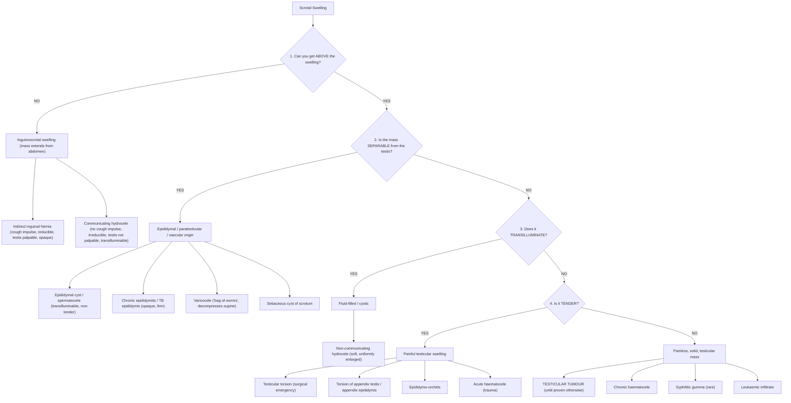

## Differential Diagnosis of a Testicular Mass / Testicular Cancer

The differential diagnosis of testicular cancer is essentially the differential of a **scrotal mass** or **scrotal swelling**. The clinical approach is systematic — you use a handful of bedside examination steps to narrow down the possibilities. Let's build this from first principles.

### The Core Logic: Why a Systematic Approach Matters

A young man walks in with a scrotal swelling. The critical question is: **"Is this a testicular tumour?"** — because missing this diagnosis delays potentially curative treatment. Everything else in the differential is either benign (hydrocele, epididymal cyst) or urgent-but-different (testicular torsion). The examination algorithm is designed to rapidly narrow the field.

---

### 1. The Examination-Based Differential Diagnosis Algorithm

The classic approach to any scrotal mass uses **four sequential clinical questions** [1][6]:

> **The testicular cancer box**: Can get above, inseparable from testis, opaque (does not transilluminate), non-tender, firm/hard. This is the classic profile [1][6][9].

---

### 2. Complete Differential Diagnosis Table

This is the **master table** for scrotal swelling, organized by examination findings [1][6][10]:

| Can Get Above? | Separable from Testis? | Transillumination | Tenderness | Differential Diagnosis |
|:---------------|:----------------------|:-----------------|:-----------|:----------------------|
| **Cannot** get above | Testis palpable | Opaque | Tender / Non-tender | ***Indirect inguinal hernia*** (cough impulse +, reducible) |
| **Cannot** get above | Testis not palpable | Transilluminable | Non-tender | ***Communicating hydrocele*** (patent processus vaginalis) |
| **Can** get above | NOT separable from epididymis | Opaque | **Tender** | ***Testicular torsion***, ***Torsion of appendix testis/epididymis***, ***Epididymo-orchitis***, Acute haematocele |
| **Can** get above | NOT separable from epididymis | Opaque | **Non-tender** | ***Testicular tumour***, Chronic haematocele, Syphilitic gumma, ***Leukaemic infiltrate*** |
| **Can** get above | NOT separable from epididymis | Transilluminable | Non-tender | ***Hydrocele*** (non-communicating) |
| **Can** get above | Separable from epididymis | Opaque | Tender | ***Epididymo-orchitis*** |
| **Can** get above | Separable from epididymis | Opaque | Non-tender | ***TB epididymis*** |
| **Can** get above | Separable from epididymis | Transilluminable | Non-tender | ***Cyst of epididymis (spermatocele)*** |

[1][6]

---

### 3. Differential Diagnosis Discussed in Detail — By Category

#### 3.1 Painful Scrotal Swelling (Acute Scrotum)

These are the conditions that may **mimic** testicular cancer when it presents with pain (~10–20% of testicular cancers present with pain due to intratumoral haemorrhage or infarction) [1].

##### A. ***Testicular Torsion*** [10][11]

- **What it is**: Twisting of the spermatic cord → occlusion of testicular blood supply → ischaemia → infarction if not corrected within ~6 hours
- **Why it's in the DDx**: Both present as acute scrotal swelling in young men. However, torsion is **exquisitely painful** with sudden onset, whereas testicular cancer pain is usually dull/aching.
- **Key distinguishing features**:
  - ***Sudden persistent agonizing scrotal pain*** with radiation to groin/lower abdomen [10]
  - ***High-riding testis with horizontal lie*** (the torted testis is pulled superiorly by the shortened, twisted cord) [10]
  - ***Absent cremasteric reflex*** — normally, stroking the inner thigh causes ipsilateral testicular elevation; in torsion, the cord is twisted and the cremaster cannot function [10]
  - ***Negative Prehn's sign*** — elevation of the scrotum does NOT relieve pain (cf. epididymo-orchitis where it may relieve pain by reducing venous congestion) [10]
  - N/V common (vagal response to severe pain)
- **Age**: Two peaks — neonatal and ***12–18 years (65%)*** [10][11]
- **Risk factors**: ***Bell-clapper deformity*** (tunica vaginalis attaches too high on spermatic cord → testis hangs like a "clapper in a bell" and can rotate freely) [10][11], ***cryptorchidism*** [11]
- **Why it matters**: This is a **surgical emergency** — irreversible damage after ~6–12 hours of ischaemia. Must be excluded before considering testicular cancer [10]

##### B. ***Torsion of the Appendix Testis or Appendix Epididymis*** [1][11][12]

- **What it is**: The appendix testis (a vestigial Müllerian duct remnant at the superior pole) or appendix epididymis (a Wolffian duct remnant) twists on its pedicle → ischaemia and pain
- **Why it's in the DDx**: Presents with acute scrotal pain in young boys, mimicking torsion or tumour
- **Key distinguishing feature**: ***"Blue dot sign"*** — a small, tender, bluish nodule visible through the scrotal skin at the superior pole of the testis (the infarcted appendix)
- **Age**: Most common in prepubertal boys (7–14 years)
- **Management**: Self-limiting — NSAIDs and rest (unlike testicular torsion which needs surgery)

##### C. ***Epididymo-orchitis*** [1][6][12]

- **What it is**: Infection/inflammation of the epididymis (epididymitis) ± testis (orchitis)
- **Why it's critically important in the DDx**: This is the **most common misdiagnosis** of testicular cancer. Up to 25% of testicular cancers are initially treated as epididymitis with antibiotics before the correct diagnosis is made.
- **Key distinguishing features**:
  - Gradual onset of pain (over days), unlike the sudden onset of torsion
  - Fever, dysuria, urethral discharge (infective aetiology)
  - Epididymis is enlarged and tender **separately** from the testis (early); later, inflammation extends to involve the testis (epididymo-orchitis) and the two become inseparable
  - ***Positive Prehn's sign*** — elevation of scrotum relieves pain (reduces venous congestion)
  - ***Positive cremasteric reflex*** (unlike torsion)
- **Aetiology by age**:
  - < 35 years: STIs — *Chlamydia trachomatis*, *Neisseria gonorrhoeae*
  - > 35 years: UTI pathogens — *E. coli*, *Klebsiella*
  - Mumps orchitis: postpubertal, occurs ~5 days after parotitis, ***exquisitely tender and indurated*** [6]

<Callout title="The 2-Week Rule" type="error">
If a young man is treated for "epididymitis" and the swelling does **NOT resolve within 2 weeks** of appropriate antibiotics, an **urgent scrotal ultrasound** is mandatory to exclude testicular cancer. This is one of the most commonly missed diagnoses in urology.
</Callout>

##### D. Acute Haematocele [1]

- **What it is**: Blood collection within the tunica vaginalis, usually from trauma
- **Why it's in the DDx**: Produces a tender, opaque scrotal mass inseparable from the testis — exactly like a tumour
- **Key distinguishing feature**: Clear history of trauma, acute onset
- **Caveat**: A tumour can present **after** minor trauma — the trauma draws the patient's attention to a pre-existing mass. Always consider ultrasound.

##### E. ***Incarcerated Inguinal Hernia*** [1][11]

- **What it is**: Bowel/omentum trapped in the inguinal canal → scrotal extension → cannot be reduced
- **Why it's in the DDx**: Produces a painful inguinoscrotal swelling
- **Key distinguishing feature**: **Cannot get above** the swelling (extends from abdomen through inguinal canal), cough impulse present, bowel sounds may be heard
- **Not truly a testicular mass** — but must be considered in the acute scrotum

##### F. Other Rare Causes of Acute Scrotum [11][12]

| Condition | Key Feature | Why It Mimics |
|:----------|:-----------|:-------------|
| ***Henoch-Schönlein Purpura (HSP)*** | Purpuric rash on lower limbs/buttocks, arthralgia, abdominal pain, haematuria; scrotal involvement in ~15% of boys | IgA vasculitis causes scrotal oedema and pain |
| ***Fournier's Gangrene*** | Necrotizing fasciitis of perineum; toxic, crepitus, rapidly spreading cellulitis | Rare but life-threatening; usually in diabetics/immunocompromised |
| Trauma | Clear history | Direct injury to testis |
| ***Orchitis (e.g. mumps)*** | ***Exquisitely tender, indurated; occurs 5 days after parotitis in postpubertal patients*** [6] | Viral orchitis without epididymitis |

---

#### 3.2 Painless Scrotal Swelling (The Key Differential for Testicular Cancer)

This is the differential that matters most, because testicular cancer typically presents as a **painless** mass.

##### A. ***Hydrocele*** [1][6][13]

- **What it is**: ***Collection of peritoneal fluid between the two layers of the tunica vaginalis*** [13]
- **Why it's in the DDx**: Produces a **painless, uniformly enlarged** scrotal swelling that may obscure the underlying testis
- **Key distinguishing features**:
  - ***Transilluminable*** — light passes through the fluid-filled sac (unlike solid tumour which is opaque)
  - Uniformly enlarged, smooth surface
  - Testis **not well-defined** within the hydrocele
  - Can get above the swelling (unless communicating type)
- **Critical point**: A ***secondary (reactive) hydrocele*** can form around a testicular tumour (~10–15% of cases) — the tumour irritates the visceral tunica vaginalis and causes serous exudation [13]. Therefore, **every hydrocele in an adult should have an ultrasound** to exclude an underlying testicular tumour.
- **Types** [13]:
  - Communicating: patent processus vaginalis (congenital); changes size with Valsalva/cough
  - Non-communicating: primary (idiopathic) or secondary (reactive)

##### B. ***Epididymal Cyst / Spermatocele*** [1][6]

- **What it is**: Cystic fluid collection within the epididymis (spermatocele contains spermatozoa in milky fluid)
- **Why it's in the DDx**: Painless scrotal swelling
- **Key distinguishing features**:
  - ***Separable from the testis*** — you can feel normal testis below/anterior to the cyst
  - ***Transilluminable***
  - Located **posterosuperior** to the testis (where the epididymis sits)
  - Usually small, well-defined

##### C. ***Varicocele*** [1][6][14]

- **What it is**: ***Collection of dilated and tortuous veins caused by dilatation of the pampiniform plexus*** [14]
- **Why it's in the DDx**: Painless scrotal swelling, especially on the left
- **Key distinguishing features**:
  - ***"Bag of worms" texture on palpation*** [6][11][14]
  - ***Decompresses in the supine position*** (venous blood drains with gravity)
  - ***More prominent with Valsalva manoeuvre*** (increases venous pressure)
  - ***85–95% left-sided*** [14] — because the left testicular vein drains into the left renal vein at a 90° angle (vs. right drains directly into IVC at an oblique angle), and the left renal vein is compressed between the aorta and SMA (***"nutcracker effect"***) [14]
  - ***Sometimes related to left renal tumour or left renal vein thrombosis*** [6] — a **new, non-decompressing varicocele** in an older man (especially right-sided) should prompt investigation for retroperitoneal pathology (renal cell carcinoma with IVC thrombus) [14]

##### D. ***Testicular Lymphoma*** [2]

- **What it is**: ***Aggressive extranodal NHL (usually DLBCL), commonly bilateral, with propensity for extranodal spread to skin, subcutaneous tissue, CNS, lungs*** [2]
- **Why it's critically important**: ***Most common cause of testicular mass in males > 60 years*** [2]
- **Key distinguishing features**:
  - Older age group ( > 60)
  - ***Commonly bilateral*** (unlike GCTs which are almost always unilateral)
  - Firm, painless testicular enlargement
  - B-symptoms may be present (fever, night sweats, weight loss)
  - AFP and β-hCG are **normal** (these are not germ cell-derived)
  - Diagnosis requires orchidectomy and histopathology; treated as systemic lymphoma

##### E. ***Leukaemic Infiltrate*** [2][4][6]

- **What it is**: Infiltration of testicular parenchyma by leukaemic cells, most commonly in ALL
- ***Testis involved in 5% of ALL*** [2]; ***painless testicular enlargement*** [4]
- **Why the testis is a "sanctuary site"**: The blood-testis barrier (tight junctions between Sertoli cells) limits penetration of systemically administered chemotherapy drugs → leukaemic cells can survive and cause relapse
- **Key distinguishing features**:
  - ***Enlarged, hard testis*** [6]
  - Known history of leukaemia (usually childhood ALL)
  - Can be bilateral
  - Diagnosis by biopsy or orchidectomy

##### F. Chronic Haematocele [1]

- Old blood collection within the tunica vaginalis (from prior trauma or torsion)
- Opaque (does not transilluminate), non-tender
- May calcify over time → hard and opaque (mimics tumour)
- History of prior trauma/event

##### G. ***Syphilitic Gumma*** [6]

- A granulomatous lesion of tertiary syphilis affecting the testis
- Firm, painless testicular mass — clinically indistinguishable from tumour
- Extremely rare today
- Treponemal serology positive

##### H. ***Sebaceous Cyst of Scrotum*** [6]

- Arises from scrotal skin, NOT from the testis itself
- Mobile, superficial, punctum may be visible
- Not truly in the differential of a testicular mass, but included in the scrotal swelling DDx

---

#### 3.3 Bilateral Scrotal Swelling

When both sides are swollen, think differently:

| Condition | Mechanism |
|:----------|:---------|
| Scrotal oedema | Generalised oedema (nephrotic syndrome, heart failure, liver failure) → fluid accumulates in dependent scrotal tissue [6] |
| Bilateral hydrocele | Can occur in fluid overload states |
| Bilateral testicular lymphoma | ***Commonly bilateral*** [2] — the most important bilateral testicular mass in an elderly man |
| Bilateral leukaemic infiltrate | Sanctuary site relapse in ALL |
| Bilateral varicocele | Less common; 33% of varicoceles are bilateral [14] |

---

### 4. Differential Diagnosis by Age Group

This is a high-yield way to organise the DDx because the likely diagnosis changes dramatically with age:

| Age Group | Most Likely Testicular Mass | Other Considerations |
|:----------|:---------------------------|:--------------------|
| **Neonates** | Hydrocele (communicating), testicular torsion (extravaginal) | Inguinal hernia |
| **Children (< 12 years)** | Yolk sac tumour (most common paediatric testicular malignancy), torsion of appendix testis, testicular torsion | Teratoma (benign in children), rhabdomyosarcoma (paratesticular) |
| **Adolescents (12–18)** | Testicular torsion (peak age), GCTs (especially teratoma/mixed) | Epididymo-orchitis (STIs) |
| **Young adults (18–40)** | ***Testicular GCT*** (seminoma or NSGCT) — the classic age group | Epididymo-orchitis, varicocele, hydrocele |
| **Middle-aged (40–60)** | Seminoma (peak ~40), spermatocele, hydrocele | Secondary varicocele (investigate for renal tumour) |
| **Elderly ( > 60)** | ***Testicular lymphoma*** (most common testicular mass at this age) [2] | Hydrocele, epididymal tumour, metastasis from other primary |

---

### 5. Differential Diagnosis by Tumour Marker Profile

When serum markers are available, they help narrow the differential among testicular malignancies:

| AFP | β-hCG | LDH | Most Likely Diagnosis |
|:----|:------|:----|:---------------------|
| **Normal** | **Normal** | Normal | Pure teratoma, sex cord-stromal tumour, lymphoma, benign conditions |
| **Normal** | **Mildly ↑** | ±↑ | Seminoma (10–15% produce low-level β-hCG) |
| **↑** | ±↑ | ±↑ | NSGCT (yolk sac tumour, embryonal carcinoma, mixed GCT) |
| Normal | **↑↑↑** | ±↑ | Choriocarcinoma |
| **↑↑↑** | Normal | ±↑ | Yolk sac tumour |
| **↑** | Any value | Any | ***NSGCT regardless of histology*** — AFP is NEVER elevated in pure seminoma [1][9] |

<Callout title="The Golden Rule of AFP" type="error">
If the pathologist reports "pure seminoma" but AFP is elevated → it is **NSGCT** until proven otherwise. The elevated AFP means there is a non-seminomatous component (likely yolk sac) that the pathologist missed on sampling. This changes management completely. ***AFP is NEVER elevated in pure seminoma*** [1].
</Callout>

---

### 6. Distinguishing Testicular Cancer from Its Closest Mimics — Summary Comparison

| Feature | Testicular Cancer | Epididymo-orchitis | Testicular Torsion | Hydrocele |
|:--------|:-----------------|:------------------|:------------------|:---------|
| **Age** | 15–35 (GCT), > 60 (lymphoma) | Any age | 12–18 (peak) | Any age |
| **Onset** | Gradual (weeks–months) | Gradual (days) | Sudden (minutes–hours) | Gradual (months–years) |
| **Pain** | Usually painless (~80%) | Painful | ***Agonizing*** | Painless |
| **Tenderness** | Non-tender | Tender | Exquisitely tender | Non-tender |
| **Transillumination** | Opaque | Opaque | Opaque | ***Transilluminable*** |
| **Separable from testis** | No | Early: yes; Late: no | No | No (testis obscured) |
| **Cremasteric reflex** | Present | Present | ***Absent*** | Present |
| **Prehn's sign** | N/A | Positive (relief with elevation) | ***Negative*** | N/A |
| **Fever / dysuria** | No | Yes | ± mild | No |
| **Scrotal skin** | Normal (unless pT4) | Erythematous, warm | Erythematous, oedematous | Normal |
| **Ultrasound** | Solid intratesticular mass | Enlarged, hyperaemic epididymis ± testis | Whirlpool sign, absent blood flow | Anechoic fluid collection |
| **Tumour markers** | ± ↑AFP, β-hCG, LDH | Normal | Normal | Normal |

---

### 7. Non-Testicular Conditions That May Present with Apparent Testicular Mass

Sometimes patients are referred with a "testicular lump" that turns out to be something else entirely:

| Condition | Why It May Be Confused | How to Distinguish |
|:----------|:----------------------|:------------------|
| Inguinal hernia extending into scrotum | Large scrotal swelling | **Cannot get above** the swelling; cough impulse; bowel sounds; reducible |
| Scrotal wall pathology (sebaceous cyst, lipoma) | Palpable lump in scrotal area | Separate from testis; moves with skin; superficial |
| Referred pain from renal colic | Pain radiating to testis/scrotum | Testis is normal on examination; ureteric stone on CT-KUB |
| Idiopathic scrotal oedema | Bilateral scrotal swelling | No discrete mass; pitting oedema; investigate for systemic cause |

---

<Callout title="High Yield Summary">

**Approach to scrotal mass**: (1) Can you get above it? → (2) Separable from testis? → (3) Transilluminates? → (4) Tender?

**Testicular cancer profile**: Can get above, inseparable from testis, opaque, non-tender, firm/hard.

**Top mimics**: Epididymo-orchitis (most common misdiagnosis — apply 2-week rule), testicular torsion (surgical emergency — absent cremasteric reflex, high-riding testis), hydrocele (transilluminable — but always USS to exclude underlying tumour).

**By age**: Children → yolk sac tumour, torsion; Young adults → GCT; Elderly → lymphoma (bilateral!).

**Reactive hydrocele**: 10–15% of testicular cancers have a secondary hydrocele — every adult hydrocele needs ultrasound.

**AFP rule**: If AFP elevated → NSGCT regardless of histology.

**Varicocele red flag**: New non-decompressing varicocele (especially right-sided) → investigate for retroperitoneal/renal pathology.

**Leukaemic infiltrate**: Testis is a "sanctuary site" in ALL due to the blood-testis barrier.

</Callout>

---

<ActiveRecallQuiz
  title="Active Recall - Differential Diagnosis of Testicular Cancer"
  items={[
    {
      question: "A 22-year-old man presents with a painless scrotal swelling. On examination, you can get above the swelling, it is inseparable from the testis, it does not transilluminate, and it is non-tender. What is the most likely diagnosis, and name two other conditions with this exact examination profile.",
      markscheme: "Most likely: testicular tumour. Other conditions with the same profile (can get above, inseparable, opaque, non-tender): chronic haematocele and syphilitic gumma. Leukaemic infiltrate can also present similarly (enlarged, hard testis)."
    },
    {
      question: "A 30-year-old man is treated for epididymitis with 2 weeks of antibiotics but the scrotal swelling persists. What should you do next and why?",
      markscheme: "Urgent scrotal ultrasound to exclude testicular cancer. Up to 25% of testicular cancers are initially misdiagnosed as epididymitis. A non-resolving testicular swelling after adequate antibiotic therapy is testicular cancer until proven otherwise (the 2-week rule)."
    },
    {
      question: "A 68-year-old man presents with bilateral painless testicular enlargement. AFP and beta-hCG are normal. What is the most likely diagnosis and what are its characteristic features?",
      markscheme: "Testicular lymphoma (usually DLBCL). It is the most common cause of testicular mass in males over 60. Characteristically bilateral, aggressive extranodal NHL with propensity for spread to skin, subcutaneous tissue, CNS, and lungs. Tumour markers (AFP, beta-hCG) are normal because it is not germ cell-derived."
    },
    {
      question: "Why does an adult hydrocele always require ultrasound evaluation? What pathophysiological mechanism links hydrocele to testicular cancer?",
      markscheme: "A secondary (reactive) hydrocele forms in 10-15% of testicular cancers. The tumour irritates the visceral layer of the tunica vaginalis, causing serous exudation into the potential space between the parietal and visceral layers. The hydrocele may obscure an underlying testicular mass on physical examination. Therefore, every adult hydrocele requires USS to exclude a hidden tumour."
    },
    {
      question: "A 14-year-old boy presents with sudden onset severe scrotal pain, nausea, and vomiting. The affected testis is high-riding with a horizontal lie, and the cremasteric reflex is absent. What is the diagnosis, what is the underlying anatomical abnormality, and what is the time window for salvage?",
      markscheme: "Diagnosis: testicular torsion. Underlying abnormality: Bell-clapper deformity (tunica vaginalis attaches high on the spermatic cord instead of anchoring the testis, allowing it to rotate freely like a clapper in a bell). Time window: irreversible ischaemic damage occurs after approximately 6-12 hours. This is a surgical emergency requiring urgent scrotal exploration and detorsion with bilateral orchidopexy."
    },
    {
      question: "Explain why a new right-sided varicocele that does not decompress in the supine position is a red flag. What underlying pathology should you investigate?",
      markscheme: "Right-sided varicoceles are rare because the right testicular vein drains directly into the IVC at an oblique angle (good flow). A new right-sided varicocele, especially one that does not decompress supine, suggests obstruction of the IVC or right testicular vein by an extrinsic mass. Must investigate for retroperitoneal pathology: renal cell carcinoma with IVC thrombus, retroperitoneal lymphadenopathy, or other retroperitoneal tumour. Similarly, a left-sided non-decompressing varicocele may indicate left renal vein obstruction (e.g., left RCC)."
    }
  ]}
/>

## References

[1] Senior notes: felixlai.md (Testicular cancer section — Differential diagnosis of testicular swelling)
[2] Senior notes: Ryan Ho Urogenital.pdf (Section 11.2.5 Testicular Tumours, p.235)
[4] Senior notes: Ryan Ho Haemtology.pdf (Section 3.2.1.2 Acute Lymphoid Leukaemia, p.60)
[6] Senior notes: Ryan Ho Fundamentals.pdf (Scrotal examination approach, p.118; Section 3.5.10 Scrotal Swelling, p.378)
[9] Senior notes: maxim.md (Testicular tumour — Investigations and clinical features)
[10] Senior notes: Ryan Ho Urogenital.pdf (Section 11.2.3 Testicular Torsion, p.233)
[11] Senior notes: felixlai.md (Testicular torsion section)
[12] Lecture slides: GC 203. The child needs an operation Common emergencies and surgery in childhood.pdf (p.34 — Differential diagnosis of acute scrotum)
[13] Senior notes: Ryan Ho Urogenital.pdf (Section 11.2.2 Hydrocele, p.232)
[14] Senior notes: felixlai.md (Varicocele section)
