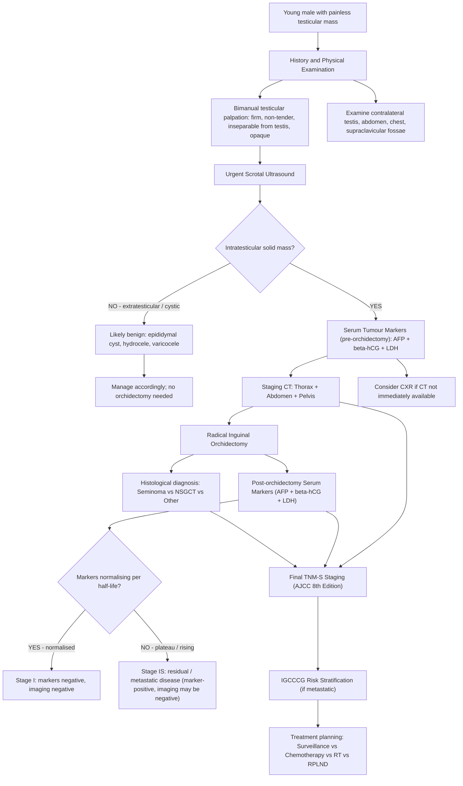

## Diagnostic Criteria, Algorithm, and Investigation Modalities

### 1. Diagnostic Principles — Why Testicular Cancer Diagnosis is Unique

Unlike most solid tumours, testicular cancer has **no percutaneous biopsy step**. Let me explain from first principles why this is the case, because it's a concept students frequently get wrong.

The testis has a unique anatomy: its lymphatic drainage follows the gonadal vessels superiorly to the **para-aortic lymph nodes** at L1–L3 (because the testis originally developed in the retroperitoneum). The **scrotal skin**, however, drains to the **inguinal lymph nodes**. If you perform a transscrotal biopsy or FNAC, you violate the scrotal skin and potentially seed tumour cells into a lymphatic basin (inguinal nodes) that would otherwise **never** be involved — fundamentally changing the staging, the radiation field, and the prognosis [1][9].

Therefore, the diagnostic pathway is:

1. **Clinical suspicion** (history + examination)
2. **Scrotal ultrasound** (confirm intratesticular solid mass)
3. **Serum tumour markers** (AFP, β-hCG, LDH — pre-orchidectomy)
4. ***Radical inguinal orchidectomy*** — this is both **diagnostic** (provides histology) and **therapeutic** (provides local tumour control) [1][2][9]
5. **Post-orchidectomy markers** + **staging CT** (thorax + abdomen + pelvis)

> ***FNAC and biopsy are NOT indicated in diagnosis of testicular cancer due to risk of tumour seedling along the biopsy tract*** [1]. ***Pathological diagnosis is obtained by radical orchiectomy*** [9].

---

### 2. Diagnostic Algorithm

<Callout title="The Sequence Matters">
Always draw **pre-orchidectomy markers** before surgery. Post-orchidectomy markers should then fall according to their half-lives (AFP: 5–7 days; β-hCG: 24–36 hours). The trajectory of marker decline is critical for staging — a plateau or rise indicates residual disease. You cannot interpret post-orchidectomy kinetics if you don't have the baseline pre-orchidectomy values.
</Callout>

---

### 3. History Taking

A thorough history should cover the following domains [1][6]:

#### 3.1 History of Presenting Illness

| Domain | Key Questions | Rationale |
|:-------|:-------------|:----------|
| Scrotal mass | Onset, duration, progression, unilateral/bilateral | Gradual painless growth over weeks–months favours tumour; sudden onset favours torsion/haematocele |
| Pain | Presence, character, radiation | ~10% of testicular cancers present with pain (intratumoral haemorrhage/necrosis); distinguish from torsion (agonizing, sudden) and epididymitis (gradual, + dysuria) |
| Heaviness/dragging | Present? | Suggests increasing tumour mass pulling on spermatic cord |
| Prior treatment for "epididymitis" | Was antibiotics given? Did swelling resolve? | ***Non-resolving swelling after 2 weeks of antibiotics = testicular cancer until proven otherwise*** |
| Trauma history | Recent scrotal trauma? | Trauma may draw attention to a pre-existing tumour; also consider haematocele |

#### 3.2 Symptoms of Metastatic Disease

| Symptom | Metastatic Site |
|:--------|:---------------|
| Back pain / flank pain | Retroperitoneal LN, psoas muscle involvement |
| Cough, dyspnoea, haemoptysis | Pulmonary metastases |
| Abdominal pain, anorexia, nausea, vomiting, GI bleeding | ***Retroduodenal metastasis***, bulky retroperitoneal disease [1] |
| Neck mass | ***Supraclavicular LN metastasis*** [1] |
| Bone pain | Bone metastases |
| Neurological symptoms | ***CNS involvement (cerebral, spinal cord, peripheral nerve root)*** [1] |
| Lower extremity oedema | ***IVC obstruction or thrombosis*** [1] |
| Gynaecomastia / breast tenderness | β-hCG-producing tumour (choriocarcinoma) |

#### 3.3 Risk Factor History

- ***Cryptorchidism***: history of undescended testis increases risk in both testes, with greater risk in the undescended one [1]
- Previous testicular cancer (contralateral)
- Family history (brothers, father)
- History of infertility / subfertility
- Known gonadal dysgenesis or DSD

---

### 4. Physical Examination

#### 4.1 Testicular Examination [1][6][9]

***Inspection*** [1]:
- **Groin or scrotal scars** (previous orchidopexy? previous surgery?)
- **Groin or scrotal swelling** (asymmetry, erythema)

***Palpation (bimanual)*** [1]:
- ***Ask for any pain and start with the normal contralateral testis*** [1] — this is important both for comparison and for courtesy
- Assess: ***Size / Border / Consistency / Tenderness / Mobility*** [1]
  - ***Normal testis is homogeneous in consistency, non-tender and freely movable*** [1]
  - ***Testicular tumour is hard, nodular, irregular and non-tender*** [1]

**Systematic four-question approach** [6]:

| Question | What You're Determining | How to Assess |
|:---------|:----------------------|:-------------|
| ***Is the swelling tender?*** | Inflammatory (torsion, infection) vs neoplastic | Gentle palpation |
| ***Can you get above it?*** | Scrotal origin vs inguinoscrotal (hernia, communicating hydrocele) | Place fingers above the mass at the neck of the scrotum in standing position |
| ***Is it separable from the testis?*** | Testicular vs epididymal/paratesticular origin | Feel along the testicular-epididymal groove superiorly |
| ***Does it transilluminate?*** | Fluid-filled (hydrocele, cyst) vs solid (tumour, haematocele) | Shine penlight from posterior in a dark room |

**Findings in testicular tumour** [1][6]:
- Can get above ✓
- Inseparable from testis ✓
- Opaque (does not transilluminate) ✓
- Non-tender ✓
- Firm / hard ✓
- ± ***Smooth, firm, fixed enlargement ± spread to epididymis/cord (10–15%)*** [2]
- ± ***Associated reactive hydrocele*** [2]

***Completion of examination*** [1]:
- **Examine the contralateral testis** — for synchronous tumour, atrophy, cryptorchidism
- **Abdomen and groin** [1]:
  - ***Para-aortic LNs are rarely palpable unless extremely large since they are located retroperitoneally*** [1]
  - ***Inguinal LNs are not likely to be a response of testicular pathology but rather from the skin of scrotum and penis*** [1] — palpable inguinal nodes should make you think of penile cancer, scrotal skin pathology, or prior scrotal surgery/violation
  - Hepatomegaly (liver metastases)
- **Chest**: Gynaecomastia, respiratory signs of lung metastases
- **Supraclavicular fossae**: Lymphadenopathy (especially left — Virchow's node)
- **Lower limbs**: Oedema (IVC obstruction)

---

### 5. Investigation Modalities

#### 5.1 Scrotal Ultrasound — The First-Line Imaging Study

***USG scrotum*** is the **initial imaging modality of choice** for evaluating any testicular mass [1][2][6][9].

**Why ultrasound first?**
- Non-invasive, readily available, no radiation
- Extremely sensitive ( > 95%) for detecting intratesticular masses
- Distinguishes between intratesticular vs extratesticular masses (***majority of extratesticular masses are benign*** [6])
- Distinguishes solid from cystic lesions
- Screens the **contralateral testis** for synchronous tumour, microlithiasis, or occult pathology [1]

**Key USS findings by pathology:**

| Condition | Ultrasound Appearance | Explanation |
|:----------|:---------------------|:-----------|
| ***Seminoma*** | ***Well-defined hypoechoic lesion without cystic areas*** [1][6][9] | Homogeneous tumour composed of uniform sheets of cells; well-circumscribed growth pattern |
| ***NSGCT*** | ***Indistinct margins, inhomogeneous lesion with cystic areas and calcifications*** [1][6][9] | Heterogeneous tumour with multiple cell types, necrosis (→ cystic areas), dystrophic calcification, and haemorrhage |
| ***Testicular microlithiasis*** | ***≥ 5 echogenic 1–3 mm foci on USG → strongly associated with presence of CA testis*** [2] | Multiple tiny calcifications within the seminiferous tubules representing degenerated intratubular debris; marker of disordered germ cell turnover and GCNIS |
| Hydrocele | Anechoic fluid surrounding the testis | Fluid within tunica vaginalis; can be used to ***rule out reactive hydrocele (e.g. CA testis, orchitis)*** [6] |
| Epididymal cyst | Well-defined anechoic cyst separate from testis, posterosuperior | Fluid-filled cyst within the epididymis |
| Testicular torsion | ***Whirlpool sign (twisted spermatic cord), absent/reduced Doppler flow*** [6] | Torted spermatic cord appears as concentric rings; absent arterial flow on Doppler confirms ischaemia |
| Epididymo-orchitis | Enlarged hyperaemic epididymis ± testis on Doppler | Inflammation → increased blood flow on colour Doppler |

<Callout title="Microlithiasis — What To Do?" type="idea">
Testicular microlithiasis (≥ 5 echogenic foci of 1–3 mm) is common (found in ~5% of men undergoing scrotal USS). In **isolation** (no other risk factors), current guidelines recommend **reassurance and testicular self-examination** — no routine follow-up USS is needed. However, if microlithiasis is found in a patient with **other risk factors** (cryptorchidism, previous GCT, contralateral tumour, atrophic testis, infertility), the risk is significant and **closer surveillance** is warranted [2].
</Callout>

#### 5.2 Serum Tumour Markers — Pre-Orchidectomy (Mandatory)

***Tumour markers = AFP + β-hCG + LDH*** [1][9]

***Tumour markers are used for initial diagnosis and mainly for subsequent follow-up of disease status after primary treatment*** [1].

##### A. Alpha-Fetoprotein (AFP)

| Feature | Detail |
|:--------|:-------|
| What it is | Glycoprotein normally produced by fetal yolk sac, liver, and GI tract |
| Normal value | < 10 ng/mL (in non-pregnant adults) |
| Half-life | 5–7 days |
| Elevated in | Yolk sac tumour (main source), embryonal carcinoma, mixed GCT |
| ***Key rule*** | ***AFP is NEVER elevated in pure seminoma*** [1] — if AFP is elevated with histology showing "pure seminoma", re-classify as NSGCT |
| ***Elevated in 80–85% of NSGCT*** [1][9] | |
| ***Other causes of AFP elevation*** | ***Pregnancy, hepatocellular carcinoma (HCC), acute/chronic hepatitis, liver cirrhosis*** [1] |

**Why does AFP matter so much?** Because it's the single marker that categorically distinguishes seminoma from NSGCT. Pure seminoma cells **do not** produce AFP — only yolk sac elements and hepatoid differentiation do. If AFP is elevated, there must be a non-seminomatous component, and management changes from seminoma-protocol (which includes radiotherapy options) to NSGCT-protocol (which may include RPLND) [1].

##### B. β-Human Chorionic Gonadotropin (β-hCG)

| Feature | Detail |
|:--------|:-------|
| What it is | Glycoprotein hormone with α-subunit (shared with LH, FSH, TSH) and unique β-subunit |
| Why β-subunit is measured | ***The α-subunit is common to several pituitary hormones*** (LH, FSH, TSH) [1] — measuring total hCG would cross-react. The β-subunit is specific to hCG. |
| Normal value | < 5 mIU/mL (in non-pregnant males) |
| Half-life | 24–36 hours |
| ***Elevated in < 20% of seminoma*** [1] | Low-level elevation from syncytiotrophoblastic giant cells scattered within seminoma |
| ***Elevated in 80–85% of NSGCT*** [1][9] | Especially choriocarcinoma (markedly elevated, often > 50,000 mIU/mL) |
| ***Other causes of β-hCG elevation*** | ***Pregnancy, gestational trophoblastic disease, trophoblastic differentiation of primary lung cancer, trophoblastic differentiation of primary gastric cancer*** [1] |
| Clinical effects of very high β-hCG | Gynaecomastia (LH-like activity → oestrogen production), hyperthyroidism (TSH-like activity due to α-subunit homology) |

##### C. Lactate Dehydrogenase (LDH)

| Feature | Detail |
|:--------|:-------|
| What it is | Ubiquitous cytoplasmic enzyme released by damaged/proliferating cells |
| Normal value | Varies by laboratory; typically 120–246 U/L |
| Specificity | **Non-specific** — elevated in many conditions (haemolysis, liver disease, MI, lymphoma, etc.) |
| Role in testicular cancer | Correlates with **tumour burden** (volume of disease) and cell turnover |
| Used in | S staging (AJCC) and IGCCCG prognostic classification |

##### D. Summary — Expected Marker Profiles

| Histological Subtype | AFP | β-hCG | LDH |
|:--------------------|:----|:------|:----|
| Pure seminoma | **Normal** | ±↑ (< 20%, mild) | ±↑ |
| Embryonal carcinoma | ±↑ | ±↑ | ±↑ |
| Yolk sac tumour | **↑↑↑** | Normal | ±↑ |
| Choriocarcinoma | Normal | **↑↑↑** | ±↑ |
| Pure teratoma | Normal | Normal | Normal |
| Mixed GCT | Variable | Variable | Variable |
| Leydig / Sertoli cell tumour | Normal | Normal | Normal |
| Lymphoma | Normal | Normal | ±↑ |

<Callout title="Marker-Negative Tumours" type="error">
About **15–20% of NSGCTs** have **normal** AFP and β-hCG. Pure teratoma and some embryonal carcinomas may not produce markers. A normal marker profile does **NOT** exclude testicular cancer. The diagnosis still rests on ultrasound + orchidectomy histology. Markers are extremely useful when elevated, but their absence does not rule out malignancy.
</Callout>

##### E. Post-Orchidectomy Marker Kinetics — Critical for Staging

After radical inguinal orchidectomy, markers should fall according to their half-lives:
- **AFP** (half-life 5–7 days): should halve every ~5–7 days
- **β-hCG** (half-life 24–36 hours): should halve every ~1–1.5 days

| Marker Trajectory | Interpretation | Stage |
|:-----------------|:--------------|:------|
| Normalises as expected | Tumour fully resected; no metastatic disease producing markers | Supports Stage I (if imaging also clear) |
| Falls but plateaus above normal | Residual disease (micrometastases) producing markers at a low level | Stage IS (marker-positive, imaging-negative) or higher |
| Rises after initial fall | Progressive residual/metastatic disease | Stage IS or higher; requires systemic treatment |

***Serum markers staging (S)*** [1]:

| S Stage | LDH | β-hCG (mIU/mL) | AFP (ng/mL) |
|:--------|:----|:---------------|:-----------|
| ***S0*** | ***Normal*** | ***Normal*** | ***Normal*** |
| ***S1*** | ***< 1.5× ULN*** | ***< 5,000*** | ***< 1,000*** |
| ***S2*** | ***1.5–10× ULN*** | ***5,000–50,000*** | ***1,000–10,000*** |
| ***S3*** | ***> 10× ULN*** | ***> 50,000*** | ***> 10,000*** |

[1]

---

#### 5.3 Radical Inguinal Orchidectomy — The Definitive Diagnostic Procedure

***Radical inguinal orchidectomy*** is both diagnostic and therapeutic [1][2][9].

***Technique*** [2]:
1. ***Enter via inguinal incision*** (NOT scrotal) [2][9]
2. ***Clamp cord early before scrotal manipulation to prevent seeding*** [2] — the testicular vein is clamped and ligated at the level of the deep inguinal ring before the testis is mobilized. This prevents intraoperative shedding of tumour cells into the venous system.
3. ***Mobilize testis into the incision*** [2]
4. ***If doubtful, then bisect testis to confirm presence of tumour*** [2] — intraoperative frozen section can be performed if the diagnosis is uncertain (e.g., small lesion, possible benign pathology). If benign, testis-sparing surgery may be considered.
5. ***If confirmed tumour, then double ligation of cord with division at the level of the inguinal ring + removal of testis*** [2]

***Why inguinal approach?*** [2][9]:
- ***Inguinal approach is preferred as other approaches are associated with scrotal violation → potentially increased risk of recurrence*** [2]
- ***Scrotal incision would seed tumour into the scrotal skin → drainage to inguinal LNs → changing the staging and treatment field*** [1]

***Complications***: ***Usually minimal morbidity, most commonly post-operative scrotal haematoma*** [2]

**What does the histopathology report tell you?**

The orchidectomy specimen is the definitive staging tool for the T-component of TNM. The pathologist reports:
- Tumour type (seminoma, NSGCT subtypes, mixed)
- Tumour size
- Invasion of tunica albuginea, tunica vaginalis, rete testis, epididymis, spermatic cord, scrotal wall
- Lymphovascular invasion (LVI) — critical for risk stratification of Stage I disease
- Margins (particularly cord margin)
- Presence of GCNIS in adjacent tissue
- Immunohistochemistry: OCT3/4, PLAP (seminoma), CD30 (embryonal carcinoma), AFP (yolk sac), β-hCG (trophoblastic elements), CD117/KIT (GCNIS, seminoma)

<Callout title="When Can You Skip Orchidectomy?" type="idea">
Almost never. However, in **life-threatening situations** (e.g., massive pulmonary metastases with respiratory failure from choriocarcinoma), you may need to start **emergency chemotherapy** before orchidectomy. In this scenario, grossly elevated β-hCG ± AFP with characteristic imaging is considered diagnostic, and orchidectomy is performed after the patient is stabilised. This is the only exception.
</Callout>

---

#### 5.4 Staging Investigations — After Orchidectomy

Once the histological diagnosis is confirmed, staging investigations are performed to determine the extent of disease.

##### A. ***CT Thorax, Abdomen and Pelvis (CT TAP)*** [1][9]

***CT thorax, abdomen and pelvis is the imaging modality of choice to evaluate the retroperitoneum*** [1].

| What CT Assesses | Findings | Interpretation |
|:----------------|:---------|:---------------|
| ***Retroperitoneal (para-aortic) lymph nodes*** | ***Abnormal node is defined as > 10 mm in short axis to indicate pathological adenopathy*** [1] | ***Regional metastasis first appears in the retroperitoneal LNs which are the para-aortic lymph nodes*** [1]. Right-sided tumours → interaortocaval/precaval nodes; left-sided → left para-aortic/preaortic nodes. |
| Mediastinal / hilar lymph nodes | Enlarged nodes in mediastinum | Supradiaphragmatic nodal spread (Stage III) |
| Pulmonary parenchyma | Nodules — classically "cannonball" metastases | Haematogenous spread, especially NSGCT/choriocarcinoma (M1a) |
| Liver | Hypodense / hypervascular lesions | Hepatic metastases (M1b — non-pulmonary visceral) |
| Bone (incidental) | Lytic/sclerotic lesions | Osseous metastases (uncommon) |
| Hydronephrosis | Dilated renal pelvis/ureter | Ureteric obstruction from bulky retroperitoneal nodes |

##### B. Chest X-Ray (CXR)

- ***CT A+P + CXR for regional/systemic staging*** [2]
- CXR is useful as a **quick screen** for pulmonary metastases if CT is not immediately available
- Classic finding: **"cannonball" metastases** — multiple round, well-defined pulmonary nodules of varying sizes, bilateral
- Mediastinal widening may indicate mediastinal lymphadenopathy
- CT thorax is more sensitive and preferred

##### C. Brain Imaging (MRI Brain)

| When to order | Why |
|:-------------|:----|
| Choriocarcinoma (any stage) | Choriocarcinoma has a strong tropism for cerebral vasculature; brain metastases can present as haemorrhagic lesions |
| Very high β-hCG ( > 50,000 mIU/mL) | High β-hCG correlates with trophoblastic differentiation and risk of CNS spread |
| Any neurological symptoms | Headache, seizures, focal deficits |
| Poor-prognosis NSGCT (IGCCCG) | Higher risk of CNS metastases |

MRI brain is preferred over CT brain due to superior sensitivity for posterior fossa and small parenchymal lesions.

##### D. Bone Scan

- Not routinely performed
- Indicated only if bone pain or elevated alkaline phosphatase (ALP)
- Testicular GCTs rarely metastasise to bone as a first site

##### E. PET-CT (FDG-PET/CT)

- **Not used for initial staging** of testicular cancer (unlike lymphoma)
- **Role**: Evaluation of **post-chemotherapy residual masses in seminoma** — FDG-PET helps distinguish viable tumour (FDG-avid) from fibrosis/necrosis (FDG-negative)
  - If PET-positive → requires further treatment (chemotherapy or surgery)
  - If PET-negative → likely fibrosis → surveillance
- **Not useful for NSGCT residual masses** — mature teratoma is FDG-negative (low metabolic activity) but still requires surgical excision. PET cannot distinguish teratoma from fibrosis.
- Timing: Should be performed **≥ 6 weeks after last cycle of chemotherapy** to avoid false-positives from inflammatory changes

---

#### 5.5 Other Blood Tests (Baseline / Pre-Treatment)

| Investigation | Rationale |
|:-------------|:----------|
| CBC with differential | Baseline before chemotherapy; detect anaemia of chronic disease, or leukaemic infiltrate |
| Renal function (Cr, eGFR) | Baseline before cisplatin-based chemotherapy (nephrotoxic); detect hydronephrosis from retroperitoneal disease |
| Liver function tests (LFT) | Baseline; detect hepatic metastases; AFP interpretation requires normal liver function (hepatitis/cirrhosis can also elevate AFP) |
| Electrolytes | Baseline; tumour lysis syndrome risk with bulky disease |
| Thyroid function | If β-hCG very high → hCG-mediated hyperthyroidism (α-subunit homology with TSH) |
| Sex hormone profile (testosterone, LH, FSH) | Baseline fertility assessment; endocrine tumours (Leydig/Sertoli cell); hypogonadism assessment post-orchidectomy |
| Blood group and save | Pre-operative preparation for orchidectomy |
| Coagulation profile | Pre-operative |

---

#### 5.6 Fertility Assessment and Preservation

***Cryopreservation of sperm*** [1][9]:
- ***Should be made available to all men diagnosed with testicular cancer prior to instituting therapy if they wish to preserve fertility*** [1]
- ***Baseline sperm count and sperm banking should be performed prior to radiographic diagnostic evaluation to avoid radiation exposure of sperm*** [1]
- ***Note that testicular tumours are associated with gonadal dysgenesis and ~50% of men have some degree of underlying impairment of spermatogenesis, and semen quality may further deteriorate following removal of affected testis*** [1]

**Timing**: Ideally **before orchidectomy** (if possible and not delaying treatment) or at minimum **before chemotherapy/radiotherapy** begins.

---

#### 5.7 Investigation NOT to Perform

| Investigation | Why NOT |
|:-------------|:--------|
| ***FNAC / percutaneous biopsy of testis*** | ***Risk of tumour seedling along biopsy tract into scrotal skin → drainage to inguinal LNs which are normally NOT involved in testicular cancer (testes drain to para-aortic LNs only)*** [1][9] |
| ***Scrotal orchidectomy / scrotal incision*** | ***Violates scrotal skin → seeds inguinal lymph node basin → changes staging and treatment field*** [2][9] |
| Open biopsy of testis through scrotum | Same principle as above |

---

### 6. Staging Summary — Putting It All Together

After completing all investigations, the final stage is determined using the **AJCC 8th Edition TNM-S system** (covered in detail in the previous section). Here is a simplified clinical staging approach:

| Stage | Definition | Investigation Basis |
|:------|:----------|:-------------------|
| ***Stage 0*** | ***Tis (GCNIS), N0, M0, S0*** | Orchidectomy showing GCNIS only; markers normal; CT clear |
| ***Stage I*** | ***T1-4, N0, M0, SX/S0*** | Orchidectomy confirms tumour; markers normalise post-op; CT clear |
| ***Stage IS*** | Any T, N0, M0, S1-3 | Markers fail to normalise / rise post-orchidectomy despite clear imaging |
| ***Stage II*** | ***Any T, N1-3, M0, S0-1*** | CT shows retroperitoneal LN involvement ( > 10 mm) |
| ***Stage III*** | ***Any T, Any N, M1, S0-3*** | Distant metastases on CT (lung, liver, brain, bone) |

[1]

---

### 7. Special Diagnostic Scenarios

#### 7.1 Burned-Out Testicular Tumour

Occasionally, a patient presents with **metastatic GCT** (e.g., large retroperitoneal mass, elevated markers) but the testicular primary has **spontaneously regressed**. On USS, the testis may show a **scar, calcification, or GCNIS** but no visible mass. This is called a "burned-out" tumour. The orchidectomy should still be performed because:
- There may be residual viable tumour not visible on USS
- GCNIS remains as a precursor for second tumours
- Histological subtyping may still be possible from the residual scar

#### 7.2 Bilateral Testicular Tumour

- Synchronous (simultaneous) bilateral GCTs occur in ~1–2%
- Metachronous (sequential) bilateral GCTs in ~2–5% over a lifetime
- If bilateral, **testis-sparing surgery** (partial orchidectomy) should be considered for the smaller tumour to preserve testosterone production and avoid lifelong androgen replacement
- Always screen the contralateral testis with USS at diagnosis

#### 7.3 Prepubertal Testicular Tumour

- Different biology from adult GCTs
- **Yolk sac tumour** is the most common (pure form, not mixed)
- **Mature teratoma** in children is **benign** (unlike in adults)
- Testis-sparing surgery may be considered in children with small tumours and normal markers
- **Do NOT assume adult staging/management rules apply to prepubertal tumours**

---

<Callout title="High Yield Summary">

**Diagnostic sequence**: Clinical suspicion → Scrotal USS → Serum markers (AFP, β-hCG, LDH) → Radical inguinal orchidectomy → Post-orchidectomy markers + CT TAP → Final staging.

**NEVER do**: FNAC, percutaneous biopsy, or scrotal orchidectomy — risk of tumour seeding to inguinal LN basin.

**USS findings**: Seminoma = well-defined, hypoechoic, no cystic areas. NSGCT = inhomogeneous, indistinct margins, cystic areas, calcifications. Microlithiasis (≥ 5 foci of 1–3 mm) = strongly associated with testicular cancer.

**Markers**: AFP (never elevated in pure seminoma; half-life 5–7d), β-hCG (< 20% seminoma, 80–85% NSGCT; half-life 24–36h), LDH (non-specific, tumour burden).

**Post-orchidectomy kinetics**: Markers must normalise per half-life. Failure = Stage IS (residual disease).

**Staging CT**: Abnormal retroperitoneal node = > 10 mm short axis. CT TAP is the modality of choice for the retroperitoneum.

**PET-CT**: Only for post-chemo residual masses in seminoma (not NSGCT — teratoma is PET-negative).

**Orchidectomy technique**: Inguinal incision → clamp cord before mobilising testis → double ligation at deep ring → remove testis and cord.

**Sperm banking**: Offer to ALL patients before any treatment; ~50% already have impaired spermatogenesis at baseline.

</Callout>

---

<ActiveRecallQuiz
  title="Active Recall - Diagnosis of Testicular Cancer"
  items={[
    {
      question: "Why is FNAC or transscrotal biopsy contraindicated in the evaluation of a suspected testicular tumour? Explain the anatomical basis.",
      markscheme: "The testis drains lymphatically to the para-aortic lymph nodes (retroperitoneal, L1-L3) because it develops from the gonadal ridge in the retroperitoneum. The scrotal skin drains to the inguinal lymph nodes. Transscrotal biopsy violates the scrotal skin and may seed tumour into the inguinal lymphatic basin, which is normally NOT involved in testicular cancer. This changes the staging, requires additional treatment (inguinal RT or dissection), and worsens prognosis. Diagnosis is obtained by radical inguinal orchidectomy instead."
    },
    {
      question: "A 25-year-old man undergoes radical inguinal orchidectomy for a testicular mass. Pre-operative AFP was 800 ng/mL and beta-hCG was 50 mIU/mL. On day 14 post-op, AFP is 600 ng/mL. Is this marker decline appropriate? What does it mean?",
      markscheme: "AFP half-life is 5-7 days. Starting at 800 ng/mL, by day 14 (approximately 2-3 half-lives), AFP should be approximately 100-200 ng/mL. A value of 600 ng/mL at day 14 indicates the marker is NOT declining appropriately - it is plateauing. This suggests residual or metastatic disease producing AFP (Stage IS or higher), even if staging CT is normal. The patient needs systemic chemotherapy."
    },
    {
      question: "Describe the USS appearance of a seminoma versus a non-seminomatous germ cell tumour.",
      markscheme: "Seminoma: well-defined hypoechoic lesion without cystic areas (homogeneous tumour of uniform cell sheets). NSGCT: indistinct margins, inhomogeneous lesion with cystic areas (from necrosis) and calcifications (dystrophic calcification from mixed cell types and tissue breakdown). Also look for testicular microlithiasis (5 or more echogenic 1-3mm foci) which is strongly associated with testicular cancer."
    },
    {
      question: "What is the role of PET-CT in testicular cancer? When is it useful and when is it NOT useful?",
      markscheme: "PET-CT is NOT used for initial staging. Its role is evaluation of post-chemotherapy residual masses in SEMINOMA only: FDG-avid residual mass indicates viable tumour (needs further treatment), FDG-negative mass indicates fibrosis/necrosis (surveillance). PET is NOT useful for NSGCT residual masses because mature teratoma is FDG-negative (low metabolic activity) but still requires surgical excision. PET cannot distinguish teratoma from fibrosis. Should be performed at least 6 weeks after last chemotherapy cycle to avoid false positives."
    },
    {
      question: "List the key steps of a radical inguinal orchidectomy and explain the rationale for each step.",
      markscheme: "1. Inguinal incision (not scrotal) - avoids scrotal violation and seeding to inguinal LN basin. 2. Clamp the spermatic cord early before mobilising the testis - prevents intraoperative tumour cell shedding into testicular veins/lymphatics. 3. Mobilise testis into the inguinal incision. 4. If diagnosis uncertain, bisect testis for frozen section - if benign, testis-sparing surgery may be possible. 5. If tumour confirmed, double ligation of cord at the level of the deep inguinal ring and remove testis with cord. This provides both histological diagnosis (pathological T staging) and local tumour control."
    }
  ]}
/>

## References

[1] Senior notes: felixlai.md (Testicular cancer — Diagnosis section, Tumour markers, Radiological tests)
[2] Senior notes: Ryan Ho Urogenital.pdf (Section 11.2.5 Testicular Tumours, p.235–236)
[6] Senior notes: Ryan Ho Fundamentals.pdf (Scrotal examination approach, p.118; USG scrotum findings, p.379)
[9] Senior notes: maxim.md (Testicular tumour — Investigations and Management sections)
