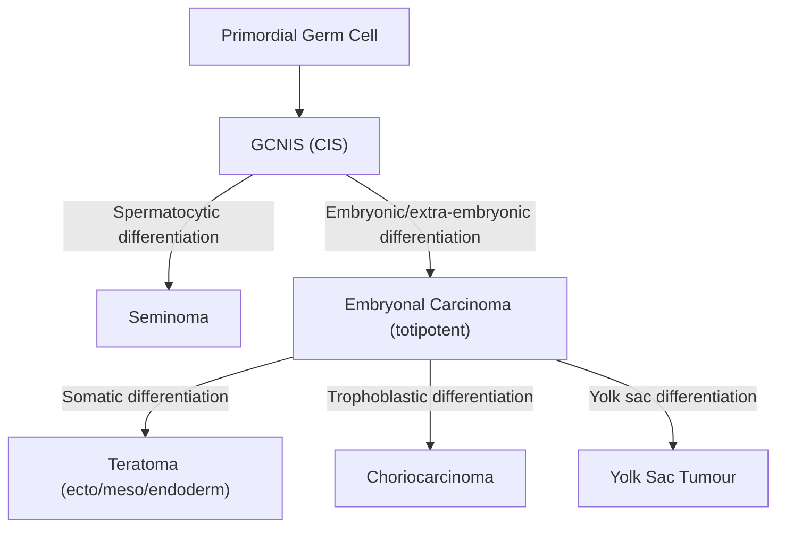

# Testicular Cancer

## 1. Definition

Testicular cancer refers to malignant neoplasms arising from the testicle (orchis/testis). The vast majority ( > 95%) are **germ cell tumours (GCTs)**, which originate from the totipotent germ cells (spermatogonia) within the seminiferous tubules. The remaining ~5% are **sex cord-stromal tumours** (arising from the supportive framework of the testis — Leydig or Sertoli cells) and miscellaneous paratesticular tumours (lymphoma, leukaemia, mesothelioma).

Breaking down the terminology:
- **Testis** (Latin) = "witness" (testes were held during oath-taking in Roman law)
- **Seminoma** → "semen" = seed; a tumour of spermatocyte-lineage cells
- **Teratoma** → "teras" (Greek) = monster; a tumour containing tissues from all three germ layers (ectoderm, mesoderm, endoderm)
- **Choriocarcinoma** → "chorion" = membrane surrounding the embryo; a tumour of trophoblastic differentiation

<Callout title="Key Concept">
Testicular cancer is **the most common solid malignancy in males aged 15–35** [1][2]. Despite this, it is one of the **most curable solid neoplasms** — overall 5-year survival > 95% — largely because of exquisite sensitivity to cisplatin-based chemotherapy. It accounts for only ~1% of all male solid tumours and ~0.1% of male cancer deaths [2].
</Callout>

---

## 2. Epidemiology

### 2.1 Incidence and Prevalence

- ***Most common solid malignancy in males aged 15–35*** [1][2][3].
- Only ~1% of all solid tumours in males [2].
- ***One of the most curable solid neoplasms: 5-year survival > 95%***, representing only ***0.1% of all male cancer deaths*** [2].
- Global incidence: approximately 10 per 100,000 males/year in Western populations (highest in Scandinavian countries, lowest in Asian and African populations).
- **Hong Kong context**: Incidence is lower than Western countries (~1–2 per 100,000), but has been rising over recent decades. It remains a relatively uncommon cancer in HK, but awareness is critical because of the young age group affected and the curability.

### 2.2 Age Distribution

| Subtype | Peak Age | Notes |
|:--------|:---------|:------|
| ***Seminoma*** | ***Median ~40 years*** (30–50) | ***Occurs in older men*** relative to NSGCT [2] |
| ***Teratoma/NSGCT*** | ***Younger males*** (20–35), ***can be prepubertal*** | [2] |
| Mixed GCT | 20–40 years | Contains both seminomatous and non-seminomatous elements |
| ***Testicular lymphoma*** | ***> 60 years*** | ***Most common cause of testicular mass in males > 60y*** [2] |
| Sex cord-stromal tumours | ***More common in prepubertal males*** [2] | |
| Yolk sac tumour | Most common testicular tumour in **children < 3 years** | |

### 2.3 Risk Factors

***Risk factors include*** [1][2][3]:

| Risk Factor | Mechanism / Explanation | Relative Risk |
|:------------|:-----------------------|:-------------|
| ***Cryptorchidism (undescended testis)*** | The undescended testis is exposed to higher core body temperature (37°C vs. 33°C in the scrotum), impairing normal germ cell maturation and promoting germ cell neoplasia in situ (GCNIS). Even after orchidopexy, the risk persists (though reduced if performed before puberty). The **ipsilateral** testis carries the greatest risk, but the **contralateral** normally-descended testis also has a slightly elevated risk. | ***3–50× increased risk*** [2] |
| ***Contralateral testicular cancer*** | Prior GCT indicates field effect / genetic susceptibility; 2–5% lifetime risk of contralateral tumour | [2] |
| ***Hypospadias*** | Associated with disorders of sex development / androgen signalling; suggests underlying testicular dysgenesis | [2] |
| ***Extragonadal GCT*** | Shared germ cell origin; indicates predisposition to germ cell malignancy | [2] |
| ***Family history*** | Brothers of affected males have 8–10× risk; sons of affected fathers ~4× risk. Suggests genetic susceptibility (KITLG, DMRT1, TERT loci). | [2] |
| **Gonadal dysgenesis** | Abnormal testicular development (e.g. 46,XY DSD) → disordered germ cell maturation → GCNIS | [1] |
| **Androgen insensitivity syndrome** | Defective androgen receptor → abnormal germ cell milieu → GCNIS in intra-abdominal gonads | [1] |
| **HIV infection** | Immunosuppression may impair immune surveillance against neoplastic germ cells; also associated with seminoma specifically | [1] |
| Testicular microlithiasis | Multiple calcifications on ultrasound; marker of disordered germ cell turnover. Controversial as independent RF; significant only when combined with other RFs | Low |
| Infertility / subfertility | Both conditions share the common pathway of testicular dysgenesis syndrome (TDS) | Modestly increased |
| Previous testicular atrophy (e.g. mumps orchitis) | Germ cell damage and aberrant regeneration may promote GCNIS | Modest |

<Callout title="Testicular Dysgenesis Syndrome (TDS)" type="idea">
Many risk factors for testicular cancer (cryptorchidism, hypospadias, subfertility, testicular cancer itself) cluster together as the **Testicular Dysgenesis Syndrome**. The unifying hypothesis is that abnormal fetal gonadal development (from genetic and/or environmental factors such as endocrine disruptors) leads to disordered germ cell maturation, which manifests as GCNIS — the universal precursor of adult-type testicular GCTs.
</Callout>

<Callout title="Exam Pearl" type="error">
A common mistake is thinking orchidopexy for cryptorchidism eliminates the cancer risk. It does **not** — it **reduces** the risk (especially if done before puberty/age 12) and makes the testis palpable for self-examination, but the intrinsic germ cell abnormality persists. Also remember the **contralateral** normally-descended testis also has elevated risk — it's not just about the undescended one.
</Callout>

---

## 3. Anatomy and Function

### 3.1 Gross Anatomy of the Testis

Understanding the anatomy is essential for comprehending spread patterns, surgical approach, and clinical examination.

**Testis** [1][2]:
- Ovoid organ, approximately 3–5 cm long, ~20 mL volume
- Lies within the scrotum, which maintains temperature ~2–4°C below core body temperature (essential for spermatogenesis)
- Covered by:
  - **Tunica vaginalis**: serous membrane (derivative of the peritoneum from processus vaginalis); covers the anterior and lateral 2/3 of the testis. The ***potential space between its parietal and visceral layers is where fluid accumulates in hydrocele*** [1].
  - **Tunica albuginea**: dense fibrous capsule directly investing the testis; sends septa inward to divide the testis into ~250 lobules
  - Each lobule contains 1–4 **seminiferous tubules** → drain into **rete testis** → **efferent ductules** → **epididymis**

**Epididymis** [1]:
- Tightly coiled tubular structure along the posterolateral surface of the testis
- Has a head (superior pole), body, and tail (inferior pole)
- Functions: sperm storage, maturation, transport
- Tail is continuous with the **vas deferens**

**Appendix testis** (hydatid of Morgagni):
- Small vestigial remnant of the Müllerian (paramesonephric) duct, located at the anterosuperior pole of the testis
- Important because torsion of the appendix testis mimics testicular torsion in children

**Spermatic cord** [1]:
- Runs from the tail of the epididymis superiorly through the inguinal canal to the deep inguinal ring
- Contains:
  - **Testicular artery** (branch of abdominal aorta at L2 level)
  - **Pampiniform venous plexus** → drains to testicular vein (right → IVC directly; left → left renal vein)
  - **Vas deferens** and its artery (from superior/inferior vesical artery)
  - **Cremasteric artery** (from inferior epigastric artery)
  - **Lymphatic vessels** → drain to **para-aortic (retroperitoneal) lymph nodes** (NOT inguinal nodes)
  - **Genital branch of the genitofemoral nerve** (L1-L2)
- Fascial coverings (from outside in): external spermatic fascia, cremasteric fascia + cremaster muscle, internal spermatic fascia

### 3.2 Lymphatic Drainage — Critically Important for Staging and Spread

<Callout title="Why para-aortic nodes and NOT inguinal nodes?">
The testis **descends from the retroperitoneum** during fetal development (from the gonadal ridge at L2 level). It takes its blood supply and lymphatic drainage with it. Therefore, the lymphatics follow the testicular vessels back up to the **para-aortic lymph nodes at L1-L3 level** (right-sided tumours drain slightly more to the interaortocaval and precaval nodes; left-sided drain to the left para-aortic and preaortic nodes).

The **scrotum**, by contrast, is a cutaneous structure that drains to the **inguinal lymph nodes**. This is why:
- A **transscrotal biopsy or scrotal orchidectomy is CONTRAINDICATED** — it disrupts the natural lymphatic drainage and may seed tumour cells to the inguinal nodes, changing the treatment field.
- ***Radical inguinal orchidectomy*** (through a groin incision, with high ligation of the spermatic cord at the deep inguinal ring) is the standard surgical approach.
</Callout>

### 3.3 Vascular Drainage

- Right testicular vein → IVC directly
- Left testicular vein → Left renal vein → IVC

This explains why a **left varicocele** may be a presenting sign of a left renal tumour (left renal vein compression), and also why the left side is more prone to varicocele formation.

### 3.4 Cell Types and Their Tumour Correlates

| Normal Cell | Function | Tumour Arising |
|:-----------|:---------|:---------------|
| Germ cells (spermatogonia) | Spermatogenesis | GCTs (seminoma, NSGCT) |
| Sertoli cells | Support/nurse germ cells, secrete inhibin, form blood-testis barrier | Sertoli cell tumour |
| Leydig cells (interstitial cells) | Secrete testosterone (in response to LH) | Leydig cell tumour |

---

## 4. Etiology and Pathophysiology

### 4.1 Germ Cell Neoplasia In Situ (GCNIS) — The Precursor Lesion

All adult-type testicular GCTs (both seminoma and NSGCT) are believed to arise from a common precursor: **Germ Cell Neoplasia In Situ (GCNIS)**, previously called "intratubular germ cell neoplasia unclassified" (ITGCNU) or "carcinoma in situ of the testis."

**Pathogenesis of GCNIS:**
1. During fetal development, primordial germ cells (PGCs) migrate from the yolk sac to the gonadal ridge
2. Normally, PGCs differentiate into spermatogonia and enter meiosis at puberty
3. In GCNIS, PGCs fail to differentiate properly — they retain embryonic features (expression of OCT3/4, NANOG, KIT, PLAP)
4. These arrested cells remain dormant until puberty, when the hormonal surge (rising gonadotropins and testosterone) stimulates their proliferation
5. Additional genetic hits (gain of 12p — isochromosome 12p — is the hallmark) drive progression to invasive GCT

<Callout title="Isochromosome 12p — The Genetic Hallmark">
**Isochromosome 12p (i(12p))** — an abnormal chromosome consisting of two copies of the short arm of chromosome 12 — is found in approximately **80% of all testicular GCTs**. The short arm of chromosome 12 contains genes (e.g., KRAS, CCND2) that promote cell proliferation. This is the most consistent cytogenetic abnormality in testicular GCTs and is virtually diagnostic.
</Callout>

### 4.2 Seminoma vs. Non-Seminomatous GCT — Divergent Differentiation Pathways

From GCNIS, two major pathways of differentiation occur:

This branching pathogenesis explains:
- Why **embryonal carcinoma** is considered the "stem cell" of NSGCT — it can differentiate into any of the other subtypes
- Why **mixed GCTs** are so common — different regions of the same tumour undergo different differentiation
- Why **any GCT containing non-seminomatous elements is treated as NSGCT** (more aggressive biology)

### 4.3 Pathophysiology of Individual Subtypes

#### 4.3.1 Seminoma (40% of all testicular GCTs) [2]

- ***Arises from spermatocytes*** [2]
- ***Typically associated with firm, smooth testicular enlargement*** [2]
- ***Lymphatic metastasis*** pattern predominates [2] (haematogenous spread is uncommon)
- **Slow-growing, indolent** — ***seminoma is more likely to present with localised disease, with indolent growth and a long natural history*** [1]
- Exquisitely **radiosensitive** (this is unique among GCTs)
- Histology: sheets of uniform large cells with clear cytoplasm, prominent nucleoli, lymphocytic infiltrate, fibrous septa
- Tumour markers: may produce **β-hCG** (in ~10–15% due to syncytiotrophoblastic giant cells), but **NEVER produces AFP** — if AFP is elevated, there must be a non-seminomatous component regardless of histology
- PLAP (placental alkaline phosphatase) is characteristically positive on immunohistochemistry

#### 4.3.2 Non-Seminomatous Germ Cell Tumours (NSGCT)

***Non-seminoma is more likely to spread to retroperitoneal lymph nodes and to distant areas such as the liver, lung, bone and brain via the bloodstream*** [1].

**a) Embryonal Carcinoma:**
- Highly malignant, aggressive
- "Stem cell" of GCTs — totipotent
- Produces AFP and/or β-hCG
- Haemorrhagic, necrotic gross appearance
- CD30+ on IHC

**b) Yolk Sac Tumour (Endodermal Sinus Tumour):**
- Most common testicular tumour in **children < 3 years**
- Produces **AFP** (alpha-fetoprotein) — diagnostic
- Histologically: Schiller-Duval bodies (resembling primitive glomeruli)
- In adults, usually part of a mixed GCT

**c) Choriocarcinoma:**
- Rarest pure GCT but most aggressive
- Differentiates along trophoblastic lines → produces large amounts of **β-hCG**
- Haematogenous spread (lungs!) is very early and dramatic
- Can cause gynaecomastia (β-hCG has LH-like activity → stimulates Leydig cells → aromatisation to oestrogen)
- Gross: small primary tumour with massive haemorrhagic metastases (the "small primary, big mets" pattern)

**d) Teratoma:**
- ***Arises from totipotent sperm cells and therefore contains 3 germ layers histologically*** [2]
- ***Occurs in younger males (can be prepubertal)*** [2]
- ***Both mature and immature ± malignant elements CAN metastasize*** [2]
- Mature teratoma: well-differentiated tissues (skin, hair, cartilage, glandular tissue)
- Immature teratoma: primitive/embryonal tissue elements
- **Teratoma with somatic (malignant) transformation**: a component of the teratoma dedifferentiates into a non-germ-cell malignancy (e.g., sarcoma, adenocarcinoma, PNET). This is resistant to standard GCT chemotherapy.
- AFP/β-hCG are typically normal in pure teratoma

<Callout title="Important Distinction" type="error">
In **children**, mature teratoma of the testis is **benign** (can be managed with testis-sparing surgery). In **adults**, mature teratoma is considered **malignant** (it is chemotherapy-resistant and can grow, obstruct, or undergo malignant transformation — this is why post-chemotherapy residual masses containing teratoma must be surgically resected).
</Callout>

#### 4.3.3 Mixed Germ Cell Tumours (14%) [2]

- ***Mixed seminoma-teratoma (14%)*** is the most common mixed pattern [2]
- **Management rule**: Any tumour containing **any** non-seminomatous element is classified and treated as NSGCT, regardless of how much seminoma is present.

### 4.4 Sex Cord-Stromal Tumours (1.5%) [2]

***Sex cord-stromal tumours arise from Leydig or Sertoli cells, more common in prepubertal males*** [2]:

**a) ***Leydig Cell Tumours*** [2]:**
- ***Most common sex cord-stromal tumour*** [2]
- ***20% malignant in adults*** [2]
- ***20–30% associated with endocrine symptoms*** [2]
- ***Can be virilizing (precocious puberty) OR feminizing (gynaecomastia, infertility, loss of libido, erectile dysfunction)*** [2]
- Mechanism of virilisation: Leydig cells produce testosterone → excess androgens → precocious puberty in boys
- Mechanism of feminisation: Excess testosterone → peripheral aromatisation to oestradiol → gynaecomastia, suppressed LH/FSH → infertility
- Reinke crystals on histology (eosinophilic intracytoplasmic rod-shaped crystalloids)

**b) ***Sertoli Cell Tumours*** [2]:**
- ***Less common, can only be feminizing*** [2]
- Mechanism: Sertoli cells produce oestrogen and inhibin → feminization + suppressed FSH

### 4.5 Paratesticular Tumours [2]

**a) ***Testicular Lymphoma (7%)*** [2]:**
- ***Aggressive extranodal NHL (usually DLBCL)*** [2]
- ***Commonly bilateral*** [2]
- ***Propensity for extranodal spread to skin, subcutaneous tissue, CNS, lungs*** [2]
- ***Most common cause of testicular mass in males > 60 years*** [2]
- This is **not** a primary testicular tumour but rather lymphoma involving the testis

**b) Leukaemia [2]:**
- ***Testis involved in 5% of ALL*** [2]
- The blood-testis barrier (formed by tight junctions between Sertoli cells) creates a "sanctuary site" where leukaemic cells can hide from systemic chemotherapy → testicular relapse
- Presents as ***painless testicular enlargement*** [4]

---

## 5. Classification

### 5.1 WHO Histological Classification (2022 Update)

***Classification of testicular tumours*** [1]:

| Category | Prevalence | Subtypes |
|:---------|:-----------|:---------|
| ***Germ Cell Tumours*** | ***95%*** | |
| — Seminoma | ~40% | ***Pure seminoma*** |
| — NSGCT | ~55% (includes mixed) | ***Embryonal carcinoma, Choriocarcinoma, Yolk sac tumour, Teratoma (mature/immature), Teratoma with malignant/somatic transformation, Mixed germ cell tumour*** |
| ***Sex Cord-Stromal Tumours*** | ***~5%*** | ***Sertoli cell tumour, Leydig cell tumour, Granulosa cell tumour, Mixed types (Sertoli-Leydig cell tumour), Gonadoblastoma*** |
| ***Mixed Germ Cell and Stromal Tumours*** | Rare | |
| Paratesticular tumours | Variable | ***Lymphoma, Leukaemia, Mesothelioma, Epithelial tumours*** |

[1][2]

### 5.2 Clinical Classification: Seminoma vs. NSGCT

This is the most important clinical distinction because it determines management:

| Feature | Seminoma | NSGCT |
|:--------|:---------|:------|
| Peak age | 30–50 (older) | 20–35 (younger) |
| AFP | **Never elevated** | May be elevated |
| β-hCG | Mildly elevated in ~10–15% | May be markedly elevated (esp. choriocarcinoma) |
| LDH | May be elevated | May be elevated |
| Spread pattern | Lymphatic > haematogenous | Both lymphatic AND haematogenous |
| Radiosensitivity | Exquisitely radiosensitive | Not as radiosensitive |
| Chemosensitivity | Highly chemosensitive | Highly chemosensitive |
| Natural history | Indolent, often localised | More aggressive, earlier distant metastasis |

<Callout title="The AFP Rule" type="error">
If AFP is elevated, the tumour is classified as **NSGCT regardless of histology**. Even if the pathologist calls it "pure seminoma" on biopsy, an elevated AFP means there must be a non-seminomatous element that was either not sampled or is too small to see histologically. This changes management significantly.
</Callout>

### 5.3 TNM Staging (AJCC 8th Edition)

Testicular cancer staging is unique because it incorporates **serum tumour markers (S)** into the staging system — it is the only solid tumour that does this.

**T — Primary Tumour (based on pathology after orchidectomy):**
| Stage | Description |
|:------|:-----------|
| pTis | GCNIS (intratubular) |
| pT1 | Limited to testis and epididymis; no lymphovascular invasion (LVI); may invade tunica albuginea but NOT tunica vaginalis |
| pT2 | Limited to testis and epididymis WITH LVI, or invades tunica vaginalis |
| pT3 | Invades spermatic cord |
| pT4 | Invades scrotum |

**N — Regional Lymph Nodes (retroperitoneal para-aortic nodes):**
| Stage | Description |
|:------|:-----------|
| N0 | No LN metastasis |
| N1 | LN mass ≤ 2 cm |
| N2 | LN mass 2–5 cm |
| N3 | LN mass > 5 cm |

**M — Distant Metastases:**
| Stage | Description |
|:------|:-----------|
| M0 | No distant metastasis |
| M1a | Non-regional LN or pulmonary metastasis |
| M1b | Non-pulmonary visceral metastasis (liver, brain, bone) |

**S — Serum Tumour Markers (post-orchidectomy):**
| Stage | LDH | β-hCG (mIU/mL) | AFP (ng/mL) |
|:------|:----|:----------------|:-----------|
| S0 | Normal | Normal | Normal |
| S1 | < 1.5× ULN | < 5,000 | < 1,000 |
| S2 | 1.5–10× ULN | 5,000–50,000 | 1,000–10,000 |
| S3 | > 10× ULN | > 50,000 | > 10,000 |

**Stage Grouping (simplified):**

| Stage | T | N | M | S |
|:------|:--|:--|:--|:--|
| I | Any T | N0 | M0 | S0-S1 |
| IA | pT1 | N0 | M0 | S0 |
| IB | pT2-T4 | N0 | M0 | S0 |
| IS | Any T | N0 | M0 | S1-S3 (markers rising post-orchidectomy) |
| II | Any T | N1-N3 | M0 | S0-S1 |
| IIA | Any T | N1 | M0 | S0-S1 |
| IIB | Any T | N2 | M0 | S0-S1 |
| IIC | Any T | N3 | M0 | S0-S1 |
| III | Any T | Any N | M1 | Any S |
| IIIA | Any T | Any N | M1a | S0-S1 |
| IIIB | Any T | Any N | M0-M1a | S2 |
| IIIC | Any T | Any N | M0-M1a | S3, or M1b any S |

### 5.4 IGCCCG Prognostic Classification (for metastatic disease)

The International Germ Cell Cancer Collaborative Group (IGCCCG) classifies metastatic GCTs into **good, intermediate, and poor prognosis** groups — this determines chemotherapy intensity:

**Seminoma (no poor-prognosis category):**
| Prognosis | Criteria | 5-yr OS |
|:----------|:---------|:--------|
| Good | Any primary site, no non-pulmonary visceral mets, normal AFP, any β-hCG, any LDH | ~86% |
| Intermediate | Any primary site, non-pulmonary visceral mets present, normal AFP | ~72% |

**NSGCT:**
| Prognosis | Criteria | 5-yr OS |
|:----------|:---------|:--------|
| Good | Testis/retroperitoneal primary, no non-pulmonary visceral mets, AFP < 1000, β-hCG < 5000, LDH < 1.5× ULN | ~92% |
| Intermediate | Testis/retroperitoneal primary, no non-pulmonary visceral mets, AFP 1000–10000 OR β-hCG 5000–50000 OR LDH 1.5–10× ULN | ~80% |
| Poor | Mediastinal primary, OR non-pulmonary visceral mets, OR AFP > 10000 OR β-hCG > 50000 OR LDH > 10× ULN | ~48% |

---

## 6. Clinical Features

### 6.1 Symptoms

The classic presentation is a **painless, hard testicular lump or swelling** in a young man. However, the clinical picture varies based on stage and histological subtype.

#### 6.1.1 Local Symptoms (Primary Tumour)

| Symptom | Frequency | Pathophysiological Basis |
|:--------|:----------|:------------------------|
| ***Painless testicular swelling / lump*** | **~80–90%** — most common presentation | Gradual tumour growth within the tunica albuginea produces a firm, non-tender mass. Pain fibres are sparse in testicular parenchyma, so growth is often insidious and painless. |
| Testicular heaviness / dragging sensation | Common | Increasing weight of the tumour (can reach several hundred grams) exerts traction on the spermatic cord. |
| Testicular pain / discomfort | **~10–20%** | Can occur due to: (1) haemorrhage within the tumour → sudden capsular distension; (2) infarction/necrosis of the tumour; (3) associated epididymo-orchitis. This can misleadingly suggest benign pathology. |
| Scrotal skin changes | Rare (unless locally advanced — pT4) | Tumour breaching the tunica albuginea, tunica vaginalis, and then scrotum |

<Callout title="Beware the Misdiagnosis" type="error">
Up to **25% of testicular cancers are initially misdiagnosed** as epididymitis, orchitis, hydrocele, or trauma. If a young man is treated for "epididymitis" and the swelling does **not** resolve within 2 weeks of antibiotics, **always** get an urgent ultrasound to rule out testicular cancer. Delay in diagnosis worsens prognosis.
</Callout>

#### 6.1.2 Symptoms from Metastatic Disease

***Non-seminoma is more likely to spread to retroperitoneal lymph nodes and to distant areas such as the liver, lung, bone and brain via the bloodstream*** [1].

| Symptom | Site of Metastasis | Pathophysiological Basis |
|:--------|:-------------------|:------------------------|
| Back pain / flank pain | Retroperitoneal lymphadenopathy | Bulky para-aortic lymph nodes compress or infiltrate the psoas muscle, lumbar nerve roots, or ureteric obstruction causing hydronephrosis |
| Abdominal mass / bloating | Retroperitoneal lymphadenopathy | Large nodal masses can be palpable or cause abdominal distension |
| Cough, dyspnoea, haemoptysis | ***Pulmonary metastases*** | Direct haematogenous spread (especially NSGCT/choriocarcinoma). "Cannonball" metastases on CXR |
| Bone pain | Bone metastases | Haematogenous spread with periosteal stretching and pathological fractures |
| Headache, seizures, focal neurological deficits | ***Brain metastases*** | Haematogenous spread, especially choriocarcinoma (which has tropism for brain vasculature due to its trophoblastic nature) |
| Neck mass / supraclavicular lymphadenopathy | Left supraclavicular node (Virchow's node) | Retrograde lymphatic spread from para-aortic nodes via thoracic duct |
| Lower limb oedema | IVC compression / thrombosis | Massive retroperitoneal disease or direct IVC invasion |
| Dysphagia, superior vena cava syndrome | Mediastinal lymphadenopathy | Thoracic nodal involvement (particularly with primary mediastinal GCT) |

#### 6.1.3 Systemic / Hormonal Symptoms

| Symptom | Mechanism |
|:--------|:---------|
| ***Gynaecomastia*** | β-hCG (from choriocarcinoma or seminoma with syncytiotrophoblasts) has **structural homology with LH** → stimulates Leydig cells → increased testosterone → peripheral aromatisation to oestradiol → breast glandular proliferation. Also, β-hCG itself can directly stimulate breast tissue via hCG receptors. ***Suspect testicular tumour in gynaecomastia workup*** [5]. |
| Loss of libido, erectile dysfunction | (1) Hormonal: Leydig cell tumour producing excess oestrogen; (2) β-hCG-mediated oestrogen excess; (3) Psychological factors |
| Precocious puberty (in children) | ***Leydig cell tumour producing excess testosterone → virilizing*** [2] |
| Infertility | (1) Destruction of testicular parenchyma by tumour; (2) Hormonal disruption (oestrogen excess suppressing GnRH/LH/FSH); (3) Sertoli cell tumour producing inhibin → suppressed FSH |
| Weight loss, night sweats, fatigue | Non-specific systemic effects of malignancy (cytokine-mediated: TNF-α, IL-6) |

### 6.2 Signs

#### 6.2.1 Examination of the Testis — Approach to a Scrotal Mass [2][6]

The systematic approach to examining a scrotal mass is essential and frequently tested:

**Step 1: Can you get above the swelling?**
- **NO** → Inguinoscrotal swelling (hernia or communicating hydrocele — the mass extends into the inguinal canal)
- **YES** → True scrotal swelling — proceed to next step

**Step 2: Is the swelling separable from the testis?**
- **YES** → Epididymal or paratesticular in origin (e.g., epididymal cyst, chronic epididymitis, varicocele)
- **NO** → Testicular in origin — proceed to next step

**Step 3: Does it transilluminate?**
- **YES** → Cystic/fluid-filled (hydrocele, cyst of epididymis)
- **NO** → Solid mass (tumour, haematocele, syphilitic gumma, leukaemic infiltrate)

**Findings in testicular cancer:**
- ***You CAN get above the swelling***
- ***The mass is NOT separable from the testis***
- ***It does NOT transilluminate (opaque)***
- ***It is firm/hard***
- ***Usually non-tender***

| Sign | Description | Pathophysiological Basis |
|:-----|:-----------|:------------------------|
| ***Firm, smooth testicular enlargement*** | ***Typically associated with seminoma*** [2] | Homogeneous tumour growth expanding the testis symmetrically |
| Hard, irregular testicular mass | More suggestive of NSGCT or mixed GCT | Heterogeneous tumour with necrosis, haemorrhage, and calcification |
| Non-tender mass | Most common | Slow tumour growth without acute capsular distension; sparse pain fibres in testicular parenchyma |
| Loss of normal testicular landmarks | Cannot separately palpate the epididymis from the testis | Tumour engulfs the epididymis and normal testicular contour |
| Reactive hydrocele | Present in ~10–15% | Tumour irritates the visceral tunica vaginalis → serous exudation into the tunica vaginalis cavity |
| Heavy testis | Increased weight on palpation | Solid tumour is denser than normal parenchyma |
| ***Secondary hydrocele (opaque)*** | Small tumour hidden behind the fluid | Inflammatory exudate from tumour surface |

#### 6.2.2 Extra-Testicular Signs

| Sign | Mechanism |
|:-----|:---------|
| ***Gynaecomastia*** | β-hCG-mediated oestrogen production (see above); ***testicular USG and tumour markers (AFP, β-hCG) are part of the gynaecomastia workup*** [5] |
| Supraclavicular lymphadenopathy (especially left — Virchow's node) | Retrograde lymphatic spread from retroperitoneal nodes via thoracic duct |
| Abdominal mass | Bulky retroperitoneal lymphadenopathy |
| Hepatomegaly | Liver metastases (haematogenous spread, especially NSGCT) |
| Lower limb oedema (bilateral or unilateral) | IVC obstruction by retroperitoneal mass or tumour thrombus |
| Absent testis on examination (post-orchidectomy) | If patient has already undergone orchidectomy |
| Signs of hyperthyroidism (very rare) | β-hCG has structural similarity to TSH → can cause biochemical/clinical hyperthyroidism when β-hCG levels are very high (usually choriocarcinoma) |
| ***Painless testicular enlargement (in ALL/leukaemia)*** | ***Leukaemic infiltration of the testis — a sanctuary site*** [4] |

<Callout title="Examination Pearls for Exams">
When examining a testicular lump:
1. **Always examine BOTH testes** — compare size, consistency, contour
2. **Always examine the abdomen** — for retroperitoneal masses, hepatomegaly
3. **Always examine the chest** — gynaecomastia, respiratory signs of lung mets
4. **Always examine the supraclavicular fossae** — lymphadenopathy
5. **Always examine for signs of metastatic disease** — lower limb oedema, focal neurology

Remember the **differential diagnosis of testicular swelling** table [1]:
- Can get above, non-tender, opaque, inseparable from testis = **Testicular tumour** (until proven otherwise)
</Callout>

---

## 7. Tumour Markers — A Unique Feature of Testicular GCTs

Testicular GCTs are among the few solid tumours with reliable serum tumour markers that are used for diagnosis, staging, prognostication, and monitoring treatment response.

| Marker | Normal Value | Produced By | Half-Life | Clinical Significance |
|:-------|:------------|:-----------|:----------|:---------------------|
| **AFP (α-fetoprotein)** | < 10 ng/mL | Yolk sac elements, embryonal carcinoma (hepatocytes in embryo) | 5–7 days | Elevated in NSGCT; **NEVER elevated in pure seminoma**. If elevated → NSGCT regardless of histology. |
| **β-hCG (β-human chorionic gonadotropin)** | < 5 mIU/mL | Syncytiotrophoblastic cells (choriocarcinoma > embryonal > seminoma with syncytiotrophoblasts) | 24–36 hours | Elevated in choriocarcinoma (markedly), embryonal carcinoma, and ~10–15% of seminomas. |
| **LDH (lactate dehydrogenase)** | Normal range | Non-specific — reflects tumour burden, cell turnover | N/A | Correlates with tumour volume. Used in staging (S classification) and IGCCCG prognostication. Non-specific (elevated in many conditions). |
| **PLAP (placental alkaline phosphatase)** | Low | Seminoma cells | N/A | Used in immunohistochemistry (IHC) for seminoma diagnosis; less useful as a serum marker due to high false-positive rates (smokers). |

**Expected marker profiles by subtype:**

| Subtype | AFP | β-hCG | LDH |
|:--------|:----|:------|:----|
| Seminoma | **Normal** | ±↑ (mild, ≤ 10–15%) | ±↑ |
| Embryonal carcinoma | ±↑ | ±↑ | ±↑ |
| Yolk sac tumour | **↑↑↑** | Normal | ±↑ |
| Choriocarcinoma | Normal | **↑↑↑** | ±↑ |
| Teratoma (pure) | Normal | Normal | Normal |
| Mixed GCT | Variable | Variable | Variable |

<Callout title="Marker Half-Lives and Post-Orchidectomy Kinetics">
After radical orchidectomy, markers should fall according to their half-lives (AFP: 5–7 days; β-hCG: 24–36 hours). If markers **fail to normalise** or **rise** post-orchidectomy, this indicates:
1. Residual/metastatic disease
2. Stage IS disease (marker-positive, imaging-negative)
This is why post-orchidectomy markers are mandatory for accurate staging.
</Callout>

---

## 8. Patterns of Spread

Understanding spread patterns connects back to the anatomy and determines staging and management:

| Route | Details | Typical Subtype |
|:------|:--------|:---------------|
| **Local** | Tumour grows within testis → invades tunica albuginea → tunica vaginalis → epididymis → spermatic cord → scrotum (rare) | All types |
| **Lymphatic** (primary route for seminoma) | Follows testicular lymphatics → **para-aortic (retroperitoneal) nodes** at L1-L3 → cisterna chyli → thoracic duct → left supraclavicular (Virchow's) node | ***Seminoma predominantly*** [2] |
| **Haematogenous** (primary route for NSGCT) | Via testicular veins → ***lungs (most common distant site) > liver > brain > bone*** | ***NSGCT, especially choriocarcinoma*** [1] |
| **Trans-scrotal** (iatrogenic) | If scrotum is violated by biopsy or scrotal orchidectomy → inguinal lymph node seeding | Iatrogenic — must be avoided |

<Callout title="Right vs. Left Lymphatic Drainage">
- **Right testis**: drains to interaortocaval and precaval nodes (at L1-L3), then to right paracaval nodes
- **Left testis**: drains to left para-aortic and preaortic nodes

Crossover can occur: left-sided tumours can drain to the right, but right-sided tumours almost never drain to the left (the aorta acts as a barrier). This has implications for surgical templates in retroperitoneal lymph node dissection (RPLND).
</Callout>

---

## 9. Special Considerations

### 9.1 Testicular Cancer in the Context of the Lecture Slides

***From the lecture slides (GC 183, GC 202, Pediatric Urology):***

- ***Testicular cancer is the most common solid malignancy in males aged 15–35*** [3]
- ***Germ cell tumours account for 95% of testicular cancers*** [3]
- ***Ratio of seminoma to NSGCT is approximately 1:1*** [1]
- ***Cryptorchidism is the most important and most common risk factor*** [1][3][7]
- ***Undescended testis has increased chance of malignancy*** [6]
- ***Orchidopexy ideally before 12 months of age to reduce (not eliminate) cancer risk*** [7]
- ***Radical inguinal orchidectomy is the initial treatment of all testicular tumours*** [3][8]
- ***Surgery may cure cancer — surgical oncology principles apply*** [8]

### 9.2 Fertility Considerations

- Testicular cancer and its treatments (surgery, chemotherapy, radiotherapy) can impair fertility
- **Sperm cryopreservation (sperm banking)** should be offered to all men of reproductive age **before** starting treatment
- Even at diagnosis, many patients already have impaired spermatogenesis (part of TDS)

### 9.3 Extragonadal GCTs

- GCTs can rarely arise in extragonadal sites (mediastinum, retroperitoneum, pineal gland) from misplaced primordial germ cells that failed to migrate to the gonad during embryogenesis
- Mediastinal primary NSGCT has the worst prognosis (poor-risk IGCCCG)
- Always perform testicular USS to rule out occult testicular primary before diagnosing an "extragonadal" GCT

---

<Callout title="High Yield Summary">

**Definition**: Malignant neoplasm of the testis; > 95% are germ cell tumours (GCTs).

**Epidemiology**: Most common solid malignancy in males 15–35; 5-year survival > 95%.

**Risk Factors**: Cryptorchidism (3–50×), contralateral testicular cancer, family history, hypospadias, gonadal dysgenesis, androgen insensitivity, HIV.

**Pathogenesis**: GCNIS (the precursor) → driven by isochromosome 12p → diverges into seminoma (spermatocytic path) or NSGCT (embryonic differentiation path).

**Seminoma**: Older men, indolent, lymphatic spread, radiosensitive, AFP NEVER elevated, β-hCG mild in 10–15%.

**NSGCT**: Younger men, aggressive, haematogenous + lymphatic spread. Subtypes: embryonal carcinoma (stem cell), yolk sac (AFP↑, most common in children), choriocarcinoma (β-hCG↑↑↑, haematogenous), teratoma (3 germ layers, chemo-resistant).

**AFP Rule**: If AFP is elevated, it is NSGCT regardless of histology.

**Lymphatic Drainage**: Para-aortic nodes (L1-L3) — NOT inguinal (unless scrotal violation).

**Clinical Features**: Painless, hard, non-transilluminating testicular mass inseparable from the testis. Metastatic symptoms: back pain (retroperitoneal nodes), cough/haemoptysis (lung mets), gynaecomastia (β-hCG), neurological symptoms (brain mets).

**Markers**: AFP (yolk sac/embryonal, half-life 5–7d), β-hCG (choriocarcinoma, half-life 24–36h), LDH (tumour burden).

**Staging**: TNM + S (unique serum marker stage). IGCCCG for metastatic prognostication.

**Never do**: Transscrotal biopsy or scrotal orchidectomy (seeds inguinal nodes).

**Always do**: Radical inguinal orchidectomy, sperm banking before treatment.

</Callout>

---

<ActiveRecallQuiz
  title="Active Recall - Testicular Cancer (Definition to Clinical Features)"
  items={[
    {
      question: "A 28-year-old man presents with a painless testicular lump. His AFP is elevated at 500 ng/mL and the pathology after orchidectomy reads 'pure seminoma'. How should you classify and manage this tumour?",
      markscheme: "Classify as NSGCT, not seminoma. AFP is NEVER elevated in pure seminoma - an elevated AFP indicates non-seminomatous elements regardless of histological report. Manage as NSGCT (different chemotherapy/surveillance protocol). The pathologist likely did not sample the non-seminomatous component."
    },
    {
      question: "Why do testicular tumours metastasize to para-aortic lymph nodes rather than inguinal lymph nodes? What clinical implication does this have for surgery?",
      markscheme: "The testis develops from the gonadal ridge at L2 level in the retroperitoneum and descends into the scrotum, bringing its lymphatic drainage with it. Lymphatics follow the testicular vessels to para-aortic nodes at L1-L3. The scrotal skin drains to inguinal nodes. Therefore, transscrotal biopsy or scrotal orchidectomy is contraindicated as it may seed inguinal nodes. Radical inguinal orchidectomy with high cord ligation at the deep inguinal ring is the standard approach."
    },
    {
      question: "Name the serum tumour markers used in testicular cancer staging, their half-lives, and which subtypes produce them.",
      markscheme: "AFP (alpha-fetoprotein): half-life 5-7 days; produced by yolk sac tumour and embryonal carcinoma. Never elevated in pure seminoma. Beta-hCG: half-life 24-36 hours; produced by choriocarcinoma (markedly), embryonal carcinoma, and 10-15% of seminomas with syncytiotrophoblastic cells. LDH: no specific half-life; non-specific marker of tumour burden, correlates with tumour volume. All three are used in the S stage of the TNM-S staging system."
    },
    {
      question: "A 65-year-old man presents with bilateral painless testicular enlargement. What is the most likely diagnosis and why?",
      markscheme: "Testicular lymphoma (aggressive extranodal NHL, usually DLBCL). It is the most common cause of testicular mass in males over 60. It is characteristically bilateral with propensity for extranodal spread to skin, subcutaneous tissue, CNS, and lungs. This is not a primary testicular tumour but rather lymphoma involving the testis."
    },
    {
      question: "Explain how choriocarcinoma causes gynaecomastia, linking the molecular mechanism step by step.",
      markscheme: "Choriocarcinoma produces large amounts of beta-hCG. Beta-hCG shares structural homology with LH (same alpha subunit). Beta-hCG stimulates Leydig cells to produce testosterone. Excess testosterone undergoes peripheral aromatisation (by aromatase enzyme in adipose tissue) to oestradiol. Oestradiol stimulates breast glandular proliferation, causing gynaecomastia. Additionally, very high beta-hCG can directly stimulate breast tissue via hCG receptors."
    },
    {
      question: "What is the precursor lesion for adult-type testicular GCTs, and what is the hallmark cytogenetic abnormality?",
      markscheme: "The precursor is Germ Cell Neoplasia In Situ (GCNIS), previously called intratubular germ cell neoplasia or carcinoma in situ. It arises from primordial germ cells that failed to differentiate normally during fetal development. The hallmark cytogenetic abnormality is isochromosome 12p (i(12p)), found in approximately 80% of all testicular GCTs. Chromosome 12p contains oncogenes such as KRAS and CCND2 that drive proliferation."
    }
  ]}
/>

## References

[1] Senior notes: felixlai.md (Testicular cancer section)
[2] Senior notes: Ryan Ho Urogenital.pdf (Section 11.2.5 Testicular Tumours, p.235)
[3] Lecture slides: GC 183. Common urological malignancies and their presentations - Nov 7.pdf
[4] Senior notes: Ryan Ho Haemtology.pdf (Section 3.2.1.2 Acute Lymphoid Leukaemia, p.60)
[5] Senior notes: maxim.md (Section 8.7 Gynaecomastia)
[6] Senior notes: Ryan Ho Fundamentals.pdf (Section 3.5.10 Scrotal Swelling, p.378; Scrotal examination, p.118)
[7] Lecture slides: Pediatric urology.pdf
[8] Lecture slides: GC 202. Surgery may cure your cancer Surgical oncology.pdf
