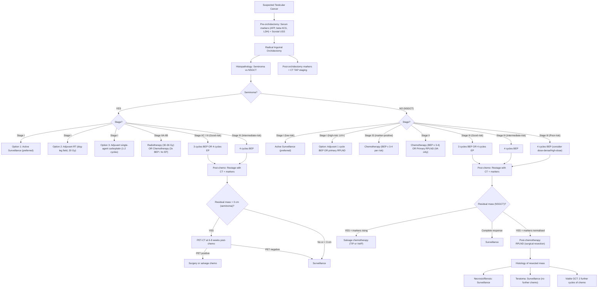

## Management of Testicular Cancer

### 1. Overarching Principles — Why Testicular Cancer Management is a Success Story

Testicular cancer is **the model curable solid tumour in oncology**. Before the introduction of cisplatin-based chemotherapy in the late 1970s, metastatic testicular cancer was uniformly fatal. Today, ***5-year survival exceeds 95%***, and even metastatic disease is curable in the majority [2]. Understanding the management requires grasping a few foundational principles:

1. **Radical inguinal orchidectomy is ALWAYS step one** — for both diagnosis and local control [1][2][9]
2. **Subsequent management depends on two decisions**: (a) Is it seminoma or NSGCT? (b) What is the stage?
3. ***Seminoma is exquisitely radiosensitive*** [1][9] — this opens a treatment option (adjuvant RT) not available for NSGCT
4. ***NSGCT is more radio-resistant*** [1][9] — management relies on chemotherapy and surgery (RPLND)
5. **Cure rates are so high** that long-term treatment toxicity (second cancers, cardiovascular disease, infertility) is a major consideration — we try to minimise overtreatment, particularly in Stage I disease
6. ***Cryopreservation of sperm should be made available to all men diagnosed with testicular cancer prior to instituting therapy*** [1]

---

### 2. Master Management Algorithm

---

### 3. Step 1: Universal — Radical Inguinal Orchidectomy

This has been covered in the diagnostic section but is restated here as it is the mandatory **first step** of management for all testicular tumours.

***Radical inguinal orchidectomy*** [1][2][9]:
- ***Diagnostic*** (histological subtyping, pT staging) and ***therapeutic*** (local tumour control)
- ***Inguinal incision, clamp cord before mobilising testis, double ligation of cord at the deep inguinal ring*** [2]
- ***Complications: usually minimal morbidity, most commonly post-operative scrotal haematoma*** [2]

**Testicular prosthesis**: Should be offered to all patients — a silicone prosthesis can be inserted at the time of orchidectomy or at a later date, for cosmetic and psychological benefit.

**Testosterone replacement**: After unilateral orchidectomy, the remaining testis usually compensates. Monitor testosterone levels; if hypogonadal symptoms develop (fatigue, low libido, decreased bone density), testosterone replacement therapy (TRT) is indicated.

---

### 4. Step 2: Fertility Preservation (Pre-Treatment)

***Cryopreservation of sperm should be made available to all men diagnosed with testicular cancer prior to instituting therapy if they wish to preserve fertility*** [1].

| Key Point | Explanation |
|:----------|:-----------|
| ***~50% of men already have impaired spermatogenesis at baseline*** | Due to testicular dysgenesis syndrome — the same pathology that predisposes to cancer also impairs germ cell function [1] |
| ***Semen quality may further deteriorate following removal of affected testis*** | Loss of ~50% of testicular parenchyma |
| ***Sperm banking should be performed before radiographic diagnostic evaluation*** | ***To avoid radiation exposure of sperm*** [1] — CT scans expose the remaining testis to scatter radiation |
| Should be offered before chemotherapy and radiotherapy | Both are gonadotoxic; alkylating agents (cisplatin) are particularly damaging to spermatogenesis |
| Timing | Ideally 2–3 samples collected over 1–2 weeks before treatment (but do not delay urgent treatment for banking) |

---

### 5. Management of Seminoma — By Stage

#### 5.1 Stage I Seminoma (Tumour Confined to Testis, Markers Normalised, CT Clear)

This is the most common presentation (~70–80% of seminomas). The cure rate is > 99% regardless of which option is chosen. The debate is about **minimising overtreatment** while maintaining cure.

**Three options** [1][2]:

| Option | What It Involves | Rationale | Relapse Rate | Pros | Cons |
|:-------|:----------------|:----------|:-------------|:-----|:-----|
| ***Active Surveillance (preferred in 2025 guidelines)*** | Regular follow-up: markers + CT scans on a scheduled protocol for 5–10 years | ~15–20% of Stage I seminomas harbour occult micrometastases; surveillance identifies the ~15–20% who relapse and treats them then (still curable). The remaining ~80% are spared unnecessary adjuvant treatment. | 15–20% relapse (virtually all salvaged with RT or chemo) | Avoids overtreatment in 80% of patients; no treatment toxicity | Requires strict compliance with follow-up; radiation exposure from serial CT scans; patient anxiety |
| ***Adjuvant radiotherapy*** | ***Para-aortic ± ipsilateral iliac ("dog-leg") field, 20 Gy in 10 fractions*** | ***Seminoma is exquisitely sensitive to radiation therapy*** [1][9]. Low-dose RT sterilises occult retroperitoneal micrometastases. | ~1–3% relapse | Very low relapse rate; well-tolerated | ***Risk of secondary radiotherapy-induced malignancies*** [1] (especially in young patients — risk of contralateral testicular cancer, GI tract cancers, sarcomas increases over decades); gonadotoxic scatter to remaining testis; rarely used as first-line in modern practice |
| ***Adjuvant single-agent carboplatin*** | 1–2 cycles of carboplatin (AUC 7) | Systemic treatment sterilises occult micrometastases; achieves similar relapse reduction as RT without radiation-associated second cancers | ~3–5% relapse | Convenient (1–2 day infusions); avoids radiation; low toxicity | Not as extensively studied long-term as surveillance or RT; risk of over-treatment in 80% |

<Callout title="Current Practice Trend (2025)">
**Active surveillance** is increasingly preferred as the standard of care for Stage I seminoma because:
1. Cure rate approaches 100% even if relapse occurs (salvage chemo is highly effective)
2. Avoids all adjuvant treatment toxicity in the 80% who would never relapse
3. Modern surveillance protocols with risk-adapted CT scanning reduce radiation exposure

However, ***adjuvant carboplatin or RT*** remain options for patients who cannot comply with rigorous surveillance schedules, or who have extreme anxiety about surveillance.
</Callout>

**Risk factors for relapse in Stage I seminoma** (guide shared decision-making):
- Tumour size > 4 cm
- Rete testis invasion
- Lymphovascular invasion (LVI)
- (These are not absolute indications for adjuvant treatment — they inform the discussion)

#### 5.2 Stage IIA–IIB Seminoma (Retroperitoneal LN Involvement ≤ 5 cm)

***Adjuvant RT for stage II seminomas (exquisitely radiosensitive)*** [2]:

| Stage | Treatment Options | Details |
|:------|:-----------------|:--------|
| **Stage IIA** (LN ≤ 2 cm) | ***Radiotherapy (30 Gy)*** to para-aortic + ipsilateral iliac nodes | Cure rate > 95%. RT is highly effective for low-volume retroperitoneal disease. |
| **Stage IIB** (LN 2–5 cm) | ***Radiotherapy (36 Gy)*** OR ***Chemotherapy (3× BEP or 4× EP)*** | Both options have similar outcomes. The trend is towards chemo for IIB because larger nodal masses have higher relapse rates after RT alone. |

**Why does RT work so well for seminoma?** Seminoma cells have a high sensitivity to DNA damage from ionising radiation. They have limited DNA repair capacity compared to NSGCT cells, possibly related to their germ cell origin (germ cells normally undergo apoptosis readily when DNA is damaged — a protective mechanism for genetic integrity).

#### 5.3 Stage IIC–III Seminoma (Bulky Nodes or Metastatic Disease)

***Cisplatin-based chemotherapy for more advanced tumours*** [2]:

| Risk Category (IGCCCG) | Treatment | Expected 5-yr OS |
|:-----------------------|:----------|:----------------|
| ***Good prognosis*** (majority of metastatic seminoma) | ***3 cycles BEP*** or ***4 cycles EP*** (if bleomycin contraindicated) | ~86% |
| ***Intermediate prognosis*** (non-pulmonary visceral mets) | ***4 cycles BEP*** | ~72% |

**Note**: There is **no "poor prognosis" category for seminoma** in the IGCCCG system — even metastatic seminoma has relatively favourable outcomes.

**Post-chemotherapy management of residual masses in seminoma:**
- If residual mass < 3 cm → surveillance (most are fibrosis/necrosis)
- If residual mass ≥ 3 cm → **PET-CT** at 6–8 weeks post-chemo
  - PET-negative → surveillance
  - PET-positive → further treatment (surgical resection or salvage chemotherapy)

---

### 6. Management of NSGCT — By Stage

NSGCT management differs fundamentally from seminoma because:
1. ***NSGCT is radioresistant*** [1][9] — RT has no role
2. **Teratoma** within NSGCT is **chemoresistant** — it must be surgically resected
3. **RPLND** plays a much larger role than in seminoma

#### 6.1 Stage I NSGCT (Tumour Confined to Testis, Markers Normalised, CT Clear)

**Risk stratification is based on lymphovascular invasion (LVI):**

| LVI Status | Risk of Occult Metastases | Preferred Management | Alternative |
|:-----------|:------------------------|:--------------------|:-----------|
| ***LVI absent (low-risk)*** | ~15% relapse rate | ***Active Surveillance*** (preferred) | Adjuvant 1 cycle BEP |
| ***LVI present (high-risk)*** | ~50% relapse rate | ***Adjuvant 1 cycle BEP*** (reduces relapse to ~3–5%) or ***Primary RPLND*** | Active surveillance (but requires very close follow-up) |

***No treatment if early (stage I)*** — this refers to the surveillance option [2].

***RPLND for high-risk early (stage I) NSGCTs*** [2]:
- Primary nerve-sparing RPLND is an option for Stage I NSGCT (especially in centres with expertise)
- Advantage: definitive pathological staging of the retroperitoneum; avoids chemotherapy in patients with pN0 disease
- Disadvantage: morbidity (see below); does not address potential distant micrometastases

<Callout title="Why is LVI the Key Risk Factor in Stage I NSGCT?">
Lymphovascular invasion means tumour cells have already entered blood vessels or lymphatic channels within the testis. This is the earliest step in metastatic dissemination. If LVI is present, there is approximately a **50% chance** that microscopic disease has already seeded the retroperitoneal nodes or distant sites, even though imaging appears normal. Without adjuvant treatment, half of these patients will relapse. One cycle of BEP dramatically reduces this risk to ~3–5%.
</Callout>

#### 6.2 Stage IS NSGCT (Markers Elevated Post-Orchidectomy, CT Normal)

This is a unique situation: markers are rising/not normalising after orchidectomy, but imaging shows no visible disease. The tumour is producing markers from somewhere — there must be micrometastatic disease.

| Management | Rationale |
|:-----------|:----------|
| ***Chemotherapy (3–4 cycles BEP based on IGCCCG risk)*** | Marker-positive disease indicates systemic micrometastases that require systemic treatment. RPLND alone would miss non-retroperitoneal micrometastases. |

#### 6.3 Stage II NSGCT (Retroperitoneal LN Involvement)

| Stage | Options | Details |
|:------|:--------|:--------|
| **IIA** (LN ≤ 2 cm, markers normal/S1) | ***Primary RPLND*** (nerve-sparing) OR ***Chemotherapy (3× BEP for good-risk, 4× BEP for intermediate-risk)*** | RPLND preferred if markers normalised and nodes small; provides definitive pathological staging. If nodes contain only teratoma → no further treatment. If viable GCT → 2 adjuvant cycles of chemo. |
| **IIB** (LN 2–5 cm) | ***Chemotherapy (3× BEP good-risk, 4× BEP intermediate-risk)*** followed by post-chemo RPLND if residual mass | Larger nodal mass = higher tumour burden → systemic treatment first |
| **IIC** (LN > 5 cm) | ***Chemotherapy first*** (as for Stage III) → post-chemo RPLND | Bulky disease requires upfront systemic treatment |

#### 6.4 Stage III NSGCT (Metastatic Disease)

***Cisplatin-based chemotherapy for other more advanced tumours. Regimen depends on risk stratification and extent of tumour*** [2].

| IGCCCG Risk | Regimen | Cycles | 5-yr OS |
|:------------|:--------|:-------|:--------|
| ***Good prognosis*** | ***3 cycles BEP*** or ***4 cycles EP*** | 3–4 | ~92% |
| ***Intermediate prognosis*** | ***4 cycles BEP*** | 4 | ~80% |
| ***Poor prognosis*** | ***4 cycles BEP*** (standard) ± consideration of dose-dense/high-dose chemo with autologous stem cell rescue in selected cases | 4+ | ~48% |

**Post-chemotherapy assessment for NSGCT (critical decision point):**

| Scenario | Action | Rationale |
|:---------|:-------|:---------|
| **Complete response** (markers normalised + no residual mass on CT) | ***Surveillance*** | No residual disease to treat |
| **Markers normalised + residual mass on CT** | ***Post-chemotherapy RPLND*** (mandatory surgical resection of ALL residual masses) | Cannot distinguish fibrosis vs teratoma vs viable GCT on imaging. Teratoma is chemoresistant and will grow/transform if left in situ. |
| **Markers rising despite chemotherapy** | ***Salvage chemotherapy*** (TIP: paclitaxel + ifosfamide + cisplatin; or VeIP: vinblastine + ifosfamide + cisplatin) | First-line chemo-refractory disease; needs alternative regimen |

**Why is post-chemo RPLND mandatory in NSGCT but not seminoma?**

The histology of post-chemo residual masses differs fundamentally between the two:

| | Seminoma residual mass | NSGCT residual mass |
|:--|:---------------------|:-------------------|
| Necrosis/fibrosis | ~80% | ~40–50% |
| Viable tumour | ~10–20% | ~10–15% |
| Teratoma | Very rare (seminoma doesn't differentiate into teratoma) | **~40–50%** |

The key issue is **teratoma**. In NSGCT, post-chemo residual masses contain teratoma in ~40–50% of cases. Teratoma is **chemoresistant** (it doesn't respond to further cycles), can **grow progressively** ("growing teratoma syndrome"), and can undergo **malignant transformation** into non-germ-cell cancers (sarcoma, adenocarcinoma). The only way to deal with teratoma is **surgical resection**. In seminoma, teratoma is exceedingly rare in residual masses, so PET-CT can reliably distinguish fibrosis from viable tumour.

---

### 7. Treatment Modalities — Detailed Pharmacology and Mechanisms

#### 7.1 Chemotherapy — BEP Regimen

***BEP therapy: Bleomycin + Etoposide + Cisplatin*** [1]

This is the **gold standard** chemotherapy regimen for testicular GCTs. Let's break down each drug:

##### A. Cisplatin (Cis-diamminedichloroplatinum)

- **"Cis"** = same side; "platin" = platinum — a platinum coordination complex where two chloride and two ammonia ligands are on the same side
- **Mechanism**: Forms intrastrand and interstrand DNA crosslinks → prevents DNA replication and transcription → triggers apoptosis
- **Why it works so well in GCTs**: Germ cells have an inherently **high sensitivity to DNA damage** — they normally undergo apoptosis readily when DNA is damaged (protective mechanism for genetic integrity of the germ line). GCT cells retain this property, making them exceptionally responsive to cisplatin-induced DNA damage.
- **Key toxicities**:
  - **Nephrotoxicity** (dose-limiting): aggressive IV hydration + saline loading mandatory
  - **Ototoxicity**: high-frequency sensorineural hearing loss (irreversible)
  - **Peripheral neuropathy**: stocking-glove distribution
  - **Severe nausea/vomiting**: highly emetogenic — requires triple antiemetic prophylaxis (5-HT3 antagonist + NK1 antagonist + dexamethasone)
  - **Hypomagnesaemia**: renal magnesium wasting
  - **Myelosuppression**

##### B. Etoposide (VP-16)

- **Mechanism**: Topoisomerase II inhibitor — prevents relegation of DNA strands after topoisomerase II-mediated cleavage → stabilises DNA double-strand breaks → apoptosis
- **Key toxicities**:
  - **Myelosuppression** (dose-limiting — particularly neutropenia)
  - **Secondary leukaemia**: Risk of treatment-related AML/MDS (especially with etoposide — characteristically t(11q23) rearrangements), usually 2–5 years after treatment
  - Alopecia
  - Mucositis

##### C. Bleomycin

- **"Bleo"** = derived from *Streptomyces verticillus*; "mycin" = antibiotic origin
- **Mechanism**: Generates free radicals → causes DNA strand breaks (both single and double) → apoptosis. Acts primarily in G2 and M phases.
- **Key toxicity**:
  - ***Pulmonary fibrosis*** (dose-limiting and potentially fatal): Bleomycin is inactivated by the enzyme bleomycin hydrolase, which is present in most tissues **except the lungs and skin**. Therefore, bleomycin accumulates in the lungs → free radical damage → progressive interstitial pneumonitis → pulmonary fibrosis.
  - **Cumulative dose limit**: Generally < 300–360 IU total lifetime dose
  - **Risk factors for bleomycin lung toxicity**: Age > 40, renal impairment (reduced clearance), high FiO2 exposure (e.g., during anaesthesia — MUST inform anaesthetist), cumulative dose > 300 IU, prior chest irradiation
  - **Monitoring**: Baseline + serial pulmonary function tests (DLCO); discontinue if DLCO drops > 40% from baseline
  - Skin: hyperpigmentation, Raynaud's phenomenon, flagellate dermatitis

<Callout title="Bleomycin and Anaesthesia — Life-Saving Knowledge" type="error">
Any patient who has **ever** received bleomycin (even years prior) must have this documented prominently in their notes. During general anaesthesia, high FiO2 can trigger **fatal bleomycin pulmonary toxicity** even if the drug was given long ago. The anaesthetist MUST be informed, and FiO2 should be kept as low as safely possible (ideally ≤ 0.3). This is a classic exam question and a real-life killer.
</Callout>

##### D. Carboplatin

- Second-generation platinum compound; ***single-agent carboplatin*** is used for adjuvant treatment of Stage I seminoma [1]
- **Mechanism**: Same as cisplatin (DNA crosslinks) but with a different carrier ligand (cyclobutane dicarboxylate instead of chloride)
- **Less nephrotoxic and emetogenic** than cisplatin but **more myelosuppressive**
- Dosed by AUC (area under the curve) using the **Calvert formula**: Dose = AUC × (GFR + 25)
- For Stage I seminoma adjuvant: AUC 7, 1–2 cycles

##### E. EP Regimen (Etoposide + Cisplatin)

- 4 cycles EP is equivalent to 3 cycles BEP in good-prognosis disease
- Used when **bleomycin is contraindicated** (e.g., pre-existing lung disease, age > 50 with comorbidities, prior bleomycin toxicity)

**Summary of BEP schedule (standard cycle = 21 days, 3–4 cycles):**

| Drug | Day | Administration |
|:-----|:----|:-------------|
| Bleomycin | Day 1, 8, 15 | IV bolus (30 IU) |
| Etoposide | Day 1–5 | IV infusion (100 mg/m²) |
| Cisplatin | Day 1–5 | IV infusion (20 mg/m²/day) with aggressive hydration |

#### 7.2 Radiotherapy

***Seminoma is exquisitely sensitive to radiation therapy*** [1][9]. ***Non-seminomatous germ cell tumours are more radio-resistant*** [1].

| Indication | Field | Dose | Notes |
|:-----------|:------|:-----|:------|
| Stage I seminoma (adjuvant, if chosen) | Para-aortic ± ipsilateral iliac ("dog-leg") | 20 Gy in 10 fractions | Declining use due to late second-cancer risk |
| Stage IIA seminoma | Para-aortic + ipsilateral iliac | 30 Gy (with boost to involved nodes) | High cure rate > 95% |
| Stage IIB seminoma | Para-aortic + ipsilateral iliac | 36 Gy | Alternative to chemotherapy |
| NSGCT | **Not used** (radioresistant) | — | — |

***Risk of secondary radiotherapy-induced malignancies*** [1]: This is the major concern with RT in young patients. Radiation fields to the para-aortic region expose the stomach, pancreas, kidney, bowel, and remaining testis to scatter. Long-term follow-up studies show increased rates of:
- Second solid cancers (GI cancers, sarcomas) — risk increases over decades
- Contralateral testicular cancer (from scatter)
- Cardiovascular disease (mediastinal irradiation)

This is why there has been a strong shift towards surveillance and carboplatin over RT for Stage I seminoma.

#### 7.3 Retroperitoneal Lymph Node Dissection (RPLND)

***RPLND*** [1][2]:

**What it is**: Surgical removal of the retroperitoneal lymph node-bearing tissue (fat pad) along the great vessels from the renal hilum to the bifurcation of the common iliac arteries.

**Indications:**

| Indication | Rationale |
|:-----------|:----------|
| ***Post-chemotherapy residual mass in NSGCT*** (markers normalised) | ***Reserved for patients with post-chemotherapy residual disease since primary chemotherapy is the treatment of choice for patients with Stage II or III disease*** [1]. Must surgically resect to differentiate fibrosis vs teratoma vs viable GCT. |
| ***High-risk Stage I NSGCT*** (as alternative to adjuvant chemo) | ***RPLND for high-risk early (stage I) NSGCTs*** [2]. Provides definitive pathological staging. |
| Primary treatment for Stage IIA NSGCT (markers normal) | Alternative to chemotherapy in low-volume retroperitoneal disease |
| Post-chemotherapy residual mass in seminoma (PET-positive or growing) | Rare indication |

***Key points about RPLND*** [1]:
- ***Requires expertise and has high risk of complications*** [1]
- ***Only reliable method to identify nodal micrometastasis given the high false-negative rate with CT*** [1]
- ***GOLD standard for providing accurate pathological staging of the retroperitoneum*** [1]

**Surgical templates:**
- Right-sided tumour: right-sided modified template (right paracaval, interaortocaval, preaortic)
- Left-sided tumour: left-sided modified template (left para-aortic, preaortic, interaortocaval)
- Full bilateral template: used for post-chemotherapy RPLND when disease is bilateral

**Nerve-sparing technique:**
- The sympathetic postganglionic fibres (from the hypogastric plexus, T12-L3) that control **antegrade ejaculation** run along the aorta and cross anterior to the common iliac arteries
- Damage to these fibres → **retrograde ejaculation** (semen goes backward into the bladder instead of forward through the urethra) → effective infertility despite normal sperm production
- **Nerve-sparing RPLND** carefully identifies and preserves these fibres, reducing the rate of retrograde ejaculation from ~75% (non-nerve-sparing) to < 5% (nerve-sparing)

**Complications of RPLND:**

| Complication | Mechanism | Prevention |
|:-------------|:---------|:----------|
| ***Retrograde ejaculation*** (most important) | Damage to sympathetic postganglionic fibres controlling ejaculation | Nerve-sparing technique |
| Lymphatic leak / chylous ascites | Disruption of cisterna chyli or major lymphatics | Careful surgical technique; fat-free diet post-op |
| Bowel obstruction (adhesions) | Post-operative adhesion formation | Standard surgical care |
| Vascular injury (aorta, IVC, renal vessels) | Proximity to great vessels | Expert surgeon |
| Renal failure (rare) | Renal artery injury or sacrifice | Uncommon in experienced centres |

#### 7.4 Salvage Chemotherapy

For patients who relapse after first-line BEP or have refractory disease:

| Regimen | Components | Indication |
|:--------|:----------|:-----------|
| **TIP** | Paclitaxel + Ifosfamide + Cisplatin | First-line salvage for relapsed GCT |
| **VeIP** | Vinblastine + Ifosfamide + Cisplatin | Alternative salvage regimen |
| **High-dose chemotherapy + autologous stem cell transplant (HDCT + ASCT)** | High-dose carboplatin + etoposide → followed by re-infusion of previously harvested autologous stem cells | Second or third salvage; ***testicular germ cell tumour is an indication for autologous HSCT*** [15]. Used when conventional-dose salvage fails. The principle is to give myeloablative doses of chemo that would otherwise be fatal, then "rescue" the patient's bone marrow by re-infusing their own stored stem cells. |

---

### 8. Management of Special Situations

#### 8.1 Bilateral Testicular Tumours

- If synchronous or metachronous bilateral tumours, **testis-sparing surgery (partial orchidectomy)** should be considered for the second tumour (to preserve testosterone production and avoid bilateral orchidectomy → lifelong androgen replacement)
- Criteria for testis-sparing: tumour < 2 cm, AFP normal, adequate residual testicular volume, patient reliable for surveillance
- Multiple biopsies of surrounding parenchyma for GCNIS

#### 8.2 Life-Threatening Presentation (Choriocarcinoma with Massive Metastases)

- Some patients present with **respiratory failure** from massive pulmonary metastases or **intracranial haemorrhage** from brain metastases (choriocarcinoma)
- ***Start emergency chemotherapy BEFORE orchidectomy*** in these cases — orchidectomy is deferred until the patient is stabilised
- Very high β-hCG ( > 50,000 mIU/mL) + characteristic imaging is sufficient for diagnosis without histology in emergencies

#### 8.3 Growing Teratoma Syndrome

- Enlarging masses during or after chemotherapy with **normalising or normal markers**
- Indicates mature teratoma growth (chemoresistant, marker-negative) despite effective treatment of other GCT components
- **Management**: Surgical resection of all growing masses — chemotherapy will not help

#### 8.4 Sex Cord-Stromal Tumours (Leydig Cell, Sertoli Cell)

- **Radical inguinal orchidectomy** — same as for GCTs
- **No established role for chemotherapy or RT** (these tumours are generally chemo/radioresistant)
- If malignant (metastatic): RPLND ± mitotane (for Leydig cell tumour) or clinical trial
- If benign and small: testis-sparing surgery may be considered

#### 8.5 Testicular Lymphoma

- **Not** managed as a testicular tumour — managed as **systemic lymphoma**
- Orchidectomy for local control + R-CHOP (rituximab + cyclophosphamide + doxorubicin + vincristine + prednisolone) × 6–8 cycles
- **CNS prophylaxis** (intrathecal methotrexate or high-dose systemic methotrexate) — due to high propensity for CNS relapse
- **Contralateral testicular RT** (scrotal irradiation) — due to high rate of bilateral involvement and testicular relapse
- Prognosis worse than GCTs (5-year OS ~50–60%)

---

### 9. Follow-Up / Surveillance — Post-Treatment Monitoring

***Surveillance: serial monitoring of β-hCG, AFP within first 1–2 years (relapse > 2 years rare)*** [2].

| Component | Frequency (Year 1–2) | Frequency (Year 3–5) | Frequency (Year 5+) |
|:----------|:--------------------|:---------------------|:--------------------|
| Physical examination | Every 2–3 months | Every 4–6 months | Annually |
| Serum markers (AFP, β-hCG, LDH) | Every 2–3 months | Every 4–6 months | Annually |
| CT abdomen/pelvis | 2–4× per year (NSGCT); 2–3× per year (seminoma) | 1–2× per year | As indicated |
| CXR | 2–4× per year | 1–2× per year | As indicated |
| Testosterone level | Annually | Annually | Annually |

**Why is relapse > 2 years rare?** GCTs are rapidly proliferating tumours — if micrometastases are present, they grow quickly and declare themselves within the first 1–2 years. Late relapse ( > 2 years) occurs in < 5% of cases but should not be forgotten — it tends to be chemoresistant teratoma with somatic transformation.

---

### 10. Prognosis

***Prognosis: 95% 5-year survival if no metastasis after adjuvant RT/chemo*** [2].

| Stage | 5-Year Survival |
|:------|:---------------|
| Stage I (all types) | > 99% |
| Stage II seminoma | > 95% |
| Stage II NSGCT | ~90–95% |
| Metastatic good-prognosis (IGCCCG) | Seminoma ~86%, NSGCT ~92% |
| Metastatic intermediate-prognosis | Seminoma ~72%, NSGCT ~80% |
| Metastatic poor-prognosis (NSGCT only) | ~48% |

***One of the most curable solid neoplasms: 5-year survival > 95%, only representing 0.1% of all male cancer deaths*** [2].

---

<Callout title="High Yield Summary">

**Step 1 (ALL patients)**: Radical inguinal orchidectomy + pre-op sperm banking.

**Seminoma management**:
- Stage I → Surveillance (preferred) / adjuvant carboplatin (1–2 cycles AUC 7) / adjuvant RT (20 Gy). Surveillance is the modern standard.
- Stage IIA–IIB → RT (30–36 Gy) or chemotherapy (3× BEP / 4× EP).
- Stage IIC–III → Chemotherapy (BEP). Post-chemo residual mass ≥ 3 cm → PET-CT (if PET+ve → resect or salvage chemo).

**NSGCT management**:
- Stage I → Surveillance (low-risk) / 1 cycle adjuvant BEP or primary RPLND (high-risk/LVI+).
- Stage IS → Chemotherapy (markers not normalising post-orchidectomy).
- Stage II–III → Chemotherapy (BEP, cycles based on IGCCCG risk) → post-chemo RPLND for ANY residual mass (mandatory — to resect teratoma).

**Key pharmacology**: BEP = Bleomycin (DNA strand breaks, pulmonary fibrosis) + Etoposide (topo-II inhibitor, secondary leukaemia) + Cisplatin (DNA crosslinks, nephro/ototoxicity). Bleomycin + high FiO2 anaesthesia = FATAL pulmonary toxicity.

**RPLND**: Gold standard for retroperitoneal staging. Nerve-sparing technique preserves ejaculation. Main complication = retrograde ejaculation.

**Post-chemo residual mass**: Seminoma → PET-CT. NSGCT → always resect (teratoma is chemo-resistant, PET-negative but still needs surgery).

**Salvage**: TIP or VeIP. Ultimate salvage: high-dose chemo + autologous SCT.

</Callout>

---

<ActiveRecallQuiz
  title="Active Recall - Management of Testicular Cancer"
  items={[
    {
      question: "A 28-year-old man with Stage I seminoma after orchidectomy asks about his treatment options. Describe the three options, their relapse rates, and which is preferred in current practice.",
      markscheme: "Three options: (1) Active surveillance (preferred): no adjuvant treatment, regular follow-up with markers and CT. 15-20% relapse but virtually all salvaged. Avoids overtreatment in 80%. (2) Adjuvant RT: 20 Gy to para-aortic field. Relapse 1-3%. Risk of secondary malignancies in young patients. (3) Adjuvant single-agent carboplatin: 1-2 cycles AUC 7. Relapse 3-5%. Avoids radiation. Active surveillance is preferred in modern guidelines because cure rate approaches 100% regardless of option chosen, and it avoids treatment toxicity for the majority who will not relapse."
    },
    {
      question: "Why is post-chemotherapy RPLND mandatory for residual masses in NSGCT but not in seminoma? Explain the histological basis.",
      markscheme: "In NSGCT, post-chemo residual masses contain teratoma in 40-50% of cases. Teratoma is chemoresistant (does not respond to further chemotherapy), can grow progressively (growing teratoma syndrome), and can undergo malignant somatic transformation. PET-CT cannot distinguish teratoma from fibrosis because teratoma is FDG-negative (low metabolic activity). Therefore surgical resection is the only way to deal with it. In seminoma, teratoma is exceedingly rare in residual masses. The masses are either fibrosis/necrosis (80%) or viable seminoma (20%). PET-CT can reliably distinguish between them (viable seminoma is FDG-avid), avoiding unnecessary surgery."
    },
    {
      question: "Explain the mechanism of action and dose-limiting toxicity of each component of the BEP regimen.",
      markscheme: "Bleomycin: generates free radicals causing DNA strand breaks; dose-limiting toxicity = pulmonary fibrosis (bleomycin hydrolase absent in lung tissue, so drug accumulates; cumulative dose limit ~300 IU). Etoposide: topoisomerase II inhibitor stabilising DNA double-strand breaks; dose-limiting toxicity = myelosuppression (neutropenia); also risk of secondary AML/MDS. Cisplatin: forms intra/interstrand DNA crosslinks preventing replication; dose-limiting toxicity = nephrotoxicity (requires aggressive hydration); also ototoxicity, peripheral neuropathy, severe emesis."
    },
    {
      question: "A patient who received bleomycin for testicular cancer 3 years ago now requires general anaesthesia for an unrelated surgery. What is the critical concern and what instruction must be given to the anaesthetic team?",
      markscheme: "Critical concern: bleomycin pulmonary toxicity can be triggered by high FiO2 during general anaesthesia, even years after the last dose. This can cause fatal acute pulmonary fibrosis/ARDS. The anaesthetist MUST be informed of previous bleomycin exposure, and FiO2 should be kept as low as safely possible (ideally 0.3 or below). This must be documented prominently in the patient's medical records."
    },
    {
      question: "What is the most important complication of RPLND and how is it prevented? Explain the anatomical basis.",
      markscheme: "Most important complication: retrograde ejaculation. Anatomical basis: sympathetic postganglionic fibres from the hypogastric plexus (T12-L3) run along the aorta and cross anterior to the common iliac arteries. These fibres control antegrade ejaculation (closure of bladder neck during ejaculation + coordinated contraction of vas deferens/seminal vesicles). Damage during dissection causes retrograde ejaculation (semen goes into bladder instead of out through urethra). Prevention: nerve-sparing RPLND technique that carefully identifies and preserves these fibres, reducing the rate from ~75% to less than 5%."
    },
    {
      question: "What is the role of autologous stem cell transplant in testicular cancer management?",
      markscheme: "Autologous HSCT is used as salvage therapy for relapsed or refractory testicular GCT that has failed conventional-dose salvage chemotherapy (e.g., TIP or VeIP). The principle: patient's own haematopoietic stem cells are harvested and cryopreserved, then myeloablative high-dose chemotherapy (typically high-dose carboplatin + etoposide) is administered to maximise tumour kill. The previously stored stem cells are then re-infused to rescue the patient from otherwise fatal bone marrow aplasia. This allows dose escalation beyond what would normally be tolerable."
    }
  ]}
/>

## References

[1] Senior notes: felixlai.md (Testicular cancer — Treatment section)
[2] Senior notes: Ryan Ho Urogenital.pdf (Section 11.2.5 Testicular Tumours, p.235–236)
[9] Senior notes: maxim.md (Testicular tumour — Management section)
[15] Senior notes: Ryan Ho Haemtology.pdf (Section 5.2 Haematopoietic Stem Cell Transplantation, p.153)
