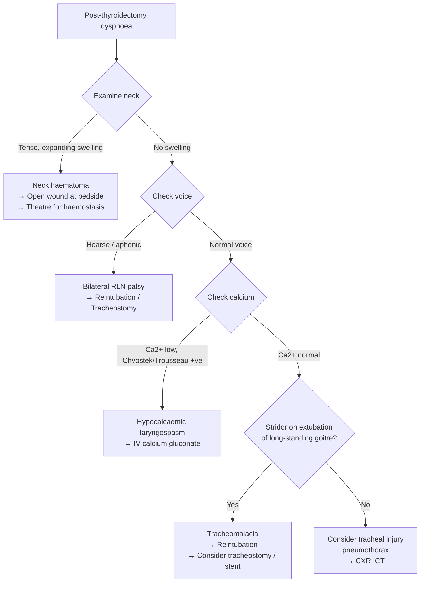

## Complications of Thyroid Cancer and Its Treatment

### 34. Overview — Sources of Complications

Complications in thyroid cancer arise from two broad sources:

1. **The disease itself** — local invasion, compression, metastatic disease.
2. **The treatment** — surgical complications (thyroidectomy, neck dissection), RAI adverse effects, and long-term consequences of TSH suppression therapy.

In clinical practice, you will encounter treatment-related complications far more frequently than disease-related complications, because most thyroid cancers are caught early and treated surgically. Understanding these complications from first principles — *why* they happen, based on the surgical anatomy — is critical for both exams and patient safety.

---

### 35. Complications of Thyroidectomy

These are the complications you will be asked about most frequently. They are classified by **timing** [8]:

#### 35.1 Immediate (Intraoperative) Complications

| Complication | Pathophysiology & Mechanism | Clinical Features | Management |
|:---|:---|:---|:---|
| ***Intraoperative bleeding*** | The thyroid is one of the most vascular organs per gram of tissue (supplied by superior thyroid artery, inferior thyroid artery, and sometimes thyroid ima artery). Inadvertent vessel injury or slipping of a ligature causes haemorrhage. | Active bleeding during surgery | Direct haemostasis; ligation of bleeding vessel; meticulous surgical technique |
| ***Oesophageal injury*** | The oesophagus lies directly posterior to the thyroid gland. During dissection, especially of posteriorly located tumours or in revision surgery, the oesophageal wall can be perforated. | May not be immediately apparent; post-op: dysphagia, mediastinitis, fever | Primary repair if recognised intraoperatively; drainage and antibiotics if delayed recognition |
| ***Tracheal injury*** | The thyroid is intimately adherent to the trachea via the pre-tracheal fascia (Berry's ligament). Aggressive dissection, especially in locally invasive cancer, can breach the tracheal wall. | Air leak, subcutaneous emphysema, pneumomediastinum | Primary repair; may need temporary tracheostomy |
| ***Tracheomalacia*** | In patients with longstanding large goitres (especially retrosternal), chronic compression of the trachea causes **weakening and softening of the tracheal cartilage rings**. When the goitre is removed, the trachea collapses because the external "splinting" effect of the goitre is gone. | **Post-extubation stridor and airway obstruction** immediately after surgery | Re-intubation; may need prolonged intubation or tracheostomy; rarely, tracheal stenting |
| ***Thyroid storm*** [8] | ***Develops in patients with longstanding untreated hyperthyroidism, precipitated by acute event such as surgery, trauma or infection. Rapid increase in serum thyroid hormone levels leading to increased response to sympathetic inputs from catecholamines by permissive effect.*** | ***Hyperpyrexia, tachycardia, hypertension → followed by heart failure with hypotension and arrhythmia*** [8] | **Lugol's iodine** (block hormone release), **propranolol** (block sympathetic effects), **propylthiouracil/carbimazole** (block new hormone synthesis), **hydrocortisone** (block T4→T3 conversion, adrenal support), **cooling measures**, **ICU admission** |
| ***Superior laryngeal nerve (SLN) injury*** [8] | ***SLN (external branch) supplies the cricothyroid muscle, which lengthens (tenses) the vocal cord to produce high-pitched sound.*** The external branch of the SLN runs close to the superior thyroid artery pedicle — it is at risk during ligation of the superior pole vessels. | ***Vocal fatigue and changes in voice quality*** [8]; loss of the ability to project or produce high-pitched sounds. Often subtle and underdiagnosed. Singers, teachers, and public speakers are most affected. | Voice therapy; rarely requires intervention |
| ***Recurrent laryngeal nerve (RLN) injury*** [8] | ***RLN supplies all intrinsic muscles of the larynx except cricothyroid.*** The RLN runs in the tracheo-oesophageal groove and has an intimate relationship with the inferior thyroid artery and Berry's ligament — areas of maximal surgical risk. Injury can occur from transection, traction, thermal injury (cautery), or compression (oedema/haematoma). | See detailed breakdown below | See below |

##### RLN Injury — Detailed Breakdown [8][9]

| Type of Injury | Mechanism | Clinical Presentation | Why? |
|:---|:---|:---|:---|
| ***Ipsilateral (unilateral) RLN injury*** | Transection, cautery, traction, or oedema of one RLN | ***Unilateral vocal cord palsy → hoarseness and ineffective cough*** [8] | The affected cord is paralysed in a paramedian or intermediate position and cannot adduct/abduct properly. Air leaks through the incompetent glottis during phonation → breathy, hoarse voice. Cough requires forceful cord adduction to build subglottic pressure → weak/bovine cough. ***Increased risk of aspiration pneumonia*** [8] |
| ***Bilateral RLN injury*** | Both RLNs damaged (risk during total thyroidectomy or revision surgery) | ***Bilateral vocal cord palsy → stridor and dyspnoea (airway obstruction)*** [8] | Both cords are paralysed. In the acute setting, the cords tend to rest in a **median/adducted position** (because there are 6 adductor muscles but only 2 abductor muscles — the posterior cricoarytenoids; when all are paralysed, elastic recoil and residual tone favour adduction). This closes the airway → **acute upper airway obstruction** — a surgical emergency |

<Callout title="Why Does Bilateral RLN Palsy Cause Airway Obstruction But Unilateral Does Not?">
With unilateral palsy, the intact contralateral cord compensates by adducting to meet the paralysed cord during phonation, and the airway remains open because one cord can still abduct. With bilateral palsy, NEITHER cord can abduct (open), so the glottis remains in a narrow, near-closed position — especially during inspiration when airflow pulls the cords further inward (Bernoulli effect) → stridor and respiratory distress. This is an **emergency** requiring reintubation or tracheostomy.
</Callout>

**Management of RLN palsy** [9]:
- **Unilateral**: ***Cord medialisation procedures*** — e.g., ***injection thyroplasty*** (inject substance to bulk up the paralysed cord, pushing it medially so the other cord can meet it), ***open thyroplasty (Gore-Tex implant)*** [9]. Speech therapy for voice rehabilitation.
- **Bilateral**: Emergency airway management (intubation/tracheostomy). Long-term: cordotomy or arytenoidectomy (widen the glottis at the expense of voice quality) or tracheostomy.

> **High Yield**: The difference between SLN and RLN injury: ***EBSLN injury = loss of high pitch, poor volume, easy fatigue (cricothyroid muscle)*** [9]. ***RLN injury = hoarseness (unilateral) or stridor (bilateral)*** [8].

---

#### 35.2 Early Complications (Hours to Days)

| Complication | Pathophysiology & Mechanism | Clinical Features | Management |
|:---|:---|:---|:---|
| ***Haematoma formation*** [8] | Post-operative bleeding from thyroid bed vessels (superior/inferior thyroid arteries, thyroid veins). Blood accumulates in the closed fascial space of the anterior neck. | ***Potentially fatal if compression on airways*** — a tense, expanding neck swelling post-operatively. The haematoma compresses the trachea and/or causes laryngeal oedema → acute airway obstruction. | ***Removal of sutures/staples and allow drainage of blood*** [8] — this is a **bedside emergency**. The wound is opened at the bedside IMMEDIATELY to decompress the airway; formal re-exploration in theatre for definitive haemostasis follows. Do NOT wait for theatre if the patient is in extremis. |
| ***Wound infection*** | Contamination during surgery (rare — thyroidectomy is a **clean** surgical field, so infection rates are very low, < 1%) | Erythema, warmth, purulent discharge, fever | Antibiotics; drainage if abscess forms |

<Callout title="Post-Thyroidectomy Neck Haematoma — The True Emergency" type="error">
This is one of the most dangerous complications in all of surgery. A neck haematoma after thyroidectomy can kill a patient in minutes by compressing the airway. Every surgical ward should have a **haematoma box** at the bedside containing clip removers/suture cutters. The protocol is: **open the wound at the bedside immediately** to release the blood, then take the patient to theatre for re-exploration. Speed saves lives. A delayed response = a dead patient.

Note from Maxim's notes: ***Wound infection is NOT a recognised complication*** of thyroidectomy (clean surgical field) [9] — this is an exam distinction. Haematoma is the early complication you must know.
</Callout>

---

#### 35.3 Late Complications (Days to Weeks to Permanent)

##### A. Hypoparathyroidism → Hypocalcaemia

This is the ***MOST common complication*** of thyroidectomy [8].

**Why does it happen?** The four parathyroid glands sit on the posterior surface of the thyroid. During thyroidectomy (especially total), they can be:
1. **Inadvertently removed** with the thyroid specimen.
2. **Devascularised** — their blood supply comes from the inferior thyroid artery; ligation of this artery or disruption of the end-arteries feeding the parathyroids causes ischaemic necrosis.
3. **Bruised/contused** — surgical handling causes oedema and temporary dysfunction.

***Only relevant in total thyroidectomy*** — hemithyroidectomy preserves the contralateral parathyroid glands, so clinically significant hypoparathyroidism is rare [9].

***Most cases are transient*** (resolving within days to weeks as the stunned glands recover) [9]. **Permanent hypoparathyroidism** (lasting > 6-12 months) occurs in ~1-2% of total thyroidectomies at experienced centres.

**Clinical features** — all due to hypocalcaemia causing increased neuromuscular excitability (low Ca²⁺ → decreased threshold for nerve depolarisation → spontaneous firing) [8][9]:

| Sign/Symptom | Mechanism |
|:---|:---|
| ***Perioral and acral paraesthesia*** | Sensory nerves around the mouth and fingertips fire spontaneously due to low Ca²⁺ — this is usually the **earliest symptom** |
| ***Perioral numbness*** [9] | Same mechanism |
| ***Carpopedal spasm*** | Spontaneous contraction of hand/foot muscles — the hand adopts the "main d'accoucheur" (obstetrician's hand) posture: wrist flexion, MCP flexion, IP extension, thumb adduction |
| ***Muscle spasms and cramps*** | Generalised increased neuromuscular excitability |
| ***Trousseau's sign*** | Inflate a blood pressure cuff above systolic pressure for 3 minutes → carpopedal spasm appears. This occurs because ischaemia (from the cuff) further lowers ionised Ca²⁺ in the tissues, pushing an already-low level over the threshold for tetany |
| ***Chvostek's sign*** | Tap over the facial nerve (anterior to the ear) → ipsilateral facial muscle twitching. The facial nerve is hyperexcitable due to hypocalcaemia |
| ***Laryngospasm*** [9] | ***Severe hypocalcaemia can lead to laryngospasm requiring emergency intubation / surgical airway*** — the laryngeal muscles are also hyperexcitable and can go into spasm, causing acute upper airway obstruction |
| **Prolonged QT interval on ECG** | Calcium is required for phase 2 (plateau) of the cardiac action potential. Low Ca²⁺ prolongs the plateau → QT prolongation → risk of Torsades de Pointes |
| **Seizures** (severe) | Severe hypocalcaemia lowers the seizure threshold in the CNS |

**Management** [8][9]:
- ***Acute/symptomatic***: ***IV 10-20 mL of 10% calcium gluconate over 10 minutes (slow bolus)*** [8]. Must be given slowly to avoid cardiac arrhythmias. Can repeat as needed. Continuous IV calcium infusion if symptomatic hypocalcaemia persists.
- ***Maintenance/replacement***: ***Calcium carbonate + Calcitriol (active Vitamin D)*** [8][9]. Calcitriol (1,25-dihydroxyvitamin D₃) is used because PTH is needed to convert 25-hydroxyvitamin D to the active 1,25 form in the kidney — without PTH, inactive vitamin D supplements alone are insufficient.

<Callout title="Why Calcitriol and Not Regular Vitamin D?">
The normal activation pathway of vitamin D is: Cholecalciferol (D3) → 25-hydroxylation in liver → **1α-hydroxylation in kidney (PTH-dependent)** → 1,25-dihydroxyvitamin D₃ (calcitriol). In hypoparathyroidism, there is no PTH to stimulate the final 1α-hydroxylation step. Therefore, you must give the **already-active form** (calcitriol) to bypass this block. Giving regular vitamin D (cholecalciferol) alone will NOT correct hypocalcaemia in the absence of PTH.
</Callout>

##### B. Hungry Bone Syndrome [8]

***Definition: Severe and prolonged hypocalcaemia despite normal or even elevated levels of PTH*** [8].

This occurs specifically in patients with **pre-existing hyperparathyroidism** (e.g., MEN2A with concurrent parathyroid hyperplasia) or very large goitres with longstanding high bone turnover.

***Pathogenesis*** [8]:
- ***Sudden removal of the effect of high circulating levels of PTH***
- ***Leads to increased influx of calcium into bones***
- The bones have been chronically "starved" of calcium (resorbed under the influence of high PTH). When PTH drops suddenly post-operatively, the bones avidly take up calcium, phosphate, and magnesium from the blood → **severe hypocalcaemia, hypophosphataemia, and hypomagnesaemia**.

***Associated with hypophosphataemia and hypomagnesaemia*** [8] — this distinguishes it from hypoparathyroidism (where phosphate is HIGH because PTH normally promotes phosphate excretion; without PTH, phosphate is retained).

| Feature | Hypoparathyroidism | Hungry Bone Syndrome |
|:---|:---|:---|
| Ca²⁺ | ↓ | ↓↓ (often more severe) |
| PO₄³⁻ | **↑** (no PTH to excrete PO₄) | **↓** (bones absorb PO₄ too) |
| PTH | ↓ or undetectable | **Normal or ↑** (appropriate response) |
| Mg²⁺ | Normal or ↓ | **↓** (bones absorb Mg too) |

Management: Aggressive calcium and vitamin D supplementation; may need magnesium replacement.

##### C. Hypothyroidism

- **After total thyroidectomy**: ***100% of patients become hypothyroid*** and require lifelong levothyroxine replacement [9]. This is expected, not truly a "complication."
- **After hemithyroidectomy**: ~20-30% develop hypothyroidism over time (the remaining lobe may not compensate fully). TSH is checked at 6 weeks post-operatively.

##### D. Recurrence [8]

- Thyroid cancer can recur locally (thyroid bed, cervical lymph nodes) or distantly (lungs, bone).
- Monitored by serial thyroglobulin (for differentiated CA), calcitonin/CEA (for MTC), neck USG, and whole-body RAI scan.
- Recurrence in the central compartment is particularly problematic because **re-operative surgery in the central neck** carries significantly higher morbidity (RLN injury, hypoparathyroidism) due to scarring and distorted anatomy.

##### E. Wound Complications [8][9]

- ***Hypertrophic scar and keloid formation*** [8] — the anterior neck incision (Kocher's incision) heals conspicuously; predisposed individuals may form hypertrophic or keloid scars.
- Cosmetic concern — this is why alternative surgical approaches (BABA, transoral, retro-auricular) were developed.

---

### 36. Complications of Radioactive Iodine (RAI) Therapy

***RAI ablation has short and long-term adverse effects*** [5]:

| Timing | Complication | Mechanism |
|:---|:---|:---|
| **Short-term** | **Sialadenitis** (salivary gland inflammation/pain/swelling) | The NIS (sodium-iodide symporter) is also expressed in salivary glands → RAI is concentrated there → radiation damage → inflammation. The parotid and submandibular glands are most affected. |
| | **Xerostomia** (dry mouth) | Chronic salivary gland damage → reduced saliva production → impaired oral hygiene, dental caries, difficulty eating |
| | **Taste disturbance** (dysgeusia) | Radiation damage to taste buds |
| | **Nausea** | GI effects of radiation; iodine-concentrating cells in gastric mucosa |
| | **Neck pain/swelling** (radiation thyroiditis) | Inflammation of residual thyroid tissue being destroyed by RAI |
| | **Transient bone marrow suppression** | Haematological toxicity from systemic radiation exposure |
| **Long-term** | **Secondary malignancies** (leukaemia, bladder cancer, breast cancer, colorectal cancer) | Radiation-induced DNA damage in susceptible tissues. Risk is dose-dependent and cumulative — generally only significant after high cumulative doses ( > 600 mCi). |
| | **Infertility / gonadal damage** | RAI damages gonadal tissue. Males: transient oligospermia (usually recovers). Females: may cause transient ovarian failure. Risk increases with cumulative dose. |
| | **Pulmonary fibrosis** | In patients with diffuse lung metastases treated with high-dose RAI, the radiation concentrated in the lungs can cause progressive fibrosis |
| | ***Avoid pregnancy for 1 year until disease becomes stable*** [8] | Teratogenic risk; need to ensure stable disease status before conception |

**Mitigation strategies for sialadenitis**: Sour candies/lemon drops during RAI administration (stimulate salivary flow to "flush" RAI out of the glands faster), adequate hydration, sialogogues.

---

### 37. Complications of TSH Suppression Therapy

Long-term supraphysiological doses of levothyroxine create a state of **subclinical (or even overt) thyrotoxicosis**, which has specific complications [8][9]:

| Complication | Mechanism | Who Is Most At Risk? |
|:---|:---|:---|
| ***Osteoporosis*** [8] | Excess thyroid hormone accelerates bone turnover — both osteoblast and osteoclast activity increase, but osteoclast activity predominates → net bone loss. This is especially pronounced in cortical bone. | Post-menopausal women (already oestrogen-deficient → compounded bone loss) |
| ***Atrial fibrillation (AF) and cardiac dysfunction*** [8] | Thyroid hormone increases cardiac β-adrenergic receptor sensitivity and directly affects ion channels → increased automaticity, shortened atrial refractory period → AF. Also increases cardiac workload → can precipitate heart failure in patients with pre-existing cardiac disease. | Elderly patients with pre-existing cardiac disease |
| **Anxiety, tremor, heat intolerance, weight loss** | Standard symptoms of thyrotoxicosis | |

***Precautions*** [8]: ***Osteoporosis → calcium supplements required. Atrial fibrillation and cardiac dysfunction → may withhold treatment*** or accept a less aggressive TSH target.

This is precisely why ***low-risk patients do NOT require TSH suppression*** [9] — the harms of chronic subclinical thyrotoxicosis outweigh the oncological benefit when the recurrence risk is already minimal.

---

### 38. Complications of the Disease Itself

#### 38.1 Local Complications

| Complication | Mechanism | Relevant Tumour Type |
|:---|:---|:---|
| **RLN invasion → hoarseness** | Tumour directly invades the RLN | Any, but especially anaplastic and locally advanced PTC |
| **Tracheal invasion → stridor, haemoptysis** | Tumour invades through tracheal wall | Anaplastic (most common); advanced differentiated CA |
| **Oesophageal invasion → dysphagia** | Tumour compresses or invades oesophagus | Anaplastic, advanced disease |
| **Carotid artery / IJV encasement** | Tumour encases the great vessels | Anaplastic (T4b) |
| ***Upper airway obstruction and suffocation*** | ***Death is usually attributable to upper airway obstruction and suffocation*** in anaplastic carcinoma [8] | ***Anaplastic carcinoma*** |
| **Horner's syndrome** | Tumour invades the cervical sympathetic chain | Advanced disease |

#### 38.2 Distant Metastatic Complications

| Site | Tumour Type | Complications |
|:---|:---|:---|
| **Lungs** | FTC (haematogenous); also PTC, anaplastic | Pulmonary nodules, dyspnoea, haemoptysis, pleural effusion |
| **Bone** | FTC primarily; also MTC | Pathological fractures, bone pain, spinal cord compression, hypercalcaemia of malignancy |
| **Liver** | MTC, anaplastic | Hepatomegaly, liver failure (advanced) |
| **Brain** | FTC, anaplastic | Headache, seizures, focal neurological deficits |

#### 38.3 Paraneoplastic/Endocrine Complications

| Complication | Tumour Type | Mechanism |
|:---|:---|:---|
| **Hypercalcaemia of malignancy** | Any advanced thyroid cancer | PTHrP secretion, osteolytic metastases, or 1,25-vitamin D production |
| **Diarrhoea** | MTC | Calcitonin stimulates intestinal secretion |
| **Cushing's syndrome** (rare) | MTC | Ectopic ACTH production |

---

### 39. Post-Operative Dyspnoea — Differential Diagnosis

This is a classic OSCE/viva question. A patient develops acute dyspnoea after thyroidectomy. What are the causes? [9]

***Post-op dyspnoea DDx*** [9]:
- ***Haemorrhage: hypovolaemic shock, laryngeal oedema*** — expanding haematoma compresses the airway. Laryngeal venous and lymphatic drainage is obstructed → laryngeal oedema even after haematoma evacuation.
- ***Bilateral RLN irritation causing airway obstruction*** — even if not transected, bilateral traction/oedema of the RLNs can cause temporary bilateral cord palsy.
- ***Laryngeal spasm due to hypocalcaemia*** — severe acute hypocalcaemia causes neuromuscular hyperexcitability → laryngospasm.
- ***Injury to trachea / pneumothorax*** — rare but possible, especially if dissection extended inferiorly near the thoracic inlet.
- ***Tracheomalacia (floppy tracheal wall due to chronic compression)*** [9] — the trachea collapses on itself once the goitre is removed.

<Callout title="The 5 Causes of Post-Thyroidectomy Dyspnoea — Must Know for OSCE">
Think of this systematically by working from **outside to inside**:
1. **Outside the airway**: Haematoma compressing trachea
2. **At the cords**: Bilateral RLN palsy
3. **At the cords (metabolic)**: Hypocalcaemic laryngospasm
4. **The wall itself**: Tracheomalacia
5. **Below the airway**: Tracheal injury / pneumothorax
</Callout>

---

### 40. Complications of Neck Dissection

When extensive neck dissection is performed (especially radical or modified radical), additional complications include:

| Complication | Mechanism |
|:---|:---|
| **Spinal accessory nerve (CN XI) injury** | Runs through Level V; injury → trapezius weakness → shoulder drop, inability to abduct arm above 90° |
| **Chyle leak / chylous fistula** | Injury to the thoracic duct (left side) or right lymphatic duct during low neck/Level IV dissection → milky drainage |
| **Phrenic nerve injury** | Runs on the anterior surface of scalenus anterior; injury → ipsilateral hemidiaphragm paralysis → dyspnoea |
| **Internal jugular vein injury** | Bleeding; if bilateral IJV ligation → cerebral oedema (raised intracranial pressure) |
| **Marginal mandibular nerve injury** | Branch of facial nerve (CN VII); at risk during Level I dissection → asymmetric smile (lower lip weakness) |

---

### 41. Prognosis

***Prognosis by tumour type*** [8]:

| Type | 5-Year Survival | Key Determinants |
|:---|:---|:---|
| ***Papillary*** | ***Low risk = 95%; Intermediate = 88%; High risk = 50%*** | Age, size, ETE, LN metastasis, completeness of resection |
| ***Follicular*** | ***Low risk = 95%; Intermediate = 88%; High risk = 50%*** | Similar to PTC; degree of vascular invasion critical |
| ***Medullary*** | ***60-70%*** | Stage at diagnosis, calcitonin level, RET mutation type |
| ***Anaplastic*** | ***Median survival < 6 months*** | Universally poor; only intrathyroidal disease has any chance |

***Risk stratification for disease-specific mortality — MACIS system*** [8]:
- ***M — Metastasis***
- ***A — Age***
- ***C — Completeness of resection***
- ***I — Invasion***
- ***S — Size***

***Prognostic features*** [8]:
- ***Patient factors***: Age
- ***Tumour factors***: Size, multicentricity, extrathyroidal extension, lymph node involvement, distant metastasis

---

<Callout title="High Yield Summary">

**Most common complication of thyroidectomy**: Hypoparathyroidism → hypocalcaemia (usually transient). Presents with perioral paraesthesia, carpopedal spasm, Trousseau's/Chvostek's sign. Treat with IV calcium gluconate (acute) and calcium carbonate + calcitriol (maintenance). Must give calcitriol (not regular vitamin D) because PTH is needed for 1α-hydroxylation.

**Most dangerous early complication**: Neck haematoma → airway compression. Open wound at bedside IMMEDIATELY. Do not wait for theatre.

**RLN injury**: Unilateral = hoarseness + aspiration risk. Bilateral = stridor + airway obstruction (emergency). SLN injury = loss of high pitch + vocal fatigue.

**Hungry bone syndrome**: Severe hypocalcaemia with LOW phosphate and normal/high PTH (bones avidly absorb Ca, PO₄, Mg after sudden PTH drop). Distinguish from hypoparathyroidism (high phosphate, low PTH).

**Post-thyroidectomy dyspnoea DDx**: Haematoma, bilateral RLN palsy, hypocalcaemic laryngospasm, tracheomalacia, tracheal injury/pneumothorax.

**RAI complications**: Sialadenitis (NIS in salivary glands), secondary malignancy (dose-dependent), infertility, avoid pregnancy for 1 year.

**TSH suppression complications**: Osteoporosis, atrial fibrillation — reason why low-risk patients do NOT need suppression.

**MACIS** for prognosis: Metastasis, Age, Completeness of resection, Invasion, Size.

</Callout>

---

<ActiveRecallQuiz
  title="Active Recall - Complications of Thyroid Cancer"
  items={[
    {
      question: "A patient develops acute dyspnoea 4 hours after total thyroidectomy. The neck is tense and swollen. What is the diagnosis and what is the immediate management?",
      markscheme: "Diagnosis: Post-thyroidectomy neck haematoma with airway compression. Immediate management: Open the wound at the BEDSIDE (remove sutures/staples) to decompress the haematoma and relieve airway obstruction. Then take patient to theatre for formal re-exploration and haemostasis. Do NOT wait for theatre — this is a bedside emergency.",
    },
    {
      question: "How do you distinguish hypoparathyroidism from hungry bone syndrome biochemically after thyroidectomy?",
      markscheme: "Both cause hypocalcaemia. Key differences: Hypoparathyroidism = low Ca, HIGH phosphate, LOW/undetectable PTH (no PTH to excrete phosphate). Hungry bone syndrome = low Ca, LOW phosphate, NORMAL or HIGH PTH, low Mg (bones avidly absorb Ca, PO4, and Mg due to sudden withdrawal of PTH effect on bone).",
    },
    {
      question: "List 5 causes of post-thyroidectomy dyspnoea and explain the mechanism of each.",
      markscheme: "(1) Neck haematoma — compresses trachea externally. (2) Bilateral RLN palsy — both cords adducted, obstructing glottis (6 adductors vs 2 abductors). (3) Hypocalcaemic laryngospasm — low Ca causes neuromuscular hyperexcitability of laryngeal muscles. (4) Tracheomalacia — weakened cartilage from chronic compression collapses after goitre removed. (5) Tracheal injury/pneumothorax — direct surgical damage.",
    },
    {
      question: "Why must calcitriol (and not regular cholecalciferol) be given to treat hypocalcaemia from hypoparathyroidism?",
      markscheme: "Vitamin D activation requires 1-alpha-hydroxylation in the kidney, which is PTH-dependent. In hypoparathyroidism, there is no PTH to stimulate this final conversion step. Therefore cholecalciferol (inactive) cannot be converted to the active form. Calcitriol (1,25-dihydroxyvitamin D3) is the already-active form that bypasses the PTH-dependent step.",
    },
    {
      question: "What is the most common cause of sialadenitis after radioactive iodine therapy, and how can it be mitigated?",
      markscheme: "The sodium-iodide symporter (NIS) is expressed in salivary glands as well as thyroid tissue. RAI (I-131) is concentrated in salivary glands via NIS, causing radiation-induced inflammation and damage. Mitigation: sour candies or lemon drops during RAI administration to stimulate salivary flow and flush RAI out of the glands faster; adequate hydration; sialogogues.",
    },
    {
      question: "Explain the MACIS scoring system and state what it predicts.",
      markscheme: "MACIS predicts disease-specific mortality in differentiated thyroid cancer. M = Metastasis (distant), A = Age at diagnosis, C = Completeness of surgical resection, I = Invasion (extrathyroidal extension), S = Size of primary tumour. Higher score = worse prognosis.",
    },
  ]}
/>

---

## References

[5] Lecture slides: GC 177. A thyroid nodule benign thyroid nodules; thyroid cancer.pdf (p22, p23, p24, p28)
[8] Senior notes: felixlai.md (Thyroid Cancer — Complications of thyroidectomy, RAI ablation, postoperative management, prognosis)
[9] Senior notes: maxim.md (Thyroidectomy complications, post-op dyspnoea DDx, parathyroid injury, RLN injury, thyroxine roles and precautions)
