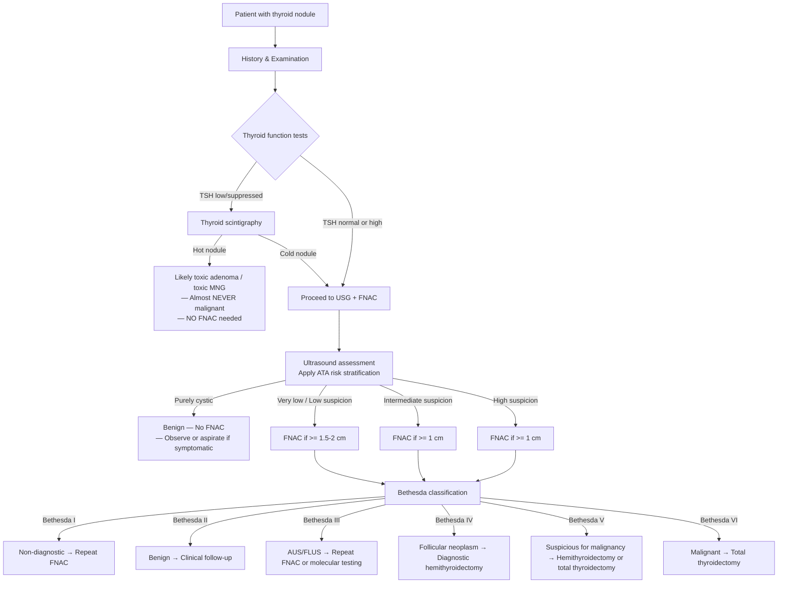
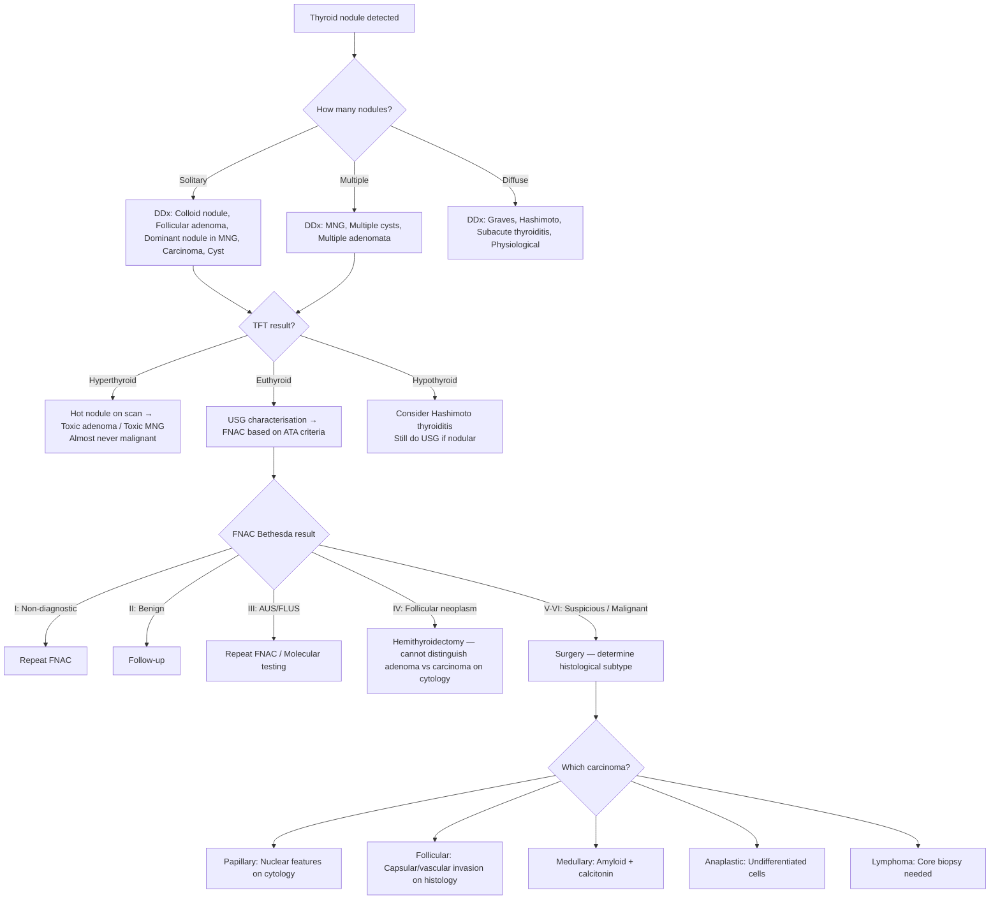

## Differential Diagnosis of Thyroid Cancer

### 10. Framing the Problem — Why Differential Diagnosis Matters

When a patient presents with a thyroid nodule (the most common presentation that leads to a diagnosis of thyroid cancer), the clinician's first job is **not** to jump to "cancer." The reality is that ***around 10-15% of thyroid nodules are malignant*** [6][5]. The vast majority (~85-90%) are benign. Your differential diagnosis therefore spans the entire spectrum of thyroid nodule pathology, from completely innocuous colloid cysts to lethal anaplastic carcinoma.

The differential also extends beyond intrinsic thyroid pathology — a "lump in the neck" may not even be thyroid in origin. A systematic approach, anchored in anatomy, thyroid functional status, and clinical features, is essential.

---

### 11. Differential Diagnosis of a Thyroid Nodule

#### 11.1 By Nodule Morphology (Solitary vs. Multiple vs. Diffuse)

This is the most practical clinical framework, because your first palpation finding immediately narrows the differential [6]:

| Presentation | Differential Diagnoses | Key Distinguishing Features |
|:---|:---|:---|
| ***Solitary nodule*** | ***Dominant nodule in MNG*** (the most common "solitary" nodule is actually a dominant nodule within a multinodular goitre) | Other nodules may be found on USG |
| | ***Cyst***: true simple cyst, colloid nodule | Purely cystic on USG; collapses with aspiration |
| | ***Neoplastic: adenoma*** (follicular adenoma — most common true solitary neoplasm), ***toxic adenoma*** | Hot on scintigraphy if toxic; suppresses surrounding tissue |
| | ***Carcinoma*** (papillary, follicular, medullary, anaplastic) | Hard, fixed, irregular; suspicious USG features |
| ***Multiple nodules*** | ***MNG*** (hyperplastic/adenomatous nodules with varying degree of cystic degeneration), ***toxic MNG*** | Most common cause of multinodular thyroid; may be euthyroid or hyperthyroid |
| | Multiple cysts | |
| | ***Neoplastic: multiple adenomata*** | Rare |
| ***Diffuse enlargement*** | ***Graves' disease*** | Hyperthyroid, TRAb positive, diffuse uptake on scintigraphy, bruit |
| | ***Physiological*** (pregnancy, puberty) | Context-dependent |
| | ***Hashimoto's thyroiditis*** | Hypothyroid (eventually), high anti-TPO/anti-TG |
| | ***De Quervain's / subacute thyroiditis*** | Painful, post-viral, raised ESR, suppressed uptake on scintigraphy |

[6]

#### 11.2 By Thyroid Functional Status

This is a powerful discriminator because it immediately tells you the underlying mechanism [6]:

| Thyroid Status | Likely Diagnoses | Why? |
|:---|:---|:---|
| **Hyperthyroid** | ***Toxic adenoma***, ***toxic MNG***, Graves' disease, subacute thyroiditis (transient), factitious thyrotoxicosis | Autonomous hormone production (adenoma/MNG), autoimmune stimulation (Graves'), destructive release (thyroiditis) |
| **Euthyroid** | Colloid nodule, follicular adenoma, MNG, **carcinoma** (most cancers are euthyroid), cyst | Most thyroid cancers do NOT alter thyroid function because the tumour mass is too small relative to normal thyroid tissue |
| **Hypothyroid** | Hashimoto's thyroiditis, late-stage thyroiditis, post-treatment | Autoimmune destruction of follicular cells |

<Callout title="Key Concept">
***Most thyroid cancers present as euthyroid.*** A normal TFT does NOT rule out malignancy — in fact, it is the expected finding. The one exception is a rare TSH-secreting pituitary adenoma driving thyroid cancer growth, which is vanishingly rare. Conversely, a ***hyperfunctioning ("hot") nodule is almost never malignant*** — it does NOT require FNAC [8][9].
</Callout>

#### 11.3 Pathology-Based Classification of Thyroid Nodule Differentials

***Thyroid nodule — pathology*** [5]:
- ***Nodular goitre: colloid / haemorrhagic cystic / complex / hyperplastic / adenomatous nodule (70%)***
- ***Benign follicular adenoma: mainly non-toxic (15%)***
- ***Well-differentiated thyroid carcinoma (10%)***
- ***Miscellaneous: other thyroid malignancies, thyroiditis (5%)***

This tells you the pre-test probability before any investigation: **70% of thyroid nodules are just nodular goitre**, 15% are benign adenomas, and only ~10% are well-differentiated carcinoma. The remaining 5% includes medullary carcinoma, lymphoma, anaplastic carcinoma, and thyroiditis masquerading as a nodule.

---

### 12. Differentiating Between Types of Thyroid Carcinoma

Once malignancy is suspected or confirmed, you need to determine *which type*, because this dictates management and prognosis entirely. The lecture slides emphasise the ***major histologic types*** [5]:

- ***Well-differentiated (90%)***
  - ***Papillary (90% of well-differentiated)***
  - ***Follicular (10% of well-differentiated)***
- ***Poorly differentiated (insular) ( < 5%)***
- ***Undifferentiated (anaplastic) ( < 5%)***
- ***Medullary carcinoma ( < 5%)***
- ***Others (1%): lymphoma, squamous cell carcinoma, sarcoma, metastasis*** [5]

| Feature | Papillary | Follicular | Medullary | Anaplastic | Lymphoma |
|:---|:---|:---|:---|:---|:---|
| **Age** | Young adult | Middle-aged | Sporadic > 50; Familial < 30 | ***Elderly*** | Elderly (60-70s) |
| **Speed of growth** | Slow | Slow-moderate | Moderate | ***Rapidly growing*** | Rapid |
| **Pain** | Usually painless | Usually painless | Usually painless | ***Painful*** | Usually painless |
| **HOV/Stridor** | Late (if ever) | Rare | Possible | ***Early and prominent*** | Possible (compression) |
| **Cervical LN** | Common (Level VI first) | Uncommon | Common | Common | Common (often bilateral) |
| **Distant mets at presentation** | Rare | More common (bone, lung) | Possible | ***Frequent*** | Rare |
| **Thyroid function** | Euthyroid | Euthyroid | Euthyroid | Euthyroid | Euthyroid (or hypothyroid if Hashimoto's background) |
| **Association** | Radiation, FAP | MNG, iodine deficiency | MEN2, RET | Previous differentiated CA | ***Hashimoto's thyroiditis*** |
| **USG appearance** | Solid hypoechoic, microcalcifications, irregular margins | Solid, iso/hypoechoic, well-defined, halo sign | Solid, hypoechoic, calcifications | Heterogeneous, invasive, poorly defined | Diffuse hypoechoic, pseudocystic |
| **FNAC** | Diagnostic (nuclear features) | Cannot distinguish from adenoma (Bethesda IV) | Diagnostic (amyloid + calcitonin stain) | Diagnostic (anaplastic cells) | ***Requires core biopsy*** (need tissue architecture for lymphoma subtyping) [3] |
| **Tumour marker** | Thyroglobulin | Thyroglobulin | ***Calcitonin***, ***CEA*** [5] | None | LDH, β2-microglobulin |
| **Scintigraphy** | Cold nodule | Cold nodule | Cold nodule | Cold nodule | N/A |

#### Specific Lecture Slide Points on MTC and Anaplastic Carcinoma

***Medullary thyroid carcinoma (MTC)*** [5]:
- ***Calcitonin (basal/stimulated) as marker***
- ***Total thyroidectomy***
- ***Central + lateral neck dissection***
- ***Familial cases (1/3)***: ***MEN IIA***, ***MEN IIB***, ***familial MTC***
- ***Genetic analysis: RET proto-oncogene***
- ***Prophylactic thyroidectomy (5-10 yrs)***

***Anaplastic carcinoma*** [5]:
- ***Elderly with poor co-morbid state***
- ***Aggressive and rapidly growing***
- ***Locally advanced disease***
- ***Frequent distant metastases***
- ***Lack of effective treatment***
- ***Chemoirradiation + resection + target Rx***
- ***Invariable palliative and fatal***

<Callout title="Anaplastic vs Lymphoma — The Two Rapidly Enlarging Thyroid Masses" type="error">
Both anaplastic carcinoma and primary thyroid lymphoma present as rapidly enlarging thyroid masses in elderly patients. The critical differentiator:
- **Anaplastic**: Rock-hard, fixed, often with voice change/stridor; FNAC shows anaplastic cells; universally fatal.
- **Lymphoma**: Firm but usually not rock-hard; associated with **Hashimoto's thyroiditis** (check anti-TPO antibodies); FNAC is insufficient — ***requires core biopsy*** for tissue architecture and immunohistochemistry [3]. Treatment is chemotherapy ± radiotherapy (NOT surgery primarily) — and prognosis is much better than anaplastic.

Getting this wrong has enormous management implications.
</Callout>

---

### 13. Differential Diagnosis of a Neck Lump (Beyond the Thyroid)

Not every anterior neck lump is thyroid. A structured anatomical approach is essential [10]:

| Location | Differential | Key Distinguishing Features |
|:---|:---|:---|
| ***Midline (Central)*** | ***Thyroid nodule (isthmus)***, ***Thyroglossal cyst***, ***Dermoid cyst***, Ranula, Level I lymph node | Thyroglossal cyst: moves on tongue protrusion (tongue tug test +ve); Thyroid: moves on swallowing |
| ***Anterior triangle*** | ***Thyroid nodule (lobe)***, Branchial cleft cyst, Carotid body tumour, Carotid artery aneurysm, Laryngocoele | Branchial cleft cyst: smooth, fluctuant, anterior to SCM, young adult; Carotid body tumour: pulsatile, bruit, mobile side-to-side but NOT up-down (Fontaine's sign) [10] |
| ***Posterior triangle*** | Level V lymph node, Cystic hygroma, Lipoma, Subclavian artery aneurysm | Cystic hygroma: transilluminates brilliantly; usually in children |
| **Any location** | ***Metastatic cervical lymphadenopathy*** (from H&N SCC, thyroid CA, lung, etc.), ***Lymphoma***, Reactive lymphadenopathy, Lipoma, Sebaceous cyst | Hard, fixed, non-tender nodes suggest metastatic carcinoma; Rubbery, matted nodes suggest lymphoma |

**Key manoeuvres to differentiate**:
- **Swallowing test**: Thyroid masses move with swallowing (pre-tracheal fascia attachment). Thyroglossal cysts also move with swallowing.
- **Tongue protrusion test**: Thyroglossal cysts move upward (attached to foramen caecum via thyroglossal duct). Thyroid masses do NOT.
- **Pulsatility**: Carotid body tumour, carotid aneurysm.

### 13.1 Metastatic Cancer to the Thyroid

Don't forget that a thyroid nodule can be a **metastasis** from another primary cancer [3]:
- ***Renal cell carcinoma (most common — MC)***
- ***Others: colorectal, lung, breast, uterine*** [3]

This should be considered when the FNAC shows atypical cells that don't match any primary thyroid cancer pattern, or when the patient has a known history of another malignancy.

---

### 14. Clinical Algorithm — Approach to Differential Diagnosis of a Thyroid Nodule

**Why this sequence?**
1. **TFT first** — if TSH is suppressed, you need a **thyroid scintigraphy** to determine if the nodule is "hot" (hyperfunctioning). A hot nodule has essentially zero malignancy risk, so you avoid unnecessary FNAC [8][9].
2. **USG next** — characterises the nodule and stratifies malignancy risk using sonographic pattern (the ATA system). This determines whether FNAC is indicated and at what size threshold [8][9].
3. **FNAC** — the definitive pre-operative tool for cytological diagnosis. Results are reported using the **Bethesda System**, which provides a standardised cancer risk and recommended management for each category [8][9].

<Callout title="Why Can't FNAC Diagnose Follicular Carcinoma?">
This is a critical concept that appears repeatedly in exams. FNAC samples individual cells (cytology) — it cannot assess the **architecture** of the tumour capsule. The defining feature of follicular carcinoma is ***capsular or vascular invasion***, which can only be appreciated on **histological examination of the excised specimen** [8][9]. Both follicular adenoma and follicular carcinoma look identical on cytology — both show follicular cells in microfollicular arrangements. Hence, Bethesda IV ("follicular neoplasm / suspicious for follicular neoplasm") mandates **diagnostic hemithyroidectomy** to get the whole capsule for histological assessment.

The same logic applies to Hürthle cell neoplasms — cytology cannot distinguish benign Hürthle cell adenoma from Hürthle cell carcinoma.
</Callout>

---

### 15. Distinguishing Benign from Malignant — Key Clinical and Sonographic Clues

#### 15.1 Clinical Red Flags for Malignancy

| Feature | Suggests Malignancy | Why? |
|:---|:---|:---|
| Rapid growth | Aggressive tumour (anaplastic, lymphoma) | High mitotic rate |
| Hard, fixed nodule | Extrathyroidal extension | Tumour invades through capsule into surrounding tissues |
| Hoarseness of voice | RLN invasion | Only cancer invades the nerve (benign nodules compress but don't invade) |
| Cervical lymphadenopathy | Lymphatic metastasis | Papillary and medullary CA spread to Level VI first |
| Male sex | Higher malignancy risk in males | Though more females get thyroid nodules, a nodule in a male is more likely malignant |
| Age extremes ( < 20 or > 60) | Higher risk | Thyroid nodules in children have ~25% malignancy rate |
| Prior radiation to H&N | Radiation-induced carcinogenesis | DNA damage → RET/PTC rearrangements |
| Family history (MEN2, FAP) | Inherited cancer syndromes | Germline mutations |

#### 15.2 Sonographic Features — The "SHIT CME" Mnemonic [6]

Sonographic features suspicious of malignancy — ***most important are solid and hypoechoic*** [6]:

| Letter | Feature | Pathological Basis |
|:---|:---|:---|
| **S** | ***Solid nodule*** | Cancers are cellular (solid tissue), not fluid-filled |
| **H** | ***Hypoechoic*** | Dense cellularity with less colloid → fewer acoustic interfaces → appears darker than surrounding thyroid |
| **I** | ***Irregular margin*** | Tumour infiltrates surrounding tissue without a smooth capsule |
| **T** | ***Taller than wide (AP > TS)*** | Tumour grows across tissue planes (perpendicular to the ultrasound beam), violating the normal horizontal growth pattern of benign nodules |
| **C** | ***Chaotic central vascularity*** | Tumour neoangiogenesis produces disorganised blood vessels centrally (benign nodules have orderly peripheral vascularity) |
| **M** | ***Microcalcifications*** | Psammoma bodies (in papillary CA) — concentric laminated calcifications from dystrophic calcification at tips of papillae |
| **E** | ***Extrathyroidal extension*** | Tumour breaches the thyroid capsule into surrounding structures |

[6]

Conversely, features suggesting **benignity**:
- ***Hyperechoic*** — reflects more acoustic interfaces (colloid-rich) [8]
- ***Spongiform appearance*** — multiple small cystic spaces separated by thin septae (like a sponge); almost always benign [8]
- ***Comet-tail shadowing*** — artefact from colloid crystals within a colloid nodule [8]
- ***Wider than tall*** — grows along tissue planes, respecting anatomical boundaries [8]
- ***Peripheral vascularity*** — normal capsular blood supply [8]
- ***Large coarse calcifications*** — dystrophic calcification in old, degenerated benign nodules (distinct from the fine microcalcifications of PTC) [8]

---

### 16. Special Differential Diagnosis Scenarios

#### 16.1 The "Incidentaloma"

With the ubiquitous use of CT, MRI, PET-CT, and carotid ultrasound, thyroid nodules are increasingly found **incidentally**. The approach is the same: assess with thyroid-specific USG → apply ATA risk stratification → FNAC if indicated.

**FDG-PET incidentaloma**: A thyroid nodule that is FDG-avid (takes up ¹⁸F-FDG on PET-CT) has a **~30-35% risk of malignancy** — this is high enough to warrant FNAC regardless of size.

#### 16.2 Thyroglossal Duct Cyst vs. Thyroid Nodule

| Feature | Thyroglossal Cyst | Thyroid Nodule |
|:---|:---|:---|
| Location | Midline, typically at hyoid level | Anterior neck, lateral to midline |
| Moves with swallowing | Yes | Yes |
| Moves with tongue protrusion | ***Yes*** | No |
| Usual age | Children / young adults | Any age |
| Malignant transformation | Rare (→ ***papillary carcinoma***) [6] | 10-15% |

#### 16.3 De Quervain's (Subacute) Thyroiditis vs. Anaplastic Carcinoma

Both can present with a **painful, tender thyroid**. Distinguishing features:

| Feature | De Quervain's Thyroiditis | Anaplastic Carcinoma |
|:---|:---|:---|
| Age | Any (post-viral) | Elderly ( > 60) |
| Onset | Acute/subacute (days-weeks) | Subacute (weeks) |
| Pain | Prominent, radiates to ear/jaw | Prominent, but with more mass effect |
| Thyroid function | Triphasic: thyrotoxicosis → hypothyroidism → euthyroid | Euthyroid |
| ESR | Markedly elevated | May be elevated |
| USG | Diffuse hypoechoic areas, no discrete mass | Heterogeneous mass, invasive |
| Scintigraphy | Globally suppressed uptake ("cold" entire gland) | Cold mass |
| FNAC | Granulomatous inflammation, giant cells | Undifferentiated anaplastic cells |
| Response to steroids | Dramatic improvement | No improvement |

#### 16.4 Hashimoto's Thyroiditis Mimicking Malignancy

Hashimoto's thyroiditis can cause a firm, lobulated thyroid that may raise suspicion for cancer. It can also coexist with papillary carcinoma (there is a debated increased risk). The key differentiator:
- Hashimoto's: diffuse, **anti-TPO and anti-TG antibodies** strongly positive, eventually hypothyroid.
- If a **discrete dominant nodule** exists within a Hashimoto's thyroid, it should still be evaluated with USG + FNAC — don't assume it's just thyroiditis.

> **High Yield**: Always remember that Hashimoto's thyroiditis is the main risk factor for ***primary thyroid lymphoma***. If a patient with known Hashimoto's develops a rapidly enlarging thyroid mass, think lymphoma and obtain a **core biopsy** [3].

---

### 17. Summary — Differential Diagnosis Decision Framework

---

<Callout title="High Yield Summary">

**Pre-test probability of malignancy in a thyroid nodule**: ~10-15%. Most nodules are benign (70% nodular goitre, 15% follicular adenoma).

**Functional status matters**: Hot nodules on scintigraphy are almost never malignant → no FNAC needed. Most thyroid cancers are euthyroid.

**USG risk stratification** determines need for FNAC: use "SHIT CME" mnemonic (Solid, Hypoechoic, Irregular margin, Taller than wide, Chaotic central vascularity, Microcalcifications, Extrathyroidal extension).

**FNAC is the key investigation**: Bethesda system guides management. But FNAC **cannot** distinguish follicular adenoma from carcinoma (both = Bethesda IV → hemithyroidectomy needed).

**Two rapidly enlarging thyroid masses in the elderly**: Anaplastic carcinoma (fatal, FNAC diagnostic) vs. Thyroid lymphoma (treatable, needs **core biopsy**, associated with Hashimoto's).

**Metastatic cancer to thyroid**: RCC is the most common primary.

**Medullary carcinoma**: Calcitonin as marker; 1/3 familial (MEN2, RET); always rule out phaeochromocytoma before surgery.

**Anaplastic carcinoma**: Invariably fatal; chemoirradiation + resection + targeted Rx; palliative.

</Callout>

---

<ActiveRecallQuiz
  title="Active Recall - Differential Diagnosis of Thyroid Cancer"
  items={[
    {
      question: "A 65-year-old woman with known Hashimoto's thyroiditis presents with a rapidly enlarging thyroid mass over 4 weeks. What are the two most important differential diagnoses, and how do you distinguish between them on investigation?",
      markscheme: "Anaplastic thyroid carcinoma vs Primary thyroid lymphoma. Both present as rapidly enlarging masses in elderly. Key differences: (1) Anaplastic = rock-hard, fixed, HOV/stridor, FNAC shows undifferentiated cells, universally fatal. (2) Lymphoma = firm, associated with Hashimoto's (anti-TPO +ve), requires CORE BIOPSY (not FNAC) for tissue architecture and immunohistochemistry, treatable with chemo +/- RT.",
    },
    {
      question: "Why does a hyperfunctioning ('hot') thyroid nodule on scintigraphy NOT require FNAC?",
      markscheme: "Hot nodules autonomously produce thyroid hormone (suppress surrounding tissue). They have an extremely low risk of malignancy (less than 1-2%). The autonomous function indicates benign pathology (toxic adenoma or dominant nodule in toxic MNG). Therefore FNAC is not indicated.",
    },
    {
      question: "List the 7 sonographic features suspicious for thyroid malignancy using the SHIT CME mnemonic, and explain why microcalcifications specifically suggest papillary carcinoma.",
      markscheme: "S = Solid nodule, H = Hypoechoic, I = Irregular margin, T = Taller than wide, C = Chaotic central vascularity, M = Microcalcifications, E = Extrathyroidal extension. Microcalcifications correspond to psammoma bodies, which are laminated concentric calcifications formed from dystrophic calcification at the tips of papillae in papillary thyroid carcinoma. They are pathognomonic for PTC.",
    },
    {
      question: "A thyroid nodule FNAC returns as Bethesda IV (follicular neoplasm). Why is hemithyroidectomy required rather than repeat FNAC or observation?",
      markscheme: "Bethesda IV means follicular neoplasm, which has 15-30% cancer risk. FNAC cannot distinguish follicular adenoma from follicular carcinoma because the diagnosis requires demonstration of capsular or vascular invasion on histological examination of the excised specimen. FNAC only samples cells (cytology), not architecture. Therefore diagnostic hemithyroidectomy is needed to examine the whole tumour capsule histologically.",
    },
    {
      question: "What is the most common primary cancer to metastasise to the thyroid gland?",
      markscheme: "Renal cell carcinoma (RCC). Other primaries include colorectal, lung, breast, and uterine cancers.",
    },
    {
      question: "Outline the pathological breakdown (by percentage) of thyroid nodules: what proportion are nodular goitre, benign adenoma, well-differentiated carcinoma, and miscellaneous?",
      markscheme: "Nodular goitre (colloid/haemorrhagic cystic/complex/hyperplastic/adenomatous) = 70%. Benign follicular adenoma = 15%. Well-differentiated thyroid carcinoma = 10%. Miscellaneous (other malignancies, thyroiditis) = 5%.",
    },
  ]}
/>

---

## References

[2] Senior notes: felixlai.md (Thyroid Cancer sections I-V)
[3] Senior notes: maxim.md (Thyroid Cancer overview, risk factors, metastatic thyroid cancer, clinical features)
[5] Lecture slides: GC 177. A thyroid nodule benign thyroid nodules; thyroid cancer.pdf (p5, p19, p27, p28)
[6] Senior notes: maxim.md (Approach to thyroid nodules — differential diagnosis, history, physical examination, USG features)
[8] Senior notes: felixlai.md (Diagnosis — USG features, sonographic criteria, FNAC, Bethesda classification)
[9] Senior notes: maxim.md (FNAC indications, Bethesda system, thyroid scan)
[10] Senior notes: felixlai.md (Neck lump differential — mass localisation table)
