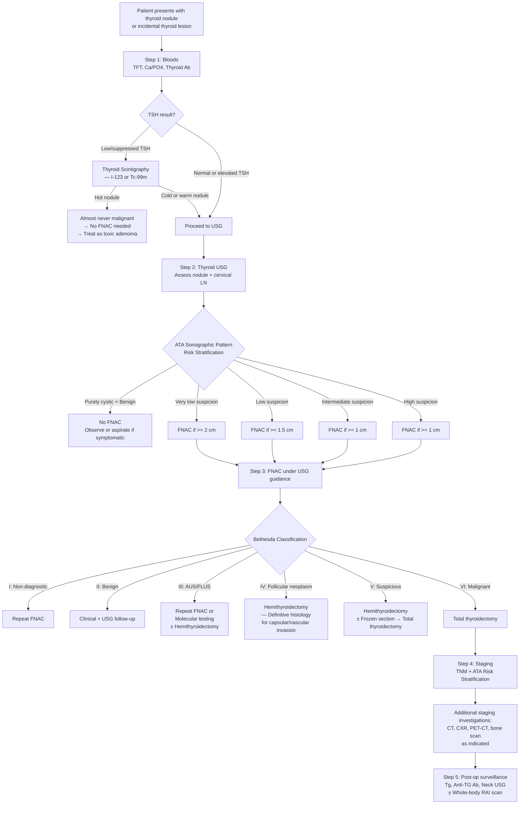

## Diagnosis of Thyroid Cancer — Diagnostic Criteria, Algorithm & Investigation Modalities

### 18. Overview — Diagnostic Philosophy

The diagnosis of thyroid cancer follows a **stepwise approach** that moves from simple, non-invasive, cheap investigations to more complex and invasive ones — but only as clinically indicated. The philosophy is:

1. **Screen functionally** (TFT) → is this nodule "hot" or "cold"?
2. **Characterise anatomically** (USG) → what does it look like? How suspicious?
3. **Sample cytologically** (FNAC) → what are the cells?
4. **Stage the disease** (CT, scintigraphy, PET) → how far has it spread?
5. **Confirm histologically** (thyroidectomy specimen) → what is the definitive diagnosis?

There is no single "diagnostic criterion" for thyroid cancer (unlike, say, the Jones Criteria for rheumatic fever). Diagnosis is a **composite** of clinical, sonographic, cytological, and ultimately histological findings. The Bethesda System for FNAC reporting is the closest thing to a standardised diagnostic classification.

---

### 19. Investigation Modalities — A Systematic Walkthrough

#### 19.1 Blood Tests

***Investigations — Blood tests: TSH + free T4*** [5][11].

These are the **first-line** investigations for any thyroid nodule. Here is every relevant blood test, with the rationale explained from first principles:

| Blood Test | Purpose | Interpretation | Why? |
|:---|:---|:---|:---|
| ***Thyroid function test (TFT): Serum TSH*** | ***TSH is the MOST sensitive indicator of thyroid function due to its short half-life*** [8] | Low TSH → possible toxic nodule → scintigraphy. Normal/high TSH → proceed to USG + FNAC | TSH is secreted in a pulsatile fashion and has a short t₁/₂ (~1 hour). The log-linear relationship between TSH and fT4 means even tiny changes in fT4 produce large TSH swings, making TSH the most sensitive detector of thyroid dysfunction |
| **Serum fT4 and fT3** | Confirm degree of thyroid dysfunction | Elevated → thyrotoxicosis; Low → hypothyroidism | We measure **free** (unbound) hormone because total T3/T4 are affected by binding protein changes (↑ TBG in pregnancy/OCP → falsely elevated total T4; ↓ TBG in androgens/hypoalbuminaemia → falsely low total T4) [8] |
| ***CBC with differentials*** | Baseline; screen for haematological abnormality | Anaemia of chronic disease (advanced malignancy); lymphocytosis (lymphoma) | General pre-operative workup |
| ***Serum Ca²⁺ and PO₄³⁻*** | Assess parathyroid function | ***Hypercalcaemia of malignancy*** or ***hypocalcaemia due to parathyroid compromise by tumour invasion*** [8] | Also critical as a **baseline** before thyroidectomy — post-op hypocalcaemia from parathyroid injury is the most common complication |
| ***Thyroid autoantibodies — Anti-thyroglobulin (TG) antibodies*** | ***Assess whether thyroglobulin can be used as a tumour marker for recurrence after total thyroidectomy*** [8] | If anti-TG antibodies are present, they interfere with Tg assays → Tg becomes unreliable as a tumour marker | ~25% of thyroid cancer patients have anti-TG antibodies. When present, a "low Tg" may be falsely reassuring. Serial anti-TG antibody titres can be used as a surrogate: rising titre suggests recurrence |
| **Anti-TPO antibodies** | Screen for Hashimoto's thyroiditis | High titres → Hashimoto's (risk factor for thyroid lymphoma) | |
| ***Serum thyroglobulin (Tg) level*** | ***Baseline tumour marker for differentiated thyroid carcinoma*** [8] | Elevated Tg post-total thyroidectomy + RAI = residual/recurrent disease | Thyroglobulin is produced **exclusively** by thyroid follicular cells. After total thyroidectomy, there should be no source of Tg. Any detectable Tg = residual thyroid tissue (benign remnant or recurrent cancer) |
| ***Serum calcitonin level*** | ***Baseline tumour marker; 95% of medullary thyroid carcinoma produces calcitonin*** [8] | Elevated calcitonin → strongly suggests MTC; ***metastatic if > 500 pg/mL*** [9] | Calcitonin is produced by parafollicular C cells. Not routinely measured for all thyroid nodules (controversial), but essential if MTC is suspected |
| ***Serum CEA level*** | ***Baseline tumour marker; 80% of medullary thyroid carcinoma produces CEA*** [8] | Rising CEA in MTC suggests de-differentiation and worse prognosis | CEA is a non-specific tumour marker but is useful for longitudinal monitoring in MTC |
| ***Genetic testing — RET mutation*** | ***All patients with MTC should be tested for RET mutation. Genetic counselling and testing of family members can be offered*** [8] | Positive germline RET mutation → familial MTC / MEN2 → screen for phaeochromocytoma and hyperparathyroidism; offer prophylactic thyroidectomy to mutation-positive family members | 25% of MTC is familial. Identifying the specific RET codon mutation determines the aggressiveness of the cancer and the timing of prophylactic surgery in relatives |
| ***ESR*** [5] | Selective: if thyroiditis suspected | Markedly elevated in De Quervain's thyroiditis | Helps differentiate painful thyroid conditions |

**Special pre-operative workup for MTC** [9]:
- ***Rule out familial disease (25%)***: ***Family history, 24-hour urine metanephrines*** (screen for phaeochromocytoma — must be excluded before ANY surgery), ***Ca and PTH*** (screen for hyperparathyroidism)
- ***Tumour markers: calcitonin, CEA***
- ***Workup for metastatic disease if calcitonin > 500: CT thorax + abdomen + pelvis and bone scan*** [9]

<Callout title="Why Must You Rule Out Phaeochromocytoma Before Thyroidectomy in MTC?">
MEN2A and MEN2B include phaeochromocytoma. During thyroidectomy, surgical manipulation and anaesthesia can trigger a **catecholamine crisis** from an undiagnosed phaeochromocytoma → life-threatening hypertensive emergency, arrhythmias, and cardiovascular collapse. Always check 24-hour urine metanephrines/catecholamines (or plasma metanephrines) before operating. If phaeochromocytoma is found, it must be resected FIRST, with adequate alpha-blockade (phenoxybenzamine), before thyroidectomy.
</Callout>

---

#### 19.2 Ultrasound (USG) of the Neck

***Ultrasonography (USG)*** [5][11]:
- ***B-mode real-time***
- ***Non-invasive, no radiation, convenient and cheap***
- ***Highly sensitive but relatively low specificity***
- ***Role*** [5][11]:
  - ***Extend physical examination***
  - ***Select nodules for FNAC***
  - ***Guide needle aspiration***
  - ***For all patients with goitre / palpable nodule***
  - ***Not recommended as a screening test*** (in asymptomatic population)

***USG is performed in all patients with a suspected thyroid nodule or nodular goitre on physical examination or incidental nodules on imaging studies*** [8].

##### What USG Tells You

| USG Assessment | Clinical Relevance |
|:---|:---|
| **Solid vs cystic** | Solid nodules have higher malignancy risk; purely cystic nodules are almost always benign ( < 1%) |
| **Solitary vs multiple** | Guides differential diagnosis |
| **Sonographic features of the nodule** | Risk stratification → determines need for FNAC |
| ***Detection of extrathyroidal invasion*** | ***Provides support for diagnosis of cancer*** [8] |
| ***Cervical lymph node assessment*** | ***Identify involvement of local and regional lymph nodes***, especially ***deep nodes (Level VI)*** that cannot be palpated clinically [8][9] |
| **Retrosternal extension** | Determines if CT is needed [9] |
| **Guide FNAC** | USG-guided FNAC is more accurate than palpation-guided |

##### Sonographic Features Suspicious of Malignancy — "SHIT CME" [9]

***Most important features are solid and hypoechoic*** [9]:

| Feature | Description | Pathological Basis |
|:---|:---|:---|
| ***S — Solid nodule*** | No cystic component | Malignant tumours are cellular, not fluid-filled |
| ***H — Hypoechoic*** | Darker than surrounding thyroid parenchyma | Dense cellularity with minimal colloid → fewer acoustic reflections |
| ***I — Irregular margin*** | Infiltrative, microlobulated borders | Tumour invades without respecting tissue planes |
| ***T — Taller than wide (AP > TS)*** | Anterior-posterior diameter exceeds transverse | Tumour transgresses normal tissue planes (benign nodules expand along the path of least resistance, i.e., horizontally) |
| ***C — Chaotic central vascularity*** | Disorganised blood flow centrally on Doppler | Tumour neoangiogenesis (VEGF-driven new vessels are tortuous and chaotic) |
| ***M — Microcalcifications*** | Tiny, bright, punctate echogenic foci without acoustic shadowing | Psammoma bodies (pathognomonic for papillary carcinoma) |
| ***E — Extrathyroidal extension*** | Tumour breaching the thyroid capsule | Direct invasion into surrounding structures |

##### Sonographic Features Suggesting Benignity

| Feature | Description | Why Benign? |
|:---|:---|:---|
| ***Hyperechoic*** | Brighter than surrounding thyroid | More colloid/interfaces → more reflections |
| ***Spongiform appearance*** | Multiple small cystic spaces ( > 50% of volume) separated by thin septae | Degeneration of benign nodular goitre |
| ***Comet-tail shadowing*** | Reverberation artefact behind bright foci | Colloid crystals within benign colloid nodules |
| ***Wider than tall*** | Horizontal orientation | Grows along tissue planes, respecting boundaries |
| ***Peripheral vascularity*** | Blood flow around the edge | Normal capsular supply, not neoangiogenesis |
| ***Large coarse calcifications*** | Thick, rim-like calcification | Dystrophic calcification in old degenerated nodules (NOT psammoma bodies) |
| ***Incomplete halo*** vs ***Complete halo*** | Thin sonolucent rim around nodule | Complete halo = compressed normal thyroid (benign); Incomplete/absent halo = suspicious |

[8][9]

##### Sonographic Features of Malignant Lymph Nodes [8]

***Sonographic features of malignant LN*** [8]:
- ***Large > 2 cm***
- ***Roundish (taller than wide)*** — normal LNs are oval/kidney-shaped
- ***Heterogeneous hypoechoic*** — tumour cells replacing normal lymphoid architecture
- ***Loss of central fatty hilum*** — the normal echogenic hilum is obliterated by tumour
- ***Presence of microcalcification*** — papillary carcinoma deposits psammoma bodies even in metastatic LN
- ***Presence of intranodal cystic or coagulative necrosis*** — tumour outgrows blood supply

##### ATA Sonographic Risk Stratification — Criteria for FNAC

***ATA guideline-based sonographic criteria for FNA*** [5][8][9]:

| Sonographic Pattern | Ultrasound Findings | Risk of Malignancy | ***FNA Size Cut-off*** |
|:---|:---|:---|:---|
| ***High suspicion*** | ***Solid hypoechoic nodule + ≥ 1 suspicious feature*** (microcalcifications, taller-than-wide, irregular margins, ETE, rim calcification with extrusive soft tissue) | ***≥ 70-90%*** | ***FNA if ≥ 1 cm*** |
| ***Intermediate suspicion*** | ***Hypoechoic solid nodule with smooth margins WITHOUT other suspicious features*** | ***10-20%*** | ***FNA if ≥ 1 cm*** |
| ***Low suspicion*** | ***Isoechoic or hyperechoic nodule*** OR ***partially cystic with eccentric solid areas WITHOUT microcalcifications, taller-than-wide, or ETE*** | ***5-10%*** | ***FNA if ≥ 1.5 cm*** |
| ***Very low suspicion*** | ***Spongiform nodules*** OR ***partially cystic WITHOUT features in high/intermediate/low patterns*** | ***< 3%*** | ***FNA if ≥ 2 cm (or observe)*** |
| ***Benign*** | ***Purely cystic nodules with no solid component*** | ***< 1%*** | ***NO FNA*** |

[5][8][9]

<Callout title="Exam Must-Know" type="idea">
The key principle: the more suspicious the ultrasound appearance, the SMALLER the nodule can be and still require FNAC. High suspicion → FNA at ≥ 1 cm. Very low suspicion → FNA only at ≥ 2 cm. Purely cystic → NO FNA at all. This is a risk-proportionate approach.
</Callout>

---

#### 19.3 Fine Needle Aspiration Cytology (FNAC)

***FNAC (+molecular testing)*** [5] is the **cornerstone investigation** for evaluating thyroid nodules.

***Core needle biopsy is NOT performed*** [8]:
- ***Leads to massive bleeding since thyroid is a very vascularised structure***
- ***FNAC is very accurate in identifying type of thyroid cancer***

The one exception: ***thyroid lymphoma requires core biopsy*** (FNAC cannot provide tissue architecture needed for lymphoma subtyping) [3].

***FNAC is diagnostic and therapeutic for thyroid cysts*** (aspiration collapses the cyst) [9].

##### Indications for FNAC [8]

- ***Sonographic criteria for FNA*** (as per ATA risk stratification table above)
- ***Hypofunctioning ("cold") nodules on thyroid scintigraphy***
- ***Dominant or atypical nodule in multinodular goitre***
- ***Nodules associated with abnormal lymph nodes***
- ***Complex or recurrent cystic nodules***

##### The Bethesda System for Reporting Thyroid Cytopathology

***Bethesda classification*** [5][8][9]:

| ***Class*** | ***Diagnostic Category*** | ***Risk of Malignancy (%)*** | ***Usual Management*** |
|:---|:---|:---|:---|
| ***I*** | ***Non-diagnostic*** | ***1-4%*** | ***Repeat FNA*** |
| ***II*** | ***Benign*** | ***0-3%*** | ***Clinical follow-up*** |
| ***III*** | ***Atypia of undetermined significance (AUS) OR Follicular lesion of undetermined significance (FLUS)*** | ***5-15% (updated: 6-18%)*** | ***Repeat FNA (low risk) vs hemithyroidectomy (high risk); molecular testing*** |
| ***IV*** | ***Follicular neoplasm / Hürthle cell neoplasm*** | ***15-30% (updated: 10-40%)*** | ***Surgical lobectomy (hemithyroidectomy)*** |
| ***V*** | ***Suspicious for malignancy*** | ***60-75% (updated: 45-60%)*** | ***Surgical lobectomy ± frozen section with total thyroidectomy*** |
| ***VI*** | ***Malignant*** | ***97-99% (updated: 94-96%)*** | ***Total thyroidectomy*** |

[5][8][9]

**Why are there two slightly different sets of numbers?** The original Bethesda 2009 system gave the first set of cancer risk percentages. The updated Bethesda 2023 (3rd edition) has refined these based on larger datasets and inclusion of non-invasive follicular thyroid neoplasm with papillary-like nuclear features (NIFTP), which is now considered non-malignant. The lecture slides [5] and senior notes [8][9] reflect slightly different editions but the management principles are the same.

##### Key Cytological Features by Tumour Type [8]

| Type | FNAC Appearance | Can FNAC Diagnose It? |
|:---|:---|:---|
| ***Papillary carcinoma*** | ***Papillary structures, psammoma bodies, Orphan Annie eye nuclei*** (ground-glass, "empty" nuclei), nuclear grooves, pseudo-inclusions | **YES** — diagnosed on nuclear features |
| ***Follicular carcinoma*** | ***Follicular structures similar to normal thyroid***; ***cannot differentiate follicular adenoma from carcinoma***; ***diagnosis relies on capsular or vascular invasion which is not appreciated on FNAC due to limited architectural information*** [8] | **NO** — needs hemithyroidectomy for histology |
| ***Medullary carcinoma*** | ***Distinctive deposits of acellular amyloid material*** due to altered calcitonin; ***multicentric C-cell hyperplasia in familial cases*** [8] | **YES** — amyloid + calcitonin immunostaining |
| ***Anaplastic carcinoma*** | ***Small blue round cells that are highly anaplastic*** [8] | **YES** — highly pleomorphic undifferentiated cells |

<Callout title="Common Exam Trap — Bethesda IV" type="error">
Bethesda IV ("follicular neoplasm") is the category that trips up students the most. Remember:
1. FNAC **cannot** distinguish follicular adenoma from follicular carcinoma (need capsular/vascular invasion on histology).
2. ***After resection, the majority turns out to be papillary carcinoma (with psammoma bodies)*** — the follicular variant of PTC is common and gets classified as Bethesda IV on cytology [9].
3. ***Hürthle cell neoplasm is not amenable to RAI*** → requires surgery regardless [9].
4. The management is **hemithyroidectomy** (not total), because most Bethesda IV lesions turn out to be benign.
</Callout>

##### Molecular Testing — An Evolving Field [5]

***Molecular testing*** can refine the diagnosis of indeterminate FNAC results (Bethesda III-IV) [5]:

| Test Type | Examples | Sensitivity/Specificity | Clinical Use |
|:---|:---|:---|:---|
| ***Somatic mutation panels*** | ***BRAF (40-64%)***, ***panel of mutations (Asuragen miRInform): 63-80%*** | ***Not sensitive but specific: high PPV (rule-IN test)*** | If mutation detected → high confidence it is cancer → proceed to surgery |
| ***Gene expression classifiers*** | ***ThyroSeq v3 multigene genomic classifier (DNA-RNA)***, ***Afirma genomic sequencing classifier (RNA)*** | ***Highly sensitive but not specific with high NPV (rule-OUT test)*** | ***For indeterminate (Bethesda III-IV: FLUS/FN) nodules*** → ***avoid diagnostic thyroidectomy in 50%*** |

[5]

The logic:
- **Rule-in tests** (high specificity/PPV, e.g., BRAF mutation): If positive → cancer is very likely → go to surgery.
- **Rule-out tests** (high sensitivity/NPV, e.g., Afirma GEC): If negative → cancer is very unlikely → can safely observe → avoids unnecessary thyroidectomy in ~50% of patients with indeterminate cytology.

> **High Yield**: ***BRAF V600E mutation*** is found in ***40-64%*** of papillary thyroid carcinomas. When detected on molecular testing, it has high PPV for malignancy.

---

#### 19.4 Thyroid Scintigraphy (Radionuclide Scan)

***Radio-isotope scintigraphy (I-123 or Tc-99m)*** [5][8]:
- ***Diagnosis of malignancy: low sensitivity and specificity*** — it is NOT a cancer test
- ***Functional assessment in thyrotoxic patients*** — this is its main role [5]

***NOT recommended for routine diagnostic use*** [8]. Indicated only when:
1. ***Patient has a thyroid nodule AND low/suppressed TSH*** → to determine if the nodule is autonomously functioning ("hot") [8]
2. ***Multinodular goitre*** → to determine functional status of individual nodules [8]

***NOT performed in euthyroid (normal TSH) or high TSH states*** — because the nodule will never be "hot" in these situations, and you will need USG ± FNAC regardless [8].

##### Interpretation of Scintigraphy

| Finding | Uptake Pattern | Malignancy Risk | Next Step |
|:---|:---|:---|:---|
| ***"Hot" (hyperfunctioning) nodule*** | ***Uptake greater than surrounding thyroid*** | ***Almost never malignant*** | ***Does NOT require FNAC*** → treat as toxic adenoma [8] |
| ***"Cold" (hypofunctioning) nodule*** | ***Uptake less than surrounding thyroid*** | ***10-20% risk of cancer*** | ***Requires FNAC*** (if sonographic criteria met) [8] |
| **"Warm" nodule** | Uptake similar to surrounding thyroid | Low risk | Evaluate sonographically |

**Why are hot nodules almost never malignant?** A hot nodule is autonomously producing thyroid hormone (it is a functional machine). Cancer cells, by contrast, tend to be poorly differentiated and lose their ability to concentrate iodine efficiently. An autonomously functioning nodule is almost always a benign toxic adenoma.

**Why are cold nodules suspicious?** Most thyroid cancers do NOT concentrate iodine well (the NIS is downregulated or the cells are de-differentiated), so they appear "cold" on scintigraphy. However, most cold nodules are still benign (colloid nodules, cysts) — only 10-20% are malignant.

---

#### 19.5 Cross-Sectional Imaging (CT, MRI)

***CT scan / MRI*** [5][9]:

These are **NOT routine** investigations for a straightforward thyroid nodule. They are indicated selectively:

1. ***Retrosternal goitre*** — ***cannot be visualised by USG*** (ultrasound cannot penetrate bone); CT delineates the extent of retrosternal extension, relationship to great vessels, and tracheal compression [9]
2. ***Locally advanced thyroid cancer / bulky lymphadenopathy*** — CT provides ***better delineation of important structures within cervical fascial planes*** (carotid artery, IJV, trachea, oesophagus) for surgical planning [9]
3. **Staging of advanced disease** — CT chest/abdomen/pelvis for distant metastases

<Callout title="CT Contrast and Thyroid Cancer" type="error">
Iodinated CT contrast contains a massive iodine load. This can **saturate the thyroid** and delay subsequent **radioactive iodine (RAI) therapy** by 6-8 weeks (the thyroid follicular cells are already loaded with "cold" iodine and cannot take up ¹³¹I). Therefore, if RAI therapy is planned in the near future, try to **avoid iodinated contrast** CT. If contrast CT is essential for staging, you must wait before administering RAI.
</Callout>

---

#### 19.6 Other Imaging Modalities

| Modality | Indication | Key Finding |
|:---|:---|:---|
| ***CXR*** | ***Tracheal deviation; mediastinal shadow for retrosternal extension; lung metastasis*** [8] | Retrosternal goitre appears as superior mediastinal widening; cannonball metastases (follicular CA) |
| ***CT thorax*** | ***Determine extent of retrosternal goitre or thyroid tumour; identify tumour invasion of great vessels and upper aerodigestive tract*** [8] | |
| ***PET-CT scan (¹⁸F-FDG)*** | ***Detect distant metastasis***; no routine diagnostic role [9] | FDG-avid thyroid incidentaloma has ~30-35% malignancy risk; also used for RAI-refractory disease surveillance |
| ***Bronchoscopy*** | ***Invasion into trachea*** [8] | Assess luminal involvement |
| ***OGD*** | ***Invasion into oesophagus*** [8] | |
| ***Skeletal X-ray / Bone scan*** | ***Detect bone metastasis (lytic lesions)*** — especially follicular carcinoma [8] | |
| ***CT / MRI brain, neck, chest, abdomen, pelvis*** | ***Identify distant metastasis*** [8] | Comprehensive staging in advanced disease |

[8]

---

#### 19.7 Investigations — Summary Table by Routine vs Selective [9]

| | ***Routine*** | ***Selective*** |
|:---|:---|:---|
| ***History + Physical exam*** | ✓ | |
| ***Thyroid function test*** | ✓ | |
| ***USG thyroid ± FNAC*** | ✓ | |
| ***Thyroid scan*** | ✗ | ***Only in toxic (suppressed TSH) + nodules*** |
| ***CT scan*** | ✗ | ***Only for (1) retrosternal goitre, (2) locally advanced thyroid cancer*** |
| ***PET scan*** | ✗ | ***No diagnostic role at all*** (only for staging/surveillance in specific contexts) |

[9]

---

### 20. Staging of Thyroid Cancer — AJCC 8th Edition / TNM Classification

Once thyroid cancer is confirmed, staging determines prognosis and guides management.

#### 20.1 T Staging [9][12]

| T Stage | Definition |
|:---|:---|
| ***T1a*** | ***Tumour ≤ 1 cm*** |
| ***T1b*** | ***1 cm < tumour ≤ 2 cm*** |
| ***T2*** | ***2 cm < tumour ≤ 4 cm*** |
| ***T3a*** | ***Tumour > 4 cm but limited to thyroid*** [12] |
| ***T3b*** | ***Tumour of any size with gross extrathyroidal extension invading only strap muscles (sternohyoid, sternothyroid, or omohyoid muscles)*** [12] |
| ***T4a*** | Tumour invades subcutaneous soft tissues, larynx, trachea, oesophagus, or RLN |
| ***T4b*** | Tumour invades prevertebral fascia or encases carotid artery or mediastinal vessels |

***The definition of T3 has been revised*** [12]: T3a is now purely size-based ( > 4 cm, intrathyroidal), and T3b is gross ETE into strap muscles only.

#### 20.2 N Staging [9]

| N Stage | Definition |
|:---|:---|
| ***N1a*** | ***Level VI / VII nodes*** (central compartment) |
| ***N1b*** | ***Level I-V nodes*** (lateral compartment) |

#### 20.3 Stage Grouping — Differentiated Thyroid Cancer (AJCC 8th Edition)

***The age threshold for staging has changed from 45 years to 55 years*** [12].

**Patients < 55 years old** — ***age-dependent staging*** [9][12]:

| Stage | Definition |
|:---|:---|
| ***Stage I*** | ***Any T, Any N, M0*** |
| ***Stage II*** | ***Any T, Any N, M1*** |

→ ***Patients < 55 can never be Stage III or IV*** [9]. This reflects the excellent prognosis of differentiated thyroid cancer in younger patients — even with extensive nodal disease, their outcomes are superb.

**Patients ≥ 55 years old** [12]:

| Stage | Definition |
|:---|:---|
| ***Stage I*** | ***T1a, T1b, T2, N0, M0*** |
| ***Stage II*** | ***T3, N0, M0*** OR ***T1-T3, N1, M0*** |
| ***Stage III*** | ***T4a, Any N, M0*** |
| ***Stage IVA*** | ***T4b, Any N, M0*** |
| ***Stage IVB*** | ***Any T, Any N, M1*** |

***Anaplastic thyroid carcinoma: automatically Stage IV*** [9] — regardless of T, N, or M status. This reflects its universally dismal prognosis.

<Callout title="Why Is Age So Important in Thyroid Cancer Staging?">
Young patients with differentiated thyroid cancer have an excellent prognosis even with advanced locoregional disease (nodal metastases, large tumours) — their 10-year survival approaches 98-99%. The AJCC staging system incorporates age because it is one of the strongest independent prognostic factors. A 25-year-old with T3N1bM0 papillary carcinoma is Stage I (not Stage II or III), reflecting the fact that this patient will almost certainly be cured.
</Callout>

---

#### 20.4 ATA Risk Stratification — For Post-Operative Management

This is separate from TNM staging and is used to guide the intensity of post-operative treatment (RAI ablation, TSH suppression, surveillance) [12]:

***2015 ATA Risk Stratification System*** [12]:

| Risk Level | Features | Clinical Implication |
|:---|:---|:---|
| ***ATA Low Risk*** | ***No local or distant metastases; all macroscopic tumour resected; no loco-regional invasion; no aggressive histology (tall cell, hobnail, columnar); no vascular invasion; clinical N0 or < 5 pathologic N1 micrometastases ( < 0.2 cm); intrathyroidal encapsulated follicular variant of PTC; intrathyroidal well-differentiated FTC with capsular invasion and no or minimal ( < 4 foci) vascular invasion; papillary microcarcinoma (uni- or multifocal) including BRAF V600E mutated*** | No TSH suppression needed; TSH target 0.5-2.0 mIU/L; RAI usually NOT required |
| ***ATA Intermediate Risk*** | ***Microscopic invasion into perithyroidal soft tissues; RAI-avid metastatic foci in neck on post-treatment WBS; aggressive histology; PTC with vascular invasion; clinical N1 or > 5 pathologic N1 with all involved LN < 3 cm; multifocal papillary microcarcinoma with ETE and BRAF V600E*** | Low TSH suppression (0.1-0.5 mIU/L); RAI ablation considered |
| ***ATA High Risk*** | ***Macroscopic invasion (gross ETE); incomplete tumour resection; distant metastases; postoperative Tg suggestive of distant mets; pathologic N1 with any LN > 3 cm; FTC with extensive vascular invasion ( > 4 foci)*** | High TSH suppression ( < 0.1 mIU/L); RAI ablation indicated |

[12]

---

### 21. Complete Diagnostic Algorithm — Mermaid Diagram

---

### 22. Approach to Multiple Nodules [9]

***Malignancy risk is much lower*** with multiple nodules compared to a solitary nodule [9].

- ***USG: assess each nodule separately***
- ***FNAC depends on USG result***:
  - ***If no suspicious nodules: FNA the largest nodule***
  - ***Any suspicious nodules: FNA ALL suspicious nodules*** [9]

---

### 23. Post-Operative Disease Monitoring (Surveillance Investigations)

After thyroidectomy for differentiated thyroid cancer, monitoring involves [9]:

| Investigation | Frequency | Target/Interpretation |
|:---|:---|:---|
| **Neck USG** | Every 6 months initially | Detect local recurrence, suspicious LN |
| **TSH and Thyroglobulin** | Every 3 months (on thyroxine suppression) | TSH: within target range for risk category; **Tg: should be undetectable after total thyroidectomy + RAI** |
| **Anti-TG antibodies** | With each Tg measurement | If positive, Tg is unreliable; use anti-TG Ab titre trend as surrogate |
| **Tg targets** | Post-total thyroidectomy: ***Tg < 0.2 ng/mL***; Post-hemithyroidectomy: ***Tg < 30 ng/mL*** [9] | Rising Tg or Tg above threshold → suspect recurrence |

<Callout title="Why Does Residual Thyroid Tissue Interfere with Monitoring?">
***Residual thyroid tissue is actually non-functional (requires T4 supplementation anyway), but it interferes with post-op thyroglobulin monitoring and also cannot rule out residual malignancy*** [9]. This is one of the rationale for **remnant ablation** with RAI: destroying all residual normal thyroid tissue makes Tg a more reliable tumour marker (any detectable Tg then definitively indicates recurrence).
</Callout>

---

### 24. Summary — Key Investigation Principles

| Principle | Explanation |
|:---|:---|
| **TFT first** | Identifies toxic nodules that don't need FNAC |
| **USG for all** | Extends examination; risk-stratifies; guides FNAC |
| **FNAC = cornerstone** | Bethesda system dictates management; but cannot diagnose follicular carcinoma |
| **Molecular testing for indeterminate** | Rule-in (BRAF, mutation panels) and rule-out (Afirma, ThyroSeq) tests for Bethesda III-IV |
| **Scintigraphy only if TSH is low** | Hot = benign; Cold = needs FNAC |
| **CT only for retrosternal or locally advanced** | Not routine |
| **PET has no diagnostic role** | Only for staging/surveillance |
| **Staging uses AJCC 8th edition** | Age < 55: max Stage II; Age ≥ 55: up to Stage IVB; Anaplastic = always Stage IV |

---

<Callout title="High Yield Summary">

**First-line investigations for ALL thyroid nodules**: TFT + thyroid USG ± FNAC.

**Scintigraphy**: Only when TSH is suppressed. Hot nodule = almost never cancer = no FNAC. Cold nodule = 10-20% cancer risk = needs FNAC.

**USG risk stratification (ATA system)**: Determines if and at what size FNAC is performed. SHIT CME mnemonic for suspicious features.

**FNAC + Bethesda System**: I = repeat; II = follow-up; III = repeat/molecular; IV = hemithyroidectomy (cannot distinguish adenoma from carcinoma); V = hemithyroidectomy ± frozen section → total; VI = total thyroidectomy.

**Molecular testing**: BRAF = rule-in (high PPV); Afirma/ThyroSeq = rule-out (high NPV); avoids unnecessary surgery in 50% of Bethesda III-IV.

**MTC workup**: Calcitonin, CEA, 24hr urine metanephrines (rule out phaeo), RET mutation, Ca/PTH.

**AJCC 8th edition staging**: Age < 55 → max Stage II even with extensive disease. Age ≥ 55 → up to IVB. Anaplastic = automatic Stage IV.

**ATA risk stratification**: Low/Intermediate/High → guides RAI ablation and TSH suppression target.

**Post-op monitoring**: Tg (must check anti-TG Ab first), neck USG, TSH.

</Callout>

---

<ActiveRecallQuiz
  title="Active Recall - Diagnosis of Thyroid Cancer"
  items={[
    {
      question: "List the routine investigations for ALL patients presenting with a thyroid nodule. Which investigations are only performed selectively and what are their specific indications?",
      markscheme: "Routine: (1) TFT, (2) Thyroid USG +/- FNAC. Selective: Thyroid scintigraphy — only when TSH is low/suppressed (to identify hot vs cold nodule). CT scan — only for retrosternal goitre or locally advanced thyroid cancer. PET scan — no diagnostic role at all.",
    },
    {
      question: "A patient has a Bethesda III (AUS/FLUS) result on thyroid FNAC. What are the management options and how can molecular testing help?",
      markscheme: "Options: (1) Repeat FNAC if low risk, (2) Hemithyroidectomy if high risk or persistently Class III on repeat. Molecular testing: Rule-in tests (BRAF mutation panel, high PPV) — if positive, confident it is cancer, proceed to surgery. Rule-out tests (Afirma GEC/ThyroSeq, high NPV) — if negative, cancer very unlikely, can safely observe. Avoids diagnostic thyroidectomy in approximately 50% of patients.",
    },
    {
      question: "Why must anti-thyroglobulin antibodies be measured alongside serum thyroglobulin when monitoring for recurrence of differentiated thyroid cancer?",
      markscheme: "Anti-TG antibodies interfere with thyroglobulin immunometric assays, causing falsely low Tg readings. If anti-TG Ab are present, a low Tg may be falsely reassuring and cannot be relied upon. In such cases, serial anti-TG Ab titres can be used as a surrogate marker — a rising titre suggests recurrence.",
    },
    {
      question: "A 30-year-old female has papillary thyroid cancer staged as T3N1bM0. What is her AJCC 8th edition stage and why?",
      markscheme: "Stage I. Under the AJCC 8th edition, patients aged less than 55 with differentiated thyroid cancer can only be Stage I (any T, any N, M0) or Stage II (any T, any N, M1). She is M0, therefore Stage I regardless of T3 and N1b disease. This reflects the excellent prognosis of differentiated thyroid cancer in young patients.",
    },
    {
      question: "Explain the difference between ATA risk stratification and AJCC TNM staging. What is each used for?",
      markscheme: "AJCC TNM staging predicts overall survival and is used for prognostication and communication. ATA risk stratification predicts risk of recurrence and is used to guide post-operative management intensity: specifically RAI ablation decisions and degree of TSH suppression. Low risk = no TSH suppression (0.5-2.0). Intermediate = low suppression (0.1-0.5). High = high suppression (less than 0.1).",
    },
    {
      question: "Why should iodinated CT contrast be avoided if radioactive iodine therapy is planned in the near future?",
      markscheme: "Iodinated contrast delivers a massive iodine load that saturates thyroid follicular cells (and residual cancer cells) with stable iodine. This competitively inhibits uptake of radioactive I-131, rendering RAI therapy ineffective. A washout period of 6-8 weeks is needed after contrast CT before RAI can be administered.",
    },
  ]}
/>

---

## References

[3] Senior notes: maxim.md (Thyroid cancer overview — lymphoma requires core biopsy)
[5] Lecture slides: GC 177. A thyroid nodule benign thyroid nodules; thyroid cancer.pdf (p5, p7, p8, p9, p10, p11, p12, p13)
[8] Senior notes: felixlai.md (Thyroid Cancer — Diagnosis sections VIII: biochemical tests, USG, FNAC, Bethesda, scintigraphy, CXR, CT, staging)
[9] Senior notes: maxim.md (Investigations, SHIT CME, FNAC indications, Bethesda system, staging, routine vs selective investigations, post-op monitoring)
[12] Lecture slides: Management of differentiated thyroid carcinoma.pdf (p11 — ATA risk stratification; p14 — AJCC 8th edition TNM)
