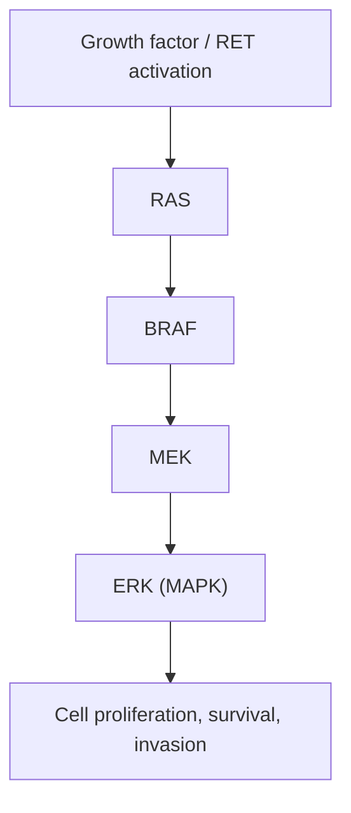

# Thyroid Cancer

## 1. Definition

Thyroid cancer refers to a group of malignant neoplasms arising from the thyroid gland. The vast majority originate from **thyroid follicular epithelial cells** (papillary, follicular, anaplastic), while a smaller proportion arise from **parafollicular C cells** (medullary carcinoma). The clinical behaviour ranges from indolent, well-differentiated tumours with excellent prognosis to rapidly lethal undifferentiated (anaplastic) carcinoma [1][2][3].

Breaking down the terminology:
- "Carcinoma" (Greek *karkinos* = crab) → a malignant tumour of epithelial origin.
- "Papillary" (Latin *papilla* = nipple) → finger-like projections on histology.
- "Follicular" (Latin *folliculus* = small sac) → resembles normal thyroid follicles.
- "Anaplastic" (Greek *ana-* = backward, *plasis* = formation) → loss of differentiation, i.e., the cells have "gone backwards" and no longer resemble their tissue of origin.
- "Medullary" (Latin *medulla* = marrow/core) → arises from the C cells within the thyroid parenchyma.

***Well differentiated thyroid carcinoma (WDTC)*** includes ***papillary thyroid carcinoma*** and ***follicular thyroid carcinoma***. Other histological types include ***medullary thyroid carcinoma***, ***poorly-differentiated thyroid carcinoma (insular)***, ***thyroid lymphoma***, and ***anaplastic thyroid carcinoma*** [4].

<Callout title="Key Concept">
The distinction between "differentiated" and "undifferentiated" is clinically critical because differentiated thyroid cancers (papillary, follicular) retain the ability to take up iodine and produce thyroglobulin — these properties are exploited for both treatment (radioactive iodine ablation) and surveillance (thyroglobulin monitoring). Anaplastic carcinoma loses these properties entirely.
</Callout>

---

## 2. Epidemiology

### 2.1 General Epidemiology

- **Most common endocrine malignancy** worldwide, accounting for ~1-3% of all cancers.
- ***M:F ratio ≈ 1:2*** — thyroid cancer is significantly more common in females, though ***male gender is associated with a worse prognosis*** [2].
- ***Age of presentation: typically 40-50s*** for differentiated thyroid cancer overall [2].
- Incidence has been rising globally over recent decades, largely attributed to **incidental detection** via widespread use of high-resolution ultrasound and cross-sectional imaging (so-called "over-diagnosis" of indolent papillary microcarcinomas), rather than a true increase in aggressive disease.

### 2.2 Hong Kong–Specific Epidemiology

- Thyroid cancer is among the **top 10 most common cancers** in Hong Kong women.
- The Hong Kong Cancer Registry data show a steady increase in incidence, predominantly driven by papillary carcinoma.
- Hong Kong is an **iodine-sufficient** region (due to iodised salt use and seafood consumption), so follicular carcinoma (which is more common in iodine-deficient areas) is relatively less frequent compared to papillary carcinoma.

### 2.3 Age Distribution by Subtype

| Subtype | Typical Age | Notes |
|:---|:---|:---|
| ***Papillary*** | ***Young adults (20-40s)*** | Most common subtype at any age |
| ***Follicular*** | ***Middle age (40-60)*** | |
| ***Anaplastic*** | ***Elderly ( > 60)*** | Often arises from pre-existing differentiated carcinoma |
| ***Medullary*** | ***Sporadic: > 50; Familial: < 30*** | Familial cases present earlier due to screening |

[2][3]

> **High Yield**: Thyroid cancer in a young patient is most likely papillary. In an elderly patient with a rapidly enlarging thyroid mass, think anaplastic carcinoma.

---

## 3. Risk Factors

### 3.1 Patient Factors

- ***Female gender*** — 2-3× higher incidence than males (likely related to oestrogen receptor expression on thyroid tissue, though the exact mechanism remains debated) [2][5].
- **Age extremes** — presentation in children or the elderly carries a worse prognosis.

### 3.2 Radiation Exposure

***Head and neck irradiation*** is one of the most well-established risk factors [2][5][6]:
- ***Brain irradiation for childhood leukaemia***
- ***Total body irradiation for bone marrow transplant***
- ***Exposure to environmental irradiation*** (e.g., Chernobyl disaster → dramatic increase in childhood papillary thyroid cancer)
- The thyroid gland in children is exquisitely radiosensitive. Ionising radiation causes **DNA double-strand breaks**, leading to chromosomal rearrangements (especially *RET/PTC* rearrangements) that drive papillary carcinoma.
- Latency period: typically **10-30 years** after exposure.

### 3.3 Family History and Genetic Syndromes

- ***Family history of thyroid cancer (first-degree relative)*** — 4-10× increased risk [2].
- ***Familial adenomatous polyposis (FAP) / Gardner's syndrome*** → associated specifically with ***papillary carcinoma*** (cribriform-morular variant) [2][5].
  - FAP is caused by mutations in the **APC** tumour suppressor gene on chromosome 5q21.
- ***Multiple Endocrine Neoplasia type 2 (MEN2)*** → associated with ***medullary thyroid carcinoma (MTC)*** [2].

#### MEN Syndromes — Summary Table

| Type | Defective Gene | Key Components |
|:---|:---|:---|
| ***MEN1*** | ***MEN1 encoding MENIN*** | ***Pancreatic endocrine tumour, Pituitary tumour (Prolactinoma), Parathyroid hyperplasia*** (mnemonic: **3 Ps**) |
| ***MEN2A*** | ***RET proto-oncogene*** | ***Medullary thyroid carcinoma, Phaeochromocytoma, Parathyroid hyperplasia*** |
| ***MEN2B*** | ***RET proto-oncogene*** | ***Medullary thyroid carcinoma, Phaeochromocytoma, Mucosal neuroma or intestinal ganglioneuroma*** |

[2]

<Callout title="MEN2 and Prophylactic Thyroidectomy" type="idea">
***Prophylactic total thyroidectomy is indicated for all patients with MEN2 since virtually all patients develop clinically apparent MTC*** [2]. The timing depends on the specific *RET* codon mutation — highest-risk mutations (e.g., codon 918 in MEN2B) warrant thyroidectomy within the first year of life; high-risk mutations (e.g., codon 634 in MEN2A) by age 5.
</Callout>

### 3.4 Other Risk Factors

- **Hashimoto's thyroiditis** → associated with **thyroid lymphoma** (NOT with papillary or follicular carcinoma directly, though the association with papillary is debated) [3].
- **Iodine deficiency** → associated with ***follicular carcinoma*** (iodine deficiency causes chronic TSH stimulation → follicular cell hyperplasia → increased risk of follicular neoplasia) [3].
- **Multinodular goitre** → risk factor for ***follicular carcinoma*** [2].

<Callout title="Common Exam Trap" type="error">
***Follicular adenoma is NOT a risk factor for follicular carcinoma*** [3]. These are distinct entities. Follicular adenoma does not "transform" into follicular carcinoma — they arise independently. This is a classic exam pitfall.
</Callout>

- **Pre-existing differentiated thyroid carcinoma** → risk factor for ***anaplastic carcinoma*** (anaplastic can arise *de novo* or from **de-differentiation** of a pre-existing papillary or follicular carcinoma) [3].

---

## 4. Anatomy and Function of the Thyroid Gland

### 4.1 Gross Anatomy

Understanding the anatomy is essential for appreciating the surgical complications and patterns of tumour spread.

- The thyroid gland is a butterfly-shaped endocrine organ located in the anterior neck, wrapped around the **trachea** at the level of **C5-T1 vertebrae**.
- Composed of two lateral **lobes** connected by an **isthmus** (overlies tracheal rings 2-4).
- A **pyramidal lobe** (vestige of the thyroglossal duct) is present in ~50% of individuals, ascending from the isthmus.
- ***Total thyroidectomy: resection of both lobes + isthmus + pyramidal lobe*** [3].

### 4.2 Blood Supply

- **Superior thyroid artery** — first branch of the **external carotid artery**.
- **Inferior thyroid artery** — branch of the **thyrocervical trunk** (from the subclavian artery).
- **Thyroid ima artery** — inconstant vessel arising directly from the brachiocephalic trunk or aortic arch (present in ~3-10%; important to know about as it can cause unexpected bleeding during surgery).
- Venous drainage: **superior and middle thyroid veins** → internal jugular vein; **inferior thyroid veins** → brachiocephalic veins.

### 4.3 Key Surgical Relations

#### Recurrent Laryngeal Nerve (RLN)

- The RLN innervates all **intrinsic muscles of the larynx** except the cricothyroid (which is innervated by the external branch of the superior laryngeal nerve).
- The RLN runs in the **tracheo-oesophageal groove** and enters the larynx posterior to the cricothyroid joint.
- **Right RLN** loops around the **right subclavian artery**; **Left RLN** loops around the **aortic arch** (hence the left RLN has a longer course and is more vulnerable to mediastinal pathology).
- **Non-recurrent laryngeal nerve** (rare, ~0.5-1% on the right side) — associated with an aberrant right subclavian artery (arteria lusoria). It takes a direct transverse course to the larynx and is at high risk of injury during surgery if not recognised.
- **Injury to RLN** → ***hoarseness of voice (HOV)*** (unilateral injury) or **airway obstruction/stridor** (bilateral injury).

#### Parathyroid Glands

- Typically **4 glands** (superior pair and inferior pair), located on the posterior surface of the thyroid.
- **Superior parathyroid glands** — derived from the **4th pharyngeal pouch** (more constant in position, found at the junction of the upper and middle thirds of the thyroid).
- **Inferior parathyroid glands** — derived from the **3rd pharyngeal pouch** (more variable in position, may be intrathymic).
- **Inadvertent removal or devascularisation** during thyroidectomy → ***hypoparathyroidism → hypocalcaemia*** (the most common complication of total thyroidectomy).

#### Cervical Lymph Node Compartments (Important for Cancer Staging)

| Level | Description | Relevance |
|:---|:---|:---|
| **I** | Submental / submandibular | Rarely involved in thyroid cancer |
| **II** | Upper jugular | Lateral neck metastasis |
| **III** | Mid-jugular | Lateral neck metastasis |
| **IV** | Lower jugular | Lateral neck metastasis |
| **V** | Posterior triangle | Lateral neck metastasis |
| ***VI (Central compartment)*** | Pre-tracheal, para-tracheal, pre-laryngeal (Delphian) | ***Primary lymphatic drainage of thyroid; first echelon nodes*** |
| **VII** | Superior mediastinal | Advanced disease |

- ***Papillary carcinoma characteristically spreads via lymphatics to Level VI (central compartment) nodes*** [3].

### 4.4 Histology and Cell Types

- **Follicular cells** — the majority of thyroid epithelial cells; arranged in follicles filled with colloid (thyroglobulin). Responsible for T3/T4 production. Give rise to papillary, follicular, and anaplastic carcinoma.
- **Parafollicular C cells** — derived from the **neural crest** (via the ultimobranchial body from the 4th/5th pharyngeal pouch). Scattered between follicles. Produce **calcitonin** (regulates calcium metabolism by inhibiting osteoclast activity). Give rise to **medullary thyroid carcinoma**.

### 4.5 Thyroid Physiology — Relevant to Cancer Management

- The **hypothalamic-pituitary-thyroid (HPT) axis**: TRH → TSH → T3/T4.
- ***Differentiated thyroid carcinoma expresses TSH receptors*** [2].
- ***Increased TSH is associated with increased thyroid cancer risk in patients with thyroid nodules*** [2].
- This has direct clinical implications:
  - ***T4 (levothyroxine) is required for suppression of TSH in patients with thyroid cancer*** — this deprives the tumour of its growth stimulus [2].
  - ***TSH-stimulated uptake of ¹³¹I therapy in residual tumour with residual expression of TSH receptors*** — when TSH is deliberately raised (by T4 withdrawal or recombinant TSH), residual cancer cells take up radioactive iodine more avidly, improving therapeutic efficacy [2].
- **Thyroglobulin (Tg)** — protein produced exclusively by thyroid follicular cells; used as a **tumour marker** post-thyroidectomy. Any detectable Tg after total thyroidectomy + RAI ablation suggests residual/recurrent disease.
- **Calcitonin** — tumour marker for **medullary thyroid carcinoma**.

---

## 5. Pathogenesis

### 5.1 TSH and Growth Factors

As discussed above, TSH is a key growth factor for differentiated thyroid cancer:
- ***TSH binds to TSH receptors on differentiated thyroid carcinoma cells***, activating intracellular signalling cascades (cAMP, PI3K/AKT) that promote cell proliferation [2].
- This is the basis for **TSH suppression therapy** with levothyroxine post-operatively.

### 5.2 Oncogenes and Tumour Suppressor Genes

***The Mitogen-Activated Protein Kinase (MAPK) pathway is critical to the development and progression of thyroid carcinoma*** [2].

Key mutations in the ***RET-RAS-BRAF signalling pathway*** [2]:

| Mutation | Subtype | Details |
|:---|:---|:---|
| ***BRAF V600E*** | ***Papillary carcinoma*** | Most common mutation in PTC (~45-60%); associated with aggressive behaviour, extrathyroidal extension, lymph node metastasis, RAI resistance |
| ***RET/PTC rearrangement*** | ***Papillary carcinoma*** | Common in radiation-induced PTC and childhood PTC |
| ***RET point mutation*** | ***Medullary carcinoma*** | Germline mutation → MEN2; somatic mutation → sporadic MTC |
| ***RAS mutation*** | ***Follicular carcinoma / Follicular variant PTC*** | Also found in follicular adenoma (hence FNAC cannot distinguish the two) |
| ***PAX8-PPARγ rearrangement*** | ***Follicular carcinoma*** | ~30-35% of follicular carcinomas |
| ***TP53 mutation*** | ***Anaplastic carcinoma*** | Loss of the "guardian of the genome" → de-differentiation; found in >50% of anaplastic carcinomas |
| ***TERT promoter mutation*** | ***Aggressive papillary / Anaplastic*** | Associated with tumour aggressiveness and mortality |

<Callout title="Why does anaplastic carcinoma arise from pre-existing differentiated cancer?">
The "multi-step carcinogenesis" model applies: a well-differentiated thyroid cancer (e.g., papillary) acquires additional mutations over time (especially *TP53*, *TERT promoter*), leading to progressive de-differentiation → poorly differentiated → anaplastic. This explains why anaplastic carcinoma often contains areas of well-differentiated carcinoma within the specimen, and why it tends to occur in older patients with a long-standing thyroid mass.
</Callout>

### 5.3 The Sodium-Iodide Symporter (NIS)

- NIS is a membrane protein on thyroid follicular cells that actively transports iodide into the cell.
- Well-differentiated thyroid cancers **retain NIS expression** → can concentrate radioactive iodine (¹³¹I) → basis for **radioactive iodine (RAI) therapy**.
- As cancers de-differentiate, they **lose NIS expression** → become **RAI-refractory** → much worse prognosis.

---

## 6. Classification

### 6.1 Histological Classification

***Primary thyroid carcinoma — histological types*** [4]:
- ***Well differentiated thyroid carcinoma (WDTC)***
  - ***Papillary thyroid carcinoma***
  - ***Follicular thyroid carcinoma***
- ***Medullary thyroid carcinoma***
- ***Poorly-differentiated thyroid carcinoma (Insular)***
- ***Thyroid lymphoma***
- ***Anaplastic thyroid carcinoma***

Other rarer types: **SCC**, **sarcoma**, **metastatic cancer** [3].

#### 6.1.1 Papillary Thyroid Carcinoma (PTC)

- ***80-90% of all thyroid cancers*** — the most common [2].
- Arises from follicular epithelial cells.
- **Key histological features** (these are pathognomonic):
  - ***Papillae*** — finger-like fibrovascular stalks lined by tumour cells.
  - ***Psammoma bodies*** — laminated, concentric calcifications (appear as **microcalcifications on ultrasound** — very specific for PTC). Why? Psammoma bodies form from dystrophic calcification of the tips of papillae — calcium precipitates in areas of cell death/necrosis within the papillary architecture.
  - ***Orphan Annie eyes (optically clear nuclei)*** — nuclei appear empty on H&E staining because chromatin is finely dispersed and pushed to the periphery. Also described as "ground glass" nuclei.
  - **Nuclear grooves** and **nuclear pseudo-inclusions** (cytoplasmic invaginations into the nucleus).

<Callout title="Diagnosis of PTC is Based on NUCLEAR Features, Not Architecture">
You can diagnose papillary carcinoma even in the absence of papillary architecture (e.g., the follicular variant of PTC) — it is the characteristic nuclear features (Orphan Annie eyes, grooves, pseudo-inclusions) that define the diagnosis. This is why FNAC can diagnose PTC: you can see these nuclear features on cytology.
</Callout>

**Variants of PTC** [2]:
| Variant | Significance |
|:---|:---|
| **Classical PTC** | Standard behaviour |
| **Follicular variant** | Encapsulated form has excellent prognosis |
| ***Tall cell variant*** | ***Aggressive form (~1%)***; taller cells with abundant cytoplasm |
| **Columnar cell variant** | Aggressive |
| **Diffuse sclerosing variant** | More common in children/young adults; diffuse involvement, extensive lymph node metastasis |
| **Cribriform-morular variant** | Associated with FAP |
| **Hobnail variant** | Aggressive, high mortality |
| Others: **Insular, solid/trabecular, clear cell, Hürthle/oxyphilic** | Variable |

- ***Multifocal*** — PTC is frequently multifocal within the thyroid (present in both lobes), unlike follicular carcinoma [2][3].
- ***Non-encapsulated*** — tends to infiltrate surrounding thyroid tissue [3].
- ***Spread primarily via lymphatics*** → ***to Level VI (central compartment) cervical lymph nodes*** [3].
- **Prognosis**: Excellent overall (> 95% 10-year survival for most subtypes).

#### 6.1.2 Follicular Thyroid Carcinoma (FTC)

- ***5-10% (some sources say 10-15%) of thyroid cancers*** [2][3].
- Arises from follicular epithelial cells.
- **Key histological features**:
  - ***Focal, encapsulated lesions*** [3] — in contrast to the multifocal, non-encapsulated nature of PTC.
  - Diagnosis requires demonstration of ***capsular invasion and/or vascular invasion*** — this is critical because it is the ONLY way to distinguish follicular carcinoma from follicular adenoma [3].
  - This is why **FNAC CANNOT diagnose follicular carcinoma** — cytology can only show "follicular neoplasm" (Bethesda IV); you need excision and histological examination of the capsule to determine invasion.

- ***Hürthle cell (oncocytic/oxyphilic) tumour***: a variant of follicular neoplasm with ***oxyphilic cells*** (abundant mitochondria, eosinophilic granular cytoplasm); ***worse prognosis*** than conventional FTC [3]. (Note: Hürthle cell adenomas are also rich in mitochondria — this is why they cause **false positives on Sestamibi scans** used for parathyroid localisation, as Sestamibi accumulates in mitochondria [7]).

- Risk factors: ***Multinodular goitre***, ***iodine deficiency*** [2][3].
- ***Spread primarily via haematogenous route*** → ***to bone and lungs*** [3] — in contrast to PTC's lymphatic spread. Why? FTC tends to invade blood vessels (vascular invasion is a diagnostic criterion), providing direct access to the systemic circulation.
- **NOT multifocal** [2].
- **Prognosis**: Good but slightly worse than PTC; depends on degree of invasion (minimally invasive vs. widely invasive).

<Callout title="Follicular Adenoma vs Follicular Carcinoma" type="error">
You CANNOT distinguish these on FNAC. Both appear as "follicular neoplasm." The distinction requires **histological examination of the entire tumour capsule** for evidence of capsular or vascular invasion. This is why Bethesda IV ("follicular neoplasm/suspicious for follicular neoplasm") requires diagnostic **hemithyroidectomy** for definitive diagnosis.
</Callout>

#### 6.1.3 Medullary Thyroid Carcinoma (MTC)

- ***< 10% (approximately 3%) of thyroid cancers*** [2][3].
- Arises from ***parafollicular C cells*** (neural crest-derived) → produces ***calcitonin*** [2].
- ***Neuroendocrine tumour*** [2].
- **Key histological features**:
  - ***Deposits of amyloid*** (***Congo red stain*** positive → apple-green birefringence under polarised light) [3]. Why amyloid? Calcitonin misfolds and aggregates into amyloid fibrils within the tumour stroma.
  - Cells are spindle-shaped or polygonal with neuroendocrine granules.
- **Genetic basis**:
  - ***75% sporadic*** [3].
  - ***25% familial (genetic)*** — ***RET oncogene*** germline mutations [3]:
    - ***Familial MTC*** (FMTC)
    - ***MEN2A*** (MTC + Phaeochromocytoma + Parathyroid hyperplasia)
    - ***MEN2B*** (MTC + Phaeochromocytoma + Mucosal neuromas/marfanoid habitus)
  - ***Familial cases present at < 30 years; sporadic cases > 50 years*** [3].
- ***Spread primarily via lymphatics*** [3].
- **Tumour markers**: ***Calcitonin*** (primary marker) and ***CEA*** (carcinoembryonic antigen; rising CEA suggests de-differentiation and worse prognosis).
- **Does NOT take up radioactive iodine** (C cells do not have NIS) → RAI therapy is not effective.
- **Clinical pearl**: Before thyroidectomy for MTC, **always rule out phaeochromocytoma** (measure plasma/urine metanephrines) — operating on an undiagnosed phaeochromocytoma can cause fatal hypertensive crisis.

#### 6.1.4 Anaplastic (Undifferentiated) Thyroid Carcinoma

- ***5-10% (some sources say ~1%) of thyroid cancers*** [2][3].
- ***Undifferentiated follicular cells*** [3].
- ***Can arise de novo or from de-differentiation of papillary/follicular carcinoma*** [3].
- **Key histological features**:
  - ***Small blue round cells*** [3] (though can also show spindle cell or giant cell morphology).
  - High mitotic rate, extensive necrosis.
- ***Most aggressive thyroid cancer*** — ***very poor prognosis: seldom survive > 6 months*** [3].
- Typically presents in ***elderly patients ( > 60 years)*** with a ***rapidly enlarging thyroid mass***.
- ***Spread via both lymphatics and haematogenous routes*** [3].
- Does NOT take up radioactive iodine (lost differentiation → lost NIS).
- Does NOT respond meaningfully to TSH suppression (lost TSH receptor expression).
- ***Risk factor: previous differentiated thyroid carcinoma*** [2].

#### 6.1.5 Other Types

- ***Thyroid lymphoma*** — usually **primary B-cell non-Hodgkin lymphoma (DLBCL or MALT lymphoma)**; strongly associated with ***Hashimoto's thyroiditis*** (chronic lymphocytic inflammation → increased risk of lymphoid malignancy). Requires **core biopsy** (not FNAC) for diagnosis because you need tissue architecture [3][4].
- **Metastatic cancer to thyroid** — ***renal cell carcinoma is the most common*** (MC); others include colorectal, lung, breast, uterine cancers [3].

### 6.2 Comprehensive Comparison Table

| Feature | Papillary | Follicular | Medullary | Anaplastic |
|:---|:---|:---|:---|:---|
| **% of cases** | ***85-90%*** | ***5-15%*** | ***~3-5%*** | ***~1-5%*** |
| **Cell of origin** | Follicular epithelium | Follicular epithelium | ***Parafollicular C cells*** | Follicular epithelium (undifferentiated) |
| **Differentiation** | ***Well differentiated*** | ***Well differentiated*** | N/A (neuroendocrine) | ***Undifferentiated*** |
| **Age** | ***Young adults*** | ***Middle age (40-60)*** | ***Sporadic > 50; Familial < 30*** | ***Old > 60*** |
| **Sex (M:F)** | 1:2.5 | 1:3 | 1:1 | 2:3 |
| **Risk factors** | ***Radiation, FAP/Gardner's*** | ***MNG, iodine deficiency*** | ***MEN2, RET mutation*** | ***Previous differentiated CA*** |
| **Histology** | ***Papillae, psammoma bodies, Orphan Annie nuclei*** | ***Capsular/vascular invasion, encapsulated*** | ***Amyloid deposits (Congo red)*** | ***Small blue round cells*** |
| **Multifocality** | ***Yes*** | ***No*** | Variable | N/A |
| **Capsule** | ***Non-encapsulated*** | ***Encapsulated*** | Variable | N/A |
| **Route of spread** | ***Lymphatics (Level VI)*** | ***Haematogenous (bone, lung)*** | ***Lymphatics*** | ***Both*** |
| **RAI uptake** | Yes | Yes | **No** | **No** |
| **Tumour marker** | Thyroglobulin | Thyroglobulin | ***Calcitonin, CEA*** | None reliable |
| **Clinical course** | ***Slow growth*** | ***Less aggressive*** | ***Aggressive*** | ***Very aggressive ( < 6 months survival)*** |
| **Key mutation** | BRAF V600E, RET/PTC | RAS, PAX8-PPARγ | RET | TP53, TERT |

[2][3][4]

---

## 7. Clinical Features

### 7.1 Approach to Presentation

Most thyroid cancers present as an **asymptomatic thyroid nodule** discovered either by the patient or incidentally on imaging. The key clinical task is to differentiate benign nodules (~85-90%) from malignant ones (~10-15%) [6].

***Around 10-15% of thyroid nodules are malignant*** [6].

### 7.2 Symptoms

| Symptom | Pathophysiological Basis |
|:---|:---|
| ***Palpable neck lump*** | Tumour mass within the thyroid gland. Most thyroid cancers are painless. Patients may notice a lump incidentally or it may be found by a doctor on routine examination. |
| ***Rapidly enlarging lump*** | Suggests aggressive histology (***anaplastic carcinoma***) or haemorrhage into a cyst. Rapid growth = high mitotic rate outstripping blood supply. |
| ***Pain*** | Uncommon in thyroid cancer. When present, think of: ***haemorrhagic cyst, thyroiditis, or anaplastic carcinoma*** [6]. Anaplastic carcinoma invades surrounding tissues and nerves, causing pain. |
| ***Hoarseness of voice (HOV)*** | Invasion or compression of the ***recurrent laryngeal nerve*** by tumour → unilateral vocal cord paralysis → inability to adduct the vocal cord → breathy, hoarse voice. This is a **red flag** for malignancy. |
| ***Dysphagia*** | Compression or invasion of the ***oesophagus*** by a large thyroid mass or lymph node metastasis. |
| ***Stridor / dyspnoea*** | Compression or invasion of the ***trachea*** → narrowing of the airway. Stridor (high-pitched inspiratory sound) indicates significant airway compromise — a surgical emergency in the context of anaplastic carcinoma. |
| **Neck lymphadenopathy** (patient notices lumps in the neck) | Metastatic spread to cervical lymph nodes, especially Level VI (central compartment) for PTC. |
| **Constitutional symptoms** (rare in differentiated CA) | Weight loss, fatigue — more common in anaplastic carcinoma or lymphoma. |
| **Bone pain, pathological fracture** | Haematogenous metastasis to bone (especially follicular carcinoma). |
| **Persistent cough / haemoptysis** | Pulmonary metastasis (especially follicular carcinoma). |
| **Diarrhoea** (in MTC) | Calcitonin has secretory effects on the gut → watery diarrhoea. This can be a presenting symptom of MTC. |
| **Flushing** (in MTC) | MTC can secrete vasoactive peptides (calcitonin, prostaglandins) → vasodilation → flushing. |

<Callout title="Red Flag Symptoms in a Thyroid Nodule">
The following symptoms suggest malignancy and warrant urgent investigation:
1. Rapid growth of a thyroid nodule
2. Hoarseness of voice (RLN invasion)
3. Dysphagia / stridor (compression/invasion)
4. Fixed, hard nodule
5. Cervical lymphadenopathy
</Callout>

### 7.3 Signs

#### On Inspection
| Sign | Pathophysiological Basis |
|:---|:---|
| **Visible neck mass** | Thyroid nodule or diffuse goitre visible on inspection. Ask the patient to swallow — a thyroid mass moves with swallowing (because the thyroid is invested by the pre-tracheal fascia, which is attached to the larynx). |
| ***Surgical scar*** | Previous thyroid surgery. |
| ***Swallowing test positive*** | Mass moves with swallowing → thyroid origin (attached to pre-tracheal fascia). If it does NOT move with swallowing, consider non-thyroid origin or fixation to surrounding structures by malignant invasion. |
| ***Tongue protrusion test (tongue tug test)*** | A thyroglossal cyst moves upward on tongue protrusion (attached to the foramen caecum via the thyroglossal duct). A thyroid mass does NOT move on tongue protrusion. |
| **Voice changes** | Hoarse or breathy voice audible during conversation — suggests RLN involvement. |

#### On Palpation [6]

| Sign | Pathophysiological Basis |
|:---|:---|
| ***Solitary nodule vs dominant nodule in MNG vs diffuse goitre*** | Determines the differential diagnosis. A solitary hard nodule is more suspicious for cancer than a dominant nodule in MNG. |
| **Size** | Large nodules ( > 4 cm) have a higher risk of malignancy. |
| **Consistency — hard, firm, or soft** | A **hard, stony** consistency suggests malignancy (due to dense fibrous stroma, calcification [psammoma bodies], or anaplastic tissue). Benign nodules are usually soft or rubbery. |
| **Fixation** | A nodule that is **fixed to surrounding structures** (trachea, strap muscles, carotid sheath) indicates **extrathyroidal extension** — a hallmark of advanced malignancy. |
| ***Lower border palpable / retrosternal extension*** | If you cannot palpate the lower border, consider **retrosternal goitre** (the thyroid extends behind the sternum into the thoracic inlet). |
| ***Cervical lymphadenopathy*** | Palpate all cervical lymph node levels. Hard, matted, fixed lymph nodes suggest metastatic cancer. Level VI (central compartment) nodes are difficult to palpate clinically. |
| ***Tracheal deviation*** | Large thyroid masses can push the trachea to the contralateral side. Palpate for tracheal position. |

#### General Examination [6]

| Sign | Purpose |
|:---|:---|
| ***Eyes*** — lid retraction, exophthalmos, chemosis, proptosis, lid lag, ophthalmoplegia | Assess for **Graves' disease** (which causes diffuse goitre and thyrotoxicosis, an important differential). |
| ***Hands*** — tremor, sweating, tachycardia | Assess **thyroid status** — thyrotoxicosis features (though thyroid cancer is usually euthyroid). |
| ***Lower limbs*** — proximal muscle weakness, pretibial myxoedema | Thyrotoxicosis or hypothyroidism features. |
| **Pemberton's sign** | Ask the patient to raise both arms above the head for 1-2 minutes. If the face becomes plethoric (red/congested), JVP rises, and stridor develops → positive Pemberton's sign → indicates **thoracic inlet obstruction** by retrosternal goitre. |

### 7.4 Clinical Features by Tumour Type

| Feature | Papillary | Follicular | Medullary | Anaplastic |
|:---|:---|:---|:---|:---|
| **Typical presentation** | Painless thyroid nodule ± cervical lymphadenopathy in a young woman | Painless thyroid nodule, often in setting of MNG | Thyroid nodule ± cervical lymphadenopathy ± diarrhoea/flushing | Rapidly enlarging, painful, hard thyroid mass in elderly with HOV/stridor |
| **Growth rate** | Slow | Slow-moderate | Moderate | ***Rapid*** |
| **Nodule consistency** | Firm | Firm-hard | Firm-hard | ***Rock-hard, fixed*** |
| **Cervical LN involvement** | ***Common (early)*** | Uncommon | Common | Common |
| **Distant metastasis at presentation** | Uncommon | More common (lung, bone) | Less common | Common (already advanced) |

---

## 8. History Taking — Clinical Approach to a Thyroid Nodule (Focused on Cancer Detection)

When a patient presents with a thyroid nodule, the history should systematically assess [6]:

1. **Neck lump characteristics**:
   - ***Number*** — solitary vs. multiple
   - ***Onset and progression*** — how long? Growing? How fast?
   - ***Pain*** — (***haemorrhagic cyst, thyroiditis, anaplastic carcinoma***) [6]

2. ***Compression symptoms***: ***dysphagia, SOB (stridor), HOV*** [6]

3. ***Thyroid status***: symptoms of hyperthyroidism (weight loss, tremor, palpitations, heat intolerance, diarrhoea) or hypothyroidism (weight gain, cold intolerance, constipation, fatigue).

4. ***Risk factors for cancer*** [6]:
   - ***Prior neck irradiation***
   - ***Family history of thyroid cancer: MEN2, FAP***
   - Age extremes (children, elderly)
   - Male gender

5. **Systemic symptoms**: weight loss, bone pain, cough (suggest metastatic disease).

---

## 9. Physical Examination — Systematic Thyroid Examination

### Step-by-Step Approach [6]:

1. **Inspection**:
   - ***Surgical scar*** (previous thyroid surgery)
   - ***Swallowing test*** (mass moves with swallowing → thyroid origin)
   - ***Tongue tug test*** (thyroglossal cyst moves upward with tongue protrusion)
   - Voice quality

2. **Palpation** (from behind the patient):
   - ***Diffuse vs solitary nodule vs MNG vs dominant nodule in MNG***
   - ***Size***
   - ***Consistency*** (soft/firm/hard)
   - ***Location*** (lobe, isthmus)
   - ***Lower border*** palpable? (retrosternal extension?)
   - ***Cervical lymph nodes*** (all levels)
   - ***Trachea*** (midline or deviated?)

3. **Percussion**: Over the manubrium — dullness suggests retrosternal extension.

4. **Auscultation**: Bruit over the thyroid → increased vascularity (Graves' disease).

5. **General examination** [6]:
   - ***Eyes*** (lid retraction, exophthalmos, chemosis, proptosis, lid lag, ophthalmoplegia)
   - ***Hands*** (tremor, sweating, tachycardia)
   - ***Lower limbs*** (proximal muscle weakness, pretibial myxoedema)

---

<Callout title="High Yield Summary">

**Definition**: Thyroid cancer = malignant neoplasms of the thyroid, most commonly from follicular epithelium (papillary > follicular > anaplastic) or C cells (medullary).

**Epidemiology**: Most common endocrine malignancy. F > M (2:1). PTC peaks in young adults; FTC in middle age; anaplastic in elderly.

**Key Risk Factors**: Radiation exposure (childhood), family history (MEN2 → MTC, FAP → PTC), female sex, iodine deficiency (→ FTC), Hashimoto's (→ lymphoma).

**Pathogenesis**: MAPK pathway (RET-RAS-BRAF) is central. BRAF V600E = most common mutation in PTC. TP53 loss = anaplastic. TSH is a growth factor for differentiated CA.

**Histology Pearls**:
- PTC: Papillae, psammoma bodies, Orphan Annie nuclei (diagnosis = nuclear features)
- FTC: Capsular/vascular invasion (FNAC cannot distinguish from adenoma)
- MTC: Amyloid (Congo red), calcitonin
- Anaplastic: Small blue round cells, undifferentiated

**Spread Patterns**:
- PTC → lymphatics (Level VI)
- FTC → haematogenous (bone, lung)
- MTC → lymphatics
- Anaplastic → both

**Clinical Features**: Usually painless thyroid nodule. Red flags = rapid growth, HOV, dysphagia, stridor, fixed hard mass, cervical LN.

**Follicular adenoma ≠ risk factor for follicular carcinoma** (classic exam trap).

**MEN2 → prophylactic total thyroidectomy** for all confirmed RET carriers.

</Callout>

---

<ActiveRecallQuiz
  title="Active Recall - Thyroid Cancer (Definition to Clinical Features)"
  items={[
    {
      question: "What is the most common mutation in papillary thyroid carcinoma and what clinical significance does it carry?",
      markscheme: "BRAF V600E mutation. Found in 45-60% of PTC. Associated with aggressive behaviour, extrathyroidal extension, lymph node metastasis, and radioactive iodine resistance.",
    },
    {
      question: "Why can FNAC not distinguish follicular carcinoma from follicular adenoma? What investigation is required instead?",
      markscheme: "FNAC only provides cytology (individual cells); it cannot assess the tumour capsule. Diagnosis of follicular carcinoma requires demonstration of capsular or vascular invasion on histological examination of the excised specimen. Diagnostic hemithyroidectomy is required.",
    },
    {
      question: "A patient with MEN2A is found to have a thyroid nodule. What three conditions should you screen for, and why must you rule out phaeochromocytoma before thyroidectomy?",
      markscheme: "MEN2A = Medullary thyroid carcinoma + Phaeochromocytoma + Parathyroid hyperplasia. Must rule out phaeochromocytoma (via plasma/urine metanephrines) before surgery because operating on undiagnosed phaeochromocytoma can cause fatal hypertensive crisis from catecholamine surge.",
    },
    {
      question: "Explain why follicular thyroid carcinoma metastasises to bone and lungs while papillary carcinoma metastasises to cervical lymph nodes.",
      markscheme: "FTC is characterised by vascular invasion (a diagnostic criterion) which provides direct access to systemic circulation, hence haematogenous spread to bone and lungs. PTC spreads via lymphatics because it infiltrates lymphatic channels, draining first to Level VI central compartment nodes.",
    },
    {
      question: "Why is TSH suppression with levothyroxine used in post-operative management of differentiated thyroid cancer? What is the risk of over-suppression?",
      markscheme: "Differentiated thyroid carcinoma expresses TSH receptors; TSH acts as a growth factor. Levothyroxine suppresses TSH via negative feedback, depriving tumour cells of growth stimulus. Over-suppression (TSH < 0.1) risks subclinical thyrotoxicosis causing atrial fibrillation and osteoporosis.",
    },
    {
      question: "Name the histological hallmark of medullary thyroid carcinoma and explain why it occurs.",
      markscheme: "Amyloid deposits (positive on Congo red stain with apple-green birefringence under polarised light). Occurs because calcitonin produced by the tumour misfolds and aggregates into amyloid fibrils within the tumour stroma.",
    },
  ]}
/>

---

## References

[1] General medical knowledge / UpToDate / Harrison's Principles of Internal Medicine
[2] Senior notes: felixlai.md (Thyroid Cancer sections I-V)
[3] Senior notes: maxim.md (Thyroid Cancer overview, risk factors, clinical features)
[4] Lecture slides: Management of differentiated thyroid carcinoma.pdf (p6 — histological types)
[5] Lecture slides: GC 177. A thyroid nodule benign thyroid nodules; thyroid cancer.pdf
[6] Senior notes: maxim.md (Approach to thyroid nodules — history, physical examination)
[7] Senior notes: maxim.md (Primary hyperparathyroidism — Sestamibi scan / Hürthle cell false positive)
