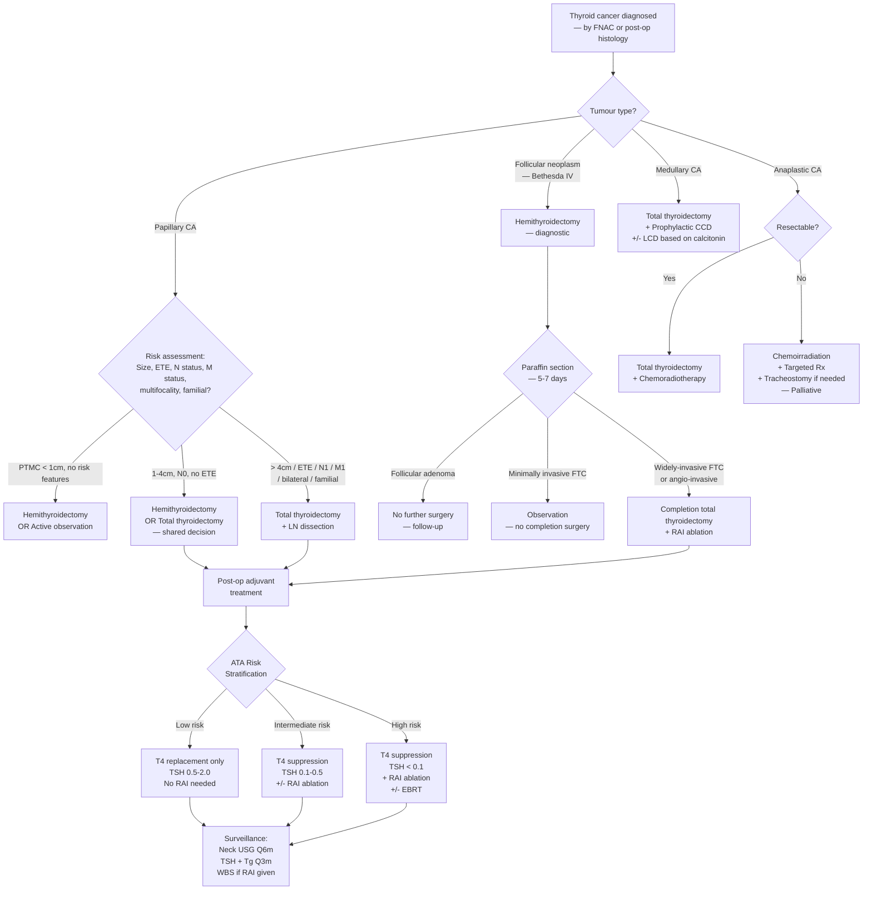

## Management of Thyroid Cancer

### 25. Management Philosophy — First Principles

The management of thyroid cancer is guided by three overarching principles:

1. **Remove the primary tumour and regional metastases** (surgery).
2. **Destroy residual microscopic disease** (radioactive iodine ablation for differentiated cancers).
3. **Suppress the growth stimulus** (TSH suppression with levothyroxine for differentiated cancers).

The *extent* of each treatment modality is risk-stratified — low-risk patients receive less aggressive treatment to minimise morbidity, while high-risk patients receive comprehensive multimodal therapy to maximise cure.

***WDTC — treatment strategy*** [4][13]:
- ***Surgery***
  - ***Primary tumour***
  - ***Metastatic cervical lymph nodes***
- ***Adjuvant therapy***
  - ***Radioactive iodine***
  - ***T4 suppressive therapy***
  - ***External beam irradiation***
  - ***Chemotherapy***

***Well-differentiated thyroid carcinoma — management considerations*** [5]:
- ***Extent of thyroidectomy: hemithyroidectomy vs total (bilateral) thyroidectomy***
- ***Nature/aim and extent of lymph node/neck dissection: prophylactic or therapeutic; central and/or lateral compartments***
- ***Postoperative adjuvant therapies: radioiodine (I-131) ablation; external beam irradiation; thyroxine (T4) suppressive therapy***

---

### 26. Preoperative Preparation

Before any thyroid surgery, several preparatory steps are essential [8]:

| Preparation | Rationale |
|:---|:---|
| ***Anti-thyroid drugs or beta-blockers*** | ***Prevention of thyroid storm*** — manipulation of a thyrotoxic gland can release a bolus of thyroid hormones intraoperatively, triggering storm. The patient must be **biochemically euthyroid** before surgery [8][9] |
| ***Calcium supplements and vitamin D*** | ***Prevention of postoperative hypocalcaemia*** and ***hungry bone syndrome*** [8]. Baseline Ca²⁺ and vitamin D levels must be monitored pre-operatively |
| ***Lugol's solution*** (potassium iodide — used selectively in Graves' disease) | ***Block iodine uptake and secretion of thyroid hormone; decrease vascularity of thyroid gland to reduce intraoperative bleeding*** [8]. The Wolff-Chaikoff effect: excess iodide temporarily inhibits thyroid hormone synthesis and organification |
| ***Vocal cord function by laryngoscopy*** [9] | **Baseline assessment** — if the patient already has a vocal cord palsy pre-operatively (from tumour invasion of RLN), the surgical strategy changes (must protect the contralateral RLN at all costs; bilateral palsy = airway emergency) |
| ***Maintain biochemically euthyroid*** [9] | Standard for all thyroid surgery |

---

### 27. Surgical Treatment — Extent of Thyroidectomy

#### 27.1 Terminology [9]

| Term | Definition |
|:---|:---|
| ***Total thyroidectomy*** | ***Resection of both lobes + isthmus + pyramidal lobe*** |
| ***Subtotal thyroidectomy*** | ***Resection of > 1/2 of both lobes + isthmus*** |
| ***Hemithyroidectomy*** | ***Resection of one lobe + isthmus*** |
| ***Lobectomy*** | ***Resection of one lobe (isthmus preserved)*** |

***General indications for thyroidectomy (4C mnemonic)*** [9]:
- ***CA thyroid***
- ***Uncontrolled thyrotoxicosis (Cannot control)***
- ***Compression***
- ***Cosmetic concern***

***Alternative surgical approaches (reference)*** [9]:
- ***Bilateral axillo-breast approach (BABA)***
- ***Transoral vestibular approach***
- ***Retro-auricular trans-hairline approach (RATH)***

These are scarless or remote-access approaches — cosmetically superior but technically demanding and not universally available.

---

#### 27.2 Surgical Treatment by Tumour Type

##### A. Papillary Thyroid Carcinoma (PTC)

***WDTC — surgical treatment: Primary tumour*** [4]:
- ***Hemithyroidectomy***
- ***Total or near-total thyroidectomy***

***ATA guidelines 2015*** [4]:
***For patients with thyroid cancer > 1 cm and < 4 cm without extrathyroidal extension, and without clinical evidence of any lymph node metastases (N0), the initial surgical procedure can be either a bilateral procedure (near-total or total thyroidectomy) or a unilateral procedure (lobectomy). Thyroid lobectomy alone may be sufficient initial treatment for low-risk papillary and follicular carcinomas; however, the treatment team may choose total thyroidectomy to enable RAI therapy or to enhance follow-up based upon disease features and/or patient preferences.***

***Strong recommendation, moderate-quality evidence*** [4].

The decision framework [8][9]:

| Indication | Surgery |
|:---|:---|
| ***Microcarcinoma (tumour < 1 cm) WITHOUT extrathyroidal extension or vascular invasion*** | ***Hemithyroidectomy*** (or even ***active observation*** — see below) |
| ***Tumour 1-4 cm WITHOUT extrathyroidal extension or vascular invasion*** | ***Hemithyroidectomy OR total thyroidectomy*** (shared decision-making) |
| ***Tumour > 4 cm*** | ***Total thyroidectomy*** |
| ***Tumour with extrathyroidal extension*** | ***Total thyroidectomy*** |
| ***Tumour with metastasis to lymph node or distant sites*** | ***Total thyroidectomy*** |
| ***Bilateral or multifocal disease*** | ***Total thyroidectomy*** |
| ***Familial disease (high risk)*** | ***Total thyroidectomy*** |

[8][9]

***Papillary thyroid carcinoma — management controversy for low-risk patients*** [5]:

***Early stage: < 4 cm, no invasion, no LN metastasis. Majority as papillary microcarcinomas (PTMC): < 1 cm. Survival: nearly 100%.*** [5]

***Overtreatment/surgical risk vs avoid recurrence/facilitate follow-up. Patients' vs physicians' preference. Personalised treatment.*** [5]

| ***Total Thyroidectomy*** | ***Hemithyroidectomy*** |
|:---|:---|
| ***Commonly multifocal and bilateral*** → removes all disease | ***Excellent survival and low recurrence*** |
| ***Allows RAI ablation and thyroglobulin (Tg) monitoring*** | ***Avoid lifelong T4 replacement*** (some residual thyroid maintains euthyroidism) |
| ***Low morbidity rate by experienced surgeons*** | ***Lower morbidity*** (especially parathyroid and RLN injury) |
| Prevents local recurrence → prevents progression to anaplastic CA | No evidence of inferior prognosis for low-risk disease |

[5][9]

<Callout title="Why Does Total Thyroidectomy Allow Better Monitoring?">
After total thyroidectomy, there is NO normal thyroid tissue left. This means:
1. **Thyroglobulin (Tg)** should be undetectable — any detectable Tg = recurrence. After hemithyroidectomy, residual normal thyroid produces Tg, so you cannot use this marker reliably (Tg < 30 is the threshold).
2. **RAI whole-body scan** can detect micrometastases — normal thyroid tissue would preferentially take up RAI and "outcompete" small tumour deposits.
3. **RAI ablation** can destroy residual tumour — again, normal thyroid would absorb all the RAI before it reaches cancer cells.
</Callout>

##### Papillary Thyroid Microcarcinoma (PTMC) — Active Observation [5]

***Active observation for PTMC*** [5]:
- ***Biopsy proven incidental PTMC***
- ***No metastases / invasion / high-grade subtype***
- ***Tumour progression (up to 20 years)***: ***increase in size (3 mm): 8%; novel nodal metastases: 3.5%***
- ***Surgical treatment for tumour progression***
- ***Feasible treatment option***

This is a paradigm shift from "always operate." Evidence from Japan (Kuma Hospital, Ito & Miyauchi) shows that most PTMCs are biologically indolent and can be safely watched with serial USG. Surgery is reserved for those showing progression.

***Thermal ablation*** [5]:
- ***Meta-analysis and propensity matched analysis***
- ***Complete ablation / volume reduction / safety***
- ***Tumour progression, recurrence, nodal metastasis same***
- ***Possibly another alternative for PTMC without metastasis***

---

##### B. Follicular Thyroid Carcinoma (FTC)

The unique challenge with FTC is that **you don't know it's a carcinoma until AFTER excision** — FNAC only tells you "follicular neoplasm" (Bethesda IV).

**Step 1**: ***ALL patients with follicular neoplasm (adenoma or carcinoma) detected by FNAC should undergo hemithyroidectomy*** [8].

**Step 2**: ***Wait for histological confirmation*** — ***paraffin section (5-7 days later)*** [4] — whether the follicular neoplasm is adenoma or carcinoma (look for capsular/vascular invasion).

***FTC management*** [4]:
- ***For widely-invasive or angio-invasive FTC → completion total thyroidectomy***
- ***For minimally invasive (encapsulated) FTC → observation***

***FTC with distant metastases*** [4]:
- ***Histological confirmation of metastases***
- ***+/- detection of primary tumour***
- ***Total thyroidectomy***
- ***Adjuvant therapy: ablation, radioiodine therapy, thyroxine suppression therapy***

<Callout title="The FTC Two-Stage Approach">
Unlike PTC (where FNAC can diagnose cancer and you can go straight to definitive surgery), FTC always follows a **two-stage approach**:
1. **Hemithyroidectomy** (diagnostic + therapeutic) → send for paraffin histology
2. If carcinoma confirmed (especially widely-invasive) → **completion total thyroidectomy** within 2-4 weeks

This is because performing total thyroidectomy for every Bethesda IV nodule would mean subjecting the ~60-70% of patients who have benign adenomas to unnecessarily extensive surgery with its attendant complications (hypoparathyroidism, bilateral RLN risk).
</Callout>

---

##### C. Medullary Thyroid Carcinoma (MTC)

***Medullary thyroid carcinoma (MTC)*** [5]:
- ***Total thyroidectomy***
- ***Central + lateral neck dissection***
- ***Familial cases (1/3)***: ***MEN IIA, MEN IIB, familial MTC***
- ***Genetic analysis: RET proto-oncogene***
- ***Prophylactic thyroidectomy (5-10 yrs)*** [5]

***ALL medullary carcinoma should undergo total thyroidectomy*** due to [8]:
- ***Aggressive nature — majority of cases are already locally advanced or have metastasised at diagnosis***
- ***Risk of multifocality and bilaterality and association with MEN***

**MTC does NOT respond to RAI** (C cells do not express NIS and do not take up iodine) and **does NOT respond to TSH suppression** (C cells do not have TSH receptors). Therefore, the only curative treatment is **complete surgical excision**.

---

##### D. Anaplastic Carcinoma

***Anaplastic carcinoma*** [5]:
- ***Elderly with poor co-morbid state***
- ***Aggressive and rapidly growing***
- ***Locally advanced disease***
- ***Frequent distant metastases***
- ***Lack of effective treatment***
- ***Chemoirradiation + resection + target Rx***
- ***Invariable palliative and fatal***

***Total thyroidectomy with post-operative chemoradiotherapy*** — indicated in patients with intrathyroidal anaplastic carcinoma or locally advanced disease [8].

| Scenario | Treatment |
|:---|:---|
| **Intrathyroidal or locally advanced (resectable)** | ***Total thyroidectomy + post-operative combined chemotherapy and radiotherapy*** (prolongs survival) [8] |
| **Surgically inoperable disease** | ***Chemotherapy*** (doxorubicin-based) and/or ***external beam radiotherapy (EBRT)*** [8] |
| **Airway compromise** | ***Tracheostomy*** — ***death is usually attributable to upper airway obstruction and suffocation*** [8] |

**Targeted therapy**: Recent advances include **BRAF + MEK inhibitor combination** (dabrafenib + trametinib) for BRAF V600E-mutant anaplastic carcinoma — FDA-approved based on dramatic response rates. Also lenvatinib (multi-kinase inhibitor) has shown some activity. This is what the lecture slides refer to as ***target Rx*** [5].

<Callout title="Anaplastic Carcinoma — The One You Can't Win" type="error">
Do not confuse anaplastic with differentiated thyroid cancer. RAI does NOT work (no NIS expression). TSH suppression does NOT work (no TSH receptors). The median survival is less than 6 months. The management is fundamentally palliative in most cases. The only hope for cure is the rare patient with intrathyroidal disease caught early (which is uncommon, as anaplastic typically presents with extensive local invasion).
</Callout>

---

#### 27.3 Summary Table — Extent of Surgery by Tumour Type

| Tumour Type | Extent of Thyroidectomy | Key Reasoning |
|:---|:---|:---|
| **PTC — microcarcinoma ( < 1 cm), no high-risk features** | Hemithyroidectomy OR active observation | Near 100% survival; avoid overtreatment |
| **PTC — 1-4 cm, no ETE, N0** | Hemithyroidectomy OR total thyroidectomy | Shared decision; lobectomy sufficient for low-risk |
| **PTC — > 4 cm / ETE / N1 / M1 / bilateral / familial** | Total thyroidectomy | Remove all disease; enable RAI + Tg monitoring |
| **FTC — initial (Bethesda IV)** | Hemithyroidectomy (diagnostic) | Don't know if adenoma or carcinoma yet |
| **FTC — widely-invasive on final histology** | Completion total thyroidectomy | Enable RAI ablation |
| **FTC — minimally invasive on final histology** | Observation (no completion surgery) | Excellent prognosis with hemithyroidectomy alone |
| **MTC** | Total thyroidectomy | Aggressive; multifocal; bilateral; MEN association |
| **Anaplastic (resectable)** | Total thyroidectomy + chemoRT | Only chance of cure in rare resectable cases |
| **Anaplastic (unresectable)** | Chemoirradiation ± targeted Rx; palliative | Inoperable disease |

---

### 28. Lymph Node Dissection

#### 28.1 Terminology

| Term | Levels | Description |
|:---|:---|:---|
| ***Central compartment dissection (CCD)*** | ***Level VI (+/- VII)*** | Pre-tracheal, para-tracheal, pre-laryngeal nodes; accessed through the same thyroidectomy incision [5] |
| ***Lateral neck dissection (LCD)*** | ***Level II-V*** | Requires extension of the incision; more morbid [5] |

***Key anatomical principle***: ***Normal lymph node metastasis spreads from central compartment (Level VI) to the lateral compartment.*** Therefore, ***lymph node dissection for lateral compartment MUST also include dissection of the central compartment*** [8].

#### 28.2 Types of Neck Dissection [5]

***Metastatic cervical lymph nodes*** — options [4]:
- ***Central compartment neck dissection***
- ***Functional neck dissection***
- ***Selective neck dissection***
- ***Compartmental neck dissection***
- ***Excision of lymph nodes***
- ***"Prophylactic" neck dissection***

The distinction between **prophylactic** (no clinical/radiological evidence of nodal disease) and **therapeutic** (clinically or radiologically proven nodal disease) is critical.

#### 28.3 Lymph Node Dissection by Tumour Type

##### Papillary Carcinoma — LN Dissection [5][8][9]

***Cervical lymph nodes in PTC*** [5]:

***Central (Level VI: pre- and para-tracheal): same incision*** [5]:
- ***Prophylactic/routine vs therapeutic***
- ***Reduction in disease recurrence/reoperations***
- ***Upstaging disease and increased use of I-131***
- ***Increased in morbidity: hypoparathyroidism***

***Lateral (Level II-V): extend incision*** [5]:
- ***Usually therapeutic***
- ***Clinically involved or FNAC proven nodes***
- ***Excisional (berry-picking)***
- ***Modified/functional/selective neck dissection***

Summary for PTC [8][9]:

| Compartment | Prophylactic | Therapeutic |
|:---|:---|:---|
| **Central (Level VI)** | ***Prophylactic dissection indicated in advanced tumour > 4 cm or clinically involved lateral compartment*** [8]; otherwise debated | ***Therapeutic dissection if involved*** |
| **Lateral (Level II-V)** | ***NO prophylactic dissection*** [8] | ***Therapeutic dissection if involved*** |

<Callout title="The Prophylactic CCD Controversy in PTC" type="idea">
Prophylactic CCD (removing clinically normal Level VI nodes) is debated because:
- **For**: Up to 30-60% of PTC has occult central node metastases; prophylactic CCD reduces recurrence and avoids difficult re-operative surgery in the central compartment (which carries higher RLN/parathyroid injury risk).
- **Against**: No proven survival benefit; increases hypoparathyroidism rates; microscopic nodal disease may never become clinically relevant.
The ATA guidelines leave this as surgeon/patient preference for T1-T2 tumours but recommend it for T3-T4 or when lateral nodes are involved.
</Callout>

##### Follicular Carcinoma — LN Dissection [9]

- ***Usually not required*** — FTC spreads haematogenously, not via lymphatics [9].
- Therapeutic dissection only if nodes are clinically involved (rare).

##### Medullary Carcinoma — LN Dissection [8][9]

MTC is the most aggressive in terms of nodal management — ***often need to dissect one level up*** [9]:

| Scenario | Neck Dissection |
|:---|:---|
| ***All MTC patients*** | ***Prophylactic CCD for all patients*** [8][9] |
| ***Ipsilateral central LN positive*** | + ***Ipsilateral LCD*** |
| ***Ipsilateral lateral LN positive, calcitonin < 200*** | + ***Ipsilateral LCD*** [9] |
| ***Ipsilateral lateral LN positive, calcitonin > 200*** | + ***Bilateral LCD*** [9] |
| ***Contralateral LN positive*** | + ***Bilateral LCD*** [9] |

Why is MTC treated so aggressively with neck dissection? Because:
1. MTC does NOT respond to RAI (no iodine uptake) — surgery is the ONLY curative modality.
2. MTC is aggressive with early nodal and distant metastasis.
3. Calcitonin level correlates with tumour burden — ***calcitonin > 200 pg/mL suggests significant bilateral nodal disease*** [9].

---

### 29. Post-Operative Adjuvant Therapy

#### 29.1 Radioactive Iodine (RAI / I-131) Ablation

***WDTC — adjuvant treatment*** [4]:
- ***Radioiodine ablation (30-100 mCi)***
- ***Post-therapy scan (5-8 days after ablation)***
- ***Whole-body scan (6-12 months after ablation)***
- ***Therapy to distant metastases (100-200 mCi)***

##### Rationale [8]

RAI exploits the ability of differentiated thyroid cancer cells to take up iodine via the sodium-iodide symporter (NIS):
- ***Ablate remaining normal thyroid tissue (remnant ablation)*** — to make Tg a reliable marker
- ***Treatment of clinically apparent residual thyroid cancer (residual tumour ablation)***
- ***Treatment of subclinical micrometastasis***
- ***Treatment of metastatic thyroid cancer***

***Residual thyroid tissue is actually non-functional (requires T4 supplementation anyway), but it interferes with post-op thyroglobulin monitoring and also cannot rule out residual malignancy*** [9].

##### Indications for RAI Ablation [5][8][9]

***Use of radioiodine (I-131) ablation*** [5]:
- ***Follow total/near-total thyroidectomy***
- ***Therapy: high risk (stage III/IV disease)***
  - ***Gross persistent/residual disease***
  - ***Nodal or distant metastases***
- ***Ablation: low-risk (selected stage I and stage II)***
  - ***Destroy occult microscopic foci***
  - ***Facilitate disease surveillance***
  - ***Low dose (30 mCi) as effective as higher dose (100 mCi)***
  - ***Short and long-term adverse effects***

| Risk | RAI Ablation | Description |
|:---|:---|:---|
| ***Low risk*** | ***Not indicated*** | ***Unifocal cancer < 1 cm without high-risk features; multifocal when all foci < 1 cm without high-risk features*** [8] |
| ***Intermediate risk*** | ***Selected cases*** | ***Intrathyroidal cancer 1-4 cm without high-risk features; vascular invasion; microscopic invasion into perithyroidal soft tissues; clinically significant LN metastasis outside thyroid bed; aggressive histological subtypes (tall cell, Hürthle cell)*** [8] |
| ***High risk*** | ***Indicated*** | ***Macroscopic tumour invasion; incomplete tumour resection with gross residual disease; distant metastasis*** [8] |

RAI ablation indications align with the indications for total thyroidectomy [9]:
- ***T3/T4 disease***
- ***N1/M1 disease***
- ***Aggressive histology: tall cell, columnar cell, diffuse sclerosing, poorly differentiated PTC***

##### Preparation Before RAI Ablation [8]

The goal is to **maximise TSH levels** so that residual thyroid/cancer cells are maximally stimulated to take up RAI:

| Preparation | Mechanism |
|:---|:---|
| ***Low iodine diet for ≥ 1-2 weeks*** | Depletes the body's iodine stores → thyroid cells become "iodine-hungry" → avidly take up ¹³¹I |
| ***Withdrawal of T4 for ≥ 4 weeks*** or ***T3 for ≥ 2 weeks*** | ***Allow increase in TSH production by pituitary → promote RAI uptake by residual tumour*** [8]. T4 has a long half-life (~7 days) hence 4-week withdrawal; T3 has a shorter half-life (~1 day) hence only 2-week withdrawal |
| ***Recombinant human TSH (rhTSH / Thyrogen) injection*** | ***Indicated for those who cannot tolerate prolonged hypothyroidism (cardiovascular disease)*** [8]. Directly stimulates TSH receptors on residual cells without making the patient hypothyroid |

***Thyroxine withdrawal vs Thyrogen (recombinant TSH)*** [5] — both approaches achieve the same goal (high TSH) by different mechanisms.

##### After RAI Ablation [8]

- ***Avoid pregnancy for 1 year until disease becomes stable***
- ***Post-therapy RAI scan*** (5-8 days after ablation) — to visualise where RAI has been taken up and screen for metastases
- ***Start TSH suppression therapy*** with ***supra-physiological dose of thyroxine (T4)***

##### Contraindications/Precautions for RAI

| Contraindication | Reason |
|:---|:---|
| **Pregnancy** | Teratogenic; crosses placenta → fetal thyroid ablation |
| **Breastfeeding** | Concentrated in breast milk → infant thyroid damage |
| **Recent iodinated contrast CT** | Competitive inhibition of ¹³¹I uptake (wait 6-8 weeks) |
| **MTC or anaplastic carcinoma** | No NIS expression → RAI is ineffective |

##### RAI Adverse Effects

- **Short-term**: Sialadenitis (salivary gland inflammation — NIS is also expressed in salivary glands → RAI damages them), nausea, taste disturbance, neck pain/swelling (radiation thyroiditis), dry mouth
- **Long-term**: Secondary malignancies (leukaemia, bladder cancer — rare, dose-dependent), infertility (with cumulative high doses), pulmonary fibrosis (with diffuse lung metastases treated with high-dose RAI)

---

#### 29.2 External Beam Radiotherapy (EBRT)

***External beam irradiation*** [4][5][9]:

| Indication | Rationale |
|:---|:---|
| ***Positive surgical margins*** [9] | Residual microscopic disease that cannot be re-excised |
| ***Incomplete resection (residual tumour left)*** [9] | Local control when further surgery is not feasible |
| ***R2 resection (macroscopic residual)*** | ***External beam irradiation for incomplete resection (R2)*** [4] |
| **RAI-refractory disease** | When tumour no longer takes up RAI |
| **Anaplastic carcinoma** | Part of multimodal chemoradiation |
| **Locally advanced MTC** | MTC cannot be treated with RAI |

EBRT is NOT routine — it is reserved for situations where surgery + RAI cannot achieve local control.

---

#### 29.3 Thyroxine (T4) Suppressive Therapy

***Thyroxine suppression therapy*** [4][5][9]:

**Dual roles of levothyroxine post-thyroidectomy** [9]:
1. ***Replacement*** — prevent hypothyroidism and maintain euthyroidism
2. ***Suppression*** — high TSH stimulates tumour growth; suppressive-dose T4 keeps TSH low, depriving residual tumour of its growth stimulus

***Target TSH depends on risk*** [9][12]:

| Risk Category | Features | TSH Target |
|:---|:---|:---|
| ***Low risk*** | ***None of the high-risk features*** | ***No TSH suppression (0.5-2.0 mIU/L)*** [9] |
| ***Intermediate risk*** | ***T3, N1; aggressive histology; vascular invasion positive*** | ***Low TSH suppression (0.1-0.5 mIU/L)*** [9] |
| ***High risk*** | ***T4, M1; incomplete resection*** | ***High TSH suppression ( < 0.1 mIU/L)*** [9] |

***Management of high-risk patients***: ***TSH < 0.03*** [4].

**When to start T4** [8]:

| Scenario | Timing |
|:---|:---|
| **After hemithyroidectomy** | ***Do NOT start T4 immediately***. Measure TSH at 6 weeks; start if TSH elevated or if cancer confirmed requiring suppression [8] |
| **After total thyroidectomy — NO RAI planned** | ***Start T4 immediately postoperatively*** [8] |
| **After total thyroidectomy — RAI planned, CAN tolerate hypothyroidism** | ***Withhold T4; stop 4 weeks prior to RAI*** [8] |
| **After total thyroidectomy — RAI planned, CANNOT tolerate hypothyroidism** | ***Start T3 (shorter half-life) and stop 2 weeks prior to RAI; OR use recombinant human TSH*** [8] |

##### Precautions of TSH Suppression [8]

- ***Osteoporosis*** → Calcium supplements required (subclinical thyrotoxicosis accelerates bone turnover)
- ***Atrial fibrillation (AF) and cardiac dysfunction*** → May withhold treatment or accept a less aggressive TSH target in elderly patients with cardiac disease

<Callout title="Why Do Low-Risk Patients NOT Need TSH Suppression?">
The evidence shows that for truly low-risk differentiated thyroid cancer (small, intrathyroidal, completely excised, no aggressive features), TSH suppression does NOT improve recurrence-free or overall survival. The risks of chronic subclinical thyrotoxicosis (AF, osteoporosis) outweigh the marginal oncological benefit. This is why the ATA 2015 guidelines explicitly state that ***low risk group does NOT require TSH suppression*** — a normal TSH (0.5-2.0) is acceptable [9].
</Callout>

---

#### 29.4 Chemotherapy

***Chemotherapy*** [4][8]:

- ***Doxorubicin*** — the most commonly used agent, often as a ***radiation sensitiser*** [4] rather than a standalone treatment.
- Indicated primarily for:
  - **Anaplastic carcinoma** (as part of chemoradiation)
  - **RAI-refractory differentiated thyroid cancer** (very limited efficacy)
  - **Advanced MTC not amenable to surgery**

**Tyrosine kinase inhibitors (TKIs)** — the modern era:
- **Lenvatinib** and **sorafenib** — approved for RAI-refractory differentiated thyroid cancer (target VEGFR, FGFR, RET, and other kinases).
- **Vandetanib** and **cabozantinib** — approved for advanced MTC (target RET, VEGFR, MET).
- **Dabrafenib + trametinib** (BRAF + MEK inhibitors) — approved for BRAF V600E-mutant anaplastic carcinoma (the ***target Rx*** referenced in lecture slides [5]).
- **Selpercatinib** and **pralsetinib** — selective RET inhibitors for RET-mutant MTC and RET-fusion-positive thyroid cancers.

---

### 30. Management of High-Risk Patients — Summary

***Management of high risk patients*** [4]:
- ***Total or near-total thyroidectomy***
- ***Central compartment neck dissection***
- ***(+/- compartmental neck dissection)***
- ***Radioiodine ablation***
- ***External beam irradiation for incomplete resection (R2)***
- ***Thyroxine suppression therapy (TSH < 0.03)***

---

### 31. Post-Operative Surveillance

***WDTC — adjuvant treatment*** [4]:
- ***Post-therapy scan (5-8 days after ablation)***
- ***Whole-body scan (6-12 months after ablation)***

| Modality | Frequency | Details |
|:---|:---|:---|
| ***1st Post-RAI whole-body scan*** | ***1 week after RAI ablation*** | ***Screen for RAI uptake of residual tumour; screen for distant metastasis*** [8] |
| ***2nd Post-RAI whole-body scan*** | ***6-12 months after RAI ablation*** | ***Screen for tumour recurrence; screen for distant metastasis*** [8] |
| **Neck USG** | Every 6 months | Detect local recurrence, suspicious LN [9] |
| **Serum TSH** | Every 3 months | Ensure target suppression is achieved [9] |
| **Serum thyroglobulin** | Every 3 months (on T4 suppression) | ***Tg < 0.2 after total thyroidectomy; Tg < 30 after hemithyroidectomy*** [9] |
| **Anti-TG antibodies** | With each Tg measurement | If present, Tg is unreliable — use Ab trend |
| **Serum calcitonin and CEA** | For MTC | Monitor for recurrence [8] |
| **Physical examination** | Regular | Palpation of neck, assessment of voice [8] |

**Prognosis — MACIS scoring system** for differentiated thyroid cancer [8]:
- ***M — Metastasis***
- ***A — Age***
- ***C — Completeness of resection***
- ***I — Invasion***
- ***S — Size***

---

### 32. Complete Management Algorithm — Mermaid Diagram

---

### 33. Special Scenarios

#### 33.1 FTC with Distant Metastases at Presentation [4]

***FTC with distant metastases*** [4]:
- ***Histological confirmation of metastases***
- ***+/- detection of primary tumour***
- ***Total thyroidectomy***
- ***Adjuvant therapy: ablation, radioiodine therapy, thyroxine suppression therapy***

Even when FTC presents with distant metastases (e.g., pathological fracture from bone metastasis), total thyroidectomy is still performed because:
1. It enables effective RAI therapy for metastatic disease (need to remove competing normal thyroid tissue).
2. It provides local control.

#### 33.2 RAI-Refractory Disease

When differentiated thyroid cancer loses the ability to concentrate iodine (progressive de-differentiation, loss of NIS expression):
- RAI is no longer effective
- Often FDG-PET-avid (as glucose metabolism increases with de-differentiation — the "flip-flop phenomenon": RAI-avid tumours tend to be FDG-negative, and vice versa)
- Treatment: TKIs (lenvatinib, sorafenib), EBRT for local control, clinical trials

#### 33.3 Prophylactic Thyroidectomy in MEN2 [5]

***Prophylactic thyroidectomy (5-10 years)*** [5] — for confirmed RET mutation carriers:

| RET Mutation Risk Category | Timing of Prophylactic Thyroidectomy |
|:---|:---|
| **Highest risk** (MEN2B — codon 918) | Within first 6 months of life |
| **High risk** (MEN2A — codon 634) | By age 5 years |
| **Moderate risk** (other MEN2A mutations) | Can delay until stimulated calcitonin becomes abnormal or by age 5-10 |

---

<Callout title="High Yield Summary">

**Surgical extent depends on tumour type and risk**:
- PTC: Hemithyroidectomy for low-risk; total for high-risk; active observation for selected PTMC.
- FTC: Always hemithyroidectomy first (diagnostic); completion total thyroidectomy only if widely-invasive on final histology.
- MTC: Always total thyroidectomy + prophylactic CCD. Prophylactic thyroidectomy in MEN2 carriers.
- Anaplastic: Total thyroidectomy + chemoRT if resectable; palliative if not.

**LN dissection**:
- PTC: Therapeutic CCD/LCD; prophylactic CCD debated (for T3-4 or lateral N1).
- FTC: Usually not needed (haematogenous spread).
- MTC: Prophylactic CCD always; LCD guided by calcitonin levels.

**RAI ablation**: Only for differentiated CA after total thyroidectomy. Not indicated in low-risk, NOT effective in MTC or anaplastic. Prepare with low-iodine diet + T4 withdrawal or rhTSH.

**T4 suppression targets**: Low risk = no suppression (TSH 0.5-2.0). Intermediate = TSH 0.1-0.5. High = TSH < 0.1.

**Monitoring**: Tg (target < 0.2 post-total thyroidectomy), neck USG Q6m, TSH Q3m, WBS post-RAI.

**MACIS** = Metastasis, Age, Completeness of resection, Invasion, Size — predicts prognosis.

</Callout>

---

<ActiveRecallQuiz
  title="Active Recall - Management of Thyroid Cancer"
  items={[
    {
      question: "A patient with a 2.5 cm papillary thyroid carcinoma, no extrathyroidal extension, N0M0 — what are the surgical options and what are the arguments for each?",
      markscheme: "Either hemithyroidectomy OR total thyroidectomy (ATA 2015 guidelines). For total: PTC is commonly multifocal/bilateral; allows RAI ablation; allows thyroglobulin monitoring; prevents progression to anaplastic. For hemi: lower morbidity (parathyroid/RLN); no evidence of inferior prognosis in low-risk; avoids lifelong T4 replacement; RAI usually not needed.",
    },
    {
      question: "Describe the two-stage surgical approach for follicular thyroid neoplasm and explain why it exists.",
      markscheme: "Stage 1: Hemithyroidectomy for all Bethesda IV (follicular neoplasm) — because FNAC cannot distinguish adenoma from carcinoma (needs capsular/vascular invasion on histology). Stage 2: Wait for paraffin section (5-7 days). If widely-invasive or angio-invasive FTC → completion total thyroidectomy. If minimally invasive FTC or adenoma → observe. This avoids unnecessary total thyroidectomy in the 60-70% who have benign adenomas.",
    },
    {
      question: "What preparations are needed before radioactive iodine ablation and what is the rationale for each?",
      markscheme: "Three preparations: (1) Low iodine diet for 1-2 weeks — depletes body iodine stores so residual cells avidly take up I-131. (2) T4 withdrawal for 4 weeks (or T3 withdrawal for 2 weeks) — allows TSH to rise, stimulating NIS expression and RAI uptake by residual tumour. (3) Alternatively, recombinant human TSH injection — for patients who cannot tolerate prolonged hypothyroidism (e.g. cardiovascular disease).",
    },
    {
      question: "Why does medullary thyroid carcinoma always require total thyroidectomy with prophylactic central compartment dissection, even without clinical nodal disease?",
      markscheme: "Because: (1) MTC is aggressive with early nodal and distant metastasis — majority already locally advanced at diagnosis. (2) Risk of multifocality and bilaterality, especially in familial/MEN2 cases. (3) MTC does NOT respond to RAI (C cells lack NIS) and does NOT respond to TSH suppression (C cells lack TSH receptors) — surgery is the ONLY curative modality. (4) Prophylactic CCD is needed because occult central nodal disease is common.",
    },
    {
      question: "State the TSH suppression targets for low, intermediate, and high-risk differentiated thyroid cancer. Why do low-risk patients NOT need TSH suppression?",
      markscheme: "Low risk: TSH 0.5-2.0 mIU/L (no suppression). Intermediate: TSH 0.1-0.5 mIU/L. High risk: TSH < 0.1 mIU/L. Low-risk patients do not benefit from TSH suppression — no improvement in recurrence or survival — and the risks of chronic subclinical thyrotoxicosis (atrial fibrillation, osteoporosis) outweigh the marginal benefit.",
    },
    {
      question: "A patient with anaplastic thyroid carcinoma presents with stridor and locally advanced unresectable disease. Outline the management plan.",
      markscheme: "Immediate: Secure airway — tracheostomy (death usually from airway obstruction). Oncological: Chemoirradiation (doxorubicin as radiosensitiser + EBRT) plus targeted therapy if BRAF V600E-mutant (dabrafenib + trametinib). Palliative: RAI is NOT effective (no NIS), TSH suppression NOT effective (no TSH receptors). Prognosis: Median survival < 6 months. Fundamentally palliative.",
    },
  ]}
/>

---

## References

[4] Lecture slides: Management of differentiated thyroid carcinoma.pdf (p7, p8, p9, p11, p14, p16, p17, p22, p23)
[5] Lecture slides: GC 177. A thyroid nodule benign thyroid nodules; thyroid cancer.pdf (p20, p22, p23, p24, p26, p27, p28)
[8] Senior notes: felixlai.md (Thyroid Cancer — Treatment sections IX: surgical approach, preoperative preparation, surgical technique, LN dissection, RAI ablation, T4 replacement, postoperative management, prognosis)
[9] Senior notes: maxim.md (Choice of thyroidectomy, neck dissection, post-operative adjuvant treatments, thyroxine, thyroidectomy indications/terminology, disease monitoring)
[12] Lecture slides: Management of differentiated thyroid carcinoma.pdf (p11 — ATA risk stratification; p14 — AJCC 8th edition)
