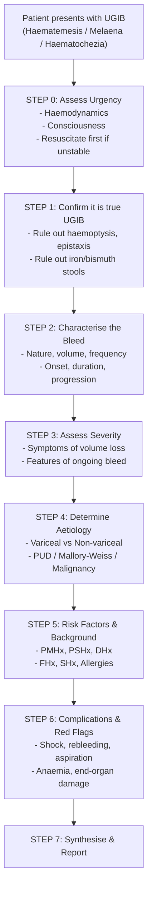

# History Taking: Upper GI Bleed (UGIB)

## Master Framework

---

## Step 0: Assess Urgency Before History Taking

This is the one condition where you should look at the patient before asking a single question. A haemodynamically unstable patient needs resuscitation _first_. [1][2]

> **Assess urgency** [2]:
>
> - **_Very severe_**: hypotension, tachycardia, agitation, confusion, drowsiness, coma
> - **_Moderate to severe_**: postural hypotension (indicates ≥20% blood volume loss)
> - Note that **Hb does not drop until expansion of ECV** (takes ≥24h → does NOT reflect acute degree of blood loss) [2]

<Callout title="Resuscitate Before You Interrogate" type="error">
  A classic OSCE pitfall: students launch into a full history while the
  simulated patient is "in shock." Examiners expect you to state "I would first
  assess haemodynamic stability and initiate resuscitation if needed" before
  proceeding with history taking.
</Callout>

---

## Step 1: Confirm True Upper GI Bleed

Before assuming UGIB, briefly exclude mimics:

| Mimic                                               | How to differentiate                                                                    |
| --------------------------------------------------- | --------------------------------------------------------------------------------------- |
| **Haemoptysis** (咯血)                              | Associated with cough, frothy, bright red (aerated), no melaena [2]                     |
| **Swallowed blood** (e.g. epistaxis, oral bleeding) | Recent nosebleed or dental procedure                                                    |
| **Iron / bismuth stools**                           | Constipated, green-black solid stools with granules on PR; no pungent melaena smell [2] |

**Practical phrasing:**

- "Have you had any nosebleeds or coughed up blood recently?" (你最近有冇流鼻血或者咳血？)
- "Are you taking any iron tablets?" (你有冇食鐵丸？)

**Why this matters:** Misidentifying haemoptysis as haematemesis changes the entire diagnostic pathway. Iron stools are a common cause of unnecessary endoscopy referrals.

---

## Step 2: Characterise the Bleed

This is the meat of the presenting complaint. You need to nail down the _nature_, _amount_, _timing_, and _progression_.

### Nature of the vomitus/stool

| Presentation                                     | What it means                                                                                                | Cantonese phrasing                   |
| ------------------------------------------------ | ------------------------------------------------------------------------------------------------------------ | ------------------------------------ |
| **_Haematemesis_** (嘔血)                        | Vomiting of fresh red blood → moderate-to-severe, possibly ongoing [2]                                       | "你嘔嘅嘢係咩顏色？有冇鮮血？"       |
| **_Coffee-ground vomiting_** (嘔啡色嘢/似咖啡渣) | Blood oxidized by gastric acid → milder/slower bleed from stomach or beyond [2]                              | "嘔出嚟似唔似咖啡渣咁？"             |
| **_Melaena_** (黑便/柏油便)                      | Black, tarry, loose, extremely malodorous stools → usually UGIB, can arise up to right colon [2]             | "大便係唔係好黑好臭，好似芝麻糊咁？" |
| **_Haematochezia_** (便血)                       | Fresh red blood per rectum → usually LGIB but can occur with _massive_ UGIB (with signs of hypovolaemia) [2] | "大便有冇鮮血？"                     |

<Callout title="Fresh vs Stale Melaena" type="idea">
  On PR examination, **fresh melaena** (haematin + Hb) is jet-black, tarry,
  non-particulate liquid → indicates *acute ongoing* bleeding. **Old/stale
  melaena** (haematin only) is black-grey, dull, mixed with normal stool →
  indicates bleeding has likely *stopped*. [2]
</Callout>

### Amount and frequency

- "How many times have you vomited blood?" (你嘔咗幾多次血？)
- "Can you estimate the amount — a teaspoon, a cup, a bowl?" (大約幾多？一茶匙？一杯？一碗？)
- "When did this first start?" (幾時開始？)
- "Is it getting worse, staying the same, or improving?" (有冇越嚟越嚴重？)

**Why this matters:** The **_nature, rate, and duration of bleeding_** directly determines urgency and guides timing of endoscopy. [1][3]

### Previous episodes

- "Have you had this before?" (你之前有冇試過嘔血或者屙黑便？)
- "If so, what investigations were done?" (之前有冇做過胃鏡？)

**Why this matters:** **_Previous episode(s)_** of UGIB and prior OGD/banding findings point toward recurrent disease (e.g. rebleeding peptic ulcer, known varices). [1][3]

---

## Step 3: Assess Severity — Signs of Volume Loss

You cannot measure blood loss directly. You infer it from symptoms of hypovolaemia. **_Anaemic symptoms are UNCOMMON_** in acute UGIB because both plasma and blood cells are lost simultaneously. [4]

| Symptom                            | Cantonese                  | Significance                      |
| ---------------------------------- | -------------------------- | --------------------------------- |
| Dizziness / lightheadedness (頭暈) | "你有冇頭暈？"             | Postural hypotension              |
| Syncope / fainting (暈倒)          | "你有冇暈低過？"           | Significant volume loss           |
| Palpitations (心跳)                | "有冇覺得心跳好快？"       | Sympathetic response              |
| Cold sweats / clamminess (出冷汗)  | "有冇出冷汗？手腳凍唔凍？" | Peripheral vasoconstriction       |
| Thirst (口渴)                      | "覺唔覺得好口渴？"         | Dehydration                       |
| Confusion / agitation (神志不清)   | "有冇覺得個人矇查查？"     | Cerebral hypoperfusion — RED FLAG |
| Reduced urine output (小便少咗)    | "小便有冇少咗？"           | End-organ hypoperfusion           |

**_Features of ongoing bleeding_** [1]:

- Continued haematemesis
- Haematochezia
- Fresh PR bleeding
- Fresh blood aspirated from NG tube
- Persistent tachycardia

---

## Step 4: Determine Aetiology — Focused Differentiating Questions

The key clinical fork in the road is **variceal vs non-variceal** UGIB, because management differs enormously.

### A. Is it variceal bleeding?

Variceal bleeds are usually **_profuse and present as haematemesis_**. [2] Only 50% stop spontaneously (cf >90% in non-variceal causes). [5]

| Question                                | Cantonese                                      | Why you ask                                   |
| --------------------------------------- | ---------------------------------------------- | --------------------------------------------- |
| History of liver disease / cirrhosis    | "你有冇肝病？肝硬化？"                         | Direct cause of portal hypertension → varices |
| Hepatitis B/C carrier status            | "你係唔係乙型/丙型肝炎帶菌者？"                | Commonest cause of CLD in HK                  |
| Jaundice                                | "有冇眼黃、皮膚黃？"                           | Liver decompensation                          |
| Abdominal distension / ascites          | "個肚有冇脹大咗？"                             | Portal hypertension                           |
| Easy bruising                           | "容唔容易瘀？"                                 | Coagulopathy from liver failure               |
| Previous variceal bleed / OGD / banding | "之前有冇試過靜脈曲張出血？有冇做過胃鏡綁帶？" | Known portal HTN                              |
| **_Alcohol history_**                   | "你飲唔飲酒？飲幾多？飲咗幾耐？"               | Alcoholic liver disease [3][6]                |

### B. Is it peptic ulcer disease?

**_PUD is the commonest cause of UGIB (25-50%)_**. [2] Four major risk factors: **_H. pylori + NSAIDs + Stress + Excess gastric acid_**. [1]

| Question                                              | Cantonese                              | Why you ask                                              |
| ----------------------------------------------------- | -------------------------------------- | -------------------------------------------------------- |
| Epigastric pain, relation to meals                    | "食嘢之前或者之後有冇胃痛？"           | GU worsened by food; DU relieved by food then recurs [4] |
| History of dyspepsia                                  | "有冇經常胃脹、胃酸倒流？"             | Pre-existing peptic disease                              |
| **_Previous H. pylori testing & treatment_**          | "有冇驗過幽門螺旋桿菌？食過殺菌藥未？" | Documented eradication vs persistent infection [1]       |
| **_NSAID / aspirin use_**                             | "你有冇食止痛藥、亞士匹靈？"           | Key modifiable risk factor [3]                           |
| Recent physiological stress (ICU, burns, head injury) | "最近有冇住過深切治療部、受過傷？"     | Curling ulcer (burns), Cushing's ulcer (↑ICP) [2]        |

### C. Is it Mallory-Weiss tear?

| Question                                                          | Why you ask                                                                                      |
| ----------------------------------------------------------------- | ------------------------------------------------------------------------------------------------ |
| **_Forceful/prolonged vomiting or retching BEFORE haematemesis_** | Mallory-Weiss = longitudinal mucosal laceration at GEJ from sudden ↑intra-abdominal pressure [1] |
| Binge drinking episode                                            | Common precipitant                                                                               |

- "嘔血之前有冇嘔咗好多次先？"

### D. Is it malignancy?

| Question                        | Cantonese                  | Why you ask                           |
| ------------------------------- | -------------------------- | ------------------------------------- |
| **_Dysphagia_**                 | "吞嘢有冇困難？"           | Oesophageal / gastric cardia CA       |
| **_Early satiety_**             | "食少少就覺得好飽？"       | Gastric CA                            |
| **_Unintentional weight loss_** | "體重有冇無端端輕咗好多？" | Constitutional symptom — RED FLAG [4] |
| Loss of appetite (食慾不振)     | "有冇冇胃口？"             | Constitutional symptom                |
| Fatigue (疲倦)                  | "覺唔覺得成日好攰？"       | Anaemia / cachexia                    |

### E. Other important differentiating questions

| Diagnosis                              | Key question                                                                                    | Why                                                     |
| -------------------------------------- | ----------------------------------------------------------------------------------------------- | ------------------------------------------------------- |
| **_Oesophagitis / oesophageal ulcer_** | GERD symptoms, dysphagia, odynophagia                                                           | Erosive oesophagitis from chronic reflux [1]            |
| **_Portal hypertensive gastropathy_**  | Known CLD, ascites                                                                              | Complication of portal HTN distinct from varices [1]    |
| **_Angiodysplasia_**                   | Advanced age, Hx of CKD, aortic valve disease, hereditary haemorrhagic telangiectasia, prior RT | Dilated submucosal vessels; often elderly [2]           |
| **_Aorto-enteric fistula_**            | **_Previous AAA repair with graft_**                                                            | Medical emergency; high mortality; D3/4 duodenum [1][2] |
| **_Dieulafoy's lesion_**               | Recurrent UGIB with no clear source on prior OGD                                                | Aberrant submucosal vessel, proximal stomach [1]        |
| **_Hemobilia_**                        | Previous liver biopsy or biliary instrumentation                                                | Bleeding from hepatobiliary tract [1]                   |

---

## Step 5: Background History

### Past Medical History

| Condition                                                                                  | Why it matters                                            |
| ------------------------------------------------------------------------------------------ | --------------------------------------------------------- |
| **_Peptic ulcer disease_** — including H. pylori status, treatment, documented eradication | Recurrence is the concern [1]                             |
| **_Chronic liver disease_**                                                                | Portal HTN → varices, coagulopathy [1]                    |
| Congestive heart failure                                                                   | Fluid overload risk during resuscitation [1]              |
| Chronic kidney disease                                                                     | Predisposition to angiodysplasia; fluid overload risk [1] |
| Bleeding disorders / coagulopathy                                                          | Platelet dysfunction worsens haemorrhage [1]              |
| **_Previous irradiation_**                                                                 | Radiation enteritis [3]                                   |
| Hereditary haemorrhagic telangiectasia                                                     | Angiodysplasia [1]                                        |

### Past Surgical History

| Surgery                                 | Why it matters                                 |
| --------------------------------------- | ---------------------------------------------- |
| **_AAA repair with graft_**             | Aorto-enteric fistula — must always ask [1][2] |
| Previous gastroenteric anastomosis      | Marginal ulcers at anastomotic site [1]        |
| Previous OGD with banding/sclerotherapy | Known variceal disease                         |

### Drug History (藥物史)

This is a **high-yield** area and frequently tested in OSCEs.

| Drug                                                | Why                                                                                | Cantonese                        |
| --------------------------------------------------- | ---------------------------------------------------------------------------------- | -------------------------------- |
| **_Aspirin / NSAIDs_**                              | Peptic ulcer → most important modifiable risk factor [1][3]                        | "有冇食亞士匹靈或者消炎止痛藥？" |
| **_Anticoagulants_** (warfarin, DOACs)              | Bleeding diathesis [1][3]                                                          | "有冇食薄血丸？"                 |
| **_Antiplatelet agents_** (clopidogrel, ticagrelor) | Bleeding diathesis [3]                                                             | "有冇食抗血小板藥？"             |
| **_Beta-blockers_**                                 | May mask tachycardia in shock [3]                                                  | "有冇食心臟藥？"                 |
| Corticosteroids                                     | ↑Risk of NSAID-induced PUD when co-prescribed; TCM may contain hidden steroids [1] | "有冇食類固醇？有冇食中藥？"     |
| **_Iron supplements_**                              | Cause black stools — mimic melaena [1][3]                                          | "有冇食鐵丸？"                   |
| PPIs                                                | Already on treatment — suggests known ulcer disease                                | "有冇食胃藥？"                   |
| TCM (中藥)                                          | May contain steroids; herbal interactions [1]                                      | "有冇食中藥？"                   |

<Callout title="Beta-blockers Mask Tachycardia" type="error">
  If the patient is on beta-blockers, they may NOT mount an appropriate
  tachycardia despite significant blood loss. Their heart rate may be
  misleadingly "normal." Always check the drug history before interpreting vital
  signs. [3]
</Callout>

### Allergy History

- "Are you allergic to any medications?" (你有冇對任何藥物敏感？)
- Important before endoscopy, sedation, and potential blood transfusion.

### Family History

| Question                                          | Why                                 |
| ------------------------------------------------- | ----------------------------------- |
| Family history of GI cancer                       | ↑Risk of upper GI malignancy        |
| Family history of liver disease / HCC / hepatitis | HBV is vertically transmitted in HK |
| Family history of bleeding disorders              | Inherited coagulopathies            |

### Social History

| Factor                                       | Why                                                                     | Cantonese                            |
| -------------------------------------------- | ----------------------------------------------------------------------- | ------------------------------------ |
| **_Alcohol_** — type, amount, duration, CAGE | Alcoholic liver disease → varices; also gastritis and malignancy [1][3] | "你飲酒嗎？飲幾多？飲咗幾多年？"     |
| **_Smoking_** — pack-years                   | Risk factor for PUD and upper GI malignancy [1]                         | "你食唔食煙？食咗幾耐？每日幾多支？" |
| Occupation                                   | Stress, exposure                                                        |                                      |
| Living situation / functional baseline       | Important for discharge planning                                        | "你平時自己行得走得？有冇人照顧你？" |

---

## Step 6: Red-Flag Findings and Escalation Triggers

These findings should prompt immediate escalation and consideration for emergency OGD or surgical referral:

| Red Flag                                                                | Action                                                      |
| ----------------------------------------------------------------------- | ----------------------------------------------------------- |
| **_Haemodynamic instability_** (SBP ≤90, HR ≥120) despite resuscitation | Emergency OGD / surgical referral [3]                       |
| **_Massive haematemesis with fresh PR bleed_**                          | Profuse rapid bleed — likely variceal or major arterial [4] |
| **_Confusion / decreased consciousness_**                               | Cerebral hypoperfusion or hepatic encephalopathy            |
| **_Known varices with profuse haematemesis_**                           | Start IV terlipressin empirically before endoscopy [5]      |
| Suspected **_aorto-enteric fistula_** (herald bleed → massive bleed)    | Immediate surgical consultation                             |
| **_Hb < 8.0 g/dL on presentation_**, shock, need for transfusion        | Risk factors for recurrent bleeding [1]                     |
| **_Age > 60_** with coagulopathy                                        | Higher rebleed and mortality risk [1]                       |

---

## Step 7: Targeted Systems Review

| System             | Questions                                                                                      | Why                                         |
| ------------------ | ---------------------------------------------------------------------------------------------- | ------------------------------------------- |
| **GI**             | Abdominal pain, nausea, vomiting, dysphagia, odynophagia, change in bowel habit, weight change | Cover full GI differential                  |
| **Hepatobiliary**  | Jaundice, dark urine, pale stools, pruritus, abdominal distension                              | Liver disease / portal HTN                  |
| **Haematological** | Easy bruising, prolonged bleeding from cuts, heavy periods                                     | Coagulopathy / platelet disorder            |
| **Cardiovascular** | Chest pain, SOB on exertion                                                                    | Anaemia-related angina; cardiac comorbidity |
| **Constitutional** | Fever, night sweats, weight loss, fatigue                                                      | Malignancy, infection                       |

---

## Common Pitfalls in History-Taking for UGIB

<Callout title="Common OSCE Pitfalls" type="error">

1. **Not assessing urgency first** — launching into history while the patient is unstable.
2. **Forgetting to ask about beta-blockers** — interpreting a "normal" HR as reassuring when it's pharmacologically suppressed.
3. **Not distinguishing melaena from iron stools** — always ask about iron supplements and bismuth.
4. **Missing the AAA repair history** — aorto-enteric fistula is rare but fatal; one question can save a life.
5. **Assuming haematochezia = LGIB** — massive UGIB can present with fresh PR blood (with associated hypovolaemia).
6. **Not asking about previous H. pylori testing AND documented eradication** — testing positive once doesn't mean it was successfully treated.
7. **Forgetting TCM** — traditional Chinese medicine may contain hidden steroids and is very relevant in Hong Kong.
8. **Not asking about alcohol in a culturally sensitive way** — frame it neutrally: "Some people drink socially; can I ask about your drinking habits?"

</Callout>

---

## High-Yield Exam Interpretation Tips

| Tip                                                        | Explanation                                                                                                                                                       |
| ---------------------------------------------------------- | ----------------------------------------------------------------------------------------------------------------------------------------------------------------- |
| **_Glasgow-Blatchford score_** predicts need for endoscopy | Uses admission data (Hb, BUN, SBP, HR, melaena, syncope, liver disease, cardiac failure) — a score of 0 means very low risk, may not need inpatient endoscopy [2] |
| **_Rockall score_** predicts rebleeding and mortality      | Calculated pre- and post-endoscopy; includes age, shock, comorbidity, diagnosis, signs of recent haemorrhage → ≤2/11 = low risk of rebleed [2]                    |
| **_AIMS65_** predicts in-hospital mortality                | Albumin < 30, INR >1.5, altered Mental status, SBP ≤90, age >65 [2]                                                                                               |
| **_Hb is unreliable acutely_**                             | Does not drop until haemodilution occurs (~24h); BUN/Cr ratio elevation is more suggestive of UGIB                                                                |
| Variceal bleed has worse prognosis                         | Only 50% stop spontaneously; highest rebleed risk in first 48-72h [5]                                                                                             |
| **_Child-Pugh class C_** = worse outcome in variceal bleed | More likely to have ongoing bleed and higher mortality [5]                                                                                                        |

---

## Model Reporting Script

> "Mr Chan is a 62-year-old gentleman who presented to Queen Mary Hospital A&E this evening with profuse haematemesis and melaena since this afternoon. He reports vomiting approximately three cups of fresh red blood over the past 6 hours, associated with passage of jet-black tarry stools on two occasions. He also describes dizziness on standing and one syncopal episode at home. He denies any preceding retching, abdominal pain, dysphagia, or weight loss.
>
> In terms of past medical history, he has known hepatitis B carrier status diagnosed 20 years ago but has not been on regular follow-up. He has no history of prior endoscopy, variceal banding, or previous GI bleeding episodes. He has hypertension managed with amlodipine. He has no past surgical history.
>
> Regarding medications, he takes amlodipine 5 mg daily and has been using over-the-counter ibuprofen regularly for knee pain over the past two months. He has no known drug allergies. He is not taking any anticoagulants, antiplatelets, or iron supplements. He does take occasional Chinese herbal remedies.
>
> Family history is significant for his father who died of hepatocellular carcinoma at age 65.
>
> Socially, Mr Chan is a retired construction worker. He drinks approximately 4 cans of beer daily and has done so for over 30 years. He has a 40 pack-year smoking history. He lives with his wife and is independently mobile at baseline.
>
> In summary, Mr Chan is a 62-year-old gentleman with risk factors for both variceal bleeding — chronic HBV, significant alcohol history — and peptic ulcer disease — regular NSAID use, smoking — who presents with a significant acute upper GI bleed with haemodynamic compromise. I would prioritise haemodynamic resuscitation and arrange an urgent OGD."

---

<Callout title="High Yield Summary">

**Upper GI Bleed** = bleeding proximal to the ligament of Treitz. The two most important aetiological categories are **variceal** (portal HTN / liver disease) and **non-variceal** (PUD being the commonest at 25-50%). Always:

1. **Assess urgency and resuscitate first** before detailed history taking.
2. **Characterise the bleed**: haematemesis vs coffee-ground vs melaena; amount, frequency, duration.
3. **Determine aetiology**: Variceal (liver disease, HBV/HCV, alcohol) vs PUD (NSAIDs, H. pylori, stress) vs Mallory-Weiss (preceding retching) vs Malignancy (dysphagia, weight loss, early satiety) vs Rare causes (aorto-enteric fistula, Dieulafoy, angiodysplasia).
4. **Drug history is critical**: NSAIDs, aspirin, anticoagulants, antiplatelets, beta-blockers, iron, TCM.
5. **Red flags**: haemodynamic instability, massive/ongoing bleed, confusion, Hb < 8, known varices, AAA graft history.
6. **Risk scores**: Glasgow-Blatchford (need for endoscopy), Rockall (rebleed/mortality), AIMS65 (in-hospital mortality).
7. **Hb is unreliable** in the acute setting — does not drop for ~24h.

</Callout>

---

<ActiveRecallQuiz
  title="Active Recall - History Taking"
  items={[
    {
      question: "What is the anatomical definition of upper GI bleeding?",
      markscheme:
        "Bleeding from the GI tract proximal to the ligament of Treitz (duodenojejunal junction).",
    },
    {
      question: "Name the four major risk factors for peptic ulcer disease.",
      markscheme:
        "H. pylori infection, NSAIDs (including aspirin), physiological stress, and excess gastric acid.",
    },
    {
      question:
        "Why is haemoglobin unreliable in the acute assessment of upper GI bleeding severity?",
      markscheme:
        "In acute haemorrhage, both plasma and red cells are lost proportionally. Hb does not drop until haemodilution occurs through expansion of extracellular volume, which takes at least 24 hours.",
    },
    {
      question:
        "A patient with previous AAA graft repair presents with a herald GI bleed. What diagnosis must you consider and why?",
      markscheme:
        "Aorto-enteric fistula. It results from erosion of the aortic graft into the GI tract (usually D3/D4 duodenum). It is a medical emergency with very high mortality.",
    },
    {
      question:
        "Why must you always ask about beta-blocker use in a patient presenting with upper GI bleeding?",
      markscheme:
        "Beta-blockers blunt the tachycardic response to hypovolaemia. The heart rate may appear misleadingly normal despite significant blood loss, leading to underestimation of severity.",
    },
    {
      question:
        "How do you distinguish fresh melaena from stale melaena on PR examination, and what does each indicate?",
      markscheme:
        "Fresh melaena is jet-black, tarry, non-particulate liquid stool (haematin + Hb), indicating acute ongoing bleeding. Stale melaena is black-grey, dull, mixed with normal stool (haematin only), indicating bleeding has likely stopped.",
    },
  ]}
/>

---

## References

[1] Senior notes: felixlai.md (Upper GI bleeding section)
[2] Senior notes: Ryan Ho GI.pdf (Section B: Approach to Upper GI Bleed, pp. 40-47)
[3] Lecture slides: GC 198. Profuse vomiting of fresh blood and in shock severe upper GI bleeding.pdf (pp. 11-12, 19)
[4] Senior notes: maxim.md (Section 3.3 UGIB)
[5] Senior notes: Ryan Ho GI.pdf (Variceal haemorrhage management, p. 325)
[6] Senior notes: Ryan Ho Fundamentals.pdf (pp. 250-257)
