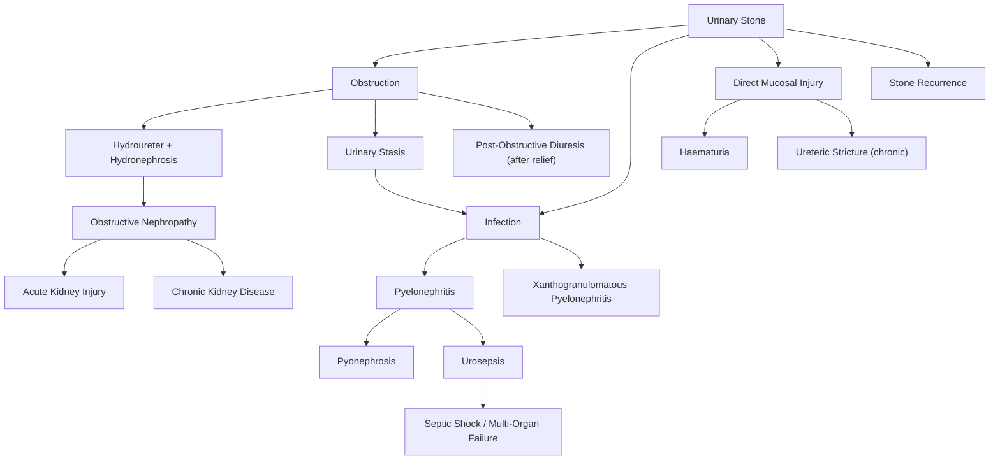

## Complications of Urinary Stones

Urinary stones can be thought of as causing harm through three fundamental mechanisms: **obstruction**, **infection**, and **direct tissue injury**. Every complication listed below stems from one — or a combination — of these three mechanisms. Understanding this triad from first principles lets you predict, recognise, and manage complications logically.

---

### 1. ***Infection: Pyelonephritis, Pyonephrosis, and Urosepsis*** [1][2]

#### Pathophysiology — from stone to sepsis

The chain of events:
1. A stone lodges in the ureter → **obstruction** → urine pools above the stone → **stasis**
2. Stagnant urine is an excellent culture medium → bacteria (from ascending UTI or haematogenous seeding) multiply unchecked
3. Bacteria ascend from the stagnant urine into the renal parenchyma → ***pyelonephritis*** (infection of the kidney)
4. If the collecting system fills with pus under pressure → ***pyonephrosis*** ("pyo" = pus, "nephros" = kidney) — this is essentially an empyema of the renal pelvis
5. Bacteria and endotoxins enter the bloodstream through the infected, inflamed, and congested renal parenchyma → ***urosepsis*** → can rapidly progress to **septic shock and multi-organ failure** if not decompressed

> This is the single most dangerous acute complication of urinary stones. An obstructed infected system is a **closed-space infection under pressure** — analogous to an undrained abscess. Antibiotics alone cannot sterilise a system where pus has no way out.

#### Clinical Features
- **Pyelonephritis**: high spiking fever, rigors, loin pain, renal angle tenderness (Murphy's kidney punch positive), nausea/vomiting, tachycardia, leukocytosis with left shift
- **Pyonephrosis**: similar to pyelonephritis but more toxic-appearing; may have palpable ballotable kidney due to massive distension with pus; ***requires urgent decompression*** [1] — this is the indication for PCN or JJ stent, ***NOT just pyelonephritis*** [1]
- **Urosepsis**: features of sepsis (fever/hypothermia, tachycardia, tachypnoea, hypotension, altered mental status, raised lactate) in the setting of urinary tract infection. Can evolve to **septic shock** with cardiovascular collapse

#### Management
- ***IV antibiotics*** — broad-spectrum (e.g., piperacillin-tazobactam, or ceftriaxone + metronidazole; cover Pseudomonas if healthcare-associated) guided by local sensitivities
- ***Urgent decompression*** by PCN (preferred in septic shock — quicker, bedside) or JJ stent [3]
- ***Definitive stone removal is deferred until sepsis has completely resolved*** [1]
- Resuscitation: IV fluids, inotropes if needed, ICU admission for multi-organ support

<Callout title="Pyonephrosis vs Pyelonephritis — Key Distinction" type="error">
***Pyonephrosis (pus under pressure in an obstructed collecting system) requires urgent drainage. Pyelonephritis alone (without obstruction) does NOT require drainage — antibiotics suffice.*** [1] The critical difference is whether there is obstruction. Always check for hydronephrosis on USG/NCCT in febrile patients with stones. Pyonephrosis = pus + obstruction = surgical emergency.
</Callout>

#### Xanthogranulomatous Pyelonephritis (XGP) [6]

This is a rare but important chronic complication, particularly relevant in Hong Kong exam material:

- ***A chronic destructive granulomatous process*** that typically occurs with long-standing obstruction (often by a staghorn calculus) + chronic infection
- ***Characterised by lipid-laden macrophages (xanthoma cells)*** — "xantho" = yellow (from lipid content), "granulomatous" = granuloma formation [6]
- ***CT shows classic "bear's paw" appearance*** — an enlarged non-functioning kidney with dilated calyces containing stones, surrounded by inflammatory tissue replacing normal parenchyma [6]
- The kidney is essentially destroyed and non-functional
- ***Treatment: nephrectomy*** — the kidney cannot be salvaged [6]

---

### 2. ***Obstruction: Hydroureter, Hydronephrosis, and Obstructive Nephropathy*** [1][2]

#### Pathophysiology — step by step

1. Stone lodges at a point of ureteric narrowing (PUJ, pelvic brim, VUJ) → partial or complete obstruction
2. Urine produced by the kidney cannot pass → **back-pressure** builds up
3. The ureter dilates upstream → ***hydroureter***
4. The renal pelvis and calyces dilate → ***hydronephrosis*** [2]
5. If obstruction persists, the rising intraluminal pressure is transmitted to the renal parenchyma → compresses the renal tubules and microvasculature → **ischaemia** + **direct pressure-induced tubular damage** → ***obstructive nephropathy***
6. ***Scarring around the stone or post-obstructive effects*** can maintain hydronephrosis even after the stone passes [2]

#### Acute vs Chronic

| Feature | Acute Obstruction | Chronic Obstruction |
|---------|------------------|-------------------|
| Duration | Hours to days | Weeks to months |
| Reversibility | Fully reversible if relieved promptly | May be irreversible if prolonged |
| Renal damage | Minimal if decompressed early | ***Cortical thinning, parenchymal atrophy, tubulointerstitial fibrosis*** |
| Clinical picture | Severe pain, acute hydronephrosis | May be painless (slowly progressive dilation), chronic hydronephrosis, progressive renal impairment |

#### Clinical Features of Hydronephrosis
- May be asymptomatic (especially if chronic and unilateral — the contralateral kidney compensates)
- Dull aching flank pain (from capsular distension)
- ***Rarely ballotable kidneys*** [3] (only in massive hydronephrosis/pyonephrosis)
- On imaging: dilated pelvicalyceal system on USG; perinephric stranding and dilated system on NCCT

#### Management
- Identify and relieve obstruction (PCN or JJ stent for urgent cases; definitive stone removal for the cause)
- Monitor renal function (serial RFT)
- ***Radioisotope scintigraphy (MAG3/DTPA)*** for differential renal function if prolonged obstruction → ***kidney with < 15% of total renal function is non-functional and not worth salvaging → consider nephrectomy*** [1]

---

### 3. ***Acute Kidney Injury (AKI)*** [1][2][7]

#### Pathophysiology

AKI from urolithiasis is a **post-renal** (obstructive) cause [7]:

- ***Urinary stones*** are listed as a cause of ***post-renal AKI*** due to obstructive uropathy [7]
- For a stone to cause clinically significant AKI, obstruction must be **bilateral**, or the stone must obstruct a **solitary functioning kidney** (e.g., the other kidney was previously removed or is congenitally absent/non-functional). Why? Because a single functioning kidney can maintain adequate GFR — unilateral obstruction alone rarely causes AKI
- Exception: bilateral staghorn calculi → bilateral obstruction → ***may present with chronic renal failure*** [3]
- ***However, prolonged post-renal disease will progress to become tubulointerstitial fibrosis, i.e., intrinsic renal disease*** [7] — so early decompression is critical

#### Clinical Features [7]
- ***Oliguria (< 0.5 mL/kg/h)***: important early sign
- ***↑ Creatinine, hyperkalaemia ± hyponatraemia***
- ***Fluid overload: oedema, hypertension***
- Anuria: complete bilateral obstruction

#### Management [7][8]
- ***Ensure and manage ABC***
- ***Consider and reverse post-renal disease***: palpable bladder, blocked catheter, hydronephrosis on imaging
- ***Urgent decompression*** (PCN or JJ stent)
- ***Management of life-threatening complications***:
  - ***Hyperkalaemia*** (K > 6 → ECG monitoring; IV calcium gluconate for membrane stabilisation, insulin-dextrose, salbutamol nebuliser, polystyrene sulphonate; dialysis if refractory)
  - ***Fluid overload*** (IV furosemide; dialysis if refractory)
  - ***Metabolic acidosis*** (IV bicarbonate; dialysis if refractory)
- ***Haemodialysis*** if indications met (AEIOU: Acidosis, Electrolytes, Intoxication, Overload, Uraemia) [8]

<Callout title="Post-Renal AKI is Reversible — If Caught Early">
***Recognising post-renal AKI is particularly important because it is often rapidly reversible compared to intrinsic renal disease*** [7]. A simple USG showing bilateral hydronephrosis + rising creatinine should trigger urgent decompression — the reward is restoration of renal function that would otherwise be permanently lost.
</Callout>

---

### 4. ***Post-Obstructive Diuresis*** [2][5]

This is a complication that occurs **after** the obstruction is relieved — an important concept to understand and anticipate.

#### Pathophysiology
- During prolonged obstruction, the kidney accumulates solute and water that it could not excrete
- Additionally, the high back-pressure damages the tubular concentrating mechanism (medullary washout, impaired aquaporin expression, decreased sodium reabsorption in the loop of Henle)
- When obstruction is relieved, two things happen simultaneously:
  1. **Physiological diuresis**: the kidney excretes the accumulated backlog of urea, sodium, and water — this is **appropriate** and self-limiting
  2. **Pathological diuresis**: damaged tubules cannot concentrate urine properly → massive, persistent, dilute urine output → risk of **dehydration, hypovolaemia, and electrolyte disturbances**

#### Definition [5]
- ***Post-obstructive diuresis: > 200 mL/h urine × ≥ 2 hours, or > 3 L urine in 24 hours*** [5]

#### Clinical Features and Risks
- ***Hyponatraemia, hypokalaemia, hypovolaemia*** [5]
- Dehydration, hypotension
- Can be life-threatening if not recognised and replaced

#### Management [2][5]
- ***Close monitoring of intake/output (chart urine output every 2 hours)*** [5]
- ***Fluid and electrolyte status monitoring with appropriate replacement and resuscitation*** [5]
- ***Prefer oral hydration; aim to replace half of urine output in the past hour*** [5]
- Do NOT over-replace — excessive IV fluids can perpetuate the diuresis. Match roughly 50–75% of urine output
- Usually resolves within 24–48 hours as tubular function recovers

---

### 5. ***Haematuria*** [2][3]

#### Pathophysiology
- The stone's rough surface (particularly ***calcium oxalate with its irregular "mulberry" shape and sharp projections*** [3]) directly traumatises the urothelium → bleeding
- Can be gross (visible red urine) or microscopic (detected on dipstick/microscopy)
- ***Haematuria is the single most discriminating predictor of kidney stone in unilateral flank pain (apart from passage of stones)*** [3]
- Present in ***~95% of symptomatic ureteric stone episodes*** [3]

#### Clinical Significance
- Usually self-limiting once the stone passes or is removed
- Persistent or significant haematuria after stone treatment may indicate:
  - Mucosal injury from instrumentation (URS, PCNL)
  - Residual stone fragments
  - Coexisting pathology (e.g., bladder cancer — ***always consider in patients > 35 with gross haematuria***)
- ***Haemorrhage ex-vacuo (transient haematuria)***: occurs after sudden emptying of a greatly distended bladder → ***bladder mucosal disruption with sudden emptying*** [5] — usually self-limiting, rarely significant

---

### 6. ***Chronic Kidney Disease (CKD)*** [4]

#### Pathophysiology
- ***Prolonged obstruction → tubulointerstitial fibrosis*** [7] → irreversible renal parenchymal damage → CKD
- Particularly relevant in:
  - **Bilateral staghorn calculi**: chronic bilateral obstruction → progressive loss of renal function
  - ***Nephrocalcinosis***: chronic deposition of calcium in the renal parenchyma (e.g., in hyperparathyroidism, distal RTA) → ***may result in CKD if chronic*** [4]
  - **Recurrent stones** with repeated episodes of obstruction and infection → cumulative scarring
- ***Primary hyperparathyroidism renal complications include: renal stone, nephrocalcinosis, tubular dysfunction, CKD*** [4]

---

### 7. ***Ureteric Stricture*** [1][3]

#### Pathophysiology
- Chronic impaction of a stone against the ureteric wall → persistent inflammation → fibrosis → **cicatricial narrowing** (stricture) of the ureteric lumen
- Also an iatrogenic complication of stone treatment: ***ureteric stricture is a late complication of URS (0.1%)*** [3]; can also occur after prolonged JJ stent placement or ESWL with steinstrasse
- Once a stricture forms, it becomes a new point of obstruction → predisposes to recurrent hydronephrosis and stone formation in a vicious cycle

#### Management
- Balloon dilatation (endoscopic)
- Endoureterotomy (incision of the stricture)
- Ureteric reimplantation (for distal strictures)
- Boari flap or ileal ureter interposition (for long strictures)

---

### 8. ***Complications of Stone Treatment Procedures***

These are iatrogenic complications that are important to know for exam purposes:

#### ESWL Complications [1]
| Complication | Mechanism |
|---|---|
| ***Incomplete fragmentation*** | Stone too hard (> 1000 HU) or too large for effective shock wave energy delivery |
| ***Steinstrasse ("stone street")*** | Multiple stone fragments stack in the ureter post-ESWL → ureteric obstruction. "Stein" = stone, "Strasse" = street (German) |
| ***Perinephric or subcapsular haematoma*** | Shock waves damage renal parenchymal microvasculature → bleeding into the perirenal space or under the renal capsule |
| ***Urosepsis*** | Fragmentation of an infected stone releases bacteria into the bloodstream |

#### PCNL Complications [1][3]
| Complication | Mechanism |
|---|---|
| ***Access failure (5%)*** | Cannot establish percutaneous tract into the collecting system |
| ***Bleeding requiring transfusion (7%)*** | Puncture through vascularised parenchyma; all renal arteries are end-arteries → no collateral compensation |
| ***Hydrothorax (15% if supracostal)*** | ***If the supracostal puncture tract traverses the lower pleura → irrigating fluid enters the pleural space*** [1] |
| ***Bowel perforation (< 1%)*** | ***5% of the population have a retrorenal colon*** → at risk during posterior access [3] |
| ***Urosepsis (fever 10%, sepsis 1%)*** | ***Flushing bacteria into the bloodstream*** during manipulation of infected stones [2] |
| ***Mortality (< 0.5%)*** | Cumulative risk from the above |

#### URS/RIRS Complications [1][3]
| Complication | Mechanism |
|---|---|
| ***Ureteral perforation (1.7%)*** | Scope or laser energy perforates the thin ureteric wall |
| ***Ureteral avulsion (0.1%)*** | Excessive traction during stone basket extraction tears the ureter off — catastrophic |
| ***Urosepsis (1.1%)*** | ***Endoscopic irrigation can force bacteria into renal parenchyma*** → bacteraemia [1] |
| ***Ureteric stricture (0.1%)*** | Late fibrosis from mucosal injury/thermal damage |
| ***Persistent VUR (0.1%)*** | Damage to the VUJ anti-reflux mechanism during instrumentation |

---

### 9. ***Recurrence*** [3]

#### Pathophysiology
- Urolithiasis is fundamentally a **chronic, recurrent disease** driven by underlying metabolic, dietary, and genetic predispositions that persist after the acute episode is treated
- Unless the modifiable risk factors are addressed, the same conditions that formed the first stone will form the next

#### Statistics [3]
- ***Risk of recurrence after 1st stone: ~15% at 1 year, 35–40% at 5 years, 50% at 10 years***
- This is precisely why **metabolic evaluation and secondary prevention** are essential — not optional

#### Prevention
- See Management section (Phase 3: Secondary Prevention) for detailed stone-type-specific measures

---

### Summary Table — Complications at a Glance

| Complication | Mechanism | Key Clinical Feature | Urgency |
|-------------|-----------|---------------------|---------|
| ***Urosepsis*** | Obstruction + infection → bacteria enter bloodstream | Fever, rigors, hypotension, tachycardia | **Emergency** — urgent decompression |
| ***Pyelonephritis*** | Ascending infection from stagnant urine | High fever, loin pain, renal angle tenderness | Urgent — antibiotics ± decompression |
| ***Pyonephrosis*** | Pus under pressure in obstructed collecting system | Toxic patient, ballotable kidney | **Emergency** — urgent drainage |
| ***XGP*** | Chronic obstruction + infection → granulomatous destruction | Non-functioning kidney, "bear's paw" on CT | Elective — nephrectomy |
| ***Hydronephrosis*** | Back-pressure from obstruction | May be painless if chronic; cortical thinning on imaging | Semi-urgent — decompress to preserve function |
| ***AKI*** | Bilateral obstruction or solitary kidney obstruction | Oliguria/anuria, rising Cr, hyperkalaemia | **Emergency** — urgent decompression |
| ***CKD*** | Prolonged/recurrent obstruction → tubulointerstitial fibrosis | Progressive ↓ GFR, small kidneys | Chronic — prevent further damage |
| ***Post-obstructive diuresis*** | Damaged tubular concentrating mechanism after relief | Massive urine output, electrolyte derangement | Monitor closely after decompression |
| ***Ureteric stricture*** | Chronic inflammation/fibrosis from impacted stone or instrumentation | Recurrent obstruction, hydronephrosis | Elective — endoscopic or surgical repair |
| ***Haematuria*** | Mucosal trauma by stone surface | Pink/red urine, positive dipstick | Usually self-limiting |
| ***Steinstrasse*** | Stone fragments pile up in ureter post-ESWL | Recurrent colic after ESWL | May need URS if symptomatic |
| ***Recurrence*** | Persistent underlying metabolic risk factors | Another stone episode | Long-term — metabolic evaluation + prevention |

---

<Callout title="High Yield Summary">

**Three fundamental mechanisms of stone complications**: Obstruction, Infection, Direct Tissue Injury.

**Most dangerous complication**: Urosepsis from an obstructed infected system → septic shock → multi-organ failure. Requires urgent decompression (PCN or JJ stent) + IV antibiotics. Never attempt definitive stone surgery until sepsis resolved.

**Pyonephrosis ≠ Pyelonephritis**: Pyonephrosis = pus under pressure in an obstructed system → requires drainage. Pyelonephritis without obstruction → antibiotics alone.

**AKI from stones is post-renal**: Requires bilateral obstruction or solitary kidney. Reversible if decompressed early. Prolonged obstruction → tubulointerstitial fibrosis → CKD (irreversible).

**Post-obstructive diuresis**: > 200 mL/h × 2h or > 3 L/day after relief of obstruction. Risk of dehydration and electrolyte disturbance. Monitor I/O closely; replace ~50% of urine output.

**XGP**: Chronic destruction by staghorn stone + infection → lipid-laden macrophages → "bear's paw" on CT → nephrectomy.

**Recurrence**: 50% at 10 years. Metabolic evaluation (24h urine) and secondary prevention are mandatory.

**Treatment complications to know**: ESWL → Steinstrasse, haematoma; PCNL → bleeding (7%), hydrothorax (supracostal), bowel perforation; URS → perforation, avulsion, stricture.

</Callout>

---

<ActiveRecallQuiz
  title="Active Recall - Complications of Urinary Stones"
  items={[
    {
      question: "Explain the pathophysiological chain from ureteric stone to urosepsis. Why is this a surgical emergency rather than a medical one?",
      markscheme: "Stone lodges in ureter causing obstruction, leading to urinary stasis. Stagnant urine promotes bacterial growth. Bacteria ascend to renal parenchyma causing pyelonephritis. If collecting system fills with pus under pressure (pyonephrosis), bacteria and endotoxins enter bloodstream causing urosepsis and potentially septic shock. It is a surgical emergency because it is a closed-space infection under pressure — antibiotics alone cannot sterilise the system without drainage. Urgent decompression (PCN or JJ stent) is essential.",
    },
    {
      question: "What is post-obstructive diuresis? Define it, explain the pathophysiology, and outline its management.",
      markscheme: "Definition: urine output greater than 200 mL/h for 2 or more hours, or greater than 3 L in 24 hours, following relief of urinary obstruction. Pathophysiology: accumulated solute and water are excreted (physiological); damaged tubules cannot concentrate urine due to medullary washout and impaired aquaporin expression (pathological). Risks: dehydration, hyponatraemia, hypokalaemia, hypovolaemia. Management: close I/O monitoring (chart Q2h), replace approximately 50% of hourly urine output, prefer oral hydration, monitor electrolytes. Avoid over-replacement which perpetuates diuresis.",
    },
    {
      question: "Why does unilateral ureteric obstruction NOT usually cause AKI, but bilateral obstruction does?",
      markscheme: "A single functioning contralateral kidney can compensate and maintain adequate GFR. Unilateral obstruction causes ipsilateral hydronephrosis and potential kidney damage but serum creatinine and overall GFR remain normal because the other kidney takes over. Bilateral obstruction (or obstruction of a solitary kidney) eliminates all functional nephron mass, causing post-renal AKI with rising creatinine, oliguria/anuria, and hyperkalaemia.",
    },
    {
      question: "What is xanthogranulomatous pyelonephritis? Describe its pathology, imaging appearance, and treatment.",
      markscheme: "XGP is a chronic destructive granulomatous inflammatory process of the kidney caused by long-standing obstruction (usually staghorn calculus) with chronic infection. Pathology: lipid-laden macrophages (xanthoma cells) replace normal renal parenchyma. Imaging: CT shows classic 'bear's paw' appearance — enlarged non-functioning kidney with stones inside dilated calyces surrounded by granulomatous tissue. Treatment: nephrectomy (kidney is non-salvageable).",
    },
    {
      question: "Name three complications specific to PCNL and explain the mechanism of each.",
      markscheme: "1. Bleeding requiring transfusion (7%): puncture traverses vascularised renal parenchyma; all renal arteries are end-arteries so injured vessels cannot be compensated by collaterals. 2. Hydrothorax (15% in supracostal approach): if the puncture tract crosses the lower pleura, irrigating fluid enters the pleural space. 3. Bowel perforation (less than 1%): 5% of the population have a retrorenal colon positioned behind the kidney, at risk during posterior percutaneous access. Also accept: urosepsis (flushing bacteria into bloodstream during stone manipulation), access failure (5%).",
    },
  ]}
/>

## References

[1] Senior notes: felixlai.md (Urological Diseases — Urinary Stones, Complications and Treatment sections)
[2] Senior notes: maxim.md (Section 2.3: Urinary stones — Complications, Management)
[3] Senior notes: Ryan Ho Urogenital.pdf (Section 7.2: Urolithiasis, pp. 137–143)
[4] Senior notes: Ryan Ho Endocrine.pdf (Primary Hyperparathyroidism — renal complications, p. 42)
[5] Senior notes: Ryan Ho Fundamentals.pdf (Post-obstructive diuresis, p. 353; Haemorrhage ex-vacuo, p. 353)
[6] Lecture slides: GC 210. Urinary tract infection.pdf (Xanthogranulomatous pyelonephritis — bear's paw, lipid-laden macrophages, p. 125)
[7] Senior notes: Ryan Ho Critical Care.pdf (AKI — post-renal causes including urinary stones, pp. 25–26)
[8] Senior notes: Ryan Ho Critical Care.pdf (Management of AKI — life-threatening complications and haemodialysis indications, p. 26)
