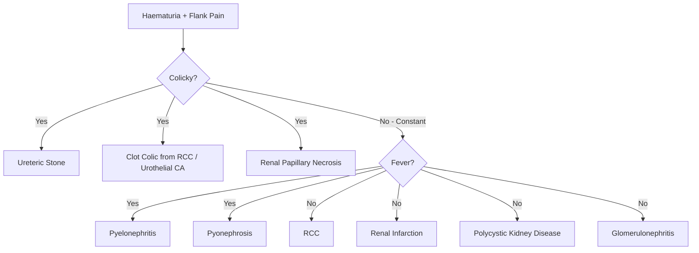
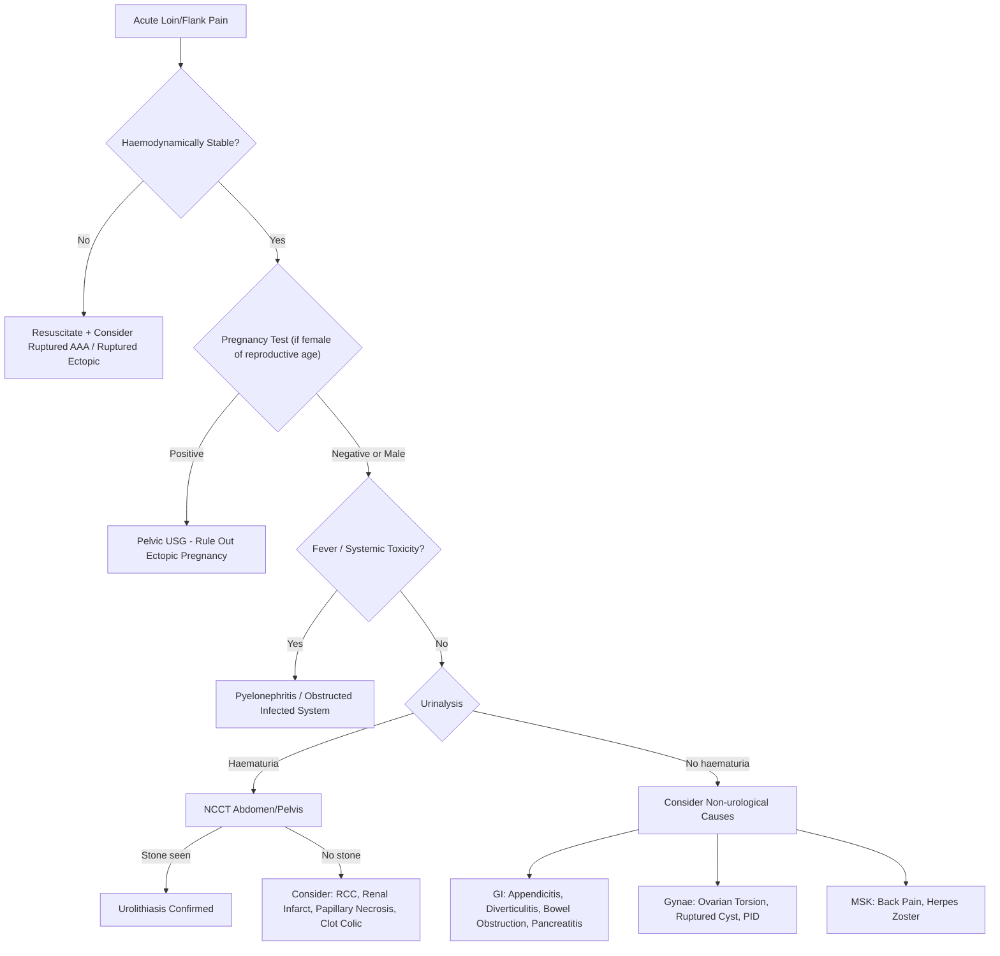

## Differential Diagnosis of Urinary Stones

### Framing the Problem

When a patient walks in with the "classic" presentation — acute loin pain, haematuria, nausea/vomiting — your brain immediately jumps to ureteric colic. And most of the time, you'll be right. But **the differential diagnosis of urinary stones is really the differential diagnosis of its presenting symptoms**: acute flank/loin pain, haematuria, and lower urinary tract symptoms. Several serious and time-critical conditions can mimic ureteric colic, and missing them can be catastrophic.

The approach is best organised by the **system of origin** — urological, abdominal/GI, vascular, and gynaecological — because different organ systems can produce overlapping pain patterns due to shared visceral innervation (T10–L2 dermatomes overlap between the ureter, appendix, ovary, colon, and retroperitoneal structures) [1][3].

---

### Systematic Differential Diagnosis

#### A. Urological System [1][3]

| Condition | Key Distinguishing Features | Why It Mimics Urolithiasis |
|-----------|---------------------------|---------------------------|
| ***Pyelonephritis*** | ***Frequently presents with fever, flank pain and pyuria. Fever is uncommon in patients with renal stones unless it is complicated*** [1]. High spiking fever, rigors, Murphy's kidney punch positive, systemic toxicity | Loin pain + haematuria + pyuria overlap. However, pyelonephritis has prominent **systemic upset** (fever, rigors, tachycardia) that uncomplicated stones do NOT cause. Pyuria can occur with stones (from urothelial irritation) but fever should not [1] |
| ***Renal cell carcinoma (RCC)*** | ***Bleeding within the kidney can produce blood clots which lodge temporarily in the ureter leading to renal colic*** [1]. Classic triad: painless haematuria, flank pain, palpable mass (rare — only ~10%). Constitutional symptoms (weight loss, anorexia). Paraneoplastic features: polycythaemia, hypercalcaemia, HTN [3] | **"Clot colic"** — haemorrhage from a renal tumour produces blood clots that enter the ureter and obstruct it, mimicking ureteric colic exactly. Key difference: ***glomerular bleeding does NOT lead to clot formation or symptoms of renal colic*** [1] — so if you see clots + colic, think urological source (tumour, not GN) |
| ***CA bladder*** | Painless gross haematuria (classic), irritative LUTS (frequency, urgency, nocturia), constitutional symptoms [3]. Risk factors: smoking, occupational exposure (dye/rubber workers), aristolochic acid in TCM [5] | Lower ureteric/bladder stones also cause irritative LUTS + haematuria. Key distinguisher: bladder cancer is usually **painless**, whereas VUJ stones cause pain. ***Painless gross haematuria in > 35 y/o = malignancy until proven otherwise*** [5] |
| ***UTI / Cystitis*** | Dysuria, frequency, urgency, suprapubic pain, cloudy/foul-smelling urine. **No fever or systemic upset** in simple cystitis [8] | Overlapping irritative LUTS. Key: cystitis has no flank colic, and urinalysis shows significant bacteriuria + nitrites (not just haematuria/pyuria). ***Sterile pyuria DDx includes: TB, bladder cancer (CIS), urinary tract stones, schistosomiasis, partially treated UTI, interstitial cystitis, ketamine cystitis*** [6] |
| ***Renal TB*** | Sterile pyuria (classic), chronic/recurrent "UTI" not responding to standard antibiotics, ***needs early morning urine (EMU) for TB*** [6]. Calcification of kidney (autonephrectomy). History of pulmonary TB or endemic exposure (important in Hong Kong) | Chronic loin pain + haematuria + pyuria can overlap with stone disease. TB can also **cause** calcification that mimics stones on imaging |
| ***Polycystic kidney disease*** | Bilateral flank masses, family history (autosomal dominant), insidious HTN, progressive CKD [3] | Cyst haemorrhage or cyst infection can cause acute flank pain ± haematuria, mimicking stones. Also, patients with ADPKD have an increased incidence of nephrolithiasis (~20%) |
| ***Renal papillary necrosis*** | Seen in diabetes, sickle cell disease, NSAID abuse, analgesic nephropathy. Sloughed papillae pass down the ureter → colic + haematuria. "Ring shadow" on IVU | Sloughed papilla literally acts like a stone — obstructs the ureter and causes identical symptoms. NCCT may show the papilla as a soft-tissue density, not a dense calcification |
| ***Renal infarction*** | Sudden severe loin pain, haematuria, raised LDH. Risk factors: AF (embolus), aortic surgery, hypercoagulable states [3] | Acute loin pain + haematuria. Key: no stone on CT; wedge-shaped non-enhancing area on contrast CT. LDH is markedly elevated |

<Callout title="Clot Colic vs Stone Colic" type="idea">
If a patient has ureteric colic with visible blood clots in the urine, consider a bleeding source above the stone — RCC, urothelial carcinoma, or AV malformation. True stone colic usually produces haematuria without formed clots (the urine is "smoky" or pink, not clotted). Clots forming in the ureter and passing as "worm-like" casts strongly suggest upper tract pathology beyond just a stone.
</Callout>

#### B. Abdominal / Gastrointestinal System [1][3]

This is the most dangerous overlap zone because several of these conditions are surgical emergencies:

| Condition | Key Distinguishing Features | Why It Mimics Urolithiasis |
|-----------|---------------------------|---------------------------|
| ***Acute appendicitis*** | Periumbilical pain migrating to RIF (McBurney's point), anorexia, low-grade fever, guarding/rebound tenderness, Rovsing's sign positive. May have mild pyuria (from adjacent ureteric inflammation) | Right-sided ureteric colic can mimic appendicitis and vice versa. Key: appendicitis has **peritoneal signs** (guarding, rebound) — ureteric colic typically does **NOT** have peritoneal signs [3]. Also, appendicitis causes the patient to lie still; renal colic makes the patient restless |
| ***Acute diverticulitis*** | Left-sided lower abdominal pain (sigmoid), fever, localised guarding, change in bowel habit. CT shows bowel wall thickening + fat stranding [9] | Left-sided ureteric stone can mimic sigmoid diverticulitis. Key: diverticulitis has **bowel-related features** (altered bowel habit, localised peritonism) and CT findings centred on the colon, not the ureter |
| ***Intestinal obstruction*** | Colicky central abdominal pain, vomiting (bilious if distal), absolute constipation, distension, tinkling/absent bowel sounds. AXR shows dilated loops with air-fluid levels | Both can cause colicky abdominal pain + vomiting. Key: bowel obstruction pain is **central/periumbilical**, not flank-to-groin; there is abdominal distension and abnormal bowel sounds. No haematuria |
| ***Abdominal aortic aneurysm (AAA)*** — ruptured or symptomatic | Sudden severe back/flank/abdominal pain, haemodynamic instability (hypotension, tachycardia), pulsatile abdominal mass. Risk factors: elderly male, smoker, HTN, known AAA | **This is the most dangerous mimic**. Ruptured AAA can present with sudden flank pain radiating to the groin — identical to ureteric colic. The patient may even have microscopic haematuria (from renal hypoperfusion). Key: **haemodynamic instability** is NOT a feature of uncomplicated stones. Always check BP and pulse in "renal colic." An elderly male with first presentation of "renal colic" and hypotension = ruptured AAA until proven otherwise |
| ***Acute cholecystitis / Biliary colic*** | RUQ pain radiating to right shoulder/scapula (phrenic nerve), Murphy's sign positive, association with fatty meals | Right renal colic can overlap anatomically with biliary pain. Key: biliary colic is usually RUQ/epigastric (not flank), associated with meals, and Murphy's sign is positive. USG differentiates easily |
| ***Acute pancreatitis*** | Epigastric pain radiating to the back, relieved by leaning forward, raised amylase/lipase, alcohol/gallstone history | Back pain component overlaps. Key: pancreatitis pain is **central/epigastric**, not unilateral; markedly elevated amylase/lipase clinches the diagnosis |
| ***Mesenteric ischaemia*** | Severe, poorly localised abdominal pain out of proportion to findings (like stones!), AF or vascular disease, raised lactate, metabolic acidosis | "Pain out of proportion to signs" is shared with renal colic. Key: mesenteric ischaemia patients are typically older with vascular risk factors, and develop peritoneal signs later. CT angiography is diagnostic |

<Callout title="The AAA Trap" type="error">
An elderly male presenting with "first episode of renal colic" who is haemodynamically unstable: **think ruptured AAA before ureteric stone**. Sending this patient for NCCT looking for stones while they are exsanguinating is a fatal error. Always assess haemodynamic stability first.
</Callout>

#### C. Gynaecological System (Women of Reproductive Age) [1]

| Condition | Key Distinguishing Features | Why It Mimics Urolithiasis |
|-----------|---------------------------|---------------------------|
| ***Ectopic pregnancy*** | Missed period / positive β-hCG, unilateral lower abdominal/pelvic pain, PV bleeding, adnexal tenderness/mass on bimanual examination. Haemodynamic instability if ruptured. ***Underlying cause of pain can be clarified by obtaining a renal or pelvic USG*** [1] | Lower ureteric colic can present as unilateral lower abdominal/groin pain in a young woman — exactly where an ectopic pregnancy presents. Key: **always do a pregnancy test (β-hCG) in any woman of reproductive age with acute lower abdominal pain** before imaging with CT (radiation risk!) |
| ***Ovarian torsion*** | Sudden severe unilateral lower abdominal/pelvic pain, nausea/vomiting, adnexal mass/tenderness, Doppler USG shows absent ovarian blood flow | Sudden unilateral pain + N/V can perfectly mimic distal ureteric colic. Key: no haematuria; pelvic USG shows enlarged ovary with absent blood flow |
| ***Ruptured ovarian cyst*** | Sudden onset lower abdominal pain (often mid-cycle), may have mild peritoneal irritation from fluid. Free fluid on USG | Similar acute onset. Key: timing with menstrual cycle, no haematuria, pelvic free fluid on imaging |
| ***Dysmenorrhoea*** | ***Rarely presents with flank pain that begins just before or concurrent with the onset of menstruation*** [1]. Crampy suprapubic pain, cyclical pattern | Usually easy to distinguish by its cyclical nature and timing with menses |
| ***Pelvic inflammatory disease (PID)*** | Bilateral lower abdominal pain, fever, cervical motion tenderness ("chandelier sign"), vaginal discharge | Bilateral lower abdominal pain is not typical for stones (which are unilateral). Vaginal discharge and sexual history provide clues |

#### D. Musculoskeletal / Other

| Condition | Key Distinguishing Features | Why It Mimics Urolithiasis |
|-----------|---------------------------|---------------------------|
| ***Musculoskeletal back pain*** | Paravertebral tenderness, worsened by specific movements/positions, no haematuria, no colicky pattern | Dull chronic flank ache from a non-obstructing renal stone can overlap. Key: no haematuria, normal NCCT |
| ***Herpes zoster (shingles)*** | Dermatomal vesicular rash (T10–L2), burning/lancinating pain preceding rash by days | Pre-rash phase can perfectly mimic flank pain. Key: wait for rash; no haematuria; no stone on imaging |
| ***Testicular torsion*** | Acute onset scrotal pain, nausea, absent cremasteric reflex, high-riding testis | Lower ureteric stones can cause referred pain to the scrotum/testis. Key: in torsion, the testis itself is abnormal on examination; in ureteric colic, the testis is normal but pain is referred there |

---

### Differential Diagnosis of Specific Stone Presentations

#### DDx of Haematuria with Flank Pain

#### DDx of Sterile Pyuria [6]

***Sterile pyuria*** (pyuria without bacteriuria on standard culture) is an important clinical scenario. The lecture slides specifically list this differential:

1. ***Tuberculosis*** — always send **early morning urine (EMU)** for TB culture/PCR [6]
2. ***Bladder cancer (carcinoma-in-situ)*** — can shed inflammatory cells without bacteria
3. ***Urinary tract stones*** — mechanical irritation of urothelium causes pyuria without infection
4. ***Schistosomiasis*** — important in patients from endemic areas (not common in HK but relevant for travellers)
5. ***Partially treated UTI*** — prior antibiotics have suppressed but not cleared the organism
6. ***Other inflammatory bladder conditions — interstitial cystitis, ketamine cystitis*** [6]

#### DDx on KUB — Calcification Mimics [3]

When you see a radio-opacity on KUB and wonder "is that a stone?", consider:

1. ***Calcified mesenteric lymph node*** — usually central, round, with a lucent centre ("eggshell")
2. ***Gallstone*** — usually radiolucent, but 10–15% are radio-opaque; located in RUQ, not along the ureteric course
3. ***Faecolith / Appendicolith*** — in the RIF, may mimic a distal right ureteric stone
4. ***Phlebolith*** — ***venous calcification*** in the pelvis; round with a central lucency, very common; the most frequent mimic of a distal ureteric stone on KUB
5. ***Ossified tip of 12th rib*** — can mimic an upper ureteric/PUJ stone
6. ***Nephrocalcinosis*** — diffuse medullary calcification (e.g., in RTA, hyperPTH), not a discrete stone
7. ***Calcified adrenal gland*** — TB, old haemorrhage, Addison's disease [3]

> **Tip**: If in doubt, compare the opacity's position with the known ureteric course (along transverse process tips → SIJ → ischial spine → VUJ). If the opacity lies outside this line, it's less likely to be a ureteric stone. NCCT resolves most ambiguity.

---

### Red Flags in the DDx — When to Reconsider "Just a Stone"

***Recurrent UTI with urease-producing organisms*** → ***may indicate underlying urolithiasis*** [6] (struvite stones from Proteus/Klebsiella). Conversely, if you diagnose stones, always check for concurrent infection.

***Recurrent bacterial persistence, especially with urease-producing organisms*** [6] should prompt stone workup.

***"Recurrent" UTI with gross haematuria or persistent microscopic haematuria*** → ***formal urologist referral required to rule out malignancy (requires cystoscopic assessment)*** [6].

***Recurrent UTI with pyuria but no growth*** → ***needs early morning urine (EMU) for TB; needs to rule out stone formation; is this ketamine cystitis?*** [6]

---

### Clinical Approach to the Differential — A Decision Framework

> The key decision points are: **(1) Haemodynamic stability** (rule out AAA, ruptured ectopic), **(2) Pregnancy status** (avoid CT, think ectopic), **(3) Fever** (infected system is a surgical emergency), **(4) Urinalysis** (haematuria points towards urological cause; its absence widens the DDx).

---

<Callout title="High Yield Summary">

**Three most dangerous mimics of renal colic to never miss:**
1. **Ruptured AAA** — elderly, hypotensive, pulsatile mass
2. **Ruptured ectopic pregnancy** — woman of reproductive age, positive β-hCG
3. **Obstructed infected system** — fever + stone = emergency decompression

**Key distinguishing features of ureteric colic vs peritoneal pathology:**
- Stones: symptoms OUT OF PROPORTION to signs, no peritoneal signs, patient RESTLESS
- Peritoneal causes (appendicitis, diverticulitis): peritoneal signs present (guarding, rebound), patient lies STILL

**Sterile pyuria DDx (lecture slide):** TB, bladder CIS, stones, schistosomiasis, partially treated UTI, interstitial cystitis, ketamine cystitis.

**Phleboliths** are the most common mimic of distal ureteric stones on KUB.

**Clot colic**: haematuria with formed clots passing down the ureter → think RCC or urothelial tumour, not just simple stone.

**Red flags for malignancy**: painless gross haematuria in > 35 y/o, constitutional symptoms, smoking history, occupational exposure.

</Callout>

---

<ActiveRecallQuiz
  title="Active Recall - Differential Diagnosis of Urinary Stones"
  items={[
    {
      question: "A 72-year-old male with known hypertension and smoking history presents with sudden-onset left flank pain radiating to the groin. His BP is 80/50 mmHg and pulse is 110. What is the most important diagnosis to exclude and why?",
      markscheme: "Ruptured abdominal aortic aneurysm (AAA). Elderly male, smoker, hypertensive with first-episode flank-to-groin pain AND haemodynamic instability (hypotension, tachycardia). Uncomplicated ureteric stones do not cause haemodynamic compromise. Immediate resuscitation and urgent CT angiography or emergency laparotomy required.",
    },
    {
      question: "List 4 differential diagnoses of sterile pyuria as covered in the UTI lecture.",
      markscheme: "Any 4 of: (1) Tuberculosis, (2) Bladder cancer (carcinoma-in-situ), (3) Urinary tract stones, (4) Schistosomiasis, (5) Partially treated UTI, (6) Other inflammatory conditions e.g. interstitial cystitis, ketamine cystitis.",
    },
    {
      question: "Explain the concept of 'clot colic' and how it differs from typical stone colic. What underlying pathology should you suspect?",
      markscheme: "Clot colic occurs when bleeding from an upper tract source (e.g., RCC or urothelial carcinoma) produces blood clots that enter and obstruct the ureter, mimicking ureteric colic. Unlike stone colic, clot colic is associated with visible formed blood clots in the urine. Glomerular bleeding does NOT produce clots because urokinase in the glomerular filtrate prevents clot formation. Suspect renal cell carcinoma or urothelial malignancy.",
    },
    {
      question: "Why does acute appendicitis NOT typically cause the patient to be restless, whereas ureteric colic does?",
      markscheme: "Appendicitis involves parietal peritoneal inflammation (somatic pain), which worsens with movement, so the patient lies perfectly still. Ureteric colic involves visceral pain from ureteric distension/peristalsis, which is not worsened by movement. The patient instinctively tries different positions to find relief, resulting in restlessness. Additionally, stones cause no peritoneal signs (no guarding, no rebound).",
    },
    {
      question: "A 28-year-old woman presents with sudden left lower abdominal pain and microscopic haematuria. What must you do before ordering a CT scan, and why?",
      markscheme: "Perform a pregnancy test (serum or urine beta-hCG). Must rule out ectopic pregnancy in any woman of reproductive age with acute lower abdominal pain, because: (1) CT involves ionising radiation harmful to an early pregnancy, (2) ruptured ectopic is a life-threatening emergency requiring different management. If positive, proceed with pelvic ultrasound instead of CT.",
    },
  ]}
/>

## References

[1] Senior notes: felixlai.md (Urological Diseases — Urinary Stones, DDx section)
[3] Senior notes: Ryan Ho Urogenital.pdf (Section 7.2: Urolithiasis, pp. 137–139; DDx of renal stone on KUB p. 139)
[5] Senior notes: Ryan Ho Fundamentals.pdf (Section 3.5.1: Haematuria, pp. 340–344)
[6] Lecture slides: GC 210. Urinary tract infection.pdf (Sterile pyuria DDx p. 32; Red flags p. 69; Xanthogranulomatous pyelonephritis p. 125)
[7] Senior notes: Ryan Ho Critical Care.pdf (AKI — Post-renal causes, p. 25)
[8] Senior notes: Ryan Ho Urogenital.pdf (Section 6.2.2: Acute Cystitis DDx, p. 125)
[9] Senior notes: felixlai.md (Acute Diverticulitis)
