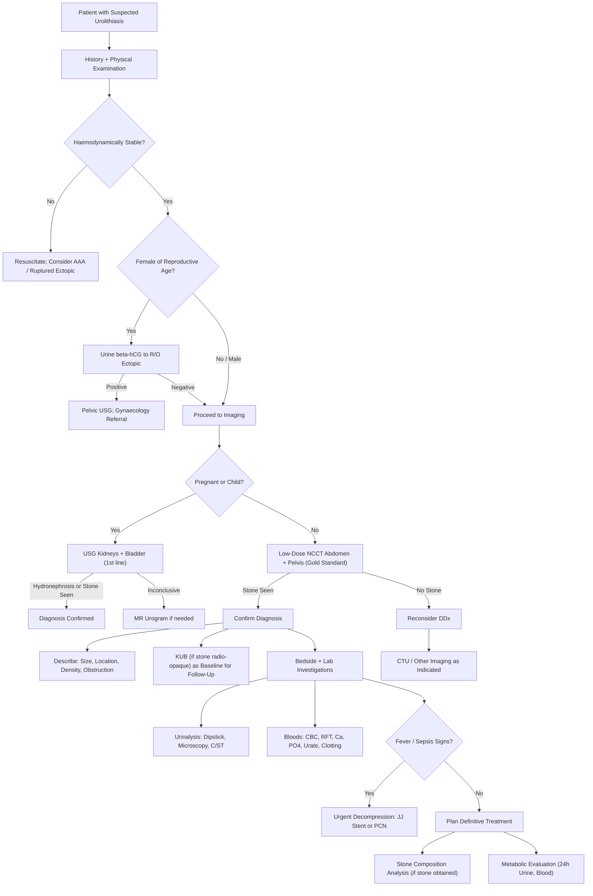

## Diagnostic Criteria, Algorithm, and Investigations for Urinary Stones

### Diagnostic Criteria — Establishing the Diagnosis

Unlike many medical conditions (e.g., rheumatic fever with Jones criteria, or SLE with ACR/EULAR criteria), urolithiasis does **not** have a formal set of "diagnostic criteria" with scoring systems. Instead, the diagnosis is established by a combination of:

1. **Clinical presentation** (history and physical examination)
2. **Confirmation by diagnostic imaging** (the definitive step)
3. **Supportive laboratory findings**

In practice, the diagnosis of an acute ureteric stone is made when all three components converge:

| Component | What Establishes Diagnosis | Explanation |
|-----------|--------------------------|-------------|
| **History** | Acute colicky loin-to-groin pain + haematuria ± N/V ± irritative LUTS | The clinical picture is highly suggestive but not pathognomonic — many conditions can mimic it (see DDx section) |
| **Physical Examination** | Symptoms out of proportion to signs, renal angle tenderness, no peritoneal signs, restlessness [3] | Helps narrow the differential and exclude surgical abdomen |
| ***Diagnostic Imaging*** | ***Direct visualisation of the stone on imaging (NCCT is the gold standard)*** [1][2][3] | **This is the definitive diagnostic step**. A stone must be SEEN on imaging to confirm the diagnosis. Clinical suspicion alone is insufficient for treatment planning |
| **Urinalysis** | Haematuria (gross or microscopic), ± pyuria, ± crystals | Supportive but not diagnostic — haematuria is absent in ~15% of confirmed stones (if completely obstructed, no urine flows past the stone to carry RBCs). Pyuria can be reactive |
| **Blood Tests** | CBC, RFT, Ca²⁺, PO₄³⁻, urate | For assessing complications (infection, renal impairment) and underlying causes — not diagnostic of the stone itself |

<Callout title="Diagnosis = Imaging" type="idea">
The bottom line: you cannot diagnose a urinary stone without imaging. A patient with classic renal colic but no stone on NCCT does NOT have a confirmed stone — you must rethink the differential.
</Callout>

---

### The Clinical Approach — A Step-by-Step Framework

***The clinical approach to urolithiasis involves four sequential steps*** [3]:

1. ***Establish the diagnosis*** based on history, physical examination, and ***diagnostic imaging (most important)***
2. ***Acute treatment***: conservative vs ESWL vs PCNL vs URS ± JJ stent
3. ***Establish the type of stone*** based on:
   - ***Stone composition analysis*** if stone is collected
   - ***Metabolic evaluation*** to evaluate underlying metabolic predisposing factors
4. ***Secondary prevention*** based on underlying predisposing factors

This section focuses on **Steps 1 and 3** (diagnosis and metabolic evaluation). Steps 2 and 4 will be covered in the Management section.

---

### Diagnostic Algorithm

---

### Investigation Modalities — Detailed Breakdown

The investigations for urolithiasis serve three purposes:
1. **Confirm the stone and plan treatment** (imaging)
2. **Assess for complications** (infection, obstruction, renal impairment)
3. **Identify the underlying cause/stone type** (metabolic workup)

---

#### A. Imaging Investigations

##### 1. ***Non-Contrast CT Abdomen + Pelvis (NCCT)*** — ***THE GOLD STANDARD*** [1][2][3]

This is the ***imaging modality of choice (1st line)*** in patients with urinary stones [1].

**Why NCCT and not contrast CT?**
- Stones are dense mineral concretions — they show up brilliantly on non-contrast CT as bright white (hyperdense) foci against the soft-tissue background
- Adding IV contrast would opacify the renal collecting system with dense contrast material, potentially **obscuring** small stones within the bright contrast column
- NCCT also avoids the risks of contrast (nephrotoxicity, allergic reactions) — particularly important in the acute setting where renal function may already be compromised by obstruction

**What NCCT tells you** [1][2][3]:

| Parameter | Clinical Significance |
|-----------|----------------------|
| ***Size of stone*** | Determines treatment: < 5 mm likely to pass spontaneously; > 10 mm likely needs intervention |
| ***Location of stone*** | Upper, mid, or lower ureter; renal pelvis; calyceal — determines choice of procedure |
| ***Stone density (Hounsfield Units, HU)*** | ***> 1000 HU is considered hard*** [2] (likely calcium oxalate monohydrate or brushite) → ESWL may be less effective; ***< 1000 HU predicts success of ESWL*** [5]. ***Calcium stones: densest. Struvite stones: less dense. Urate stones: least dense*** [3] |
| ***Signs of obstruction*** | ***Ureteral dilatation, collecting system dilatation (hydronephrosis), perinephric stranding*** [1][3] — perinephric stranding occurs because obstructed urine leaks into the retroperitoneal fat surrounding the kidney, causing oedema visible as haziness/"streaking" around the kidney |
| ***Bilateral calcification at corticomedullary junction*** | Suggests ***medullary sponge kidney*** [1] |
| ***Large calculus in renal pelvis*** | Suggests ***struvite stone*** [1] |
| ***Number of stones*** | Affects treatment strategy (single vs multiple) |

**Performance**: ***Sensitivity 97%, Specificity 95%*** [3] — far superior to any other modality. ***May be less reliable for small stones < 2 mm*** [3].

***Even if KUB is negative, it has to be followed up with NCCT as KUB misses 10% of stones*** [1].

> ***Indinavir-induced stones are soft tissue density on CT → cannot be seen on CT → often missed*** [3]. This is the exception to the rule that NCCT catches everything.

<Callout title="NCCT — First and Foremost">
In the exam, if asked "What is the single best investigation for suspected ureteric colic?" → **Low-dose non-contrast CT abdomen and pelvis**. It confirms the stone, shows its size/location/density, demonstrates obstruction, and excludes alternative diagnoses — all without contrast.
</Callout>

##### 2. ***KUB (Plain Radiograph of Kidneys, Ureters, and Bladder)*** [1][3][5]

**Role**: ***Usually for screening only*** [3] and as a ***baseline for future follow-up*** [1][3].

**Why still do KUB if NCCT is better?**
- KUB is cheap, quick, and low-radiation
- ***If a stone is confirmed on NCCT and is radio-opaque, a KUB is taken as a baseline*** — future follow-up of stone size/passage can be done with KUB alone instead of repeating NCCT every time (reducing radiation exposure) [1]
- ***Do not perform NCCT every time for follow-up*** [1]

**What KUB shows**:
- ***~90% of stones are radio-opaque*** [3][5] — calcium-containing stones (CaOx, CaPO₄) are the most visible, struvite is moderately visible, cystine is faintly visible
- ***Radiolucent stones (invisible on KUB): urate, xanthine, indinavir*** [3]
- ***Mildly radio-opaque: cystine, struvite*** [3]

**Limitations** [1][3]:
- ***Only detects 29–59% of stones seen on NCCT*** — misses small stones (< 5 mm) and those overlying bony structures
- ***Unable to detect urinary tract obstruction*** [1] (cannot see hydronephrosis)
- Cannot detect radiolucent stones
- Stones can be confused with: ***calcified mesenteric lymph nodes, gallstones, faecolith/appendicolith, phleboliths, ossified tip of 12th rib, nephrocalcinosis, calcified adrenal gland*** [3]

**How to read stones on KUB** — ***trace the ureteric course*** [1][3][5]:
- ***Travels along the medial aspect of the psoas muscle and lies anterior and slightly medial to the tip of the L2–L5 transverse processes*** [1]
- ***Enters the pelvis anterior to the SI joint at the bifurcation of the common iliac vessels*** [1]
- ***Courses anteriorly down the lateral pelvic sidewall***
- ***Turns forward and medially at the level of the ischial spine*** and enters the posterolateral wall of the bladder [1]

##### 3. ***Ultrasound (USG) Kidneys and Bladder*** [1][2][3]

**Role**: ***Acceptable initial screening test, particularly for patients who should avoid radiation including pregnant women and women of childbearing age*** [1]. Also ***preferred in pregnancy or children*** [3].

**What USG can detect**:
- ***Hydronephrosis*** (dilated pelvicalyceal system — indirect sign of obstruction)
- ***Renal stones*** (echogenic foci with posterior acoustic shadowing)
- ***Bladder stones*** (if large enough)
- ***Cortical thinning*** due to chronic obstruction [5]
- ***Prostate size*** measurement (relevant for bladder stones associated with BPH)

**What USG cannot do well**:
- ***Difficulty in defining ureteric lesions*** — only the proximal (PUJ region) and distal (VUJ region) ends of the ureter are visualised; the mid-ureter is obscured by overlying bowel gas [5]
- ***Limited sensitivity — 57% only*** [3]
- ***Does not see ureteric stones but demonstrates obstruction*** [3]
- Cannot determine stone density or composition

> Use USG as the first-line test in **pregnancy** and **paediatrics**, and as a bedside screening tool. If positive for hydronephrosis in a non-pregnant adult, proceed to NCCT for definitive characterisation.

##### 4. ***CT Urogram (CTU)*** [1][3][5]

**What it is**: A multi-phase contrast-enhanced CT scan specifically designed for urinary tract evaluation. ***CTU has largely replaced IVU*** [5].

**Phases** [5]:
- ***Pre-contrast phase***: for gross anatomy — detects stones (same as NCCT)
- ***Corticomedullary (arterial) phase***: for renal perfusion and vasculature
- ***Nephrographic (venous) phase***: for assessment of renal parenchyma (detecting ***renal tumours***)
- ***Excretory (delayed/pyelographic) phase***: for visualisation of the lower urinary tract (detecting ***urothelial tumours***)

**When to use in stone disease** [1][3]:
- ***Evaluating the pelvicalyceal system*** for complex anatomy or recurrent stones
- ***Complex stones or urinary system anatomy*** [3]
- **Not for routine acute loin pain evaluation** [3] — NCCT is sufficient
- ***Reflects renal function while evaluating for gross anatomical abnormalities*** [1]

**Disadvantages**: ***↑↑ radiation, contrast allergy/nephropathy*** [5]

##### 5. ***Dual Energy CT (DECT)*** [2]

**What it is**: A specialised CT technique that acquires images at two different X-ray energy levels simultaneously. Different stone compositions attenuate X-rays differently at different energies, allowing ***differentiation of stone composition*** [2] in vivo without needing to retrieve the stone.

**Clinical utility**: Distinguishing uric acid stones (which can be dissolved medically) from calcium stones (which cannot) — this changes management.

##### 6. ***Intravenous Urogram (IVU)*** [5][10]

**What it is**: IV non-ionic contrast injected → excreted by kidneys → opacifies and visualises urinary system on serial plain films.

***IVU has been largely replaced by CTU*** [5][10], but understanding it is still relevant for exams.

**Preparation** [10]:
- ***Laxatives → ↓ faecal matter (↑ contrast visualisation)***
- ***Fasting ≥ 4h***
- ***Hydration → ↑ distension of urinary collecting system***
- ***Preliminary KUB → may already give diagnosis***
- ***Compression band → distend pelvicalyceal system for evaluation***

**Procedure timing** [10]:
- ***0 min → kidneys highlighted (nephrogram)***
- ***5 min → calyces and renal pelvis***
- ***10 min → ureter and urinary bladder***

**Stone findings on IVU** [5]:
- ***Filling defect, proximal dilatation, ↓ distal passage of contrast***
- ***Hydroureter and hydronephrosis***

**Contraindications** [10]:
- ***Pregnancy (radiation)***
- ***Previous history of serious reactions to contrast media***
- ***Diabetes with renal insufficiency (risk of acute renal failure)***

##### 7. ***Radionuclide Scintigraphy (MAG3 / DTPA Renogram)*** [1]

**What it is**: Injection of radioisotope ***technetium Tc-99m MAG3*** (mercaptoacetyltriglycine) to assess renal excretory function. Provides **both anatomical and functional information**.

**When to use in stone disease** [1]:
- ***Indicated in patients presenting with complications due to prolonged obstruction and requiring measurement of renal function***
- ***Differentiates between obstructive and non-obstructive hydronephrosis*** — by adding a "diuretic stimulus" (furosemide) and watching whether the tracer washes out (non-obstructive) or is retained (obstructive)
- ***Identifies difference in function between two kidneys*** — **differential renal function**

**Critical for surgical planning** [1]:
- ***Kidney with < 15% of total renal function (normal 50% each side) is non-functional and not worth salvaging***
- ***Proceed to PCNL for preserved functional kidney function whereas nephrectomy may be indicated for non-functional kidney***

> A MAG3 renogram is not for diagnosing a stone — it's for deciding what to do about a kidney that's been damaged by a stone.

##### 8. ***MR Urogram (MRU)*** [5]

**Role**: Alternative when CT and IVU are contraindicated — ***pregnancy, contrast allergy, children, renal impairment*** [5].

**Limitations**: ***Less able to detect smaller urothelial lesions and non-obstructing stones*** [1]. ***Image inferior to CT scan (because the kidney is a moving organ)*** [5]. ***Expensive*** [5].

##### 9. ***Retrograde Pyelogram*** [5]

**What it is**: Injection of contrast via a catheter placed in the ureteric orifice during cystoscopy → outlines the ureter and pelvicalyceal system retrogradely.

**When to use**: ***When excretion of contrast cannot be used to outline the urological tract (e.g., poor renal function)*** [5]. Can intervene at the same time (e.g., insertion of JJ stent) [3].

**Invasive**: Requires cystoscopy under anaesthesia.

---

#### Summary of Imaging Modalities

| Modality | Sensitivity | Key Advantage | Key Limitation | When to Use |
|----------|------------|---------------|----------------|------------|
| ***NCCT*** | ***97%*** | Gold standard; size, location, density, obstruction; no contrast needed | Radiation; misses indinavir stones; < 2 mm stones | ***First-line for all suspected ureteric colic*** [1][3] |
| ***KUB*** | 29–59% | Cheap, quick, baseline for F/U | Misses radiolucent + small stones; no obstruction assessment | ***Baseline for follow-up after NCCT confirms stone*** [1][3] |
| ***USG*** | ***57%*** | No radiation; bedside; detects hydronephrosis | Cannot see ureteric stones; limited sensitivity | ***Pregnancy, paediatrics, screening*** [3] |
| ***CTU*** | ~97% | Full anatomical assessment; detects tumours and anomalies | High radiation + contrast risks | ***Complex anatomy, recurrent stones, haematuria workup*** |
| ***DECT*** | Similar to NCCT | Can differentiate stone composition in vivo | Availability, slightly higher radiation | ***When stone composition affects management*** [2] |
| ***IVU*** | ~70% | Functional information; economic | Largely obsolete; contrast risks; misses small lesions | ***Rarely used now*** [5][10] |
| ***MAG3 renogram*** | N/A | Differential renal function | Does not diagnose stones | ***Prolonged obstruction; surgical planning*** [1] |
| ***MRU*** | Variable | No radiation, no contrast | Misses small stones, expensive, inferior resolution | ***Pregnancy, children, contrast allergy*** [5] |

---

#### B. Laboratory Investigations

##### 1. Urinalysis [1][2][3]

This should be done in **every patient** with suspected urolithiasis. It serves multiple roles:

| Test | What to Look For | Clinical Significance |
|------|-----------------|----------------------|
| ***Dipstick*** | Blood (haem), WBCs, nitrites, pH | Haematuria supports stone diagnosis; ***nitrites + WBCs suggest UTI***; ***pH is important — overly alkaline urine (> 7.5) suggests infection by urease-producing organism, especially in the presence of stones*** [6] |
| ***Microscopy*** | RBCs, WBCs, crystals, organisms | ***Haematuria (gross or microscopic)*** present in ~85% [3]; ***pyuria can be present without infection due to irritation of urothelium*** [3]; crystal morphology may suggest stone type (hexagonal = cystine, coffin-lid = struvite, envelope = CaOx dihydrate, rhomboid = uric acid) |
| ***Urine pH*** | Acidic vs alkaline | ***Acidic (pH < 5.5)***: uric acid, cystine stones. ***Alkaline (pH > 7.5)***: struvite, calcium phosphate stones [6] |
| ***Culture and sensitivity (C/ST)*** | Organisms, antibiotic sensitivity | ***Must rule out UTI before any definitive treatment*** [2]; identifies urease-producing organisms (Proteus, Klebsiella) suggesting struvite stones |

<Callout title="Always Culture Before Operating" type="error">
***MSU C/ST to rule out UTI before any definitive treatment*** [2]. Operating on an infected stone without antibiotics can seed bacteria into the bloodstream → urosepsis. A positive culture mandates antibiotics before/during the procedure.
</Callout>

##### 2. Blood Tests [1][2][3]

| Test | Rationale | Key Findings |
|------|-----------|-------------|
| ***CBC with differentials*** | Detect infection (leukocytosis); anaemia if chronic; baseline before surgery | ***Mild leukocytosis*** may be present even without infection (stress response). Marked leukocytosis with left shift suggests pyelonephritis/urosepsis [1] |
| ***Clotting profile*** | ***Preoperative baseline to look for underlying bleeding diathesis*** [1] — needed before ESWL, PCNL, or URS | Must be checked before any interventional procedure |
| ***RFT (Renal Function Tests)*** | Detect obstructive nephropathy; baseline Cr/eGFR | ***Rarely impaired in unilateral obstruction*** [3] — because the contralateral kidney compensates. ***May be impaired if bilateral staghorn calculi or solitary kidney*** [3] |
| ***Serum calcium and phosphate*** | Screen for ***primary hyperparathyroidism*** (the most important metabolic cause) [3][4]; also sarcoidosis, malignancy | ↑ Ca²⁺ + ↓/normal PO₄³⁻ + ↑ PTH = primary hyperPTH. Check ***albumin-corrected calcium*** to avoid factitious hypercalcaemia [4] |
| ***Serum uric acid (urate)*** | Screen for ***hyperuricaemia*** — gout, myeloproliferative disease, high purine diet | ↑ Urate supports uric acid stone diagnosis; also a risk factor for calcium stones (uric acid crystals act as a nidus) |
| ***PTH*** | If calcium is elevated — distinguish PTH-dependent from PTH-independent hypercalcaemia [4] | ↑ or inappropriately normal PTH with ↑ Ca = primary hyperPTH |
| ***Serum bicarbonate*** | Screen for ***distal RTA (Type 1)*** — chronic metabolic acidosis → ↓ citrate → calcium phosphate stones [3] | Low bicarbonate with hyperchloraemic metabolic acidosis + alkaline urine pH (inability to acidify) = distal RTA |
| ***CRP*** | Acute-phase reactant for infection/inflammation | Elevated in pyelonephritis/urosepsis |

##### 3. Stone Composition Analysis [3]

When a stone is **retrieved** (after spontaneous passage, or during surgical procedure), it should **always be sent for composition analysis**:

- ***Methods: Infrared spectroscopy (IRS) or X-ray diffraction (XRD)*** [3]
- ***Obtain stone by stone retrieval procedure or by patient when they pass stones*** [3]

**Clinical relevance of stone composition** [3]:
- ***Calcium oxalate monohydrate / brushite are hard stones and may not be fragmented as easily with ESWL***
- ***Uric acid stone indicates acidic urine and alkalinisation of urine may be helpful***
- ***May suggest underlying conditions*** — e.g., Type 1 RTA / hyperPTH in calcium phosphate stones; upper UTI in struvite stones

> Always instruct patients to strain their urine through a sieve/filter after an episode of renal colic. If they catch a stone, it must be sent to the laboratory. This small step can change the entire management plan.

##### 4. Metabolic Evaluation — ***Follow-Up Assessment for Underlying Risk Factors (Secondary Prevention)*** [3]

This is done **after the acute episode is managed**, particularly in:
- First-time stone formers with risk factors
- **All recurrent stone formers**
- Children/young adults with stones
- Patients with specific stone types (cystine, uric acid, struvite)

| Investigation | What It Assesses | Key Findings |
|--------------|-----------------|-------------|
| ***Serum calcium*** | ***Primary hyperparathyroidism*** (most important medical cause) [3] | ↑ Ca → check PTH → if ↑/inappropriately normal → primary hyperPTH |
| ***Serum bicarbonate*** | ***Distal RTA*** [3] | ↓ HCO₃⁻ + normal anion gap metabolic acidosis + alkaline urine → Type 1 RTA |
| ***Urine pH*** | Guides stone type prediction | ***↑ pH in phosphate and struvite stones; ↓ pH in uric acid stones*** [3] |
| ***Urine crystals*** | Morphological clue to stone type | Oxalate, phosphate, uric acid, cystine (hexagonal — pathognomonic) |
| ***24-hour urine collection*** | Comprehensive metabolic profile | ***Calcium, uric acid, citrate, oxalate, sodium, potassium, creatinine excretion, volume, pH, specific gravity*** [3]. This is the cornerstone of secondary prevention — identifies which metabolic abnormality to target |

**24-Hour Urine — Key Abnormalities and Their Implications**:

| Abnormality | Target Value | Implication |
|-------------|-------------|-------------|
| Hypercalciuria | > 7.5 mmol/day (M) or > 6.25 mmol/day (F) | Idiopathic (most common), hyperPTH, sarcoidosis, RTA |
| Hyperoxaluria | > 0.5 mmol/day | Dietary (common), enteric (IBD, bariatric surgery), primary (rare genetic) |
| Hyperuricosuria | > 4.8 mmol/day (M) or > 4.5 mmol/day (F) | High purine diet, gout, myeloproliferative disease |
| Hypocitraturia | < 1.7 mmol/day | Metabolic acidosis (RTA, chronic diarrhoea), high animal protein diet, idiopathic |
| Low urine volume | < 2 L/day | Inadequate fluid intake — the most modifiable risk factor |
| High urine sodium | > 200 mmol/day | High dietary sodium → competes with Ca for tubular reabsorption → hypercalciuria |
| Cystinuria | > 1.3 mmol/day | Autosomal recessive cystinuria — COLA amino acids |

---

#### C. Special Situations

##### When the Patient Has Gross Haematuria (Not Just Stone Workup)

***Cystoscopy should be done in ALL patients with gross non-glomerular haematuria, even if a stone is found on KUB*** [5]. Why? ***Because the presence of stones does not rule out concomitant malignancy*** [5]. A bladder transitional cell carcinoma can coexist with a ureteric stone, and cystoscopy is the only way to directly visualise the bladder mucosa for tumours as small as 1 mm [5].

> ***CTU + cystoscopy is mandatory*** for the complete haematuria workup [5]. The standard urological workup for haematuria = **cystoscopy + upper tract imaging**.

##### When Renal Function is Impaired

If renal function is compromised (suspect bilateral obstruction or solitary kidney):
- ***USG first*** to detect hydronephrosis → if bilateral → urgent decompression
- ***Radioisotope scintigraphy (MAG3)*** for differential renal function → guides surgical planning [1]

---

### Putting It All Together — Investigation Checklist for Acute Urolithiasis

| Category | Investigation | Purpose |
|----------|--------------|---------|
| **Imaging (acute)** | ***Low-dose NCCT abdomen + pelvis*** | Confirm stone; size, location, density, obstruction |
| **Imaging (baseline)** | ***KUB (if stone radio-opaque)*** | Baseline for future follow-up without repeating CT |
| **Imaging (special)** | ***USG*** (if pregnant/child/screening) | Detect hydronephrosis; limited stone detection |
| **Urine** | ***Dipstick + microscopy*** | Haematuria, pyuria, pH |
| **Urine** | ***MSU C/ST*** | ***Rule out UTI before definitive treatment*** |
| **Blood** | ***CBC, CRP*** | Infection, baseline |
| **Blood** | ***Clotting profile*** | Pre-procedural |
| **Blood** | ***RFT*** | Renal function; bilateral obstruction |
| **Blood** | ***Serum calcium, phosphate*** | Hyperparathyroidism screening |
| **Blood** | ***Serum urate*** | Hyperuricaemia screening |
| **Stone** | ***Composition analysis (IR spectroscopy / XRD)*** | Determines stone type → guides prevention |
| **Follow-up** | ***24-hour urine collection*** | Metabolic evaluation for secondary prevention |
| **Special** | ***MAG3 renogram*** | Differential renal function if prolonged obstruction |
| **Special** | ***DECT*** | In vivo stone composition differentiation |

---

<Callout title="High Yield Summary">

**Gold standard imaging**: Low-dose NCCT abdomen + pelvis (Sensitivity 97%, Specificity 95%). No contrast needed — stones are inherently hyperdense.

**KUB role**: NOT for diagnosis — for follow-up baseline. 90% of stones are radio-opaque. Radiolucent stones (uric acid, xanthine, indinavir) are invisible on KUB.

**USG role**: First-line in pregnancy/children. Limited sensitivity (57%). Good for hydronephrosis, poor for ureteric stones.

**Urine pH is diagnostic gold**: pH > 7.5 with stones → think struvite (urease-producing infection). pH < 5.5 → think uric acid.

**Always send MSU C/ST** before any intervention — operating on infected stones without antibiotics → urosepsis.

**Always send the stone for composition analysis** (IR spectroscopy or XRD) — it determines secondary prevention strategy.

**MAG3 renogram** for differential renal function: kidney < 15% function → not worth salvaging → consider nephrectomy.

**24-hour urine** is the cornerstone of metabolic evaluation: calcium, oxalate, urate, citrate, sodium, volume, pH.

**Screen for primary hyperPTH** (serum Ca + PTH) in every calcium stone former — it is the most important treatable medical cause.

</Callout>

---

<ActiveRecallQuiz
  title="Active Recall - Diagnosis and Investigations for Urinary Stones"
  items={[
    {
      question: "What is the gold standard imaging for suspected ureteric colic? State its sensitivity and specificity, and explain why contrast is NOT used.",
      markscheme: "Low-dose non-contrast CT abdomen + pelvis (NCCT). Sensitivity 97%, Specificity 95%. No contrast needed because: (1) stones are inherently hyperdense and visible without contrast; (2) contrast opacifying the collecting system could obscure small stones; (3) avoids contrast risks (nephrotoxicity, allergy) in a patient who may already have obstructive renal impairment.",
    },
    {
      question: "A stone is confirmed on NCCT. Why should you also perform a KUB, and what is the limitation of KUB?",
      markscheme: "KUB serves as a baseline for future follow-up — subsequent monitoring of stone passage or growth can use low-radiation KUB instead of repeating NCCT each time. Limitations: KUB only detects 29-59% of stones on NCCT; misses radiolucent stones (uric acid, xanthine, indinavir), small stones under 5 mm, and stones overlying bony structures. Cannot detect urinary tract obstruction.",
    },
    {
      question: "A patient with recurrent calcium oxalate stones undergoes metabolic evaluation. What key investigations constitute the 24-hour urine metabolic profile, and name three abnormalities you might find with their implications.",
      markscheme: "24h urine: calcium, oxalate, uric acid, citrate, sodium, potassium, creatinine, volume, pH, specific gravity. Three abnormalities: (1) Hypercalciuria — idiopathic or hyperPTH; (2) Hyperoxaluria — dietary or enteric (IBD, bariatric surgery); (3) Hypocitraturia — metabolic acidosis (RTA), high animal protein diet. Also accept: hyperuricosuria, low volume, high sodium.",
    },
    {
      question: "Explain why a MAG3 renogram is important in surgical planning for a patient with a staghorn calculus and suspected poor ipsilateral renal function.",
      markscheme: "MAG3 renogram measures differential renal function by assessing how each kidney handles the radioisotope. If the affected kidney contributes less than 15% of total renal function, it is considered non-functional and not worth salvaging — nephrectomy may be indicated rather than complex stone surgery (PCNL). If function is preserved, PCNL is appropriate to remove the stone and preserve the kidney.",
    },
    {
      question: "A urine pH of 8.0 is found in a patient with a large renal pelvic stone. What stone type should you suspect, what is the pathophysiology, and which organisms are responsible?",
      markscheme: "Struvite (magnesium ammonium phosphate) stone. Pathophysiology: Urease-producing organisms (Proteus vulgaris, Klebsiella, Staphylococcus aureus) split urea into ammonia and CO2. Ammonia alkalinises urine to pH greater than 7.5. In alkaline urine, magnesium ammonium phosphate becomes supersaturated and crystallises. These stones grow rapidly and can form staghorn calculi.",
    },
  ]}
/>

## References

[1] Senior notes: felixlai.md (Urological Diseases — Urinary Stones, Diagnosis section)
[2] Senior notes: maxim.md (Section 2.3: Urinary stones — Investigations)
[3] Senior notes: Ryan Ho Urogenital.pdf (Section 7.2: Urolithiasis, pp. 137–143; DDx on KUB p. 139; Imaging workup p. 139–140)
[4] Senior notes: Ryan Ho Endocrine.pdf (Primary Hyperparathyroidism standard Ix, pp. 42–43)
[5] Senior notes: Ryan Ho Fundamentals.pdf (Section 3.5.1: Haematuria investigations, pp. 343–345; Ryan Ho Urogenital.pdf pp. 134–135)
[6] Lecture slides: GC 210. Urinary tract infection.pdf (Urinary pH and struvite p. 30; Role of imaging in UTI p. 25)
[10] Senior notes: Ryan Ho Diagnostic Radiology.pdf (IVU, p. 17)
