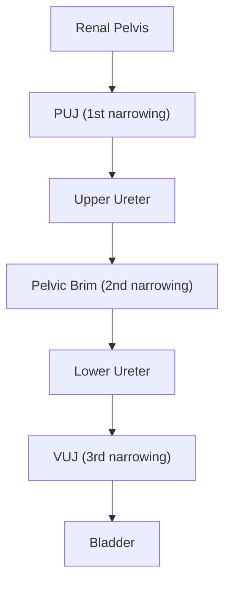
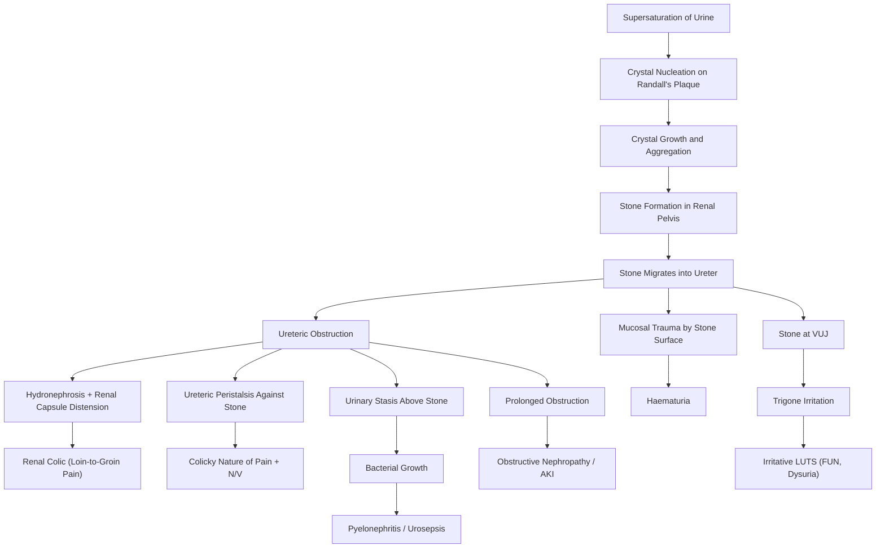

# Urinary Stones (Urolithiasis)

## Definition

Urolithiasis ("uro" = urine, "lith" = stone, "iasis" = condition) refers to the formation of calculi (stones) anywhere within the urinary tract — kidneys (nephrolithiasis), ureters (ureterolithiasis), bladder (vesical calculi), or rarely the urethra. These stones form when dissolved minerals in the urine supersaturate and crystallise, aggregate, and grow into macroscopic concretions that can obstruct urinary flow, cause intense pain, and predispose to infection.

> The classic clinical presentation is **renal colic** (colicky loin-to-groin pain) with **haematuria**. This is one of the most common urological emergencies you'll encounter. [1][2]

---

## Epidemiology

- ***Lifetime prevalence is substantial: up to 16% in males and 8% in females will have ≥1 symptomatic stone episode by age 70*** [1][3]
- **Male predominance** (M:F historically ~3:1, now narrowing to approximately ***4:3*** in recent series) [1][3]
- ***Peak incidence between 30–50 years of age*** [3]; other sources cite the 40–60 age bracket [1]
- **Recurrence is the rule, not the exception**: risk of recurrence after the first stone is ***~15% at 1 year, 35–40% at 5 years, and 50% at 10 years*** [3]
- Overall population prevalence approximately ***10%*** [2]
- Geographic variation: more common in hot, arid climates (the "stone belt" phenomenon — higher rates in Middle East, Southeast Asia, southern United States) due to dehydration and concentrated urine
- In **Hong Kong**, the prevalence follows regional Asian trends with calcium oxalate stones being the most common. Hong Kong's subtropical climate with hot, humid summers predisposes to dehydration. There is also a relatively high dietary sodium and animal protein intake in the local diet, both of which are modifiable risk factors

<Callout title="Recurrence Rate — High Yield">
Stones are a recurrent disease. After a first episode, quote "50% at 10 years" for exams. This justifies metabolic workup and secondary prevention in every patient.
</Callout>

---

## Anatomy and Function

### Anatomy of the Urinary Tract Relevant to Stone Disease

Understanding the anatomy is essential because it tells you **where stones get stuck** and **why they cause pain**.

#### The Kidney
- The functional unit is the nephron, which filters plasma → produces urine
- Urine drains from collecting ducts → renal papillae → minor calyces → major calyces → renal pelvis
- Stones typically form at the **renal papillae** — this is where **Randall's plaques** (see Pathophysiology) begin

#### The Ureter
- A 25–30 cm muscular tube (smooth muscle, peristaltic) connecting the renal pelvis to the bladder
- ***Course on KUB: exits the renal pelvis at L1/L2, runs along the tips of the transverse processes, in front of the sacroiliac joint (SIJ), laterally down the pelvic wall towards the ischial spine, then curves anteromedially into the bladder*** [2][3]
- Divided into **three segments** for clinical purposes:
  - Upper third (above the pelvic brim)
  - Middle third (at the SIJ level)
  - Lower third (below the pelvic brim to the bladder)

#### ***Three Anatomical Points of Ureteric Narrowing*** [1][2][3]

These are the **three classic sites where stones lodge**, because the ureter naturally narrows here:

| Site | Anatomy | Why Stones Get Stuck |
|------|---------|---------------------|
| ***Pelvi-ureteric junction (PUJ)*** | Where the renal pelvis funnels into the ureter | Transition from a wide pelvis to a narrow tube |
| ***Pelvic brim*** | Where the ureter crosses the common iliac artery bifurcation | External compression by the vessel narrows the lumen |
| ***Vesico-ureteric junction (VUJ)*** | Where the ureter pierces the bladder wall obliquely | Narrowest point of the ureter (~1–3 mm); the oblique intramural course provides a valve mechanism but also a bottleneck |

> **Why does this matter?** When a stone lodges at one of these points, it causes ureteric obstruction → upstream dilation (hydroureter, hydronephrosis) → increased intraluminal pressure → pain. The VUJ is the narrowest and is the most common site of impaction.

#### The Bladder
- A distensible smooth-muscle organ (detrusor muscle) that stores urine
- Bladder stones are more common in males (due to BPH causing urinary stasis) and in settings of chronic indwelling catheters, neurogenic bladder, or bladder diverticula

#### Pain Referral Patterns (Dermatome Basis)
- The ureter is innervated by sympathetic fibres from T10–L2
- Stone pain is **visceral pain** (poorly localised, colicky, often associated with autonomic symptoms like nausea and vomiting)
- **Upper ureteric stones** → pain referred to the **flank/loin** (T10–T12)
- **Mid-ureteric stones** → pain radiates to the **lower abdomen/groin** (L1)
- **Lower ureteric/VUJ stones** → pain referred to the **groin, scrotum/labia** (L1–L2), and can cause **irritative bladder symptoms** (frequency, urgency, dysuria) because the intramural portion of the ureter irritates the bladder trigone

---

## Etiology and Risk Factors

### Overview — Why Do Stones Form?

Stones form when the balance between factors promoting crystallisation and factors inhibiting it tips in favour of crystal formation. Think of it as a "chemistry of urine" problem:

- **Promoters of stone formation**: supersaturation (high concentration of stone-forming solutes), low urine volume, low pH (for uric acid/cystine), high pH (for calcium phosphate/struvite), presence of a nidus (Randall's plaque)
- **Inhibitors of stone formation**: citrate, magnesium, pyrophosphate, glycosaminoglycans, Tamm-Horsfall protein, nephrocalcin

### Specific Risk Factors

#### 1. Urinary Factors (The Most Direct Determinants) [1][3]

| Factor | Stone Type Favoured | Mechanism |
|--------|-------------------|-----------|
| ***High calcium (hypercalciuria)*** | Calcium oxalate/phosphate | More Ca²⁺ in urine → supersaturation |
| ***High oxalate (hyperoxaluria)*** | Calcium oxalate | Oxalate binds Ca²⁺ to form insoluble crystals |
| ***High uric acid (hyperuricosuria)*** | Uric acid (also CaOx — uric acid crystals act as a nidus) | Supersaturation + heterogeneous nucleation |
| ***High cystine (cystinuria)*** | Cystine | Cystine is poorly soluble, especially at acidic pH |
| ***High pH (alkaline urine)*** | Calcium phosphate, struvite | Phosphate dissociates more at alkaline pH → binds Ca²⁺ |
| ***Low pH (acidic urine)*** | Uric acid, cystine | Uric acid is poorly soluble at pH < 5.5; cystine at pH < 7 |
| ***Low volume*** | All types | Concentrates all solutes → supersaturation |
| ***Low citrate (hypocitraturia)*** | Calcium stones | Citrate chelates Ca²⁺ in urine, keeping it soluble; also inhibits crystal aggregation |

> ***Hypocitraturia is usually caused by metabolic acidotic states (e.g. RTA) which enhance renal tubular reabsorption of citrate*** [1]. This is a critical concept: in metabolic acidosis, the proximal tubule avidly reabsorbs citrate (to use it as a metabolic buffer), leaving less in the urine to inhibit stone formation.

#### 2. Dietary Factors [1][3]

| Dietary Factor | Effect | Mechanism |
|---------------|--------|-----------|
| ***Low fluid intake (dehydration)*** | ↑ All stone risk | Concentrated urine → supersaturation |
| ***High oxalate intake*** | ↑ CaOx stones | More oxalate absorbed → excreted in urine. Examples: ***tea, cocoa, spinach, mustard greens, beets*** [3] |
| ***High protein (animal) intake*** | ↑ Uric acid + CaOx stones | ***High protein intake leads to hyperuricosuria*** [1]; also generates acid load (purines, sulphur-containing amino acids) → ↓ urine pH → ↑ uric acid precipitation; also ↑ urinary calcium excretion |
| ***High sodium intake*** | ↑ Calcium stones | ***Na and Ca compete for renal reabsorption*** in the proximal tubule — ↑ Na intake → ↑ Na excretion → drags Ca²⁺ with it → hypercalciuria [2] |
| ***Low calcium diet*** | ***Paradoxically ↑ CaOx stones*** | ***Low calcium diet is paradoxically predisposing to urinary stone formation since dietary Ca binds oxalate in the GIT to prevent its absorption into blood and subsequently excretion in urine*** [1][2]. This is a classic exam point! |
| ***High dietary calcium*** | ***Protective*** | Same mechanism — binds oxalate in gut [3] |
| ***Calcium supplements*** | ***↑ risk (paradox)*** | ***Dietary Ca intake is protective but Ca supplement is associated with ↑ risk*** [3] — because supplements are usually taken separate from meals, so they can't bind dietary oxalate in the intestine |
| High sucrose/fructose | ↑ Risk | ↑ Urinary calcium excretion |
| High vitamin C | ↑ CaOx stones | Vitamin C is metabolised to oxalate |
| Low potassium intake | ↑ Risk | ↓ Urinary citrate excretion |

<Callout title="The Calcium Paradox — Must Know" type="error">
Students often think "more calcium in diet = more calcium stones." The opposite is true. Dietary calcium REDUCES stone risk by binding oxalate in the gut. It is calcium SUPPLEMENTS (taken away from meals) that increase risk. This is frequently tested.
</Callout>

#### 3. Medical Conditions [1][3]

**Conditions favouring calcium stones:**
- ***Primary hyperparathyroidism***: the most important medical cause — ↑ PTH → ↑ bone resorption → hypercalcaemia → hypercalciuria [1][4]
- ***Sarcoidosis***: granulomatous disease → macrophages express 1α-hydroxylase → ↑ 1,25-(OH)₂-D₃ → ↑ intestinal Ca absorption → hypercalciuria [1][4]
- ***Idiopathic hypercalciuria***: the commonest metabolic abnormality found in calcium stone formers (~50%)
- ***Inflammatory bowel disease / Crohn's disease***: bile acid malabsorption → fatty acids bind Ca instead of oxalate → ↑ free oxalate absorption → hyperoxaluria [3]
- ***Renal tubular acidosis (RTA) Type 1 (Distal)***: cannot excrete H⁺ → chronic metabolic acidosis → ↑ bone Ca mobilisation + ↓ urinary citrate (citrate reabsorbed in acidotic states) + alkaline urine (cannot acidify) → calcium phosphate stones [1][3]
- ***Medullary sponge kidney***: dilated collecting ducts → urinary stasis → stone formation [3]

**Conditions favouring uric acid stones:**
- ***Gout (hyperuricaemia and hyperuricosuria)*** [1]
- ***Lymphoproliferative / Myeloproliferative disease***: high cell turnover → ↑ purine metabolism → ↑ uric acid production [1]
- ***Diabetes mellitus / Metabolic syndrome***: insulin resistance → defective renal ammoniagenesis → ↓ urinary pH → uric acid precipitation [3]

**Conditions favouring struvite stones:**
- ***Recurrent upper UTI*** with urease-producing organisms (see below) [3]

**Conditions favouring cystine stones:**
- ***Cystinuria***: autosomal recessive defect in renal tubular reabsorption of dibasic amino acids (cystine, ornithine, lysine, arginine — mnemonic: **COLA**) [2]

#### 4. Anatomical Factors [1][3]
- ***Horseshoe kidney***: altered drainage → urinary stasis → stone formation
- ***Medullary sponge kidney***: ectatic collecting ducts with stasis
- Other congenital anomalies: duplex collecting system, calyceal diverticulum, UPJ obstruction

#### 5. Surgical History [1][3]
- ***Gastric bypass surgery / Bowel resection***: ***Dietary Ca²⁺ is bound by unabsorbed dietary fats by saponification after bypass, which prevents it from binding to dietary oxalate, thereby making oxalate more available for intestinal absorption and increasing oxalate excretion*** [1]
- This is essentially the same mechanism as Crohn's/IBD — fat malabsorption → calcium binds free fatty acids → oxalate has no calcium to bind → oxalate is absorbed freely → hyperoxaluria

#### 6. Family History [1][3]
- ***Family history of urolithiasis confers ~2× risk*** [3]
- Genetic factors in idiopathic hypercalciuria, cystinuria, primary hyperoxaluria, and certain renal tubular defects

#### 7. Other Factors
- ***Prior history of urinary stones*** is one of the strongest risk factors [1]
- ***Medications***: antacids, salicylates, antivirals (acyclovir, indinavir — form radiolucent crystals), topiramate (carbonic anhydrase inhibitor → ↑ urine pH), vitamin D supplements [3]
- ***Occupation***: outdoor workers with heavy sweating / insufficient fluid intake [5]
- ***Obesity and diabetes mellitus***: insulin resistance → acidic urine → uric acid stones [3]

---

## Pathophysiology

### Step-by-Step: How Do Stones Form?

Think of stone formation as a 3-step process:

#### Step 1: Supersaturation
- When the concentration of stone-forming ions (e.g., calcium and oxalate) exceeds the solubility product in urine, the solution becomes supersaturated
- This is the **necessary precondition** for crystal formation
- Factors that promote supersaturation: low urine volume, high solute excretion, unfavourable urine pH

#### Step 2: Crystal Nucleation
- **Homogeneous nucleation**: crystals form de novo in a pure supersaturated solution (requires very high supersaturation — rare)
- **Heterogeneous nucleation** (more common): crystals form on a pre-existing surface (a "nidus")
- ***Randall's plaque***: ***calcium crystal deposits in the interstitial space of the renal papilla that serve as a nidus for stone formation*** [2]. This is a key concept — calcium phosphate (apatite) deposits form in the basement membrane of the thin loops of Henle, extend into the papillary interstitium, and eventually erode through the urothelium to become exposed to urine. Once exposed, calcium oxalate crystals can nucleate on this surface

#### Step 3: Crystal Retention, Growth, and Aggregation
- Crystals that form must be **retained** in the urinary tract (otherwise they are simply flushed out)
- ***Inflammation*** around the crystal and ***Randall's plaque*** contribute to retention [2]
- Small crystals aggregate into larger ones, grow, and eventually become macroscopic stones
- The balance between **promoters** (supersaturation, inflammatory matrix, low urine volume) and **inhibitors** (citrate, magnesium, pyrophosphate, Tamm-Horsfall protein, nephrocalcin) determines whether a crystal becomes a clinically significant stone

### How Stones Cause Symptoms

Once a stone forms and moves into the ureter:

1. **Obstruction** → ↑ intraluminal pressure → distension of the renal pelvis and ureter → **pain** (renal colic)
   - The pain is visceral, mediated by stretch receptors in the renal capsule and ureteral wall
   - Peristalsis of the ureter trying to push the stone past the obstruction causes the **colicky** nature (waxing and waning)
2. **Mucosal irritation** → the stone's rough surface (especially calcium oxalate with its sharp "mulberry" projections) scratches the urothelium → **haematuria**
3. **Obstruction + stasis** → urine pooling above the stone → breeding ground for bacteria → **urinary tract infection** → can progress to **pyelonephritis** and **urosepsis**
4. **Prolonged obstruction** → progressive hydronephrosis → renal parenchymal thinning → **obstructive nephropathy** → potential **AKI** (if bilateral or in a solitary kidney) [2][3]

---

## Classification of Urinary Stones

### By Composition

There are ***5 main types of urinary stones*** [1]:

| Type | Frequency | Urine pH | Etiology/Risk Factors | Radio-opacity on KUB | Appearance | Key Features |
|------|-----------|----------|----------------------|---------------------|------------|--------------|
| ***Calcium oxalate*** | ***70–80%*** | Variable | Hypercalciuria, hyperoxaluria, hypocitraturia, ↓ fluid intake, FHx, medullary sponge kidney | ***Radio-opaque*** | ***Irregular "mulberry" stones with sharp projections*** | ***Symptomatic early even at small size due to sharp surfaces*** [3]; may be monohydrate (whewellite — hard) or dihydrate (weddellite — softer) |
| ***Calcium phosphate*** | ***~15%*** (often mixed with CaOx) | ***Alkaline*** | Distal RTA (Type 1), hyperPTH, medullary sponge kidney | ***Radio-opaque*** | Smooth or chalky | ***Alkaline urine pH favours phosphate stones*** (not oxalate); brushite stones are hard and ESWL-resistant |
| ***Uric acid*** | ***5–10%*** | ***Acidic (< 5.5)*** | Gout, myeloproliferative disease, tumour lysis, DM/metabolic syndrome, chronic diarrhoea, ↑ animal protein | ***Radiolucent*** (the classic radiolucent stone) | ***Hard, smooth, faceted, light brown*** | ***Only stone type amenable to dissolution by urine alkalinisation*** (target pH 6.5–7.0); acidic urine is the key driver |
| ***Struvite (MgNH₄PO₄)*** | ***5–15%*** | ***Alkaline*** | ***Infection by urease-splitting organisms: Proteus vulgaris, Klebsiella, Staphylococcus aureus*** | ***Radio-opaque*** | Large, can form **staghorn calculi** (filling ≥ 2 calyces) | ***Urease splits urea → ammonia + CO₂ → alkaline urine → MgNH₄PO₄ crystallises***; require ***antibiotics × 6 weeks*** and complete stone removal to eradicate infection [2] |
| ***Cystine*** | ***1–2%*** | ***Acidic*** | ***Cystinuria (autosomal recessive)*** — defective tubular reabsorption of dibasic amino acids (COLA) | ***Mildly radio-opaque*** (faint) | Hexagonal crystals on microscopy, waxy yellow-green | ***Treatment: increase fluid intake, urine alkalinisation (target pH > 7.0), chelating agents (e.g., penicillamine, tiopronin)*** [2] |

***Rare types: indinavir-induced (radiolucent), xanthine/pyruvate stones*** [2]

***Hardness scale: struvite < uric acid < calcium phosphate < calcium oxalate < cystine*** [2]

<Callout title="Radio-opacity — High Yield">
**Radio-opaque** (visible on KUB): Calcium oxalate, Calcium phosphate, Struvite (most radio-opaque to least). **Mildly radio-opaque**: Cystine, Struvite. **Radiolucent** (invisible on KUB): Uric acid, Xanthine, Indinavir. Remember: "All calcium-containing stones are radio-opaque." For the exam, if they show you a stone on KUB, it's almost certainly calcium.
</Callout>

### By Location
- **Renal stones** (nephrolithiasis): calyceal, pelvic, or staghorn
- **Ureteric stones**: upper, mid, or lower third
- **Bladder stones** (vesical calculi): more common with bladder outlet obstruction (BPH)
- **Urethral stones**: rare, usually migrated from above

### Staghorn Calculus
- ***A stone that occupies ≥ 2 calyces*** [2]
- Most commonly **struvite** (infection stones) but can be any composition
- Fills the renal pelvis and branches into the calyces — looks like a "stag's horn"
- Often asymptomatic until complicated by infection or renal failure
- Requires active treatment (usually **PCNL**) regardless of symptoms because of progressive renal damage

---

## Clinical Features

### Symptoms

| Symptom | Pathophysiological Basis |
|---------|------------------------|
| ***Renal colic (colicky pain from loin to groin)*** [2] | Stone moves into ureter → obstruction → ↑ intraluminal pressure → ureteric peristalsis against the obstruction → stretch of the ureteric wall and renal capsule → visceral pain via T10–L2 afferents. The "colicky" nature (waves of severe pain with brief respites) reflects rhythmic ureteric peristalsis trying to propel the stone distally |
| Flank/loin pain (constant) | If the stone is in the renal pelvis or upper ureter, the distension is more steady → dull, constant ache in the costovertebral angle |
| Pain radiation to groin/scrotum/labia | As the stone moves distally, the referred pain follows the dermatomal distribution — lower ureteric stones refer to L1–L2 dermatomes (groin, genitalia) |
| ***Nausea and vomiting*** [2] | Visceral pain from ureteric obstruction triggers the vomiting centre via vagal afferents (the kidneys and GI tract share autonomic innervation — coeliac and superior mesenteric ganglia). This is why stone pain is so commonly confused with GI pathology |
| ***Haematuria (gross or microscopic)*** [2] | Stone's rough surface (especially CaOx with its "mulberry" shape and sharp projections) traumatises the urothelium → bleeding. Also, mucosal inflammation contributes. May be gross (visible) or microscopic (dipstick/microscopy only) |
| ***Irritative LUTS (frequency, urgency, nocturia, dysuria)*** — ***"FUN"*** [2] | Lower ureteric/VUJ stones irritate the bladder trigone and detrusor → mimics cystitis symptoms. These are sometimes the only symptoms of a distal ureteric stone! |
| Sudden cessation of pain | If the stone passes into the bladder, the obstruction is relieved → immediate pain relief. Patients may then pass the stone during voiding |
| ***Stranguria*** | Painful urination with bladder spasms — from a stone at the VUJ or in the bladder |
| Anuria/oliguria | Bilateral ureteric obstruction (rare) or obstruction in a solitary functioning kidney → post-renal AKI |

<Callout title="Classic Presentation">
A 40-year-old male presenting with sudden-onset severe colicky loin pain radiating to the groin, with nausea/vomiting and haematuria on dipstick. "Rolling around in agony" — unlike peritonitis where patients lie perfectly still, renal colic patients cannot find a comfortable position. This restlessness is a key clinical clue.
</Callout>

#### Pain Patterns by Stone Location

| Stone Location | Pain Pattern | Associated Symptoms |
|---------------|-------------|-------------------|
| Renal pelvis | Deep flank/costovertebral angle pain, may be dull or absent if non-obstructing | Haematuria |
| Upper ureter (PUJ) | Severe loin pain, may radiate to flank | N/V, haematuria |
| Mid ureter (pelvic brim) | Pain radiates to lower abdomen, may mimic appendicitis (R) or diverticulitis (L) | N/V |
| Lower ureter / VUJ | Pain radiates to groin, scrotum/labia | ***Irritative symptoms (FUN), dysuria*** |
| Bladder | Suprapubic pain, intermittent urinary stream (stone rolls over bladder neck) | ***Irritative symptoms, terminal haematuria*** |

### Signs

| Sign | Pathophysiological Basis |
|------|------------------------|
| ***Loin/renal angle tenderness*** [2] | Distension of the renal capsule and surrounding tissues from hydronephrosis → tenderness at the costovertebral angle (Murphy's kidney punch may be positive — but this is more classically for pyelonephritis) |
| ***Symptoms out of proportion to signs*** [3] | This is a hallmark of ureteric colic — the patient is in severe distress (writhing, unable to keep still), but the abdominal examination is often remarkably unremarkable. Why? Because the pain is **visceral** (from ureteric/renal capsule distension), not somatic (no peritoneal involvement). There is ***usually no peritoneal signs (guarding, rebound)*** [3] |
| ***May have tenderness at renal angle*** [3] | Mild to moderate — from distension of the renal pelvis |
| Restlessness / inability to lie still | Unlike peritonitis (where movement worsens pain → patient lies still), renal colic patients are restless because visceral pain is not worsened by movement and the patient instinctively tries different positions to relieve the distension |
| ***RARELY associated with ballotable kidneys*** | ***Due to hydronephrosis / pyonephrosis*** [3] — massive distension of the kidney. This is very late/severe |
| Fever and rigors | NOT from the stone itself — indicates superimposed **infection** (pyelonephritis/urosepsis). This is a **surgical emergency** requiring urgent decompression |
| Haematuria on urinalysis | ***Haematuria (gross or microscopic)*** [3] — present in ~85% of acute stone episodes. Absence does not rule out stones (complete obstruction may prevent urine flow) |
| ***Pyuria*** | ***Can be present without infection due to irritation of urothelium*** [3] by the stone. However, if accompanied by bacteriuria and fever, infection must be treated urgently |
| Ileus (absent bowel sounds, abdominal distension) | Sympathetic overstimulation from severe renal colic can cause reflex ileus |

<Callout title="Red Flags — Infected Obstructed Urinary Tract" type="error">
If a patient with ureteric colic develops **fever**, **rigors**, **hypotension**, or **confusion**, think **obstructed pyelonephritis/urosepsis**. This is a urological emergency requiring:
1. IV antibiotics
2. **Urgent decompression** (JJ stent or percutaneous nephrostomy)
Stone treatment is deferred until the infection is controlled. Do NOT attempt ESWL or definitive stone surgery in the septic patient.
</Callout>

### Special Considerations: Bladder Stones

***Bladder stones*** (more relevant from GC 180 on BPH) present differently from ureteric stones:

- **Suprapubic pain** worsened at the end of micturition (stone falls onto trigone → irritation)
- ***Irritative symptoms***: frequency, urgency, nocturia [5]
- ***Terminal haematuria*** (stone irritates bladder base at end of voiding when bladder contracts)
- ***Sudden interruption of urinary stream*** — pathognomonic: the stone rolls over the internal urethral meatus during voiding, blocking flow; relieved by changing position
- Usually secondary to **bladder outlet obstruction** (BPH, urethral stricture) or **neurogenic bladder** → chronic urinary stasis → crystal precipitation

---

## Summary of Pathophysiology → Clinical Feature Connections

---

<Callout title="High Yield Summary">

**Definition**: Urolithiasis = stone formation anywhere in the urinary tract, most commonly calcium oxalate.

**Epidemiology**: M > F (~4:3), peak 30–50y, lifetime prevalence up to 16% (M). Recurrence: 50% at 10 years.

**Three sites of ureteric narrowing**: PUJ, pelvic brim (iliac artery crossing), VUJ (narrowest).

**Five stone types**: Calcium oxalate (70–80%), Calcium phosphate (15%), Uric acid (5–10%, radiolucent, dissolves with alkalinisation), Struvite (infection-related, urease-splitting organisms, staghorn), Cystine (1%, AR cystinuria, hexagonal crystals).

**Key pathophysiology**: Supersaturation → nucleation (Randall's plaque) → growth/aggregation → obstruction → pain, haematuria, infection.

**The Calcium Paradox**: Dietary calcium is PROTECTIVE (binds oxalate in gut). Calcium supplements (taken away from meals) INCREASE risk.

**Classic presentation**: Colicky loin-to-groin pain + haematuria + N/V. Symptoms out of proportion to signs. Patient cannot lie still.

**Red flag**: Fever + obstructed stone = urological emergency → urgent decompression (JJ stent or PCN) + IV antibiotics.

**Urine pH matters**: Acidic → uric acid, cystine. Alkaline → calcium phosphate, struvite.

**Radio-opacity**: Calcium = opaque, Uric acid = lucent, Cystine = faintly opaque.

</Callout>

---

<ActiveRecallQuiz
  title="Active Recall - Urinary Stones (Definition, Epidemiology, Anatomy, Etiology, Pathophysiology, Classification, Clinical Features)"
  items={[
    {
      question: "Name the three anatomical sites of ureteric narrowing where stones most commonly lodge, and explain why each is narrow.",
      markscheme: "1. Pelvi-ureteric junction (PUJ) - transition from wide pelvis to narrow ureter. 2. Pelvic brim - external compression by common iliac artery bifurcation. 3. Vesico-ureteric junction (VUJ) - narrowest point, oblique intramural course through bladder wall.",
    },
    {
      question: "Explain the 'calcium paradox' in urinary stone formation - why does a low calcium diet INCREASE stone risk?",
      markscheme: "Dietary calcium binds oxalate in the GI tract, preventing its absorption. Low dietary calcium means more free oxalate is absorbed from the gut, enters the blood, and is excreted in urine (hyperoxaluria), promoting calcium oxalate stone formation. Conversely, calcium supplements taken away from meals do not bind dietary oxalate and can increase urinary calcium, thus increasing risk.",
    },
    {
      question: "A patient presents with a ureteric stone and develops fever, rigors, and tachycardia. What is the diagnosis and what is the immediate management?",
      markscheme: "Diagnosis: Obstructed infected urinary tract (urosepsis). Management: 1. IV antibiotics (broad-spectrum). 2. Urgent decompression via JJ ureteric stent or percutaneous nephrostomy (PCN). Definitive stone treatment is deferred until sepsis is controlled. Do NOT attempt ESWL in sepsis.",
    },
    {
      question: "Which urinary stone type is radiolucent on KUB, forms in acidic urine, and can be dissolved by urine alkalinisation? Name two clinical conditions predisposing to this stone type.",
      markscheme: "Uric acid stones. Predisposing conditions (any two): Gout/hyperuricaemia, myeloproliferative/lymphoproliferative disease, tumour lysis syndrome, diabetes mellitus/metabolic syndrome (insulin resistance causes low urine pH), chronic diarrhoea, high animal protein diet.",
    },
    {
      question: "What is Randall's plaque and how does it contribute to stone formation?",
      markscheme: "Randall's plaque is a deposit of calcium phosphate (apatite) crystals in the interstitial space of the renal papilla, forming in the basement membrane of the thin loops of Henle. It erodes through the papillary urothelium, becoming exposed to urine, and serves as a nidus for heterogeneous nucleation of calcium oxalate crystals, initiating stone formation.",
    },
    {
      question: "Explain why struvite stones form in the context of UTI. Which organisms are classically responsible?",
      markscheme: "Urease-producing organisms (Proteus vulgaris, Klebsiella, Staphylococcus aureus) split urea into ammonia and CO2. Ammonia alkalinises the urine (pH > 7). In alkaline urine, magnesium ammonium phosphate (struvite) becomes supersaturated and crystallises. These stones can grow rapidly into staghorn calculi. Treatment requires complete stone removal plus prolonged antibiotics (6 weeks).",
    },
  ]}
/>

## References

[1] Senior notes: felixlai.md (Urological Diseases — Urinary Stones)
[2] Senior notes: maxim.md (Section 2.3: Urinary stones — Urolithiasis)
[3] Senior notes: Ryan Ho Urogenital.pdf (Section 7.2: Urolithiasis, pp. 137–143)
[4] Senior notes: Ryan Ho Endocrine.pdf (Sections 2.2.1–2.2.2: Hypercalcemia, Primary Hyperparathyroidism, pp. 40–43)
[5] Senior notes: Ryan Ho Fundamentals.pdf (Section 3.5.1: Haematuria, pp. 340–344)
