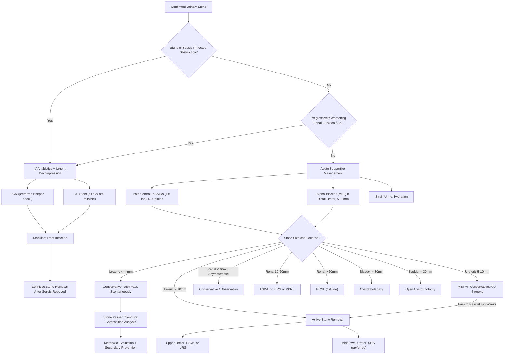

## Management of Urinary Stones

### Overview — The Management Framework

Management of urolithiasis is structured around **three phases**, each with distinct goals [2][3]:

1. **Acute management**: relieve pain, treat/exclude sepsis, decompress if needed
2. **Definitive stone removal**: conservative observation vs active intervention
3. **Secondary prevention**: prevent recurrence based on stone type and metabolic risk factors

The choice of treatment for any individual patient depends on a **triad of factors** [3]:

| ***Stone Factor*** | ***Patient Factor*** | ***Surgeon Factor*** |
|---|---|---|
| ***Size, Number, Composition, Site, Unilaterality/bilaterality*** | ***Function and anatomy of renal unit, Calyceal anatomy, Obstruction, Renal anomalies, Fitness for anaesthesia, Body habitus (ESWL not suitable for obese), Underlying bleeding tendency, Susceptibility for radiation*** | ***Surgeon expertise, Availability of technology*** |

> ***Definitive treatment should be initiated ONLY when an acute episode of urosepsis (if present) has resolved*** [1]. Never operate on a hot, infected, obstructed system — decompress first, treat infection, then plan definitive surgery.

---

### Master Management Algorithm

---

### Phase 1: Acute Management

The immediate priorities when a patient presents with acute ureteric colic are:

#### A. Pain Control

***Pain control is the first priority*** — renal colic is one of the most painful conditions patients experience.

##### ***NSAIDs — First-Line Analgesic*** [1][2][3]

- ***Examples: Indomethacin, Ketorolac, Diclofenac*** [1]
- **Why NSAIDs first?** Two reasons:
  1. **Anti-inflammatory**: reduces ureteric wall oedema around the impacted stone → reduces obstruction
  2. ***NSAIDs have the possible advantage of decreasing ureteral smooth muscle tone, thereby directly treating the mechanism (ureteral spasm) by which pain is thought to occur*** [1]. Prostaglandins (PGE₂) normally promote ureteric smooth muscle contraction; by inhibiting cyclooxygenase (COX), NSAIDs reduce prostaglandin synthesis → relax the ureter → less spasm → less pain
  3. They also reduce afferent nerve sensitisation at the kidney (less prostaglandin-mediated signal amplification)
- ***Require RFT to check for deranged renal function*** [1] before prescribing — NSAIDs reduce renal blood flow (by inhibiting prostaglandin-mediated afferent arteriolar vasodilation), which can worsen renal function in an already obstructed kidney
- **Contraindicated** in: renal impairment, peptic ulcer disease, significant cardiovascular disease, pregnancy

##### ***Opioids — Second-Line*** [1][3]

- ***Indicated for pain control in patients with acute renal colic who have deranged RFT*** [1] (i.e., when NSAIDs are contraindicated)
- ***Examples: Morphine, Pethidine, Tramadol, Hydromorphine, Pentazocine*** [1][3]
- Opioids are pure analgesics — they do NOT address ureteric spasm (unlike NSAIDs)
- Side effects: nausea/vomiting (already present from colic), sedation, respiratory depression, constipation

<Callout title="NSAIDs vs Opioids">
NSAIDs are preferred over opioids for renal colic because they address the underlying ureteric spasm (not just pain perception) and cause fewer side effects (no sedation, no nausea worsening). Reserve opioids for NSAID failures or contraindications (impaired RFT).
</Callout>

##### Adjuncts
- ***α-blockers can help reduce recurrent colic*** [3] — tamsulosin relaxes ureteric smooth muscle, reducing spasm even in the acute phase
- IV fluids for hydration if dehydrated/vomiting (but aggressive "flushing" with large-volume IV fluids does NOT help pass stones faster and may worsen pain by increasing hydrostatic pressure above the obstruction)
- Antiemetics (ondansetron, metoclopramide) as needed

#### B. Treat / Rule Out Urosepsis [2][3]

This is the critical safety step. An **infected obstructed urinary tract** is a ***urological emergency***:

- If there is **fever, rigors, haemodynamic instability, or raised inflammatory markers with evidence of obstruction**: treat as urosepsis
- ***Antibiotics if complicated by infection*** [3]
- Broad-spectrum empirical antibiotics targeting Gram-negatives (e.g., IV ceftriaxone, or piperacillin-tazobactam if Pseudomonas coverage needed)

#### C. Urgent Decompression [1][2][3]

***Indications for urgent decompression*** [1][3]:

The **7 Ss** of indications for urgent intervention (mnemonic from senior notes):

| Indication | Explanation |
|-----------|-------------|
| ***Sepsis / Urosepsis*** | Obstructed infected system → bacteria cannot be cleared without drainage → septic shock |
| ***Solitary kidney obstruction*** | No contralateral kidney to compensate → rapid AKI |
| ***Bilateral obstruction*** | Both kidneys obstructed → anuria → AKI |
| ***Deteriorating renal function (AKI)*** | Progressive ↑ creatinine indicates ongoing renal damage from obstruction |
| ***Uncontrolled pain*** | Intractable pain despite maximal analgesia |
| ***Stones unlikely to pass*** | > 10 mm, impacted, or persistent after 4–6 weeks |
| ***Pyonephrosis*** | Infected hydronephrosis (pus under pressure) — NOT just pyelonephritis [1] |

**Two methods of urgent decompression** [3]:

| Method | ***Percutaneous Nephrostomy (PCN)*** | ***JJ Ureteric Stent*** |
|--------|------|------|
| Approach | ***Needle puncture through skin into dilated pelvicalyceal system under USG guidance*** [11] | Retrograde insertion via cystoscopy under fluoroscopy |
| Speed | ***Quicker — preferred in septic shock*** [3] | Takes longer (requires cystoscopy + OT) |
| Comfort | Less comfortable (external drainage bag) | ***More comfortable*** (internal, no external bag) [3] |
| C/I | ***Bleeding tendency, distorted surface anatomy, obesity*** [3] | ***BPH (cannot pass scope), incompliant bladder, stone impaction*** [3] |
| Complications [11] | ***Minor (10%): bleeding, infection, pain. Serious (4–5%): haemorrhage, sepsis, pneumothorax, peritonitis*** | Stent migration, encrustation, irritative LUTS, haematuria |
| Key advantage | Can be done at bedside by IR; no GA needed | No external bag; patient can mobilise |

> ***Monitor for post-obstructive diuresis after decompression*** [2]: once the obstruction is relieved, the kidney may produce large volumes of dilute urine (polyuria) due to accumulated osmotic load and temporary impairment of tubular concentrating ability → risk of **dehydration and electrolyte disturbance** (hyponatraemia, hypokalaemia). Monitor I/O and replace fluids/electrolytes accordingly.

---

### Phase 2: Definitive Stone Removal

#### A. Conservative Management (Expectant / Medical) [1][2][3]

Not every stone needs active removal. The decision depends on **stone size and location**:

##### Likelihood of Spontaneous Passage [1][3]

| Ureteric Stone Size | Chance of Spontaneous Passage | Management |
|-------|------|------|
| ***≤ 4 mm*** | ***95% pass spontaneously*** [3] | Conservative with MET |
| ***4–10 mm*** | ***Progressive ↓ chance, especially for proximal stones*** [3] | MET + follow-up at 4 weeks |
| ***≥ 10 mm*** | ***Unlikely to pass spontaneously; stone removal definitely indicated*** [3] | Active intervention |
| ***> 10 mm diameter unlikely to pass*** [1] | — | — |

##### Conservative Measures [1][2]

| Measure | Details | Rationale |
|---------|---------|-----------|
| ***Adequate hydration*** | ***2–3 L/day (until urine is light in colour)*** [2] | Dilutes urine → reduces supersaturation → prevents new stone formation; promotes urine flow to flush stone fragments |
| ***Strain urine*** | ***Patient instructed to strain urine for several days and bring in any stones that pass for analysis*** [1][2] | ***Enables clinician to better plan preventive therapy*** [1] — stone composition determines secondary prevention |
| ***Dietary modification*** [1][2] | ***NORMAL calcium diet*** (not low-calcium!); ***↓ protein (red meat, organs)***; ***↓ oxalate (peanuts, spinach, beetroot, strawberries)***; ***↓ salt (sodium)***; ***↑ dietary fibre (fruits, wheat, corn)*** [1] | See Etiology section — the calcium paradox; high sodium competes with Ca for renal reabsorption; high protein → acid load → ↑ uric acid |

##### Chemical Dissolution (Chemolysis) [1][2][3]

| Approach | Target Stone Type | Agent | Mechanism |
|----------|-----------------|-------|-----------|
| ***Alkalinisation of urine*** | ***Uric acid or cystine stones*** [1] | ***Potassium citrate or sodium bicarbonate (baking soda)*** [1][2] | Uric acid is poorly soluble below pH 5.5; raising urine pH to 6.5–7.0 ionises uric acid → much more soluble → dissolves. Cystine solubility also increases above pH 7.0 |
| ***Acidification of urine*** | ***Struvite stones*** [1] | Ammonium chloride (rarely used in practice) | Struvite forms in alkaline urine; acidification reduces supersaturation. However, clinical utility is limited — complete surgical removal is usually required for struvite |

> ***Uric acid stones are the ONLY common stone type that can be completely dissolved medically***. This is a major management distinction — if DECT or stone analysis confirms pure uric acid composition, a trial of oral alkalinisation can render surgery unnecessary.

##### ***Medical Expulsive Therapy (MET)*** [1][2][3]

- ***Indicated for patients with stones of 5–10 mm*** [1], ***best for distal ureteric stones*** [2][3]
- ***α-blockers (tamsulosin 0.4 mg QD × 4 weeks, off-label use)*** [2][3]
- **Why α-blockers work**: The distal ureter (especially the intramural portion at the VUJ) has a ***high density of α₁-adrenoreceptors*** [3]. Tamsulosin ("tam" from its selective α₁A/α₁D blockade) relaxes the ureteric smooth muscle → widens the lumen → reduces peristaltic frequency and intraureteric pressure → facilitates stone passage
- ***Efficacy: α-blockers 1.45× more likely to pass ureteric stones, more useful for those 5–10 mm in size*** [3]
- ***Spontaneous passage of stone may take up to 3–4 weeks*** [1]
- ***CCBs (e.g., nifedipine) also increase passage rate*** [1] but are less commonly used than tamsulosin
- ***Follow-up at 4 weeks with KUB/NCCT*** [2] — if stone has not passed, proceed to active intervention

<Callout title="MET — Must Know">
Medical expulsive therapy = **tamsulosin for distal ureteric stones 5–10 mm**. It works by relaxing α₁-receptors in the distal ureter. Follow up at 4 weeks. If the stone hasn't passed, escalate to surgical options. Not useful for renal or proximal ureteric stones (few α₁-receptors there).
</Callout>

---

#### B. Surgical / Interventional Treatment

##### Indications for Active Stone Removal [1][3]

- ***Persistent pain / Symptomatic***
- ***Unresolved with conservative treatment***
- ***Too large to pass spontaneously (≥ 10 mm)***
- ***Failure to pass after 4–6 weeks*** [1]
- ***Complications: haematuria, UTI, obstructive uropathy (obstructed solitary kidney / bilateral obstruction), AKI*** [1]

##### Treatment Modalities by Location and Size

The **EAU Guidelines** and senior notes provide a clear framework [1][2][3]:

| Location | Size | ***Treatment of Choice*** |
|----------|------|--------------------------|
| **Renal** | Asymptomatic | ***Conservative; chemolysis (alkalinisation) for urate stones*** [3] |
| | ***< 10 mm*** | ***ESWL or RIRS > PCNL*** [3] |
| | ***10–20 mm (non-lower pole)*** | ***ESWL or RIRS or PCNL*** [3] |
| | ***10–20 mm (lower pole)*** | ***RIRS or PCNL > ESWL*** if unfavourable factors for ESWL (steep infundibular angle, long calyx, long skin-to-stone distance, narrow infundibulum, shockwave-resistant stones) [3] |
| | ***> 20 mm*** | ***PCNL > RIRS or ESWL*** [3] |
| **Upper ureter** | < 5 mm | Conservative / MET |
| | ***5–10 mm*** | ***ESWL*** [1]; or ***URS*** |
| | ***> 10 mm*** | ***URS or ESWL (+ JJ stent)*** [1][2] |
| **Mid / Lower ureter** | < 5 mm | Conservative / MET |
| | ***> 5 mm*** | ***URS (preferred)*** [1][2] |
| **Bladder** | ***< 30 mm*** | ***Cystolitholapaxy*** [1] |
| | ***> 30 mm*** | ***Open cystolithotomy*** [1]; also treat underlying outflow obstruction (e.g., BPH) [2] |

---

##### 1. ***Extracorporeal Shock Wave Lithotripsy (ESWL)***

**Name breakdown**: "extra" = outside, "corporeal" = body, "litho" = stone, "tripsy" = crushing. So: crushing stones from outside the body using shock waves.

**How it works** [1][3]:
- ***US/XR-guided shock waves aimed at stones → crystalline stones disintegrate under the impact of shock waves*** [3]
- Patient lies on a table; a lithotripter generates shock waves that are focused on the stone (located by fluoroscopy or ultrasound)
- The shock waves travel through water/gel and soft tissue (which have similar acoustic impedance) without causing damage, but at the stone surface (acoustic impedance mismatch), the energy is deposited → fragmentation
- ***Setting: optimal 1–1.5 Hz, can ↑ energy gradually (↓ renal injury)*** [3]

**Indications** [1][3]:
- ***Best for renal and upper ureteric stones that are visible under imaging*** [3]
- ***Not so good for lower system due to difficulty in access + bowel gas obscuration especially at middle ureter*** [3]
- Stones with ***density < 1000 HU on CT*** predict success [2][3]

**Contraindications** [1][3]:
- ***Absolute: pregnancy, active UTI or urosepsis, uncontrolled bleeding diathesis*** [1]
- ***Relative: distal obstruction (e.g., strictures)*** [3] — fragments cannot pass if there is a downstream blockage

**Limitations / When ESWL Fails** [1][3]:
- ***Subject to skin-to-stone distance → poorer efficacy in obese patients*** [1]
- ***NOT ideal for large or hard calculi: cystine, calcium oxalate monohydrate, brushite stones*** [1] (predicted on CT as ***> 1000 HU***) [3]
- ***NOT ideal for stones in unfavourable locations: lower pole of kidney, mid-to-distal ureter, within calyceal diverticulum*** [1]
- ***Lower pole stones: gravity causes stone fragments to be retained inside the lower pole*** [3]
- ***Calyceal diverticulum: narrow infundibulum traps stone fragments*** [3]
- ***NOT ideal in complex renal anatomy (horseshoe kidneys)*** [1]

**Pros and Cons** [3]:
- ***Pros: minimally invasive, does not need anaesthesia, can be repeated***
- ***Cons: indirect, subject to stone-skin distance, may not work for hard stones, limitations by renal anatomy***

**Complications** [1]:
- ***Incomplete fragmentation***
- ***Urosepsis***
- ***Perinephric or subcapsular haematoma*** — shock waves can cause parenchymal bleeding
- ***Ureteric obstruction by stone fragments (Steinstrasse — "stone street")*** — a column of stone fragments stacks up in the ureter after ESWL, causing obstruction. "Steinstrasse" is German: "Stein" = stone, "Strasse" = street [1]

##### 2. ***Percutaneous Nephrolithotomy (PCNL)***

**Name breakdown**: "per" = through, "cutaneous" = skin, "nephro" = kidney, "litho" = stone, "tomy" = cutting. Accessing the kidney through the skin to directly remove stones.

**How it works** [1][3]:
1. ***Flexible cystoscopy for ureteral cannulation → inject contrast + distend pelvicalyceal system*** [3]
2. ***Needle puncture at prone position just below the rib to gain entry into the pelvicalyceal system*** [3]
3. ***Tract dilatation*** using Alken's dilator system or balloon dilator [1]
4. ***Nephroscope passed into kidney via the percutaneous tract*** [3]
5. ***Stone retrieval in whole (if small) or in fragments after laser/USG/electrohydraulic lithotripsy (if large)*** [3]

**Puncture technique** [1][3]:
- ***Lower pole*** approach preferred to avoid supracostal puncture
- ***Posterior calyx*** to take advantage of the ***bloodless plane*** (Brödel's line — the watershed zone between anterior and posterior segmental renal artery branches, which has the least vasculature)
- ***Transpapillary directed towards renal pelvis*** to avoid puncturing the infundibulum [1][3]
- ***Posterolateral access to kidney (least vascular) to spare blood vessels because all renal arteries are end arteries*** [3]
- ***Supracostal puncture to upper pole possible, but 7% associated with thoracic complications requiring chest drain*** (cf 0.5% from subcostal puncture) [1][3]

**Pre-operative preparation** [1][3]:
- ***Antibiotics on induction MUST be given in PCNL*** — ***stone is usually infectious*** [1]
- ***Should cover Pseudomonas: piperacillin, ticarcillin, aminoglycoside, 3rd generation cephalosporin*** [1]
- Routine bloods, T&S, MSU (***should treat all positive cultures before OT***) [3]

**Indications** [1][3]:
- ***Large calculi > 2 cm in diameter*** [1]
- ***Hard stones (cystine, calcium oxalate monohydrate)*** [1]
- ***Stones in unfavourable locations for ESWL (lower pole, calyceal diverticulum)*** [1]
- ***Anatomical abnormalities (horseshoe kidney, PUJ obstruction)*** [1]
- ***Staghorn calculi***

**Contraindications** [1][3]:
- ***Uncontrolled bleeding diathesis*** [1][3]
- ***Patient unfit for GA*** [1][3]

**Adjuncts** [1][3]:
- ***± Placement of nephrostomy tube*** for drainage (the pelvicalyceal system will be swollen/injured post-PCNL; the normal PUJ/ureteric route will likely be inflamed and obstructed) [1]; also provides tamponade effect on the tract and leaves access for ***second-look PCNL*** [1][3]
- ± Ureteral stent if anticipate incomplete stone retrieval

**Complications** [1][3]:
- ***Access failure (5%)***
- ***Incomplete fragmentation***
- ***Urosepsis*** (***fever 10%, sepsis 1%***)
- ***Bleeding requiring transfusion (7%)*** or embolisation (1%) [3]
- ***Hydrothorax (if supracostal puncture traverses the lower pleura → irrigating fluid enters pleural space)*** [1]
- ***Bowel perforation (< 1% colon, but 5% population have retrorenal colon)*** [3]
- ***Mortality < 0.5%*** [1][3]

##### 3. ***Ureterorenoscopy (URS) / Ureteroscopic Lithotripsy (URSL)***

**Name breakdown**: "uretero" = ureter, "reno" = kidney, "scopy" = looking. Passing a scope up the ureter.

**How it works** [1][3]:
- ***Ureteroscope introduced transurethrally across the bladder into the ureter*** [3]
- ***Small stones can be extracted by baskets or grasping forceps*** [1]
- ***Large stones are fragmented prior to removal with*** [1]:
  - ***Laser (Holmium:YAG)*** — most commonly used
  - ***Ultrasonic lithotripsy***
  - ***Ballistic/pneumatic (Lithoclast)***
  - ***Electrohydraulic lithotripsy (EHL)***

**Types**:
- ***Rigid/semi-rigid URS***: for ***middle and lower ureteric stones*** [1] — the ***treatment of choice*** for this location
- ***Flexible URS (= Retrograde Intrarenal Surgery, RIRS)***: ***deflection capabilities allow access to the entire upper urinary tract including the intrarenal collecting system*** [1]

**Indications** [1][3]:
- Mid and distal ureteric stones (rigid URS preferred)
- Upper ureteric and renal stones (flexible URS/RIRS)
- ***Especially useful for larger stones (earlier stone-free status compared to ESWL) and obese patients*** [3]
- ***Independent of body habitus and can be used in patients with bleeding diathesis*** [1][3]

**Contraindications** [3]:
- ***C/I to GA, untreated UTI (otherwise none — not limited by bleeding diathesis)*** [3]

**Pros and Cons** [3]:
- ***Pros: minimally invasive, direct fragmentation of stone, body habitus-independent, can be used in those with bleeding diathesis***
- ***Cons: requires anaesthesia and radiation, technology-driven***
- ***Limitation: calyceal anatomy (not all calyceal curvatures allow URS entry)*** [3]

**Adjuncts**: ***JJ stent placement post-URS may be considered for those with ↑ risk of complications*** [3]

**Complications** [1][3]:
- ***Intra-op (3.6%): mucosal injury (1.5%), ureteral perforation (1.7%), significant bleeding (0.1%), ureteral avulsion (0.1%)*** [3]
- ***Early (6.0%): fever/urosepsis (1.1%), persistent haematuria (2.0%), renal colic (2.2%)*** [3]
- ***Late (0.2%): ureteral stricture (0.1%), persistent VUR (0.1%)*** [3]
- ***Urosepsis: endoscopic irrigation can force bacteria into renal parenchyma and result in sepsis if performed in the setting of infection*** [1]

> ***URS vs ESWL: URS has better stone-free rate and less need for re-treatment. ESWL has less procedure-related complications but may not be possible for large/complex stones*** [3].

##### 4. ***Cystolitholapaxy and Cystolithotomy (Bladder Stones)***

| Procedure | Size | Method |
|-----------|------|--------|
| ***Cystolitholapaxy*** | ***< 30 mm*** [1] | Transurethral endoscopic fragmentation (laser, pneumatic, or electrohydraulic) + aspiration/extraction via cystoscope |
| ***Open cystolithotomy*** | ***> 30 mm*** [1] | Open surgical removal through a suprapubic incision into the bladder |

- Always ***treat the underlying cause of bladder stones*** (e.g., BPH → TURP, neurogenic bladder → intermittent catheterisation) [2]

##### 5. ***Open / Laparoscopic Surgery***

- ***Types: pyelolithotomy (from pelvis), ureterolithotomy (from ureter)*** [3]
- ***Indications: if failed all above means*** [3] — truly a last resort
- ***Problems: ↑ morbidity, ↑ blood loss, significant damage to renal function compared to endourological techniques*** [3]
- ***Rarely done*** in modern practice [1]

---

#### Comparison of Surgical Modalities

| Feature | ***ESWL*** | ***PCNL*** | ***URS/RIRS*** |
|---------|------|------|------|
| Invasiveness | Least | Most | Moderate |
| Anaesthesia | Not required | GA required | GA required |
| Best for | Renal + upper ureteric stones < 2 cm, density < 1000 HU | Renal stones > 2 cm, staghorn, hard stones, lower pole | Mid/lower ureteric stones; also renal via RIRS |
| Body habitus | ***Not suitable for obese*** | Can be limited by body habitus | ***Body habitus-independent*** |
| Bleeding diathesis | ***Contraindicated*** | ***Contraindicated*** | ***NOT limited*** |
| Stone-free rate | Lower (may need multiple sessions) | Highest for large stones | Higher than ESWL for ureteric stones |
| Key complication | Steinstrasse | Bleeding, hydrothorax | Ureteric stricture/avulsion |

---

### Phase 3: Secondary Prevention

***Prevention of recurrence is essential given the 50% recurrence rate at 10 years***.

#### General Measures (All Stone Types) [1][2]

| Measure | Target | Rationale |
|---------|--------|-----------|
| ***↑ Fluid intake to 2–3 L/day*** | Urine output > 2 L/day; urine should be ***light in colour*** [2] | Dilutes all solutes → reduces supersaturation |
| ***Normal calcium diet*** | Dietary calcium binds oxalate in gut | ***Paradox: low dietary calcium ↑ oxalate absorption → ↑ CaOx stones*** |
| ***↓ Salt < 2 g/day*** [2] | ↓ Sodium excretion → ↓ calcium excretion | Na and Ca compete for tubular reabsorption |
| ***↓ Animal protein*** [2] | ↓ Acid load, ↓ uric acid, ↓ urinary calcium | High protein → ↑ purine metabolism → ↑ uric acid; also → acid load → ↑ Ca mobilisation from bone |
| ***↓ Oxalate-rich foods*** | Spinach, chocolate, tea, beets, nuts | Direct ↓ urinary oxalate |
| ***↑ Citrus fruit*** [2] | ↑ Urinary citrate | Citrate chelates calcium in urine → inhibits crystal formation |

#### Stone-Specific Prevention

| Stone Type | Specific Prevention |
|-----------|-------------------|
| **Calcium oxalate** | Treat underlying cause (hyperPTH → parathyroidectomy; RTA → alkali therapy); thiazide diuretics (↓ urinary Ca); potassium citrate (↑ urinary citrate) |
| **Calcium phosphate** | Treat RTA; avoid excessive alkalinisation (CaPO₄ precipitates at high pH) |
| ***Uric acid*** | ***Urine alkalinisation: potassium citrate / sodium bicarbonate*** [1][2] (target pH 6.5–7.0); allopurinol/febuxostat if hyperuricaemia [12] |
| ***Struvite*** | ***Antibiotics × 6 weeks*** [2]; **complete surgical stone removal** is essential (fragments harbour bacteria → recurrence); treat and prevent UTI |
| ***Cystine*** | ***↑ Fluid intake (target > 3 L/day); urine alkalinisation (target pH > 7.0); chelating agents (e.g., penicillamine, tiopronin)*** [2] — these bind cystine to form more soluble complexes |

<Callout title="Struvite Stones — Complete Removal is Mandatory" type="error">
Unlike other stone types where residual fragments may be tolerated, struvite stones MUST be completely removed. Any fragment left behind harbours bacteria → recurrence. This is why struvite staghorn calculi are treated aggressively with PCNL (sometimes requiring multiple sessions) followed by prolonged antibiotics.
</Callout>

---

### Special Scenario: Hyperparathyroidism and Stones

If metabolic workup reveals ***primary hyperparathyroidism*** (↑ Ca + ↑/inappropriately normal PTH + normal RFT), this is the ***most important treatable medical cause of calcium stones*** [3]. Management:

- ***Surgical treatment (parathyroidectomy) indications (JCEM 2014)***: age < 50 or any one of [4]:
  - ***Clearly symptomatic or documented complications***
  - ***Serum Ca > 0.25 mmol/L above ULN (i.e., 2.85 mmol/L)***
  - ***Nephrolithiasis or nephrocalcinosis by XR/US/CT***
  - ***CrCl < 60 mL/min***
  - ***24h urine Ca > 400 mg/day + ↑ stone risk***
  - ***DXA T-score < -2.5***
- ***Conservative management if surgery contraindicated***: calcimimetics (cinacalcet) + regular monitoring (serum Ca annually, DXA every 1–2 years, renal imaging if stone suspected) [4]

---

<Callout title="High Yield Summary">

**Acute management triad**: (1) Pain — NSAIDs first line (reduce spasm + inflammation); opioids if NSAIDs C/I. (2) Infection — IV antibiotics if septic. (3) Decompression — PCN (faster, for septic shock) or JJ stent (more comfortable) if sepsis/AKI/intractable pain.

**Spontaneous passage rates**: ≤ 4 mm = 95%; 5–10 mm = variable; ≥ 10 mm = unlikely → needs intervention.

**MET**: Tamsulosin 0.4 mg QD × 4 weeks for distal ureteric stones 5–10 mm. Works via α₁-receptor blockade in distal ureter. Follow up with KUB/NCCT at 4 weeks.

**ESWL**: Best for renal + upper ureteric stones < 2 cm; not for hard stones (> 1000 HU), obese, lower pole, bleeding diathesis. No GA needed. Complications: Steinstrasse, haematoma.

**PCNL**: Best for renal stones > 2 cm, staghorn, hard stones, lower pole. Requires GA. Access via posterior calyx at lower pole (bloodless plane). Antibiotics on induction mandatory. Complications: bleeding (7%), hydrothorax (supracostal), mortality < 0.5%.

**URS/RIRS**: Best for mid/lower ureteric stones (rigid URS) and renal stones when ESWL fails (flexible RIRS). Body habitus-independent. CAN be used in bleeding diathesis.

**Prevention**: ↑ fluids, normal Ca diet, ↓ Na/protein/oxalate, ↑ citrus. Uric acid: alkalinise urine. Struvite: complete removal + antibiotics × 6 weeks. Cystine: alkalinise + chelating agents.

**Never operate on a septic, obstructed system** — decompress first, treat infection, then plan definitive surgery.

</Callout>

---

<ActiveRecallQuiz
  title="Active Recall - Management of Urinary Stones"
  items={[
    {
      question: "Why are NSAIDs preferred over opioids as first-line analgesia for renal colic? Give two distinct mechanisms.",
      markscheme: "1. NSAIDs inhibit prostaglandin synthesis (COX inhibition) which directly reduces ureteral smooth muscle tone/spasm — addressing the underlying mechanism of pain. 2. NSAIDs reduce ureteric wall oedema and inflammation around the impacted stone, reducing obstruction. Opioids only modulate central pain perception without addressing ureteric spasm. NSAIDs also cause fewer side effects (no nausea worsening, no sedation).",
    },
    {
      question: "A 45-year-old man has a 7 mm stone in the distal ureter without infection or AKI. Outline your management plan including drug name, dose, mechanism, and follow-up.",
      markscheme: "Medical expulsive therapy: Tamsulosin 0.4 mg once daily for 4 weeks (off-label). Mechanism: selective alpha-1A/1D adrenoreceptor blockade relaxes distal ureteric smooth muscle (which has high density of alpha-1 receptors), reducing peristaltic frequency and intraureteric pressure, facilitating stone passage. Also: adequate hydration, NSAIDs for pain, strain urine. Follow-up: KUB or NCCT at 4 weeks. If stone not passed, proceed to URS.",
    },
    {
      question: "Compare PCN and JJ stent for urgent decompression of an obstructed infected kidney. State when each is preferred and one contraindication for each.",
      markscheme: "PCN: preferred in septic shock (quicker, can be done at bedside by IR under USG, no GA). C/I: bleeding diathesis, distorted surface anatomy, obesity. JJ stent: more comfortable (internal, no bag), but requires cystoscopy in OT. C/I: BPH (cannot pass scope), incompliant bladder, stone impaction. Both achieve decompression; choice depends on clinical urgency and patient factors.",
    },
    {
      question: "A 25 mm staghorn struvite stone is found in a patient with recurrent Proteus UTIs. What is the definitive management and why is complete removal essential?",
      markscheme: "Definitive management: PCNL (first-line for stones greater than 2 cm), possibly requiring multiple sessions. Complete surgical removal is essential because any residual struvite fragment harbours urease-producing bacteria (Proteus, Klebsiella) which serve as a nidus for recurrence. Post-operatively: antibiotics for 6 weeks to eradicate infection. Also treat/prevent recurrent UTI. Staghorn stones left untreated have significantly increased mortality (28% vs 7.2% at 10 years).",
    },
    {
      question: "List three factors that predict ESWL failure, explaining why each reduces efficacy.",
      markscheme: "1. Stone density greater than 1000 HU (e.g. CaOx monohydrate, brushite) — hard stones resist shock wave fragmentation. 2. Lower pole location — after fragmentation, gravity retains fragments in the dependent lower calyx, preventing clearance. 3. Obesity / long skin-to-stone distance — shock wave energy dissipates over distance, reducing the energy delivered to the stone. Also accept: calyceal diverticulum (narrow infundibulum traps fragments), horseshoe kidney, cystine composition.",
    },
    {
      question: "What is Steinstrasse? How does it occur and how is it managed?",
      markscheme: "Steinstrasse (German: stone street) is a column of stone fragments stacking up in the ureter after ESWL, causing ureteric obstruction. It occurs when multiple fragments from a shattered stone migrate into the ureter simultaneously and pile up. Management: if asymptomatic and small, conservative with MET (tamsulosin) and observation. If symptomatic, infected, or causing obstruction: URS to fragment/extract the column, or JJ stent for drainage.",
    },
  ]}
/>

## References

[1] Senior notes: felixlai.md (Urological Diseases — Urinary Stones, Treatment section)
[2] Senior notes: maxim.md (Section 2.3: Urinary stones — Management)
[3] Senior notes: Ryan Ho Urogenital.pdf (Section 7.2: Urolithiasis management, pp. 140–143)
[4] Senior notes: Ryan Ho Endocrine.pdf (Primary Hyperparathyroidism surgical indications, pp. 43)
[11] Senior notes: Ryan Ho Diagnostic Radiology.pdf (Percutaneous Nephrostomy, p. 83)
[12] Senior notes: Ryan Ho Rheumatology.pdf (Gout — urate-lowering therapy, pp. 39–40)
