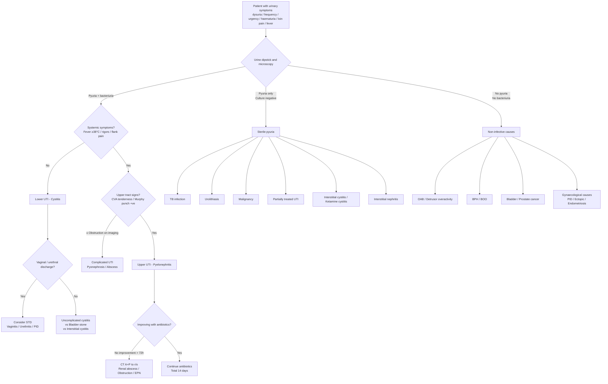

## Differential Diagnosis of UTI

The differential diagnosis of UTI is really about answering one clinical question: **"This patient has urinary symptoms — is it truly a UTI, or is something else mimicking it?"** The approach differs depending on whether the presenting complaint is predominantly **dysuria**, **storage LUTS (frequency, urgency, nocturia)**, **haematuria**, **loin/flank pain**, or **fever with urinary symptoms**. Let's work through this systematically.

---

### 1. Why Differential Diagnosis Matters in UTI

UTI is extremely common, and there is a temptation to reflexively treat every patient with dysuria or positive dipstick with antibiotics. This is dangerous for two reasons:

1. **Over-diagnosis**: Asymptomatic bacteriuria (especially in elderly, catheterised patients) is NOT UTI and should not be treated in most cases — doing so drives antimicrobial resistance [1]
2. **Under-diagnosis of serious mimics**: Conditions like bladder cancer, renal TB, interstitial cystitis, and sexually transmitted infections can present identically to UTI. Missing them has serious consequences

***The workup of suspected UTI should include history about: associated gross haematuria, previous antibiotic treatment, presence of "complicated" features (e.g. neuropathic bladder, renal stone, previous surgery to urinary tract), recurrent attacks, and social & drug history — specifically ketamine use.*** [1]

<Callout title="Why Ask About Ketamine?" type="idea">
Ketamine cystitis is an increasingly important differential in Hong Kong, particularly in younger patients. Ketamine is directly toxic to the urothelium, causing a contracted, fibrotic bladder with severe storage LUTS and haematuria that mimics recurrent UTI. The urine culture is typically negative. Always ask about recreational drug use in young patients with refractory "UTI" symptoms.
</Callout>

---

### 2. Differential Diagnosis by Presenting Complaint

#### 2.1 Differential Diagnosis of Dysuria

Dysuria = "dys" (difficult/painful) + "uria" (urination). It is the most common symptom that brings a patient to consider UTI. But dysuria has a differential that varies by sex [3][4]:

| **Female** | **Male** |
|-----------|---------|
| ***Urinary tract infection*** | ***Urinary tract infection*** |
| ***Sexually transmitted diseases: vaginitis, urethritis*** | ***Urethritis: due to STD*** |
| ***Pelvic inflammatory disease*** | ***Acute/chronic prostatitis*** |
| ***Interstitial cystitis (painful bladder syndrome)*** | ***Bladder stones*** |
| ***Bladder stones*** | ***Epididymitis*** |

**Clinical pointers to distinguish these** [3][4]:

| Condition | Key Distinguishing Features | Why These Features Occur |
|-----------|---------------------------|-------------------------|
| ***UTI*** | ***Storage LUTS, turbid/bloody urine, suprapubic pain ± loin pain, fever, chills (if upper tract)*** | Mucosal inflammation → irritative symptoms; pyuria → turbid urine; upper tract invasion → systemic response |
| ***STDs*** | ***+ve sexual history, urethral/vaginal discharge (especially during morning void)*** | Urethral/vaginal mucosal infection → discharge accumulates overnight → most visible on first morning void |
| ***Acute prostatitis*** | ***Systemic disturbance (fever, chills, malaise), deep pelvic/perineal pain ± obstructive symptoms (with acute swollen prostate)*** | Prostatic inflammation and oedema → compresses prostatic urethra → obstruction; rich blood supply → easy systemic dissemination |
| ***Chronic prostatitis*** | ***Can be subtle, a/w recurrent UTI symptoms, low-grade fever, deep pain (in pelvis, perineum, scrotum, and especially if during ejaculation), haematospermia ± obstructive symptoms*** | Chronic prostatic inflammation → serves as a focus of bacterial persistence; inflamed seminal vesicles → blood in ejaculate |
| ***Acute epididymitis*** | ***Storage LUTS + unilateral testicular pain + high fever/rigors*** | Ascending infection via vas deferens from bladder/urethra → epididymal inflammation |
| ***Interstitial cystitis*** | ***Diagnosis of exclusion → chronic, refractory bladder symptoms and pain*** | Poorly understood; likely defective GAG layer on urothelium → exposure of suburothelial nerves to urinary irritants → chronic pain and urgency without infection |

#### 2.2 Differential Diagnosis of Acute Cystitis Specifically

When a patient presents with classic lower UTI symptoms, the differential is narrower [4]:

| ***S/S suggestive of cystitis*** | ***S/S incompatible with cystitis*** |
|--------------------------------|-------------------------------------|
| ***Dysuria*** | ***Fever and systemic upset (should have none)*** |
| ***Storage LUTS, e.g. frequency, urgency, nocturia*** | ***Flank pain and renal angle tenderness*** |
| ***Suprapubic pain/discomfort*** | ***Vaginal discharge*** |
| ***Haematuria*** | |
| ***Cloudy, foul-smelling urine*** | |

**D/dx of acute cystitis** [4]:
- ***Vaginitis (e.g. STDs, BV) → vaginal pruritus, discharge***
- ***Pyelonephritis → systemic upset, flank pain/renal angle tenderness, Murphy's kidney punch positive***
- ***Non-infective lower urinary tract pathologies, e.g. interstitial cystitis, bladder stones***

> **Key principle**: If there is **fever or flank pain**, it is NOT just cystitis — you must consider **pyelonephritis** (upper tract infection). If there is **vaginal discharge**, you must consider a **gynaecological/STD** cause rather than true cystitis.

#### 2.3 Differential Diagnosis of Haematuria (Presenting as or Alongside UTI)

***Haematuria is the most common presentation of UTI (60% of haematuria cases)*** but the ***most worrying cause is malignancy (until proven otherwise)*** [6].

When haematuria accompanies UTI symptoms, you must ensure it resolves after treatment. If it persists, the differential broadens significantly [3][7]:

| Category | Cause | Distinguishing Features |
|----------|-------|----------------------|
| **Glomerular** | Glomerulonephritis | Smoky brown "Coca-Cola" urine WITHOUT clots; concomitant proteinuria; features of nephritic syndrome (HTN, oedema, oliguria); dysmorphic RBCs/RBC casts on microscopy [7] |
| **Renal parenchymal** | Pyelonephritis | High fever, vomiting, loin pain [7] |
| | Renal cell carcinoma | Traditional triad: flank pain, painless haematuria, palpable flank mass (rare); constitutional symptoms; paraneoplastic features [7] |
| | Polycystic kidney disease | Insidious HTN, bilateral flank masses, family history [7] |
| **Stones** | Urolithiasis | Unilateral flank colic radiating to groin; irritative symptoms if bladder stone [7] |
| **Infection** | UTI | Irritative symptoms, dysuria, foul-smelling urine [7] |
| **Tumours** | CA bladder | Painless gross haematuria (classically); irritative symptoms; constitutional symptoms [7] |
| | CA prostate | Obstructive symptoms: hesitancy, weak stream, straining, dribbling [7] |
| **Other** | BPH | Advanced age, obstructive symptoms, diagnosis by exclusion [7] |
| | Non-infectious cystitis | History of pelvic irradiation or cyclophosphamide chemotherapy [7] |
| | Trauma | History of urological procedures or trauma [7] |

**Crucial anatomical localisation by timing of haematuria in the stream** [7]:
- ***Initial stream → anterior urethra (distal to urogenital diaphragm)***
- ***Terminal stream → bladder neck or posterior urethra***
- ***Throughout → bladder and upper urinary tract***

<Callout title="Exam Pearl: Painless Haematuria" type="error">
***Painless gross haematuria in a patient > 35 years old = malignancy until proven otherwise.*** Do not assume it is "just a UTI." This patient needs cystoscopy and upper tract imaging even if urine culture is positive — they could have concurrent UTI and bladder cancer.
</Callout>

#### 2.4 Differential Diagnosis of LUTS (Overlapping with UTI)

UTI presents with predominantly **storage (irritative) symptoms**. The full differential of LUTS includes [5]:

| Pattern | Differential Diagnoses |
|---------|----------------------|
| ***Bladder outlet obstruction (predominantly voiding symptoms)*** | ***Bladder: bladder stones, bladder cancer, bladder neck contracture (scarring from surgery e.g. radical prostatectomy, radiotherapy for CA prostate), interstitial cystitis, ketamine cystitis. Prostate: BPH, prostatic cancer. Urethra: urethral stricture (urinary instrumentation)*** |
| ***Overactive bladder / detrusor overactivity (predominantly storage symptoms)*** | ***Neurogenic: stroke, spinal cord injury, multiple sclerosis, Parkinson's disease. Non-neurogenic (idiopathic): post-operative pelvic surgery, bladder outlet obstruction (OAB can be secondary to BOO)*** |

**Why does BOO cause OAB?** When the bladder has to contract against a chronically obstructed outlet (e.g. BPH), the detrusor muscle undergoes hypertrophy and develops unstable, involuntary contractions → secondary detrusor overactivity → storage symptoms superimposed on voiding symptoms.

#### 2.5 Differential Diagnosis of Sterile Pyuria

This is an important concept. ***Pyuria does not equate infection.*** [1] When you find WBCs in the urine but the standard culture is negative, the differential is:

| Cause | Explanation | Key Clinical Clue |
|-------|-------------|-------------------|
| ***Urolithiasis*** | Stones irritate the urothelium → inflammatory response → WBCs without bacteria | Colicky flank pain, history of stones |
| ***Malignancy (bladder cancer)*** | Tumour-associated inflammation | Painless haematuria, risk factors (smoking, age > 35) |
| ***Tuberculous infection*** | *M. tuberculosis* does not grow on standard culture media → culture-negative pyuria is the hallmark | ***Sterile pyuria***, chronic symptoms, TB exposure history, emigration from endemic area; ***EMU (early morning urine) AFB culture or TB-PCR*** needed [8] |
| **Partially treated UTI** | Prior antibiotics sterilised culture but inflammation persists | Recent antibiotic use |
| **Interstitial cystitis** | Chronic non-infective bladder inflammation | Chronic pain, frequency, urgency; diagnosis of exclusion |
| **Ketamine cystitis** | Direct urothelial toxicity from ketamine metabolites | ***Social & drug history: ketamine use*** [1]; young patient, contracted bladder on imaging |
| **Interstitial nephritis** | Drug-induced (e.g. NSAIDs, antibiotics) or autoimmune tubulointerstitial inflammation | Eosinophiluria, rash, fever, ↑creatinine |
| **Appendicitis** | Inflamed appendix lying adjacent to ureter/bladder → reactive pyuria | RIF pain, peritonism, clinical picture inconsistent with UTI |

<Callout title="High Yield: Sterile Pyuria DDx">
The classic exam question: "A patient has persistent pyuria but negative urine cultures. What is your differential?" Answer with: **TB, stones, cancer, partially treated UTI, interstitial cystitis, ketamine cystitis, interstitial nephritis.** TB is the must-not-miss diagnosis — always send early morning urine for AFB culture/TB-PCR in unexplained sterile pyuria.
</Callout>

#### 2.6 Differential Diagnosis of Loin Pain with Fever (Pyelonephritis Mimics)

When a patient presents with the classic pyelonephritis triad (fever + loin pain + renal angle tenderness), the differential includes [2][4]:

| Condition | How to Distinguish from Pyelonephritis |
|-----------|---------------------------------------|
| ***Pyelonephritis*** | ***Frequently presents with fever, flank pain and pyuria*** [2]; positive urine culture; responds to antibiotics |
| **Renal abscess / perinephric abscess** | More insidious onset; may not respond to antibiotics alone; CT shows rim-enhancing collection |
| ***Renal stones*** | ***Fever is uncommon in patients with renal stones unless it is complicated*** [2]; colicky pain; stone visible on CT KUB |
| **Infected obstructed kidney (pyonephrosis)** | Fever + hydronephrosis on USG + positive urine culture → urological emergency requiring drainage |
| **Renal infarction** | Sudden-onset loin pain + haematuria; risk factors: AF, endocarditis; CT with contrast shows wedge-shaped non-enhancing area |
| **Renal cell carcinoma** | ***Bleeding within the kidney can produce blood clots which lodge temporarily in the ureter leading to renal colic*** [2]; constitutional symptoms; mass on imaging |

#### 2.7 Differential Diagnosis in the Abdominal/Gynaecological Domain

Some abdominal and gynaecological conditions can mimic UTI or present alongside it [2]:

| System | Condition | Key Feature |
|--------|-----------|-------------|
| ***Abdominal*** | ***Intestinal obstruction*** | Distension, vomiting, absolute constipation |
| | ***Acute diverticulitis*** | LIF pain, fever, altered bowel habit; may cause fistula to bladder → pneumaturia + recurrent UTI |
| | ***Acute appendicitis*** | RIF pain, anorexia, migration of pain from periumbilical; inflamed appendix near ureter may cause reactive pyuria |
| | ***Abdominal aortic aneurysm*** | Pulsatile abdominal mass, back pain, hypotension if ruptured |
| ***Gynaecological*** | ***Dysmenorrhoea*** | ***Rarely presents with flank pain that begins just before or concurrent with the onset of menstruation*** [2] |
| | ***Ectopic pregnancy*** | ***Underlying cause of pain can be clarified by obtaining a renal or pelvic USG*** [2]; always do β-hCG in reproductive-age women |
| | **Pelvic inflammatory disease (PID)** | Bilateral lower abdominal pain, cervical motion tenderness, vaginal discharge; may coexist with UTI in sexually active women |
| | **Ovarian torsion / ruptured ovarian cyst** | Acute pelvic pain, may have haematuria from adjacent inflammation |

#### 2.8 Differential Diagnosis of Recurrent UTI

When a patient has ***recurrent UTI (≥ 2 in 6 months or ≥ 3 in 12 months)***, you must differentiate between [1][4][6]:

1. ***Bacterial reinfection (> 95% of cases)***: ***caused by different organisms or same organism but separated by documented periods of no growth in urine; source of organisms likely reservoir in faecal flora; indicates underlying susceptibility (e.g. genetic) to UTI*** [1]

2. ***Bacterial persistence/relapse***: ***recurrent UTI caused by the same organism, frequently from a focus within the urinary tract (e.g. stones, urethral diverticulum)*** [1]

The approach to recurrent UTI [6]:
- **Check documented culture**: urine C/ST if not available
  - ***Culture negative: consider stones / TB / tumour***
  - ***Rule out treatment failure: resistant strain / incorrect antibiotics / poor compliance to treatment***
- **True recurrent UTI**: check culture pattern to differentiate reinfection from persistence

#### 2.9 Differential Diagnosis of Urethral Discharge (UTI vs STD)

When a male presents with dysuria and discharge, the differential is specifically [9]:

| Category | Conditions |
|----------|-----------|
| **Physiological** | Sexual arousal, prostatorrhoea/spermatorrhoea, phosphaturia |
| **STDs** | ***Gonorrhoea; Non-gonococcal urethritis e.g. Chlamydia trachomatis, Mycoplasma genitalium, Ureaplasma urealyticum, Trichomonas vaginalis, Candida, HSV; BOTH*** |
| **Non-STDs** | ***Bacterial urethritis/prostatitis, phimosis with poor hygiene, catheterisation & instrumentation of urethra, allergy (SJS), irritants (e.g. alcohol, caffeine, physical trauma), foreign bodies*** |

Key distinguishing features [9]:

| Feature | ***Gonococcal*** | ***Non-gonococcal*** |
|---------|----------------|---------------------|
| ***Discharge*** | ***Profuse, purulent*** | ***Mucoid, scanty*** |
| ***Dysuria, urethral itching*** | ***Greater extent, within 4 days*** | ***Less extent, lasts 1–5 weeks (peak at 2–3 weeks)*** |
| ***Frequency, haematuria, urgency*** | ***Seldom*** | ***Seldom*** |

#### 2.10 Gas in the Urinary Tract (Pneumaturia)

***When gas is seen in the bladder on imaging, the DDx includes*** [1]:
- ***Instrumentation*** (recent cystoscopy, catheterisation)
- ***Fistula to hollow viscus*** (colovesical fistula from diverticulitis, Crohn's, colorectal cancer)
- ***Tissue infarct with necrosis***
- ***Infection*** (emphysematous cystitis)

---

### 3. Differential Diagnosis Algorithm

The following mermaid diagram provides a systematic approach to the differential diagnosis when a patient presents with symptoms suggestive of UTI:

---

### 4. Summary Table: Key Differentiators

| Diagnosis | Dysuria | Frequency/Urgency | Fever | Loin Pain | Discharge | Culture | Unique Clue |
|-----------|---------|-------------------|-------|-----------|-----------|---------|-------------|
| **Cystitis** | ✓ | ✓ | ✗ | ✗ | ✗ | +ve | Suprapubic pain, turbid urine |
| **Pyelonephritis** | ± | ± | ✓ | ✓ | ✗ | +ve | CVA tenderness, rigors |
| **STD urethritis** | ✓ | Seldom | ✗ | ✗ | ✓ | UTI culture –ve | Morning discharge, sexual Hx |
| **Prostatitis (acute)** | ✓ | ✓ | ✓ | ✗ | ✗ | +ve | Tender boggy prostate on DRE |
| **Interstitial cystitis** | ✓ | ✓ | ✗ | ✗ | ✗ | –ve | Chronic, refractory; dx of exclusion |
| **Bladder stone** | ✓ | ✓ | ✗ | ✗ | ✗ | ± | Interrupted stream, positional pain |
| **CA bladder** | ± | ✓ | ✗ | ✗ | ✗ | –ve | Painless haematuria, age > 35, smoker |
| **Renal TB** | ± | ± | Low-grade | ± | ✗ | Sterile pyuria | TB exposure, chronic course |
| **Ketamine cystitis** | ✓ | ✓ | ✗ | ✗ | ✗ | –ve | Drug history, contracted bladder |
| **Epididymitis** | ✓ | ✓ | ✓ | ✗ | ✗ | +ve | Unilateral testicular pain/swelling |

---

<Callout title="High Yield Summary: Differential Diagnosis of UTI">

1. **Dysuria DDx by sex**: Female — UTI, STD/vaginitis, PID, interstitial cystitis, bladder stones. Male — UTI, STD urethritis, acute/chronic prostatitis, bladder stones, epididymitis.

2. **Cystitis vs Pyelonephritis**: The dividing line is **systemic symptoms** (fever, rigors) and **flank pain/CVA tenderness**. Lower UTI should NOT cause fever.

3. **Sterile pyuria** (pyuria + negative culture): Think TB, stones, cancer, partially treated UTI, interstitial cystitis, ketamine cystitis, interstitial nephritis.

4. **Recurrent UTI**: > 95% are reinfection (genetic susceptibility). Always rule out bacterial persistence (stones, diverticulum) and treatment failure (resistance, poor compliance). Culture-negative recurrence → consider stones/TB/tumour.

5. **Persistent haematuria after treated UTI**: Must exclude malignancy (cystoscopy + upper tract imaging), especially if age > 35, male, smoker.

6. **Pneumaturia**: Instrumentation, colovesical fistula, emphysematous cystitis, tissue necrosis.

7. **Always ask about**: Ketamine use, sexual history, TB exposure, previous urological surgery/stones, and medication history.

</Callout>

---

<ActiveRecallQuiz
  title="Active Recall - Differential Diagnosis of UTI"
  items={[
    {
      question: "A 28-year-old woman presents with dysuria and urinary frequency. Her urine culture is negative but pyuria is present. List 5 differential diagnoses for sterile pyuria.",
      markscheme: "Any 5 of: TB infection, urolithiasis, bladder/urological malignancy, partially treated UTI, interstitial cystitis, ketamine cystitis, interstitial nephritis (drug-induced). Must include TB as a must-not-miss diagnosis.",
    },
    {
      question: "How do you clinically distinguish acute cystitis from acute pyelonephritis?",
      markscheme: "Cystitis: storage LUTS (dysuria, frequency, urgency), suprapubic pain, NO fever, NO flank pain. Pyelonephritis: fever >= 38C, rigors/chills, loin/flank pain, positive CVA tenderness (Murphy kidney punch), systemic upset +/- lower tract symptoms. The key differentiator is the presence of systemic symptoms and flank signs.",
    },
    {
      question: "A 65-year-old male smoker presents with painless gross haematuria. His urine dipstick is positive for blood and leukocyte esterase. What is the most important diagnosis to exclude and why?",
      markscheme: "Must exclude bladder cancer (or any urological malignancy). Painless gross haematuria in a male older than 35 with smoking history is malignancy until proven otherwise. Even if UTI is confirmed on culture, persistent haematuria after treatment requires cystoscopy and upper tract imaging. Concurrent UTI does not exclude malignancy.",
    },
    {
      question: "List the clinical pointers that distinguish STD urethritis from UTI as a cause of dysuria.",
      markscheme: "STD: positive sexual history, urethral or vaginal discharge (especially during morning void), seldom frequency/urgency/haematuria. UTI: storage LUTS (frequency, urgency, nocturia), turbid/bloody urine, suprapubic pain, no discharge. Gonococcal urethritis has profuse purulent discharge within 4 days; non-gonococcal has scanty mucoid discharge peaking at 2-3 weeks.",
    },
    {
      question: "In a patient with recurrent UTI, how do you differentiate bacterial reinfection from bacterial persistence, and why does this distinction matter clinically?",
      markscheme: "Reinfection: different organisms or same organism separated by documented negative cultures between episodes; source is faecal flora reservoir; due to genetic susceptibility; accounts for >95% of recurrent UTI in women; not surgically correctable. Persistence: same organism (same strain) from a focus within the urinary tract (e.g. stones, urethral diverticulum); potentially correctable by removing the focus. Distinction matters because persistence requires investigation and surgical/procedural intervention to remove the focus.",
    },
  ]}
/>

## References

[1] Lecture slides: GC 210. Urinary tract infection.pdf
[2] Senior notes: felixlai.md (UTI section, including renal colic DDx)
[3] Senior notes: Ryan Ho Fundamentals.pdf (p346, Dysuria)
[4] Senior notes: Ryan Ho Urogenital.pdf (p121–128, Approach to Dysuria and UTI)
[5] Senior notes: felixlai.md (LUTS differential diagnosis section)
[6] Senior notes: maxim.md (Recurrent UTI approach)
[7] Senior notes: Ryan Ho Urogenital.pdf (p130–132, Approach to Haematuria) and Ryan Ho Fundamentals.pdf (p340)
[8] Senior notes: Ryan Ho Respiratory.pdf (p78, Genitourinary TB)
[9] Senior notes: Ryan Ho Urogenital.pdf (p248, Urethritis)
