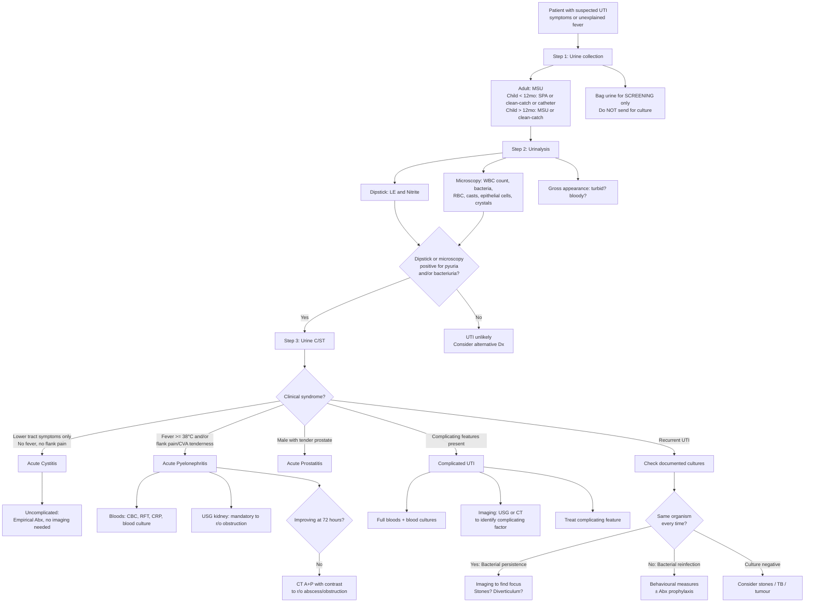

## Diagnostic Criteria, Diagnostic Algorithm, and Investigation Modalities

### 1. Foundational Principle: What Constitutes a Diagnosis of UTI?

Before diving into tests and criteria, let's establish the conceptual framework. UTI is fundamentally a **clinical diagnosis supported by laboratory findings**. You need three things:

1. **Clinical symptoms/signs** of urinary tract inflammation
2. **Pyuria** (evidence of inflammatory response)
3. **Significant bacteriuria** (evidence of causative pathogen)

***Pyuria (more than 10 leucocytes per field) and bacteriuria in a fresh urine sample will reinforce the clinical diagnosis of UTI.*** [1]

***Epithelial cells strongly suggestive of contamination.*** [1]

***WBC casts pathognomonic of pyelonephritis.*** [1]

A positive culture alone without symptoms is **asymptomatic bacteriuria**, not UTI. Pyuria alone without bacteriuria is **sterile pyuria** — a different diagnostic entity entirely. ***+ve culture ≠ UTI → UTI = significant bacteriuria + pyuria*** [3]

<Callout title="The Diagnostic Trinity of UTI">
**Symptoms + Pyuria + Significant bacteriuria = UTI.** Miss any one component and you either have a different diagnosis (sterile pyuria, asymptomatic bacteriuria) or insufficient evidence for treatment.
</Callout>

---

### 2. Diagnostic Criteria by UTI Category

The EAU classification system provides formal diagnostic criteria, and this was presented in the lecture slides [1]:

| Category | Clinical Criteria | Laboratory Criteria |
|----------|------------------|-------------------|
| ***1. Acute uncomplicated cystitis in women*** | ***Dysuria, urgency, frequency, suprapubic pain; no urinary symptoms in 4 weeks before this episode*** | ***> 10 WBC/mm³; > 10³ CFU/mL*** |
| ***2. Acute uncomplicated pyelonephritis*** | ***Fever, chills, flank pain; other diagnoses excluded; no history or clinical evidence of urological abnormalities (ultrasonography, radiography)*** | ***> 10 WBC/mm³; > 10⁴ CFU/mL*** |
| ***3. Complicated UTI*** | ***Any combination of symptoms from categories 1 and 2 above; one or more factors associated with a complicated UTI*** | ***> 10 WBC/mm³; > 10⁵ CFU/mL in women; > 10⁴ CFU/mL in men, or in straight catheter urine in women*** |
| ***4. Asymptomatic bacteriuria*** | ***No urinary symptoms*** | ***> 10 WBC/mm³; > 10⁵ CFU/mL in two consecutive MSU cultures > 24 hours apart*** |
| ***5. Recurrent UTI*** | ***At least 3 episodes of uncomplicated infection documented by culture in last 12 months; women only; no structural/functional abnormalities*** | ***< 10³ CFU/mL (between episodes, confirming clearance)*** |

**Why do the CFU/mL thresholds differ?**

The classic Kass criterion of **≥ 10⁵ CFU/mL** was established in the 1950s for asymptomatic bacteriuria in women using MSU. But we now know that:

- In **symptomatic cystitis**, a lower count of **≥ 10³ CFU/mL** is significant because the patient has symptoms AND pyuria — the pre-test probability is already high, so a lower bacterial count still represents true infection (bacteria haven't had time to multiply to 10⁵ because the patient is voiding frequently due to urgency)
- In **pyelonephritis**, the threshold is **≥ 10⁴ CFU/mL** — an intermediate value because upper tract infection involves larger bacterial burden than early cystitis
- In **men**, even **≥ 10³ CFU/mL** is significant because male UTI is inherently uncommon — any bacteriuria in a symptomatic male deserves attention [4]
- In **catheter specimens**, contamination risk is lower, so **≥ 10⁴ CFU/mL** suffices
- In **suprapubic aspirate (SPA)**, ANY growth is significant because the bladder is normally sterile, and this specimen bypasses all sources of contamination

| Specimen Type | Significant Bacteriuria Threshold | Rationale |
|---------------|----------------------------------|-----------|
| MSU (female, symptomatic) | ≥ 10³ CFU/mL | High pre-test probability; frequent voiding ↓bacterial concentration |
| MSU (male, symptomatic) | ≥ 10³ CFU/mL | Male UTI inherently uncommon → lower threshold |
| MSU (asymptomatic screening) | ≥ 10⁵ CFU/mL × 2 specimens | Need high specificity to avoid treating colonisation |
| Catheter specimen | ≥ 10⁴ CFU/mL | ↓Contamination compared to MSU |
| Suprapubic aspirate | **Any growth** | Bladder normally sterile; bypasses all contamination |
| Bag urine (paediatric) | **NOT valid for culture** | Too contaminated by perineal flora |

[2][3][4]

---

### 3. Diagnostic Approach and Algorithm

***Diagnostic evaluation: defined clinically, may be difficult in elderly*** [4]

The approach involves:
1. ***Clinical S/S*** [4]
2. ***Urinalysis: gross, R/M, dipstick for leukocyte esterase and nitrites*** [4]
3. ***Urine C/ST*** [4]
4. ***± Imaging: not required in most UTI → to look for underlying factors amenable to non-medical means and diagnosis of focus of bacterial persistence*** [4]

#### 3.1 Two-Step Approach in Paediatrics

***General approach*** [2]:
- ***Screening test: sent for microscopy for pyuria or bacteriuria, dipstick for leukocyte esterase, nitrite and ANY positive results should lead to confirmatory tests***
  - ***Choice of urine collection: bag urine***
- ***Confirmatory test: sent for microscopy (pyuria/bacteriuria), leukocyte esterase, nitrite and culture with sensitivity test***
  - ***Choice of urine collection:***
    - ***< 12 months: suprapubic aspiration / clean-catch urine / catheterised urine***
    - ***> 12 months: midstream urine / clean-catch urine / catheterised urine***

#### 3.2 Workup of Suspected UTI — Key History Questions

***Workup of suspected UTI should include*** [1]:
- ***Associated gross haematuria?***
- ***Previous antibiotic treatment***
- ***Presence of "complicated" features***
  - ***E.g. neuropathic bladder, renal stone, previous surgery to urinary tract***
- ***Recurrent attack?***
- ***Social & drug history: ?ketamine use***

#### 3.3 Master Diagnostic Algorithm

---

### 4. Investigation Modalities — Detailed Breakdown

#### 4.1 Urine Collection Methods

The specimen collection method critically determines the reliability of results. ***↑Invasiveness = ↓contamination risk*** [4].

| Method | Description | Validity | Key Points |
|--------|------------|----------|------------|
| ***Bag urine*** | Adhesive bag attached to perineum | ***Send for urinalysis ONLY (visual + chemical + microscopic). Do NOT send bag urine specimen for culture since it is prone to contamination by flora around the perineum*** [2] | Screening tool only; high false-positive rate for culture |
| ***Mid-stream urine (MSU)*** | ***Commonest method done. Prone to contamination particularly in females. NOT applicable in young children*** [2] | ***Can send for both urinalysis and culture with sensitivity testing*** [2] | Patient must clean perineum first; void initial stream to flush urethral commensals; collect mid-portion |
| ***Clean-catch urine*** | Urine caught mid-stream without cleaning | ***Can send for both urinalysis and culture with sensitivity testing*** [2] | Used for toddlers who can void on cue; parent "catches" mid-stream |
| ***Urethral catheterisation*** | ***NOT indicated unless patients are unable to void. Risk of iatrogenic UTI*** [2] | ***Can send for both urinalysis and culture with sensitivity testing*** [2] | Lower contamination than MSU; threshold ≥ 10⁴ CFU/mL; risk of introducing infection (1–3%) |
| ***Suprapubic aspiration (SPA)*** | ***Most accurate method. Requires a distended bladder. Indicated in paediatric patients and spinal cord injury with paraplegia*** [2] | ***Can send for both urinalysis and culture with sensitivity testing*** [2] | Gold standard — any growth is significant; done under USS guidance; bypasses all contamination |

<Callout title="Exam Tip: Bag Urine" type="error">
A common exam trap: a bag urine culture grows 10⁵ CFU/mL of *E. coli*. Is this UTI? **No** — bag urine is valid for screening urinalysis only and is NOT reliable for culture. You must confirm with a properly collected specimen (SPA, catheter, or clean-catch) before diagnosing UTI in a child.
</Callout>

#### 4.2 Urine Dipstick

The urine dipstick is a **rapid bedside screening tool**. Two key markers are used for UTI:

| Marker | What It Detects | Mechanism | Performance | Pitfalls |
|--------|----------------|-----------|-------------|---------|
| ***Nitrite (more specific)*** [2] | ***Indicates bacteriuria*** | ***Enterobacteriaceae express nitrate reductase which converts urinary nitrate into nitrite*** [2] | High specificity (~95%) but moderate sensitivity (~50%) | ***False-negative results in Gram-positive or Pseudomonas UTI*** [2] (these organisms lack nitrate reductase). Also FN if urine has been in bladder < 4 hours (insufficient time for conversion), or in patients on low-nitrate diet |
| ***Leukocyte esterase (LE) (more sensitive)*** [2] | ***Indicates pyuria*** | ***Leukocyte esterase is released by lysed neutrophils and macrophages and is a marker for the presence of WBC*** [2] | High sensitivity (~80–90%) but lower specificity (~70%) | False-positive in vaginal contamination, genital inflammation. False-negative with very dilute urine, high glucose, high ascorbic acid |

| Additional Dipstick Parameters | Interpretation |
|-------------------------------|---------------|
| ***Urine pH*** | ***Normal urinary pH 5.5–6.5. An overly alkaline urine ( > 7.5) suggests infection by an urease-producing organism, especially in the presence of stones. E.g. Proteus, Klebsiella, Pseudomonas etc. Urea converted by bacteria to ammonia → raises pH → facilitates precipitation of struvite calculi (magnesium ammonium phosphate or "triple phosphate stone")*** [1] |
| ***Urine specific gravity (SG)*** | ***Reflects concentration of urine and therefore hydration status. SG is defined as the weight of solution compared with weight of an equal volume of distilled water*** [2]. A very dilute specimen (low SG) may give false-negative results |
| Blood (haem) | Detects haemoglobin — positive in haematuria, haemoglobinuria, myoglobinuria. Must correlate with microscopy to confirm actual RBCs present |
| Protein | If significantly positive → consider glomerular disease rather than simple UTI |

**Dipstick interpretation logic for UTI**:

| LE | Nitrite | Interpretation |
|----|---------|---------------|
| + | + | **Strongly suggestive of UTI** — both pyuria and bacteriuria present |
| + | − | Pyuria present but nitrite-negative — could be early UTI, Gram-positive UTI, or non-infective cause of pyuria |
| − | + | Bacteriuria without pyuria — possible colonisation/contamination, or very early infection |
| − | − | **UTI very unlikely** (negative predictive value > 95%) |

> **Practical approach**: If **either** LE or nitrite is positive, send urine for culture and treat based on clinical picture. If **both** are negative, UTI is very unlikely and you should reconsider the diagnosis [2].

#### 4.3 Urine Microscopy

Microscopy provides direct visualisation of cellular elements and is more informative than dipstick alone.

| Finding | Definition/Threshold | Clinical Significance |
|---------|---------------------|----------------------|
| ***Pyuria*** | ***> 2 WBC/HPF (OR) > 10 WBC/mL*** [2] | Inflammatory response in urinary tract. ***Pyuria and bacteriuria together suggests genuine UTI*** [2] |
| ***Sterile pyuria*** | ***Pyuria without bacteriuria*** | ***May indicate TB, partially treated UTI, urinary tract stones, bladder cancer and inflammatory conditions such as interstitial cystitis and ketamine cystitis*** [2] |
| Bacteriuria (microscopic) | ***Only seen when > 10⁵ CFU/mL*** [3] | ***Does not equate genuine bacteriuria. May be normal flora or contamination*** [3] |
| ***WBC casts*** | Casts containing WBCs formed in renal tubules | ***Pathognomonic of pyelonephritis*** [1] — because WBCs are trapped in a Tamm-Horsfall protein matrix within the renal tubules, proving the inflammatory process is in the kidney |
| RBC / dysmorphic RBC | Dysmorphic RBCs have been distorted passing through glomerular basement membrane | Dysmorphic RBCs and RBC casts → glomerular origin. Isomorphic RBCs → urological (post-renal) origin |
| ***Epithelial cells*** | Squamous epithelial cells from skin/vaginal mucosa | ***Strongly suggestive of contamination*** [1] — specimen should be recollected |
| Crystals | Various types based on composition | ***Struvite crystal due to urease-positive bacterial infection*** [3]. Uric acid crystal in acid urine. Calcium oxalate in alkaline urine |

#### 4.4 Urine Culture and Sensitivity (C/ST)

This is the **gold standard** for confirming UTI and guiding antibiotic therapy.

**When is urine C/ST indicated?**

| Scenario | C/ST Indicated? | Rationale |
|----------|----------------|-----------|
| Uncomplicated cystitis in young women | Not always (can treat empirically) | High pre-test probability; predictable microbiology; short course treatment |
| Complicated UTI | **Always** | Broader pathogen spectrum; risk of resistance; need directed therapy |
| Pyelonephritis | **Always** | Serious infection; blood cultures also indicated |
| Male UTI | ***Always — routine in males*** [4] | ***50% have underlying urological abnormalities*** → need to identify pathogen |
| Recurrent UTI | **Always** | To differentiate reinfection vs persistence; guide prophylaxis |
| Paediatric UTI | **Always** | Need to confirm diagnosis; guide subsequent imaging decisions |
| Pregnancy | **Always** (including screening) | ***Asymptomatic bacteriuria in pregnancy requires treatment*** due to risk of pyelonephritis, prematurity, and low birth weight [2] |
| Catheter-associated | Only if **symptomatic** | Asymptomatic catheter bacteriuria is nearly universal and should NOT be treated |

**Interpreting culture results**:

| Result | Interpretation |
|--------|---------------|
| Single organism, count above threshold, with pyuria | **True UTI** — treat according to sensitivity |
| Multiple organisms | Likely **contamination** — repeat specimen (unless catheter/complicated UTI where polymicrobial is possible) |
| Growth below threshold | Usually colonisation or contamination; correlate clinically |
| No growth but pyuria present | **Sterile pyuria** — consider TB (send ***EMU × 3 for AFB culture***), stones, cancer, partially treated UTI, interstitial cystitis |

#### 4.5 Blood Investigations

| Test | When to Order | Expected Findings and Rationale |
|------|--------------|-------------------------------|
| ***CBC with differentials*** [2] | Pyelonephritis, complicated UTI, sepsis | Leukocytosis with neutrophilia; left shift in severe infection |
| ***RFT (renal function tests)*** [2] | Pyelonephritis, complicated UTI, obstruction suspected | ↑Creatinine may indicate obstructive uropathy, AKI from sepsis, or pre-existing CKD |
| ***Serum inflammatory markers (CRP, ESR)*** [2] | ***↑ESR and CRP for acute pyelonephritis*** [2] | Differentiates upper from lower UTI (CRP is typically normal or minimally elevated in uncomplicated cystitis) |
| **Blood culture** | Pyelonephritis, urosepsis, febrile UTI | Positive in 15–30% of pyelonephritis cases; essential for guiding IV antibiotic therapy in sepsis |
| Procalcitonin (PCT) | Paediatric UTI, sepsis evaluation | PCT > 0.5 ng/mL suggests upper tract involvement; useful in distinguishing cystitis from pyelonephritis in children |
| ***PSA*** | Acute prostatitis (may be incidentally elevated) | ***↑PSA*** in acute prostatitis [4]; do NOT use for cancer screening during active infection as it will be falsely elevated |

<Callout title="CRP in UTI: Upper vs Lower" type="idea">
CRP is a useful discriminator. In **uncomplicated cystitis**, CRP should be **normal or minimally raised** ( < 20 mg/L). A **significantly elevated CRP ( > 50–100 mg/L)** with urinary symptoms should make you think **pyelonephritis** or **complicated UTI**, even if the patient doesn't have classic flank pain. This is especially useful in elderly patients with atypical presentations.
</Callout>

#### 4.6 Imaging

***Imaging is not required in most UTI → to look for underlying factors amenable to non-medical means and diagnosis of focus of bacterial persistence*** [4]

| Modality | Indications in UTI | Key Findings | Advantages / Limitations |
|----------|-------------------|-------------|------------------------|
| **USG Kidneys** | ***Mandatory for severe infection to rule out obstruction*** [4]; first-line imaging in all paediatric UTI; recurrent UTI | Hydronephrosis (obstruction), renal abscess, perinephric collection, renal stones, cortical thinning (chronic reflux), bladder wall thickening, post-void residual volume | Bedside, no radiation, no contrast. Limitation: poor at visualising ureters (only proximal and distal ends) and small stones [7] |
| ***NCCT (non-contrast CT)*** | ***Standard Ix if flank pain or ureteric colic*** [7]; suspected urolithiasis as complicating factor | ***Allows assessment of level, size, density and degree of obstruction of calculi*** [7]; perinephric stranding in pyelonephritis | Gold standard for stones; no contrast needed. Limitation: radiation exposure |
| ***CT A+P with contrast*** | ***If no improvement > 72 hours*** in pyelonephritis [4]; suspected abscess, EPN, EC | Rim-enhancing abscess, gas within renal parenchyma (EPN) or bladder wall (EC), extent of perinephric disease, obstructing cause | ***Detection of anatomic abnormalities; detection of processes that delay response to therapy including urinary stones, urinary tract obstruction or papillary necrosis; diagnose complications of infection such as renal or perinephric abscess; more sensitive than ultrasound to detect renal abnormalities*** [2] |
| ***CT urogram (CTU)*** | Persistent haematuria after UTI resolution; recurrent UTI with suspected structural abnormality | ***Allows delineation of all significant upper tract pathology*** [7]; three phases (non-contrast, nephrographic, delayed/excretory) | Largely replaced IVU; excellent anatomical detail. Limitation: radiation + contrast |
| ***XR KUB*** | Initial screening, largely superseded by CT | Radio-opaque stones (calcium-containing), loss of psoas shadow (perinephric abscess) | Quick and cheap. Limitation: misses radiolucent stones (uric acid), poor sensitivity |
| ***Cystoscopy*** | Persistent haematuria; recurrent UTI with suspected lower tract pathology; ***Ix of choice for lower urinary tract*** [7] | Bladder tumour, bladder stones, urethral stricture, bladder diverticulum, ureteric orifice abnormalities | Direct visualisation + biopsy capability. Limitation: invasive |
| **MCUG (micturating cystourethrogram)** | Paediatric UTI with suspected VUR or PUV | Grades VUR (I–V); posterior urethral valves (dilated posterior urethra + bladder trabeculation) | Gold standard for VUR diagnosis. Indication in paediatrics: ***abnormal USG / recurrent UTI / atypical UTI / abnormal DMSA*** [2] |
| **DMSA scan** | Paediatric UTI — to detect renal scarring | Photopenic areas = scarring; differential renal function | ***Done 4–6 months after acute infection to detect the formation of scarring*** [2]; ***Indications: VUR ≥ Grade 3 / recurrent UTI*** [2] |

#### 4.7 Paediatric-Specific Subsequent Imaging Workup

After acute UTI in children, imaging is performed to detect **VUR, obstruction, and renal scarring** — because these are correctable/monitorable causes that can prevent long-term renal damage.

| Guideline | RBUS (Renal-Bladder USG) | MCUG | DMSA |
|-----------|-------------------------|------|------|
| ***AAP guidelines*** | ***ALL infants and children 2–24 months old*** | ***Infants 2–24 months old if: abnormal USG showing hydronephrosis, scarring, or other findings suggesting high-grade VUR or obstructive uropathy; presence of other atypical or complex clinical circumstances*** | N/A |
| ***NICE guidelines*** | ***ALL infants < 6 months old; atypical or recurrent UTI in children 6 months – 3 years old*** | ***Atypical or recurrent UTI in infants < 6 months old; atypical or recurrent UTI in children 6 months – 3 years old if: abnormal USG (ureteral dilation), poor urine flow, non-E. coli infection, family history of VUR*** | ***Atypical or recurrent UTI in children < 3 years old; recurrent UTI in children > 3 years old*** |

[2]

***NICE Definitions*** [2]:
- ***Recurrent UTI: ≥ 2 episodes of upper UTI; 1 episode of upper UTI + ≥ 1 episode of lower UTI; ≥ 3 episodes of lower UTI***
- ***Atypical UTI: seriously ill; poor urine flow; abdominal or bladder mass; elevated serum creatinine; septicaemia; failure to respond to treatment with suitable antibiotics within 48 hours; infection with non-E. coli organisms***

#### 4.8 Special Investigations

| Test | Indication | Rationale |
|------|-----------|-----------|
| ***Early morning urine (EMU) × 3 for AFB culture*** | Sterile pyuria, chronic UTI symptoms, TB exposure history | *M. tuberculosis* requires Lowenstein-Jensen media or BACTEC system; standard urine culture will be negative. EMU has highest mycobacterial concentration [6] |
| **TB-PCR on urine** | As above, faster result | Sensitivity 87–100%, specificity 93–98% [6] |
| **Urine cytology** | Persistent haematuria after UTI treatment, recurrent UTI in patients with malignancy risk factors | ***Can detect high-grade transitional cell carcinoma before gross lesion becomes noticeable (carcinoma-in-situ of bladder). Low detection rate for low-grade cancer*** [7]. Interpretation: normal / atypical / ***suspicious*** / ***malignant*** [7] |
| **Urodynamic study** | Recurrent UTI with suspected voiding dysfunction, neurogenic bladder | Measures detrusor pressure, flow rate, bladder compliance, residual volume; identifies detrusor overactivity or underactivity |
| **Bladder diary** | Recurrent UTI, OAB symptoms | Records voiding frequency, volumes, fluid intake, incontinence episodes — objective assessment of bladder function [5] |

---

### 5. Approach to Specific Clinical Scenarios

#### 5.1 Uncomplicated Cystitis in Women

- Diagnosis is primarily **clinical** — classic triad of dysuria + frequency + urgency without systemic symptoms
- **Dipstick** is usually sufficient for confirmation (LE+ and/or Nitrite+)
- Urine C/ST **not mandatory** for first episode — can treat empirically [4]
- **No imaging required**

#### 5.2 Acute Pyelonephritis

- **Clinical diagnosis** supported by fever ≥ 38°C + flank pain/CVA tenderness
- **Urine C/ST always required** [4]
- **Blood culture should be obtained** [4]
- **Bloods**: CBC, RFT, CRP/ESR
- ***USG kidney: mandatory for severe infection to rule out obstruction*** [4]
- ***Contrast CT A+P if no improvement > 72 hours → to rule out renal abscess and obstruction*** [4]

#### 5.3 Male UTI

- ***Dx: clinical + urinalysis (WBC > 10/mm³) + culture (routine in males, > 10³ CFU/mL)*** [4]
- ***Need for further evaluation: 50% have underlying urological abnormalities*** [4]
- ***Indications for further evaluation (should focus on lower urinary tract): severe UTI (febrile UTI, pyelonephritis), recurrent UTI → to rule out chronic prostatitis, history of voiding difficulties and AROU, persistent microscopic haematuria*** [4]

#### 5.4 Recurrent UTI

- **Always obtain urine C/ST** to document organisms and sensitivities
- ***Check documented culture: urine C/ST if not available*** [5]
  - ***Culture negative: consider stones / TB / tumour*** [5]
  - ***Rule out treatment failure: resistant strain / incorrect antibiotics / poor compliance to treatment*** [5]
- **Imaging** (USG ± CT) if evidence of bacterial persistence, recurrent Proteus spp, history of stones, persistent haematuria [4]
- **Cystoscopy** if persistent haematuria or suspected lower tract pathology

#### 5.5 Asymptomatic Bacteriuria — When to Screen and Treat

***Asymptomatic bacteriuria refers to ≥ 10³ CFU/mL in males and ≥ 10⁵ CFU/mL in females and requires screening and treatment ONLY in pregnancy or patients undergoing genitourinary procedure with risk of mucosal bleeding and sepsis*** [2].

***Routine screening and treatment of asymptomatic bacteriuria in pregnant patients is due to higher risk of progression into UTI and its association with prematurity and low birth weight*** [2].

| Population | Screen for ASB? | Treat if Found? | Rationale |
|-----------|----------------|----------------|-----------|
| **Pregnant women** | **Yes** | **Yes** | 20–40% of untreated ASB in pregnancy progresses to pyelonephritis; a/w preterm labour and low birth weight |
| **Pre-urological procedure** | **Yes** | **Yes** | Mucosal breach during instrumentation → bacteraemia risk |
| **Elderly / catheterised** | **No** | **No** | ASB is extremely common (up to 50% in institutionalised elderly); treatment does NOT improve outcomes and promotes resistance |
| **Diabetic patients** | **No** | **No** | Despite higher ASB rates, treatment of ASB in DM does not prevent symptomatic UTI |
| **Spinal cord injury** | **No** | **No** | Chronic colonisation is near-universal; treat only if symptomatic |

<Callout title="Do NOT Treat Asymptomatic Bacteriuria" type="error">
One of the most common clinical errors in hospital medicine is treating a positive urine culture in an asymptomatic catheterised or elderly patient. This drives antimicrobial resistance without benefit. The ONLY populations requiring ASB screening and treatment are **pregnant women** and **patients about to undergo invasive urological procedures**.
</Callout>

---

### 6. Summary: When to Get Which Test

| Investigation | Uncomplicated Cystitis | Pyelonephritis | Complicated UTI | Male UTI | Recurrent UTI | Paediatric UTI |
|--------------|----------------------|----------------|-----------------|----------|---------------|---------------|
| Dipstick | ✓ | ✓ | ✓ | ✓ | ✓ | ✓ (screening) |
| Urine microscopy | ± | ✓ | ✓ | ✓ | ✓ | ✓ |
| Urine C/ST | Optional (1st episode) | **Always** | **Always** | **Always** | **Always** | **Always** |
| CBC, RFT, CRP | Not routine | ✓ | ✓ | If febrile | ± | ✓ |
| Blood culture | No | **Yes** | If febrile/septic | If febrile | No | If febrile |
| USG | No | **Mandatory** | **Yes** | If complicated features | ± | **Yes (all < 2y)** |
| CT | No | If no improvement > 72h | If complications suspected | ± | If persistence suspected | If atypical |
| MCUG | No | No | No | No | No | If VUR suspected |
| DMSA | No | No | No | No | No | If scarring suspected |
| Cystoscopy | No | No | ± | If persistent haematuria | If persistent haematuria | No |

---

<Callout title="High Yield Summary: Diagnostics of UTI">

**Diagnosis = Symptoms + Pyuria + Significant Bacteriuria.** +ve culture alone is NOT UTI.

**Dipstick**: LE (sensitive, detects pyuria) + Nitrite (specific, detects Gram-negative bacteriuria). Both negative → UTI very unlikely (NPV > 95%).

**Microscopy**: Pyuria > 10 WBC/mL; epithelial cells = contamination; WBC casts = pathognomonic of pyelonephritis; sterile pyuria → think TB, stones, cancer.

**Culture thresholds**: Symptomatic cystitis ≥ 10³; pyelonephritis ≥ 10⁴; asymptomatic bacteriuria ≥ 10⁵ × 2; SPA = any growth significant; bag urine = invalid for culture.

**Urine pH > 7.5** → urease-producing organism (Proteus, Klebsiella, Pseudomonas) → struvite stones.

**Imaging**: Not needed in uncomplicated cystitis. USG mandatory in pyelonephritis to rule out obstruction. CT if no improvement at 72h. Paediatric: RBUS for all < 2y with UTI; MCUG if abnormal USG/atypical/recurrent UTI; DMSA for renal scarring.

**Asymptomatic bacteriuria**: Screen and treat ONLY in pregnancy and pre-urological procedures. Do NOT treat in elderly, catheterised, or diabetic patients.

**Male UTI**: Always culture; 50% have underlying abnormality; always consider further evaluation.

</Callout>

---

<ActiveRecallQuiz
  title="Active Recall - Diagnostic Criteria and Investigations for UTI"
  items={[
    {
      question: "State the CFU/mL thresholds for significant bacteriuria in: (a) symptomatic cystitis in women, (b) acute pyelonephritis, (c) asymptomatic bacteriuria, (d) suprapubic aspirate. Explain why the thresholds differ.",
      markscheme: "(a) >= 10^3 CFU/mL - lower threshold because high pre-test probability + frequent voiding dilutes bacterial concentration. (b) >= 10^4 CFU/mL - intermediate, larger burden in upper tract. (c) >= 10^5 CFU/mL in two consecutive MSU > 24 hours apart - need high specificity to avoid treating colonisation. (d) Any growth - bladder is normally sterile, SPA bypasses all contamination sources.",
    },
    {
      question: "What does the nitrite test on urine dipstick detect, and why might it be false-negative in a genuine UTI?",
      markscheme: "Nitrite detects bacteriuria. Enterobacteriaceae express nitrate reductase which converts urinary nitrate into nitrite. False-negative causes: (1) Gram-positive organisms (lack nitrate reductase), (2) Pseudomonas (lacks nitrate reductase), (3) urine in bladder less than 4 hours (insufficient conversion time), (4) low-nitrate diet.",
    },
    {
      question: "A child's bag urine grows 10^5 CFU/mL of E. coli. Can you diagnose UTI? What should you do next?",
      markscheme: "No - bag urine is valid for screening urinalysis ONLY and should NOT be sent for culture due to high contamination rate from perineal flora. Must confirm with a properly collected specimen: SPA, catheter, or clean-catch urine for culture. If under 12 months: SPA or catheterised urine; if over 12 months: MSU or clean-catch.",
    },
    {
      question: "What is sterile pyuria? List 5 causes and state which is the must-not-miss diagnosis.",
      markscheme: "Sterile pyuria = pyuria (> 10 WBC/mL) without bacteriuria on standard culture. Causes: (1) TB - the must-not-miss diagnosis, send EMU x3 for AFB culture; (2) partially treated UTI; (3) urolithiasis; (4) bladder cancer; (5) interstitial cystitis; (6) ketamine cystitis; (7) interstitial nephritis. TB is must-not-miss because it requires specific culture media and prolonged treatment.",
    },
    {
      question: "In which two clinical populations should asymptomatic bacteriuria be screened for and treated? Why should it NOT be treated in the elderly?",
      markscheme: "Screen and treat in: (1) pregnant women - untreated ASB has 20-40% risk of progression to pyelonephritis, associated with prematurity and low birth weight; (2) patients about to undergo invasive urological procedures - risk of mucosal bleeding allowing bacteraemia. NOT treated in elderly because ASB is extremely common (up to 50% in institutionalised patients), treatment does not improve outcomes, and unnecessary antibiotics drive antimicrobial resistance.",
    },
    {
      question: "When is imaging indicated in UTI? State the modality and indication for pyelonephritis at presentation and at 72 hours with no improvement.",
      markscheme: "At presentation: USG kidney is mandatory in pyelonephritis/severe infection to rule out obstruction (hydronephrosis). At 72 hours with no improvement: contrast CT abdomen and pelvis to rule out renal/perinephric abscess, emphysematous pyelonephritis, obstruction, or other complicating pathology that requires drainage or surgical intervention.",
    },
  ]}
/>

## References

[1] Lecture slides: GC 210. Urinary tract infection.pdf
[2] Senior notes: felixlai.md (UTI section — diagnosis, urine collection, biochemical tests, paediatric imaging)
[3] Senior notes: Ryan Ho Fundamentals.pdf (p478, Urinalysis interpretation)
[4] Senior notes: Ryan Ho Urogenital.pdf (p122–128, UTI diagnostic evaluation and clinical syndromes)
[5] Senior notes: maxim.md (Recurrent UTI approach, urinary incontinence investigations)
[6] Senior notes: Ryan Ho Respiratory.pdf (p78, Genitourinary TB — EMU AFB culture and TB-PCR)
[7] Senior notes: Ryan Ho Urogenital.pdf (p130–134, Approach to Haematuria — imaging modalities) and Ryan Ho Fundamentals.pdf (p343–344)
