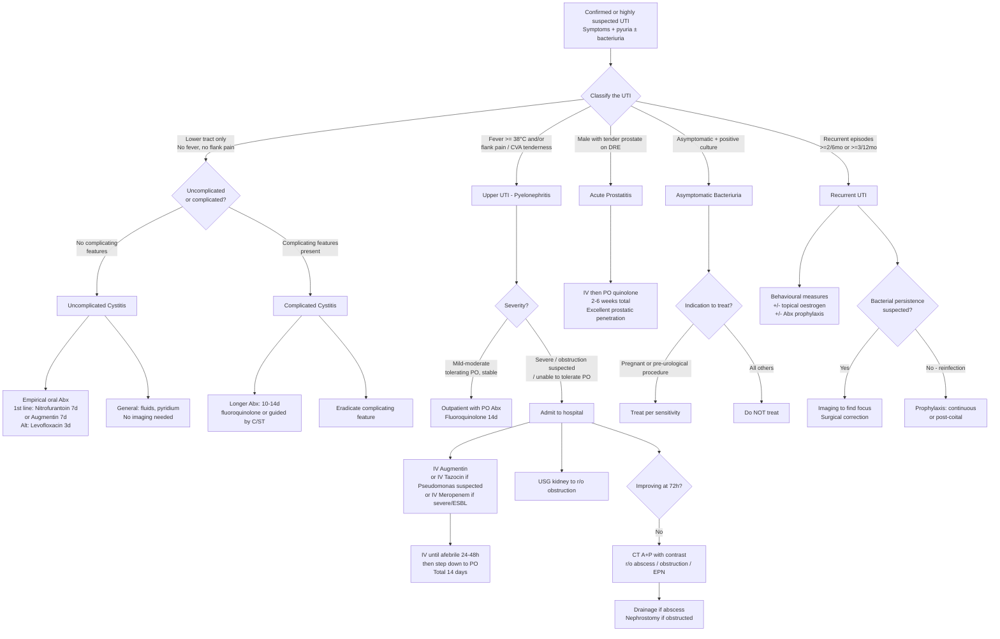

## Management of Urinary Tract Infection

### 1. General Principles of UTI Management

Before jumping into specific regimens, let's establish the overarching management principles. These are the "why" behind every treatment decision:

**Principle 1: Classify before you treat.**
The management differs drastically depending on whether this is uncomplicated vs complicated, upper vs lower, first episode vs recurrent. Getting the classification right determines antibiotic choice, duration, route, and need for imaging/intervention.

**Principle 2: Treat the infection AND address the underlying cause.**
Antibiotics alone won't cure a UTI if there's an obstructed kidney, a stone acting as a nidus, or a neurogenic bladder with 500 mL residual. ***Measures should be made to eradicate the complicating feature*** [4] — this is the single most important concept in complicated UTI management.

**Principle 3: Antibiotic choice is guided by:**
***Choice of antibiotics: based on*** [4]:
- ***Likely microbiology and local resistance pattern***
- ***Any recent antimicrobial use***
- ***Costs, allergy, S/E profile…***

In Hong Kong, this is particularly important because **ESBL-producing *E. coli*** rates are 25–30% in community isolates, and **fluoroquinolone resistance** exceeds 30% — meaning empirical quinolone use is increasingly unreliable locally.

**Principle 4: Collect cultures before antibiotics in complicated cases.**
For uncomplicated cystitis, empirical treatment without culture is acceptable. For everything else — pyelonephritis, complicated UTI, male UTI, recurrent UTI, paediatric UTI — cultures should be obtained BEFORE starting antibiotics, because you may need to adjust therapy based on sensitivity results.

***MUST identify underlying G6PD deficiency*** [2] — this is critical before prescribing nitrofurantoin or co-trimoxazole (septrin), both of which can cause haemolytic crisis in G6PD-deficient patients (common in Hong Kong: ~4.5% of males).

***Clinically treat as upper UTI if fever ≥ 38.0°C or loin pain or tenderness*** [2] — when in doubt, treat as the more serious entity. You don't want to under-treat pyelonephritis with a short course of oral nitrofurantoin.

---

### 2. Master Management Algorithm



---

### 3. Management by Clinical Syndrome

#### 3.1 Acute Uncomplicated Cystitis

This is the bread-and-butter scenario: a young, otherwise healthy woman with dysuria, frequency, and urgency, no fever, no flank pain.

***Treatment can be given empirically without urine C/ST for uncomplicated cases*** [4]

**General measures:**
- ***↑Fluid intake*** [4] — why? Increased urine output "washes out" bacteria and dilutes bacterial concentration. Aim 2–3 L/day
- ***Pyridium (phenazopyridine) to ↓discomfort*** [4] — this is a urinary analgesic that acts directly on the bladder mucosa to reduce pain, burning, and urgency. It turns urine bright orange (warn the patient!)

**Antibiotic regimen** — ***IMPACT 2014 guidelines (Hong Kong)*** [4]:

| Line | Agent | Duration | Notes |
|------|-------|----------|-------|
| ***1st line*** | ***PO nitrofurantoin*** | ***7 days*** | ***~50% resistance among non-E. coli uropathogens*** [4]. Excellent for *E. coli* which causes 75% of uncomplicated UTI. Concentrated in urine only (not systemic) — useless for pyelonephritis |
| ***1st line*** | ***PO Augmentin (amoxicillin-clavulanate)*** | ***7 days*** | ***Not recommended in some guidelines*** [4] but used in HK. Good broad-spectrum coverage |
| ***Alternative*** | ***PO levofloxacin*** | ***3 days*** | ***↑Quinolone-resistant E. coli locally → risk of resistance, not used as 1st line*** [4]. Reserved for alternative due to resistance concerns |

***Duration: single dose regimen not recommended*** [4]

<Callout title="Why Not Fluoroquinolones First-Line?">
Fluoroquinolones (levofloxacin, ciprofloxacin) are powerful broad-spectrum antibiotics, but HK has > 30% fluoroquinolone-resistant *E. coli* in community isolates. Using them first-line for uncomplicated cystitis accelerates resistance development. Reserve them for complicated UTI, pyelonephritis, and prostatitis where their excellent tissue penetration and spectrum are genuinely needed. International guidelines (EAU, IDSA, AUA) all agree on this principle of fluoroquinolone stewardship.
</Callout>

**Understanding each antibiotic from first principles:**

| Antibiotic | Mechanism | Spectrum | Why It Works for UTI | Key Contraindications / S/E |
|-----------|-----------|---------|--------------------|-----------------------------|
| **Nitrofurantoin** ("nitro" = nitrogen; "furantoin" = furan ring) | Reduced by bacterial flavoproteins → reactive intermediates → damage bacterial DNA, RNA, proteins, and cell wall | Gram-positives including Enterococcus; most *E. coli*; NOT effective against Proteus, Pseudomonas, Klebsiella (~50% resistant) | Concentrated in urine (achieves therapeutic levels ONLY in the lower tract) → excellent for cystitis but useless for pyelonephritis or systemic infection | **C/I: CrCl < 30 mL/min** (inadequate urinary concentration), **G6PD deficiency** (haemolytic anaemia), pregnancy at term (38–42 weeks). S/E: GI upset, pulmonary fibrosis (chronic use), peripheral neuropathy |
| **Augmentin** (amoxicillin + clavulanic acid) | Amoxicillin: β-lactam → inhibits PBP → ↓cell wall synthesis. Clavulanate: β-lactamase inhibitor → protects amoxicillin from degradation | Broad: Gram-positives, Gram-negatives including many Enterobacteriaceae, anaerobes | Good oral bioavailability; covers most community uropathogens; clavulanate extends spectrum to β-lactamase producers | S/E: diarrhoea (clavulanate irritates gut), allergic reactions; may not cover ESBL-producers |
| **Levofloxacin** ("levo" = levorotatory isomer; "floxacin" = fluoroquinolone) | Inhibits DNA gyrase (topoisomerase II) and topoisomerase IV → prevents bacterial DNA supercoiling and replication | Very broad: Gram-negatives, some Gram-positives, atypicals | Excellent oral bioavailability (~99%); achieves high urinary AND tissue concentrations; penetrates prostate | C/I: pregnancy, children (cartilage toxicity), known QT prolongation. S/E: tendon rupture (especially with corticosteroids), C. difficile, QT prolongation, CNS effects. **Avoid if possible in > 60 y/o on steroids** |
| **Co-trimoxazole (Septrin)** (trimethoprim + sulfamethoxazole) | Sequential blockade of folate synthesis: sulfamethoxazole inhibits dihydropteroate synthase; trimethoprim inhibits dihydrofolate reductase | Gram-negatives, some Gram-positives | Used for prophylaxis and treatment; good urinary concentration | **C/I: G6PD deficiency**, sulfa allergy, pregnancy (1st trimester — teratogenic). S/E: hyperkalaemia, bone marrow suppression, SJS/TEN (rare) |

#### 3.2 Complicated Cystitis

***Complicated cystitis: refer to cystitis in functionally/structurally abnormal urinary tracts*** [4]

***Complicating features: pregnancy, DM, immunocompromised states, recent Abx use, recent urinary tract intervention, nosocomial infection*** [4]

**Treatment differs in three important ways:**

1. ***Generally require longer duration treatment, e.g. 10–14d fluoroquinolone*** [4]
2. ***Measures should be made to eradicate the complicating feature*** [4]
3. **Urine C/ST is mandatory** — broader pathogen spectrum, higher resistance rates

| Aspect | Approach |
|--------|---------|
| Duration | 10–14 days (vs 3–7 days for uncomplicated) |
| Route | Oral if mild; IV if severe or cannot tolerate oral |
| Antibiotic choice | Guided by C/ST; empirical with broader spectrum (fluoroquinolone, augmentin, or cephalosporin) |
| Complicating feature | Must identify and address: remove catheter, relieve obstruction, optimize glucose control in DM, drain abscess |

#### 3.3 Acute Pyelonephritis

***Management*** [4]:
- ***Hospitalisation if severe or suspicious of obstruction***
- ***Prompt empirical Abx:***
  - ***Choice: IV Augmentin → Tazocin if suspect P. aeruginosa → Imipenem or Meropenem if severe or rapidly deteriorating***
  - ***Regimen: IV until afebrile 24–48h → complete 14-day course with oral drugs***
- ***Contrast CT A+P if no improvement > 72h → to rule out renal abscess and obstruction***

**Step-by-step approach:**

| Step | Action | Rationale |
|------|--------|-----------|
| 1 | **Assess severity**: vitals, sepsis screen, volume status | Determine need for admission vs outpatient management |
| 2 | **Obtain cultures**: urine C/ST + blood cultures | Before antibiotics; blood cultures positive in 15–30% |
| 3 | **Bloods**: CBC, RFT, CRP | Assess inflammatory burden, renal function |
| 4 | **USG kidney**: mandatory in severe infection | Rule out obstruction (pyonephrosis = urological emergency requiring drainage) |
| 5 | **Empirical IV antibiotics** | Start immediately after cultures obtained; don't wait for results |
| 6 | **Monitor response** | Expect clinical improvement (defervescence) within 48–72 hours |
| 7 | **If no improvement at 72h**: CT A+P with contrast | Look for abscess, EPN, obstruction, or other complications requiring intervention |
| 8 | **Step-down to oral** once afebrile 24–48h | Complete total 14-day course |

**Antibiotic escalation ladder for pyelonephritis:**

```
Mild (outpatient):
  PO Fluoroquinolone (levofloxacin or ciprofloxacin) × 14 days
  OR PO Augmentin × 14 days
        ↓ (if worsening or not tolerating PO)
Moderate (inpatient):
  IV Augmentin (amoxicillin-clavulanate 1.2g TDS)
        ↓ (if P. aeruginosa suspected — catheter, instrumentation, nosocomial)
  IV Tazocin (piperacillin-tazobactam 4.5g TDS)
        ↓ (if severe / rapidly deteriorating / ESBL suspected)
  IV Meropenem (1g TDS) or Imipenem (500mg QDS)
```

**Why these specific escalation choices?**

- **Augmentin**: Good first-line IV; covers most community *E. coli* and Enterobacteriaceae; β-lactamase inhibitor extends spectrum
- **Tazocin** ("tazo" = tazobactam, a β-lactamase inhibitor; "cin" from piperacillin): Broader Gram-negative coverage including *Pseudomonas aeruginosa*; the go-to when Pseudomonas is suspected
- **Meropenem/Imipenem**: Carbapenems — the "big guns." Stable against ESBL enzymes. Reserved for severe/resistant cases because overuse drives carbapenem-resistant Enterobacteriaceae (CRE), which is a public health catastrophe

#### 3.4 Emphysematous Pyelonephritis (EPN)

***EPN management*** [1]:
- ***High index of suspicion in patient failing medical treatment for acute pyelonephritis***
- ***Active resuscitation — ABC***
- ***Medical management (MM):***
  - ***O₂, IVF, acid-base balance, Abx, good glycaemic control***
  - ***Keep SBP > 100 with IVF ± inotropes***
  - ***Empirical Abx: aminoglycoside, β-lactamase inhibitor, cephalosporin, quinolones — until C/ST available***
  - ***Renal support if ARF***
  - ***ICU care if multiorgan support needed***

**Surgical / interventional management:**
- **Percutaneous drainage (PCD)**: CT-guided or USG-guided insertion of drain into gas-containing collection. First-line intervention in most EPN
- **Nephrectomy**: Reserved for patients failing PCD + medical management, or those with non-functioning kidney (destroyed by gas-forming infection)
- The traditional approach of immediate nephrectomy has shifted to a **stepwise approach**: medical → PCD → nephrectomy only if failing [1]

#### 3.5 Male UTI

***Male UTI: very uncommon, incidence only 5–8/10k/year*** [4]

***Mx: generally need longer (7d) treatment for male cystitis*** [4]

**Why longer?** Males have a longer urethra and the prostate can harbour bacteria — a 3-day course may sterilise the urine but leave bacteria in the prostate → relapse. Seven days provides a better chance of eradicating the prostatic reservoir.

#### 3.6 Acute Bacterial Prostatitis

***Mx: Empirical Abx — prefer quinolone (excellent prostatic penetration) for 2–6 weeks*** [4]

**Why quinolones specifically for prostatitis?**
- The prostate has a **blood-prostate barrier** (similar in concept to the blood-brain barrier) composed of prostatic epithelial cells with tight junctions
- Most antibiotics penetrate poorly into prostatic tissue
- **Fluoroquinolones** are small, lipophilic molecules with excellent penetration across this barrier (achieving prostatic concentrations 2–3× serum levels)
- **Co-trimoxazole** also penetrates well and is an alternative
- β-lactams and aminoglycosides penetrate poorly → NOT suitable for prostatitis

#### 3.7 Asymptomatic Bacteriuria (ASB)

This was covered in the diagnostic section but the management implications are critical:

| Population | Management | Rationale |
|-----------|-----------|-----------|
| ***Pregnant patients*** | ***Screen and treat per sensitivity*** | ***↑Risk of ascending infection due to physiological changes → ↑risk of preterm delivery and low birth weight infants*** [4] |
| ***Pending urological procedure where mucosal bleeding is anticipated*** | ***Usually require antibiotic prophylaxis*** | ***A/w ↑risk of infective post-procedure complications*** [4] |
| ***Non-pregnant women, men, DM, catheterised patients, SCI, nephrostomy/JJ stent*** | ***Do NOT treat*** | ***Benign natural history; treatment does not ↓risk of symptomatic UTI, complications or death. S/E of Abx e.g. GI upset, C. difficile colitis*** [4] |

#### 3.8 Recurrent UTI

***Recurrent cystitis: 20% of females with UTI will recur within 6 months → common, genetically determined*** [4]

Management follows a stepwise approach:

**Step 1: Behavioural changes** [4]

| Measure | Mechanism | Evidence Level |
|---------|-----------|---------------|
| ***Avoid use of spermicides and diaphragms → use alternative methods*** | Spermicides disrupt vaginal Lactobacilli flora → ↑periurethral colonisation | Good evidence |
| ***Observe personal hygiene → wipe from front to back after voiding*** | ↓Faecal contamination of periurethral area | ***Never shown in case-controlled studies to be associated with ↓risk of recurrent UTI*** [4] — but still sensible advice |
| ***Post-coital voiding*** | Flushes bacteria introduced during intercourse | ***Same caveat — not proven in case-controlled studies*** [4] |
| ***Hydration to maintain adequate urine output → to aim 2–3 L/day fluid intake*** | ↑Urine flow → bacterial washout | ***Same caveat*** [4] |

**Step 2: Topical oestrogen for postmenopausal women**
- ***Topical oestrogen for postmenopausal women: ↓75% incidence of cystitis in RCTs*** [4]
- **Mechanism**: Restores vaginal glycogen → ↑Lactobacilli → ↓vaginal pH → ↓periurethral colonisation by uropathogens
- Applied intravaginally (cream or pessary), NOT systemic HRT
- This is one of the most effective interventions for recurrent UTI in postmenopausal women

**Step 3: Antimicrobial prophylaxis** [4]

***Indication: recurrent symptoms that are specific for UTI persists despite non-Rx measures*** [4]

> ***Don't give Abx for non-specific symptoms, e.g. mental status changes without genitourinary symptoms in elderly*** [4]

| Type | Indication | Regimen | Notes |
|------|-----------|---------|-------|
| ***Continuous prophylaxis*** | ***If no temporal relation to sexual activity*** | ***Usually co-trimoxazole (Septrin) or nitrofurantoin*** [2][4] | Low-dose, taken once nightly; ***can give trial for a few months to assess response first*** [4] |
| ***Post-coital prophylaxis*** | ***If temporally related to sexual activity*** | ***Single post-coital dose*** | ***May be a more efficient and acceptable method of prevention than continuous prophylaxis*** [2]; same agents as above |
| ***Intermittent self-treatment*** | ***Women who prefer to minimise their intake of antimicrobials*** | Patient keeps antibiotics at home and self-treats at symptom onset | ***Patients should be candidates for self-diagnosis and self-treatment*** [2] |

**Step 4: Investigate and correct bacterial persistence** (if suspected)

When the same organism keeps recurring, consider:
- ***Source of bacterial persistence: infected urinary stones, infected atrophic kidneys, ureteral stump after nephrectomy, medullary sponge kidney, papillary necrosis, infected urachal cyst, urethral diverticulum and urinary fistula*** [2]
- Imaging (USG ± CT) to identify the focus
- Surgical correction of the focus

#### 3.9 UTI in Paediatric Patients

***Antibiotic prophylaxis should NOT be routinely prescribed to young children with first episode of UTI*** [2]

**Acute treatment:**

| Severity | Route | Agents | Duration |
|----------|-------|--------|----------|
| Lower UTI (afebrile) | Oral | Augmentin, cephalosporin (cefuroxime, cefixime), co-trimoxazole | 3–5 days |
| Upper UTI (febrile, < 3 months) | IV initially | IV ampicillin + gentamicin; or IV ceftriaxone | 7–10 days total (IV then step-down to PO) |
| Upper UTI (febrile, > 3 months, not toxic) | Oral (if tolerating) or brief IV → PO | As above; oral cephalosporin acceptable if well-appearing | 7–10 days |

***Aminoglycosides (e.g. gentamicin, amikacin): should not be used as monotherapy (with 3rd generation cephalosporin). NOT effective in treating Enterococcus infection*** [2]
***Enterococcus is intrinsically resistant to cephalosporins and aminoglycosides and therefore should use Augmentin or nitrofurantoin*** [2]

**Prophylaxis in children** [2]:

| Indication | Regimen |
|-----------|---------|
| ***VUR Grade ≥ 3*** | ***Prophylactic antibiotics with co-trimoxazole*** |
| ***When MCUG is performed*** | ***Prophylactic antibiotics with Zinnat (cefuroxime) 10 mg/kg*** |
| First episode, no VUR | ***Antibiotic prophylaxis should NOT be routinely prescribed*** |

**Surgical intervention for VUR** [1][2]:

***Surgical intervention for: breakthrough infections, poor compliance with meds, renal scarring*** [1]

***Indications for surgical referral*** [2]:
- ***Recurrence of UTI (2nd episode) + VUR > Grade 3 + significant scarring on DMSA***
- ***Recurrence of UTI (3rd episode) despite antibiotic prophylaxis + VUR > Grade 3***
- ***NOT suggested for patients with Grade 1 and 2 VUR since there is a high likelihood of spontaneous resolution and low risk of renal scarring***

| Surgical Option | Description |
|----------------|-------------|
| ***Ureteral reimplantation (open surgical / robotic-assisted laparoscopic)*** | ***Ureters are reimplanted by tunnelling a ureteral segment through the detrusor muscle thereby creating a submucosal tunnel that is long enough to act as a flap valve.*** Approaches: ***intravesical (bladder is opened) and extravesical approach (bladder not opened) which is associated with shorter hospital stay*** [2] |
| ***Endoscopic correction*** | ***Less invasive ambulatory procedure which injects a periurethral bulking agent via a cystoscope which changes the angle and fixation of intravesical ureter.*** Techniques: ***HIT (Hydrodistension Implantation Technique) — places bulking agent within the ureteral tunnel; STING (Subureteral Transurethral Injection) — places bulking agent outside ureteral orifice*** [2] |

---

### 4. Catheter-Associated UTI (CAUTI) — Management Principles

Catheter-associated UTI is the **most common nosocomial infection** and deserves special mention:

| Principle | Rationale |
|-----------|-----------|
| **Remove or replace the catheter** | Biofilm on the old catheter harbours bacteria that antibiotics cannot penetrate; the new catheter should be in place before antibiotics are started so culture is from a fresh specimen |
| **Treat only if symptomatic** | Asymptomatic catheter bacteriuria is universal after 30 days; treatment does not improve outcomes and promotes resistance |
| **Duration**: 7 days (uncomplicated), 10–14 days (complicated) | Shorter courses reduce resistance selection; longer if slow to respond |
| **Antibiotic choice**: guided by C/ST | Polymicrobial and resistant organisms are common in CAUTI |
| **Prevention**: daily assessment of catheter necessity; aseptic insertion; closed drainage system; avoid unnecessary catheter placement | Most effective strategy to prevent CAUTI is to **not catheterise** or to **remove the catheter as early as possible** |

---

### 5. Urinary Drainage in Obstructed Infected Kidney

An **obstructed + infected** collecting system (pyonephrosis) is a **urological emergency**. Antibiotics alone cannot sterilise pus under pressure. Immediate drainage is required:

| Method | Description | Advantages | Limitations |
|--------|------------|-----------|-------------|
| **Percutaneous nephrostomy (PCN)** | USG/fluoroscopy-guided percutaneous drainage of the renal pelvis | ***Quicker — preferred in septic shock*** [7]; can be done at bedside by interventional radiology | ***C/I: bleeding tendency, distorted surface anatomy, obesity*** [7]; risk of bleeding, infection, pneumothorax |
| **JJ stent (retrograde)** | Cystoscopic placement of an internal ureteric stent from bladder up to renal pelvis | ***More comfortable*** [7]; no external tube | ***Not possible in BPH, incompliant bladder, stone impaction*** [7]; requires theatre/cystoscopy suite |

**Indications for urgent drainage** [2][7]:
- ***Uncontrolled sepsis***
- ***Progressively worsening renal function***
- ***Pyonephrosis*** (NOT simple pyelonephritis — the distinction matters)
- ***Intractable pain***

---

### 6. Summary: Antibiotic Selection by Clinical Syndrome

| Clinical Syndrome | First-Line | Alternative | Duration | Route | Special Notes |
|------------------|-----------|-------------|----------|-------|---------------|
| **Uncomplicated cystitis (F)** | Nitrofurantoin or Augmentin | Levofloxacin | 7d (nitrofurantoin/augmentin); 3d (levofloxacin) | PO | No imaging, no culture needed for 1st episode |
| **Complicated cystitis** | Fluoroquinolone or Augmentin (guided by C/ST) | Cephalosporin | 10–14 days | PO or IV | Eradicate complicating feature |
| **Male cystitis** | As per uncomplicated but longer | — | **7 days** | PO | Always culture; consider further evaluation |
| **Acute pyelonephritis (mild)** | PO fluoroquinolone or Augmentin | — | 14 days | PO | Outpatient if tolerating PO and stable |
| **Acute pyelonephritis (severe)** | IV Augmentin → Tazocin → Meropenem | — | 14 days (IV → PO step-down) | IV then PO | Admit; USG mandatory; CT if no improvement 72h |
| **Acute prostatitis** | Fluoroquinolone (levofloxacin/ciprofloxacin) | Co-trimoxazole | **2–6 weeks** | IV then PO | Quinolone preferred for prostatic penetration |
| **EPN** | AG + β-lactamase inhibitor + cephalosporin + quinolone (broad cover until C/ST) | Carbapenems | Prolonged | IV | ABC resuscitation; PCD ± nephrectomy |
| **Paediatric lower UTI** | Augmentin, cephalosporin, co-trimoxazole | — | 3–5 days | PO | Check G6PD; no prophylaxis for 1st episode |
| **Paediatric upper UTI** | Ampicillin + gentamicin; or ceftriaxone | — | 7–10 days | IV then PO | Aminoglycosides NOT monotherapy; NOT for Enterococcus |

<Callout title="Enterococcus: The Antibiotic Trap" type="error">
***Enterococcus is intrinsically resistant to cephalosporins and aminoglycosides.*** If your urine culture grows Enterococcus, do NOT treat with cefuroxime, ceftriaxone, or gentamicin — they will all fail. Use ***Augmentin or nitrofurantoin*** for lower tract; ampicillin ± gentamicin (synergy, not monotherapy) or vancomycin for serious Enterococcal infections.
</Callout>

---

<Callout title="High Yield Summary: UTI Management">

**General Principles**: Classify first; treat infection AND complicating factors; choose antibiotics based on local resistance patterns; collect cultures before antibiotics in complicated cases; check G6PD before nitrofurantoin/co-trimoxazole.

**Uncomplicated Cystitis**: Empirical PO nitrofurantoin 7d or augmentin 7d (IMPACT HK). Fluoroquinolones are alternative only (resistance > 30% locally). Single-dose regimens not recommended.

**Complicated Cystitis**: Longer course (10–14d); eradicate the complicating feature; culture-guided.

**Pyelonephritis**: IV Augmentin → Tazocin (if Pseudomonas) → Meropenem (if ESBL/severe). IV until afebrile 24–48h → step-down PO. Total 14 days. CT if no improvement at 72h.

**Prostatitis**: Quinolone 2–6 weeks (excellent prostatic penetration).

**Male UTI**: 7 days minimum; always culture; 50% have underlying abnormality.

**Asymptomatic Bacteriuria**: Treat ONLY in pregnancy and pre-urological procedures. Do NOT treat in elderly/catheterised/DM.

**Recurrent UTI**: Behavioural measures → topical oestrogen (postmenopausal) → antimicrobial prophylaxis (continuous vs post-coital). Investigate for bacterial persistence if same organism recurs.

**Paediatric**: No routine prophylaxis for 1st UTI; co-trimoxazole prophylaxis for VUR ≥ Grade 3; surgical referral for recurrent UTI with VUR > 3 + scarring.

**Obstructed infected kidney = Emergency**: PCN or JJ stent for drainage; antibiotics alone are insufficient.

</Callout>

---

<ActiveRecallQuiz
  title="Active Recall - UTI Management"
  items={[
    {
      question: "A 25-year-old woman presents with dysuria and frequency for 2 days. No fever, no flank pain. What is your first-line empirical antibiotic in HK, and why is levofloxacin not first-line?",
      markscheme: "First-line: PO nitrofurantoin for 7 days or PO augmentin for 7 days (IMPACT HK guidelines). Levofloxacin is not first-line because HK has > 30% fluoroquinolone-resistant E. coli in community isolates. Using quinolones first-line for uncomplicated cystitis accelerates resistance. Quinolones reserved as alternative or for complicated/upper tract UTI.",
    },
    {
      question: "A patient with acute pyelonephritis is admitted on IV augmentin. At 72 hours she remains febrile with persistent flank pain. What is your next step and why?",
      markscheme: "Contrast CT abdomen and pelvis to rule out: (1) renal or perinephric abscess requiring drainage, (2) obstruction causing pyonephrosis requiring PCN or JJ stent, (3) emphysematous pyelonephritis. Antibiotics alone cannot treat pus under pressure or gas-forming infections. Also consider escalating antibiotics (Tazocin or Meropenem) and reviewing culture sensitivities.",
    },
    {
      question: "Why are fluoroquinolones the preferred antibiotic for acute prostatitis? Name one alternative agent with similar prostatic penetration.",
      markscheme: "The prostate has a blood-prostate barrier with tight epithelial junctions that most antibiotics cannot cross. Fluoroquinolones are small, lipophilic molecules that achieve prostatic concentrations 2-3x serum levels (excellent penetration). Duration: 2-6 weeks. Alternative: co-trimoxazole (trimethoprim also penetrates well into prostatic tissue). Beta-lactams and aminoglycosides penetrate poorly and are not suitable.",
    },
    {
      question: "List the two populations where asymptomatic bacteriuria must be screened for and treated. For each, explain why treatment is warranted.",
      markscheme: "(1) Pregnant women: physiological changes (progesterone-mediated ureteral dilation, gravid uterus compression) increase risk of ascending infection from ASB to pyelonephritis (20-40%); untreated associated with prematurity and low birth weight. (2) Patients pending urological procedure with anticipated mucosal bleeding (e.g. TURP): mucosal breach allows bacteraemia from colonised urine, causing sepsis. All other populations (elderly, catheterised, DM, SCI) should NOT be treated as treatment does not improve outcomes and promotes resistance.",
    },
    {
      question: "A child has recurrent UTI with confirmed Grade 4 VUR and new renal scarring on DMSA. What are the management options for the VUR?",
      markscheme: "Surgical referral is indicated: recurrence of UTI (2nd episode) + VUR > Grade 3 + significant scarring on DMSA. Options: (1) Ureteral reimplantation (open or robotic) - tunnelling ureter through detrusor muscle to create submucosal flap valve. (2) Endoscopic correction - injection of periurethral bulking agent via cystoscope (HIT technique within ureteral tunnel, or STING technique outside orifice). Grade 1-2 VUR is NOT indicated for surgery due to high spontaneous resolution rate.",
    },
    {
      question: "What must you check before prescribing nitrofurantoin or co-trimoxazole for UTI in Hong Kong, and what is the contraindication for nitrofurantoin in terms of renal function?",
      markscheme: "Must check G6PD status before prescribing either agent. Both can cause haemolytic anaemia in G6PD-deficient patients (G6PD deficiency prevalence approximately 4.5% in HK males). Nitrofurantoin is contraindicated if CrCl < 30 mL/min because it relies on urinary concentration to achieve therapeutic levels - with poor renal function, inadequate drug reaches the urine and systemic toxicity risk increases.",
    },
  ]}
/>

## References

[1] Lecture slides: GC 210. Urinary tract infection.pdf (EPN management, paediatric UTI management)
[2] Senior notes: felixlai.md (UTI treatment, paediatric management, antibiotic prophylaxis, surgical options for VUR, G6PD)
[3] Lecture slides: Pediatric urology.pdf (VUR surgical intervention indications)
[4] Senior notes: Ryan Ho Urogenital.pdf (p125–128, Acute cystitis treatment, pyelonephritis management, male UTI, prostatitis, recurrent UTI, asymptomatic bacteriuria)
[5] Senior notes: maxim.md (Recurrent UTI approach)
[7] Senior notes: Ryan Ho Urogenital.pdf (p140, Urinary drainage — PCN vs JJ stent indications and contraindications)
