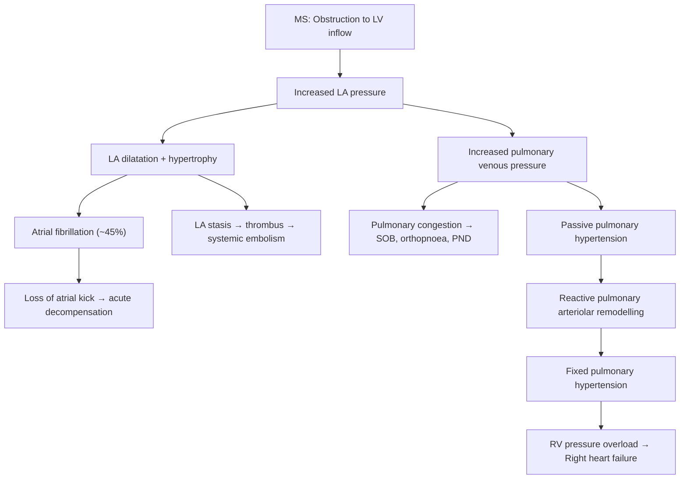

# Valvular Heart Disease

## Definition

Valvular heart disease (VHD) refers to any structural or functional abnormality of one or more of the four cardiac valves (mitral, aortic, tricuspid, pulmonary) that disrupts normal unidirectional blood flow through the heart. The valve may fail to open fully (**stenosis** → obstruction to forward flow) or fail to close properly (**regurgitation/incompetence** → backward leak). Either lesion imposes haemodynamic stress on the upstream and/or downstream cardiac chambers, eventually leading to heart failure if uncorrected [1][2].

<Callout title="Core Concept — Stenosis vs Regurgitation">
**Stenosis** → the proximal chamber must generate higher pressure to push blood through the narrowed orifice → that chamber hypertrophies first, then dilates as it fails.

**Regurgitation** → blood leaks backward, so the chambers on *both* sides of the valve dilate to accommodate the extra volume.

This simple rule applies to every valve and explains virtually all the clinical features.
</Callout>

---

## Epidemiology

### Global Burden
- VHD prevalence increases sharply with age. Degenerative (calcific) disease is the dominant aetiology in high-income countries — **aortic stenosis** affects ~5% of adults > 75 years [2].
- Rheumatic heart disease (RHD) remains the leading cause of VHD in low-to-middle-income countries; worldwide ~33 million people are affected, with ~300 000 deaths/year.
- Mitral regurgitation is the most prevalent single-valve lesion in the general population (up to 1 in 10 people > 75 years have ≥ moderate MR) [2].

### Hong Kong Context
- RHD incidence has dramatically fallen with improved socioeconomic conditions and early antibiotic treatment of Group A Streptococcal (GAS) pharyngitis, but chronic RHD is still encountered in older patients (especially middle-aged women with mitral stenosis diagnosed decades after childhood rheumatic fever) [1][2].
- Degenerative aortic stenosis (calcific) and myxomatous mitral valve prolapse are the predominant aetiologies in Hong Kong's ageing population.
- ***Bicuspid aortic valve*** (present in 1-2% of the population, M > F) is the most common congenital cause of significant aortic valve disease [1][2].
- Infective endocarditis, while uncommon, disproportionately affects patients with prosthetic valves or prior valve disease; *S. aureus* is now the most common pathogen overall [1][2].

---

## Risk Factors

| Category | Examples |
|---|---|
| Age | Degenerative calcification ↑ with age (senile AS, mitral annular calcification) |
| Rheumatic fever history | Prior GAS pharyngitis → chronic RHD (MS, MR, AR) |
| Congenital | Bicuspid aortic valve, congenital MS, subaortic membrane |
| Infective endocarditis | Valve destruction → acute MR, AR, TR |
| Ischaemic heart disease | Papillary muscle dysfunction or rupture → acute MR (especially inferior MI) |
| Connective tissue disease | Marfan syndrome, Ehlers-Danlos → aortic root dilatation → AR; Myxomatous degeneration → MVP/MR |
| Cardiomyopathy | LV dilatation (DCM) → functional MR/TR from annular stretching |
| Atherosclerotic risk factors | Hypertension, hyperlipidaemia, DM, smoking accelerate degenerative/calcific valve disease |
| Radiation | Prior mediastinal RT (e.g. Hodgkin lymphoma survivors) → fibrosis of any valve |
| Drugs | Ergotamine, cabergoline (serotonin 5-HT₂B agonism → valvular fibrosis); anorexigens (fenfluramine) |
| Systemic inflammatory disease | SLE (Libman-Sacks endocarditis), rheumatoid arthritis, ankylosing spondylitis (aortitis → AR) |
| Carcinoid syndrome | Serotonin-mediated fibrotic plaques → right-sided valvular disease (TR, PS) because lungs inactivate serotonin before it reaches the left heart [3] |

---

## Anatomy and Function of the Cardiac Valves

### The Four Valves

| Valve | Type | Position | Structural Components |
|---|---|---|---|
| **Mitral valve (MV)** | Atrioventricular | Between LA and LV | 2 leaflets (anterior, posterior), annulus, chordae tendineae, papillary muscles (anterolateral, posteromedial) |
| **Tricuspid valve (TV)** | Atrioventricular | Between RA and RV | 3 leaflets (anterior, posterior, septal), annulus, chordae tendineae, papillary muscles |
| **Aortic valve (AV)** | Semilunar | Between LV and ascending aorta | 3 cusps (right coronary, left coronary, non-coronary), annulus, sinuses of Valsalva (coronary ostia arise from right and left sinuses) |
| **Pulmonary valve (PV)** | Semilunar | Between RV and pulmonary artery | 3 cusps (anterior, right, left), annulus |

### Functional Principles
- **Atrioventricular (AV) valves** are complex apparatus: the leaflets are tethered by chordae tendineae to papillary muscles arising from the ventricular wall. During systole, papillary muscles contract to prevent leaflet prolapse into the atrium. Failure of *any* component (leaflet, chordae, papillary muscle, annulus) → regurgitation [2].
- **Semilunar valves** are simpler "pocket" valves that open passively with ventricular ejection and close by the backflow of blood filling the sinuses behind the cusps (aortic root recoil).
- The **aortic root** is an integral part of the aortic valve mechanism — dilatation of the aortic root pulls the cusps apart → central AR even with structurally normal cusps.
- The coronary arteries fill during **diastole** (when aortic valve is closed and blood fills the sinuses of Valsalva). This is clinically crucial in AS (↑LV pressure impedes coronary filling) and AR (↓diastolic pressure reduces coronary perfusion pressure).

### Blood Supply to Papillary Muscles
- **Anterolateral papillary muscle**: dual supply (LAD + LCx) → relatively protected from ischaemia.
- **Posteromedial papillary muscle**: single supply (RCA or LCx, depending on dominance) → **more vulnerable** to ischaemia, especially in inferior MI → explains why ischaemic MR is more common with inferior MI [2].

---

## Aetiology (Focus on Hong Kong Relevant Causes)

### Overview Table

| Valve Lesion | Common Aetiologies |
|---|---|
| **Mitral Stenosis** | RHD (95%); others: congenital, mitral annular calcification (elderly), radiation, carcinoid, SLE/RA, mucopolysaccharidoses [2] |
| **Mitral Regurgitation** | Myxomatous degeneration/MVP (most common in developed countries); RHD; IE; ischaemic papillary muscle dysfunction/rupture; annular dilatation (DCM, LV remodelling); HOCM (SAM); congenital |
| **Aortic Stenosis** | Degenerative calcification (most common overall, esp > 75y); bicuspid AV (most common in < 60y); RHD; rare: IE, hyperuricaemia, ***Williams syndrome*** [1][2] |
| **Aortic Regurgitation** | ***Valvular:*** degenerative (most common overall), RHD, congenital bicuspid AV, IE. ***Aortic root dilatation:*** hypertension, syphilitic aortitis, inflammatory aortitis (e.g. ankylosing spondylitis), connective tissue disease (Marfan, Ehlers-Danlos). ***Acute AR:*** aortic dissection, IE [1][2] |
| **Tricuspid Regurgitation** | Functional (most common): secondary to RV dilatation from pulmonary hypertension/left heart disease. Primary: RHD, IE (especially IVDU), Ebstein anomaly, carcinoid, radiation, pacemaker leads |
| **Tricuspid Stenosis** | RHD (almost always), carcinoid, congenital |
| **Pulmonary Stenosis** | Usually congenital; carcinoid (acquired) |
| **Pulmonary Regurgitation** | Functional: pulmonary hypertension. Primary: IE, post-surgical (e.g. repaired Tetralogy of Fallot), carcinoid |

### Key Aetiological Categories in Detail

#### 1. Rheumatic Heart Disease (RHD)

**Pathophysiology — Molecular Mimicry:**
- Infection with certain M-protein-bearing strains of ***Group A Streptococcus*** (GAS, *Streptococcus pyogenes*) triggers a delayed (2–6 weeks) immune response [1][2].
- Anti-M protein antibodies cross-react with cardiac proteins (especially cardiac myosin and laminin on valvular endothelium) → **pancarditis** (endocarditis, myocarditis, pericarditis) — RHD is classically *the* disease that affects all three layers of the heart [2].
- Repeated episodes of acute rheumatic fever (ARF) → chronic inflammation → ***progressive fibrosis, commissural fusion, and distortion of valve cusps*** → stenosis (and sometimes regurgitation).

**Valve Involvement in Chronic RHD:**
- ***MV alone > AV + MV > AV alone > TV*** (similar order to IE) [1][2].
- Pathology: ***MS > MR + MS > MR*** [2].
- Takes 10–30 years after the initial ARF to become clinically manifest.

**Acute Rheumatic Fever — Jones Criteria (revised):**
- Diagnosis requires evidence of recent GAS infection (↑ASO titres, positive rapid antigen test, positive throat culture, or recent scarlet fever) **PLUS**:
  - **2 major criteria**, OR
  - **1 major + 2 minor criteria**

| Major Criteria | Minor Criteria |
|---|---|
| Carditis (pancarditis*) | Fever |
| Migratory polyarthritis (75%, large joints) | Arthralgia |
| Sydenham's chorea | Raised ESR/CRP |
| Erythema marginatum ( < 5%) | Prolonged PR interval on ECG |
| Subcutaneous nodules (5-7%) | |

\**Pancarditis may produce transient murmurs: MR, AR, and a mid-diastolic murmur at the apex known as the **Carey-Coombs murmur** (due to valvulitis causing oedematous, roughened mitral leaflets).* [1][2]

<Callout title="High Yield — RHD Management" type="idea">
- **Acute:** Single dose IM benzathine penicillin G → eradication of GAS.
- **Secondary prophylaxis:** IM benzathine penicillin G every 4 weeks until age 21 or for 5 years (whichever is *longer*) — prevents recurrent ARF, which is what drives progressive valve damage [1][2].
- Arthritis → NSAIDs. Carditis → manage HF, echo monitoring. Chorea/rash → no specific treatment.
</Callout>

#### 2. Degenerative / Calcific Valve Disease
- ***Senile calcific AS*** is essentially an atherosclerosis-like process: endothelial injury → lipid deposition → inflammation → calcification of the aortic valve cusps, accelerated by the same risk factors as coronary artery disease (hypertension, hyperlipidaemia, diabetes, smoking) [1][2].
- **Mitral annular calcification** (MAC): calcium deposition in the mitral annulus, common in elderly women with hypertension and CKD; can restrict leaflet motion → functional MS.

#### 3. Myxomatous Degeneration / Mitral Valve Prolapse (MVP)
- Abnormal accumulation of myxomatous (mucoid) connective tissue in the mitral leaflet → leaflet becomes floppy and redundant → prolapse into LA during systole → MR.
- May involve chordal elongation/rupture → *acute* severe MR.
- Prevalence ~2-3% of general population; associated with Marfan syndrome, Ehlers-Danlos.

#### 4. Infective Endocarditis (IE)
- Microbial infection of the endocardial surface, most commonly the valves [1].
- **Valve involvement:** ***MV >> AV > TV (common in IVDA) > PV*** [1].
- **Pathogenesis:** Endothelial damage → platelet-fibrin deposition (non-bacterial thrombotic endocarditis, NBTE) → circulating organisms colonize during bacteraemia → **vegetation** formation → local tissue destruction + systemic embolization [2].
- **Acute IE** (*S. aureus*): attacks *normal* valves, large vegetations, rapid destruction.
- **Subacute IE** (*Streptococcus viridans*, HACEK): tends to affect *abnormal* valves, slower course [1][2].

#### 5. Ischaemic / Functional MR
- **Papillary muscle dysfunction** from ischaemia (usually posteromedial papillary muscle in inferior MI) → incomplete mitral leaflet coaptation → MR.
- **Papillary muscle rupture** (rare, catastrophic) → acute severe MR → cardiogenic shock.
- **Functional (secondary) MR/TR:** LV or RV dilatation stretches the annulus → leaflets cannot coapt → regurgitation despite structurally normal valve leaflets.

#### 6. Connective Tissue Diseases and Aortopathies
- **Marfan syndrome** (FBN1 gene, fibrillin-1 deficiency): aortic root dilatation → AR; also MVP → MR.
- **Ehlers-Danlos** (especially vascular type): aortic dissection/rupture → acute AR.
- **Ankylosing spondylitis**: aortitis → fibrosis of aortic root and cusps → AR.
- **SLE:** Libman-Sacks endocarditis — sterile verrucous vegetations on *both* sides of valve leaflets (especially MV) → MR [1].

#### 7. Carcinoid Heart Disease
- **Serotonin (5-HT)** and other vasoactive substances secreted by metastatic neuroendocrine tumours stimulate **fibrogenesis** → pathognomonic plaque-like deposits of fibrous tissue on valvular cusps and endocardium [3].
- ***Right-sided valves*** are predominantly affected because the lungs metabolize serotonin before it reaches the left heart → TR and PS are classic [3].
- Left-sided involvement can occur with bronchial carcinoid (serotonin enters pulmonary veins directly) or with a patent foramen ovale.

---

## Pathophysiology (Detailed, by Lesion)

### A. Mitral Stenosis (MS)

Normal mitral valve area: 4–6 cm². Symptoms begin when area falls below ~2.5 cm²; severe MS < 1.5 cm²; critical < 1 cm².

Key points:
- The transmitral gradient depends on flow rate and diastolic filling time. Anything that **↑HR** (fever, exercise, pregnancy, AF, thyrotoxicosis, anaemia) **↓ diastolic filling time** → acute ↑ gradient → acute decompensation [2].
- ***LA systole normally contributes ~20% of LV filling. In MS, this "atrial kick" becomes critical*** — development of AF is therefore devastating and a common trigger for acute pulmonary oedema [2].
- Chronic ↑ pulmonary venous pressure → first **passive** back-transmission of pressure, then **reactive** (late pulmonary arteriolar remodelling with intimal fibrosis/medial hypertrophy) → eventually **fixed** pulmonary hypertension → RV failure [2].
- Gross LAE can cause:
  - **Ortner syndrome**: compression of left recurrent laryngeal nerve → hoarseness.
  - **Dysphagia**: oesophageal compression.
  - **Bronchial compression** → lobar collapse (especially left lower lobe) [2].

### B. Mitral Regurgitation (MR)

**Chronic MR:**
- Backward leak of blood into LA during systole → **volume overload** of both LA and LV (the regurgitated volume returns via pulmonary veins in diastole and must be re-ejected) [2].
- Initially: ***gradual LA dilatation*** with only mild ↑ LAP during systole → well tolerated for years with minimal symptoms.
- ***↑ LA compliance*** actually *worsens* the situation over time because the low-resistance LA pathway encourages a larger regurgitant fraction.
- As LV fails from chronic volume overload → ↑ LVEDP → ↑ LAP → **pulmonary hypertension** (occurs *late*, unlike MS where it occurs earlier).
- Once severe, MR is ***NOT benign*** — patients develop symptoms at ~10%/year, AF in 1/3; 90% of asymptomatic patients with severe MR and normal LVEF will eventually need surgery within 10 years [2].

**Acute MR** (e.g. chordal rupture, papillary muscle rupture, acute IE):
- LA has **no time to dilate** → acute, dramatic ↑ LAP → ***acute severe pulmonary oedema*** → haemodynamic collapse. This is a surgical emergency [2].

<Callout title="Chronic vs Acute MR — Why the Difference?">
In **chronic** MR, the LA gradually dilates and becomes more compliant, absorbing the regurgitant volume with only modest pressure rise → symptoms develop slowly. In **acute** MR, the LA is non-compliant (normal size) → even a small regurgitant volume causes a massive pressure spike → immediate pulmonary oedema. This is why acute MR is far less well tolerated than chronic MR of the same severity.
</Callout>

### C. Aortic Stenosis (AS)

Normal aortic valve area: 3–4 cm². Symptoms appear when area falls below ~1 cm² (severe AS); critical < 0.6 cm².

***Pathophysiology is one of slow, insidious compensation followed by rapid decompensation*** [1][2]:

1. **Compensated phase:** LV generates progressively higher pressure to overcome the stenotic valve → ***concentric LVH*** (parallel sarcomere addition → thicker wall without chamber dilatation) → maintains CO for years → ***apex is NOT displaced*** (it is heaving/sustained, not thrusting).
2. **LA hypertrophies** to help fill the now stiff, non-compliant LV → **S4 gallop**.
3. **Angina** occurs because:
   - ***↑ demand:*** ↑ LV mass and ↑ wall stress require more O₂.
   - ***↓ supply:*** ↑ LV end-diastolic pressure compresses subendocardial coronary vessels → impeded coronary filling.
   - ~50% of symptomatic AS patients also have coexistent coronary artery disease [2].
4. **Exertional syncope** occurs because:
   - Fixed obstruction → ***inability to ↑ CO*** with exercise.
   - Exercise → peripheral vasodilation (↓SVR) → sudden ↓ BP → cerebral hypoperfusion.
   - Also: baroreceptor malfunction, ventricular arrhythmias [2].
5. **Decompensation:** chronic pressure overload → ***LV dilatation*** (the compensatory mechanisms fail) → rapid deterioration with LV failure, pulmonary oedema, and death.

<Callout title="Critical Concept — Prognosis of Symptomatic AS" type="error">
Once symptoms develop, the prognosis of untreated AS is *worse than many cancers*:
- **Angina → ~5-year survival**
- **Syncope → ~3-year survival**
- **Heart failure → ~2-year survival**

This is why symptomatic severe AS is an **urgent indication for valve intervention** (surgical AVR or TAVI). Never "watch and wait" in symptomatic severe AS.
</Callout>

### D. Aortic Regurgitation (AR)

**Chronic AR:**
- Incompetent AV allows ***diastolic backflow*** from aorta into LV → ↑ LV end-diastolic volume.
- **Compensated:** LV dilates (eccentric hypertrophy — sarcomeres added in series) → ***↑ stroke volume 2–3×*** → maintains forward CO → produces the characteristic ***widened pulse pressure*** (high systolic, low diastolic) and all the eponymous peripheral signs [2].
- **Decompensation:** Eventually ↑ LVEDP → ↓ forward CO → HF symptoms + ↑ LAP → pulmonary congestion.
- **Angina** in AR has a dual mechanism:
  - ***↑ demand:*** LV dilatation + hypertrophy → ↑ O₂ consumption.
  - ***↓ supply:*** low diastolic BP → ↓ coronary perfusion pressure (remember, coronaries fill in diastole!).
  - Classically worse at night (↓ HR → longer diastole → more regurgitation → lower diastolic BP).

**Acute AR** (aortic dissection, IE, ruptured sinus of Valsalva):
- LV has no time to dilate → acute ↑ LVEDP → ***premature mitral valve closure*** (LV pressure exceeds LA pressure before the normal onset of systole) → acute pulmonary oedema → ***surgical emergency*** [1][2].
- Classical peripheral signs of chronic AR are typically **absent** in acute AR.

### E. Tricuspid Regurgitation (TR)

- Most commonly **functional/secondary:** RV dilatation (from pulmonary hypertension, any cause of left heart failure, or primary RV disease) → tricuspid annular stretching → leaflets fail to coapt.
- Less commonly **primary:** IE (IVDU), RHD, Ebstein anomaly, carcinoid, pacemaker lead impingement.
- **Pathophysiology:** Systolic backflow from RV into RA → RA dilatation + ↑ systemic venous pressure → ***hepatic congestion*** (pulsatile liver), ***ascites***, ***peripheral oedema***, ***raised JVP with prominent cv waves*** [1].

### F. Right-Sided Valve Disease (Tricuspid Stenosis, Pulmonary Stenosis/Regurgitation)

- **Tricuspid stenosis:** Almost always RHD (usually with concomitant MV disease). Obstruction to RV inflow → ↑ RAP → systemic venous congestion (JVP ↑, hepatomegaly, ascites, oedema) with relatively *less* pulmonary congestion (the stenotic TV "protects" the lungs by limiting RV preload).
- **Pulmonary stenosis:** Usually congenital (part of Tetralogy of Fallot, Noonan syndrome) or carcinoid. RV pressure overload → RV hypertrophy → eventual RV failure.
- **Pulmonary regurgitation:** Often functional due to pulmonary hypertension. The murmur of functional PR (Graham Steell murmur) is a high-pitched early diastolic murmur at the left sternal border — often confused with AR.

---

## Classification of VHD

### By Mechanism

| Mechanism | Left-Sided | Right-Sided |
|---|---|---|
| **Stenosis** | MS, AS | TS, PS |
| **Regurgitation** | MR, AR | TR, PR |

### By Aetiology

| Category | Examples |
|---|---|
| Degenerative/calcific | Calcific AS, MAC, myxomatous MVP |
| Rheumatic | MS, MR, AR (less commonly TV) |
| Infective | IE → acute MR, AR, TR |
| Ischaemic | Papillary muscle dysfunction/rupture → MR |
| Congenital | Bicuspid AV, Ebstein anomaly, congenital MS/PS |
| Connective tissue | Marfan (AR, MR), Ehlers-Danlos (AR), MVP |
| Inflammatory/autoimmune | SLE (Libman-Sacks), RA, ankylosing spondylitis (AR) |
| Carcinoid | TR, PS (right-sided) |
| Radiation | Fibrosis of any valve |
| Drug-induced | Ergot derivatives, cabergoline |

### By Acuity
- **Chronic VHD:** Gradual onset, compensatory mechanisms develop (chamber dilatation, hypertrophy), well-tolerated for years before decompensation.
- **Acute VHD:** Sudden onset (IE, dissection, MI, chordal rupture), no time for compensation, haemodynamic collapse, surgical emergency.

### By Severity
Echocardiographic grading (2D, Doppler) — broadly:
- **Mild, Moderate, Severe** based on valve area (for stenosis), regurgitant volume/fraction/effective regurgitant orifice area (for regurgitation), and associated findings (chamber dilatation, pulmonary pressures).

---

## Clinical Features

### General Symptom Framework for VHD [2]

The symptoms of VHD are ultimately the symptoms of **heart failure**, **arrhythmia**, **embolism**, **ischaemia**, and **low cardiac output** — explained by the haemodynamic consequences above.

| Symptom Category | Mechanism | Relevant Lesions |
|---|---|---|
| Exertional dyspnoea, orthopnoea, PND | ↑ LAP → pulmonary venous congestion | MS, MR, AS (late), AR (late) |
| Peripheral oedema, ascites, hepatomegaly | ↑ RAP → systemic venous congestion | TR, TS, any left-sided VHD progressing to RV failure |
| Angina | Supply-demand mismatch in myocardium | AS, AR, severe MR (↑ wall stress) |
| Syncope/presyncope | ↓ CO on exertion, arrhythmia | AS (exertional), severe MS/AR |
| Palpitations | Atrial dilatation → AF; ventricular arrhythmia | MS (AF very common), any advanced VHD |
| Fatigue, exercise intolerance | ↓ forward CO | Any significant VHD |
| Haemoptysis | Rupture of bronchial veins from high pulmonary venous pressure | MS |
| Hoarseness (Ortner syndrome) | Enlarged LA compresses left recurrent laryngeal nerve | MS (severe LAE) |
| Dysphagia | Enlarged LA compresses oesophagus | MS (severe LAE) |
| Systemic embolism (stroke, peripheral) | LA stasis → thromboembolism; vegetation emboli (IE) | MS + AF, IE |

### Lesion-Specific Symptoms

#### Mitral Stenosis
- **SOB on exertion → orthopnoea → PND** (progressive pulmonary congestion as transmitral gradient worsens) [2].
- **Cough ± haemoptysis** (rupture of small bronchial veins under high pulmonary venous pressure) [2].
- **Palpitations** (AF develops in ~45% due to progressive LAE) [2].
- **Acute decompensation** triggered by anything that ↑ HR or ↑ CO: ***fever, anaemia, pregnancy, thyrotoxicosis, exercise, new-onset AF*** → ↓ diastolic filling time → ↑ transmitral gradient → flash pulmonary oedema [2].
- **Right heart failure** symptoms (late): peripheral oedema, ascites, hepatomegaly.
- **Systemic embolism:** stroke or peripheral embolism from LA thrombus (especially if AF).
- **Hoarseness** (Ortner syndrome) and **dysphagia** from massive LAE compressing the left RLN and oesophagus respectively [2].

**Clinical course:** Usually 20–40 years after rheumatic fever before symptoms develop. 10-year survival > 80% if asymptomatic; drops to 10% once symptomatic, and < 3 years if pulmonary hypertension develops [2].

#### Mitral Regurgitation
- **Chronic:** ***Fatigue and weakness dominate early*** (low forward CO) → exertional dyspnoea only occurs late when LV fails [2].
- **Acute:** ***Acute severe pulmonary oedema*** — sudden-onset severe dyspnoea, pink frothy sputum, haemodynamic instability [2].
- Palpitations (AF in 1/3 with severe chronic MR).

#### Aortic Stenosis
The classic triad of symptomatic AS (remember: **SAD** — Syncope, Angina, Dyspnoea):

1. ***Angina on exertion*** — supply-demand mismatch (↑ O₂ demand from LVH, ↓ supply from ↑ LVEDP compressing coronary vessels) [1][2].
2. ***Exertional syncope*** — inability to ↑ CO + exercise-induced vasodilation → ↓ cerebral perfusion; also baroreceptor malfunction and arrhythmias [1][2].
3. ***Heart failure symptoms (SOBOE)*** — late decompensation of LV → pulmonary congestion [1][2].

***Complications:***
- ***LV failure*** (decompensation) [1].
- ***Arrhythmias*** (AF, ventricular arrhythmias) [1].
- ***Heart block*** (calcification extends into the conduction system, especially the bundle of His and left bundle branch → LBBB, 3°HB) [1][2].
- ***Heyde's syndrome:*** acquired von Willebrand disease (type 2A) due to shear stress across the stenotic valve → loss of high-molecular-weight vWF multimers → GI angiodysplasia bleeding → ***iron deficiency anaemia*** [1].
- Sudden cardiac death (ventricular arrhythmias).

#### Aortic Regurgitation
- **Compensated phase:** ***Awareness of heartbeat*** (pounding sensation in chest/neck), especially when lying down — due to massively ↑ SV producing forceful LV ejection [2].
- **Decompensated phase:** LV failure symptoms (dyspnoea, orthopnoea, PND), ***angina*** (worse at night because ↓ HR → longer diastole → more regurgitation → even lower diastolic BP → less coronary perfusion), syncope [1][2].
- **Acute AR:** Catastrophic — acute pulmonary oedema, cardiogenic shock.

---

### Clinical Signs

#### A. Mitral Stenosis

| Sign | Pathophysiological Basis |
|---|---|
| **Malar flush** ("mitral facies") | Low CO + peripheral vasoconstriction → cyanotic flush over cheeks; also CO₂ retention → cutaneous vasodilation |
| **Low-volume pulse**, often irregularly irregular (AF) | ↓ CO across stenotic valve; AF from LA dilatation |
| **JVP: prominent 'a' wave** (if in sinus rhythm) | Pulmonary HTN → RV hypertrophy → ↑ RA contraction pressure |
| **Tapping apex** (palpable S1) | Loud S1 from forceful closure of mobile but stenotic MV leaflets (early MS when leaflets still pliable) |
| **Parasternal heave** | RV hypertrophy from pulmonary HTN |
| **Loud S1** | Leaflets are wide open at end-diastole (due to high LA-LV gradient maintaining leaflets apart) → close with greater excursion and force; *disappears when valve becomes heavily calcified/immobile* |
| **Opening snap (OS)** after S2 | Sudden tensing of stenotic but still pliable MV leaflets at onset of diastolic opening; *disappears when valve calcifies* |
| **Low-pitched rumbling mid-diastolic murmur (MDM)** at apex, best heard in left lateral decubitus with bell | Turbulent flow through narrowed MV orifice |
| **Pre-systolic accentuation** (if in sinus rhythm) | Atrial contraction forces blood through narrowed orifice → ↑ turbulence just before S1 |
| **Loud P2** | Pulmonary hypertension → ↑ force of PV closure |
| **Graham Steell murmur** (high-pitched EDM at LUSB) | Functional PR from severe pulmonary HTN |

**Signs of severity in MS:**
- ***Short S2-OS interval*** (higher LA pressure opens the valve earlier in diastole)
- ***Long duration of murmur*** (gradient persists throughout diastole)
- ***Loud P2 / signs of pulmonary HTN***
- ***Signs of right heart failure***

#### B. Mitral Regurgitation

| Sign | Pathophysiological Basis |
|---|---|
| **Pulse:** may be small volume; AF if severe/associated MS | ↓ forward stroke volume; LA dilatation → AF |
| **Displaced, thrusting apex** | LV dilatation (volume overload → eccentric hypertrophy) |
| **Systolic thrill** at apex | Palpable turbulence from high-velocity regurgitant jet |
| **Parasternal heave** (if severe) | RV hypertrophy from secondary pulmonary HTN |
| **Soft S1** | Leaflets do not coapt properly → incomplete closure |
| **S3** | Rapid LV filling in diastole from large LA volume returning (volume overload) |
| **S4** if acute MR | Atrial contraction against a stiff, non-compliant LV (no time to dilate) |
| ***Pansystolic murmur (PSM)*** best at apex, radiating to axilla | Continuous pressure gradient from LV to LA throughout systole → continuous regurgitant flow; radiation follows jet direction toward posterior LA → axilla |
| **Mid-systolic click + late systolic murmur** (if MVP) | Click = sudden tensing of prolapsing leaflet; murmur starts after prolapse occurs |

**Special considerations:**
- In ***ischaemic papillary muscle dysfunction***, the regurgitant jet may be directed **anteriorly** in the LA → the murmur can be best heard at the **left sternal border or aortic area**, mimicking the ESM of AS [2].
- In **acute MR**, the murmur may have a ***decrescendo*** quality and be shorter (rapid pressure equilibration between LV and non-compliant LA → the gradient disappears before end-systole) [2].

**Signs of severity in MR:**
- S3 gallop
- Displaced apex
- Pulmonary hypertension signs
- Signs of heart failure (pulmonary congestion, peripheral oedema)

#### C. Aortic Stenosis

| Sign | Pathophysiological Basis |
|---|---|
| ***Slow-rising, small-volume pulse*** (pulsus parvus et tardus — "parvus" = small, "tardus" = slow) | Delayed and diminished systolic upstroke due to obstruction to LV outflow [1][2] |
| ***Narrow pulse pressure*** | ↓ systolic BP (fixed obstruction limits stroke volume delivered to aorta) [1] |
| ***Sustained, heaving (non-displaced) apex*** | Concentric LVH without dilatation (pressure overload) — apex pushes forcefully but stays in normal position [1][2] |
| ***Systolic thrill*** in aortic area / carotids | Palpable turbulence across stenotic valve [1] |
| ***Soft or absent A2*** | Calcified, immobile cusps cannot produce a sharp closure sound [1][2] |
| ***Reverse (paradoxical) splitting of S2*** | LBBB or prolonged LV ejection time (LV takes longer to empty through stenotic valve) → A2 occurs *after* P2 → splitting heard in expiration, disappears in inspiration [1] |
| ***S4 gallop*** | Atrial contraction against a stiff, hypertrophied LV (↑ LVEDP) [1][2] |
| ***Ejection systolic murmur (ESM)***: harsh, "saw cutting wood", crescendo-decrescendo | Turbulent flow through narrowed aortic orifice; murmur begins after S1 (isovolumetric contraction phase first → valve opens → turbulence begins) [1][2] |
| Best at aortic area ± apex, radiates to bilateral carotids | Turbulent jet transmits along great vessels toward head |

**Signs of severity in AS** [1][2]:
- ***Late-peaking ESM*** (severe AS → LV takes longer to generate enough pressure → peak turbulence shifts later in systole)
- ***Soft/absent A2*** (heavily calcified, immobile valve)
- ***S4*** (very stiff LV)
- ***Narrow pulse pressure***
- ***Slow-rising pulse***
- ***Palpable systolic thrill***
- ***Signs of pulmonary HTN*** (P2 loud, parasternal heave)
- ***Signs of pulmonary congestion / heart failure***

<Callout title="Exam Pearl — Gallavardin Phenomenon" type="idea">
In severe calcific AS, the ESM can radiate to and be loudest at the **apex** (not just the aortic area), where it may sound more musical/pure — this can mimic the PSM of MR. This is the **Gallavardin phenomenon**. The key distinguishing feature: the murmur of AS radiates to the carotids; the murmur of MR radiates to the axilla.
</Callout>

#### D. Aortic Regurgitation

| Sign | Pathophysiological Basis |
|---|---|
| ***Bounding, collapsing pulse*** (water-hammer pulse; pulse pressure > 50 mmHg) | ↑ SV (compensatory LV dilatation) → high systolic peak; diastolic runoff back into LV → low diastolic trough [2] |
| ***Wide pulse pressure*** | Same mechanism as above [1][2] |
| ***Displaced, thrusting apex*** | LV dilatation from volume overload (eccentric hypertrophy) [2] |
| ***Early diastolic murmur (EDM)*** just after A2, best at left sternal border (tricuspid area), louder with patient leaning forward at end-expiration | Regurgitant jet from aorta into LV begins immediately after AV closure; leaning forward brings aorta closer to chest wall; end-expiration ↓ air between heart and stethoscope [2] |
| ***Ejection systolic murmur (ESM)*** also common | ↑ SV ejected through the aortic valve → relative stenosis from high flow |
| ***Austin-Flint murmur:*** low-pitched mid-diastolic rumble at apex *without pre-systolic accentuation* | Regurgitant jet impinges on the anterior mitral leaflet → restricts its opening → ***functional MS*** [1][2] |

**Eponymous peripheral signs of chronic AR** (all due to ***↑ stroke volume and wide pulse pressure***):
- ***Corrigan's sign:*** visible carotid pulsation.
- ***De Musset's sign:*** head bobbing with each heartbeat (momentum transfer from high SV).
- ***Quincke's pulse*** (syn. Quincke's sign): capillary pulsation visible in fingertips or lip mucosa under gentle pressure.
- ***Traube's sign:*** "pistol-shot" systolic and diastolic sounds heard over large arteries (e.g. femoral artery).
- ***Duroziez's sign:*** to-and-fro murmur over femoral artery when gentle pressure applied with stethoscope.
- ***Müller's sign:*** visible pulsation of the uvula.

**Signs of severity in AR** [1]:
- ***Wide pulse pressure*** (pulse pressure > 50% of systolic pressure)
- ***Long duration of diastolic murmur*** (may become holo-diastolic)
- ***S3 gallop*** (volume overload)
- ***Austin-Flint murmur*** (functional MS from severe regurgitant jet)
- ***Pulmonary HTN signs***
- ***Pulmonary congestion signs***

<Callout title="Acute AR — Classical Signs Are Absent!" type="error">
In **acute** AR (e.g. aortic dissection, acute IE), the LV has not had time to dilate → stroke volume is NOT increased → the classic peripheral signs of chronic AR (wide pulse pressure, collapsing pulse, De Musset's, Quincke's) are **absent**. The predominant findings are those of **acute heart failure** (tachycardia, pulmonary oedema, cardiogenic shock). The EDM may be soft and short. This is a common exam trap [2].
</Callout>

#### E. Tricuspid Regurgitation

| Sign | Pathophysiological Basis |
|---|---|
| **Raised JVP** with ***prominent systolic cv wave*** | Systolic backflow from RV into RA transmitted to jugular veins |
| **Pulsatile hepatomegaly** | Systolic pressure wave transmitted from RA to hepatic veins → liver pulsates with each heartbeat |
| **Peripheral oedema, ascites** | ↑ systemic venous pressure → hydrostatic transudation (Why does RHF cause ascites? Because of hydrostatic back-pressure in the hepatic veins → portal venous congestion → transudation into peritoneal cavity) |
| **Parasternal heave** | RV dilatation/hypertrophy |
| **Pansystolic murmur** at LLSB, ***increases with inspiration*** (Carvallo's sign) | Inspiration → ↑ venous return → ↑ RV volume → ↑ regurgitant volume → louder murmur |

#### F. Summary Comparison: Murmurs

| Lesion | Murmur Type | Best Heard | Radiation | Key Features |
|---|---|---|---|---|
| **MS** | Low-pitched MDM | Apex (left lateral decubitus, bell) | Does not radiate | Opening snap, pre-systolic accentuation (if SR) |
| **MR** | High-pitched PSM | Apex | Axilla | Soft S1, S3 |
| **AS** | Harsh ESM | Aortic area ± apex | Bilateral carotids | Slow-rising pulse, S4, soft A2 |
| **AR** | High-pitched EDM | Left sternal border | — | Collapsing pulse, wide PP, Austin-Flint |
| **TR** | PSM | LLSB | — | ↑ with inspiration (Carvallo's sign), pulsatile liver |
| **TS** | Low-pitched MDM | LLSB | — | ↑ with inspiration, prominent 'a' wave JVP |
| **PS** | ESM | LUSB | — | Wide splitting of S2 (delayed P2) |
| **PR** | Graham Steell EDM | LUSB | — | Often mistaken for AR |

---

## Investigations (Overview)

While full diagnostic workup and criteria will be covered in subsequent sections, the initial investigation framework is important to understand:

| Investigation | Purpose |
|---|---|
| **ECG** | Chamber hypertrophy/enlargement (LVH, LAE, RVH, RAE), AF, conduction block (LBBB in AS), strain pattern |
| **CXR** | Cardiomegaly, chamber-specific enlargement (e.g. straightened left heart border in LAE), pulmonary congestion, prominent pulmonary arteries, calcified valves |
| **Echocardiography (TTE ± TOE)** | Gold standard: valvular morphology, severity of stenosis (gradient, valve area) and regurgitation (jet area, vena contracta, EROA), chamber sizes and function (LVEF), pulmonary artery pressure estimation |
| **CT thorax/aorta** | Aortic root dimensions (mid-ascending aorta difficult to visualize by echo), pre-TAVI planning, calcification scoring |
| **Coronary angiography** | Pre-operative assessment for concomitant CAD (recommended before valve surgery, especially in patients with risk factors or age > 40) [1][2] |
| **Cardiac MRI** | Accurate volumes, function, myocardial fibrosis (LGE), aortic root assessment |
| **Exercise testing** | Objective functional capacity in asymptomatic patients with severe VHD; provoke symptoms; contraindicated in symptomatic severe AS |
| **BNP/NT-proBNP** | Heart failure assessment; prognostic marker |
| **Blood tests** | CBC (anaemia — worsens symptoms), RFT, LFT, coagulation, CRP/ESR (IE), blood cultures (if IE suspected) |

---

## Putting It Together — Why VHD Matters

VHD is fundamentally about **pressure and volume overload** of cardiac chambers. Understanding two simple rules lets you predict every clinical feature:

1. **Stenosis** → the chamber *behind* the valve hypertrophies (pressure overload) → then dilates and fails.
2. **Regurgitation** → the chambers on *both sides* of the valve dilate (volume overload) → then fail.

Everything else — the symptoms, signs, murmurs, ECG findings, CXR appearance — flows logically from these haemodynamic consequences.

---

<Callout title="High Yield Summary">

1. **Aetiologies (HK focus):** Degenerative calcific disease (AS, MR in elderly) and bicuspid AV (AS in younger patients) are now more common than RHD in developed settings, but RHD remains important (chronic MS/MR in older patients). IE, ischaemic MR, and connective tissue disorders are other key causes.

2. **Pathophysiology core rules:** Stenosis → upstream pressure overload → hypertrophy → failure. Regurgitation → volume overload of upstream and downstream chambers → dilatation → failure.

3. **MS:** Obstruction to LV inflow → ↑LAP → pulmonary congestion → pHTN → RV failure. AF is devastating (loss of atrial kick). HR-raising states precipitate decompensation.

4. **MR:** Chronic = well-tolerated for years (LA compliance ↑) but progressive. Acute = surgical emergency (non-compliant LA → flash pulmonary oedema).

5. **AS:** Slow compensation (concentric LVH) then rapid decompensation. Classic triad: angina, syncope, dyspnoea (SAD). Prognosis is dismal once symptomatic without intervention.

6. **AR:** Chronic = ↑SV → wide pulse pressure → eponymous signs. Acute = NO compensation → pulmonary oedema → emergency. Angina worse at night (longer diastole → more regurgitation → lower diastolic BP).

7. **Key signs:** Slow-rising pulse = AS. Collapsing pulse = AR. Tapping apex = MS. Displaced thrusting apex = MR or AR. Pulsatile liver = TR.

8. **Murmur timing:** Systolic = AS (ESM) or MR/TR (PSM). Diastolic = AR/PR (EDM) or MS/TS (MDM).

9. **RHD:** Molecular mimicry by GAS. Jones criteria for ARF diagnosis. Secondary prophylaxis with IM benzathine penicillin G prevents progressive valve damage.

10. **Heyde's syndrome** (AS) = acquired vWD type 2A → GI angiodysplasia bleeding → iron deficiency anaemia.

</Callout>

---

<ActiveRecallQuiz
  title="Active Recall - Valvular Heart Disease (Definition, Epidemiology, Aetiology, Pathophysiology, Clinical Features)"
  items={[
    {
      question: "Explain why patients with mitral stenosis decompensate acutely when they develop atrial fibrillation.",
      markscheme: "In MS, the narrowed valve orifice makes LA systole (atrial kick) critical for adequate LV filling. Loss of atrial contraction in AF reduces LV filling. Additionally, the fast ventricular rate in AF shortens diastolic filling time, increasing the transmitral gradient and LA pressure, leading to acute pulmonary oedema.",
    },
    {
      question: "What are the two mechanisms that explain angina in aortic stenosis, even in the absence of coronary artery disease?",
      markscheme: "1) Increased O2 demand from concentric LVH and increased wall stress. 2) Decreased O2 supply because elevated LV end-diastolic pressure compresses subendocardial coronary vessels, impeding coronary filling during diastole.",
    },
    {
      question: "Why are the classic peripheral signs of chronic AR (wide pulse pressure, collapsing pulse, De Musset sign) absent in acute AR?",
      markscheme: "In acute AR, the LV has not had time to dilate, so stroke volume is not increased. Without increased SV, there is no wide pulse pressure or hyperdynamic circulation. Instead, the non-compliant LV pressure rises acutely, leading to pulmonary oedema and signs of heart failure.",
    },
    {
      question: "A patient with known carcinoid syndrome develops peripheral oedema and a systolic murmur at the left lower sternal border that increases with inspiration. Which valve is most likely affected and why is it right-sided?",
      markscheme: "Tricuspid valve (TR). Carcinoid tumours secrete serotonin which stimulates fibrogenesis on valvular endocardium. The lungs metabolise serotonin via MAO before it reaches the left heart, so only right-sided valves (TV, PV) are exposed to high serotonin levels. Inspiration augments the murmur (Carvallo sign) confirming right-sided origin.",
    },
    {
      question: "What is Heyde syndrome and which valvular lesion is it associated with?",
      markscheme: "Heyde syndrome is the association of aortic stenosis with acquired von Willebrand disease (type 2A) and GI bleeding from angiodysplasia. High shear stress across the stenotic valve cleaves high-molecular-weight vWF multimers, causing a bleeding diathesis that manifests as iron deficiency anaemia from GI angiodysplasia bleeding.",
    },
    {
      question: "Explain the pathophysiology of the Austin-Flint murmur in aortic regurgitation.",
      markscheme: "In severe AR, the regurgitant jet from the aorta impinges on the anterior leaflet of the mitral valve during diastole, restricting its opening. This creates functional mitral stenosis, producing a low-pitched mid-diastolic rumbling murmur at the apex without pre-systolic accentuation (unlike true MS where atrial contraction causes pre-systolic accentuation).",
    },
  ]}
/>

---

## References

[1] Senior notes: Maksim Medicine Notes.pdf (Cardiology section, p35–39)
[2] Senior notes: Ryan Ho Cardiology.pdf (p115, p146–161, p169, p193)
[3] Senior notes: Ryan Ho Endocrine.pdf (p103 — Carcinoid Syndrome)
