# History Taking: Varicose Veins (靜脈曲張)

---

## Master Framework: History Taking for Varicose Veins

```mermaid
graph TD
    A["Chief Complaint: Varicose Veins<br/>靜脈曲張"] --> B["Presenting Complaint<br/>Analysis"]
    A --> C["Risk Factors &<br/>Background History"]
    A --> D["Systems Review"]
    A --> E["Differentials to<br/>Exclude"]
    A --> F["Red Flags &<br/>Escalation"]

    B --> B1["Onset / Duration"]
    B --> B2["Symptom Quality<br/>(pain, heaviness, itch)"]
    B --> B3["Exacerbating &<br/>Relieving Factors"]
    B --> B4["Severity & CEAP<br/>Staging Clues"]
    B --> B5["Complications<br/>(bleeding, ulcer,<br/>thrombophlebitis)"]

    C --> C1["PMHx: DVT, pregnancy,<br/>thrombophlebitis"]
    C --> C2["FHx: Varicose veins,<br/>VTE"]
    C --> C3["SHx: Occupation,<br/>smoking, obesity"]
    C --> C4["Medications &<br/>Allergies"]
    C --> C5["Surgical History"]

    D --> D1["Cardiovascular:<br/>Peripheral arterial<br/>disease symptoms"]
    D --> D2["Skin: Eczema,<br/>pigmentation, ulcers"]
    D --> D3["MSK: Muscle cramps,<br/>joint issues"]
    D --> D4["GI/GU: Pelvic mass<br/>symptoms"]

    E --> E1["Deep Vein Thrombosis"]
    E --> E2["Peripheral Arterial<br/>Disease"]
    E --> E3["Lymphoedema"]
    E --> E4["Secondary causes<br/>(pelvic mass, AV fistula)"]

    F --> F1["Acute bleeding from<br/>varicosity"]
    F --> F2["Suspected DVT"]
    F --> F3["Non-healing ulcer /<br/>malignant transformation"]
    F --> F4["Sudden unilateral<br/>leg swelling"]
```

---

## Presenting Complaint Framework

The goal here is systematic: first characterise the veins and symptoms, then stage the severity (CEAP in your mind), then screen for complications and secondary causes.

### Opening Questions

Start open-ended, then funnel down:

- *"What brought you in today?"* / *"你今日嚟睇咩問題？"*
- *"When did you first notice the veins?"* / *"你幾時開始發現啲血管凸咗出嚟？"*
- *"What bothers you most about them — the appearance or the symptoms?"* / *"你最擔心嘅係外觀定係唔舒服？"*

> **Why this matters:** ***Unsightly appearance is usually the principal complaint*** [1]. Many patients have no symptoms at all — cosmetic concerns alone are the most common reason for presentation. Establishing whether the patient is symptomatic vs asymptomatic directly affects management and CEAP classification [2].

### Symptom Analysis (SOCRATES-style)

| Domain | Key Questions | Cantonese Phrasing | Why It Matters |
|---|---|---|---|
| **Site** | Which leg? Both? Where exactly on the leg? | 邊隻腳？定兩隻都有？喺邊度？ | ***Medial thigh/calf varicosities suggest GSV incompetence; posterior calf varicosities suggest SSV incompetence*** [1][2] |
| **Onset** | When did it start? Gradual or sudden? | 幾時開始？慢慢嚟定突然嚟？ | Gradual onset = primary VV; acute onset with swelling/pain = think DVT or thrombophlebitis |
| **Character** | Describe the discomfort — aching, heaviness, burning, tingling, itching? | 係酸痛、沉重、灼熱、痕癢定刺痛？ | ***Dull ache, tingling, burning character*** in the calf/lower leg is classical [1]. Itching may indicate eczema (C4a) |
| **Radiation** | Does the discomfort spread? | 痛有冇去其他位？ | Helps map territory of incompetence |
| **Associated Sx** | Ankle swelling? Night cramps? Skin changes? Bleeding? | 有冇腳眼腫？夜晚腳抽筋？皮膚有冇變色？有冇出過血？ | ***Ankle swelling, night cramps, itchiness, early fatigue*** are classical associated symptoms [1]. Skin changes suggest advanced CVI (C4+) |
| **Timing** | Worse at what time of day? Worse with menstrual cycle? | 係朝早定夜晚差啲？經期有冇影響？ | ***Symptoms worsen throughout the day / with prolonged standing*** and improve with elevation — this diurnal pattern is highly characteristic [1][2][3] |
| **Exacerbating** | What makes it worse? | 咩嘢做完會差啲？ | ***Prolonged standing*** is classic [1][2][3] |
| **Relieving** | What makes it better? | 咩嘢做完會好啲？ | ***Lying down, leg elevation, compression stockings*** = classic venous relief pattern [1][2]. If rest does NOT improve symptoms, consider arterial or MSK causes |
| **Severity** | Does it interfere with work, daily activities, sleep? | 有冇影響返工/日常生活/瞓覺？ | Functional impact guides urgency of intervention |

### Progression and Complications

These questions map to CEAP C4–C6 and help you identify who needs urgent referral vs. conservative management:

- *"Have you noticed any skin colour changes around the ankle?"* / *"腳眼附近皮膚有冇變啡色？"*
  - **Why:** ***Hyperpigmentation*** from haemosiderin deposition = C4a [2][3]
- *"Have you noticed a cluster of fine blue veins or an ankle flare around the malleolus?"* / *"腳眼附近有冇一簇幼細藍色血管，好似腳眼 flare 咁？"*
  - **Why:** ***Corona phlebectatica*** = **C4c** in the updated CEAP classification; it is an early sign of advanced venous disease [2][3]
- *"Is the skin around the ankle itchy, flaky, or weeping?"* / *"皮膚有冇痕、甩皮或者出水？"*
  - **Why:** Venous stasis eczema = C4a [2][3]
- *"Does the skin feel hard or tight around the lower leg?"* / *"小腿皮膚有冇硬咗、緊咗？"*
  - **Why:** ***Lipodermatosclerosis*** = C4b — suggests significant chronic inflammation [2][3]
- *"Have you ever had an open sore on your leg that was slow to heal?"* / *"腳有冇試過爛咗好耐都唔埋口？"*
  - **Why:** Venous ulcer = C5/C6 — this is a game-changer for management [2][3]
- *"Have the veins ever bled?"* / *"啲血管有冇出過血？"*
  - **Why:** ***Bleeding from attenuated vein clusters*** can be profuse due to venous pressure and thin skin; this is a complication requiring intervention [1][4]
- *"Have you had any red, painful, hard lumps along the veins?"* / *"血管沿住有冇紅、痛、硬嘅腫塊？"*
  - **Why:** ***Superficial thrombophlebitis*** — red, painful, tender lumps [2][4]

---

## Risk Factors and Background History

### Past Medical History (PMHx)

| Question | Cantonese | Why It Matters |
|---|---|---|
| Any history of DVT? | 以前有冇試過深層靜脈血栓？ | ***DVT accounts for most secondary cases*** via valvular destruction [1]. Also a contraindication to varicose vein surgery if active [1][4] |
| Any history of blood clots or thrombophlebitis? | 有冇試過血管發炎或者有血塊？ | Previous superficial thrombophlebitis is both a risk factor and complication [1] |
| Any history of leg injury or fracture? | 隻腳以前有冇受過傷？ | Trauma can cause venous obstruction [3] |
| Have you been pregnant? How many times? | 你有冇生過BB？生過幾多次？ | ***Pregnancy*** causes hormonal venous wall weakness + increased abdominal pressure [1][2][3]. Multiple pregnancies = higher risk |
| Any pelvic surgery or pelvic problems? | 有冇做過盆腔手術或者盆腔問題？ | Pelvic masses (ovarian cysts, fibroids, pelvic cancers) can cause external compression → secondary VV [1][3] |
| Do you have chronic cough or constipation? | 有冇長期咳或者便秘？ | ***Increased abdominal pressure*** (chronic cough, constipation) → impaired venous return [1][3] |
| Any heart problems? | 有冇心臟問題？ | Heart failure can contribute to venous congestion |
| Diabetes? Peripheral artery disease? | 有冇糖尿病？周邊動脈疾病？ | Critical for management — ***PAD is a contraindication to compression therapy and venous ablation*** [1][4] |

### Past Surgical History

- *"Have you had any previous operations on your veins?"* / *"以前有冇做過靜脈手術？"*
  - **Why:** Recurrent VV post-surgery requires duplex USG and changes management [1][4]
- *"Have you had any groin or leg surgery?"* / *"有冇做過腹股溝或者腳嘅手術？"*
  - **Why:** Scars may indicate previous GSV stripping, and recurrence raises the possibility of neovascularisation or missed perforator incompetence

### Family History (FHx)

- *"Does anyone in your family have varicose veins?"* / *"你屋企人有冇靜脈曲張？"*
  - **Why:** ***50% risk if one parent affected, up to 80% if both parents affected*** [2]. Strong familial predisposition.
- *"Any family history of blood clots?"* / *"有冇家族血栓病史？"*
  - **Why:** Inherited thrombophilia (Factor V Leiden, protein C/S deficiency) may underlie recurrent DVT → secondary VV [5]

### Social History (SHx)

| Question | Cantonese | Why It Matters |
|---|---|---|
| What is your occupation? Do you stand for long periods? | 你做咩工作？需唔需要企好耐？ | ***Occupation requiring prolonged standing*** is a major risk factor [1][2][3] |
| Smoking status? | 你有冇食煙？ | Smoking contributes to venous disease and is relevant for overall vascular risk [3] |
| Alcohol intake? | 你飲唔飲酒？ | Standard screening; liver disease → portal HTN → secondary issues |
| Exercise and mobility level? | 你平時做唔做運動？行得多唔多？ | ***Sedentary lifestyle*** impairs calf muscle pump function [3]; exercise is protective |
| BMI / weight? | 你體重大約幾多？ | ***Obesity*** increases intra-abdominal pressure and is a modifiable risk factor [1][2][3] |

### Medications and Allergies

- Current medications (especially OCP/HRT — ***oestrogen-containing OCP increases VTE risk 2-4×*** [5][6])
- Anticoagulant or antiplatelet use
- Compression stockings — currently using? What grade? Compliance?
- Drug allergies (especially relevant for planned interventions)

---

## Targeted Systems Review

| System | Questions | Relevance |
|---|---|---|
| **Cardiovascular** | Claudication? Rest pain? Cold/blue extremities? Chest pain? Palpitations? | ***Rule out PAD*** — compression is contraindicated in moderate-severe PAD [1][4]. Also screen for cardiac causes of oedema |
| **Dermatological** | Eczema elsewhere? Psoriasis? Contact dermatitis? | Differentiate venous eczema from other causes |
| **GI** | Constipation? Abdominal mass? Bloating? | Increased abdominal pressure; pelvic mass causing secondary VV [1] |
| **GU/Gynae** | Pelvic pain? Menstrual irregularities? Vaginal bleeding? | Pelvic pathology (ovarian cyst, fibroid, ***CA cervix/uterus/ovary/rectum***) [1] |
| **Respiratory** | Chronic cough? SOB? | Chronic cough → increased abdominal pressure [1][3]; SOB may suggest PE |
| **Haematological** | Easy bruising? Prolonged bleeding? Previous clots? | Screen for thrombophilia or coagulopathy |
| **Constitutional** | Weight loss? Night sweats? Fatigue? | Screen for malignancy as cause of secondary VV (pelvic tumours) |

---

## Differentiating Questions

These are the questions that separate good candidates from average ones in OSCEs.

### Primary vs Secondary Varicose Veins

| Feature | Primary | Secondary |
|---|---|---|
| History of DVT | No | ***Yes — DVT is the most common cause of secondary VV*** [1][2] |
| Pelvic symptoms | No | Yes — suggest external compression |
| AV fistula history | No | Trauma or congenital — ***increased flow and pressure*** [1] |
| Unilateral vs bilateral | Often bilateral | Unilateral may suggest local cause |
| Age of onset | Gradual, middle age | May be younger (congenital) or any age (secondary) |

> **Key question:** *"Have you ever had a DVT or been treated for a blood clot in the leg?"* — This single question is arguably the most important differentiating question because ***DVT is a contraindication to varicose vein surgery*** and the management approach changes entirely [1][4].

### Varicose Veins vs Deep Vein Thrombosis

- DVT: acute onset, unilateral swelling, warmth, pain, recent immobilisation/surgery
- VV: chronic, gradual, often bilateral, cosmetic concern, diurnal variation

### Varicose Veins vs Peripheral Arterial Disease

- PAD: claudication (walking → rest pain), cold/pale extremities, absent pulses, trophic changes on toes
- VV: heavy, achy legs worse with standing, warm extremities, palpable pulses

### Varicose Veins vs Lymphoedema

- Lymphoedema: non-pitting, extends to toes (***unlike venous oedema which rarely extends to toes*** [2]), Stemmer sign positive, no varicosities
- VV: pitting oedema at ankle, visible varicosities, improves with elevation

### Congenital Causes to Consider

- ***Klippel-Trénaunay syndrome***: VV + port wine stains + limb hypertrophy; VV may be over the ***lateral aspect of thigh*** [3]
- ***Parkes-Weber syndrome***: multiple AV fistulae with limb hypertrophy [3]

> *"Were the veins present since childhood or around puberty?"* — If yes, consider congenital venous malformations.

---

## Red-Flag Findings and Escalation Triggers

<Callout title="Red Flags — Do Not Miss" type="error">

1. **Acute bleeding from a varicosity** — can be profuse; apply direct pressure, elevate, and escalate urgently
2. **Signs of DVT** (acute unilateral swelling, warmth, pain) — this changes the entire management; refer for urgent duplex USG and anticoagulation
3. **Non-healing venous ulcer** with raised/rolled edges, malodour, or pain — suspect ***malignant transformation*** (Marjolin's ulcer); biopsy needed [2]
4. **New unilateral varicose veins** with abdominal/pelvic symptoms or weight loss — suspect ***pelvic mass*** causing venous outflow obstruction [1]
5. **Varicose veins that do not empty in supine position** — suggests secondary obstruction (DVT, pelvic mass, ***May-Thurner syndrome***) [3]
6. **Symptoms of PE** (sudden dyspnoea, pleuritic chest pain, haemoptysis) in a patient with known VV/DVT [5][6]

</Callout>

---

## Common Pitfalls in History Taking

<Callout title="Common OSCE Pitfalls" type="error">

1. **Forgetting to ask about DVT history** — this is the single most critical question for distinguishing primary from secondary VV and determines surgical candidacy [1][4]
2. **Not screening for PAD** — if you miss this and the patient gets compression stockings with significant PAD, you can cause limb ischaemia [1][4]
3. **Focusing only on cosmetic complaint** — always screen for complications (skin changes, ulcers, bleeding, thrombophlebitis) to properly stage severity
4. **Not asking about pelvic symptoms** — secondary VV from pelvic tumours is a classic exam scenario, especially isolated right-sided varicocele in males [7]
5. **Ignoring medication history** — OCP/HRT use is relevant for VTE risk stratification [5][6]
6. **Not asking about occupation** — this is expected in every varicose vein history and is a favourite OSCE mark
7. **Forgetting to ask about previous vein surgery** — recurrent VV post-surgery is a common OSCE scenario requiring duplex USG [4]

</Callout>

---

## High-Yield Exam Interpretation Tips

<Callout title="Why Each Question Matters — Exam Tips" type="idea">

- **Diurnal variation** (worse at end of day, better with elevation) = classic venous pattern. If symptoms are WORSE with walking and BETTER with rest, think arterial.
- **Territory of varicosities** maps directly to the source of incompetence — medial = GSV, posterior = SSV. Examiners love asking this.
- **CEAP classification** — you don't need to formally classify, but your history questions should naturally stage the patient from C1 to C6 and remember that ***corona phlebectatica is C4c***. This shows the examiner you understand severity grading.
- **"Why check peripheral pulses?"** — because ***management of varicose veins includes compression of limbs***, and compression in PAD can cause ischaemia [1][4]. This is a classic viva question.
- **Contraindications to venous ablation** that you should screen for in history: ***pregnancy, DVT, congenital venous abnormalities, moderate-severe PAD*** [4]
- **Reflux > 0.5 seconds** on duplex is defined as abnormal — know this number for viva [1][4]
- **Left-sided varicocele** in males — think of ***left renal vein compression between aorta and SMA***; if it doesn't empty supine, consider renal mass [7]

</Callout>

---

## Model Reporting Script

> **Mr Chan** is a **55-year-old gentleman**, retired security guard, who presented to the Vascular Surgery Clinic at QMH with a **6-year history of progressively worsening varicose veins affecting the left lower limb**.
>
> **History of presenting illness:** He first noticed dilated, tortuous veins along the medial aspect of his left thigh and calf approximately 6 years ago. Initially, his primary concern was cosmetic. Over the past 2 years, he has developed a dull aching sensation in the left calf, which worsens towards the end of the day and with prolonged standing. The discomfort is relieved by lying down and elevating the leg. He also reports ankle swelling by the evening, night cramps, and intermittent itchiness over the medial lower leg. In the last 6 months, he has noticed brownish discolouration of the skin around the left medial ankle. He denies any history of venous ulceration, bleeding from the veins, or episodes of painful red lumps along the veins suggestive of thrombophlebitis. He has no symptoms of deep vein thrombosis — no acute leg swelling, warmth, or pain. He has no claudication, rest pain, or cold extremities to suggest peripheral arterial disease. He denies any abdominal or pelvic symptoms, urinary complaints, or constitutional symptoms of weight loss, night sweats, or fevers.
>
> **Past medical history:** He has a history of hypertension, well-controlled on amlodipine 5mg daily. No history of DVT, thrombophlebitis, or bleeding disorders. No known diabetes mellitus.
>
> **Past surgical history:** Nil previous leg or vein surgery. Appendicectomy in his 30s.
>
> **Medications and allergies:** Amlodipine 5mg daily. No known drug allergies.
>
> **Family history:** His mother had varicose veins requiring surgery. No family history of DVT or thrombophilia.
>
> **Social history:** He worked as a security guard for 25 years, requiring prolonged standing. Now retired. He is a non-smoker and drinks alcohol socially. BMI is approximately 28. He lives with his wife and is independent in all activities of daily living.
>
> **In summary,** Mr Chan is a 55-year-old gentleman with a 6-year history of primary varicose veins in the GSV territory of the left lower limb, now symptomatic with pain, ankle swelling, and skin changes consistent with CEAP C4a disease. There are no features of secondary varicose veins, DVT, or PAD. He has modifiable risk factors including obesity and previous occupational prolonged standing. I would like to proceed with a venous duplex ultrasound of both lower limbs to characterise the anatomy and sites of reflux, and to check the ankle-brachial index to exclude PAD before considering intervention.

---

<ActiveRecallQuiz
  title="Active Recall - History Taking"
  items={[
    {
      question: "What is the most common cause of secondary varicose veins?",
      markscheme: "Deep vein thrombosis (DVT) — causes valvular destruction leading to reflux and secondary varicose veins.",
    },
    {
      question: "Why is it important to check peripheral pulses and ABI in a patient with varicose veins?",
      markscheme: "To rule out peripheral arterial disease (PAD), because compression stockings and venous ablation are contraindicated in moderate-severe PAD — compression can worsen limb ischaemia.",
    },
    {
      question: "What distribution of varicosities suggests great saphenous vein (GSV) incompetence versus small saphenous vein (SSV) incompetence?",
      markscheme: "Medial thigh and medial calf varicosities = GSV incompetence. Posterior calf varicosities = SSV incompetence.",
    },
    {
      question: "Name four contraindications to lower extremity venous ablation therapy.",
      markscheme: "Pregnancy, active superficial or deep vein thrombosis, congenital venous abnormalities, and moderate-to-severe peripheral artery disease.",
    },
    {
      question: "A patient presents with new left-sided varicocele that does not empty in the supine position. What should you be concerned about?",
      markscheme: "Secondary varicocele due to left renal vein obstruction — suspect renal mass (e.g. renal cell carcinoma) or IVC obstruction. The left testicular vein drains into the left renal vein, so a mass compressing it prevents venous drainage.",
    },
    {
      question: "What defines abnormal venous reflux on duplex ultrasound?",
      markscheme: "Retrograde flow lasting more than 0.5 seconds on duplex scan indicates valvular incompetence (abnormal reflux).",
    },
  ]}
/>

---

## References

[1] Senior notes: felixlai.md (Varicose Veins sections — Etiology, Clinical Manifestation, Diagnosis, Treatment, Complications)
[2] Senior notes: Ryan Ho Cardiology.pdf (Section 5.2: Examination of Peripheral Venous System; Section 5.3: Chronic Venous Insufficiency, pp. 230–237)
[3] Senior notes: maxim.md (Varicose veins section)
[4] Senior notes: felixlai.md (Diagnosis — Radiological tests, Treatment — Contraindications and Surgical Complications)
[5] Senior notes: Ryan Ho Haemtology.pdf (Section 4.4: Venous Thromboembolism, pp. 130–131)
[6] Senior notes: Ryan Ho Respiratory.pdf (Section 3.5.1: Pulmonary Embolism, p. 134)
[7] Senior notes: Ryan Ho Urogenital.pdf (Section 11.2.4: Varicocele, p. 234)

---

<Callout title="High Yield Summary">

**Varicose veins** are dilated, tortuous subcutaneous veins ≥3mm with demonstrable reflux. History taking must achieve three goals: (1) **characterise symptoms and stage severity** (cosmetic only vs symptomatic vs complicated with skin changes/ulcers); (2) **distinguish primary from secondary causes** — always ask about DVT, pelvic symptoms, and pregnancy; (3) **screen for contraindications to treatment** — especially PAD (check pulses/ABI before compression) and active DVT. The classic symptom pattern is a dull ache worse with prolonged standing and better with leg elevation, with diurnal worsening. Key risk factors: female sex, family history (50–80%), obesity, prolonged standing occupation, multiparity. Territory of varicosities maps to the source of incompetence (medial = GSV, posterior = SSV). Red flags include acute bleeding, signs of DVT, non-healing ulcer with suspicious features, and new unilateral VV with pelvic symptoms. Duplex USG is the gold-standard investigation; reflux >0.5s is abnormal.

</Callout>
