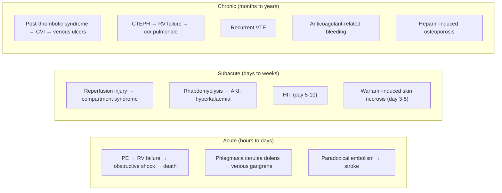

## Complications of Venous Thromboembolism

Complications of VTE can be organised into three categories: (A) **acute complications of the thrombus itself**, (B) **chronic sequelae of VTE**, and (C) **complications of treatment**. Understanding each complication requires tracing back to the underlying pathophysiology — every complication has a logical "why."

---

## A. Acute Complications of DVT

### 1. Pulmonary Embolism (PE) [1]

***Pulmonary embolism*** [1] is the most feared and most important acute complication of DVT.

**Pathophysiology:** A thrombus — typically from the proximal deep veins (popliteal, femoral, iliac) — detaches, travels through the IVC → right heart → lodges in the pulmonary arterial vasculature. The consequences depend on clot burden and cardiopulmonary reserve:

- **Small PE**: Occlude segmental or subsegmental arteries → V/Q mismatch → hypoxaemia. The patient may be symptomatic (pleuritic pain, dyspnoea) or asymptomatic
- **Submassive PE**: Significant RV afterload increase → RV dilatation and dysfunction, but the patient remains haemodynamically compensated (SBP ≥ 90). Elevated troponin and BNP signal that the RV is under stress
- **Massive PE**: > 50% of the pulmonary vascular bed obstructed → acute RV failure → interventricular septum bows into LV → ↓ LV filling → ↓ cardiac output → **obstructive shock** → death

***Patients with PE usually die from right heart failure (cardiogenic shock) rather than hypoxaemia*** [1]. This is because the thin-walled RV (designed for a low-pressure circuit) cannot acutely generate a mean PA pressure > 40 mmHg. Once the RV fails, it is a haemodynamic spiral: RV dilatation → ↓ RV coronary perfusion (RV ischaemia) → worsening RV failure → cardiovascular collapse.

**Risk factors for embolisation:**
- ***Proximal vein thrombosis*** [1] carries the highest risk — these are large-calibre veins with thrombi that are more likely to fragment and embolise
- Free-floating thrombus tail (not adherent to the vein wall) — higher embolisation risk
- Contralateral limb movement or mobilisation before adequate anticoagulation

**Mortality:**
- Untreated PE: ~30% mortality
- Treated PE: ~2–8% overall; massive PE even with treatment: ~25–65%

### 2. Phlegmasia Alba Dolens and Phlegmasia Cerulea Dolens

These represent the **severe end of the DVT spectrum** where massive venous obstruction threatens the limb:

| Condition | Mechanism | Clinical Features | Outcome if Untreated |
|---|---|---|---|
| **Phlegmasia alba dolens** ("painful white leg") | Massive ilio-femoral DVT → extreme venous hypertension → severe oedema → interstitial pressure rises enough to compress arterial inflow → limb pallor | Massively swollen, white/pale, painful leg; pulses may be diminished | Can progress to phlegmasia cerulea dolens |
| **Phlegmasia cerulea dolens** ("painful blue leg") | Progression: near-total venous occlusion → venous pressure exceeds arterial inflow pressure → tissue ischaemia → cyanosis → venous gangrene | Massively swollen, cyanotic, exquisitely painful leg; absent pulses; petechiae/blisters may develop | Venous gangrene → limb loss; systemic: hypovolaemic shock (massive fluid sequestration in the leg), DIC, multi-organ failure; mortality ~25–40% |

**Management:** This is a limb- and life-threatening emergency:
- Immediate anticoagulation (IV UFH)
- Limb elevation
- Consider **catheter-directed thrombolysis** or **surgical thrombectomy**
- If venous gangrene has developed → fasciotomy or amputation may be required

### 3. Paradoxical Embolism

A venous thrombus can rarely cross to the arterial circulation through:
- **Patent foramen ovale (PFO)** — present in ~25% of the population
- **Atrial septal defect (ASD)**

The thrombus bypasses the pulmonary vasculature and enters the systemic circulation → **arterial embolism** → stroke, mesenteric ischaemia, limb ischaemia, or renal infarction.

Why does this happen? In the setting of PE → raised RA pressure → right-to-left shunt across PFO → venous thrombus enters the left atrium → systemic embolisation. This should be suspected when a patient with DVT/PE presents with concurrent stroke or arterial embolism.

---

## B. Chronic Complications of DVT

### 4. Post-Thrombotic Syndrome (PTS)

PTS is the most common long-term complication of DVT, occurring in **20–50% of patients** with proximal DVT even with adequate anticoagulation. One of the key treatment objectives is ***limiting development of late complications including post-thrombotic syndrome*** [1].

**Pathophysiology:**
The thrombus in the deep vein causes two types of long-term damage:

1. **Valvular destruction**: As the thrombus organises and recanalises, it damages the delicate bicuspid venous valves → **valvular incompetence** → reflux → ambulatory venous hypertension
2. **Residual venous obstruction**: Incomplete thrombus resolution → persistent luminal narrowing → outflow obstruction → further venous hypertension

The combined effect is **chronic venous hypertension** in the affected limb → increased capillary pressure → fluid transudation (oedema), fibrin cuff deposition around capillaries (blocking oxygen diffusion), white cell trapping and activation (chronic inflammation), and eventually tissue damage.

**Clinical Features (progressive)** [3]:
- **Leg pain and heaviness** — worsens with standing, improves with elevation (same mechanism as CVI)
- **Chronic oedema** — persistent swelling of the affected limb
- **Skin changes**:
  - **Hyperpigmentation** [3] — haemosiderin deposition from extravasated red blood cells. Venous hypertension → capillary distension → RBC leak → macrophages phagocytose RBCs → deposit haemosiderin (brown pigment) in the dermis
  - **Venous eczema (stasis dermatitis)** [3] — itchy, erythematous, scaly skin. Chronic inflammation from trapped leucocytes releasing inflammatory mediators
  - **Lipodermatosclerosis** [3] — fibrosis and hardening of the subcutaneous tissue, particularly in the "gaiter zone" (medial lower third of the leg). The skin becomes woody, indurated, and tight. The leg develops an "inverted champagne bottle" appearance (narrowed at the ankle from fibrosis, swollen above from oedema)
  - **Atrophie blanche** [3] — white, avascular, scar-like plaques surrounded by dilated capillaries and hyperpigmentation. Represents focal skin infarction from severe microvascular disease
  - **Corona phlebectatica (malleolar flare)** [3] — fan-shaped pattern of intradermal venules at the ankle, representing cutaneous venous hypertension
- **Venous ulceration** [3] — the end-stage of PTS/CVI. Typically occurs in the gaiter zone (medial malleolar area). Shallow, irregular, with sloping edges, overlying areas of lipodermatosclerosis. May be painful but characteristically less painful than arterial ulcers

**Villalta Scale:** Standardised scoring system for PTS severity, incorporating 5 patient-reported symptoms (pain, cramps, heaviness, paraesthesia, pruritus) and 6 clinician-assessed signs (pretibial oedema, skin induration, hyperpigmentation, redness, venous ectasia, pain on calf compression).

**Prevention of PTS:**
- Adequate anticoagulation for DVT (prevents thrombus propagation and allows maximal natural thrombolysis)
- Elastic compression stockings were previously recommended for 2 years post-DVT, but the SOX trial (2014) showed no benefit over placebo. Current guidelines do NOT routinely recommend compression stockings solely for PTS prevention, though they may still be used symptomatically
- Catheter-directed thrombolysis for extensive ilio-femoral DVT — ***catheter-directed intervention considered if extensive DVT to decrease post-thrombotic syndrome*** [1]
- Early mobilisation with anticoagulation (bed rest does NOT reduce PE risk and worsens venous stasis)

### 5. Chronic Venous Insufficiency (CVI) [1]

***Chronic venous insufficiency*** [1] is essentially the broader clinical syndrome that encompasses PTS when DVT is the cause, but also includes CVI from primary valvular incompetence.

After DVT, the mechanism is identical to PTS: valve damage → reflux → venous hypertension → the spectrum of skin changes and ulceration described above. CVI is classified by the CEAP system (Clinical-Etiology-Anatomy-Pathophysiology), as discussed in the clinical features section.

### 6. Chronic Venous Obstruction [1]

***Chronic venous obstruction leads to pulmonary hypertension*** [1].

This occurs when a large proximal DVT (especially ilio-femoral) fails to fully recanalise → persistent venous outflow obstruction → chronic raised venous pressure → development of collateral venous drainage (which is often inadequate) → persistent symptoms of venous hypertension.

---

## C. Chronic Complications of PE

### 7. Chronic Thromboembolic Pulmonary Hypertension (CTEPH)

***Chronic thromboembolic pulmonary hypertension*** [1] is the most important chronic complication of PE, occurring in approximately **2–4%** of patients who survive an acute PE episode.

**Pathophysiology:**
After acute PE, the body's fibrinolytic system normally dissolves the thrombus over weeks to months. In a subset of patients, this resolution is incomplete:

1. The thrombus **organises** — fibrin is replaced by fibrous tissue that incorporates into the pulmonary artery wall
2. The organised thrombus causes **fixed obstruction** of pulmonary arteries (not amenable to anticoagulation or thrombolysis)
3. Chronic obstruction → persistently elevated pulmonary vascular resistance → remodelling of distal (unobstructed) pulmonary arteries (secondary pulmonary arteriopathy, similar to idiopathic PAH) → progressive pulmonary hypertension
4. RV faces chronically elevated afterload → **RV hypertrophy** → eventually **RV failure** (cor pulmonale)

**Clinical features:**
- Progressive exertional dyspnoea (months to years after acute PE)
- Exercise intolerance
- Signs of pulmonary hypertension: loud P2, RV heave, TR murmur
- Signs of right heart failure: elevated JVP, hepatomegaly, peripheral oedema, ascites
- Syncope on exertion (fixed cardiac output from RV failure → cannot augment output with exercise)

**Diagnosis:**
- V/Q scan: mismatched perfusion defects (screening test of choice — more sensitive than CTPA for chronic disease)
- Right heart catheterisation: mean PA pressure ≥ 25 mmHg (at rest) with pulmonary artery wedge pressure ≤ 15 mmHg (pre-capillary PH) after ≥ 3 months of anticoagulation
- CT PA: may show organised thrombus, webs, bands, mural thickening, mosaic perfusion pattern
- Pulmonary angiography: gold standard for defining surgical accessibility

**Management:**
- **Lifelong anticoagulation** (prevents further thrombosis)
- **Pulmonary thromboendarterectomy (PTE)**: The definitive, potentially curative treatment. Involves median sternotomy, cardiopulmonary bypass with deep hypothermic circulatory arrest, and surgical removal of the organised fibrotic thrombus from the pulmonary artery intima. Can dramatically reduce PA pressure and improve symptoms. Performed at specialised centres only
- **Balloon pulmonary angioplasty (BPA)**: For patients with inoperable disease — percutaneous catheter-based dilatation of obstructed pulmonary arteries
- **Medical therapy**: Riociguat (soluble guanylate cyclase stimulator) — the only drug specifically approved for inoperable or residual CTEPH. Increases NO-mediated pulmonary vasodilation

### 8. Recurrent VTE

VTE is a **recurrent disease**. The recurrence rate depends on whether the initial event was provoked or unprovoked:

| Scenario | Annual Recurrence Rate After Stopping Anticoagulation |
|---|---|
| First provoked VTE (major transient risk factor) | ~3% per year |
| First unprovoked VTE | ~10% per year |
| Second unprovoked VTE | ~15% per year |
| Cancer-associated VTE (ongoing cancer) | ~20% per year |

This is why the duration of anticoagulation is so carefully calibrated — the goal is to balance recurrence risk against bleeding risk.

---

## D. Complications of Treatment

### 9. Anticoagulant-Related Bleeding

The most common complication of VTE treatment is bleeding from anticoagulation. This is an inherent trade-off: by preventing pathological clotting, we also impair physiological haemostasis.

| Severity | Examples | Management |
|---|---|---|
| **Minor bleeding** | Epistaxis, gum bleeding, minor bruising, haematuria | Dose adjustment; local measures; ensure INR/anti-Xa in range |
| **Major bleeding** | GI haemorrhage, intramuscular haematoma, haemarthrosis, retroperitoneal haemorrhage | Stop anticoagulant; give specific antidote; supportive care (IV fluids, transfusion); surgical intervention if needed |
| **Life-threatening / intracranial bleeding** | Intracranial haemorrhage (ICH) [4] | Immediate cessation of anticoagulant; rapid reversal (PCC for warfarin; idarucizumab for dabigatran; andexanet alfa for Xa inhibitors); neurosurgical consultation; ICU care |

**Annual risk of major bleeding on anticoagulation:** ~1–3% per year (higher with warfarin than DOACs; higher in elderly, renal impairment, concomitant antiplatelet use).

**Antidotes:**
- Warfarin → Vitamin K (slow) + FFP or PCC (immediate) [1]
- Dabigatran → Idarucizumab (specific antibody fragment)
- Rivaroxaban/Apixaban/Edoxaban → Andexanet alfa (recombinant modified Factor Xa decoy); PCC as an alternative
- UFH → Protamine sulphate (full reversal)
- LMWH → Protamine sulphate (partial reversal, ~60%)
- Fondaparinux → No specific antidote; recombinant Factor VIIa may be considered in extremis

### 10. Heparin-Induced Thrombocytopenia (HIT)

HIT is a potentially catastrophic immune-mediated complication of heparin therapy.

**Two types:**

| Type | HIT Type I | HIT Type II |
|---|---|---|
| **Mechanism** | Non-immune; direct heparin effect on platelet aggregation | **Immune-mediated**: IgG antibodies against PF4-heparin complex activate platelets |
| **Timing** | Days 1–2 of heparin | Days 5–10 of heparin (or sooner if prior heparin exposure) |
| **Platelet drop** | Mild (rarely < 100) | **> 50% drop** from baseline (or nadir < 150) |
| **Thrombosis** | No | **YES — paradoxical thrombosis** (arterial AND venous) in ~50% of cases |
| **Management** | Self-resolves; continue heparin | **Stop ALL heparin immediately**; switch to non-heparin anticoagulant (fondaparinux, argatroban) |

**Pathophysiology of HIT Type II:**
1. Heparin binds to platelet factor 4 (PF4) on platelet surfaces → forms a neoantigen complex
2. IgG antibodies recognise the PF4-heparin complex → bind to it
3. The Fc portion of the antibody activates platelets via FcγRIIa receptors → massive platelet activation → release of procoagulant microparticles → thrombin generation
4. Paradox: **platelets are consumed (thrombocytopenia) while simultaneously causing thrombosis**
5. Activated platelets and endothelium create a prothrombotic storm → venous and arterial thrombosis (DVT, PE, limb ischaemia, stroke, MI)

**Diagnosis:**
- **4T score** (clinical pre-test probability): Thrombocytopenia, Timing, Thrombosis, oTher causes
- **Anti-PF4 antibody ELISA** (sensitive, moderate specificity)
- **Serotonin release assay (SRA)** (gold standard, highly specific)

### 11. Warfarin-Induced Skin Necrosis

**Mechanism:**
- Warfarin depletes Protein C (short half-life ~6–8h) before it adequately reduces procoagulant factors (Factor II half-life ~60h)
- In patients with **Protein C deficiency** (heterozygous), this creates a severe transient hypercoagulable state
- Microvascular thrombosis in the dermis → skin infarction → painful erythema progressing to purpura, haemorrhagic blisters, and full-thickness skin necrosis
- Typically occurs on **days 3–5** of warfarin initiation
- Most common in areas with abundant subcutaneous fat (breasts, buttocks, thighs)

**Prevention:** Always overlap warfarin with parenteral anticoagulation for ≥ 5 days; start with low dose (5 mg, not loading dose).

### 12. Osteoporosis from Long-Term Heparin Use

- Prolonged UFH use (> 1 month, typically > 3 months) can cause osteoporosis
- Mechanism: heparin promotes osteoclast activity and inhibits osteoblast function → net bone resorption
- LMWH has a **lower risk of osteoporosis** than UFH [1]
- Relevant primarily in pregnancy (where LMWH is used for the entire pregnancy duration)

### 13. Thrombolysis-Related Complications [12]

| Complication | Mechanism | Incidence |
|---|---|---|
| **Major haemorrhage** | Systemic fibrinolysis dissolves not only the pathological thrombus but also physiological fibrin plugs at other sites | ~10–15% for systemic thrombolysis |
| **Intracranial haemorrhage** | The most feared complication; fibrinolysis at sites of pre-existing cerebral small vessel disease | ~1–3% |
| **Reperfusion injury** | Sudden restoration of blood flow to ischaemic tissue → generation of reactive oxygen species → endothelial damage → capillary leak | Manifests as reperfusion pulmonary oedema or systemic inflammatory response |

### 14. IVC Filter Complications [1][11]

| Complication | Mechanism |
|---|---|
| ***Filter migration*** [11] | Inadequate fixation → filter dislodges and moves proximally (into right heart) or distally |
| ***Fractured filter*** [11] | Metal fatigue over time → strut fracture → fragments can embolise to heart or lungs |
| ***Infection*** [11] | Foreign body in the bloodstream → biofilm formation → bacteraemia |
| **IVC thrombosis** | The filter is itself a thrombogenic foreign body → clot forms on the filter → IVC occlusion → bilateral leg swelling, renal vein thrombosis |
| **Recurrent DVT** | Paradoxically, IVC filters increase the long-term risk of DVT (foreign body thrombogenicity + loss of venous flow dynamics) |
| **Filter penetration / perforation** | Filter tines erode through the IVC wall into adjacent structures (aorta, duodenum, vertebral body) |

---

## E. Complications of Massive DVT Requiring Intervention

### 15. Reperfusion Injury and Compartment Syndrome [12]

When a severely ischaemic limb (from phlegmasia cerulea dolens) or pulmonary vasculature (from massive PE) is reperfused — either by thrombolysis, thrombectomy, or natural resolution — the sudden return of oxygenated blood paradoxically causes further injury:

**Pathophysiology of reperfusion injury** [12]:
1. During ischaemia: cells switch to anaerobic metabolism → accumulation of lactate, hydrogen ions, potassium, and cellular breakdown products (including myoglobin from muscle)
2. ATP depletion → failure of Na+/K+-ATPase → intracellular sodium and calcium accumulation → cell swelling
3. Upon reperfusion: oxygen returns → generates **reactive oxygen species (ROS)** → damages endothelial cells → increased capillary permeability → massive fluid leak into the interstitium
4. **Compartment syndrome** [12]: ***Prolonged ischaemia → cell lysis → fluid leak into interstitium → intra-compartmental pressure rises > 30 mmHg*** [12] → compresses capillaries → further ischaemia (vicious cycle)

**Signs of compartment syndrome** [12]:
- ***Pain out of proportion to clinical signs, worsening with time despite analgesia*** [12]
- ***Numbness in distribution of nerves running within the compartment*** [12]
- ***Tense compartment on passive toe dorsiflexion and plantarflexion*** [12]
- ***Pulses can be present*** [12] (SBP far exceeds intra-compartmental pressure; pulse loss is a very late sign)

**Management** [12]: ***Urgent fasciotomy*** [12] — surgical release of all compartments to relieve pressure.

### 16. Rhabdomyolysis [12]

***Release of K+, H+, and myoglobin from damaged muscle cells*** [12].

**Pathophysiology:**
- Ischaemic or reperfused muscle cells undergo necrosis → release intracellular contents:
  - **Potassium (K+)** → hyperkalaemia → cardiac arrhythmias (peaked T waves, widened QRS, VF)
  - **Hydrogen ions (H+)** → metabolic acidosis
  - **Myoglobin** → filtered by kidneys → precipitates in renal tubules (especially in acidic urine) → **acute kidney injury (myoglobinuric AKI)**
  - **Creatine kinase (CK)** → massively elevated (diagnostic marker)
  - **Phosphate** → hyperphosphataemia → calcium-phosphate deposition → hypocalcaemia

**Clinical features** [12]:
- ***Arrhythmia*** [12] (from hyperkalaemia)
- ***Acute kidney injury*** [12] (from myoglobin nephrotoxicity)
- Dark "tea-coloured" urine (myoglobinuria)
- Muscle pain, weakness

**Management** [12]:
- ***Aggressive hydration*** [12] — high-volume IV normal saline to maintain urine output > 200–300 mL/hr; dilutes myoglobin in the tubules
- ***Diuresis with mannitol*** [12] — osmotic diuretic to promote renal clearance
- ***IV bicarbonate*** [12] — alkalinises the urine to prevent myoglobin precipitation (myoglobin precipitates in acidic urine)
- Cardiac monitoring and treatment of hyperkalaemia (calcium gluconate, insulin-dextrose, salbutamol nebuliser)
- Dialysis if refractory AKI or life-threatening electrolyte abnormalities

---

## F. Summary — Timeline of VTE Complications

---

<Callout title="High Yield Summary — Complications of VTE">

1. **PE** is the most feared acute complication of DVT — ***kills through RV failure, not hypoxaemia*** [1]. Proximal DVT carries the highest embolisation risk [1].
2. **Phlegmasia cerulea dolens** = massive DVT → venous gangrene; treat with catheter-directed thrombolysis or thrombectomy; may require fasciotomy or amputation.
3. ***Post-thrombotic syndrome*** occurs in 20–50% of proximal DVT — caused by valve destruction → chronic venous hypertension → oedema, hyperpigmentation, lipodermatosclerosis, venous ulcers [1][3]. Catheter-directed thrombolysis for ilio-femoral DVT may reduce PTS [1].
4. ***CTEPH*** occurs in 2–4% of PE survivors — organised thrombus in pulmonary arteries → fixed obstruction → progressive pulmonary hypertension → RV failure [1]. Definitive treatment: pulmonary thromboendarterectomy.
5. **HIT** = immune-mediated platelet activation by anti-PF4/heparin antibodies → paradoxical thrombosis + thrombocytopenia. Stop all heparin; switch to fondaparinux or argatroban.
6. **Warfarin-induced skin necrosis** = early Protein C depletion → microvascular thrombosis → skin infarction (days 3–5). Always bridge with heparin.
7. ***Reperfusion injury*** after thrombolysis/thrombectomy → compartment syndrome and rhabdomyolysis [12]. Watch for pain out of proportion, tense compartment, hyperkalaemia, AKI.
8. **IVC filter complications** [11]: migration, fracture, infection, IVC thrombosis, recurrent DVT. Always plan for retrieval.
9. **Anticoagulant-related bleeding** is the most common treatment complication — 1–3% major bleeding per year. Know all the antidotes.
10. **Recurrent VTE** rates: ~3%/yr provoked; ~10%/yr unprovoked; ~15%/yr after second event — drives decisions about duration of anticoagulation.

</Callout>

---

<ActiveRecallQuiz
  title="Active Recall - Complications of VTE"
  items={[
    {
      question: "Explain the pathophysiology of post-thrombotic syndrome and list four clinical features in order of progression.",
      markscheme: "DVT damages venous valves leading to valvular incompetence plus residual venous obstruction from incomplete thrombus resolution. Both cause chronic venous hypertension in the affected limb. Progression: (1) chronic oedema and leg heaviness, (2) hyperpigmentation from haemosiderin deposition (RBC extravasation and macrophage breakdown), (3) lipodermatosclerosis (subcutaneous fibrosis causing woody induration in the gaiter zone), (4) venous ulceration (typically shallow, medial malleolus, overlying lipodermatosclerosis). Other features: venous eczema, atrophie blanche, corona phlebectatica.",
    },
    {
      question: "What is CTEPH, what proportion of PE survivors develop it, and what is the definitive treatment?",
      markscheme: "Chronic thromboembolic pulmonary hypertension. Occurs in 2-4% of acute PE survivors. Incomplete thrombus resolution leads to organised fibrotic material within pulmonary arteries causing fixed obstruction plus secondary distal arteriopathy. This causes progressive pulmonary hypertension and eventual RV failure (cor pulmonale). Definitive treatment is pulmonary thromboendarterectomy (PTE) under cardiopulmonary bypass with deep hypothermic circulatory arrest. Alternatives for inoperable disease: balloon pulmonary angioplasty or riociguat (soluble guanylate cyclase stimulator).",
    },
    {
      question: "Describe the pathophysiology of HIT type II and explain the paradox of simultaneous thrombocytopenia and thrombosis.",
      markscheme: "Heparin binds platelet factor 4 (PF4) on platelet surfaces forming a neoantigen. IgG antibodies bind the PF4-heparin complex. The Fc portion of the antibody activates platelets via FcgammaRIIa receptors, causing massive platelet activation, release of procoagulant microparticles, and thrombin generation. Platelets are consumed (causing thrombocytopenia) while simultaneously triggering arterial and venous thrombosis. This is the paradox: the platelet count falls because platelets are being consumed by the very process that is causing pathological clotting.",
    },
    {
      question: "A patient undergoes catheter-directed thrombolysis for phlegmasia cerulea dolens. Six hours later, the leg becomes tense and extremely painful with pain on passive toe extension. What complication has occurred, what is the pathophysiology, and what is the immediate management?",
      markscheme: "Compartment syndrome secondary to reperfusion injury. During ischaemia, cellular ATP depletion leads to failure of Na/K-ATPase, intracellular sodium and calcium accumulation, and cell swelling. Upon reperfusion, reactive oxygen species damage endothelial cells causing increased capillary permeability and massive fluid leak into the interstitium. Intra-compartmental pressure rises above 30 mmHg, compressing capillaries and causing further ischaemia (vicious cycle). Immediate management: urgent fasciotomy of all compartments. Also monitor for rhabdomyolysis (check CK, K+, RFT; aggressive IV hydration, IV bicarbonate, mannitol).",
    },
    {
      question: "Explain why warfarin-induced skin necrosis occurs and in which patients it is most dangerous.",
      markscheme: "Warfarin inhibits vitamin K-dependent carboxylation of both procoagulant factors (II, VII, IX, X) and anticoagulant Protein C and S. Protein C has the shortest half-life (6-8 hours), so it is depleted first while Factor II (half-life 60 hours) remains active. This creates a transient hypercoagulable state on days 1-2. In patients with heterozygous Protein C deficiency, the already low baseline Protein C drops to near zero, causing severe microvascular thrombosis in the dermal venules leading to skin infarction. Occurs on days 3-5, typically in fat-rich areas (breasts, buttocks, thighs). Prevented by always bridging with heparin for at least 5 days.",
    },
  ]}
/>

## References

[1] Senior notes: felixlai.md (DVT and PE section, pages 967–972)
[3] Senior notes: maxim.md (Varicose veins and CVI section, pages 165–173)
[4] Senior notes: maxim.md (Intracerebral haemorrhage section, page 764)
[11] Senior notes: maxim.md (IVC filter section, page 11; peri-operative management section)
[12] Senior notes: maxim.md (Acute limb ischaemia complications section — reperfusion injury, compartment syndrome, rhabdomyolysis)
