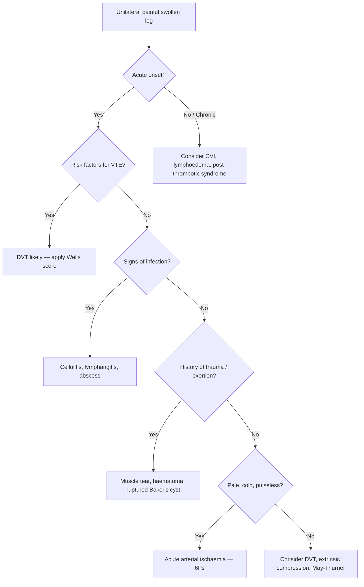
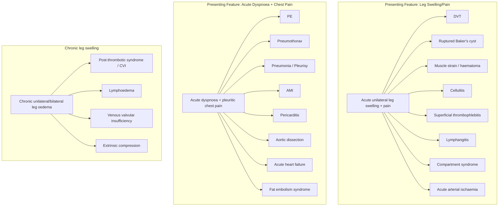

## Differential Diagnosis of VTE

The clinical challenge with VTE is that the symptoms — leg swelling, leg pain, dyspnoea, chest pain — are all **non-specific**. Many other conditions mimic DVT or PE, and the clinical examination alone has poor sensitivity and specificity. This is precisely why we use structured pre-test probability scores (Wells criteria) and algorithmic workup rather than relying on clinical gestalt alone.

Let's think about this from first principles: DVT presents with a **unilateral swollen, painful, warm leg**. PE presents with **acute dyspnoea, pleuritic chest pain, tachycardia, and hypoxaemia**. Now ask: what else can produce these patterns?

---

### A. Differential Diagnosis of DVT [1]

The differentials for a swollen, painful leg can be systematically organised by the mechanism producing the swelling or pain:

#### 1. Musculoskeletal Causes

| Condition | Why it mimics DVT | How to distinguish |
|---|---|---|
| **Muscle strain / tear / twisting injury** [1] | Acute calf pain, swelling, tenderness — exactly like DVT | History of trauma or sudden exertion; localised to a specific muscle group; no risk factors for DVT; ultrasound shows muscle tear, not venous thrombus |
| **Ruptured Baker's cyst** (popliteal cyst) [1] | Posterior knee/calf pain with acute swelling — classic DVT mimic | Baker's cyst = herniation of synovial fluid through the posterior knee capsule. When it ruptures, fluid tracks down the calf fascial planes → acute painful swelling, ecchymosis around the medial malleolus (crescent sign). Usually in patients with pre-existing knee osteoarthritis or rheumatoid arthritis. Ultrasound of popliteal fossa shows the ruptured cyst |
| **Calf muscle haematoma** | Painful swollen calf, especially in anticoagulated patients | History of anticoagulant use or coagulopathy; ultrasound shows haematoma within muscle rather than venous thrombus |

<Callout title="Baker's Cyst — The Classic DVT Mimic" type="error">
A ruptured Baker's cyst is one of the most commonly tested DVT mimics. Both present with acute calf swelling and pain. The key differentiator: Baker's cyst patients typically have a history of **knee joint disease** (OA, RA), and there may be a visible ecchymosis tracking around the medial malleolus. Always ask about pre-existing knee problems. Duplex ultrasound resolves the question definitively.
</Callout>

#### 2. Infectious / Inflammatory Causes

| Condition | Why it mimics DVT | How to distinguish |
|---|---|---|
| **Cellulitis** [1] | Red, warm, swollen, painful leg — overlaps directly with DVT signs | Cellulitis = bacterial infection of skin and subcutaneous tissue. Key differences: tends to be **bilateral/diffuse erythema** with poorly demarcated borders, may have a portal of entry (wound, tinea pedis), associated with systemic features (fever, rigors, leucocytosis) more prominently. DVT tends to cause oedema out of proportion to erythema. However, DVT and cellulitis can coexist — always have a low threshold to investigate |
| **Superficial thrombophlebitis** [1] | Tender, palpable cord along a superficial vein with overlying erythema and warmth | This is thrombosis of a **superficial** vein (e.g., GSV or SSV), not a deep vein. The thrombosed vein is palpable as a firm, tender cord just beneath the skin. The inflammation is localised along the vein's course. Important: superficial thrombophlebitis can **coexist with DVT** (~6–40% of cases), especially if it involves the proximal GSV near the SFJ, so a duplex ultrasound should still be done |
| **Lymphangitis** [1] | Red streaking up the limb with pain and swelling | Lymphangitis = infection/inflammation of lymphatic channels. Distinguished by the characteristic **red linear streaks** tracking proximally along the limb (following lymphatic drainage), often with a distal portal of entry (wound, insect bite). Associated with tender regional lymphadenopathy |

#### 3. Lymphatic / Venous Causes

| Condition | Why it mimics DVT | How to distinguish |
|---|---|---|
| **Lymphoedema** [1] | Chronic unilateral (or bilateral) limb swelling | Lymphoedema = impaired lymphatic drainage → accumulation of protein-rich interstitial fluid. Key distinguishing features: **non-pitting** oedema (because it is protein-rich, unlike the transudative pitting oedema of venous disease), positive **Stemmer's sign** (inability to pinch a fold of skin on the dorsum of the second toe), skin thickening, "buffalo hump" appearance at dorsum of foot. Chronic course (months/years) rather than acute onset. Causes: primary (congenital, praecox, tarda) or secondary (lymph node dissection, filariasis, radiation, tumour obstruction) |
| **Venous valvular insufficiency / Chronic venous insufficiency (CVI)** [1][3] | Chronic leg swelling, aching, heaviness | CVI from post-thrombotic syndrome or primary valvular incompetence causes chronic symptoms that fluctuate with standing/elevation. Distinguished from acute DVT by **chronicity**, skin changes (hyperpigmentation, lipodermatosclerosis, atrophie blanche, venous ulcers), and characteristic distribution in the "gaiter zone" (medial lower third of leg). However, acute DVT can occur on a background of CVI |
| **Post-thrombotic syndrome** | Chronic swelling, pain, skin changes after prior DVT | History of previous DVT; chronic course; associated skin changes of CVI. The damaged valves from prior DVT cause chronic venous hypertension |

#### 4. Other Causes of Unilateral Leg Swelling

| Condition | Why it mimics DVT | How to distinguish |
|---|---|---|
| **Extrinsic venous compression** (pelvic mass, May-Thurner syndrome) | Unilateral leg swelling from venous outflow obstruction | Pelvic malignancy (cervical, ovarian, rectal) can compress iliac veins causing unilateral swelling [2]. May-Thurner syndrome: left common iliac vein compression by right common iliac artery [3]. Usually presents in young women with left-sided DVT. CT/MR venography shows the compression |
| **Compartment syndrome** [6] | Acute painful, swollen, tense limb | Compartment syndrome = raised intra-compartmental pressure (from trauma, fracture, reperfusion) → compromised tissue perfusion. Distinguished by **pain out of proportion, pain with passive stretch, tense compartment on palpation**. Pulses may be preserved initially. Compartment pressure measurement is diagnostic |
| **Acute arterial ischaemia** (6Ps) [6][7] | Can be confused with DVT if the presentation includes a painful leg | Distinguished by the **6Ps**: Pain, Pallor, Pulselessness, Perishingly cold, Paraesthesia, Paralysis [6]. The limb is **pale and cold** (not warm and swollen as in DVT). Absent pulses. History of AF, vascular disease |
| **Phlegmasia cerulea dolens** [6][7] | This is actually a severe form of DVT but can mimic acute arterial ischaemia | Massive DVT → venous pressure so high it compromises arterial inflow → cyanotic, painful, swollen limb. Distinguished from primary arterial ischaemia by the **massive oedema** (arterial ischaemia causes a "thin" pale limb; phlegmasia causes a "fat" blue limb) |
| **Dependent oedema / Heart failure** | Bilateral leg swelling | Usually **bilateral and symmetrical**; associated with other signs of heart failure (elevated JVP, S3, lung crepitations). Pitting oedema. Worsens with dependency, improves overnight |
| **Nephrotic syndrome / Hypoalbuminaemia** | Bilateral leg swelling | Low oncotic pressure → bilateral oedema. Frothy urine, periorbital oedema, low serum albumin |

#### Distinguishing Features Summary — DVT vs Key Mimics

---

### B. Differential Diagnosis of Pulmonary Embolism

PE is even more challenging because its symptoms (dyspnoea, chest pain, tachycardia) overlap with many acute cardiopulmonary conditions. The differential depends on the predominant presenting feature.

#### 1. Acute Dyspnoea + Pleuritic Chest Pain

| Condition | Why it mimics PE | How to distinguish |
|---|---|---|
| **Pneumothorax** [8] | Acute pleuritic chest pain + dyspnoea, exactly like PE | Sudden onset (often in tall thin young males or COPD patients). Reduced breath sounds and hyperresonance on the affected side. CXR shows visceral pleural line with absent lung markings peripherally. Unlike PE, there is no tachycardia from RV strain, and the hypotension (if tension pneumothorax) has a different mechanism (mediastinal shift → reduced venous return) |
| **Pneumonia / Pleuritis** | Pleuritic chest pain, dyspnoea, fever, tachycardia | Productive cough, consolidation signs (bronchial breathing, dull percussion, increased vocal resonance/tactile fremitus). CXR shows lobar or segmental consolidation. Fever and leucocytosis are more prominent. However, PE can also cause fever and CXR infiltrates (from infarction), so this distinction is not always straightforward |
| **Acute exacerbation of COPD / Asthma** | Acute dyspnoea, wheeze, tachycardia | History of COPD/asthma, diffuse wheeze on auscultation, hyperinflation. But remember: PE can trigger bronchospasm (serotonin and thromboxane release), and PE is a common cause of acute COPD exacerbation that doesn't respond to standard therapy |

#### 2. Acute Chest Pain — Cardiac Differentials

| Condition | Why it mimics PE | How to distinguish |
|---|---|---|
| **Acute myocardial infarction (AMI)** [8] | Chest pain, dyspnoea, tachycardia, hypotension, elevated troponin | AMI: central crushing chest pain radiating to jaw/arm, ST changes in coronary territories on ECG, regional wall motion abnormality on echo. PE: more pleuritic (sharp, worse with inspiration), ECG shows right heart strain pattern (S1Q3T3, T inversions V1-4, RBBB), troponin may be mildly elevated in PE but in a different pattern |
| **Pericarditis** [8] | Pleuritic/positional chest pain, dyspnoea | Pericarditis: sharp retrosternal pain relieved by sitting forward, worse lying flat. ECG shows **diffuse concave ST elevation** and PR depression (not localised to a coronary territory). Pericardial friction rub on auscultation. Echo may show effusion |
| **Aortic dissection** [8] | Acute severe chest pain, hypotension, tachycardia | Aortic dissection: "tearing" interscapular pain, blood pressure differential between arms, widened mediastinum on CXR, aortic regurgitation murmur. CT angiography shows the dissection flap. Different mechanism entirely (intimal tear → false lumen) but the acuity and chest pain overlap with massive PE |
| **Cardiac tamponade** | Hypotension, tachycardia, elevated JVP — like massive PE | Beck's triad (hypotension, muffled heart sounds, elevated JVP). Pulsus paradoxus. Echo shows pericardial effusion with RA/RV diastolic collapse. Can be distinguished from PE because tamponade has **equalisation of diastolic pressures** whereas PE has isolated RV pressure elevation |

#### 3. Acute Dyspnoea — Other Differentials

| Condition | Why it mimics PE | How to distinguish |
|---|---|---|
| **Acute heart failure / Pulmonary oedema** | Acute dyspnoea, tachycardia, hypoxaemia | Bilateral crepitations, S3 gallop, frothy pink sputum, raised BNP/NT-proBNP. CXR shows bilateral pulmonary oedema (bat-wing pattern, Kerley B lines, upper lobe diversion). Echo shows LV dysfunction. PE echo shows RV dilatation with preserved LV function |
| **Acute pancreatitis** [8] | Epigastric pain radiating to back, dyspnoea (from diaphragmatic irritation and pleural effusion) | Elevated lipase/amylase, CT findings. Usually not confused with PE if the history is clear, but both can cause pleural effusion and hypoxaemia |

#### 4. Haemoptysis Differential

PE is one of the classic causes of haemoptysis (from pulmonary infarction). Other causes to consider:
- Bronchogenic carcinoma
- Pulmonary tuberculosis (especially relevant in Hong Kong)
- Bronchiectasis
- Mitral stenosis
- Vasculitis (Goodpasture's, granulomatosis with polyangiitis)

#### 5. Special Differential: Fat Embolism Syndrome

| Feature | PE (thromboembolism) | Fat Embolism Syndrome |
|---|---|---|
| **Timing** | Any time, but classically days 5–10 post-op or during immobilisation | 24–72 hours after long bone fracture or orthopaedic surgery |
| **Classic triad** | Dyspnoea + pleuritic pain + DVT signs | Respiratory distress + neurological changes (confusion) + **petechial rash** (axillae, conjunctivae, chest) |
| **Mechanism** | Thrombus embolisation from venous system | Fat globules from bone marrow enter venous system → lodge in pulmonary capillaries → cause endothelial injury + inflammatory response |
| **D-dimer** | Elevated | May be elevated (non-specific) |
| **CT PA** | Shows filling defect | Usually normal; bilateral ground-glass opacities |

---

### C. Differential Diagnosis — Conditions That Cause BOTH DVT and PE-like Presentations

Some conditions deserve special mention because they can present with both limb symptoms and cardiopulmonary compromise, overlapping with the full VTE spectrum:

| Condition | Mechanism | Key distinguishing features |
|---|---|---|
| **Disseminated intravascular coagulation (DIC)** [9] | Widespread intravascular coagulation → microvascular thrombosis + consumption of clotting factors → paradoxical bleeding AND thrombosis | History of sepsis, malignancy (especially APL), or obstetric catastrophe. Lab: ↓ platelets, ↑ PT, ↑ aPTT, ↑ D-dimer, ↑ FDPs, schistocytes on blood film (MAHA). Both thrombosis (organ ischaemia) and bleeding occur simultaneously |
| **Heparin-induced thrombocytopenia (HIT)** | Anti-PF4/heparin antibodies → platelet activation → arterial AND venous thrombosis despite thrombocytopenia | Occurs 5–10 days after starting heparin; **platelet count drops > 50%**; new thrombosis (venous > arterial) while on heparin. 4T score for clinical assessment. Confirm with anti-PF4 antibody and serotonin release assay |
| **Antiphospholipid syndrome (APS)** | Autoantibodies activate endothelium, platelets, complement → thrombosis | Recurrent arterial or venous thrombosis, pregnancy morbidity (recurrent miscarriages). Lab: lupus anticoagulant, anticardiolipin, anti-β2-glycoprotein I antibodies. Paradoxically prolongs aPTT in vitro |
| **Cancer-associated thrombosis** [1] | Mucin secretion, tissue factor expression, endothelial activation by tumour → hypercoagulable state | Unprovoked or recurrent VTE, especially in age > 40. May be the first presentation of an occult malignancy. Trousseau syndrome: migratory superficial thrombophlebitis (classically pancreatic cancer) [10] |

---

### D. Summary Mermaid: Systematic Approach to VTE Differential Diagnosis

---

<Callout title="High Yield Exam Points — DDx of VTE">

1. **DVT differentials to always mention** [1]: Ruptured Baker's cyst, cellulitis, superficial thrombophlebitis, muscle strain/tear, lymphangitis, lymphoedema, chronic venous insufficiency
2. **PE differentials to always mention** [8]: Pneumothorax, AMI, pericarditis, pneumonia, aortic dissection, acute heart failure, fat embolism syndrome
3. **Baker's cyst rupture** is the most classic DVT mimic — look for history of knee OA/RA and crescent sign at medial malleolus
4. **Cellulitis vs DVT**: Both cause a red, warm, swollen leg. Cellulitis has a portal of entry, more prominent erythema, and systemic sepsis features. But they can coexist — always consider duplex USS
5. **Phlegmasia cerulea dolens** mimics acute arterial ischaemia — "fat blue leg" vs "thin pale leg" is the key distinction [6][7]
6. **Fat embolism syndrome** occurs 24–72h post-long-bone fracture with the classic triad: respiratory distress, neurological changes, petechial rash — do NOT confuse with thrombotic PE
7. An **unexplained or recurrent VTE** should always prompt consideration of underlying malignancy, APS, or inherited thrombophilia

</Callout>

---

<ActiveRecallQuiz
  title="Active Recall - Differential Diagnosis of VTE"
  items={[
    {
      question: "List five differential diagnoses for DVT presenting as an acute, unilateral swollen painful leg, and for each give one key distinguishing feature from DVT.",
      markscheme: "1. Ruptured Baker's cyst — history of knee joint disease, crescent sign at medial malleolus, popliteal fossa mass on USS. 2. Cellulitis — portal of entry, diffuse erythema with poorly demarcated borders, systemic sepsis features. 3. Muscle strain or tear — history of trauma or exertion, localised tenderness, USS shows muscle injury not venous thrombus. 4. Superficial thrombophlebitis — palpable tender cord along superficial vein, localised inflammation. 5. Lymphoedema — non-pitting oedema, positive Stemmer sign, chronic course, dorsal foot swelling.",
    },
    {
      question: "A patient presents with acute dyspnoea and pleuritic chest pain. List four differential diagnoses other than PE, and for each explain one pathophysiological difference from PE.",
      markscheme: "1. Pneumothorax — air in pleural space causes lung collapse (not vascular obstruction); reduced breath sounds and hyperresonance. 2. AMI — coronary artery occlusion causing myocardial ischaemia (not pulmonary vascular obstruction); ST changes in coronary distribution. 3. Pericarditis — inflammation of pericardium; diffuse ST elevation and PR depression; pain relieved by sitting forward. 4. Pneumonia — infection of lung parenchyma (not vascular); consolidation signs on exam and CXR.",
    },
    {
      question: "How do you distinguish phlegmasia cerulea dolens from acute arterial ischaemia at the bedside?",
      markscheme: "Phlegmasia cerulea dolens is massive DVT causing venous outflow obstruction so severe that arterial inflow is compromised. The limb is massively SWOLLEN and CYANOTIC (fat blue leg). In contrast, acute arterial ischaemia presents with a PALE, COLD, THIN limb (no swelling because there is no venous congestion). In phlegmasia, pulses are lost due to extrinsic compression from oedema; in arterial ischaemia, pulses are lost due to intrinsic arterial obstruction. History: phlegmasia has VTE risk factors; arterial ischaemia has AF, PVD history.",
    },
    {
      question: "What is fat embolism syndrome, when does it occur, and what clinical triad distinguishes it from thrombotic PE?",
      markscheme: "Fat embolism syndrome occurs 24-72 hours after long bone fractures or orthopaedic surgery. Fat globules from bone marrow enter venous system, lodge in pulmonary capillaries, cause endothelial injury and systemic inflammatory response. Classic triad: respiratory distress, neurological changes (confusion, decreased GCS), and petechial rash (axillae, conjunctivae, chest). Thrombotic PE does NOT typically cause petechial rash or acute confusion.",
    },
    {
      question: "A 55-year-old man presents with recurrent unprovoked DVT and prolonged aPTT. What diagnosis should you consider, and why is the aPTT prolonged paradoxically?",
      markscheme: "Antiphospholipid syndrome (APS). The lupus anticoagulant antibody interferes with phospholipid-dependent coagulation assays in vitro, prolonging the aPTT. However, in vivo, the antibodies activate endothelial cells, platelets, and complement, creating a prothrombotic state. So the aPTT is prolonged in the lab but the patient is hypercoagulable clinically — this is the classic paradox of APS.",
    },
  ]}
/>

## References

[1] Senior notes: felixlai.md (DVT and PE section, pages 962–965)
[2] Senior notes: felixlai.md (Varicose veins section, page 950)
[3] Senior notes: maxim.md (Varicose veins section, pages 165–173)
[6] Senior notes: felixlai.md (Acute limb ischaemia section, page 918)
[7] Senior notes: maxim.md (Acute limb ischaemia section)
[8] Senior notes: felixlai.md (Aortic dissection differential diagnosis section, page 904)
[9] Senior notes: felixlai.md (DIC section)
[10] Senior notes: maxim.md (Pancreatic carcinoma section, page 146)
