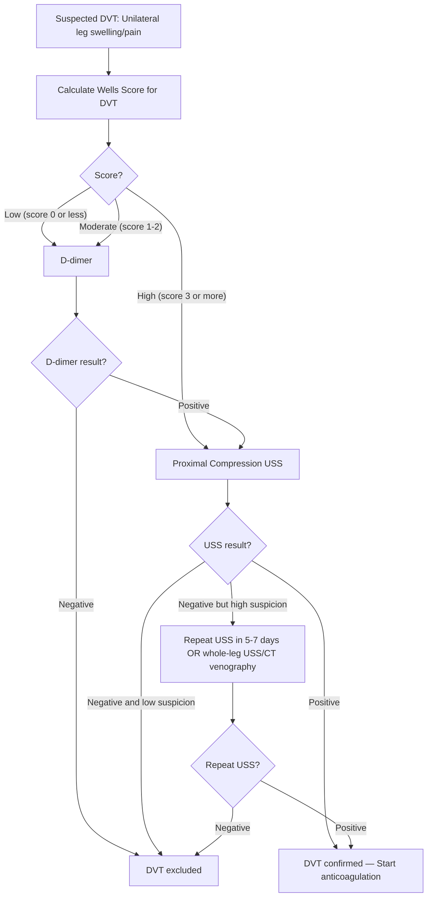
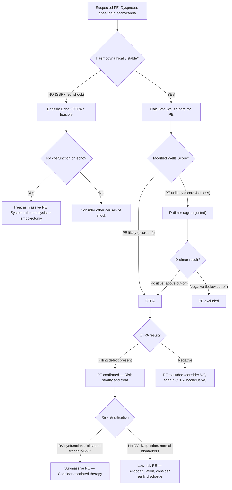

## Diagnostic Criteria, Algorithm & Investigation Modalities for VTE

The diagnostic approach to VTE is one of the most **algorithm-driven** processes in clinical medicine. Why? Because clinical features alone are unreliable (as we saw in the DDx section — DVT is clinically silent in 60–80% of cases, and PE symptoms are non-specific). We therefore depend on a structured sequence: **pre-test probability scoring → D-dimer (to rule out) → definitive imaging (to rule in)**.

Let's build this from first principles.

---

## 1. Pre-Test Probability Scoring — The Wells Score

### The Logic Behind Clinical Prediction Rules

Before ordering any test, you need to know: *"How likely is this diagnosis?"* This matters because:
- If pre-test probability is **low**, a negative D-dimer can safely **exclude** VTE without imaging → avoids unnecessary CTPA/USS radiation and cost
- If pre-test probability is **high**, D-dimer is unhelpful (it will be elevated in many conditions) → proceed straight to imaging
- If pre-test probability is **moderate**, D-dimer acts as a gatekeeper

The **Wells score** is the most widely used and validated clinical prediction rule for both DVT and PE [1].

### 1A. Wells Score for DVT

| Clinical Feature | Score | Rationale |
|---|---|---|
| Active cancer (treatment within 6 months, or palliative) | +1 | Cancer = hypercoagulability (Virchow's triad) |
| Paralysis, paresis, or recent plaster immobilisation of lower extremity | +1 | Immobility = stasis |
| Recently bedridden > 3 days or major surgery within 12 weeks requiring general/regional anaesthesia | +1 | Stasis + endothelial injury |
| Localised tenderness along the distribution of the deep venous system | +1 | Direct sign of thrombosed vein |
| Entire leg swollen | +1 | Proximal obstruction (iliofemoral level) |
| Calf swelling at least 3 cm larger than asymptomatic side (measured 10 cm below tibial tuberosity) | +1 | Objective measure of unilateral oedema |
| Pitting oedema confined to the symptomatic leg | +1 | Venous hypertension → transudative oedema |
| Collateral superficial veins (non-varicose) | +1 | Collateral drainage developing to bypass obstructed deep vein |
| Previously documented DVT | +1 | Prior VTE is the strongest risk factor for recurrence |
| Alternative diagnosis at least as likely as DVT | **−2** | If another diagnosis explains the symptoms better, DVT becomes less likely |

**Interpretation:**

| Score | Probability Category | DVT Prevalence |
|---|---|---|
| ≥ 3 | **High** | ~75% |
| 1–2 | **Moderate** | ~17% |
| ≤ 0 | **Low** | ~3% |

### 1B. Wells Score for PE [1]

This is the one most commonly tested in exams:

| Clinical Feature | Score | Rationale |
|---|---|---|
| ***Clinical symptoms of DVT (leg swelling, pain with palpation)*** [1] | ***3.0*** | If the source (DVT) is present, PE is much more likely |
| ***Other diagnosis less likely than PE*** [1] | ***3.0*** | Clinical gestalt — if you can't think of a better explanation, PE probability rises |
| ***Immobilisation ≥ 3 days*** [1] | ***1.5*** | Stasis |
| ***Surgery in previous 4 weeks*** [1] | ***1.5*** | Stasis + endothelial injury |
| ***Previous DVT/PE*** [1] | ***1.5*** | Strongest predictor of recurrence |
| ***Tachycardia (HR > 100)*** [1] | ***1.5*** | Compensatory sympathetic response to reduced CO / hypoxaemia |
| ***Haemoptysis*** [1] | ***1.0*** | Pulmonary infarction → bleeding into airways |
| ***Malignancy*** [1] | ***1.0*** | Hypercoagulability |

**Interpretation — Two scoring systems** [1]:

***Traditional (three-tier) clinical probability*** [1]:

| Category | Score | PE Prevalence |
|---|---|---|
| ***High*** | ***> 6.0*** | ~65% |
| ***Moderate*** | ***2.0 – 6.0*** | ~25% |
| ***Low*** | ***< 2.0*** | ~10% |

***Simplified (two-tier) modified Wells*** [1]:

| Category | Score | Action |
|---|---|---|
| ***PE likely*** | ***> 4.0*** | Proceed directly to CTPA |
| ***PE unlikely*** | ***≤ 4.0*** | D-dimer first; if negative, PE excluded |

<Callout title="Exam Pearl: Modified Wells Dichotomised Score">
The **two-tier (dichotomised) modified Wells score** with a cut-off of 4.0 is the most commonly used in current clinical practice. If score ≤ 4 → D-dimer. If score > 4 → CTPA. This is simpler and equally validated. Know both the three-tier and two-tier interpretations for exams [1].
</Callout>

### 1C. Alternative Scoring: Geneva Score (Revised)

The revised Geneva score is a fully objective alternative (no subjective "alternative diagnosis" criterion). Less commonly tested but worth knowing:

| Feature | Score |
|---|---|
| Age > 65 | +1 |
| Previous DVT or PE | +3 |
| Surgery or fracture within 1 month | +2 |
| Active malignancy | +2 |
| Unilateral lower limb pain | +3 |
| Haemoptysis | +2 |
| HR 75–94 | +3 |
| HR ≥ 95 | +5 |
| Pain on lower limb deep vein palpation and unilateral oedema | +4 |

Interpretation: 0–3 = low; 4–10 = intermediate; ≥ 11 = high.

### 1D. PERC Rule (Pulmonary Embolism Rule-out Criteria)

For very low-risk patients (gestalt < 15% pre-test probability), the PERC rule can exclude PE without even checking D-dimer. If **ALL eight criteria** are met, PE is excluded:
- Age < 50
- HR < 100
- SpO2 > 94% on room air
- No haemoptysis
- No oestrogen use
- No prior DVT/PE
- No unilateral leg swelling
- No surgery/trauma requiring hospitalisation within 4 weeks

If any single criterion is not met → proceed with D-dimer / imaging.

---

## 2. Investigations — Biochemical Tests

### 2A. D-dimer [1]

**What is it?** D-dimer is a fibrin degradation product — a small protein fragment present in the blood after a blood clot is degraded by fibrinolysis. When a thrombus forms (fibrin cross-linked by Factor XIIIa), and then the body's fibrinolytic system (plasmin) breaks it down, D-dimers are released.

**Key characteristics** [1]:
- ***Sensitive but NOT specific*** [1] — elevated in many conditions
- ***D-dimer is also increased in MI, pneumonia, sepsis, malignancy*** [1], post-surgery, pregnancy, DIC, trauma, inflammation, and even normal ageing
- ***Negative results have > 99% NPV*** [1] — this is the critical point: a normal D-dimer effectively **rules OUT** VTE in patients with low/moderate pre-test probability
- ***Only used to rule out venous thrombosis if absent*** [1] — a positive D-dimer does NOT confirm VTE (it merely says "you cannot exclude it")

**Age-adjusted D-dimer cut-off** [1]:
- ***Standard cut-off: 500 μg/L if age < 50 years*** [1]
- ***Age-adjusted cut-off: 10 × age (in μg/L) if ≥ 50 years*** [1]
  - Why? D-dimer naturally rises with age. Using a fixed cut-off of 500 in elderly patients produces too many false positives, leading to unnecessary CTPAs. An 80-year-old's cut-off would be 800 μg/L.
  - Studies show age-adjusted cut-offs increase specificity from ~35% to ~60% without sacrificing sensitivity

<Callout title="D-dimer: Rule OUT, Never Rule IN" type="error">
A common mistake is ordering D-dimer in a patient with high pre-test probability. ***D-dimer is NOT useful in post-operative patients*** [5] because it will be elevated anyway (surgery activates coagulation). Similarly, in patients with active cancer, sepsis, or pregnancy, D-dimer is almost always elevated. Use D-dimer only when pre-test probability is low to moderate to EXCLUDE VTE.
</Callout>

### 2B. Complete Blood Count (CBC) with Differentials [1]

| Finding | Significance |
|---|---|
| ***Polycythaemia*** [1] | Myeloproliferative neoplasm (polycythaemia vera) — hypercoagulable state; increased blood viscosity contributes to stasis |
| ***Thrombocytosis*** [1] | Reactive thrombocytosis (infection, inflammation, malignancy) or essential thrombocythaemia — both increase thrombotic risk |
| Thrombocytopenia | Consider HIT (if on heparin), DIC, TTP/HUS, or APS (mild) |
| Leucocytosis | May suggest infection (cellulitis mimicking DVT, or pneumonia mimicking PE) |
| Anaemia | Chronic disease, haemolysis (DIC), or blood loss |

### 2C. Clotting Profile [1]

| Test | Significance |
|---|---|
| ***Prothrombin time (PT)*** [1] | Baseline assessment before starting anticoagulation; elevated in DIC, liver disease, warfarin use |
| ***Activated partial thromboplastin time (aPTT)*** [1] | Baseline; ***presence of lupus anticoagulant antibody leads to increased aPTT*** [1] — paradoxically, these patients are PROthrombotic in vivo (APS) |
| INR | Baseline; will be used to monitor warfarin therapy |

Why do we check clotting before treatment? Because:
1. We need a baseline before starting anticoagulation
2. Prolonged PT/aPTT might suggest DIC (consumption of clotting factors), liver disease, or APS
3. An unexpectedly prolonged aPTT in the context of thrombosis should raise suspicion for **lupus anticoagulant** (APS)

### 2D. Thrombophilia Screen [1]

***Not performed in the acute setting*** — should be done 2–4 weeks after completing anticoagulation (or at least 2 weeks off anticoagulant), because:
- Acute thrombosis itself consumes Protein C, S, and Antithrombin → falsely low levels
- Heparin lowers Antithrombin levels
- Warfarin lowers Protein C and S levels
- DOACs interfere with lupus anticoagulant testing

| Test | What It Detects [1] |
|---|---|
| ***Antithrombin III level*** [1] | Antithrombin deficiency (most relevant in Chinese/HK population) |
| ***Protein C activity*** [1] | Protein C deficiency |
| ***Protein S activity (free and total)*** [1] | Protein S deficiency |
| ***Factor V Leiden mutation*** [1] | Activated Protein C resistance (rare in Chinese) |
| ***Prothrombin G20210A mutation*** | Gain-of-function prothrombin mutation (rare in Chinese) |
| ***Lupus anticoagulant, anticardiolipin Ab, anti-β2-glycoprotein I Ab*** [1] | Antiphospholipid syndrome |
| Homocysteine level | Hyperhomocysteinaemia |

**When to screen for thrombophilia:**
- Unprovoked VTE in young patient (< 50 years)
- Recurrent VTE
- VTE at unusual sites (cerebral, splanchnic, upper extremity)
- Family history of VTE
- Warfarin-induced skin necrosis (Protein C deficiency)

### 2E. Arterial Blood Gas (ABG) [1]

| Finding | Pathophysiological Basis [1] |
|---|---|
| ***Hypoxaemia*** [1] | V/Q mismatch — areas of lung are ventilated but not perfused (dead space), plus intrapulmonary shunting |
| ***Hypocapnia*** [1] | Compensatory hyperventilation in response to hypoxaemia → blows off CO2 |
| ***Respiratory alkalosis*** [1] | Consequence of hyperventilation → ↓ PaCO2 → ↑ pH |
| ***Increased A-a gradient*** [1] | The alveolar-arterial oxygen gradient is elevated because the problem is at the level of gas exchange (V/Q mismatch), not hypoventilation. A normal A-a gradient would suggest hypoventilation as the cause of hypoxaemia |
| ***Type I respiratory failure*** [1] | Hypoxaemia (PaO2 < 60 mmHg) with normal or low PaCO2 — classic pattern for PE |

<Callout title="ABG in PE: Why Type I, Not Type II?">
PE creates dead space (ventilated but not perfused areas). The body compensates by hyperventilating the perfused areas, which effectively blows off CO2 (CO2 is highly diffusible). So PaCO2 is normal or low. But this hyperventilation cannot fully compensate for the hypoxaemia because oxygen has much less ability to dissolve across the alveolar membrane at higher concentrations (the O2-Hb dissociation curve is sigmoid — you're on the flat part). Result: **Type I failure (low O2, normal/low CO2)**.
</Callout>

### 2F. Other Bloods

- **LFT** [1]: Baseline before anticoagulation; hepatic congestion from RV failure may elevate transaminases
- **RFT** [1]: Baseline renal function for anticoagulant dosing (DOACs are renally cleared); contrast nephropathy risk assessment before CTPA
- **Troponin**: Elevated in submassive/massive PE due to RV myocardial injury from acute pressure overload → RV demand ischaemia
- **BNP / NT-proBNP**: Elevated due to RV wall stress and dilatation; used for risk stratification (indicates RV dysfunction)
- **Urinalysis** [1]: Screen for nephrotic syndrome (proteinuria → loss of antithrombin III → hypercoagulable state)

### 2G. Cardiac Biomarkers for PE Risk Stratification

| Biomarker | Significance | Mechanism |
|---|---|---|
| **Troponin (cTnT / cTnI)** | Elevated = RV myocardial injury | Acute RV pressure overload → increased RV wall tension → RV subendocardial ischaemia (oxygen demand exceeds supply) |
| **BNP / NT-proBNP** | Elevated = RV wall stress | RV dilatation stretches cardiomyocytes → release of natriuretic peptides |

Both elevated troponin AND BNP/NT-proBNP indicate **submassive PE** with RV dysfunction — these patients are at higher risk of decompensation and may benefit from escalated therapy.

---

## 3. Investigations — Radiological / Imaging

### 3A. ECG [1]

The ECG in PE is **not diagnostic** but can suggest right heart strain:

| Finding | Pathophysiological Basis [1] |
|---|---|
| ***Sinus tachycardia*** [1] | Most common finding; sympathetic compensation for reduced CO and hypoxaemia |
| ***S1Q3T3*** [1] | The classic (but not sensitive) PE pattern: ***S1 = deep S wave in lead I (right axis deviation); Q3 = Q wave in lead III; T3 = inverted T wave in lead III*** [1]. This reflects acute RV dilatation/strain shifting the cardiac axis rightward |
| ***Right axis deviation*** [1] | Acute RV dilatation shifts the electrical axis to the right |
| ***T wave inversions in V1–V4*** [1] | ***Evidence of right heart strain*** [1] — RV ischaemia/strain produces anterior T wave inversions in the right precordial leads |
| ***Incomplete or complete RBBB*** [1] | Acute RV dilatation stretches the right bundle branch → conduction delay |
| **P pulmonale** | Right atrial enlargement (peaked P waves in II, III, aVF) from increased RA pressure |
| **Atrial fibrillation / flutter** | Acute RA dilatation can trigger supraventricular arrhythmias |

<Callout title="S1Q3T3: Classic but NOT Sensitive" type="error">
***S1Q3T3*** is the "textbook answer" for PE on ECG, but it is present in only ~10–25% of PE cases. ***Sinus tachycardia*** is by far the most common ECG finding [1]. The most useful ECG findings for suggesting significant PE are **T wave inversions in V1–V4** and **new RBBB**, as these indicate RV strain. A completely normal ECG does NOT exclude PE.
</Callout>

### 3B. Chest X-ray (CXR) [1]

CXR is **neither sensitive nor specific** for PE. Its main role is to **exclude other diagnoses** (pneumothorax, pneumonia, heart failure). However, several classic (though uncommon) signs exist:

| Finding | Description and Mechanism [1] |
|---|---|
| ***Hampton's hump*** [1] | ***Wedge-shaped, pleural-based opacity*** — hump-shaped density in the periphery of the lung ***with its base abutting the pleural surface and apex pointing towards the hilum*** [1]. Represents a **pulmonary infarct**: the embolus occludes a peripheral pulmonary artery → ischaemic necrosis of the distal lung parenchyma → wedge-shaped consolidation |
| ***Westermark sign*** [1] | ***Focal oligaemia (decreased vascularity) distal to the PE*** [1] — a ***sharp cut-off of pulmonary vessels with distal hypoperfusion in a segmental distribution*** [1]. Represents the territory beyond the occluded pulmonary artery where blood flow has ceased |
| ***Pleural effusion*** [1] | Small ipsilateral pleural effusion (usually exudative, may be haemorrhagic from infarction). ***Usually does not require tapping for therapeutic and diagnostic purposes*** [1] |
| ***Atelectasis*** [1] | ***Decreased ventilation in alveoli deprived of blood supply*** [1] → loss of surfactant production (surfactant requires perfusion) → alveolar collapse → ***collapse of infarcted segment*** [1] |
| **Elevated hemidiaphragm** | Splinting from pleuritic pain or volume loss from atelectasis |
| **Enlarged right descending pulmonary artery (Fleischner sign)** | Distension of the pulmonary artery proximal to the embolus |
| **Normal CXR** | Most common finding! A normal CXR in a dyspnoeic, hypoxic patient should actually raise your suspicion for PE |

### 3C. Venous Duplex Ultrasound (Compression USS) [1]

***The first-line diagnostic test for DVT*** [1].

**Technique** [1]:
- ***Duplex = B-mode USG + Doppler technique*** [1]
- The examiner systematically compresses the deep veins of the lower extremity with the ultrasound probe from the common femoral vein down to the popliteal vein (and calf veins in some protocols)
- ***Loss of vein compressibility is used as the primary criterion for DVT*** [1] — a normal vein collapses completely under probe pressure; a thrombosed vein does NOT compress because the thrombus occupies the lumen

**Findings:**

| Finding | Significance |
|---|---|
| **Non-compressible vein segment** | **Diagnostic of DVT** — the thrombus within the lumen prevents the vein walls from coapting |
| Echogenic material within lumen | Visible thrombus (may be acute = hypoechoic, or chronic = hyperechoic) |
| Absent or diminished Doppler flow | Venous obstruction by thrombus |
| Loss of respiratory phasicity | Normal veins show flow variation with respiration; loss suggests proximal obstruction |
| Increased venous diameter | Acute thrombus distends the vein |

**Advantages:**
- Non-invasive, no radiation, no contrast
- Highly accurate for **proximal DVT** (sensitivity ~95%, specificity ~98%)
- Can be performed at the bedside (including ICU)
- Can also detect Baker's cyst, haematoma, superficial thrombophlebitis (helps with DDx)

**Limitations:**
- Less sensitive for **distal (calf) DVT** (~70% sensitivity) — smaller veins, more technically difficult
- Operator-dependent
- Difficult in obese patients or those with significant oedema
- Cannot assess pelvic veins (iliac veins) well due to bowel gas overlay

**Role in PE workup:**
- ***Lower extremity compression USG to look for evidence of DVT*** and ***assess for source of emboli*** [1]
- If a patient has a high clinical suspicion for PE and duplex USS shows proximal DVT, this confirms VTE and anticoagulation can be started without necessarily needing CTPA

### 3D. CT Pulmonary Angiography (CTPA) [1]

***The confirmatory (diagnostic) test for PE*** [1].

**Technique:**
- IV contrast injection with CT scanning timed to the peak opacification of the pulmonary arteries
- Rapid helical CT acquisition allows visualisation of the pulmonary vasculature from the main pulmonary trunk down to subsegmental branches

**Key finding** [1]:
- ***Filling defects in the pulmonary trunk*** [1] — the thrombus appears as a **dark (hypodense) area within the contrast-opacified (bright white) pulmonary artery**
- Can identify:
  - **Saddle embolus**: straddling the main PA bifurcation
  - **Lobar, segmental, and subsegmental emboli**
  - **RV dilatation** (RV:LV ratio > 1.0 suggests RV strain — prognostic significance)

**Additional findings on CTPA:**
| Finding | Significance |
|---|---|
| RV/LV diameter ratio > 1.0 | RV strain / dysfunction — submassive PE |
| Interventricular septum bowing into LV | RV pressure overload |
| Contrast reflux into IVC and hepatic veins | RV failure → tricuspid regurgitation → contrast reflux |
| Pleural effusion | Pulmonary infarction |
| Wedge-shaped peripheral consolidation | Pulmonary infarct (Hampton's hump equivalent on CT) |

**Advantages:**
- High sensitivity (~95–100%) and specificity (~97%) for PE down to segmental level
- Fast (can be done in < 5 minutes) — suitable for acutely unwell patients
- Can identify alternative diagnoses (pneumonia, aortic dissection, pneumothorax)
- Provides prognostic information (RV size)

**Limitations:**
- Radiation exposure
- IV contrast required → risk of **contrast-induced nephropathy** (check RFT) and **contrast allergy**
- Less accurate for **subsegmental PE** (clinical significance of isolated subsegmental PE is debated)
- Motion artefact in dyspnoeic patients
- Contraindicated in severe contrast allergy and renal failure (relative)

### 3E. Ventilation-Perfusion (V/Q) Scan [1]

***An alternative to CTPA*** when CTPA is contraindicated (e.g., contrast allergy, severe renal failure, pregnancy).

**Technique:**
- **Perfusion (Q) scan**: IV injection of technetium-99m-labelled macroaggregated albumin (MAA) → particles lodge in the pulmonary capillary bed proportional to blood flow → gamma camera imaging shows perfusion distribution
- **Ventilation (V) scan**: Patient inhales aerosolised technetium-99m or xenon-133 → gamma camera shows ventilation distribution
- **Comparison**: Areas of **perfusion defect with preserved ventilation** (V/Q mismatch) suggest PE

**Key findings** [1]:
- ***V/Q mismatch with perfusion defect but preserved ventilation*** [1]
- ***Multiple segmental and subsegmental perfusion defects*** [1]

**Result categories:**
| Category | Interpretation |
|---|---|
| **Normal** | Excludes PE (~98% NPV) |
| **Low probability** | Small subsegmental mismatches; clinically unlikely PE |
| **Intermediate (indeterminate)** | Cannot confirm or exclude PE — further workup needed |
| **High probability** | Multiple segmental or larger V/Q mismatches — ~90% probability of PE |

**Limitations** [1]:
- ***High sensitivity (98%) but low specificity (10%)*** [1]
- ***Atelectasis following pulmonary infarction or background lung disease will also lead to ventilation defect*** → matched defect → indeterminate scan [1]
- ***Important that CXR should be normal, otherwise V/Q scan will be indeterminate*** [1]
- ~50% of V/Q scans are non-diagnostic (intermediate probability)

<Callout title="CTPA vs V/Q Scan: When to Use Which">
**CTPA** is first-line for most patients. Use **V/Q scan** when: (1) contrast allergy, (2) severe renal impairment, (3) pregnancy (lower radiation dose to breast tissue, though CTPA is increasingly used with breast shields), (4) normal CXR (V/Q is only interpretable with a normal baseline CXR). In HK clinical practice, CTPA is overwhelmingly preferred.
</Callout>

### 3F. Echocardiography (TTE / TOE) [1]

**Not a diagnostic test for PE**, but crucial for **risk stratification** and **bedside assessment in haemodynamically unstable patients**.

| Finding | Significance [1] |
|---|---|
| **RV dilatation** | RV pressure overload from PE |
| **RV hypokinesis** | RV failure |
| ***McConnell's sign*** [1] | ***Hypokinesis of the RV free wall with normal or hyperkinetic motion of the RV apex*** [1] — highly specific for acute PE (the apex is spared because it is tethered to the LV apex, which is still contracting normally) |
| **Tricuspid regurgitation** | RV dilatation → annular dilatation → functional TR |
| **Pulmonary hypertension** | Estimated from TR jet velocity; acute PE cannot usually generate PASP > 40 mmHg in a previously normal RV |
| **D-shaped septum** (interventricular septum bowing into LV) | RV pressure overload pushes septum leftward |
| ***Saddle, right or left main PE*** [1] | ***Identify saddle embolus*** in the proximal pulmonary arteries (TOE more sensitive than TTE for this) [1] |
| **IVC dilatation with reduced inspiratory collapse** | Elevated RA pressure (RV failure) |

**When to use echo:**
- Haemodynamically unstable patient with suspected massive PE — bedside TTE can rapidly confirm RV dysfunction and guide decision to thrombolyse
- Risk stratification of haemodynamically stable patients (submassive vs low-risk)
- Cannot perform CTPA (patient too unstable to transport)

### 3G. CT Venography / MR Venography

- Can be performed as an add-on to CTPA (same contrast bolus, delayed scan of pelvis and lower limbs)
- Detects concurrent DVT (especially pelvic DVT missed by duplex USS)
- MR venography: useful for iliac vein assessment, May-Thurner syndrome, IVC thrombus
- MRI also used for **cerebral venous thrombosis** — ***MRI brain + MR venogram for filling defect; empty delta sign = superior sagittal sinus involvement*** [4]

### 3H. Pulmonary Angiography (Catheter-Based)

- Was historically the **gold standard** for PE diagnosis
- Now rarely performed purely for diagnosis (replaced by CTPA)
- Reserved for cases where diagnosis remains uncertain after non-invasive testing AND clinical suspicion remains high
- Also used when catheter-directed intervention is planned (thrombolysis, thrombectomy)

---

## 4. Diagnostic Algorithm

### 4A. DVT Diagnostic Algorithm

**Key points:**
- If Wells score is low/moderate AND D-dimer is negative → DVT is safely excluded (NPV > 99%)
- If Wells score is high → proceed directly to USS (D-dimer adds nothing — it will likely be positive regardless)
- If initial USS is negative but clinical suspicion persists → repeat in 5–7 days (a small distal thrombus may propagate into the proximal system and become detectable)

### 4B. PE Diagnostic Algorithm (ESC / NICE Approach)

<Callout title="Critical Algorithm Decision Points">
1. **First branch**: Is the patient haemodynamically stable? If NO (massive PE) → bedside echo + immediate treatment. Don't waste time with D-dimer or Wells scoring.
2. **Second branch**: If stable → Wells score. PE unlikely (≤ 4) → D-dimer first. PE likely (> 4) → straight to CTPA.
3. **D-dimer is a gatekeeper** in the PE-unlikely group only. It is used to EXCLUDE PE, never to confirm it.
4. **CTPA is the confirmatory test** [1]. If CTPA shows filling defect → PE confirmed. If negative → PE excluded (with rare exceptions).
5. **Risk stratification** after confirming PE determines treatment intensity (anticoagulation alone vs. thrombolysis).
</Callout>

### 4C. Special Diagnostic Considerations

**Pregnancy:**
- D-dimer is physiologically elevated in pregnancy → less useful (high false-positive rate)
- Duplex USS of legs should be done first — if positive for DVT, treat as VTE without needing CTPA
- If USS negative but PE suspected → CTPA (preferred) or V/Q scan (lower breast radiation, but V/Q is more often indeterminate in pregnancy due to physiological changes)

**Post-operative patients:**
- ***D-dimer is NOT useful in the post-operative setting — it will be elevated from surgical tissue injury*** [5]
- Wells score is still applicable
- Go directly to imaging (USS for DVT, CTPA for PE) if clinical suspicion exists

**Renal impairment:**
- Avoid CTPA if possible (contrast nephropathy risk)
- V/Q scan is the preferred alternative
- If CTPA is essential, ensure adequate hydration, use low-osmolar contrast, minimise contrast volume

**Cancer patients:**
- D-dimer is almost always elevated → go directly to imaging
- Consider whole-leg USS (including calf veins) as cancer patients have higher rates of distal DVT

---

## 5. Summary Table — Investigation Modalities

| Investigation | What It Shows | Sensitivity / Specificity | When to Use | Key Findings |
|---|---|---|---|---|
| **D-dimer** | Fibrin degradation product | High sensitivity, low specificity | Low/moderate pre-test probability to EXCLUDE VTE | Negative = excludes VTE; Positive = non-specific |
| **Compression USS** | Direct visualisation of venous thrombus | ~95%/98% for proximal DVT | First-line for suspected DVT | Non-compressible vein = DVT |
| **CTPA** | Filling defects in pulmonary arteries | ~95–100%/97% | Confirmatory test for PE | Intraluminal filling defect; RV/LV ratio |
| **V/Q scan** | Ventilation-perfusion mismatch | 98% sensitivity, ~10% specificity | CTPA contraindicated; normal CXR | V/Q mismatch = PE |
| **ECG** | Cardiac electrical activity | Low sensitivity for PE | All suspected PE patients | Sinus tachycardia; S1Q3T3; RV strain |
| **CXR** | Lung parenchyma, pleura | Low sensitivity for PE | Exclude other diagnoses | Hampton's hump; Westermark sign |
| **Echocardiography** | Cardiac structure and function | Moderate for RV dysfunction | Haemodynamically unstable PE; risk stratification | RV dilatation; McConnell's sign |
| **ABG** | Gas exchange | N/A | Assess hypoxaemia severity | Type I respiratory failure; ↑ A-a gradient |
| **Troponin / BNP** | Myocardial injury / RV strain | N/A | PE risk stratification | Elevated = submassive PE |

---

## 6. PE Risk Stratification (After Diagnosis is Confirmed)

After confirming PE with CTPA, the next step is to determine severity, which guides treatment:

| Risk Category | Haemodynamics | RV Dysfunction | Biomarkers | 30-day Mortality | Treatment Approach |
|---|---|---|---|---|---|
| **Massive (high-risk)** | Hypotension / Shock | Yes | Usually elevated | > 15% | Thrombolysis / Embolectomy |
| **Submassive (intermediate-high)** | Stable | Yes | Elevated | 3–15% | Anticoagulation ± thrombolysis (if deteriorating) |
| **Submassive (intermediate-low)** | Stable | One of RV dysfunction OR elevated biomarkers (not both) | Variable | 3–15% | Anticoagulation; close monitoring |
| **Low-risk** | Stable | No | Normal | < 1% | Anticoagulation; consider early discharge / outpatient treatment |

**Tools for risk stratification:**
- **PESI score (Pulmonary Embolism Severity Index)** or **simplified PESI (sPESI)**: validated scoring systems incorporating age, vital signs, comorbidities, and biomarkers to predict 30-day mortality
- sPESI: Age > 80, cancer, heart failure/chronic lung disease, HR ≥ 110, SBP < 100, SpO2 < 90% — any one criterion = high risk (sPESI ≥ 1)

---

<Callout title="High Yield Summary — Diagnosis of VTE">

1. **Wells score** is the starting point for both DVT and PE — it determines whether D-dimer is needed or you skip straight to imaging [1]
2. ***D-dimer is sensitive but NOT specific*** [1] — used only to RULE OUT VTE in low/moderate probability. ***Not useful post-operatively*** [5]
3. ***Age-adjusted D-dimer cut-off: 10 × age if ≥ 50 years*** [1] — increases specificity without sacrificing sensitivity
4. **Compression USS** is first-line for DVT — ***loss of vein compressibility = primary criterion*** [1]
5. ***CTPA is the confirmatory test for PE*** [1] — look for ***filling defects in pulmonary trunk*** [1]
6. ***V/Q scan*** is an alternative to CTPA — requires ***normal CXR*** for interpretation [1]; ***high sensitivity but low specificity*** [1]
7. **ECG in PE**: ***Sinus tachycardia*** (most common), ***S1Q3T3***, ***T inversions V1–V4***, ***RBBB*** [1]
8. **CXR in PE**: ***Hampton's hump*** (wedge-shaped infarct), ***Westermark sign*** (focal oligaemia), ***atelectasis*** [1]
9. **Echo**: ***McConnell's sign*** (RV free wall hypokinesis with apical sparing) [1] — used for risk stratification and bedside assessment in unstable patients
10. ***ABG shows Type I respiratory failure: hypoxaemia, hypocapnia, respiratory alkalosis, increased A-a gradient*** [1]
11. **Massive PE**: Skip algorithms → bedside echo → thrombolysis if RV dysfunction present
12. **Thrombophilia screen**: Do NOT test acutely — wait until anticoagulation is completed

</Callout>

---

<ActiveRecallQuiz
  title="Active Recall - VTE Diagnosis"
  items={[
    {
      question: "List the 8 components of the Wells score for PE and their point values.",
      markscheme: "Clinical symptoms of DVT (3.0), Other diagnosis less likely than PE (3.0), Immobilisation ≥3 days (1.5), Surgery in previous 4 weeks (1.5), Previous DVT/PE (1.5), Tachycardia HR >100 (1.5), Haemoptysis (1.0), Malignancy (1.0). PE likely >4, PE unlikely ≤4 on modified Wells.",
    },
    {
      question: "A 75-year-old with suspected PE has a Wells score of 3 (PE unlikely). What is the appropriate next investigation, and what D-dimer cut-off would you use?",
      markscheme: "D-dimer is the next step (PE unlikely, score ≤4). Age-adjusted cut-off = 10 x age = 750 microg/L. If D-dimer is below 750, PE is excluded (NPV >99%). If above 750, proceed to CTPA.",
    },
    {
      question: "What is the primary diagnostic criterion for DVT on compression ultrasound, and why does this occur?",
      markscheme: "Loss of vein compressibility: a normal vein collapses completely when compressed with the ultrasound probe. A thrombosed vein cannot be fully compressed because the thrombus within the lumen prevents the vein walls from coapting. This is the single most reliable criterion for DVT diagnosis.",
    },
    {
      question: "Describe the ECG finding S1Q3T3 in PE. What does each component represent and why does it occur?",
      markscheme: "S1 = deep S wave in lead I (right axis deviation). Q3 = pathological Q wave in lead III. T3 = T wave inversion in lead III. These reflect acute right ventricular dilatation and strain shifting the cardiac electrical axis rightward. Present in only 10-25% of PE cases. Sinus tachycardia is the most common ECG finding.",
    },
    {
      question: "Explain McConnell's sign on echocardiography and why the RV apex is spared.",
      markscheme: "McConnell's sign = hypokinesis of the RV free wall with normal or hyperkinetic motion of the RV apex. It is highly specific for acute PE. The apex is spared because it is anatomically tethered to the LV apex via shared muscle fibres; the LV continues to contract normally, dragging the RV apex along with it. The RV free wall, however, is directly affected by acute pressure overload and becomes hypokinetic.",
    },
    {
      question: "When should a V/Q scan be used instead of CTPA, and why must the CXR be normal for it to be interpretable?",
      markscheme: "Use V/Q scan when CTPA is contraindicated: contrast allergy, severe renal impairment, or pregnancy (lower breast radiation). CXR must be normal because background lung disease (e.g., COPD, consolidation) causes matched ventilation AND perfusion defects, making the V/Q scan indeterminate. V/Q scan relies on detecting V/Q MISMATCH (perfusion defect with preserved ventilation); if ventilation is also abnormal from other causes, this mismatch pattern cannot be reliably identified.",
    },
  ]}
/>

## References

[1] Senior notes: felixlai.md (DVT and PE section, pages 963–966)
[4] Senior notes: maxim.md (Cerebral venous thrombosis section, page 764)
[5] Senior notes: maxim.md (Post-operative fever / DVT-PE section)
