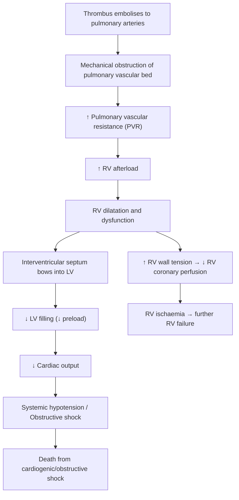
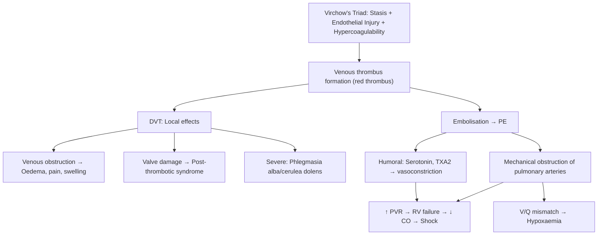

# Venous Thromboembolism (VTE)

## 1. Definition

Venous thromboembolism (VTE) is a single disease spectrum encompassing two clinical manifestations: **deep vein thrombosis (DVT)** and **pulmonary embolism (PE)** [1][2]. The name itself tells the story:

- **"Venous"** = occurring within veins (as opposed to arterial thrombosis)
- **"Thrombo-"** = blood clot (Greek: *thrombos* = lump/clot)
- **"Embolism"** = a clot that has broken off and travelled (Greek: *embolos* = stopper/plug)

So VTE describes the formation of a pathological blood clot within the venous system, which may remain in situ (DVT) or dislodge and travel to the pulmonary vasculature (PE).

***DVT and PE are two manifestations of the same disorder*** [1]. You should never think of them as separate diseases — a patient presenting with a swollen leg and a patient presenting with acute dyspnoea and pleuritic chest pain may both have VTE; the difference is simply where the clot currently sits.

<Callout title="Key Conceptual Point">
***Patients with PE usually die from right heart failure (cardiogenic shock / obstructive shock) rather than hypoxaemia*** [1]. Why? A massive PE obstructs the right ventricular outflow tract → acute rise in pulmonary vascular resistance → the thin-walled RV cannot overcome this → RV dilatation and failure → decreased LV filling → cardiovascular collapse. The hypoxaemia is the secondary problem; the haemodynamic catastrophe kills first.
</Callout>

### Subdivisions of DVT [1]

DVT of the lower extremity is subdivided into two categories based on anatomical location, because this determines clinical significance:

| Category | Veins Involved | Clinical Significance |
|---|---|---|
| **Proximal vein thrombosis** | Popliteal, femoral, iliac veins | Clinically more significant — **more commonly associated with PE** because these are large-calibre veins and thrombi are more likely to embolise |
| **Distal (calf) vein thrombosis** | Deep calf veins (anterior tibial, posterior tibial, peroneal, soleal, gastrocnemius veins) | Lower risk of PE, but ~20–30% can propagate proximally if untreated |

Why does proximal DVT cause more PE? Simply because the popliteal and femoral veins are large-diameter conduits — thrombi forming here are bigger, less constrained, and have a direct unobstructed path via the IVC to the right heart and pulmonary arteries.

---

## 2. Epidemiology

### Global Epidemiology

- VTE is the **third most common cardiovascular disease** globally (after MI and stroke)
- Annual incidence: approximately **1–2 per 1,000** person-years in the general population
- Incidence increases sharply with age: rare in children, rises exponentially after age 40, reaching ~5–6 per 1,000 per year in those > 80 years old
- DVT accounts for approximately two-thirds of VTE events; PE accounts for the remaining one-third
- Case fatality rate for PE is substantial: ~30% if untreated, reduced to ~2–8% with appropriate anticoagulation
- PE is a leading cause of **preventable hospital death**

### Hong Kong Context

- VTE was historically thought to be less common in Asian populations compared to Caucasians, but recent data show that the incidence is rising — likely due to increasing Westernisation of diet, obesity, ageing population, and greater awareness/diagnostic capability
- Hong Kong has high rates of hepatitis B-related hepatocellular carcinoma and other malignancies, which are significant VTE risk factors
- Hospitalised patients in HK remain under-prophylaxed compared to Western centres, meaning hospital-acquired VTE (HA-VTE) is an important preventable cause of morbidity and mortality
- Hong Kong Chinese have a **very low prevalence of Factor V Leiden** (virtually absent) and **Prothrombin G20210A mutation** — these are primarily Caucasian thrombophilias. Instead, Protein C, Protein S, and Antithrombin deficiencies are relatively more important inherited thrombophilias in the Chinese population

### Demographics

- **Sex**: Overall roughly equal, though some data suggest slightly higher incidence in males; however, women of childbearing age have additional risk factors (pregnancy, OCP use)
- **Age**: Strong age-dependent increase; median age at first VTE is ~60 years
- **Ethnicity**: Caucasians and African Americans have higher rates than Asians and Hispanics, though the gap is narrowing

---

## 3. Risk Factors

Understanding risk factors requires anchoring everything to **Virchow's triad** — the conceptual framework proposed by Rudolf Virchow in 1856 that explains why venous thrombosis occurs [1]:

### ***Virchow's Triad: Stasis + Endothelial Injury + Hypercoagulability*** [1]

Think of it this way: blood naturally wants to flow smoothly through intact vessels. For a clot to form pathologically, you need at least one (usually more) of these three conditions:

| Component | Mechanism | Examples [1] |
|---|---|---|
| ***Stasis*** | Sluggish blood flow allows activated clotting factors to accumulate locally rather than being diluted and cleared by hepatic clearance | Prolonged bed rest, air travel > 6 hours, CHF (low cardiac output), stroke/paralysis within 3 months, immobilisation (e.g. cast), prolonged surgery |
| ***Endothelial injury*** | Damage to the vessel wall exposes subendothelial collagen and tissue factor, triggering the coagulation cascade | Surgery, trauma, prior DVT, central venous catheter placement, IV drug use |
| ***Hypercoagulability*** | The blood itself has an increased tendency to clot — either inherited or acquired | See comprehensive list below |

<Callout title="Why does stasis cause thrombosis?" type="idea">
Normally, flowing blood dilutes activated clotting factors and sweeps them to the liver for clearance. Endothelial cells also release anticoagulant factors (thrombomodulin, tissue factor pathway inhibitor, heparan sulphate) only when flow is normal. When blood stagnates — e.g., in a bed-bound patient's calf veins behind venous valve pockets — local clotting factor concentrations rise, natural anticoagulant mechanisms fail, and the thrombus nucleates in the valve sinus.
</Callout>

### Comprehensive Risk Factor Classification

#### A. Acquired / Transient Risk Factors

**Surgical / Trauma-related:**
- Recent surgery (especially orthopaedic — hip/knee replacement, pelvic surgery) — combines stasis (immobilisation) + endothelial injury + inflammatory hypercoagulability
- Trauma to lower extremity (fracture, crush injury)
- Central venous catheter placement (endothelial injury)
- Spinal cord injury (paralysis → stasis)

**Medical:**
- ***Malignancy*** **(hypercoagulability)** [1] — this deserves special emphasis:
  - *Especially adenocarcinomas, which secrete mucin* that activates coagulation [1]
  - Myeloproliferative neoplasms (MPN) — polycythaemia vera, essential thrombocythaemia [1]
  - Gynaecological malignancy — can directly obstruct lower limb veins via pelvic mass effect [1]
  - Pancreatic cancer is notorious for VTE — ***Trousseau syndrome*** (migratory superficial thrombophlebitis as a paraneoplastic phenomenon) [3]
  - Any cancer increases VTE risk by 4–7 fold; chemotherapy increases it further
- Previous VTE (strongest clinical predictor of recurrence) [1]
- Stroke (immobility + hypercoagulability) [1]
- Heart failure (stasis from low cardiac output)
- Acute medical illness / hospitalisation
- Obesity (venous stasis + chronic inflammatory state + impaired fibrinolysis) [1]
- Nephrotic syndrome (urinary loss of antithrombin III → hypercoagulability) [1]

**Hormonal:**
- ***Pregnancy and postpartum*** [1] — Why? Pregnancy is an evolutionary "pro-coagulant" state to protect against postpartum haemorrhage:
  - ↑ Factors VII, VIII, X, fibrinogen, von Willebrand factor
  - ↓ Protein S (natural anticoagulant)
  - Mechanical compression of IVC and iliac veins by gravid uterus (stasis)
  - Risk is highest in the **postpartum period** (first 6 weeks) when these changes are maximal and immobility adds to the risk
- ***Oral contraceptive pills (OCP) / Hormone replacement therapy (HRT)*** [1]
  - Oestrogen increases hepatic synthesis of procoagulant factors and reduces antithrombin
  - Combined OCP increases VTE risk 3–4 fold
  - Third-generation progestogens (desogestrel, gestodene) have higher risk than second-generation (levonorgestrel)

**Immobilisation:**
- Prolonged hospitalisation or bed rest [1]
- Occupational immobilisation [1]
- Long-haul air travel ("economy class syndrome") — cabin pressure, dehydration, cramped seating [1]
- Lower limb cast / splint

#### B. Inherited (Heritable) Thrombophilias [1]

| Condition | Mechanism | Prevalence | VTE Risk Increase |
|---|---|---|---|
| **Factor V Leiden** (FVL) | Point mutation (Arg506Gln) renders Factor V ***resistant to inactivation by activated Protein C*** [1] | 5% of Caucasians; ***virtually absent in Chinese/HK population*** | 5–7× (heterozygous); 50–80× (homozygous) |
| **Prothrombin G20210A mutation** | Gain-of-function mutation → increased prothrombin levels | 2–3% Caucasians; ***very rare in Chinese*** | 2–3× |
| **Antithrombin III deficiency** | AT-III is the main inhibitor of thrombin and Factor Xa; deficiency → unchecked thrombin generation [1] | Rare (1 in 2,000–5,000) but **relatively more important in HK/Chinese** | 10–50× |
| **Protein C deficiency** | Protein C (activated by thrombin-thrombomodulin complex) inactivates Factors Va and VIIIa; deficiency → unopposed coagulation [1] | 1 in 200–500 | 7–10× |
| **Protein S deficiency** | Protein S is a cofactor for activated Protein C; deficiency impairs APC function [1] | 1 in 500 | 5–10× |

<Callout title="Hong Kong Exam Pearl" type="error">
Do NOT reflexively answer "Factor V Leiden" when asked about inherited thrombophilia in a Hong Kong patient. FVL is a Caucasian mutation. In the Chinese population, think of **Antithrombin III, Protein C, and Protein S deficiencies** as the more relevant inherited thrombophilias.
</Callout>

#### C. Other Acquired Hypercoagulable States

- ***Antiphospholipid syndrome (APS)*** [1] — autoantibodies (lupus anticoagulant, anticardiolipin, anti-β2-glycoprotein I) paradoxically cause *thrombosis* despite prolonging aPTT in vitro. Mechanism: antibodies activate endothelial cells, platelets, and complement → prothrombotic state
- ***Paroxysmal nocturnal haemoglobinuria (PNH)*** [1] — acquired clonal disorder of GPI-anchored proteins → complement-mediated haemolysis + thrombosis (especially hepatic/cerebral veins). Thrombosis is the leading cause of death in PNH
- ***Hyperhomocysteinaemia*** [1] — elevated homocysteine damages endothelium and promotes coagulation
- ***Heparin-induced thrombocytopenia (HIT)*** [1] — autoantibody against platelet factor 4 (PF4) complexed with heparin → paradoxical platelet activation → arterial AND venous thrombosis despite low platelet count
- ***Myeloproliferative neoplasms*** — polycythaemia vera, essential thrombocythaemia [1]
- Sickle cell disease [1]
- ***Nephrotic syndrome*** — urinary loss of antithrombin III [1]
- ***Cerebral venous thrombosis*** — specifically associated with pregnancy and OCP use [4]

<Callout title="Virchow's Triad Mnemonic: 'SHE'" type="idea">
**S**tasis, **H**ypercoagulability, **E**ndothelial injury — "SHE" helps you remember Virchow's triad. In the exam, when asked about risk factors for VTE, systematically classify them under these three headings.
</Callout>

---

## 4. Anatomy and Physiology of the Venous System

Understanding VTE requires understanding the venous drainage of the lower limb, because this is where the vast majority of DVT originates.

### Lower Limb Venous Anatomy

The lower limb venous system has three components [2]:

**A. Deep Veins (where DVT occurs)**
These run alongside the arteries within the deep fascial compartment:
- **Calf veins** (distal): Anterior tibial, posterior tibial, peroneal (fibular) veins; also intramuscular soleal and gastrocnemius veins (sinusoidal veins within calf muscles — these are where many DVTs originate because blood pools here during immobility)
- **Popliteal vein**: formed by confluence of tibial veins behind the knee
- **Femoral vein** (previously called "superficial femoral vein" — a misnomer that led to clinical errors; it IS a deep vein)
- **Common femoral vein**: formed by junction of femoral vein and deep femoral (profunda femoris) vein
- **External iliac vein** → **Common iliac vein** → **IVC**

**B. Superficial Veins**
- **Great saphenous vein (GSV)**: longest vein in the body; runs from medial malleolus → medial leg → medial thigh → joins common femoral vein at the saphenofemoral junction (SFJ) in the groin
- **Small saphenous vein (SSV)**: runs from lateral malleolus → posterior calf → pierces deep fascia to join popliteal vein at the saphenopopliteal junction (SPJ) [2]

**C. Perforator (Communicating) Veins**
- Connect superficial to deep system
- Contain **one-way valves** ensuring unidirectional flow from superficial → deep [2]

### Physiology of Venous Return [2]

The venous return from the lower limbs depends on several mechanisms:

1. **Calf muscle pump** (the "peripheral heart") — the **major mechanism** [2]:
   - Contraction of calf muscles (especially soleus and gastrocnemius) compresses the deep veins and intramuscular venous sinuses
   - Squeezes blood proximally into the popliteal vein and towards the heart
   - During relaxation, the one-way valves prevent backflow, and blood is drawn from superficial into deep veins via perforators

2. **Venous valves**: Bicuspid valves throughout the deep, superficial, and perforator veins ensure **unidirectional flow** towards the heart [2]

3. **Respiratory pump**: Negative intrathoracic pressure during inspiration creates a pressure gradient that draws venous blood from the abdomen into the thorax

4. **Cardiac suction**: Right atrial relaxation during diastole creates a further "suctioning" effect

<Callout title="Why do DVTs form in calf vein sinuses?">
The soleal sinuses are large-capacity, thin-walled venous reservoirs within the calf muscles. During immobility, these sinuses become stagnant pools of blood — the perfect environment for thrombus formation in the valve cusps, where flow is slowest. This is why early mobilisation and calf muscle contraction (compression devices) are so effective at preventing DVT.
</Callout>

### Relevant Anatomy for PE

Once a thrombus dislodges from the deep veins, its path is:
- Deep leg veins → IVC → Right atrium → Right ventricle → Pulmonary arteries

The embolus lodges where the vessel diameter narrows sufficiently. A **saddle embolus** straddles the main pulmonary artery bifurcation — this is the most catastrophic form, causing bilateral pulmonary outflow obstruction.

### May-Thurner Syndrome (Iliac Vein Compression Syndrome)

A special anatomical consideration relevant in HK exams: the **left common iliac vein** is compressed by the overlying **right common iliac artery** against the lumbar vertebral body [3]. This explains why:
- **Left-sided DVT is more common than right-sided** (approximately 60:40 ratio)
- Young women presenting with unprovoked left iliofemoral DVT should be evaluated for May-Thurner syndrome

---

## 5. Pathophysiology

### 5.1 Thrombus Formation

The fundamental event in VTE is the formation of a **red thrombus** (as opposed to the "white" platelet-rich thrombus of arterial disease). Why?

- Arterial thrombi form under **high shear stress** → platelets are the main component (hence antiplatelet therapy)
- Venous thrombi form under **low shear / stasis** → the coagulation cascade dominates → fibrin and trapped red blood cells form the bulk of the clot (hence anticoagulant therapy)

**Step-by-step pathogenesis:**

1. **Stasis in valve sinuses** → local hypoxia of endothelium → endothelial activation
2. Activated endothelium expresses **tissue factor (TF)** and **P-selectin** → recruits monocytes and platelets
3. Tissue factor activates the **extrinsic coagulation pathway** → Factor VII → Factor X → prothrombin to thrombin
4. **Thrombin** converts fibrinogen → fibrin mesh → traps red blood cells → "red thrombus"
5. Thrombus propagates along the direction of flow (proximally in a leg vein)
6. If the thrombus becomes large or fragile, a piece may **break off → embolise → PE**

### 5.2 Pathophysiology of DVT

The consequences of deep vein thrombus are:

**Acute effects:**
- Venous obstruction → ↑ venous pressure distally → limb oedema, pain, swelling
- Inflammation of the vein wall → tenderness, warmth, erythema
- If massive (involving entire iliofemoral system):
  - **Phlegmasia alba dolens** ("painful white leg"): massive DVT → limb oedema so severe it compresses arterial inflow → pale, swollen, painful leg
  - **Phlegmasia cerulea dolens** ("painful blue leg"): even more severe → venous gangrene → cyanotic, massively swollen limb → can progress to limb loss and shock

**Chronic effects (Post-thrombotic syndrome — PTS):**
- Thrombus damages the delicate venous valves → chronic valvular incompetence → chronic venous hypertension
- Manifests as: chronic leg swelling, pain, skin changes (hyperpigmentation, lipodermatosclerosis), and venous ulceration
- Occurs in 20–50% of patients after proximal DVT

### 5.3 Pathophysiology of Pulmonary Embolism

When a thrombus embolises to the pulmonary vasculature, the consequences depend on the **size of the embolus** and the **patient's cardiopulmonary reserve**:

**Haemodynamic Effects (the primary killer):**

This cascade explains why ***PE kills through right heart failure, not hypoxaemia*** [1].

**Respiratory Effects (secondary):**
- **V/Q mismatch**: Areas of lung are ventilated but not perfused (dead space) → hypoxaemia
- **Atelectasis**: Loss of surfactant in non-perfused lung segments → alveolar collapse
- **Reflex bronchoconstriction**: Local release of serotonin and thromboxane
- **Pulmonary infarction**: Occurs in only ~10% (because the lung has dual blood supply — bronchial and pulmonary arteries). More common in patients with pre-existing cardiac disease where bronchial artery flow is insufficient
- **Pleuritic chest pain**: From inflammation of the visceral pleura overlying an infarct

**Humoral Effects:**
- Platelets within the thrombus release **serotonin** and **thromboxane A2** → additional pulmonary vasoconstriction beyond the mechanical obstruction alone
- This explains why even "small" PEs can cause disproportionate haemodynamic compromise

### 5.4 Classification of PE by Haemodynamic Severity

| Category | Definition | Mechanism |
|---|---|---|
| **Massive PE** | PE with sustained hypotension (SBP < 90 for ≥ 15 min), pulselessness, or requiring vasopressors | > 50% of pulmonary vascular bed obstructed → acute RV failure → obstructive shock |
| **Submassive PE** | PE with RV dysfunction (on echo or CT) or elevated cardiac biomarkers (troponin, BNP) BUT **haemodynamically stable** | Significant obstruction with compensated RV — on the verge of decompensation |
| **Low-risk PE** | Haemodynamically stable, no RV dysfunction, normal biomarkers | Small peripheral emboli; the RV can cope |

<Callout title="Exam Pearl: RV Failure in PE">
The right ventricle is a thin-walled, compliant chamber designed for a low-pressure system. It can tolerate volume overload but NOT acute pressure overload. A previously normal RV cannot generate a mean pulmonary artery pressure > 40 mmHg acutely. If mean PA pressure is higher than this in acute PE, suspect chronic thromboembolic disease with superimposed acute PE (the RV has had time to hypertrophy).
</Callout>

---

## 6. Etiology — Specific Causes of VTE (Focus on Hong Kong)

### Hospital-Acquired VTE (HA-VTE)
- Up to **60% of all VTE** is hospital-associated
- Post-surgical VTE: highest risk after **orthopaedic surgery** (hip/knee replacement — up to 40–60% incidence without prophylaxis), **major abdominal/pelvic surgery**, and **neurosurgery**
- Medical inpatients: immobilisation, acute illness, central lines

### Cancer-Associated Thrombosis (CAT) [1][3]
- Extremely common in HK given high prevalence of:
  - **Hepatocellular carcinoma** (HBV-related) — portal vein thrombosis is common
  - **Lung cancer** — high smoking rates, particularly in older males
  - **Nasopharyngeal carcinoma** (NPC) — endemic in Southern Chinese
  - **Gastric and colorectal cancer**
- ***Adenocarcinomas are particularly thrombogenic — mucin activates coagulation*** [1]
- ***Trousseau syndrome***: migratory superficial thrombophlebitis as paraneoplastic phenomenon, classically associated with **pancreatic adenocarcinoma** [3]
- Chemotherapy, hormonal therapy, and central lines further increase risk

### Pregnancy-Related VTE
- 5–10× increased risk compared to non-pregnant women of same age
- Risk persists for 6–12 weeks postpartum
- Left leg predominance (gravid uterus compresses left iliac vein)

### Travel-Related VTE
- Long-haul flights > 4–6 hours
- Economy class syndrome — prolonged immobility in cramped seating
- Risk is synergistic with other factors (obesity, OCP, thrombophilia)

### Cerebral Venous Thrombosis [4]
- A special form of VTE affecting cerebral venous sinuses
- ***Epidemiology: F > M — pregnancy, use of COC*** [4]
- ***Accounts for ~1% of all strokes*** [4]
- Clinical features: raised ICP (headache, papilloedema, decreased GCS), seizures, focal neurological deficits

---

## 7. Classification Systems

### 7.1 Anatomical Classification of DVT

| Classification | Description |
|---|---|
| **Proximal DVT** | Popliteal vein and above (femoral, iliac veins) — higher risk of PE |
| **Distal DVT** | Calf veins (below popliteal) — lower risk but can propagate |
| **Upper extremity DVT** | Subclavian, axillary, brachial veins — increasingly common with central lines and PICC lines (Paget-Schroetter syndrome in effort-related) |
| **Unusual site DVT** | Cerebral venous sinuses, splanchnic veins (portal, mesenteric, hepatic), renal veins — think of PNH, MPN, APS, cirrhosis |

### 7.2 Classification of PE by Timing

| Type | Description |
|---|---|
| **Acute PE** | New thrombus in pulmonary vasculature; the focus of clinical management |
| **Chronic thromboembolic pulmonary hypertension (CTEPH)** | Incomplete resolution of PE → organised fibrotic thrombus → progressive pulmonary hypertension; occurs in 2–4% of acute PE survivors |

### 7.3 Provoked vs. Unprovoked VTE

This classification is clinically crucial because it determines **duration of anticoagulation**:

| Type | Definition | Examples | Implication |
|---|---|---|---|
| **Provoked (transient risk factor)** | VTE occurring in the context of a major identifiable transient risk factor | Surgery, trauma, immobilisation, pregnancy, OCP | Lower recurrence risk; shorter anticoagulation (3 months) may suffice |
| **Unprovoked (idiopathic)** | VTE occurring without an identifiable transient risk factor | No clear trigger | Higher recurrence risk (~10% per year after stopping anticoagulation); consider extended/indefinite anticoagulation |
| **Cancer-associated** | VTE in context of active malignancy | Any active cancer | Very high recurrence; anticoagulation continued as long as cancer is active |

<Callout title="Important Clinical Point">
An **unprovoked VTE** in a patient > 40 years should prompt consideration of occult malignancy screening. ***Malignancy screening is recommended as malignancy is a risk factor for development of DVT*** [1]. The yield of extensive screening is debated, but minimum workup includes: thorough history/examination, basic bloods (CBC, LFT, calcium), CXR, and age-appropriate cancer screening (e.g., colonoscopy, CT abdomen/pelvis).
</Callout>

### 7.4 CEAP Classification (for Chronic Venous Disease)

While primarily used for varicose veins and chronic venous insufficiency, it is relevant as DVT can lead to post-thrombotic syndrome:

- **C0**: No visible or palpable signs
- **C1**: Telangiectasia or reticular veins
- **C2**: Varicose veins
- **C3**: Oedema
- **C4a**: Pigmentation or eczema
- **C4b**: Lipodermatosclerosis or atrophie blanche
- **C5**: Healed venous ulcer
- **C6**: Active venous ulcer

---

## 8. Clinical Features

### 8.1 Deep Vein Thrombosis — Symptoms

| Symptom | Pathophysiological Basis |
|---|---|
| **Leg pain** (usually calf or thigh, unilateral) | Thrombus causes venous obstruction → distension of the vein wall → activation of nociceptors in the vein wall and surrounding tissue; inflammatory mediators (bradykinin, prostaglandins) from the thrombus contribute |
| **Leg swelling** (unilateral oedema — the key feature) | Venous obstruction → ↑ hydrostatic pressure proximal to thrombus → transcapillary fluid filtration into the interstitium (Starling forces) |
| **Warmth** of affected limb | Inflammatory response to the thrombus → local vasodilatation of the skin microvasculature |
| **Skin discolouration** (erythema or cyanosis) | Erythema from inflammation; cyanosis from venous congestion and deoxygenation of stagnant blood |
| **Sensation of heaviness or tightness** | Increased tissue pressure from oedema compressing sensory nerve endings |
| **Asymptomatic** (up to ***60–80% are clinically silent*** [5]) | Small, non-occlusive thrombi may not obstruct flow sufficiently to cause symptoms |

<Callout title="Exam Pearl" type="error">
DVT is **clinically silent in the majority of cases**. ***60–80% of DVTs are clinically silent*** [5]. That is why prophylaxis is so important — you cannot rely on clinical detection alone.
</Callout>

### 8.2 Deep Vein Thrombosis — Signs

| Sign | Pathophysiological Basis |
|---|---|
| **Unilateral leg oedema** (> 2 cm circumference difference between legs) | Venous obstruction → hydrostatic back-pressure → oedema. Measuring calf circumference 10 cm below the tibial tuberosity is the standard technique |
| **Calf tenderness** on palpation | Inflammation of the thrombosed vein and surrounding tissue |
| **Homan's sign** (calf pain on passive dorsiflexion of foot) | Stretching of the inflamed posterior tibial veins — **sensitivity only ~30%, specificity ~50%; not reliable** and no longer recommended as a diagnostic test |
| **Pitting oedema** | Increased interstitial fluid from venous hypertension |
| **Dilated superficial veins** | Collateral venous drainage develops to bypass the obstructed deep vein |
| **Low-grade fever** | Systemic inflammatory response to thrombosis (release of IL-6, TNF-α) |
| **Palpable cord** (thrombosed vein felt as a firm, tender cord) | The thrombosed vein itself — less commonly palpable in deep veins compared to superficial thrombophlebitis |

**Severe DVT presentations:**

| Condition | Description | Mechanism |
|---|---|---|
| **Phlegmasia alba dolens** ("milk leg") | Massive iliofemoral DVT → painful, white, swollen leg | Severe venous obstruction → massive oedema → interstitial pressure rises → compromises arterial inflow → pale leg |
| **Phlegmasia cerulea dolens** ("blue leg") | Progression of above → cyanotic, massively swollen, exquisitely painful leg → venous gangrene | Near-total venous occlusion → arterial inflow completely compromised → tissue ischaemia → can progress to compartment syndrome and limb loss |

### 8.3 Pulmonary Embolism — Symptoms

| Symptom | Pathophysiological Basis |
|---|---|
| **Acute dyspnoea** (most common symptom, ~80%) | V/Q mismatch → hypoxaemia → stimulates peripheral chemoreceptors → ↑ respiratory drive; also reflex hyperventilation from irritant receptors in the pulmonary vasculature |
| **Pleuritic chest pain** (~50%) | Pulmonary infarction → inflammation of visceral and parietal pleura → sharp pain worsened by inspiration |
| **Cough** | Irritation of airways from pulmonary infarction/atelectasis, or bronchospasm from serotonin/thromboxane release |
| **Haemoptysis** (~15%) [1] | Pulmonary infarction → necrosis of lung parenchyma → bleeding into airways |
| **Syncope / Pre-syncope** | Massive PE → acute ↓ cardiac output → cerebral hypoperfusion |
| **Chest pressure / substernal pain** | RV ischaemia from acute pressure overload → angina-like pain (RV demand ischaemia) |
| **Anxiety / sense of impending doom** | Hypoxaemia + sympathetic activation |
| **Leg symptoms** (swelling, pain) | Concurrent DVT — present in ~30–50% of PE cases |

### 8.4 Pulmonary Embolism — Signs [1]

**Vital Signs:**
| Sign | Pathophysiological Basis |
|---|---|
| ***Sinus tachycardia*** (most common sign) [1] | Compensatory sympathetic activation to maintain cardiac output in face of reduced stroke volume; also driven by hypoxaemia and pain |
| ***Tachypnoea*** (> 70% of patients) [1] | Hypoxaemia → chemoreceptor stimulation + V/Q mismatch → increased respiratory rate |
| ***Hypotension*** (in massive PE) [1] | Obstructive shock — RV failure → ↓ LV filling → ↓ cardiac output → systemic hypotension |
| ***Fever*** [1] | Pulmonary infarction → inflammatory response; also consider superimposed infection |
| **Cyanosis** [1] | Severe hypoxaemia from V/Q mismatch and reduced cardiac output |

<Callout title="The First Sign of Post-operative PE">
***The first sign of PE is often unexplained tachycardia*** [5]. In a post-surgical patient, if the heart rate creeps up without an obvious cause (no fever, no bleeding, no pain), think PE. Don't wait for desaturation or chest pain.
</Callout>

**Respiratory Examination [1]:**
- **Tachypnoea**
- **Pleural friction rub**: Heard when pleural inflammation from pulmonary infarction causes roughened pleural surfaces to rub together
- **Crepitations (crackles)**: From atelectasis or pulmonary infarction
- **Decreased breath sounds**: Over area of pleural effusion (bloody effusion from infarction)
- **Wheeze**: From reflex bronchospasm (serotonin and thromboxane release)

**Cardiovascular Examination [1]:**
| Sign | Pathophysiological Basis |
|---|---|
| ***Elevated JVP*** [1] | RV failure → ↑ right atrial pressure → transmitted back to jugular veins |
| ***Right-sided S3 (gallop)*** [1] | Rapid filling of a dilated, failing RV in early diastole |
| ***Loud P2 (pulmonic component of S2)*** | ↑ Pulmonary artery pressure → forceful closure of the pulmonic valve |
| ***Graham Steell murmur*** [1] | Pulmonary regurgitation murmur — high-pitched early diastolic murmur at the left sternal edge; caused by dilatation of the pulmonary valve ring from severe pulmonary hypertension |
| **Parasternal heave** | RV hypertrophy/dilatation → palpable lift at the left sternal border |
| ***Right ventricular S4*** | Forceful atrial contraction against a stiff, failing RV |
| **Tricuspid regurgitation murmur** | RV dilatation → tricuspid annular dilatation → functional TR (pansystolic murmur at left lower sternal edge, louder with inspiration — Carvallo's sign) |

### 8.5 Special Presentations

**Massive PE with Cardiac Arrest:**
- **Pulseless electrical activity (PEA)** is the most common cardiac arrest rhythm in massive PE
- If PE is suspected during cardiac arrest, consider thrombolysis (alteplase) during CPR — this is one of the rare situations where thrombolysis can be given during active resuscitation

**Fat Embolism Syndrome:**
- Not technically VTE, but worth distinguishing: occurs 24–72 hours after long bone fractures
- Triad: respiratory distress + neurological changes + petechial rash
- Different pathophysiology: fat globules embolise and cause endothelial injury + inflammatory response

**Air Embolism:**
- Rare; occurs with central line insertion/removal, neurosurgery in sitting position
- Requires > 3–5 mL/kg of air to be lethal
- Creates an "air lock" in the RV

---

## 9. Pathophysiology of Key Clinical Findings — Connecting the Dots

Let's explicitly connect every key finding to its mechanism, as this is what distinguishes a good exam answer:

| Clinical Finding | Why Does It Occur? |
|---|---|
| Unilateral leg swelling in DVT | Venous obstruction raises hydrostatic pressure → Starling forces push fluid into interstitium → oedema. Unilateral because DVT is almost always asymmetric |
| Dyspnoea in PE | V/Q mismatch (ventilated but unperfused lung segments = dead space) → hypoxaemia → chemoreceptor stimulation → hyperventilation |
| Pleuritic chest pain in PE | Pulmonary infarction (only ~10% of PE because of dual blood supply) → pleural inflammation → pain on inspiration |
| Tachycardia in PE | (a) Sympathetic compensation for ↓ CO; (b) Hypoxaemia; (c) Pain and anxiety |
| Elevated JVP in PE | RV failure → ↑ RA pressure → transmitted to jugular veins |
| Hypotension in massive PE | > 50% vascular bed obstructed → acute RV failure → ↓ LV filling → ↓ CO → shock |
| Graham Steell murmur | Severe pulmonary hypertension → pulmonary valve ring dilatation → pulmonary regurgitation |
| Post-thrombotic syndrome after DVT | Thrombus damages valves → valvular incompetence → chronic venous hypertension → oedema, skin changes, ulceration |

---

## 10. Summary of Key Pathophysiological Mechanisms

---

<Callout title="High Yield Summary">

1. **VTE = DVT + PE** — same disease, different manifestations [1]
2. **Virchow's Triad** (Stasis, Endothelial injury, Hypercoagulability) is the foundational framework for all VTE risk factors [1]
3. **PE kills through RV failure / obstructive shock**, not hypoxaemia [1]
4. **Proximal DVT** (popliteal and above) is much more likely to cause PE than distal DVT [1]
5. **60–80% of DVTs are clinically silent** — prophylaxis is key [5]
6. **Unexplained tachycardia** may be the first sign of PE post-operatively [5]
7. In **Hong Kong/Chinese patients**, Factor V Leiden is virtually absent — think AT-III, Protein C, Protein S deficiency for inherited thrombophilia
8. **Adenocarcinomas** (especially pancreatic — Trousseau syndrome) are highly thrombogenic due to mucin secretion [1][3]
9. **Unprovoked VTE** warrants occult malignancy screening [1]
10. **Warfarin must NOT be started alone** — it has a transient procoagulant effect (depletes Protein C and S before factors II, IX, X); always overlap with heparin for ≥ 5 days [1]
11. **Cerebral venous thrombosis** is more common in women (pregnancy, OCP) and accounts for ~1% of strokes [4]
12. **Post-thrombotic syndrome** occurs in 20–50% after proximal DVT due to valve destruction

</Callout>

---

<ActiveRecallQuiz
  title="Active Recall - VTE Definition, Epidemiology, Risk Factors, Anatomy, Pathophysiology & Clinical Features"
  items={[
    {
      question: "Name the three components of Virchow's triad and give two clinical examples for each.",
      markscheme: "Stasis (bed rest, air travel, CHF, stroke, immobilisation). Endothelial injury (surgery, trauma, prior DVT, central catheter). Hypercoagulability (malignancy, pregnancy, OCP, thrombophilia, APS, nephrotic syndrome).",
    },
    {
      question: "Why does massive PE cause death through obstructive shock rather than hypoxaemia? Describe the haemodynamic cascade.",
      markscheme: "Massive PE obstructs >50% pulmonary vascular bed. Increased PVR causes acute RV pressure overload. The thin-walled RV cannot cope, so it dilates and fails. Interventricular septum bows into LV, reducing LV filling. Decreased cardiac output leads to systemic hypotension and obstructive shock. RV coronary perfusion falls, worsening RV ischaemia. Death is from cardiovascular collapse, not primarily from hypoxaemia.",
    },
    {
      question: "A 35-year-old Hong Kong Chinese woman presents with unprovoked left iliofemoral DVT. What inherited thrombophilias should you consider, and why is Factor V Leiden less relevant?",
      markscheme: "Consider Antithrombin III deficiency, Protein C deficiency, Protein S deficiency, Antiphospholipid syndrome. Factor V Leiden is virtually absent in the Chinese population (it is a Caucasian mutation, 5% prevalence in Europeans but nearly 0% in East Asians). Also consider May-Thurner syndrome given left-sided iliofemoral DVT in a young woman.",
    },
    {
      question: "What is the first sign of PE in a post-operative patient, and why?",
      markscheme: "Unexplained sinus tachycardia. PE causes reduced cardiac output (from RV failure and obstruction), hypoxaemia, and sympathetic activation, all of which increase heart rate. Tachycardia may precede desaturation, chest pain, or dyspnoea. 60-80% of post-operative DVTs and PEs are clinically silent.",
    },
    {
      question: "Explain why warfarin must NOT be initiated as monotherapy in acute VTE. What is the bridging strategy?",
      markscheme: "Warfarin inhibits vitamin K-dependent carboxylation of factors II, VII, IX, X and also anticoagulant proteins C and S. Protein C and S have shorter half-lives (6-8h and 24h respectively) than the procoagulant factors (factor II half-life approx 60h). So in the first 1-2 days, warfarin causes a transient hypercoagulable state by depleting natural anticoagulants before adequately reducing procoagulant factors. Bridge with heparin (UFH or LMWH) for at least 5 days and until INR is 2.0 or above for at least 24 hours (two consecutive days).",
    },
    {
      question: "Distinguish between phlegmasia alba dolens and phlegmasia cerulea dolens in terms of pathophysiology and clinical appearance.",
      markscheme: "Phlegmasia alba dolens (painful white leg): massive iliofemoral DVT causes severe venous obstruction and limb oedema. The raised interstitial pressure compresses arterial inflow, resulting in a pale, swollen, painful leg. Phlegmasia cerulea dolens (painful blue leg): progression with near-total venous occlusion. Arterial inflow is severely compromised, causing tissue ischaemia and cyanosis. The limb becomes massively swollen, cyanotic, and exquisitely painful. Can progress to venous gangrene, compartment syndrome, and limb loss.",
    },
  ]}
/>

## References

[1] Senior notes: felixlai.md (DVT and PE section, pages 962–970)
[2] Senior notes: felixlai.md (Venous anatomy and chronic venous insufficiency section, pages 943–950)
[3] Senior notes: maxim.md (Pancreatic carcinoma section, page 146; Varicose veins section)
[4] Senior notes: maxim.md (Cerebral venous thrombosis section, page 764)
[5] Senior notes: maxim.md (Post-operative fever / DVT-PE section)
