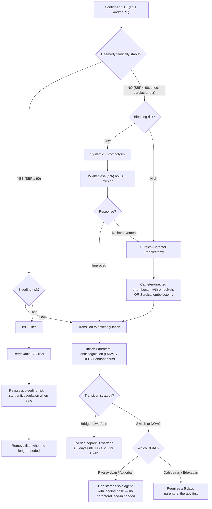

## Management of Venous Thromboembolism

The management of VTE follows a logical sequence that mirrors the pathophysiology: (1) prevent the clot from growing, (2) prevent embolisation, (3) allow the body's fibrinolytic system to dissolve the clot, (4) in severe cases, actively remove or dissolve the clot, and (5) prevent recurrence. Every treatment decision is driven by two key variables: **haemodynamic stability** and **bleeding risk**.

---

## 1. Treatment Objectives [1]

Before diving into specific therapies, understand what we are trying to achieve:

- ***Prevent further clot extension*** [1] — anticoagulation stops the thrombus from propagating
- ***Prevention of acute pulmonary embolism*** [1] — the most feared immediate complication of DVT
- ***Reduce risk of recurrent thrombosis*** [1] — VTE is a recurrent disease
- ***Treatment of massive ilio-femoral thrombosis with acute lower limb ischaemia or venous gangrene*** [1] — phlegmasia cerulea dolens requires aggressive intervention
- ***Limiting development of late complications*** [1]:
  - Post-thrombotic syndrome
  - Chronic venous insufficiency
  - Chronic thromboembolic pulmonary hypertension (CTEPH)

---

## 2. Treatment Decision Framework [1]

The treatment approach is determined by a 2×2 matrix of **haemodynamic stability** and **bleeding risk** [1]:

| ***Haemodynamic Stability*** | ***Bleeding Risk*** | ***Treatment Modality*** [1] |
|---|---|---|
| ***Stable*** | ***Low*** | ***Anticoagulation*** |
| ***Stable*** | ***High*** | ***IVC filter*** |
| ***Unstable*** | ***Low*** | ***Thrombolysis*** |
| ***Unstable*** | ***High*** | ***Embolectomy*** |

This table is the single most important framework for VTE management. Let's reason through it:
- **Stable + Low bleeding risk**: The standard situation — anticoagulation alone is sufficient because the patient is not in immediate danger. The body's own fibrinolytic system will gradually dissolve the clot; anticoagulation prevents propagation.
- **Stable + High bleeding risk**: Cannot anticoagulate safely → place an IVC filter as a mechanical barrier to prevent PE while the bleeding risk resolves.
- **Unstable + Low bleeding risk**: The patient is in shock from massive PE → need to actively destroy the clot NOW → systemic thrombolysis.
- **Unstable + High bleeding risk**: Cannot give thrombolytics (too much bleeding risk) → surgical or catheter-based embolectomy is the only option.

---

## 3. Management Algorithm

---

## 4. Medical Treatment — Anticoagulation

Anticoagulation is the backbone of VTE treatment. It does NOT dissolve the existing clot — rather, it prevents the clot from growing while the body's intrinsic fibrinolytic system (plasmin) gradually breaks it down. Think of it as "holding the line" while the body does the cleanup.

### 4A. Initial Parenteral Anticoagulation

***Treatment approach: Parenteral therapy (UFH/LMWH/Fondaparinux) bridged to warfarin OR parenteral therapy bridged to NOAC*** [1].

#### Low-Molecular-Weight Heparin (LMWH) [1]

**Mechanism:** LMWH binds to antithrombin III and accelerates its inhibition of **Factor Xa** (and to a lesser extent, thrombin/Factor IIa). The "low molecular weight" means it preferentially inhibits Factor Xa over thrombin compared to UFH.

| Feature | Details [1] |
|---|---|
| Duration | ***Continued for ≥ 5 days*** [1] |
| Preference | ***Preferred over UFH, especially in cancer patients since it can decrease recurrence and mortality compared with UFH and warfarin*** [1] |
| Examples and dosing [1] | ***SC Enoxaparin 1 mg/kg BID*** or ***SC Dalteparin 200 IU/kg QD*** [1] |
| Monitoring | Generally does NOT require lab monitoring (predictable dose-response); check anti-Xa levels in renal impairment, obesity, or pregnancy |
| Renal clearance | Renally cleared → dose adjustment needed if CrCl < 30 mL/min |

**Advantages of LMWH over UFH** [1]:
- ***Greater bioavailability*** [1]
- ***Longer duration of anticoagulant effect → fewer daily injections*** [1]
- ***Better dose-response correlation → fixed-dose administration without lab monitoring*** [1]
- ***Extensive clinical experience with subcutaneous administration*** [1]
- ***Lower risk of HIT*** [1] — Why? LMWH has less affinity for platelet factor 4 (PF4) → less formation of the HIT antibody complex
- ***Lower risk of osteoporosis*** [1] — long-term heparin use can cause osteoporosis; LMWH has less osteoclast activation than UFH

#### Unfractionated Heparin (UFH) [1]

**Mechanism:** UFH binds to antithrombin III and accelerates its inhibition of **both thrombin (IIa) and Factor Xa** equally (1:1 ratio). It is a heterogeneous mixture of polysaccharide chains of varying molecular weights.

| Feature | Details [1] |
|---|---|
| Duration | ***Continued for ≥ 5 days*** [1] |
| Dosing [1] | ***IV UFH 80 U/kg bolus → 18 U/kg/hr and titrate to aPTT 1.5–2.5× normal*** [1] |
| Monitoring | ***Dose should be sufficient to prolong aPTT to 1.5–2.5× the mean of control value or upper limit of normal aPTT range*** [1] |

**Advantages of UFH over LMWH** [1]:
- ***Faster onset of action with intravenous administration*** [1] — important in acute, unstable situations
- ***Easier to stop therapy due to shorter half-life (60–90 min)*** [1] — critical if the patient develops bleeding or needs emergency surgery
- ***Easier to inactivate with protamine sulphate*** [1] — protamine is a specific antidote that neutralises UFH; it only partially reverses LMWH (~60% of anti-Xa activity)

**When to prefer UFH over LMWH** [1]:
- ***When contemplating thrombolysis or catheter-based treatment*** [1] — need to be able to stop anticoagulation quickly
- ***Renal failure (CrCl < 25)*** [1] — UFH is cleared by the reticuloendothelial system, NOT the kidneys
- ***Extreme obesity*** [1] — unpredictable LMWH pharmacokinetics
- ***Haemodynamic instability*** [1] — may need to switch to thrombolysis; UFH's short half-life allows rapid transition
- ***High bleeding risk*** [1] — can be reversed quickly with protamine

#### Fondaparinux [1]

**Mechanism:** A synthetic pentasaccharide that selectively inhibits **Factor Xa** via antithrombin III. It has no direct thrombin inhibition.

| Feature | Details [1] |
|---|---|
| Duration | ***Continued for ≥ 5 days*** [1] |
| Dosing [1] | ***SC Fondaparinux 5–10 mg QD*** [1] (weight-based: 5 mg if < 50 kg, 7.5 mg if 50–100 kg, 10 mg if > 100 kg) |
| Note [1] | ***Oral anticoagulants with vitamin K antagonist should be overlapped for ≥ 4–5 days*** [1] |

**Advantages:**
- Zero risk of HIT — fondaparinux does not bind PF4 at all. This makes it the agent of choice in patients with **confirmed or suspected HIT**
- Once-daily subcutaneous dosing, no monitoring required

**Limitations:**
- No specific antidote (protamine does NOT reverse fondaparinux)
- Renally cleared — contraindicated if CrCl < 30 mL/min
- Long half-life (~17 hours) — harder to reverse if bleeding occurs

<Callout title="HIT and Fondaparinux" type="idea">
If a patient on heparin develops thrombocytopenia (platelet drop > 50%) and/or new thrombosis at day 5–10, suspect **heparin-induced thrombocytopenia (HIT)**. Immediately stop ALL heparin products (including LMWH — there is ~5% cross-reactivity). Switch to a non-heparin anticoagulant: **fondaparinux** (most commonly used in HK), argatroban (direct thrombin inhibitor, useful in renal failure), or bivalirudin.
</Callout>

### 4B. Transition to Oral Anticoagulation

#### Warfarin (Vitamin K Antagonist) [1]

**Mechanism:** Warfarin inhibits **vitamin K epoxide reductase** → prevents the regeneration of reduced vitamin K → impairs the **gamma-carboxylation** of vitamin K-dependent clotting factors (II, VII, IX, X) AND the natural anticoagulant proteins (Protein C and Protein S).

The critical teaching point about warfarin:

***Warfarin is NOT initiated as monotherapy during acute thrombotic illness due to a paradoxical exacerbation of hypercoagulability which increases likelihood of thrombosis*** [1].

Why does this paradox occur? [1]:
- ***Warfarin inhibits vitamin K-dependent gamma carboxylation of the anticoagulant factors Protein S and Protein C, which inhibit activated factors VIII and V*** [1]
- ***Warfarin has a transient procoagulant effect during the first 1–2 days of use*** [1]
- Protein C has a very short half-life (~6–8 hours) — it falls FIRST
- The procoagulant factors (especially Factor II, half-life ~60 hours) take much longer to fall
- So in the first 1–2 days: Protein C is depleted but Factor II is still active → **net procoagulant state** → risk of paradoxical thrombosis, including the dreaded **warfarin-induced skin necrosis** (especially in Protein C deficient patients)

**Initiation protocol** [1]:
- ***Initiated simultaneously with heparin with initial dose = 5 mg/day*** [1]
- ***Overlap with parenteral anticoagulants for ≥ 5 days until INR ≥ 2.0 for ≥ 24 hours*** [1]
- ***Warfarin requires at least 5 days to reach therapeutic level*** [1] — because Factor II (half-life ~60h) takes 5+ days to fall sufficiently
- ***Target INR: 2.5 (range 2.0–3.0)*** [1]
- ***Heparin product can be discontinued on day 5/6 when INR has been therapeutic for two consecutive days*** [1]

**Antidote** [1]:
- ***Vitamin K with FFP in case of overshoot INR*** [1]
- Vitamin K (phytomenadione): 1–10 mg IV/oral depending on severity; takes 6–24 hours to work (needs hepatic synthesis of new clotting factors)
- FFP / Prothrombin complex concentrate (PCC): provides immediate replacement of clotting factors for life-threatening bleeding (works within minutes)
- PCC (e.g., Octaplex, Beriplex) is preferred over FFP: smaller volume, faster to administer, more concentrated clotting factors, no need for crossmatching

**Monitoring:** INR checked regularly; initially every 1–2 days, then weekly, then monthly once stable.

**Drug interactions:** Warfarin has notoriously numerous interactions (CYP2C9 and CYP3A4):
- **Potentiate warfarin** (↑ INR, ↑ bleeding risk): amiodarone, azole antifungals, macrolides, metronidazole, SSRIs, NSAIDs, cranberry juice
- **Antagonise warfarin** (↓ INR): rifampicin, carbamazepine, phenytoin, St John's wort, green leafy vegetables (vitamin K content)

#### Direct Oral Anticoagulants (DOACs / NOACs) [1]

***DOACs are attractive candidates as initial oral anticoagulants in patients with acute VTE due to quicker onset of action*** [1].

There are two classes [1]:

| Class | Drug [1] | Mechanism | Initiation Strategy |
|---|---|---|---|
| ***Direct thrombin (Factor IIa) inhibitor*** [1] | ***Dabigatran*** [1] | Directly binds and inhibits thrombin (both free and clot-bound) | ***Initiate after ≥ 5 days of parenteral anticoagulation*** [1] |
| ***Direct Factor Xa inhibitor*** [1] | ***Rivaroxaban*** [1] | Directly inhibits Factor Xa (both free and within the prothrombinase complex) | ***Can be given as sole anticoagulant with initial loading dose*** [1] — no parenteral lead-in needed |
| ***Direct Factor Xa inhibitor*** [1] | ***Apixaban*** [1] | Same as rivaroxaban | ***Can be given as sole anticoagulant with initial loading dose*** [1] |
| ***Direct Factor Xa inhibitor*** [1] | ***Edoxaban*** [1] | Same as above | ***Initiate after ≥ 5 days of parenteral anticoagulation*** [1] |

**Loading dose regimens (no parenteral lead-in needed):**
- **Rivaroxaban**: 15 mg BID for 21 days → then 20 mg QD
- **Apixaban**: 10 mg BID for 7 days → then 5 mg BID

**Post-parenteral regimens:**
- **Dabigatran**: After ≥ 5 days LMWH → 150 mg BID
- **Edoxaban**: After ≥ 5 days LMWH → 60 mg QD (30 mg if CrCl 15–50, weight ≤ 60 kg, or on certain P-gp inhibitors)

**Advantages of DOACs over warfarin:**
- Fixed dosing, no routine INR monitoring
- Fewer drug and food interactions
- Rapid onset (hours vs days)
- At least non-inferior to warfarin for VTE treatment; lower risk of intracranial haemorrhage
- Lower rates of major bleeding overall

**Limitations:**
- Renal clearance: dose adjustment needed for renal impairment; dabigatran contraindicated if CrCl < 30
- More expensive than warfarin
- Limited experience in certain populations (mechanical heart valves — **contraindicated**; severe liver disease; antiphospholipid syndrome — warfarin remains standard)
- Antidotes:
  - Dabigatran: **Idarucizumab** (Praxbind) — specific monoclonal antibody fragment that binds dabigatran [11]
  - Factor Xa inhibitors (rivaroxaban, apixaban, edoxaban): **Andexanet alfa** — recombinant modified Factor Xa that acts as a decoy; alternatively, PCC can be used

<Callout title="DOACs in Cancer-Associated Thrombosis" type="idea">
Current guidelines (ISTH 2023, ASH 2024) recommend **DOACs (particularly edoxaban or rivaroxaban)** over LMWH for most cancer-associated VTE, EXCEPT in patients with GI or genitourinary tract cancers (where DOACs increase mucosal bleeding risk). In these patients, LMWH remains preferred. Historically, ***LMWH was preferred in cancer patients*** [1] — this has evolved with recent RCT evidence (HOKUSAI VTE-Cancer, SELECT-D, CARAVAGGIO trials).
</Callout>

### 4C. Duration of Anticoagulation

This is one of the most important clinical decisions and depends on whether the VTE was provoked or unprovoked:

| Scenario | Duration | Rationale |
|---|---|---|
| **First episode, provoked by major transient risk factor** (surgery, trauma, immobilisation) | **3 months** | Risk factor is gone; recurrence risk is low (~3% per year) |
| **First episode, provoked by minor transient risk factor** (OCP, long-haul flight) | **3 months** (consider extended if multiple risk factors) | Similar logic but reassess |
| **First unprovoked VTE** | **≥ 3 months, then reassess for indefinite/extended therapy** | Recurrence risk ~10% per year after stopping; weigh against bleeding risk |
| **Second unprovoked VTE** | **Indefinite / lifelong** | Very high recurrence risk (~15% per year) |
| **Cancer-associated VTE** | **Indefinite (as long as cancer is active or being treated)** | Ongoing hypercoagulable state from cancer; reassess if cancer is cured |
| **Cerebral venous thrombosis** [4] | ***3 months (LMWH acute → warfarin or dabigatran)*** [4] | |

---

## 5. Thrombolytic (Fibrinolytic) Therapy [1]

### Mechanism

Thrombolytics work by converting **plasminogen → plasmin**, which directly breaks down the fibrin mesh within the thrombus. Unlike anticoagulants (which prevent new clot formation), thrombolytics actively **dissolve existing clots**.

- **tPA (alteplase)**: Tissue plasminogen activator — a naturally occurring enzyme produced by endothelial cells. It preferentially activates plasminogen bound to fibrin → relatively "clot-specific" (but still causes systemic fibrinolysis and bleeding risk)
- **Streptokinase**: A protein derived from streptococci that forms a complex with plasminogen → activates plasminogen to plasmin. Less clot-specific, more antigenic (cannot be re-used within 12 months due to antibody formation)

### Indications [1]

- ***Haemodynamically unstable PE*** [1] — this is the primary indication. The patient is in obstructive shock → RV failure → imminent death. Thrombolysis can rapidly reduce clot burden and RV afterload
- ***Massive ilio-femoral thrombosis*** [1] — phlegmasia cerulea dolens with threatened limb viability
- ***RV dilatation*** [1] — submassive PE with evidence of RV strain; thrombolysis is considered if there is clinical deterioration despite anticoagulation

### Route of Administration [1]

- ***Continuous IV thrombolytic infusion is the most common method of administration*** [1]
  - Standard regimen: Alteplase 100 mg IV over 2 hours (or accelerated 0.6 mg/kg over 15 min in cardiac arrest)
- ***Catheter-based thrombolysis*** [1]: ***Direct infusion of thrombolytic agents into pulmonary artery via pulmonary arterial catheter*** — considered for ***persistent haemodynamic instability despite systemic thrombolysis*** [1]

### Contraindications to Thrombolysis

**Absolute contraindications:**
- Active internal bleeding (excluding menses)
- History of haemorrhagic stroke at any time
- Ischaemic stroke within 3 months
- Intracranial neoplasm, AVM, or aneurysm
- Known structural cerebrovascular lesion
- Significant head/facial trauma within 3 months
- Suspected aortic dissection
- Active bleeding or bleeding diathesis (excluding menses)
- Recent (within 3 weeks) major surgery, delivery, organ biopsy, or non-compressible vascular puncture

**Relative contraindications:**
- Current anticoagulant use (INR > 1.7 or aPTT > 1.5×)
- Pregnancy
- Recent non-compressible vascular puncture
- Traumatic or prolonged CPR (> 10 min)
- Internal bleeding within 2–4 weeks
- Uncontrolled severe hypertension (SBP > 180 / DBP > 110)
- Active peptic ulcer disease
- Diabetic haemorrhagic retinopathy

<Callout title="Thrombolysis in Cardiac Arrest from PE">
If PE is suspected or confirmed during cardiac arrest (PEA arrest), **thrombolysis can be given during CPR**. The standard dose is alteplase 50 mg IV bolus. If thrombolysis is given during CPR, continue resuscitation for at least 60–90 minutes to allow the thrombolytic to work before considering cessation.
</Callout>

---

## 6. Surgical / Interventional Treatment [1]

### 6A. Catheter-Directed Intervention [1]

***Fibrinolytics with thrombus fragmentation or aspiration*** [1]:
- A catheter is advanced into the pulmonary artery (for PE) or the thrombosed deep vein (for DVT)
- Thrombolytic agent is infused directly into the clot at lower doses than systemic thrombolysis → less systemic bleeding risk
- Mechanical fragmentation (using catheter tip or aspiration device) can break up the clot

**Indications** [1]:
- ***Extensive DVT — to decrease post-thrombotic syndrome*** [1]
- ***PE with haemodynamic compromise or high risk — not a candidate for systemic thrombolysis or surgical thrombectomy*** [1]

### 6B. Thrombectomy / Embolectomy [1]

***Indicated in patients with obstructive or cardiogenic shock or evidence of RV dysfunction*** [1].

**Types** [1]:
- ***Catheter-based embolectomy ± adjunctive catheter-based thrombolysis*** [1] — percutaneous approach using aspiration catheters (e.g., FlowTriever, Penumbra Indigo)
- ***Surgical embolectomy*** [1] — open-heart surgery via median sternotomy, cardiopulmonary bypass, and direct extraction of thrombus from the pulmonary arteries. This is the last resort but can be life-saving when thrombolysis has failed or is contraindicated

**Indications for surgical embolectomy:**
- Massive PE with haemodynamic collapse
- Failed systemic thrombolysis
- Contraindication to thrombolysis (e.g., recent major surgery, active bleeding)
- Thrombus in transit (clot visible in right atrium or ventricle on echo, at risk of imminent massive PE)

### 6C. IVC Filter Placement [1]

***Used for prevention of PE by filtering blood clots*** [1].

**Mechanism:** A metallic cone-shaped device deployed into the IVC that acts as a physical sieve — it allows blood to flow through but traps large emboli travelling from the lower extremity veins towards the lungs.

**Access sites** [1]:
- ***Internal jugular vein*** [1]
- ***Common femoral vein*** [1]
- ***Brachial / basilic vein (upper extremity approach — less commonly used)*** [1]

**Filter positioning** [1]:
- ***Position: Tip of filter just at the inflow of renal veins*** [1]
- ***Minimises the accumulation of thrombus above the filter in the event of filter thrombosis*** [1]
- ***If the filter is substantially below the renal vein inflow, then the dead space between the thrombosed filter and renal veins may allow a clot to form, potentially leading to pulmonary embolism*** [1]
- ***If the filter is placed across the renal veins, it may not be stable in a pararenal location due to inability of the fixation mechanism to fully engage the IVC wall, but it has no significant effect on renal function*** [1]

**Indications** [1]:
- ***Contraindicated or failure of anticoagulant therapy*** [1]
- ***Chronic recurrent embolism with pulmonary PE*** [1]
- ***High risk for proximal vein thrombosis or PE*** [1]
- ***Recurrent thromboembolism despite adequate anticoagulation*** [1]
- **Pre-operative**: ***Established DVT pre-op: IVC filter to prevent PE → remove 2 weeks later*** [11]

**Important considerations:**
- Modern filters are **retrievable** — they should be removed once the indication has resolved (e.g., when anticoagulation can be safely restarted). Permanent filters increase risk of IVC thrombosis and post-thrombotic syndrome
- IVC filters do NOT treat the DVT — they only prevent PE. The patient still needs anticoagulation when safe to do so
- **Complications** [11]:
  - ***Migration*** [11]
  - ***Fractured filter*** [11]
  - ***Infection*** [11]
  - IVC thrombosis
  - Filter tilting or perforation of IVC wall
  - Recurrent DVT (the filter itself is a thrombogenic foreign body)

<Callout title="IVC Filter: A Bridge, Not Definitive Treatment" type="error">
A common mistake is placing an IVC filter and forgetting about it. An IVC filter is a **temporary measure** — it should be removed once the patient can safely receive anticoagulation. Leaving a filter in permanently increases the long-term risk of IVC thrombosis, filter fracture, and recurrent DVT. Always document a plan for filter retrieval.
</Callout>

---

## 7. Prophylaxis of VTE [1][11]

Prevention is better than cure. VTE prophylaxis in hospitalised and surgical patients is one of the most impactful interventions in medicine.

### 7A. Prophylactic Modalities

**General / Non-pharmacological** [1][11]:
- ***Early mobilisation*** [11] — the single most important general measure; activates the calf muscle pump → prevents venous stasis
- ***Posturing*** [1] — leg elevation above heart level
- ***Compression stockings*** [1] — graduated compression stockings (GCS) apply 20–30 mmHg at the ankle with decreasing pressure proximally → reduces venous pooling and improves venous return

**Mechanical** [11]:
- ***Sequential compression devices (SCD) / Intermittent pneumatic compression (IPC)*** [11] — inflatable cuffs around the calves that cyclically inflate and deflate, mimicking the calf muscle pump. Used **intra-operatively** and **post-operatively**

**Pharmacological** [1][11]:
- ***Low-dose heparin*** [1]: SC LMWH (e.g., enoxaparin 40 mg QD or 20 mg QD in renal impairment) or SC UFH (5000 U BID/TID)

### 7B. Current Practice in Hong Kong [11]

***Only mechanical prophylaxis is routinely given to all patients*** [11]:
- Intra-op: SCD
- Post-op: early mobilisation + elastic compression stockings

***Indications for pharmacological prophylaxis*** [11]:
- ***History of VTE (DVT/PE)*** [11]
- ***High risk (e.g., congenital thrombophilias)*** [11]
- ***Caucasians (higher risk of thrombosis)*** [11]
- Major orthopaedic surgery (hip/knee replacement — universally pharmacoprophylaxed worldwide)
- Major abdominal/pelvic cancer surgery

### 7C. Malignancy Screening [1]

***Malignancy is a risk factor for development of DVT*** [1]. An unprovoked VTE, particularly in patients > 40, should prompt consideration of occult cancer screening:
- Thorough history and examination
- Basic bloods (CBC, LFT, calcium, LDH)
- CXR
- Age-appropriate cancer screening (e.g., colonoscopy for > 50, mammography, CT abdomen/pelvis)

---

## 8. Special Management Scenarios

### 8A. Cerebral Venous Thrombosis [4]

- ***Anticoagulation: LMWH (acute) → warfarin or dabigatran for 3 months (chronic)*** [4]
- ***Endovascular thrombolysis in selected patients*** [4]
- ***ICP management*** [4]
- ***Treat seizures*** [4]

Paradoxically, anticoagulation is given even though the patient may have haemorrhagic venous infarction — this is because the underlying problem is venous thrombosis, and the haemorrhage will worsen without re-establishing venous drainage.

### 8B. Pregnancy-Associated VTE

- **LMWH** is the anticoagulant of choice throughout pregnancy (does not cross the placenta)
- **Warfarin is teratogenic** (category X) — causes warfarin embryopathy (nasal hypoplasia, stippled epiphyses) in the first trimester and CNS abnormalities throughout
- **DOACs are contraindicated** in pregnancy (insufficient safety data)
- Fondaparinux can be considered if HIT occurs
- Switch to UFH around the time of delivery (shorter half-life, reversible with protamine) to allow for epidural anaesthesia

### 8C. Submassive PE — The Grey Zone

Submassive PE (haemodynamically stable but with RV dysfunction and/or elevated biomarkers) is the most debated management scenario:
- All patients receive anticoagulation
- Systemic thrombolysis may be considered if there is **clinical deterioration** (haemodynamic instability, worsening RV function, increasing oxygen requirements)
- "Rescue thrombolysis" approach: start with anticoagulation, escalate to thrombolysis only if the patient decompensates
- Catheter-directed therapy (lower-dose thrombolysis ± mechanical thrombectomy) is increasingly used as a middle-ground option

### 8D. Peri-operative Warfarin Management [11]

For patients on chronic warfarin who need surgery:
- ***Stop warfarin 5 days before operation if INR 2–3*** [11]
- ***Check INR the day before OT — aim INR < 1.5*** [11]
- ***If INR > 1.5: give low-dose oral vitamin K and recheck*** [11]
- ***Bridging with LMWH when INR becomes subtherapeutic; discontinue LMWH 12h before OT*** [11]
- ***Indications for bridging (high risk of thromboembolism)*** [11]:
  - ***Mechanical heart valve*** [11]
  - ***AF with CHA2DS2VASc score ≥ 5*** [11]
  - ***Prior VTE/cardioembolism in recent 3 months*** [11]
  - ***Previous stroke/TIA with ≥ 3 risk factors*** [11]
  - ***Known hypercoagulability (e.g., Protein C/S deficiency)*** [11]

---

## 9. Summary Comparison of Anticoagulants

| Feature | UFH | LMWH | Fondaparinux | Warfarin | DOACs |
|---|---|---|---|---|---|
| **Route** | IV | SC | SC | PO | PO |
| **Onset** | Minutes | 2–4 hours | 2 hours | 3–5 days | 2–4 hours |
| **Monitoring** | aPTT | Anti-Xa (only in special cases) | None | INR | None (routine) |
| **Antidote** | Protamine | Protamine (partial) | None specific | Vitamin K + FFP/PCC | Idarucizumab (dabigatran); Andexanet alfa (Xa inhibitors) |
| **HIT risk** | Highest | Lower | None | None | None |
| **Renal impairment** | Safe | Dose adjust if CrCl < 30 | CI if CrCl < 30 | Safe | Dose adjust; CI if severe |
| **Pregnancy** | Safe | Safe | Limited data | Teratogenic | Contraindicated |
| **Cancer** | Second-line | Preferred (historical) | Alternative | Inferior | Preferred (current guidelines, except GI/GU cancers) |

---

<Callout title="High Yield Summary — Management of VTE">

1. ***Treatment is determined by haemodynamic stability × bleeding risk*** [1]: Stable+low=anticoagulation; Stable+high=IVC filter; Unstable+low=thrombolysis; Unstable+high=embolectomy
2. ***LMWH is preferred over UFH*** for most patients (lower HIT risk, no monitoring, better in cancer) [1]; ***UFH is preferred*** when contemplating thrombolysis, in renal failure, extreme obesity, or haemodynamic instability [1]
3. ***Warfarin must NEVER be started alone*** — paradoxical procoagulant effect from early Protein C/S depletion [1]. Overlap with heparin ≥ 5 days, INR ≥ 2.0 for ≥ 24h before stopping heparin [1]
4. ***DOACs: Rivaroxaban and Apixaban*** can be used as sole agents from day 1 (with loading dose); ***Dabigatran and Edoxaban*** require ≥ 5 days parenteral lead-in [1]
5. ***Thrombolysis indications: haemodynamically unstable PE, massive ilio-femoral thrombosis, RV dilatation*** [1]
6. ***IVC filter***: for patients who cannot be anticoagulated; position at ***inflow of renal veins*** [1]; always plan for retrieval
7. ***VTE prophylaxis in HK***: mechanical prophylaxis for all surgical patients; pharmacological only for high-risk groups [11]
8. Duration: 3 months for provoked VTE; extended/indefinite for unprovoked or cancer-associated VTE
9. ***Warfarin antidote: Vitamin K + FFP*** [1]; Dabigatran antidote: idarucizumab; Xa inhibitor antidote: andexanet alfa
10. ***Fondaparinux is the drug of choice in HIT*** — zero PF4 binding

</Callout>

---

<ActiveRecallQuiz
  title="Active Recall - VTE Management"
  items={[
    {
      question: "A patient has confirmed massive PE with SBP 75 mmHg and no contraindications to thrombolysis. What is the first-line treatment, and what is the mechanism of action?",
      markscheme: "Systemic thrombolysis with IV alteplase (tPA) 100 mg over 2 hours. Mechanism: alteplase converts plasminogen to plasmin, which directly degrades the fibrin mesh within the thrombus, reducing clot burden and RV afterload. If thrombolysis fails or is contraindicated, proceed to surgical or catheter-based embolectomy.",
    },
    {
      question: "Explain why warfarin causes a transient procoagulant state in the first 1-2 days and describe the correct initiation protocol.",
      markscheme: "Warfarin inhibits vitamin K-dependent carboxylation of both procoagulant factors (II, VII, IX, X) and anticoagulant proteins (Protein C and S). Protein C has a shorter half-life (6-8 hours) than Factor II (60 hours), so Protein C is depleted first while procoagulant factors remain active, creating a transient hypercoagulable state. Correct protocol: start warfarin simultaneously with heparin at 5 mg/day, overlap for at least 5 days, continue heparin until INR is 2.0 or above for at least 24 hours (two consecutive days). Target INR 2.0-3.0.",
    },
    {
      question: "Compare the initiation strategies for the four DOACs in VTE treatment.",
      markscheme: "Rivaroxaban: sole agent from day 1 with loading dose (15 mg BID for 21 days then 20 mg QD). Apixaban: sole agent from day 1 with loading dose (10 mg BID for 7 days then 5 mg BID). Dabigatran: requires at least 5 days of parenteral anticoagulation first, then 150 mg BID. Edoxaban: requires at least 5 days of parenteral anticoagulation first, then 60 mg QD.",
    },
    {
      question: "List four indications for IVC filter placement and explain why the filter should be positioned at the inflow of the renal veins.",
      markscheme: "Indications: (1) Contraindication to anticoagulation, (2) Failure of anticoagulation (recurrent PE despite adequate therapy), (3) Chronic recurrent PE, (4) High risk for proximal DVT/PE and cannot be anticoagulated. Position at renal vein inflow because: if placed too low, the dead space between the filter and renal veins allows thrombus to form above the filter leading to PE. If placed across the renal veins, the fixation mechanism may not engage the IVC wall properly, causing instability, though no significant effect on renal function.",
    },
    {
      question: "A post-operative patient on day 7 of LMWH develops platelet count drop from 250 to 90 and a new DVT. What is the diagnosis and immediate management?",
      markscheme: "Diagnosis: Heparin-induced thrombocytopenia (HIT) — platelet drop >50% at day 5-10 of heparin with new thrombosis. Immediate management: (1) Stop ALL heparin products immediately (including LMWH, heparin flushes), (2) Switch to a non-heparin anticoagulant — fondaparinux is preferred in most centres (zero HIT cross-reactivity); alternatives include argatroban or bivalirudin, (3) Do NOT give warfarin until platelets have recovered (risk of warfarin-induced skin necrosis/venous limb gangrene in HIT), (4) Confirm with anti-PF4 antibody testing and serotonin release assay.",
    },
    {
      question: "In Hong Kong surgical practice, what is the standard VTE prophylaxis approach and when is pharmacological prophylaxis specifically indicated?",
      markscheme: "Standard: mechanical prophylaxis only for all patients — intra-op SCD (sequential compression devices), post-op early mobilisation and elastic compression stockings. Pharmacological prophylaxis (LMWH) is added for: (1) history of VTE, (2) high risk patients (congenital thrombophilias), (3) Caucasian patients (higher baseline thrombotic risk). If established DVT pre-op, place IVC filter to prevent PE and remove 2 weeks later.",
    },
  ]}
/>

## References

[1] Senior notes: felixlai.md (DVT and PE section, pages 967–970)
[4] Senior notes: maxim.md (Cerebral venous thrombosis section, page 764)
[11] Senior notes: maxim.md (Peri-operative DVT prophylaxis section; IVC filter section; Warfarin peri-operative management section, pages 11, 22–23)
